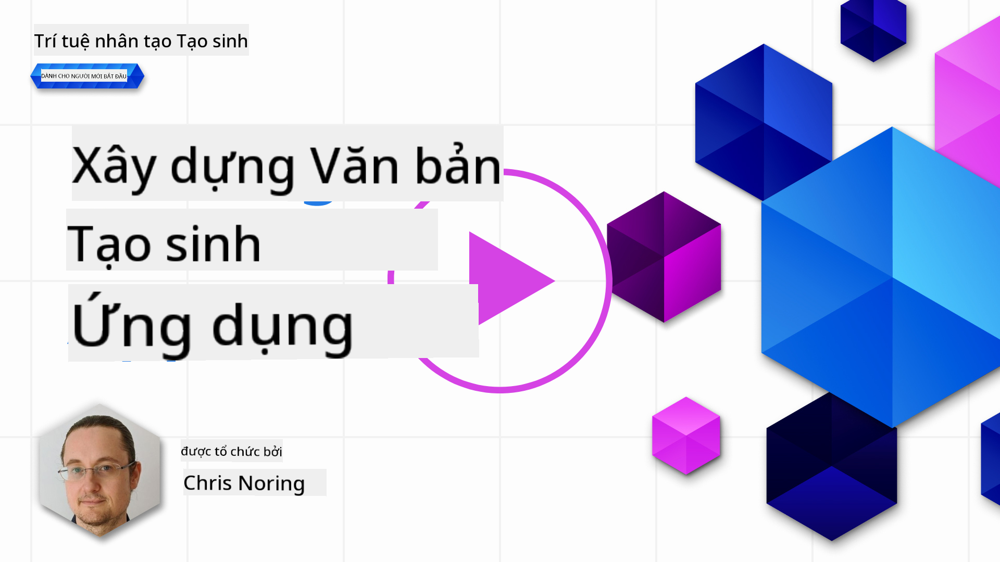

<!--
CO_OP_TRANSLATOR_METADATA:
{
  "original_hash": "5ec6c92b629564538ef397c550adb73e",
  "translation_date": "2025-05-19T17:08:03+00:00",
  "source_file": "06-text-generation-apps/README.md",
  "language_code": "vi"
}
-->
# Xây dựng ứng dụng tạo văn bản

[](https://aka.ms/gen-ai-lesson6-gh?WT.mc_id=academic-105485-koreyst)

> _(Nhấp vào hình ảnh trên để xem video của bài học này)_

Bạn đã thấy qua chương trình học này rằng có những khái niệm cốt lõi như prompts và thậm chí là một lĩnh vực gọi là "kỹ thuật prompts". Nhiều công cụ bạn có thể tương tác như ChatGPT, Office 365, Microsoft Power Platform và nhiều hơn nữa, hỗ trợ bạn sử dụng prompts để hoàn thành một điều gì đó.

Để bạn thêm trải nghiệm như vậy vào một ứng dụng, bạn cần hiểu các khái niệm như prompts, completions và chọn một thư viện để làm việc. Đó chính xác là những gì bạn sẽ học trong chương này.

## Giới thiệu

Trong chương này, bạn sẽ:

- Tìm hiểu về thư viện openai và các khái niệm cốt lõi của nó.
- Xây dựng ứng dụng tạo văn bản bằng openai.
- Hiểu cách sử dụng các khái niệm như prompt, temperature và tokens để xây dựng ứng dụng tạo văn bản.

## Mục tiêu học tập

Cuối bài học này, bạn sẽ có thể:

- Giải thích ứng dụng tạo văn bản là gì.
- Xây dựng ứng dụng tạo văn bản bằng openai.
- Cấu hình ứng dụng của bạn để sử dụng nhiều hoặc ít tokens hơn và cũng thay đổi temperature, để có kết quả đầu ra đa dạng.

## Ứng dụng tạo văn bản là gì?

Thông thường khi bạn xây dựng một ứng dụng, nó có một loại giao diện nào đó như sau:

- Dựa trên lệnh. Ứng dụng console là các ứng dụng điển hình nơi bạn gõ một lệnh và nó thực hiện một tác vụ. Ví dụ, `git` là một ứng dụng dựa trên lệnh.
- Giao diện người dùng (UI). Một số ứng dụng có giao diện người dùng đồ họa (GUIs) nơi bạn nhấp vào nút, nhập văn bản, chọn tùy chọn và nhiều hơn nữa.

### Ứng dụng console và UI có giới hạn

So sánh với một ứng dụng dựa trên lệnh nơi bạn gõ một lệnh:

- **Có giới hạn**. Bạn không thể chỉ gõ bất kỳ lệnh nào, chỉ những lệnh mà ứng dụng hỗ trợ.
- **Ngôn ngữ cụ thể**. Một số ứng dụng hỗ trợ nhiều ngôn ngữ, nhưng theo mặc định ứng dụng được xây dựng cho một ngôn ngữ cụ thể, ngay cả khi bạn có thể thêm hỗ trợ ngôn ngữ khác.

### Lợi ích của ứng dụng tạo văn bản

Vậy ứng dụng tạo văn bản khác biệt như thế nào?

Trong một ứng dụng tạo văn bản, bạn có nhiều linh hoạt hơn, bạn không bị giới hạn bởi một tập hợp các lệnh hoặc một ngôn ngữ đầu vào cụ thể. Thay vào đó, bạn có thể sử dụng ngôn ngữ tự nhiên để tương tác với ứng dụng. Một lợi ích khác là vì bạn đã tương tác với một nguồn dữ liệu đã được huấn luyện trên một tập hợp thông tin rộng lớn, trong khi một ứng dụng truyền thống có thể bị giới hạn trong những gì có trong cơ sở dữ liệu.

### Tôi có thể xây dựng gì với ứng dụng tạo văn bản?

Có nhiều thứ bạn có thể xây dựng. Ví dụ:

- **Chatbot**. Một chatbot trả lời câu hỏi về các chủ đề, như công ty của bạn và sản phẩm của nó có thể là một lựa chọn tốt.
- **Trợ lý**. LLMs rất giỏi trong việc tóm tắt văn bản, lấy thông tin từ văn bản, tạo văn bản như sơ yếu lý lịch và nhiều hơn nữa.
- **Trợ lý mã**. Tùy thuộc vào mô hình ngôn ngữ bạn sử dụng, bạn có thể xây dựng một trợ lý mã giúp bạn viết mã. Ví dụ, bạn có thể sử dụng sản phẩm như GitHub Copilot cũng như ChatGPT để giúp bạn viết mã.

## Làm thế nào để bắt đầu?

Chà, bạn cần tìm cách tích hợp với một LLM, thường bao gồm hai cách tiếp cận sau:

- Sử dụng API. Ở đây bạn đang xây dựng các yêu cầu web với prompt của bạn và nhận văn bản được tạo lại.
- Sử dụng thư viện. Thư viện giúp đóng gói các cuộc gọi API và làm cho chúng dễ sử dụng hơn.

## Thư viện/SDKs

Có một số thư viện nổi tiếng để làm việc với LLMs như:

- **openai**, thư viện này làm cho việc kết nối với mô hình của bạn và gửi prompts trở nên dễ dàng.

Sau đó có các thư viện hoạt động ở mức độ cao hơn như:

- **Langchain**. Langchain rất nổi tiếng và hỗ trợ Python.
- **Semantic Kernel**. Semantic Kernel là một thư viện của Microsoft hỗ trợ các ngôn ngữ C#, Python và Java.

## Ứng dụng đầu tiên sử dụng openai

Hãy xem cách chúng ta có thể xây dựng ứng dụng đầu tiên của mình, cần những thư viện nào, yêu cầu bao nhiêu và nhiều hơn nữa.

### Cài đặt openai

Có nhiều thư viện ngoài kia để tương tác với OpenAI hoặc Azure OpenAI. Có thể sử dụng nhiều ngôn ngữ lập trình như C#, Python, JavaScript, Java và nhiều hơn nữa. Chúng tôi đã chọn sử dụng thư viện `openai` Python, vì vậy chúng tôi sẽ sử dụng `pip` để cài đặt nó.

```bash
pip install openai
```

### Tạo một tài nguyên

Bạn cần thực hiện các bước sau:

- Tạo một tài khoản trên Azure [https://azure.microsoft.com/free/](https://azure.microsoft.com/free/?WT.mc_id=academic-105485-koreyst).
- Truy cập vào Azure OpenAI. Đi đến [https://learn.microsoft.com/azure/ai-services/openai/overview#how-do-i-get-access-to-azure-openai](https://learn.microsoft.com/azure/ai-services/openai/overview#how-do-i-get-access-to-azure-openai?WT.mc_id=academic-105485-koreyst) và yêu cầu truy cập.

  > [!NOTE]
  > Tại thời điểm viết bài, bạn cần đăng ký để truy cập vào Azure OpenAI.

- Cài đặt Python <https://www.python.org/>
- Đã tạo một tài nguyên Dịch vụ Azure OpenAI. Xem hướng dẫn này để biết cách [tạo tài nguyên](https://learn.microsoft.com/azure/ai-services/openai/how-to/create-resource?pivots=web-portal?WT.mc_id=academic-105485-koreyst).

### Tìm khóa API và endpoint

Tại thời điểm này, bạn cần cho thư viện `openai` biết khóa API nào để sử dụng. Để tìm khóa API của bạn, hãy đi đến phần "Keys and Endpoint" của tài nguyên Azure OpenAI của bạn và sao chép giá trị "Key 1".


Bây giờ bạn đã sao chép thông tin này, hãy hướng dẫn các thư viện sử dụng nó.

> [!NOTE]
> Đáng để tách khóa API của bạn ra khỏi mã. Bạn có thể làm như vậy bằng cách sử dụng biến môi trường.
>
> - Đặt biến môi trường `OPENAI_API_KEY` to your API key.
>   `export OPENAI_API_KEY='sk-...'`

### Thiết lập cấu hình Azure

Nếu bạn đang sử dụng Azure OpenAI, đây là cách bạn thiết lập cấu hình:

```python
openai.api_type = 'azure'
openai.api_key = os.environ["OPENAI_API_KEY"]
openai.api_version = '2023-05-15'
openai.api_base = os.getenv("API_BASE")
```

Ở trên, chúng ta đang thiết lập những điều sau:

- `api_type` to `azure`. This tells the library to use Azure OpenAI and not OpenAI.
- `api_key`, this is your API key found in the Azure Portal.
- `api_version`, this is the version of the API you want to use. At the time of writing, the latest version is `2023-05-15`.
- `api_base`, this is the endpoint of the API. You can find it in the Azure Portal next to your API key.

> [!NOTE] > `os.getenv` is a function that reads environment variables. You can use it to read environment variables like `OPENAI_API_KEY` and `API_BASE`. Set these environment variables in your terminal or by using a library like `dotenv`.

## Generate text

The way to generate text is to use the `Completion` class. Đây là một ví dụ:

```python
prompt = "Complete the following: Once upon a time there was a"

completion = openai.Completion.create(model="davinci-002", prompt=prompt)
print(completion.choices[0].text)
```

Trong mã trên, chúng ta tạo một đối tượng completion và truyền vào mô hình chúng ta muốn sử dụng và prompt. Sau đó, chúng ta in ra văn bản được tạo.

### Chat completions

Cho đến nay, bạn đã thấy cách chúng ta đã sử dụng `Completion` to generate text. But there's another class called `ChatCompletion` phù hợp hơn cho chatbots. Đây là một ví dụ về cách sử dụng nó:

```python
import openai

openai.api_key = "sk-..."

completion = openai.ChatCompletion.create(model="gpt-3.5-turbo", messages=[{"role": "user", "content": "Hello world"}])
print(completion.choices[0].message.content)
```

Thêm về chức năng này trong chương tiếp theo.

## Bài tập - ứng dụng tạo văn bản đầu tiên của bạn

Bây giờ chúng ta đã học cách thiết lập và cấu hình openai, đã đến lúc xây dựng ứng dụng tạo văn bản đầu tiên của bạn. Để xây dựng ứng dụng của bạn, hãy làm theo các bước sau:

1. Tạo một môi trường ảo và cài đặt openai:

   ```bash
   python -m venv venv
   source venv/bin/activate
   pip install openai
   ```

   > [!NOTE]
   > Nếu bạn đang sử dụng Windows, hãy gõ `venv\Scripts\activate` instead of `source venv/bin/activate`.

   > [!NOTE]
   > Locate your Azure OpenAI key by going to [https://portal.azure.com/](https://portal.azure.com/?WT.mc_id=academic-105485-koreyst) and search for `Open AI` and select the `Open AI resource` and then select `Keys and Endpoint` and copy the `Key 1` value.

1. Tạo một tệp _app.py_ và cho nó mã sau:

   ```python
   import openai

   openai.api_key = "<replace this value with your open ai key or Azure OpenAI key>"

   openai.api_type = 'azure'
   openai.api_version = '2023-05-15'
   openai.api_base = "<endpoint found in Azure Portal where your API key is>"
   deployment_name = "<deployment name>"

   # add your completion code
   prompt = "Complete the following: Once upon a time there was a"
   messages = [{"role": "user", "content": prompt}]

   # make completion
   completion = openai.chat.completions.create(model=deployment_name, messages=messages)

   # print response
   print(completion.choices[0].message.content)
   ```

   > [!NOTE]
   > Nếu bạn đang sử dụng Azure OpenAI, bạn cần đặt `api_type` to `azure` and set the `api_key` thành khóa Azure OpenAI của bạn.

   Bạn sẽ thấy một đầu ra giống như sau:

   ```output
    very unhappy _____.

   Once upon a time there was a very unhappy mermaid.
   ```

## Các loại prompts khác nhau cho các mục đích khác nhau

Bây giờ bạn đã thấy cách tạo văn bản bằng một prompt. Bạn thậm chí có một chương trình đang chạy mà bạn có thể sửa đổi và thay đổi để tạo ra các loại văn bản khác nhau.

Prompts có thể được sử dụng cho nhiều nhiệm vụ. Ví dụ:

- **Tạo một loại văn bản**. Ví dụ, bạn có thể tạo một bài thơ, câu hỏi cho một cuộc thi v.v.
- **Tra cứu thông tin**. Bạn có thể sử dụng prompts để tìm kiếm thông tin như ví dụ sau 'CORS có nghĩa là gì trong phát triển web?'.
- **Tạo mã**. Bạn có thể sử dụng prompts để tạo mã, ví dụ phát triển một biểu thức chính quy dùng để xác thực email hoặc tại sao không tạo một chương trình hoàn chỉnh, như một ứng dụng web?

## Một trường hợp sử dụng thực tế hơn: trình tạo công thức

Hãy tưởng tượng bạn có các nguyên liệu ở nhà và bạn muốn nấu gì đó. Để làm điều đó, bạn cần một công thức. Một cách để tìm công thức là sử dụng công cụ tìm kiếm hoặc bạn có thể sử dụng một LLM để làm điều đó.

Bạn có thể viết một prompt như sau:

> "Hiển thị cho tôi 5 công thức cho một món ăn với các nguyên liệu sau: gà, khoai tây và cà rốt. Mỗi công thức, liệt kê tất cả các nguyên liệu được sử dụng"

Dựa trên prompt trên, bạn có thể nhận được một phản hồi tương tự như:

```output
1. Roasted Chicken and Vegetables:
Ingredients:
- 4 chicken thighs
- 2 potatoes, cut into cubes
- 2 carrots, cut into cubes
- 2 tablespoons olive oil
- 2 cloves garlic, minced
- 1 teaspoon dried thyme
- 1 teaspoon dried oregano
- Salt and pepper, to taste

2. Chicken and Potato Stew:
Ingredients:
- 2 tablespoons olive oil
- 1 onion, diced
- 2 cloves garlic, minced
- 2 chicken breasts, cut into cubes
- 2 potatoes, cut into cubes
- 2 carrots, cut into cubes
- 1 teaspoon dried oregano
- 1 teaspoon dried thyme
- 1 cup chicken broth
- Salt and pepper, to taste

3. Chicken and Potato Bake:
Ingredients:
- 2 tablespoons olive oil
- 2 chicken breasts, cut into cubes
- 2 potatoes, cut into cubes
- 2 carrots, cut into cubes
- 1 onion, diced
- 2 cloves garlic, minced
- 1 teaspoon dried oregano
- 1 teaspoon dried thyme
- 1 cup chicken broth
- Salt and pepper, to taste

4. Chicken and Potato Soup:
Ingredients:
- 2 tablespoons olive oil
- 1 onion, diced
- 2 cloves garlic, minced
- 2 chicken breasts, cut into cubes
- 2 potatoes, cut into cubes
- 2 carrots, cut into cubes
- 1 teaspoon dried oregano
- 1 teaspoon dried thyme
- 4 cups chicken broth
- Salt and pepper, to taste

5. Chicken and Potato Hash:
Ingredients:
- 2 tablespoons olive oil
- 2 chicken breasts, cut into cubes
- 2 potatoes, cut into cubes
- 2 carrots, cut into cubes
- 1 onion, diced
- 2 cloves garlic, minced
- 1 teaspoon dried oregano
```

Kết quả này rất tuyệt, tôi biết phải nấu gì. Tại thời điểm này, những cải tiến hữu ích có thể là:

- Loại bỏ các nguyên liệu tôi không thích hoặc bị dị ứng.
- Tạo ra một danh sách mua sắm, trong trường hợp tôi không có tất cả các nguyên liệu ở nhà.

Đối với các trường hợp trên, hãy thêm một prompt bổ sung:

> "Vui lòng loại bỏ các công thức có tỏi vì tôi bị dị ứng và thay thế nó bằng một thứ khác. Ngoài ra, hãy tạo ra một danh sách mua sắm cho các công thức, xem xét tôi đã có gà, khoai tây và cà rốt ở nhà."

Bây giờ bạn có một kết quả mới, cụ thể là:

```output
1. Roasted Chicken and Vegetables:
Ingredients:
- 4 chicken thighs
- 2 potatoes, cut into cubes
- 2 carrots, cut into cubes
- 2 tablespoons olive oil
- 1 teaspoon dried thyme
- 1 teaspoon dried oregano
- Salt and pepper, to taste

2. Chicken and Potato Stew:
Ingredients:
- 2 tablespoons olive oil
- 1 onion, diced
- 2 chicken breasts, cut into cubes
- 2 potatoes, cut into cubes
- 2 carrots, cut into cubes
- 1 teaspoon dried oregano
- 1 teaspoon dried thyme
- 1 cup chicken broth
- Salt and pepper, to taste

3. Chicken and Potato Bake:
Ingredients:
- 2 tablespoons olive oil
- 2 chicken breasts, cut into cubes
- 2 potatoes, cut into cubes
- 2 carrots, cut into cubes
- 1 onion, diced
- 1 teaspoon dried oregano
- 1 teaspoon dried thyme
- 1 cup chicken broth
- Salt and pepper, to taste

4. Chicken and Potato Soup:
Ingredients:
- 2 tablespoons olive oil
- 1 onion, diced
- 2 chicken breasts, cut into cubes
- 2 potatoes, cut into cubes
- 2 carrots, cut into cubes
- 1 teaspoon dried oregano
- 1 teaspoon dried thyme
- 4 cups chicken broth
- Salt and pepper, to taste

5. Chicken and Potato Hash:
Ingredients:
- 2 tablespoons olive oil
- 2 chicken breasts, cut into cubes
- 2 potatoes, cut into cubes
- 2 carrots, cut into cubes
- 1 onion, diced
- 1 teaspoon dried oregano

Shopping List:
- Olive oil
- Onion
- Thyme
- Oregano
- Salt
- Pepper
```

Đó là năm công thức của bạn, không có tỏi được đề cập và bạn cũng có một danh sách mua sắm xem xét những gì bạn đã có ở nhà.

## Bài tập - xây dựng trình tạo công thức

Bây giờ chúng ta đã diễn ra một kịch bản, hãy viết mã để phù hợp với kịch bản đã trình bày. Để làm điều đó, hãy làm theo các bước sau:

1. Sử dụng tệp _app.py_ hiện có làm điểm bắt đầu
1. Tìm biến `prompt` và thay đổi mã của nó thành mã sau:

   ```python
   prompt = "Show me 5 recipes for a dish with the following ingredients: chicken, potatoes, and carrots. Per recipe, list all the ingredients used"
   ```

   Nếu bạn chạy mã bây giờ, bạn sẽ thấy một đầu ra tương tự như:

   ```output
   -Chicken Stew with Potatoes and Carrots: 3 tablespoons oil, 1 onion, chopped, 2 cloves garlic, minced, 1 carrot, peeled and chopped, 1 potato, peeled and chopped, 1 bay leaf, 1 thyme sprig, 1/2 teaspoon salt, 1/4 teaspoon black pepper, 1 1/2 cups chicken broth, 1/2 cup dry white wine, 2 tablespoons chopped fresh parsley, 2 tablespoons unsalted butter, 1 1/2 pounds boneless, skinless chicken thighs, cut into 1-inch pieces
   -Oven-Roasted Chicken with Potatoes and Carrots: 3 tablespoons extra-virgin olive oil, 1 tablespoon Dijon mustard, 1 tablespoon chopped fresh rosemary, 1 tablespoon chopped fresh thyme, 4 cloves garlic, minced, 1 1/2 pounds small red potatoes, quartered, 1 1/2 pounds carrots, quartered lengthwise, 1/2 teaspoon salt, 1/4 teaspoon black pepper, 1 (4-pound) whole chicken
   -Chicken, Potato, and Carrot Casserole: cooking spray, 1 large onion, chopped, 2 cloves garlic, minced, 1 carrot, peeled and shredded, 1 potato, peeled and shredded, 1/2 teaspoon dried thyme leaves, 1/4 teaspoon salt, 1/4 teaspoon black pepper, 2 cups fat-free, low-sodium chicken broth, 1 cup frozen peas, 1/4 cup all-purpose flour, 1 cup 2% reduced-fat milk, 1/4 cup grated Parmesan cheese

   -One Pot Chicken and Potato Dinner: 2 tablespoons olive oil, 1 pound boneless, skinless chicken thighs, cut into 1-inch pieces, 1 large onion, chopped, 3 cloves garlic, minced, 1 carrot, peeled and chopped, 1 potato, peeled and chopped, 1 bay leaf, 1 thyme sprig, 1/2 teaspoon salt, 1/4 teaspoon black pepper, 2 cups chicken broth, 1/2 cup dry white wine

   -Chicken, Potato, and Carrot Curry: 1 tablespoon vegetable oil, 1 large onion, chopped, 2 cloves garlic, minced, 1 carrot, peeled and chopped, 1 potato, peeled and chopped, 1 teaspoon ground coriander, 1 teaspoon ground cumin, 1/2 teaspoon ground turmeric, 1/2 teaspoon ground ginger, 1/4 teaspoon cayenne pepper, 2 cups chicken broth, 1/2 cup dry white wine, 1 (15-ounce) can chickpeas, drained and rinsed, 1/2 cup raisins, 1/2 cup chopped fresh cilantro
   ```

   > Lưu ý, LLM của bạn không xác định, vì vậy bạn có thể nhận được kết quả khác nhau mỗi khi bạn chạy chương trình.

   Tuyệt vời, hãy xem cách chúng ta có thể cải thiện mọi thứ. Để cải thiện mọi thứ, chúng ta muốn đảm bảo mã linh hoạt, vì vậy các nguyên liệu và số lượng công thức có thể được cải thiện và thay đổi.

1. Hãy thay đổi mã theo cách sau:

   ```python
   no_recipes = input("No of recipes (for example, 5): ")

   ingredients = input("List of ingredients (for example, chicken, potatoes, and carrots): ")

   # interpolate the number of recipes into the prompt an ingredients
   prompt = f"Show me {no_recipes} recipes for a dish with the following ingredients: {ingredients}. Per recipe, list all the ingredients used"
   ```

   Thực hiện kiểm tra mã có thể trông như thế này:

   ```output
   No of recipes (for example, 5): 3
   List of ingredients (for example, chicken, potatoes, and carrots): milk,strawberries

   -Strawberry milk shake: milk, strawberries, sugar, vanilla extract, ice cubes
   -Strawberry shortcake: milk, flour, baking powder, sugar, salt, unsalted butter, strawberries, whipped cream
   -Strawberry milk: milk, strawberries, sugar, vanilla extract
   ```

### Cải thiện bằng cách thêm bộ lọc và danh sách mua sắm

Chúng ta hiện có một ứng dụng hoạt động có khả năng tạo ra các công thức và nó linh hoạt vì nó dựa vào đầu vào từ người dùng, cả về số lượng công thức và cả các nguyên liệu được sử dụng.

Để cải thiện thêm, chúng ta muốn thêm những điều sau:

- **Loại bỏ các nguyên liệu**. Chúng ta muốn có khả năng loại bỏ các nguyên liệu mà chúng ta không thích hoặc bị dị ứng. Để thực hiện thay đổi này, chúng ta có thể chỉnh sửa prompt hiện có của mình và thêm một điều kiện lọc vào cuối nó như sau:

  ```python
  filter = input("Filter (for example, vegetarian, vegan, or gluten-free): ")

  prompt = f"Show me {no_recipes} recipes for a dish with the following ingredients: {ingredients}. Per recipe, list all the ingredients used, no {filter}"
  ```

  Ở trên, chúng ta thêm `{filter}` vào cuối prompt và chúng ta cũng thu thập giá trị filter từ người dùng.

  Một ví dụ đầu vào khi chạy chương trình bây giờ có thể trông như sau:

  ```output
  No of recipes (for example, 5): 3
  List of ingredients (for example, chicken, potatoes, and carrots): onion,milk
  Filter (for example, vegetarian, vegan, or gluten-free): no milk

  1. French Onion Soup

  Ingredients:

  -1 large onion, sliced
  -3 cups beef broth
  -1 cup milk
  -6 slices french bread
  -1/4 cup shredded Parmesan cheese
  -1 tablespoon butter
  -1 teaspoon dried thyme
  -1/4 teaspoon salt
  -1/4 teaspoon black pepper

  Instructions:

  1. In a large pot, sauté onions in butter until golden brown.
  2. Add beef broth, milk, thyme, salt, and pepper. Bring to a boil.
  3. Reduce heat and simmer for 10 minutes.
  4. Place french bread slices on soup bowls.
  5. Ladle soup over bread.
  6. Sprinkle with Parmesan cheese.

  2. Onion and Potato Soup

  Ingredients:

  -1 large onion, chopped
  -2 cups potatoes, diced
  -3 cups vegetable broth
  -1 cup milk
  -1/4 teaspoon black pepper

  Instructions:

  1. In a large pot, sauté onions in butter until golden brown.
  2. Add potatoes, vegetable broth, milk, and pepper. Bring to a boil.
  3. Reduce heat and simmer for 10 minutes.
  4. Serve hot.

  3. Creamy Onion Soup

  Ingredients:

  -1 large onion, chopped
  -3 cups vegetable broth
  -1 cup milk
  -1/4 teaspoon black pepper
  -1/4 cup all-purpose flour
  -1/2 cup shredded Parmesan cheese

  Instructions:

  1. In a large pot, sauté onions in butter until golden brown.
  2. Add vegetable broth, milk, and pepper. Bring to a boil.
  3. Reduce heat and simmer for 10 minutes.
  4. In a small bowl, whisk together flour and Parmesan cheese until smooth.
  5. Add to soup and simmer for an additional 5 minutes, or until soup has thickened.
  ```

  Như bạn thấy, bất kỳ công thức nào có sữa đều đã bị loại bỏ. Nhưng, nếu bạn không dung nạp lactose, bạn có thể muốn loại bỏ các công thức có phô mai trong đó, vì vậy có nhu cầu rõ ràng.

- **Tạo ra một danh sách mua sắm**. Chúng ta muốn tạo ra một danh sách mua sắm, xem xét những gì chúng ta đã có ở nhà.

  Đối với chức năng này, chúng ta có thể cố gắng giải quyết mọi thứ trong một prompt hoặc chúng ta có thể chia nó thành hai prompts. Hãy thử cách tiếp cận sau. Ở đây chúng ta đang đề xuất thêm một prompt bổ sung, nhưng để điều đó hoạt động, chúng ta cần thêm kết quả của prompt trước làm ngữ cảnh cho prompt sau.

  Tìm phần trong mã in ra kết quả từ prompt đầu tiên và thêm mã sau vào dưới:

  ```python
  old_prompt_result = completion.choices[0].message.content
  prompt = "Produce a shopping list for the generated recipes and please don't include ingredients that I already have."

  new_prompt = f"{old_prompt_result} {prompt}"
  messages = [{"role": "user", "content": new_prompt}]
  completion = openai.Completion.create(engine=deployment_name, messages=messages, max_tokens=1200)

  # print response
  print("Shopping list:")
  print(completion.choices[0].message.content)
  ```

  Lưu ý những điều sau:

  1. Chúng ta đang xây dựng một prompt mới bằng cách thêm kết quả từ prompt đầu tiên vào prompt mới:

     ```python
     new_prompt = f"{old_prompt_result} {prompt}"
     ```

  1. Chúng ta thực hiện một yêu cầu mới, nhưng cũng xem xét số lượng tokens chúng ta yêu cầu trong prompt đầu tiên, vì vậy lần này chúng ta nói `max_tokens` là 1200.

     ```python
     completion = openai.Completion.create(engine=deployment_name, prompt=new_prompt, max_tokens=1200)
     ```

     Thực hiện mã này, chúng ta bây giờ đạt được kết quả sau:

     ```output
     No of recipes (for example, 5): 2
     List of ingredients (for example, chicken, potatoes, and carrots): apple,flour
     Filter (for example, vegetarian, vegan, or gluten-free): sugar


     -Apple and flour pancakes: 1 cup flour, 1/2 tsp baking powder, 1/2 tsp baking soda, 1/4 tsp salt, 1 tbsp sugar, 1 egg, 1 cup buttermilk or sour milk, 1/4 cup melted butter, 1 Granny Smith apple, peeled and grated
     -Apple fritters: 1-1/2 cups flour, 1 tsp baking powder, 1/4 tsp salt, 1/4 tsp baking soda, 1/4 tsp nutmeg, 1/4 tsp cinnamon, 1/4 tsp allspice, 1/4 cup sugar, 1/4 cup vegetable shortening, 1/4 cup milk, 1 egg, 2 cups shredded, peeled apples
     Shopping list:
     -Flour, baking powder, baking soda, salt, sugar, egg, buttermilk, butter, apple, nutmeg, cinnamon, allspice
     ```

## Cải thiện cấu hình của bạn

Những gì chúng ta có cho đến nay là mã hoạt động, nhưng có một số điều chỉnh chúng ta nên thực hiện để cải thiện mọi thứ hơn nữa. Một số điều chúng ta nên làm là:

- **Tách biệt các thông tin bí mật khỏi mã**, như khóa API. Thông tin bí mật không thuộc về mã và nên được lưu trữ ở một vị trí an toàn. Để tách biệt thông tin bí mật khỏi mã, chúng ta có thể sử dụng biến môi trường và thư viện như `python-dotenv` to load them from a file. Here's how that would look like in code:

  1. Create a `.env` với nội dung sau:

     ```bash
     OPENAI_API_KEY=sk-...
     ```

     > Lưu ý, đối với Azure, bạn cần đặt các biến môi trường sau:

     ```bash
     OPENAI_API_TYPE=azure
     OPENAI_API_VERSION=2023-05-15
     OPENAI_API_BASE=<replace>
     ```

     Trong mã, bạn sẽ tải các biến môi trường như sau:

     ```python
     from dotenv import load_dotenv

     load_dotenv()

     openai.api_key = os.environ["OPENAI_API_KEY"]
     ```

- **Một lời về độ dài token**. Chúng ta nên xem xét số lượng tokens cần thiết để tạo ra văn bản chúng ta muốn. Tokens tốn tiền, vì vậy nếu có thể, chúng ta nên cố gắng tiết kiệm số lượng tokens chúng ta sử dụng. Ví dụ, chúng ta có thể diễn đạt prompt sao cho chúng ta có thể sử dụng ít tokens hơn không?

  Để thay đổi số lượng tokens sử dụng, bạn có thể sử dụng tham số `max_tokens`. Ví dụ, nếu bạn muốn sử dụng 100 tokens, bạn sẽ làm như sau:

  ```python
  completion = client.chat.completions.create(model=deployment, messages=messages, max_tokens=100)
  ```

- **Thử nghiệm với temperature**. Temperature là một điều chúng ta chưa đề cập cho đến nay nhưng là một ngữ cảnh quan trọng đối với cách chương trình của chúng ta hoạt động. Giá trị temperature càng cao, kết quả đầu ra càng ngẫu nhiên. Ngược lại, giá trị temperature càng thấp, kết quả đầu ra càng dự đoán được. Hãy xem xét liệu bạn có muốn sự biến đổi trong kết quả đầu ra của mình hay không.

  Để thay đổi temperature, bạn có thể sử dụng tham số `temperature`. Ví dụ, nếu bạn muốn sử dụng temperature là 0.5, bạn sẽ làm như sau:

  ```python
  completion = client.chat.completions.create(model=deployment, messages=messages, temperature=0.5)
  ```

  > Lưu ý, càng gần 1.0, kết quả đầu ra càng đa dạng.

## Bài tập

Đối với bài tập này, bạn có thể chọn những gì để xây dựng.

Dưới đây là một số gợi ý:

- Tinh chỉnh ứng dụng trình tạo công thức để cải thiện nó thêm. Thử nghiệm với các giá trị temperature, và các prompts để xem bạn có thể làm gì.
- Xây dựng một "người bạn học". Ứng dụng này nên có khả năng trả lời câu hỏi về một chủ đề, ví dụ Python, bạn có thể có các prompts như "Một chủ đề nhất định

**Tuyên bố miễn trừ trách nhiệm**:  
Tài liệu này đã được dịch bằng dịch vụ dịch thuật AI [Co-op Translator](https://github.com/Azure/co-op-translator). Mặc dù chúng tôi cố gắng đảm bảo độ chính xác, xin lưu ý rằng các bản dịch tự động có thể chứa lỗi hoặc sự không chính xác. Tài liệu gốc bằng ngôn ngữ bản địa nên được coi là nguồn thông tin chính thức. Đối với thông tin quan trọng, nên sử dụng dịch vụ dịch thuật chuyên nghiệp của con người. Chúng tôi không chịu trách nhiệm cho bất kỳ sự hiểu lầm hoặc diễn giải sai nào phát sinh từ việc sử dụng bản dịch này.