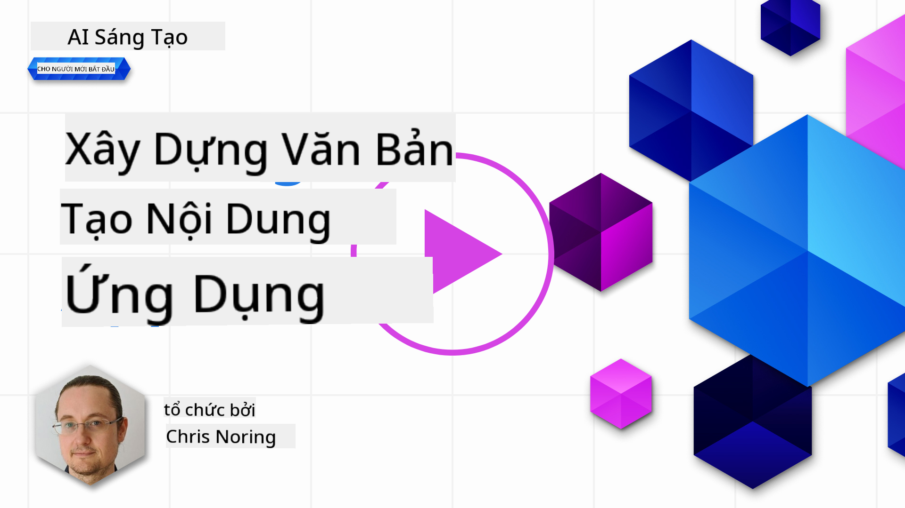

<!--
CO_OP_TRANSLATOR_METADATA:
{
  "original_hash": "5ec6c92b629564538ef397c550adb73e",
  "translation_date": "2025-06-25T14:37:34+00:00",
  "source_file": "06-text-generation-apps/README.md",
  "language_code": "vi"
}
-->
# Xây dựng ứng dụng tạo văn bản

[](https://aka.ms/gen-ai-lesson6-gh?WT.mc_id=academic-105485-koreyst)

> _(Nhấn vào hình trên để xem video của bài học này)_

Cho đến nay, bạn đã thấy qua chương trình học này rằng có những khái niệm cốt lõi như lời nhắc và thậm chí có cả một ngành học gọi là "kỹ thuật lời nhắc". Nhiều công cụ bạn có thể tương tác như ChatGPT, Office 365, Microsoft Power Platform và nhiều hơn nữa, hỗ trợ bạn sử dụng lời nhắc để thực hiện điều gì đó.

Để bạn có thể thêm trải nghiệm như vậy vào một ứng dụng, bạn cần hiểu các khái niệm như lời nhắc, hoàn thành và chọn một thư viện để làm việc. Đó chính xác là những gì bạn sẽ học trong chương này.

## Giới thiệu

Trong chương này, bạn sẽ:

- Tìm hiểu về thư viện openai và các khái niệm cốt lõi của nó.
- Xây dựng một ứng dụng tạo văn bản bằng openai.
- Hiểu cách sử dụng các khái niệm như lời nhắc, nhiệt độ, và token để xây dựng một ứng dụng tạo văn bản.

## Mục tiêu học tập

Kết thúc bài học này, bạn sẽ có thể:

- Giải thích một ứng dụng tạo văn bản là gì.
- Xây dựng một ứng dụng tạo văn bản bằng openai.
- Cấu hình ứng dụng của bạn để sử dụng nhiều hoặc ít token hơn và cũng thay đổi nhiệt độ, để có đầu ra đa dạng.

## Ứng dụng tạo văn bản là gì?

Thông thường khi bạn xây dựng một ứng dụng, nó có một số loại giao diện như sau:

- Dựa trên lệnh. Ứng dụng console là những ứng dụng điển hình nơi bạn nhập một lệnh và nó thực hiện một nhiệm vụ. Ví dụ, `git` là một ứng dụng dựa trên lệnh.
- Giao diện người dùng (UI). Một số ứng dụng có giao diện người dùng đồ họa (GUI) nơi bạn nhấn nút, nhập văn bản, chọn tùy chọn và nhiều hơn nữa.

### Ứng dụng console và UI bị giới hạn

So sánh với một ứng dụng dựa trên lệnh nơi bạn nhập một lệnh:

- **Nó bị giới hạn**. Bạn không thể chỉ nhập bất kỳ lệnh nào, chỉ những lệnh mà ứng dụng hỗ trợ.
- **Ngôn ngữ cụ thể**. Một số ứng dụng hỗ trợ nhiều ngôn ngữ, nhưng mặc định ứng dụng được xây dựng cho một ngôn ngữ cụ thể, ngay cả khi bạn có thể thêm hỗ trợ ngôn ngữ khác.

### Lợi ích của ứng dụng tạo văn bản

Vậy ứng dụng tạo văn bản khác biệt như thế nào?

Trong một ứng dụng tạo văn bản, bạn có nhiều sự linh hoạt hơn, bạn không bị giới hạn bởi một tập hợp các lệnh hoặc một ngôn ngữ đầu vào cụ thể. Thay vào đó, bạn có thể sử dụng ngôn ngữ tự nhiên để tương tác với ứng dụng. Một lợi ích khác là bạn đã tương tác với một nguồn dữ liệu đã được đào tạo trên một kho tàng thông tin rộng lớn, trong khi một ứng dụng truyền thống có thể bị giới hạn bởi những gì có trong cơ sở dữ liệu.

### Tôi có thể xây dựng gì với một ứng dụng tạo văn bản?

Có nhiều thứ bạn có thể xây dựng. Ví dụ:

- **Một chatbot**. Một chatbot trả lời câu hỏi về các chủ đề, như công ty của bạn và các sản phẩm của nó có thể là một sự kết hợp tốt.
- **Trợ lý**. LLM rất tốt trong việc tóm tắt văn bản, lấy thông tin từ văn bản, sản xuất văn bản như sơ yếu lý lịch và nhiều hơn nữa.
- **Trợ lý mã**. Tùy thuộc vào mô hình ngôn ngữ bạn sử dụng, bạn có thể xây dựng một trợ lý mã giúp bạn viết mã. Ví dụ, bạn có thể sử dụng một sản phẩm như GitHub Copilot cũng như ChatGPT để giúp bạn viết mã.

## Làm thế nào để tôi bắt đầu?

Chà, bạn cần tìm một cách để tích hợp với một LLM thường bao gồm hai phương pháp sau:

- Sử dụng một API. Ở đây bạn đang xây dựng các yêu cầu web với lời nhắc của bạn và nhận lại văn bản được tạo ra.
- Sử dụng một thư viện. Thư viện giúp đóng gói các cuộc gọi API và làm cho chúng dễ sử dụng hơn.

## Thư viện/SDKs

Có một số thư viện nổi tiếng để làm việc với LLMs như:

- **openai**, thư viện này giúp dễ dàng kết nối với mô hình của bạn và gửi vào lời nhắc.

Sau đó có các thư viện hoạt động ở cấp cao hơn như:

- **Langchain**. Langchain nổi tiếng và hỗ trợ Python.
- **Semantic Kernel**. Semantic Kernel là một thư viện của Microsoft hỗ trợ các ngôn ngữ C#, Python và Java.

## Ứng dụng đầu tiên sử dụng openai

Hãy xem cách chúng ta có thể xây dựng ứng dụng đầu tiên của mình, cần những thư viện nào, cần bao nhiêu và v.v.

### Cài đặt openai

Có nhiều thư viện ngoài kia để tương tác với OpenAI hoặc Azure OpenAI. Có thể sử dụng nhiều ngôn ngữ lập trình khác nhau như C#, Python, JavaScript, Java và nhiều hơn nữa. Chúng tôi đã chọn sử dụng thư viện Python `openai`, vì vậy chúng tôi sẽ sử dụng `pip` để cài đặt nó.

```bash
pip install openai
```

### Tạo một tài nguyên

Bạn cần thực hiện các bước sau:

- Tạo một tài khoản trên Azure [https://azure.microsoft.com/free/](https://azure.microsoft.com/free/?WT.mc_id=academic-105485-koreyst).
- Truy cập vào Azure OpenAI. Đi tới [https://learn.microsoft.com/azure/ai-services/openai/overview#how-do-i-get-access-to-azure-openai](https://learn.microsoft.com/azure/ai-services/openai/overview#how-do-i-get-access-to-azure-openai?WT.mc_id=academic-105485-koreyst) và yêu cầu truy cập.

  > [!NOTE]
  > Tại thời điểm viết bài này, bạn cần đăng ký để truy cập vào Azure OpenAI.

- Cài đặt Python <https://www.python.org/>
- Đã tạo một tài nguyên Azure OpenAI Service. Xem hướng dẫn này để biết cách [tạo một tài nguyên](https://learn.microsoft.com/azure/ai-services/openai/how-to/create-resource?pivots=web-portal?WT.mc_id=academic-105485-koreyst).

### Xác định khóa API và điểm cuối

Tại thời điểm này, bạn cần thông báo cho thư viện `openai` của mình biết khóa API nào sẽ sử dụng. Để tìm khóa API của bạn, hãy đi tới phần "Keys and Endpoint" của tài nguyên Azure OpenAI của bạn và sao chép giá trị "Key 1".


Bây giờ bạn đã sao chép thông tin này, hãy hướng dẫn các thư viện sử dụng nó.

> [!NOTE]
> Đáng để tách biệt khóa API của bạn khỏi mã của bạn. Bạn có thể làm điều đó bằng cách sử dụng biến môi trường.
>
> - Đặt biến môi trường `OPENAI_API_KEY` to your API key.
>   `export OPENAI_API_KEY='sk-...'`

### Thiết lập cấu hình Azure

Nếu bạn đang sử dụng Azure OpenAI, đây là cách bạn thiết lập cấu hình:

```python
openai.api_type = 'azure'
openai.api_key = os.environ["OPENAI_API_KEY"]
openai.api_version = '2023-05-15'
openai.api_base = os.getenv("API_BASE")
```

Trên đây chúng tôi đang thiết lập các điều sau:

- `api_type` to `azure`. This tells the library to use Azure OpenAI and not OpenAI.
- `api_key`, this is your API key found in the Azure Portal.
- `api_version`, this is the version of the API you want to use. At the time of writing, the latest version is `2023-05-15`.
- `api_base`, this is the endpoint of the API. You can find it in the Azure Portal next to your API key.

> [!NOTE] > `os.getenv` is a function that reads environment variables. You can use it to read environment variables like `OPENAI_API_KEY` and `API_BASE`. Set these environment variables in your terminal or by using a library like `dotenv`.

## Generate text

The way to generate text is to use the `Completion` class. Dưới đây là một ví dụ:

```python
prompt = "Complete the following: Once upon a time there was a"

completion = openai.Completion.create(model="davinci-002", prompt=prompt)
print(completion.choices[0].text)
```

Trong mã trên, chúng tôi tạo một đối tượng hoàn thành và truyền vào mô hình mà chúng tôi muốn sử dụng và lời nhắc. Sau đó, chúng tôi in văn bản được tạo ra.

### Hoàn thành chat

Cho đến nay, bạn đã thấy cách chúng tôi đã sử dụng `Completion` to generate text. But there's another class called `ChatCompletion` phù hợp hơn cho chatbot. Dưới đây là một ví dụ về việc sử dụng nó:

```python
import openai

openai.api_key = "sk-..."

completion = openai.ChatCompletion.create(model="gpt-3.5-turbo", messages=[{"role": "user", "content": "Hello world"}])
print(completion.choices[0].message.content)
```

Thêm về chức năng này trong chương sắp tới.

## Bài tập - ứng dụng tạo văn bản đầu tiên của bạn

Bây giờ chúng ta đã học cách thiết lập và cấu hình openai, đã đến lúc xây dựng ứng dụng tạo văn bản đầu tiên của bạn. Để xây dựng ứng dụng của bạn, hãy thực hiện các bước sau:

1. Tạo một môi trường ảo và cài đặt openai:

   ```bash
   python -m venv venv
   source venv/bin/activate
   pip install openai
   ```

   > [!NOTE]
   > Nếu bạn đang sử dụng Windows, hãy nhập `venv\Scripts\activate` instead of `source venv/bin/activate`.

   > [!NOTE]
   > Locate your Azure OpenAI key by going to [https://portal.azure.com/](https://portal.azure.com/?WT.mc_id=academic-105485-koreyst) and search for `Open AI` and select the `Open AI resource` and then select `Keys and Endpoint` and copy the `Key 1` value.

1. Tạo một tệp _app.py_ và đưa vào mã sau:

   ```python
   import openai

   openai.api_key = "<replace this value with your open ai key or Azure OpenAI key>"

   openai.api_type = 'azure'
   openai.api_version = '2023-05-15'
   openai.api_base = "<endpoint found in Azure Portal where your API key is>"
   deployment_name = "<deployment name>"

   # add your completion code
   prompt = "Complete the following: Once upon a time there was a"
   messages = [{"role": "user", "content": prompt}]

   # make completion
   completion = openai.chat.completions.create(model=deployment_name, messages=messages)

   # print response
   print(completion.choices[0].message.content)
   ```

   > [!NOTE]
   > Nếu bạn đang sử dụng Azure OpenAI, bạn cần đặt `api_type` to `azure` and set the `api_key` thành khóa Azure OpenAI của bạn.

   Bạn sẽ thấy một đầu ra như sau:

   ```output
    very unhappy _____.

   Once upon a time there was a very unhappy mermaid.
   ```

## Các loại lời nhắc khác nhau, cho các mục đích khác nhau

Bây giờ bạn đã thấy cách tạo văn bản bằng cách sử dụng một lời nhắc. Bạn thậm chí đã có một chương trình hoạt động mà bạn có thể sửa đổi và thay đổi để tạo ra các loại văn bản khác nhau.

Lời nhắc có thể được sử dụng cho nhiều nhiệm vụ khác nhau. Ví dụ:

- **Tạo một loại văn bản**. Ví dụ, bạn có thể tạo một bài thơ, câu hỏi cho một bài kiểm tra, v.v.
- **Tra cứu thông tin**. Bạn có thể sử dụng lời nhắc để tìm kiếm thông tin như ví dụ sau 'CORS có nghĩa là gì trong phát triển web?'.
- **Tạo mã**. Bạn có thể sử dụng lời nhắc để tạo mã, ví dụ phát triển một biểu thức chính quy được sử dụng để xác thực email hoặc tại sao không tạo ra toàn bộ chương trình, như một ứng dụng web?

## Một trường hợp sử dụng thực tế hơn: trình tạo công thức nấu ăn

Hãy tưởng tượng bạn có nguyên liệu ở nhà và bạn muốn nấu một món gì đó. Để làm điều đó, bạn cần một công thức. Một cách để tìm công thức là sử dụng công cụ tìm kiếm hoặc bạn có thể sử dụng một LLM để làm điều đó.

Bạn có thể viết một lời nhắc như sau:

> "Hiển thị cho tôi 5 công thức cho một món ăn với các nguyên liệu sau: gà, khoai tây và cà rốt. Mỗi công thức, liệt kê tất cả các nguyên liệu được sử dụng"

Với lời nhắc trên, bạn có thể nhận được một phản hồi tương tự như:

```output
1. Roasted Chicken and Vegetables:
Ingredients:
- 4 chicken thighs
- 2 potatoes, cut into cubes
- 2 carrots, cut into cubes
- 2 tablespoons olive oil
- 2 cloves garlic, minced
- 1 teaspoon dried thyme
- 1 teaspoon dried oregano
- Salt and pepper, to taste

2. Chicken and Potato Stew:
Ingredients:
- 2 tablespoons olive oil
- 1 onion, diced
- 2 cloves garlic, minced
- 2 chicken breasts, cut into cubes
- 2 potatoes, cut into cubes
- 2 carrots, cut into cubes
- 1 teaspoon dried oregano
- 1 teaspoon dried thyme
- 1 cup chicken broth
- Salt and pepper, to taste

3. Chicken and Potato Bake:
Ingredients:
- 2 tablespoons olive oil
- 2 chicken breasts, cut into cubes
- 2 potatoes, cut into cubes
- 2 carrots, cut into cubes
- 1 onion, diced
- 2 cloves garlic, minced
- 1 teaspoon dried oregano
- 1 teaspoon dried thyme
- 1 cup chicken broth
- Salt and pepper, to taste

4. Chicken and Potato Soup:
Ingredients:
- 2 tablespoons olive oil
- 1 onion, diced
- 2 cloves garlic, minced
- 2 chicken breasts, cut into cubes
- 2 potatoes, cut into cubes
- 2 carrots, cut into cubes
- 1 teaspoon dried oregano
- 1 teaspoon dried thyme
- 4 cups chicken broth
- Salt and pepper, to taste

5. Chicken and Potato Hash:
Ingredients:
- 2 tablespoons olive oil
- 2 chicken breasts, cut into cubes
- 2 potatoes, cut into cubes
- 2 carrots, cut into cubes
- 1 onion, diced
- 2 cloves garlic, minced
- 1 teaspoon dried oregano
```

Kết quả này rất tuyệt, tôi biết nấu gì. Tại thời điểm này, những cải tiến hữu ích có thể là:

- Lọc ra các nguyên liệu tôi không thích hoặc bị dị ứng.
- Tạo danh sách mua sắm, trong trường hợp tôi không có tất cả các nguyên liệu ở nhà.

Đối với các trường hợp trên, hãy thêm một lời nhắc bổ sung:

> "Vui lòng loại bỏ các công thức có tỏi vì tôi bị dị ứng và thay thế nó bằng thứ khác. Ngoài ra, hãy tạo danh sách mua sắm cho các công thức, xem xét tôi đã có gà, khoai tây và cà rốt ở nhà."

Bây giờ bạn có một kết quả mới, cụ thể là:

```output
1. Roasted Chicken and Vegetables:
Ingredients:
- 4 chicken thighs
- 2 potatoes, cut into cubes
- 2 carrots, cut into cubes
- 2 tablespoons olive oil
- 1 teaspoon dried thyme
- 1 teaspoon dried oregano
- Salt and pepper, to taste

2. Chicken and Potato Stew:
Ingredients:
- 2 tablespoons olive oil
- 1 onion, diced
- 2 chicken breasts, cut into cubes
- 2 potatoes, cut into cubes
- 2 carrots, cut into cubes
- 1 teaspoon dried oregano
- 1 teaspoon dried thyme
- 1 cup chicken broth
- Salt and pepper, to taste

3. Chicken and Potato Bake:
Ingredients:
- 2 tablespoons olive oil
- 2 chicken breasts, cut into cubes
- 2 potatoes, cut into cubes
- 2 carrots, cut into cubes
- 1 onion, diced
- 1 teaspoon dried oregano
- 1 teaspoon dried thyme
- 1 cup chicken broth
- Salt and pepper, to taste

4. Chicken and Potato Soup:
Ingredients:
- 2 tablespoons olive oil
- 1 onion, diced
- 2 chicken breasts, cut into cubes
- 2 potatoes, cut into cubes
- 2 carrots, cut into cubes
- 1 teaspoon dried oregano
- 1 teaspoon dried thyme
- 4 cups chicken broth
- Salt and pepper, to taste

5. Chicken and Potato Hash:
Ingredients:
- 2 tablespoons olive oil
- 2 chicken breasts, cut into cubes
- 2 potatoes, cut into cubes
- 2 carrots, cut into cubes
- 1 onion, diced
- 1 teaspoon dried oregano

Shopping List:
- Olive oil
- Onion
- Thyme
- Oregano
- Salt
- Pepper
```

Đó là năm công thức của bạn, không có tỏi được đề cập và bạn cũng có một danh sách mua sắm xem xét những gì bạn đã có ở nhà.

## Bài tập - xây dựng trình tạo công thức nấu ăn

Bây giờ chúng ta đã thực hiện một kịch bản, hãy viết mã để phù hợp với kịch bản đã trình bày. Để làm điều đó, hãy thực hiện các bước sau:

1. Sử dụng tệp _app.py_ hiện có làm điểm bắt đầu
1. Xác định vị trí biến `prompt` và thay đổi mã của nó thành như sau:

   ```python
   prompt = "Show me 5 recipes for a dish with the following ingredients: chicken, potatoes, and carrots. Per recipe, list all the ingredients used"
   ```

   Nếu bây giờ bạn chạy mã, bạn sẽ thấy một đầu ra tương tự như:

   ```output
   -Chicken Stew with Potatoes and Carrots: 3 tablespoons oil, 1 onion, chopped, 2 cloves garlic, minced, 1 carrot, peeled and chopped, 1 potato, peeled and chopped, 1 bay leaf, 1 thyme sprig, 1/2 teaspoon salt, 1/4 teaspoon black pepper, 1 1/2 cups chicken broth, 1/2 cup dry white wine, 2 tablespoons chopped fresh parsley, 2 tablespoons unsalted butter, 1 1/2 pounds boneless, skinless chicken thighs, cut into 1-inch pieces
   -Oven-Roasted Chicken with Potatoes and Carrots: 3 tablespoons extra-virgin olive oil, 1 tablespoon Dijon mustard, 1 tablespoon chopped fresh rosemary, 1 tablespoon chopped fresh thyme, 4 cloves garlic, minced, 1 1/2 pounds small red potatoes, quartered, 1 1/2 pounds carrots, quartered lengthwise, 1/2 teaspoon salt, 1/4 teaspoon black pepper, 1 (4-pound) whole chicken
   -Chicken, Potato, and Carrot Casserole: cooking spray, 1 large onion, chopped, 2 cloves garlic, minced, 1 carrot, peeled and shredded, 1 potato, peeled and shredded, 1/2 teaspoon dried thyme leaves, 1/4 teaspoon salt, 1/4 teaspoon black pepper, 2 cups fat-free, low-sodium chicken broth, 1 cup frozen peas, 1/4 cup all-purpose flour, 1 cup 2% reduced-fat milk, 1/4 cup grated Parmesan cheese

   -One Pot Chicken and Potato Dinner: 2 tablespoons olive oil, 1 pound boneless, skinless chicken thighs, cut into 1-inch pieces, 1 large onion, chopped, 3 cloves garlic, minced, 1 carrot, peeled and chopped, 1 potato, peeled and chopped, 1 bay leaf, 1 thyme sprig, 1/2 teaspoon salt, 1/4 teaspoon black pepper, 2 cups chicken broth, 1/2 cup dry white wine

   -Chicken, Potato, and Carrot Curry: 1 tablespoon vegetable oil, 1 large onion, chopped, 2 cloves garlic, minced, 1 carrot, peeled and chopped, 1 potato, peeled and chopped, 1 teaspoon ground coriander, 1 teaspoon ground cumin, 1/2 teaspoon ground turmeric, 1/2 teaspoon ground ginger, 1/4 teaspoon cayenne pepper, 2 cups chicken broth, 1/2 cup dry white wine, 1 (15-ounce) can chickpeas, drained and rinsed, 1/2 cup raisins, 1/2 cup chopped fresh cilantro
   ```

   > LƯU Ý, LLM của bạn là không xác định, vì vậy bạn có thể nhận được các kết quả khác nhau mỗi khi bạn chạy chương trình.

   Tuyệt vời, hãy xem cách chúng ta có thể cải thiện mọi thứ. Để cải thiện mọi thứ, chúng ta muốn đảm bảo mã linh hoạt, để các nguyên liệu và số lượng công thức có thể được cải thiện và thay đổi.

1. Hãy thay đổi mã theo cách sau:

   ```python
   no_recipes = input("No of recipes (for example, 5): ")

   ingredients = input("List of ingredients (for example, chicken, potatoes, and carrots): ")

   # interpolate the number of recipes into the prompt an ingredients
   prompt = f"Show me {no_recipes} recipes for a dish with the following ingredients: {ingredients}. Per recipe, list all the ingredients used"
   ```

   Thực hiện kiểm tra mã, có thể trông như sau:

   ```output
   No of recipes (for example, 5): 3
   List of ingredients (for example, chicken, potatoes, and carrots): milk,strawberries

   -Strawberry milk shake: milk, strawberries, sugar, vanilla extract, ice cubes
   -Strawberry shortcake: milk, flour, baking powder, sugar, salt, unsalted butter, strawberries, whipped cream
   -Strawberry milk: milk, strawberries, sugar, vanilla extract
   ```

### Cải thiện bằng cách thêm bộ lọc và danh sách mua sắm

Bây giờ chúng ta có một ứng dụng hoạt động có khả năng tạo ra các công thức và nó linh hoạt vì nó dựa vào đầu vào từ người dùng, cả về số lượng công thức cũng như các nguyên liệu được sử dụng.

Để cải thiện thêm, chúng ta muốn thêm những điều sau:

- **Lọc ra các nguyên liệu**. Chúng ta muốn có thể lọc ra các nguyên liệu mà chúng ta không thích hoặc bị dị ứng. Để thực hiện thay đổi này, chúng ta có thể chỉnh sửa lời nhắc hiện có và thêm một điều kiện lọc vào cuối nó như sau:

  ```python
  filter = input("Filter (for example, vegetarian, vegan, or gluten-free): ")

  prompt = f"Show me {no_recipes} recipes for a dish with the following ingredients: {ingredients}. Per recipe, list all the ingredients used, no {filter}"
  ```

  Trên đây, chúng tôi thêm `{filter}` vào cuối lời nhắc và chúng tôi cũng thu thập giá trị bộ lọc từ người dùng.

  Một ví dụ đầu vào của việc chạy chương trình có thể trông như sau:

  ```output
  No of recipes (for example, 5): 3
  List of ingredients (for example, chicken, potatoes, and carrots): onion,milk
  Filter (for example, vegetarian, vegan, or gluten-free): no milk

  1. French Onion Soup

  Ingredients:

  -1 large onion, sliced
  -3 cups beef broth
  -1 cup milk
  -6 slices french bread
  -1/4 cup shredded Parmesan cheese
  -1 tablespoon butter
  -1 teaspoon dried thyme
  -1/4 teaspoon salt
  -1/4 teaspoon black pepper

  Instructions:

  1. In a large pot, sauté onions in butter until golden brown.
  2. Add beef broth, milk, thyme, salt, and pepper. Bring to a boil.
  3. Reduce heat and simmer for 10 minutes.
  4. Place french bread slices on soup bowls.
  5. Ladle soup over bread.
  6. Sprinkle with Parmesan cheese.

  2. Onion and Potato Soup

  Ingredients:

  -1 large onion, chopped
  -2 cups potatoes, diced
  -3 cups vegetable broth
  -1 cup milk
  -1/4 teaspoon black pepper

  Instructions:

  1. In a large pot, sauté onions in butter until golden brown.
  2. Add potatoes, vegetable broth, milk, and pepper. Bring to a boil.
  3. Reduce heat and simmer for 10 minutes.
  4. Serve hot.

  3. Creamy Onion Soup

  Ingredients:

  -1 large onion, chopped
  -3 cups vegetable broth
  -1 cup milk
  -1/4 teaspoon black pepper
  -1/4 cup all-purpose flour
  -1/2 cup shredded Parmesan cheese

  Instructions:

  1. In a large pot, sauté onions in butter until golden brown.
  2. Add vegetable broth, milk, and pepper. Bring to a boil.
  3. Reduce heat and simmer for 10 minutes.
  4. In a small bowl, whisk together flour and Parmesan cheese until smooth.
  5. Add to soup and simmer for an additional 5 minutes, or until soup has thickened.
  ```

  Như bạn có thể thấy, bất kỳ công thức nào có sữa trong đó đã được lọc ra. Nhưng, nếu bạn không dung nạp lactose, bạn có thể muốn lọc ra các công thức có phô mai trong đó nữa, vì vậy cần phải rõ ràng.

- **Tạo danh sách mua sắm**. Chúng ta muốn tạo danh sách mua sắm, xem xét những gì chúng ta đã có ở nhà.

  Đối với chức năng này, chúng ta có thể cố gắng giải quyết mọi thứ trong một lời nhắc hoặc chúng ta có thể chia nó thành hai lời nhắc. Hãy thử cách tiếp cận thứ hai. Ở đây chúng tôi đề xuất thêm một lời nhắc bổ sung, nhưng để điều đó hoạt động, chúng ta cần thêm kết quả của lời nhắc trước làm ngữ cảnh cho lời nhắc sau.

  Xác định phần mã in ra kết quả từ lời nhắc đầu tiên và thêm mã sau bên dưới:

  ```python
  old_prompt_result = completion.choices[0].message.content
  prompt = "Produce a shopping list for the generated recipes and please don't include ingredients that I already have."

  new_prompt = f"{old_prompt_result} {prompt}"
  messages = [{"role": "user", "content": new_prompt}]
  completion = openai.Completion.create(engine=deployment_name, messages=messages, max_tokens=1200)

  # print response
  print("Shopping list:")
  print(completion.choices[0].message.content)
  ```

  Lưu ý những điều sau:

  1. Chúng ta đang xây dựng một lời nhắc mới bằng cách thêm kết quả từ lời nhắc đầu tiên vào lời nhắc mới:

     ```python
     new_prompt = f"{old_prompt_result} {prompt}"
     ```

  1. Chúng ta thực hiện một yêu cầu mới, nhưng cũng xem xét số lượng token mà chúng ta yêu cầu trong lời nhắc đầu tiên, vì vậy lần này chúng ta nói `max_tokens` là 1200.

     ```python
     completion = openai.Completion.create(engine=deployment_name, prompt=new_prompt, max_tokens=1200)
     ```

     Thực hiện kiểm tra mã này, chúng ta bây giờ có đầu ra sau:

     ```output
     No of recipes (for example, 5): 2
     List of ingredients (for example, chicken, potatoes, and carrots): apple,flour
     Filter (for example, vegetarian, vegan, or gluten-free): sugar


     -Apple and flour pancakes: 1 cup flour, 1/2 tsp baking powder, 1/2 tsp baking soda, 1/4 tsp salt, 1 tbsp sugar, 1 egg, 1 cup buttermilk or sour milk, 1/4 cup melted butter, 1 Granny Smith apple, peeled and grated
     -Apple fritters: 1-1/2 cups flour, 1 tsp baking powder, 1/4 tsp salt, 1/4 tsp baking soda, 1/4 tsp nutmeg, 1/4 tsp cinnamon, 1/4 tsp allspice, 1/4 cup sugar, 1/4 cup vegetable shortening, 1/4 cup milk, 1 egg, 2 cups shredded, peeled apples
     Shopping list:
     -Flour, baking powder, baking soda, salt, sugar, egg, buttermilk, butter, apple, nutmeg, cinnamon, allspice
     ```

## Cải thiện thiết lập của bạn

Những gì chúng ta có cho đến nay là mã hoạt động, nhưng có một số điều chỉnh mà chúng ta nên thực hiện để cải thiện mọi thứ hơn nữa. Một số điều chúng ta nên làm là:

- **Tách biệt bí mật khỏi mã**, như khóa API. Bí mật không thuộc về mã và nên được lưu trữ ở một vị trí an toàn. Để tách biệt bí mật khỏi mã, chúng ta có thể sử dụng biến môi trường và thư viện như `python-dotenv` to load them from a file. Here's how that would look like in code:

  1. Create a `.env` với nội dung sau:

     ```bash
     OPENAI_API_KEY=sk-...
     ```

     > Lưu ý, đối với Azure, bạn cần đặt các biến môi trường sau:

     ```bash
     OPENAI_API_TYPE=azure
     OPENAI_API_VERSION=2023-05-15
     OPENAI_API_BASE=<replace>
     ```

     Trong mã, bạn sẽ tải các biến môi trường như sau:

     ```python
     from dotenv import load_dotenv

     load_dotenv()

     openai.api_key = os.environ["OPENAI_API_KEY"]
     ```

- **Một từ về độ dài token**. Chúng ta nên xem xét số lượng token cần thiết để tạo ra văn bản chúng ta muốn. Token tốn tiền, vì vậy nếu có thể, chúng ta nên cố gắng tiết kiệm số lượng token chúng ta sử dụng. Ví dụ, chúng ta có thể diễn đạt lời nhắc sao cho chúng ta có thể sử dụng ít token hơn không?

  Để thay đổi số lượng token sử dụng, bạn có thể sử dụng tham số `max_tokens`. Ví dụ, nếu bạn muốn sử dụng 100 token, bạn sẽ làm:

  ```python
  completion = client.chat.completions.create(model=deployment, messages=messages, max_tokens=100)
  ```

- **Thử nghiệm với nhiệt độ**. Nhiệt độ là một điều mà chúng ta chưa đề cập đến cho đến nay nhưng là một ngữ cảnh quan trọng cho cách chương trình của chúng ta hoạt động. Giá trị nhiệt độ càng cao, đầu ra càng ngẫu nhiên. Ngược lại, giá trị nhiệt độ càng thấp, đầu ra càng dự đoán được. Hãy xem xét liệu bạn có muốn sự biến đổi trong đầu ra của mình hay không.

  Để thay đổi nhiệt độ, bạn có thể sử dụng tham số `temperature`. Ví dụ, nếu bạn muốn sử dụng nhiệt độ là 0.5, bạn sẽ làm:

  ```python
  completion = client.chat.completions.create(model=deployment, messages=messages, temperature=0.5)
  ```

  > Lưu ý, càng gần 1.0, đầu ra càng đa dạng.

## Bài tập

Đối với bài tập này, bạn có thể chọn những gì để xây dựng.

Dưới đây là

**Tuyên bố miễn trừ trách nhiệm**:  
Tài liệu này đã được dịch bằng dịch vụ dịch thuật AI [Co-op Translator](https://github.com/Azure/co-op-translator). Mặc dù chúng tôi cố gắng đảm bảo độ chính xác, xin lưu ý rằng các bản dịch tự động có thể chứa lỗi hoặc không chính xác. Tài liệu gốc bằng ngôn ngữ bản địa nên được coi là nguồn chính thức. Đối với thông tin quan trọng, khuyến nghị sử dụng dịch vụ dịch thuật chuyên nghiệp của con người. Chúng tôi không chịu trách nhiệm cho bất kỳ sự hiểu lầm hoặc diễn giải sai nào phát sinh từ việc sử dụng bản dịch này.