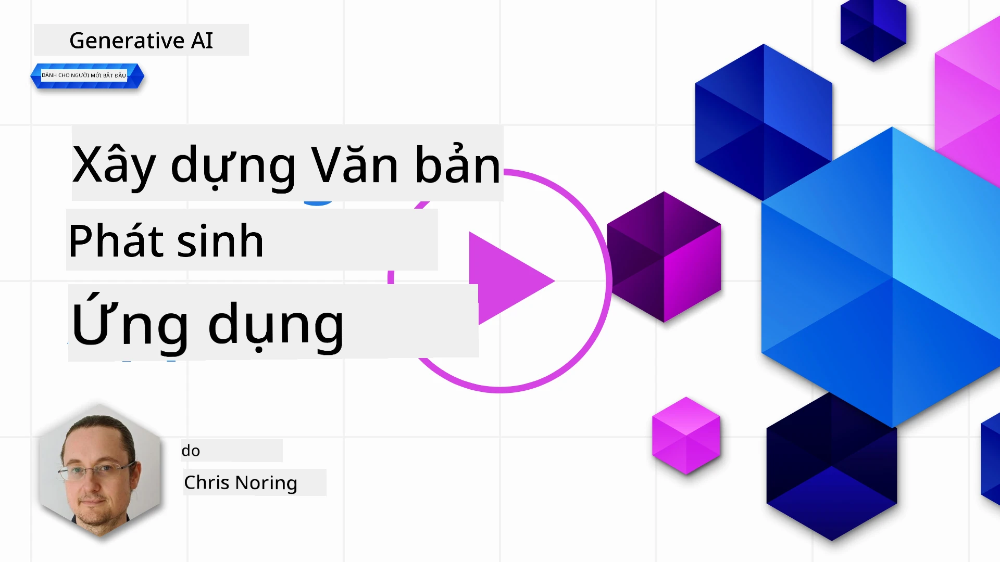

# Xây dựng các ứng dụng tạo văn bản

[](https://youtu.be/0Y5Luf5sRQA?si=t_xVg0clnAI4oUFZ)

> _(Nhấp vào hình ảnh bên trên để xem video bài học này)_

Bạn đã thấy qua chương trình học này có những khái niệm cốt lõi như prompt và thậm chí cả một lĩnh vực riêng gọi là "kỹ thuật prompt". Nhiều công cụ mà bạn có thể tương tác như ChatGPT, Office 365, Microsoft Power Platform và nhiều công cụ khác, hỗ trợ bạn sử dụng prompt để hoàn thành một việc gì đó.

Để bạn có thể thêm trải nghiệm như vậy vào một ứng dụng, bạn cần hiểu các khái niệm như prompt, completions và chọn một thư viện để làm việc. Đó chính là những gì bạn sẽ học trong chương này.

## Giới thiệu

Trong chương này, bạn sẽ:

- Tìm hiểu về thư viện openai và các khái niệm cốt lõi của nó.
- Xây dựng một ứng dụng tạo văn bản bằng openai.
- Hiểu cách sử dụng các khái niệm như prompt, temperature và tokens để xây dựng một ứng dụng tạo văn bản.

## Mục tiêu học tập

Cuối bài học này, bạn sẽ có thể:

- Giải thích ứng dụng tạo văn bản là gì.
- Xây dựng một ứng dụng tạo văn bản sử dụng openai.
- Cấu hình ứng dụng của bạn để sử dụng nhiều hoặc ít tokens hơn và cũng thay đổi nhiệt độ, để tạo ra đầu ra đa dạng.

## Ứng dụng tạo văn bản là gì?

Thường thì khi bạn xây dựng một ứng dụng, nó sẽ có một loại giao diện như sau:

- Dựa trên lệnh. Các ứng dụng console là những ứng dụng điển hình nơi bạn nhập lệnh và nó thực hiện một tác vụ. Ví dụ, `git` là một ứng dụng dựa trên lệnh.
- Giao diện người dùng (UI). Một số ứng dụng có giao diện người dùng đồ họa (GUI) nơi bạn nhấn nút, nhập văn bản, chọn tùy chọn và hơn thế nữa.

### Ứng dụng console và UI có giới hạn

So sánh với một ứng dụng dựa trên lệnh, nơi bạn gõ lệnh:

- **Có giới hạn**. Bạn không thể gõ bất kỳ lệnh nào, chỉ những lệnh mà ứng dụng hỗ trợ.
- **Ngôn ngữ cụ thể**. Một số ứng dụng hỗ trợ nhiều ngôn ngữ, nhưng theo mặc định ứng dụng được xây dựng cho một ngôn ngữ cụ thể, dù bạn có thể thêm hỗ trợ ngôn ngữ khác nữa.

### Lợi ích của ứng dụng tạo văn bản

Vậy ứng dụng tạo văn bản khác biệt gì?

Trong ứng dụng tạo văn bản, bạn có sự linh hoạt nhiều hơn, bạn không bị giới hạn trong một tập hợp lệnh hoặc một ngôn ngữ đầu vào cụ thể. Thay vào đó, bạn có thể sử dụng ngôn ngữ tự nhiên để tương tác với ứng dụng. Một lợi ích khác là bạn đang tương tác với nguồn dữ liệu đã được huấn luyện trên một kho tàng thông tin rộng lớn, trong khi một ứng dụng truyền thống có thể bị giới hạn bởi dữ liệu trong cơ sở dữ liệu.

### Tôi có thể xây dựng gì với ứng dụng tạo văn bản?

Có nhiều thứ bạn có thể xây dựng. Ví dụ:

- **Chatbot**. Một chatbot trả lời các câu hỏi về chủ đề, như công ty của bạn và các sản phẩm của nó có thể là lựa chọn tốt.
- **Trợ giúp**. Các LLM rất giỏi trong việc tóm tắt văn bản, thu thập thông tin từ văn bản, tạo ra văn bản như sơ yếu lý lịch và nhiều hơn nữa.
- **Trợ lý viết mã**. Tùy thuộc vào mô hình ngôn ngữ bạn sử dụng, bạn có thể xây dựng trợ lý viết mã giúp bạn viết code. Ví dụ, bạn có thể sử dụng sản phẩm như GitHub Copilot cũng như ChatGPT để hỗ trợ viết mã.

## Làm thế nào để bắt đầu?

Bạn cần tìm cách tích hợp với LLM, thường gồm hai cách tiếp cận sau:

- Sử dụng API. Ở đây bạn xây dựng các yêu cầu web với prompt của bạn và nhận lại văn bản được tạo ra.
- Sử dụng thư viện. Thư viện giúp đóng gói các cuộc gọi API và làm cho việc sử dụng dễ dàng hơn.

## Thư viện/SDK

Có một vài thư viện nổi tiếng để làm việc với LLM như:

- **openai**, thư viện này giúp dễ dàng kết nối với mô hình của bạn và gửi prompt.

Sau đó là các thư viện hoạt động ở mức cao hơn như:

- **Langchain**. Langchain khá nổi tiếng và hỗ trợ Python.
- **Semantic Kernel**. Semantic Kernel là một thư viện của Microsoft hỗ trợ các ngôn ngữ C#, Python, và Java.

## Ứng dụng đầu tiên sử dụng openai

Hãy xem cách chúng ta xây dựng ứng dụng đầu tiên, cần những thư viện gì, yêu cầu thế nào và như thế nào.

### Cài đặt openai

Có nhiều thư viện để tương tác với OpenAI hoặc Azure OpenAI. Có thể sử dụng nhiều ngôn ngữ lập trình như C#, Python, JavaScript, Java và hơn nữa. Chúng ta chọn sử dụng thư viện `openai` cho Python, vì vậy sẽ dùng `pip` để cài đặt.

```bash
pip install openai
```

### Tạo tài nguyên

Bạn cần thực hiện các bước sau:

- Tạo tài khoản trên Azure [https://azure.microsoft.com/free/](https://azure.microsoft.com/free/?WT.mc_id=academic-105485-koreyst).
- Đăng ký truy cập Azure OpenAI. Vào [https://learn.microsoft.com/azure/ai-foundry/openai/overview#how-do-i-get-access-to-azure-openai](https://learn.microsoft.com/azure/ai-foundry/openai/overview#how-do-i-get-access-to-azure-openai?WT.mc_id=academic-105485-koreyst) và yêu cầu truy cập.

  > [!NOTE]
  > Tại thời điểm viết, bạn cần nộp đơn để được truy cập Azure OpenAI.

- Cài đặt Python <https://www.python.org/>
- Đã tạo tài nguyên Azure OpenAI Service. Xem hướng dẫn này để [tạo tài nguyên](https://learn.microsoft.com/azure/ai-foundry/openai/how-to/create-resource?pivots=web-portal?WT.mc_id=academic-105485-koreyst).

### Xác định khóa API và endpoint

Hiện tại, bạn cần cho thư viện `openai` biết khóa API nào sẽ sử dụng. Để tìm khóa API của bạn, vào phần "Keys and Endpoint" trong tài nguyên Azure OpenAI của bạn và sao chép giá trị "Key 1".


Bây giờ bạn đã sao chép thông tin này, hãy hướng dẫn các thư viện sử dụng nó.

> [!NOTE]
> Nên tách khóa API của bạn ra khỏi mã nguồn. Bạn có thể làm điều đó bằng cách sử dụng biến môi trường.
>
> - Đặt biến môi trường `OPENAI_API_KEY` bằng khóa API của bạn.
>   `export OPENAI_API_KEY='sk-...'`

### Cấu hình Azure

Nếu bạn dùng Azure OpenAI (nay thuộc Microsoft Foundry), đây là cách bạn cấu hình. Chúng ta dùng client chuẩn `OpenAI` trỏ tới endpoint Azure OpenAI `/openai/v1/`, hoạt động với Responses API và không cần `api_version`:

```python
import os
from openai import OpenAI

client = OpenAI(
    api_key=os.environ["AZURE_OPENAI_API_KEY"],
    base_url=f"{os.environ['AZURE_OPENAI_ENDPOINT'].rstrip('/')}/openai/v1/",
)
```

Phía trên chúng ta thiết lập các mục sau:

- `api_key`, khóa API của bạn tìm thấy ở Azure Portal hoặc Microsoft Foundry portal.
- `base_url`, đây là endpoint tài nguyên Foundry của bạn có thêm `/openai/v1/` ở cuối. Endpoint ổn định v1 hoạt động trên OpenAI và Azure OpenAI mà không cần quản lý `api_version`.

> [!NOTE] > `os.environ` đọc biến môi trường. Bạn có thể dùng nó để đọc biến môi trường như `AZURE_OPENAI_API_KEY` và `AZURE_OPENAI_ENDPOINT`. Đặt các biến môi trường này trong terminal hoặc dùng thư viện như `dotenv`.

## Tạo văn bản

Cách tạo văn bản là sử dụng Responses API qua phương thức `responses.create`. Ví dụ:

```python
prompt = "Complete the following: Once upon a time there was a"

response = client.responses.create(
    model="gpt-5-mini",  # đây là tên triển khai mô hình của bạn
    input=prompt,
    store=False,
)
print(response.output_text)
```

Trong đoạn mã trên, ta tạo một response và truyền vào mô hình muốn dùng cùng prompt. Sau đó in ra văn bản tạo ra qua `response.output_text`.

### Hội thoại nhiều lượt

Responses API phù hợp cho cả tạo văn bản một lượt và chatbot nhiều lượt — bạn cung cấp một danh sách tin nhắn trong `input` để xây dựng cuộc hội thoại:

```python
from openai import OpenAI

client = OpenAI(api_key="sk-...")

response = client.responses.create(model="gpt-5-mini", input="Hello world", store=False)
print(response.output_text)
```

Thêm về chức năng này trong chương tiếp theo.

## Bài tập - ứng dụng tạo văn bản đầu tiên của bạn

Bây giờ chúng ta đã học cách thiết lập và cấu hình openai, đã đến lúc xây dựng ứng dụng tạo văn bản đầu tiên. Để xây dựng ứng dụng, làm theo các bước sau:

1. Tạo môi trường ảo và cài openai:

   ```bash
   python -m venv venv
   source venv/bin/activate
   pip install openai
   ```

   > [!NOTE]
   > Nếu bạn dùng Windows gõ `venv\Scripts\activate` thay vì `source venv/bin/activate`.

   > [!NOTE]
   > Tìm khóa Azure OpenAI của bạn bằng cách vào [https://portal.azure.com/](https://portal.azure.com/?WT.mc_id=academic-105485-koreyst) và tìm kiếm `Open AI`, chọn `Open AI resource` rồi chọn `Keys and Endpoint` và sao chép giá trị `Key 1`.

1. Tạo file _app.py_ và cho mã sau:

   ```python
   import os
   from openai import OpenAI

   client = OpenAI(
       api_key="<replace this value with your Azure OpenAI key>",
       base_url="<endpoint found in Azure Portal>/openai/v1/",
   )
   deployment_name = "<deployment name>"

   # thêm mã hoàn thành của bạn
   prompt = "Complete the following: Once upon a time there was a"

   # thực hiện một yêu cầu sử dụng API Responses
   response = client.responses.create(model=deployment_name, input=prompt, store=False)

   # in phản hồi
   print(response.output_text)
   ```

   > [!NOTE]
   > Nếu bạn dùng OpenAI thông thường (không phải Azure), hãy dùng `client = OpenAI(api_key="<thay giá trị này bằng khóa OpenAI của bạn>")` (không có `base_url`) và truyền tên mô hình như `gpt-5-mini` thay vì tên triển khai (deployment).

   Bạn sẽ thấy kết quả tương tự như sau:

   ```output
    very unhappy _____.

   Once upon a time there was a very unhappy mermaid.
   ```

## Các loại prompt khác nhau cho các mục đích khác nhau

Giờ bạn đã thấy cách tạo văn bản sử dụng prompt. Bạn còn có chương trình chạy được mà bạn có thể chỉnh sửa để tạo ra các kiểu văn bản khác nhau.

Prompt có thể dùng cho rất nhiều tác vụ. Ví dụ:

- **Tạo ra một loại văn bản**. Ví dụ, bạn có thể tạo thơ, câu hỏi cho cuộc thi, v.v.
- **Tìm kiếm thông tin**. Bạn có thể dùng prompt để tìm kiếm thông tin như ví dụ sau đây 'CORS có nghĩa gì trong phát triển web?'.
- **Tạo mã**. Bạn có thể dùng prompt để sinh code, ví dụ viết một biểu thức chính quy dùng để kiểm tra email hay thậm chí tạo một chương trình hoàn chỉnh, như ứng dụng web?

## Một trường hợp sử dụng thực tế hơn: trình tạo công thức nấu ăn

Giả sử bạn có nguyên liệu trong nhà và muốn nấu món gì đó. Để làm được điều đó, bạn cần có công thức. Một cách tìm công thức là dùng công cụ tìm kiếm hoặc bạn có thể nhờ LLM giúp.

Bạn có thể viết prompt như sau:

> "Cho tôi 5 công thức món ăn với các nguyên liệu sau: gà, khoai tây và cà rốt. Mỗi công thức, liệt kê tất cả nguyên liệu sử dụng."

Với prompt trên, bạn có thể nhận được phản hồi giống như sau:

```output
1. Roasted Chicken and Vegetables:
Ingredients:
- 4 chicken thighs
- 2 potatoes, cut into cubes
- 2 carrots, cut into cubes
- 2 tablespoons olive oil
- 2 cloves garlic, minced
- 1 teaspoon dried thyme
- 1 teaspoon dried oregano
- Salt and pepper, to taste

2. Chicken and Potato Stew:
Ingredients:
- 2 tablespoons olive oil
- 1 onion, diced
- 2 cloves garlic, minced
- 2 chicken breasts, cut into cubes
- 2 potatoes, cut into cubes
- 2 carrots, cut into cubes
- 1 teaspoon dried oregano
- 1 teaspoon dried thyme
- 1 cup chicken broth
- Salt and pepper, to taste

3. Chicken and Potato Bake:
Ingredients:
- 2 tablespoons olive oil
- 2 chicken breasts, cut into cubes
- 2 potatoes, cut into cubes
- 2 carrots, cut into cubes
- 1 onion, diced
- 2 cloves garlic, minced
- 1 teaspoon dried oregano
- 1 teaspoon dried thyme
- 1 cup chicken broth
- Salt and pepper, to taste

4. Chicken and Potato Soup:
Ingredients:
- 2 tablespoons olive oil
- 1 onion, diced
- 2 cloves garlic, minced
- 2 chicken breasts, cut into cubes
- 2 potatoes, cut into cubes
- 2 carrots, cut into cubes
- 1 teaspoon dried oregano
- 1 teaspoon dried thyme
- 4 cups chicken broth
- Salt and pepper, to taste

5. Chicken and Potato Hash:
Ingredients:
- 2 tablespoons olive oil
- 2 chicken breasts, cut into cubes
- 2 potatoes, cut into cubes
- 2 carrots, cut into cubes
- 1 onion, diced
- 2 cloves garlic, minced
- 1 teaspoon dried oregano
```

Kết quả này rất tốt, tôi biết nên nấu món gì. Lúc này, những cải tiến có thể hữu ích là:

- Lọc bỏ những nguyên liệu tôi không thích hoặc bị dị ứng.
- Tạo danh sách mua sắm, trong trường hợp tôi chưa có đủ nguyên liệu trong nhà.

Với các trường hợp trên, hãy thêm một prompt bổ sung:

> "Vui lòng loại bỏ các công thức có tỏi vì tôi bị dị ứng và thay thế bằng nguyên liệu khác. Đồng thời, hãy tạo danh sách mua sắm cho các công thức, tính tới việc tôi đã có gà, khoai tây và cà rốt trong nhà."

Giờ bạn có một kết quả mới, đó là:

```output
1. Roasted Chicken and Vegetables:
Ingredients:
- 4 chicken thighs
- 2 potatoes, cut into cubes
- 2 carrots, cut into cubes
- 2 tablespoons olive oil
- 1 teaspoon dried thyme
- 1 teaspoon dried oregano
- Salt and pepper, to taste

2. Chicken and Potato Stew:
Ingredients:
- 2 tablespoons olive oil
- 1 onion, diced
- 2 chicken breasts, cut into cubes
- 2 potatoes, cut into cubes
- 2 carrots, cut into cubes
- 1 teaspoon dried oregano
- 1 teaspoon dried thyme
- 1 cup chicken broth
- Salt and pepper, to taste

3. Chicken and Potato Bake:
Ingredients:
- 2 tablespoons olive oil
- 2 chicken breasts, cut into cubes
- 2 potatoes, cut into cubes
- 2 carrots, cut into cubes
- 1 onion, diced
- 1 teaspoon dried oregano
- 1 teaspoon dried thyme
- 1 cup chicken broth
- Salt and pepper, to taste

4. Chicken and Potato Soup:
Ingredients:
- 2 tablespoons olive oil
- 1 onion, diced
- 2 chicken breasts, cut into cubes
- 2 potatoes, cut into cubes
- 2 carrots, cut into cubes
- 1 teaspoon dried oregano
- 1 teaspoon dried thyme
- 4 cups chicken broth
- Salt and pepper, to taste

5. Chicken and Potato Hash:
Ingredients:
- 2 tablespoons olive oil
- 2 chicken breasts, cut into cubes
- 2 potatoes, cut into cubes
- 2 carrots, cut into cubes
- 1 onion, diced
- 1 teaspoon dried oregano

Shopping List:
- Olive oil
- Onion
- Thyme
- Oregano
- Salt
- Pepper
```

Đây là 5 công thức của bạn, không có tỏi và còn có danh sách mua sắm tính theo nguyên liệu bạn đã có.

## Bài tập - xây dựng trình tạo công thức nấu ăn

Giờ chúng ta đã trải nghiệm một kịch bản, hãy viết code để phù hợp với kịch bản đã trình bày. Để làm điều đó, làm theo các bước:

1. Dùng file _app.py_ hiện có làm điểm xuất phát
1. Tìm biến `prompt` và đổi mã của nó thành như sau:

   ```python
   prompt = "Show me 5 recipes for a dish with the following ingredients: chicken, potatoes, and carrots. Per recipe, list all the ingredients used"
   ```

   Nếu bạn chạy code bây giờ, bạn sẽ thấy kết quả tương tự như:

   ```output
   -Chicken Stew with Potatoes and Carrots: 3 tablespoons oil, 1 onion, chopped, 2 cloves garlic, minced, 1 carrot, peeled and chopped, 1 potato, peeled and chopped, 1 bay leaf, 1 thyme sprig, 1/2 teaspoon salt, 1/4 teaspoon black pepper, 1 1/2 cups chicken broth, 1/2 cup dry white wine, 2 tablespoons chopped fresh parsley, 2 tablespoons unsalted butter, 1 1/2 pounds boneless, skinless chicken thighs, cut into 1-inch pieces
   -Oven-Roasted Chicken with Potatoes and Carrots: 3 tablespoons extra-virgin olive oil, 1 tablespoon Dijon mustard, 1 tablespoon chopped fresh rosemary, 1 tablespoon chopped fresh thyme, 4 cloves garlic, minced, 1 1/2 pounds small red potatoes, quartered, 1 1/2 pounds carrots, quartered lengthwise, 1/2 teaspoon salt, 1/4 teaspoon black pepper, 1 (4-pound) whole chicken
   -Chicken, Potato, and Carrot Casserole: cooking spray, 1 large onion, chopped, 2 cloves garlic, minced, 1 carrot, peeled and shredded, 1 potato, peeled and shredded, 1/2 teaspoon dried thyme leaves, 1/4 teaspoon salt, 1/4 teaspoon black pepper, 2 cups fat-free, low-sodium chicken broth, 1 cup frozen peas, 1/4 cup all-purpose flour, 1 cup 2% reduced-fat milk, 1/4 cup grated Parmesan cheese

   -One Pot Chicken and Potato Dinner: 2 tablespoons olive oil, 1 pound boneless, skinless chicken thighs, cut into 1-inch pieces, 1 large onion, chopped, 3 cloves garlic, minced, 1 carrot, peeled and chopped, 1 potato, peeled and chopped, 1 bay leaf, 1 thyme sprig, 1/2 teaspoon salt, 1/4 teaspoon black pepper, 2 cups chicken broth, 1/2 cup dry white wine

   -Chicken, Potato, and Carrot Curry: 1 tablespoon vegetable oil, 1 large onion, chopped, 2 cloves garlic, minced, 1 carrot, peeled and chopped, 1 potato, peeled and chopped, 1 teaspoon ground coriander, 1 teaspoon ground cumin, 1/2 teaspoon ground turmeric, 1/2 teaspoon ground ginger, 1/4 teaspoon cayenne pepper, 2 cups chicken broth, 1/2 cup dry white wine, 1 (15-ounce) can chickpeas, drained and rinsed, 1/2 cup raisins, 1/2 cup chopped fresh cilantro
   ```

   > LƯU Ý, LLM của bạn không xác định, nên bạn có thể nhận kết quả khác nhau mỗi lần chạy chương trình.

   Tuyệt vời, giờ hãy xem làm thế nào để cải thiện. Để cải thiện, chúng ta muốn code linh hoạt hơn, để nguyên liệu và số lượng công thức có thể điều chỉnh và thay đổi.

1. Hãy thay đổi code theo cách sau:

   ```python
   no_recipes = input("No of recipes (for example, 5): ")

   ingredients = input("List of ingredients (for example, chicken, potatoes, and carrots): ")

   # nội suy số lượng công thức vào trong prompt và thành phần
   prompt = f"Show me {no_recipes} recipes for a dish with the following ingredients: {ingredients}. Per recipe, list all the ingredients used"
   ```

   Việc chạy thử mã có thể trông như thế này:

   ```output
   No of recipes (for example, 5): 3
   List of ingredients (for example, chicken, potatoes, and carrots): milk,strawberries

   -Strawberry milk shake: milk, strawberries, sugar, vanilla extract, ice cubes
   -Strawberry shortcake: milk, flour, baking powder, sugar, salt, unsalted butter, strawberries, whipped cream
   -Strawberry milk: milk, strawberries, sugar, vanilla extract
   ```

### Cải thiện bằng cách thêm bộ lọc và danh sách mua sắm

Giờ ta đã có ứng dụng hoạt động có thể tạo công thức và linh hoạt vì dựa vào đầu vào của người dùng, cả về số lượng công thức và nguyên liệu sử dụng.

Để cải tiến thêm, ta muốn thêm các mục sau:

- **Lọc nguyên liệu**. Muốn có khả năng lọc bỏ những nguyên liệu không thích hoặc dị ứng. Để làm điều này, ta chỉnh sửa prompt hiện tại và thêm điều kiện lọc vào cuối như sau:

  ```python
  filter = input("Filter (for example, vegetarian, vegan, or gluten-free): ")

  prompt = f"Show me {no_recipes} recipes for a dish with the following ingredients: {ingredients}. Per recipe, list all the ingredients used, no {filter}"
  ```

  Phía trên, ta thêm `{filter}` vào cuối prompt và cũng lấy giá trị filter từ người dùng.

  Ví dụ đầu vào khi chạy chương trình có thể như sau:

  ```output
  No of recipes (for example, 5): 3
  List of ingredients (for example, chicken, potatoes, and carrots): onion,milk
  Filter (for example, vegetarian, vegan, or gluten-free): no milk

  1. French Onion Soup

  Ingredients:

  -1 large onion, sliced
  -3 cups beef broth
  -1 cup milk
  -6 slices french bread
  -1/4 cup shredded Parmesan cheese
  -1 tablespoon butter
  -1 teaspoon dried thyme
  -1/4 teaspoon salt
  -1/4 teaspoon black pepper

  Instructions:

  1. In a large pot, sauté onions in butter until golden brown.
  2. Add beef broth, milk, thyme, salt, and pepper. Bring to a boil.
  3. Reduce heat and simmer for 10 minutes.
  4. Place french bread slices on soup bowls.
  5. Ladle soup over bread.
  6. Sprinkle with Parmesan cheese.

  2. Onion and Potato Soup

  Ingredients:

  -1 large onion, chopped
  -2 cups potatoes, diced
  -3 cups vegetable broth
  -1 cup milk
  -1/4 teaspoon black pepper

  Instructions:

  1. In a large pot, sauté onions in butter until golden brown.
  2. Add potatoes, vegetable broth, milk, and pepper. Bring to a boil.
  3. Reduce heat and simmer for 10 minutes.
  4. Serve hot.

  3. Creamy Onion Soup

  Ingredients:

  -1 large onion, chopped
  -3 cups vegetable broth
  -1 cup milk
  -1/4 teaspoon black pepper
  -1/4 cup all-purpose flour
  -1/2 cup shredded Parmesan cheese

  Instructions:

  1. In a large pot, sauté onions in butter until golden brown.
  2. Add vegetable broth, milk, and pepper. Bring to a boil.
  3. Reduce heat and simmer for 10 minutes.
  4. In a small bowl, whisk together flour and Parmesan cheese until smooth.
  5. Add to soup and simmer for an additional 5 minutes, or until soup has thickened.
  ```

  Như bạn thấy, bất kỳ công thức nào có sữa đã bị lọc bỏ. Nhưng nếu bạn không dung nạp lactose, bạn có thể muốn lọc bỏ cả các món có phô mai, vậy cần phải rõ ràng hơn.


- **Tạo danh sách mua sắm**. Chúng ta muốn tạo một danh sách mua sắm, xem xét những gì chúng ta đã có ở nhà.

  Đối với chức năng này, chúng ta có thể thử giải quyết mọi thứ trong một lời nhắc hoặc chúng ta có thể chia thành hai lời nhắc. Hãy thử cách thứ hai. Ở đây chúng tôi đề xuất thêm một lời nhắc bổ sung, nhưng để làm được điều đó, chúng ta cần thêm kết quả của lời nhắc trước làm ngữ cảnh cho lời nhắc sau.

  Tìm phần trong mã in ra kết quả từ lời nhắc đầu tiên và thêm đoạn mã sau bên dưới:

  ```python
  old_prompt_result = response.output_text
  prompt = "Produce a shopping list for the generated recipes and please don't include ingredients that I already have."

  new_prompt = f"{old_prompt_result} {prompt}"
  response = client.responses.create(model=deployment_name, input=new_prompt, max_output_tokens=1200, store=False)

  # in phản hồi
  print("Shopping list:")
  print(response.output_text)
  ```

  Lưu ý các điểm sau:

  1. Chúng ta đang xây dựng một lời nhắc mới bằng cách thêm kết quả từ lời nhắc đầu tiên vào lời nhắc mới:

     ```python
     new_prompt = f"{old_prompt_result} {prompt}"
     ```

  1. Chúng ta thực hiện một yêu cầu mới, nhưng cũng tính đến số lượng token đã yêu cầu trong lời nhắc đầu tiên, lần này ta đặt `max_output_tokens` là 1200.

     ```python
     response = client.responses.create(model=deployment_name, input=new_prompt, max_output_tokens=1200, store=False)
     ```

     Thử chạy đoạn mã này, ta sẽ có kết quả đầu ra như sau:

     ```output
     No of recipes (for example, 5): 2
     List of ingredients (for example, chicken, potatoes, and carrots): apple,flour
     Filter (for example, vegetarian, vegan, or gluten-free): sugar


     -Apple and flour pancakes: 1 cup flour, 1/2 tsp baking powder, 1/2 tsp baking soda, 1/4 tsp salt, 1 tbsp sugar, 1 egg, 1 cup buttermilk or sour milk, 1/4 cup melted butter, 1 Granny Smith apple, peeled and grated
     -Apple fritters: 1-1/2 cups flour, 1 tsp baking powder, 1/4 tsp salt, 1/4 tsp baking soda, 1/4 tsp nutmeg, 1/4 tsp cinnamon, 1/4 tsp allspice, 1/4 cup sugar, 1/4 cup vegetable shortening, 1/4 cup milk, 1 egg, 2 cups shredded, peeled apples
     Shopping list:
     -Flour, baking powder, baking soda, salt, sugar, egg, buttermilk, butter, apple, nutmeg, cinnamon, allspice
     ```

## Cải thiện cấu hình của bạn

Những gì chúng ta có cho đến nay là mã hoạt động, nhưng có một số điều chỉnh nên làm để cải thiện thêm. Một số việc nên làm là:

- **Tách biệt các bí mật khỏi mã**, như khóa API. Bí mật không nên có trong mã và nên được lưu trữ ở nơi an toàn. Để tách biệt bí mật khỏi mã, chúng ta có thể sử dụng biến môi trường và các thư viện như `python-dotenv` để tải chúng từ tập tin. Dưới đây là cách biểu diễn trong mã:

  1. Tạo tập tin `.env` với nội dung sau:

     ```bash
     OPENAI_API_KEY=sk-...
     ```

     > Lưu ý, đối với Azure OpenAI trong Microsoft Foundry, bạn cần thiết lập các biến môi trường sau thay vào đó:

     ```bash
     AZURE_OPENAI_API_KEY=<replace>
     AZURE_OPENAI_ENDPOINT=<replace>
     AZURE_OPENAI_API_VERSION=2024-10-21
     ```

     Trong mã, bạn sẽ tải các biến môi trường như sau:

     ```python
     import os
     from dotenv import load_dotenv
     from openai import OpenAI

     load_dotenv()

     client = OpenAI(api_key=os.environ["OPENAI_API_KEY"])
     ```

- **Một lời về độ dài token**. Chúng ta nên cân nhắc số lượng token cần để tạo ra văn bản mong muốn. Token tốn chi phí, nên nếu có thể, chúng ta nên cố gắng tiết kiệm số lượng token sử dụng. Ví dụ, có thể diễn đạt lời nhắc sao cho dùng ít token hơn không?

  Để thay đổi số token sử dụng, bạn có thể dùng tham số `max_output_tokens`. Ví dụ, nếu bạn muốn dùng 100 token, bạn làm như sau:

  ```python
  response = client.responses.create(model=deployment, input=prompt, max_output_tokens=100, store=False)
  ```

- **Thử nghiệm với nhiệt độ**. Nhiệt độ là tham số chúng ta chưa đề cập đến cho đến giờ nhưng rất quan trọng đối với hiệu suất chương trình. Giá trị nhiệt độ càng cao thì đầu ra càng ngẫu nhiên. Ngược lại, giá trị nhiệt độ càng thấp thì đầu ra càng dự đoán được. Hãy cân nhắc xem bạn có muốn đa dạng trong kết quả đầu ra không.

  Để thay đổi nhiệt độ, bạn có thể dùng tham số `temperature`. Ví dụ, nếu bạn muốn nhiệt độ là 0.5, làm như sau:

  ```python
  response = client.responses.create(model=deployment, input=prompt, temperature=0.5, store=False)
  ```

  > Lưu ý, càng gần 1.0 thì kết quả càng đa dạng.

- **Các mô hình suy luận không sử dụng `temperature`**. Đây là thay đổi quan trọng năm 2026. Các mô hình không bị loại bỏ hiện có trên Microsoft Foundry là **mô hình suy luận** (gia đình GPT-5, o-series) - và chúng **không hỗ trợ `temperature` hay `top_p`** (cũng không hỗ trợ `max_tokens`; hãy dùng `max_output_tokens`). Nếu gửi `temperature` cho `gpt-5-mini`, bạn sẽ nhận lỗi "tham số không được hỗ trợ". Vì thế để thử ví dụ về nhiệt độ ở trên, hãy chọn mô hình còn hỗ trợ điều khiển lấy mẫu - ví dụ mô hình mở **Llama** như `Llama-3.3-70B-Instruct` từ [Microsoft Foundry model catalog](https://ai.azure.com/catalog/models?WT.mc_id=academic-105485-koreyst), gọi qua Foundry Models / Azure AI Inference endpoint (cách gọi giống mẫu `githubmodels-*`). Đối với mô hình suy luận như GPT-5, bạn điều khiển đầu ra bằng cách khác:
  - **Kỹ thuật viết lời nhắc** - các chỉ dẫn rõ ràng, ví dụ, và đầu ra có cấu trúc (xem bài [04 - Prompt Engineering](../04-prompt-engineering-fundamentals/README.md?WT.mc_id=academic-105485-koreyst)) thay thế cho việc điều khiển lấy mẫu.
  - **Kiểm soát suy luận** - các tham số như nỗ lực/độ dài suy luận đánh đổi giữa độ sâu suy luận với độ trễ và chi phí.

  Tóm lại: `temperature`/`top_p` vẫn hợp lệ trên nhiều mô hình (Llama, Mistral, Phi, và gia đình GPT-4.x - dù GPT-4.x đang dần loại bỏ), nhưng xu hướng tương lai là kỹ thuật viết lời nhắc + kiểm soát suy luận trên các mô hình suy luận như GPT-5.

## Bài tập

Đối với bài tập này, bạn có thể chọn việc muốn tạo ra.

Dưới đây là một số gợi ý:

- Tinh chỉnh ứng dụng tạo công thức nấu ăn để cải thiện thêm. Thử nghiệm các giá trị nhiệt độ, và các lời nhắc xem bạn có thể tạo ra gì.
- Tạo một "bạn học". Ứng dụng này có thể trả lời câu hỏi về một chủ đề ví dụ Python, bạn có thể có các lời nhắc như "Chủ đề XYZ trong Python là gì?", hoặc một lời nhắc như, cho tôi xem mã cho chủ đề XYZ vv.
- Bot lịch sử, làm cho lịch sử sống động hơn, ra lệnh cho bot đóng vai một nhân vật lịch sử nào đó và hỏi về cuộc đời và thời đại của nhân vật đó.

## Giải pháp

### Bạn học

Dưới đây là lời nhắc khởi đầu, xem cách bạn có thể dùng và điều chỉnh theo ý thích.

```text
- "You're an expert on the Python language

    Suggest a beginner lesson for Python in the following format:

    Format:
    - concepts:
    - brief explanation of the lesson:
    - exercise in code with solutions"
```

### Bot lịch sử

Dưới đây là một số lời nhắc bạn có thể dùng:

```text
- "You are Abe Lincoln, tell me about yourself in 3 sentences, and respond using grammar and words like Abe would have used"
- "You are Abe Lincoln, respond using grammar and words like Abe would have used:

   Tell me about your greatest accomplishments, in 300 words"
```

## Kiểm tra kiến thức

Khái niệm nhiệt độ làm gì?

1. Nó kiểm soát độ ngẫu nhiên của đầu ra.
1. Nó kiểm soát kích thước của phản hồi.
1. Nó kiểm soát số lượng token được sử dụng.

## 🚀 Thử thách

Khi làm bài tập, thử thay đổi nhiệt độ, thử đặt nó là 0, 0.5 và 1. Hãy nhớ rằng 0 là ít biến đổi nhất và 1 là đa dạng nhất. Giá trị nào là phù hợp nhất cho ứng dụng của bạn?

## Làm tốt lắm! Tiếp tục học tập

Sau khi hoàn thành bài học này, hãy xem bộ sưu tập [Generative AI Learning collection](https://aka.ms/genai-collection?WT.mc_id=academic-105485-koreyst) để tiếp tục nâng cao kiến thức về Generative AI!

Hãy đến với Bài học 7, nơi chúng ta sẽ tìm hiểu cách [xây dựng các ứng dụng trò chuyện](../07-building-chat-applications/README.md?WT.mc_id=academic-105485-koreyst)!

---

<!-- CO-OP TRANSLATOR DISCLAIMER START -->
**Tuyên bố miễn trừ trách nhiệm**:
Tài liệu này đã được dịch bằng dịch vụ dịch thuật AI [Co-op Translator](https://github.com/Azure/co-op-translator). Mặc dù chúng tôi cố gắng đảm bảo độ chính xác, xin lưu ý rằng bản dịch tự động có thể chứa lỗi hoặc sai sót. Tài liệu gốc bằng ngôn ngữ gốc nên được coi là nguồn tin chính thức. Đối với thông tin quan trọng, nên sử dụng dịch vụ dịch thuật chuyên nghiệp bởi con người. Chúng tôi không chịu trách nhiệm về bất kỳ hiểu lầm hoặc giải thích sai nào phát sinh từ việc sử dụng bản dịch này.
<!-- CO-OP TRANSLATOR DISCLAIMER END -->