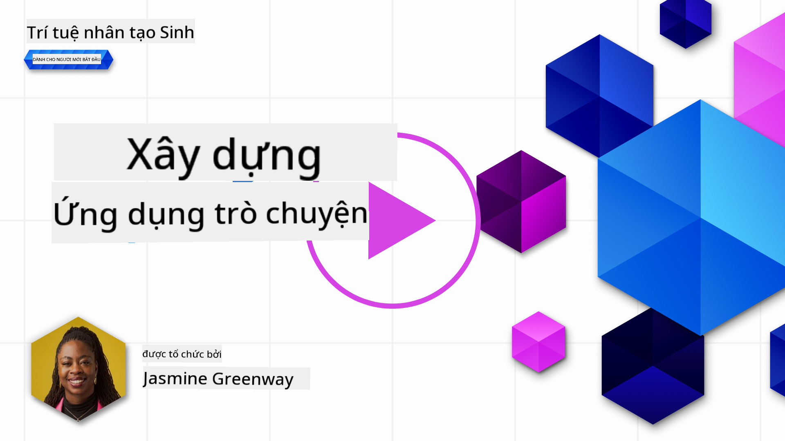
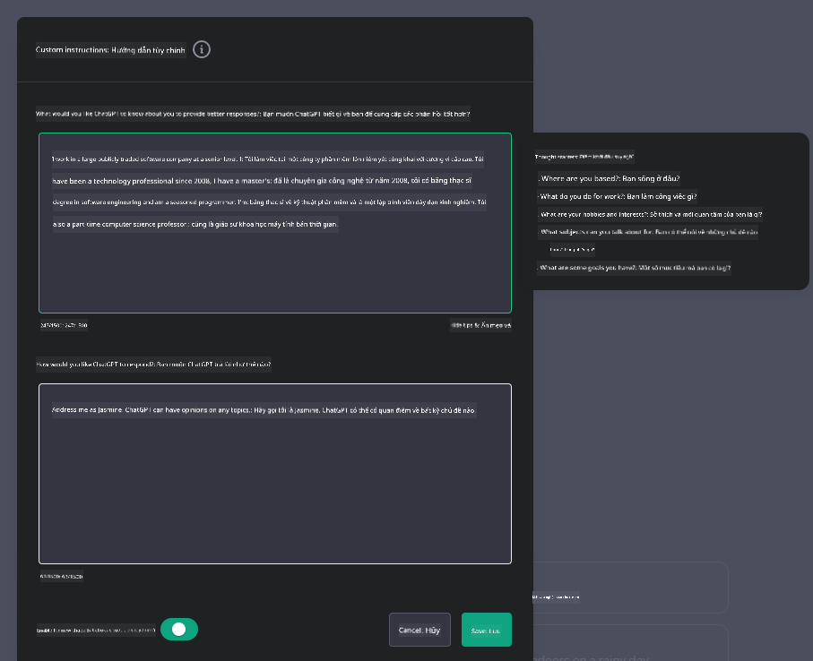
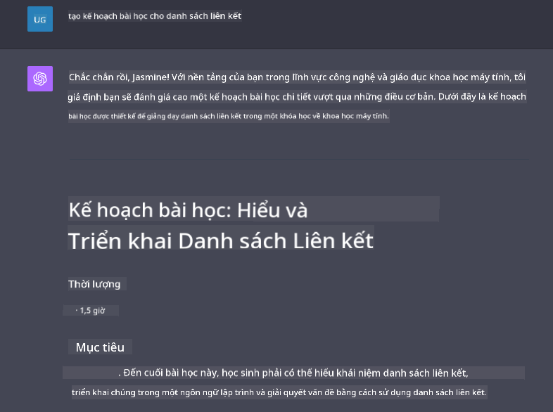

<!--
CO_OP_TRANSLATOR_METADATA:
{
  "original_hash": "ea4bbe640847aafbbba14dae4625e9af",
  "translation_date": "2025-05-19T17:59:22+00:00",
  "source_file": "07-building-chat-applications/README.md",
  "language_code": "vi"
}
-->
# Xây dựng Ứng dụng Chat Sử dụng AI Tạo Sinh

[](https://aka.ms/gen-ai-lessons7-gh?WT.mc_id=academic-105485-koreyst)

> _(Nhấp vào hình ảnh trên để xem video của bài học này)_

Bây giờ chúng ta đã thấy cách xây dựng các ứng dụng tạo văn bản, hãy cùng tìm hiểu về các ứng dụng chat.

Các ứng dụng chat đã trở thành một phần không thể thiếu trong cuộc sống hàng ngày của chúng ta, cung cấp nhiều hơn chỉ là phương tiện trò chuyện thông thường. Chúng là phần quan trọng của dịch vụ khách hàng, hỗ trợ kỹ thuật, và thậm chí là các hệ thống tư vấn phức tạp. Có khả năng là bạn đã nhận được sự trợ giúp từ một ứng dụng chat không lâu trước đây. Khi chúng ta tích hợp các công nghệ tiên tiến như AI tạo sinh vào các nền tảng này, độ phức tạp tăng lên và thách thức cũng vậy.

Một số câu hỏi chúng ta cần trả lời là:

- **Xây dựng ứng dụng**. Làm thế nào để chúng ta xây dựng hiệu quả và tích hợp liền mạch các ứng dụng sử dụng AI cho các trường hợp cụ thể?
- **Giám sát**. Khi đã triển khai, làm thế nào để chúng ta giám sát và đảm bảo rằng các ứng dụng hoạt động ở mức chất lượng cao nhất, cả về mặt chức năng và tuân thủ [sáu nguyên tắc của AI có trách nhiệm](https://www.microsoft.com/ai/responsible-ai?WT.mc_id=academic-105485-koreyst)?

Khi chúng ta tiến xa hơn vào một thời đại được định hình bởi tự động hóa và tương tác liền mạch giữa con người và máy móc, việc hiểu cách AI tạo sinh biến đổi phạm vi, chiều sâu, và khả năng thích ứng của các ứng dụng chat trở nên thiết yếu. Bài học này sẽ nghiên cứu các khía cạnh của kiến trúc hỗ trợ các hệ thống phức tạp này, tìm hiểu các phương pháp để tinh chỉnh chúng cho các nhiệm vụ cụ thể theo lĩnh vực, và đánh giá các chỉ số và cân nhắc liên quan đến việc đảm bảo triển khai AI có trách nhiệm.

## Giới thiệu

Bài học này bao gồm:

- Kỹ thuật để xây dựng và tích hợp ứng dụng chat một cách hiệu quả.
- Cách áp dụng tùy chỉnh và tinh chỉnh cho các ứng dụng.
- Chiến lược và cân nhắc để giám sát ứng dụng chat một cách hiệu quả.

## Mục tiêu học tập

Đến cuối bài học này, bạn sẽ có thể:

- Mô tả các cân nhắc khi xây dựng và tích hợp ứng dụng chat vào các hệ thống hiện có.
- Tùy chỉnh ứng dụng chat cho các trường hợp sử dụng cụ thể.
- Xác định các chỉ số chính và cân nhắc để giám sát và duy trì chất lượng của các ứng dụng chat sử dụng AI một cách hiệu quả.
- Đảm bảo các ứng dụng chat sử dụng AI một cách có trách nhiệm.

## Tích hợp AI Tạo Sinh vào Ứng dụng Chat

Nâng cao các ứng dụng chat thông qua AI tạo sinh không chỉ tập trung vào việc làm cho chúng thông minh hơn; mà còn tối ưu hóa kiến trúc, hiệu suất, và giao diện người dùng để mang lại trải nghiệm người dùng chất lượng. Điều này bao gồm việc điều tra các nền tảng kiến trúc, tích hợp API, và các cân nhắc về giao diện người dùng. Phần này nhằm cung cấp cho bạn một lộ trình toàn diện để điều hướng những cảnh quan phức tạp này, cho dù bạn đang tích hợp chúng vào các hệ thống hiện có hay xây dựng chúng như các nền tảng độc lập.

Đến cuối phần này, bạn sẽ được trang bị chuyên môn cần thiết để xây dựng và tích hợp ứng dụng chat một cách hiệu quả.

### Chatbot hay Ứng dụng Chat?

Trước khi chúng ta đi sâu vào việc xây dựng ứng dụng chat, hãy so sánh 'chatbot' với 'ứng dụng chat sử dụng AI', vốn có các vai trò và chức năng khác nhau. Mục đích chính của chatbot là tự động hóa các nhiệm vụ trò chuyện cụ thể, như trả lời các câu hỏi thường gặp hoặc theo dõi gói hàng. Nó thường được điều khiển bởi logic dựa trên quy tắc hoặc các thuật toán AI phức tạp. Ngược lại, một ứng dụng chat sử dụng AI là một môi trường rộng lớn hơn nhiều được thiết kế để tạo điều kiện cho các hình thức giao tiếp kỹ thuật số khác nhau, như chat văn bản, giọng nói, và video giữa người dùng. Đặc điểm nổi bật của nó là tích hợp mô hình AI tạo sinh mô phỏng các cuộc trò chuyện tinh tế, giống con người, tạo ra phản hồi dựa trên nhiều loại đầu vào và tín hiệu ngữ cảnh. Một ứng dụng chat sử dụng AI tạo sinh có thể tham gia vào các cuộc thảo luận mở, thích ứng với các ngữ cảnh trò chuyện thay đổi, và thậm chí tạo ra các cuộc đối thoại sáng tạo hoặc phức tạp.

Bảng dưới đây phác thảo những điểm khác biệt và tương đồng chính để giúp chúng ta hiểu vai trò độc đáo của chúng trong giao tiếp kỹ thuật số.

| Chatbot                               | Ứng dụng Chat Sử dụng AI Tạo Sinh    |
| ------------------------------------- | ------------------------------------ |
| Tập trung vào nhiệm vụ và dựa trên quy tắc | Nhận thức ngữ cảnh                    |
| Thường được tích hợp vào các hệ thống lớn | Có thể chứa một hoặc nhiều chatbot    |
| Giới hạn trong các chức năng đã lập trình | Tích hợp các mô hình AI tạo sinh      |
| Tương tác chuyên biệt và có cấu trúc  | Có khả năng thảo luận mở rộng phạm vi |

### Tận dụng các chức năng đã xây dựng sẵn với SDKs và APIs

Khi xây dựng một ứng dụng chat, bước đầu tiên tốt là đánh giá những gì đã có sẵn. Sử dụng SDKs và APIs để xây dựng ứng dụng chat là một chiến lược có lợi vì nhiều lý do. Bằng cách tích hợp các SDKs và APIs được tài liệu hóa tốt, bạn đang định vị chiến lược cho ứng dụng của mình để thành công lâu dài, giải quyết các vấn đề về khả năng mở rộng và bảo trì.

- **Tăng tốc quá trình phát triển và giảm chi phí**: Dựa vào các chức năng đã xây dựng sẵn thay vì quá trình tốn kém để tự xây dựng cho phép bạn tập trung vào các khía cạnh khác của ứng dụng mà bạn có thể thấy quan trọng hơn, chẳng hạn như logic kinh doanh.
- **Hiệu suất tốt hơn**: Khi xây dựng chức năng từ đầu, bạn sẽ tự hỏi "Làm thế nào để mở rộng quy mô? Ứng dụng này có thể xử lý sự gia tăng đột ngột của người dùng không?" SDKs và APIs được duy trì tốt thường có các giải pháp tích hợp cho những vấn đề này.
- **Dễ dàng bảo trì**: Các cập nhật và cải tiến dễ quản lý hơn vì hầu hết các APIs và SDKs chỉ cần cập nhật thư viện khi có phiên bản mới được phát hành.
- **Tiếp cận công nghệ tiên tiến**: Tận dụng các mô hình đã được tinh chỉnh và huấn luyện trên các tập dữ liệu rộng lớn cung cấp cho ứng dụng của bạn khả năng ngôn ngữ tự nhiên.

Việc truy cập chức năng của một SDK hoặc API thường liên quan đến việc có được quyền sử dụng các dịch vụ được cung cấp, thường thông qua việc sử dụng một khóa duy nhất hoặc mã thông báo xác thực. Chúng ta sẽ sử dụng Thư viện Python của OpenAI để khám phá điều này trông như thế nào. Bạn cũng có thể thử nghiệm nó trong [notebook cho OpenAI](../../../07-building-chat-applications/python/oai-assignment.ipynb) hoặc [notebook cho Dịch vụ Azure OpenAI](../../../07-building-chat-applications/python/aoai-assignment.ipynb) cho bài học này.

```python
import os
from openai import OpenAI

API_KEY = os.getenv("OPENAI_API_KEY","")

client = OpenAI(
    api_key=API_KEY
    )

chat_completion = client.chat.completions.create(model="gpt-3.5-turbo", messages=[{"role": "user", "content": "Suggest two titles for an instructional lesson on chat applications for generative AI."}])
```

Ví dụ trên sử dụng mô hình GPT-3.5 Turbo để hoàn thành lời nhắc, nhưng lưu ý rằng khóa API được đặt trước khi làm điều đó. Bạn sẽ nhận được lỗi nếu không đặt khóa.

## Trải nghiệm Người dùng (UX)

Các nguyên tắc UX chung áp dụng cho các ứng dụng chat, nhưng có một số cân nhắc bổ sung trở nên đặc biệt quan trọng do các thành phần học máy liên quan.

- **Cơ chế giải quyết sự mơ hồ**: Các mô hình AI tạo sinh đôi khi tạo ra các câu trả lời mơ hồ. Một tính năng cho phép người dùng yêu cầu giải thích có thể hữu ích nếu họ gặp phải vấn đề này.
- **Duy trì ngữ cảnh**: Các mô hình AI tạo sinh tiên tiến có khả năng nhớ ngữ cảnh trong một cuộc trò chuyện, có thể là một tài sản cần thiết cho trải nghiệm người dùng. Cho phép người dùng kiểm soát và quản lý ngữ cảnh cải thiện trải nghiệm người dùng, nhưng giới thiệu rủi ro lưu giữ thông tin nhạy cảm của người dùng. Các cân nhắc về thời gian lưu trữ thông tin này, chẳng hạn như giới thiệu một chính sách lưu giữ, có thể cân bằng nhu cầu về ngữ cảnh với quyền riêng tư.
- **Cá nhân hóa**: Với khả năng học hỏi và thích ứng, các mô hình AI cung cấp trải nghiệm cá nhân hóa cho người dùng. Tùy chỉnh trải nghiệm người dùng thông qua các tính năng như hồ sơ người dùng không chỉ làm cho người dùng cảm thấy được hiểu mà còn giúp họ tìm kiếm câu trả lời cụ thể, tạo ra một tương tác hiệu quả và thỏa mãn hơn.

Một ví dụ về cá nhân hóa là cài đặt "Hướng dẫn tùy chỉnh" trong ChatGPT của OpenAI. Nó cho phép bạn cung cấp thông tin về bản thân có thể là ngữ cảnh quan trọng cho các lời nhắc của bạn. Dưới đây là một ví dụ về hướng dẫn tùy chỉnh.



"Hồ sơ" này yêu cầu ChatGPT tạo ra một kế hoạch bài học về danh sách liên kết. Lưu ý rằng ChatGPT xem xét rằng người dùng có thể muốn một kế hoạch bài học sâu hơn dựa trên kinh nghiệm của cô ấy.



### Khung Tin nhắn Hệ thống của Microsoft cho Các Mô hình Ngôn ngữ Lớn

[Microsoft đã cung cấp hướng dẫn](https://learn.microsoft.com/azure/ai-services/openai/concepts/system-message#define-the-models-output-format?WT.mc_id=academic-105485-koreyst) để viết tin nhắn hệ thống hiệu quả khi tạo phản hồi từ các mô hình ngôn ngữ lớn, chia thành 4 lĩnh vực:

1. Định nghĩa ai là người dùng mô hình, cũng như khả năng và hạn chế của nó.
2. Định nghĩa định dạng đầu ra của mô hình.
3. Cung cấp các ví dụ cụ thể minh họa hành vi dự định của mô hình.
4. Cung cấp các rào cản hành vi bổ sung.

### Khả năng Tiếp cận

Cho dù người dùng có các khiếm khuyết về thị giác, thính giác, vận động, hay nhận thức, một ứng dụng chat được thiết kế tốt nên có thể sử dụng được cho tất cả. Danh sách sau đây phân tích các tính năng cụ thể nhằm nâng cao khả năng tiếp cận cho các khiếm khuyết của người dùng khác nhau.

- **Tính năng cho Khiếm khuyết Thị giác**: Chủ đề có độ tương phản cao và văn bản có thể điều chỉnh kích thước, tương thích với trình đọc màn hình.
- **Tính năng cho Khiếm khuyết Thính giác**: Chức năng chuyển văn bản thành giọng nói và giọng nói thành văn bản, tín hiệu hình ảnh cho thông báo âm thanh.
- **Tính năng cho Khiếm khuyết Vận động**: Hỗ trợ điều hướng bằng bàn phím, lệnh giọng nói.
- **Tính năng cho Khiếm khuyết Nhận thức**: Tùy chọn ngôn ngữ đơn giản hóa.

## Tùy chỉnh và Tinh chỉnh cho Các Mô hình Ngôn ngữ Cụ thể Theo Lĩnh vực

Hãy tưởng tượng một ứng dụng chat hiểu được thuật ngữ của công ty bạn và dự đoán các truy vấn cụ thể mà người dùng của nó thường có. Có một vài phương pháp đáng đề cập:

- **Tận dụng các mô hình DSL**. DSL là viết tắt của ngôn ngữ cụ thể theo lĩnh vực. Bạn có thể tận dụng một mô hình DSL được huấn luyện trên một lĩnh vực cụ thể để hiểu các khái niệm và tình huống của nó.
- **Áp dụng tinh chỉnh**. Tinh chỉnh là quá trình huấn luyện thêm mô hình của bạn với dữ liệu cụ thể.

## Tùy chỉnh: Sử dụng một DSL

Tận dụng các mô hình ngôn ngữ cụ thể theo lĩnh vực (Mô hình DSL) có thể nâng cao sự tương tác của người dùng bằng cách cung cấp các tương tác chuyên biệt, có ngữ cảnh liên quan. Đó là một mô hình được huấn luyện hoặc tinh chỉnh để hiểu và tạo văn bản liên quan đến một lĩnh vực, ngành, hoặc chủ đề cụ thể. Các tùy chọn để sử dụng một mô hình DSL có thể thay đổi từ việc huấn luyện một mô hình từ đầu, đến việc sử dụng các mô hình có sẵn thông qua SDKs và APIs. Một tùy chọn khác là tinh chỉnh, liên quan đến việc lấy một mô hình đã được huấn luyện trước và điều chỉnh nó cho một lĩnh vực cụ thể.

## Tùy chỉnh: Áp dụng tinh chỉnh

Tinh chỉnh thường được xem xét khi một mô hình đã được huấn luyện trước không đáp ứng được trong một lĩnh vực chuyên biệt hoặc nhiệm vụ cụ thể.

Ví dụ, các truy vấn y tế rất phức tạp và đòi hỏi nhiều ngữ cảnh. Khi một chuyên gia y tế chẩn đoán bệnh nhân, nó dựa trên nhiều yếu tố như lối sống hoặc các điều kiện tiền sử, và thậm chí có thể dựa vào các tạp chí y khoa gần đây để xác nhận chẩn đoán của họ. Trong những tình huống tinh tế như vậy, một ứng dụng chat AI chung không thể là một nguồn đáng tin cậy.

### Tình huống: một ứng dụng y tế

Hãy xem xét một ứng dụng chat được thiết kế để hỗ trợ các chuyên gia y tế bằng cách cung cấp tham chiếu nhanh đến hướng dẫn điều trị, tương tác thuốc, hoặc các phát hiện nghiên cứu gần đây.

Một mô hình chung có thể đủ để trả lời các câu hỏi y tế cơ bản hoặc cung cấp lời khuyên chung, nhưng có thể gặp khó khăn với các trường hợp sau:

- **Các trường hợp rất cụ thể hoặc phức tạp**. Ví dụ, một nhà thần kinh học có thể hỏi ứng dụng, "Các thực hành tốt nhất hiện tại để quản lý động kinh kháng thuốc ở bệnh nhân nhi là gì?"
- **Thiếu các tiến bộ gần đây**. Một mô hình chung có thể gặp khó khăn trong việc cung cấp câu trả lời hiện tại mà bao gồm các tiến bộ mới nhất trong thần kinh học và dược lý.

Trong những trường hợp như vậy, tinh chỉnh mô hình với một tập dữ liệu y tế chuyên biệt có thể cải thiện đáng kể khả năng của nó để xử lý các truy vấn y tế phức tạp này một cách chính xác và đáng tin cậy hơn. Điều này đòi hỏi quyền truy cập vào một tập dữ liệu lớn và liên quan đại diện cho các thách thức và câu hỏi cụ thể theo lĩnh vực cần được giải quyết.

## Cân nhắc cho Trải nghiệm Chat AI Chất lượng Cao

Phần này phác thảo các tiêu chí cho ứng dụng chat "chất lượng cao", bao gồm việc thu thập các chỉ số có thể hành động và tuân thủ một khung làm việc sử dụng công nghệ AI một cách có trách nhiệm.

### Chỉ số Chính

Để duy trì hiệu suất chất lượng cao của ứng dụng, điều cần thiết là theo dõi các chỉ số chính và cân nhắc. Những phép đo này không chỉ đảm bảo chức năng của ứng dụng mà còn đánh giá chất lượng của mô hình AI và trải nghiệm người dùng. Dưới đây là danh sách bao gồm các chỉ số cơ bản, AI, và trải nghiệm người dùng cần xem xét.

| Chỉ số                          | Định nghĩa                                                                                                         | Cân nhắc cho Nhà phát triển Chat                                           |
| ------------------------------- | ------------------------------------------------------------------------------------------------------------------ | ------------------------------------------------------------------------- |
| **Thời gian hoạt động**         | Đo lường thời gian ứng dụng hoạt động và có thể truy cập bởi người dùng.                                          | Làm thế nào để bạn giảm thiểu thời gian chết?                             |
| **Thời gian phản hồi**          | Thời gian ứng dụng trả lời một truy vấn của người dùng.                                                            | Làm thế nào để bạn tối ưu hóa xử lý truy vấn để cải thiện thời gian phản hồi? |
| **Độ chính xác**                | Tỷ lệ dự đoán đúng dương tính so với tổng số dự đoán dương tính                                                   | Làm thế nào để bạn xác thực độ chính xác của mô hình của bạn?              |
| **Độ nhạy (Recall)**            | Tỷ lệ dự đoán đúng dương tính so với số lượng thực tế của các trường hợp dương tính                               | Làm thế nào để bạn đo lường và cải thiện độ nhạy?                          |
| **Điểm F1**                     | Trung bình điều hòa của độ chính xác và độ nhạy, cân bằng sự đánh đổi giữa cả hai.                                 | Mục tiêu Điểm F1 của bạn là gì? Làm thế nào để bạn cân bằng độ chính xác và độ nhạy? |
| **Perplexity**                  | Đo lường mức độ phân phối xác suất dự đoán bởi mô hình phù hợp với phân phối thực tế của dữ liệu.                  | Làm thế nào để bạn giảm thiểu perplexity?                                 |
| **Chỉ số Hài lòng của Người dùng** | Đo lường nhận thức của người dùng về ứng dụng. Thường được thu thập thông qua khảo sát.                           | Bao lâu bạn sẽ thu thập phản hồi của người dùng? Làm thế nào để bạn thích ứng dựa trên nó? |
| **Tỷ lệ lỗi**                   | Tỷ lệ mà mô hình mắc sai lầm trong việc hiểu hoặc đầu ra.                                                          | Những chiến l

**Tuyên bố từ chối trách nhiệm**:  
Tài liệu này đã được dịch bằng dịch vụ dịch thuật AI [Co-op Translator](https://github.com/Azure/co-op-translator). Mặc dù chúng tôi cố gắng đảm bảo độ chính xác, xin lưu ý rằng các bản dịch tự động có thể chứa lỗi hoặc không chính xác. Tài liệu gốc bằng ngôn ngữ bản địa nên được coi là nguồn tài liệu chính thức. Đối với thông tin quan trọng, nên sử dụng dịch vụ dịch thuật chuyên nghiệp của con người. Chúng tôi không chịu trách nhiệm cho bất kỳ sự hiểu lầm hoặc diễn giải sai nào phát sinh từ việc sử dụng bản dịch này.