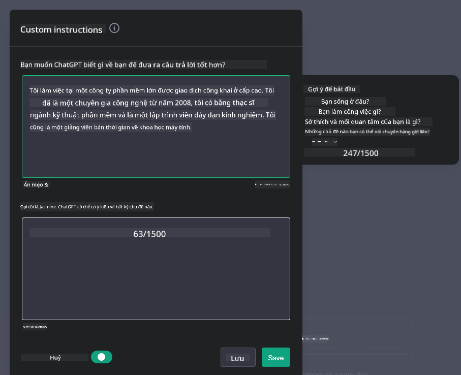
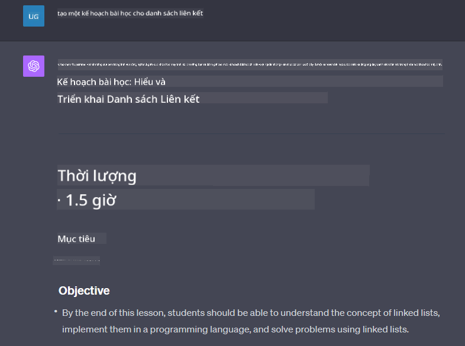

<!--
CO_OP_TRANSLATOR_METADATA:
{
  "original_hash": "ea4bbe640847aafbbba14dae4625e9af",
  "translation_date": "2025-06-25T15:44:51+00:00",
  "source_file": "07-building-chat-applications/README.md",
  "language_code": "vi"
}
-->
# Xây dựng Ứng dụng Chat Sử dụng AI Tạo sinh

[](https://aka.ms/gen-ai-lessons7-gh?WT.mc_id=academic-105485-koreyst)

> _(Nhấp vào hình ảnh trên để xem video của bài học này)_

Bây giờ chúng ta đã thấy cách xây dựng các ứng dụng tạo văn bản, hãy xem xét các ứng dụng chat.

Các ứng dụng chat đã trở thành một phần không thể thiếu trong cuộc sống hàng ngày của chúng ta, cung cấp nhiều hơn chỉ là phương tiện giao tiếp thông thường. Chúng là những phần quan trọng của dịch vụ khách hàng, hỗ trợ kỹ thuật, và thậm chí là hệ thống tư vấn phức tạp. Có khả năng là bạn đã nhận được sự trợ giúp từ một ứng dụng chat không lâu trước đây. Khi chúng ta tích hợp các công nghệ tiên tiến như AI tạo sinh vào những nền tảng này, độ phức tạp tăng lên và thách thức cũng vậy.

Một số câu hỏi cần được giải đáp là:

- **Xây dựng ứng dụng**. Làm thế nào để chúng ta xây dựng và tích hợp một cách hiệu quả các ứng dụng sử dụng AI cho các trường hợp sử dụng cụ thể?
- **Giám sát**. Sau khi triển khai, làm thế nào để chúng ta giám sát và đảm bảo rằng các ứng dụng hoạt động ở mức chất lượng cao nhất, cả về chức năng và tuân thủ [sáu nguyên tắc của AI có trách nhiệm](https://www.microsoft.com/ai/responsible-ai?WT.mc_id=academic-105485-koreyst)?

Khi chúng ta tiến sâu hơn vào một kỷ nguyên được định hình bởi tự động hóa và tương tác liền mạch giữa con người và máy móc, việc hiểu cách AI tạo sinh biến đổi phạm vi, độ sâu, và khả năng thích ứng của các ứng dụng chat trở nên thiết yếu. Bài học này sẽ điều tra các khía cạnh của kiến trúc hỗ trợ những hệ thống phức tạp này, đi sâu vào các phương pháp để điều chỉnh chúng cho các nhiệm vụ cụ thể theo lĩnh vực, và đánh giá các chỉ số và cân nhắc liên quan đến việc đảm bảo triển khai AI có trách nhiệm.

## Giới thiệu

Bài học này bao gồm:

- Kỹ thuật để xây dựng và tích hợp ứng dụng chat một cách hiệu quả.
- Cách áp dụng tùy chỉnh và điều chỉnh cho các ứng dụng.
- Chiến lược và cân nhắc để giám sát hiệu quả các ứng dụng chat.

## Mục tiêu học tập

Kết thúc bài học này, bạn sẽ có thể:

- Mô tả các cân nhắc khi xây dựng và tích hợp ứng dụng chat vào các hệ thống hiện có.
- Tùy chỉnh ứng dụng chat cho các trường hợp sử dụng cụ thể.
- Xác định các chỉ số chính và cân nhắc để giám sát và duy trì chất lượng của các ứng dụng chat sử dụng AI một cách hiệu quả.
- Đảm bảo các ứng dụng chat sử dụng AI một cách có trách nhiệm.

## Tích hợp AI Tạo sinh vào Ứng dụng Chat

Nâng cấp các ứng dụng chat thông qua AI tạo sinh không chỉ tập trung vào việc làm cho chúng thông minh hơn; mà còn tối ưu hóa kiến trúc, hiệu suất, và giao diện người dùng để mang lại trải nghiệm người dùng chất lượng. Điều này bao gồm việc điều tra các nền tảng kiến trúc, tích hợp API, và các cân nhắc về giao diện người dùng. Phần này nhằm cung cấp cho bạn một lộ trình toàn diện để điều hướng những cảnh quan phức tạp này, dù bạn đang kết nối chúng vào các hệ thống hiện có hay xây dựng chúng như các nền tảng độc lập.

Kết thúc phần này, bạn sẽ được trang bị kiến thức cần thiết để xây dựng và tích hợp ứng dụng chat một cách hiệu quả.

### Chatbot hay Ứng dụng Chat?

Trước khi chúng ta đi sâu vào việc xây dựng các ứng dụng chat, hãy so sánh 'chatbot' với 'ứng dụng chat sử dụng AI', chúng phục vụ các vai trò và chức năng khác nhau. Mục đích chính của chatbot là tự động hóa các nhiệm vụ hội thoại cụ thể, chẳng hạn như trả lời các câu hỏi thường gặp hoặc theo dõi một gói hàng. Nó thường được điều khiển bởi logic dựa trên quy tắc hoặc các thuật toán AI phức tạp. Ngược lại, một ứng dụng chat sử dụng AI là một môi trường rộng lớn hơn nhiều được thiết kế để tạo điều kiện cho các hình thức giao tiếp kỹ thuật số khác nhau, chẳng hạn như chat văn bản, giọng nói và video giữa người dùng. Đặc điểm nổi bật của nó là tích hợp một mô hình AI tạo sinh mô phỏng các cuộc trò chuyện tinh tế, giống như con người, tạo ra các phản hồi dựa trên nhiều loại đầu vào và gợi ý ngữ cảnh. Một ứng dụng chat sử dụng AI tạo sinh có thể tham gia vào các cuộc thảo luận mở, thích ứng với các ngữ cảnh hội thoại đang phát triển, và thậm chí tạo ra các cuộc đối thoại sáng tạo hoặc phức tạp.

Bảng dưới đây nêu bật các điểm khác biệt và tương đồng chính để giúp chúng ta hiểu vai trò độc đáo của chúng trong giao tiếp kỹ thuật số.

| Chatbot                               | Ứng dụng Chat Sử dụng AI Tạo sinh          |
| ------------------------------------- | ------------------------------------------ |
| Tập trung vào nhiệm vụ và dựa trên quy tắc | Nhận biết ngữ cảnh                          |
| Thường được tích hợp vào các hệ thống lớn | Có thể lưu trữ một hoặc nhiều chatbot       |
| Giới hạn ở các chức năng được lập trình | Tích hợp các mô hình AI tạo sinh            |
| Tương tác chuyên biệt & có cấu trúc    | Có khả năng thảo luận mở                    |

### Tận dụng các chức năng dựng sẵn với SDKs và APIs

Khi xây dựng một ứng dụng chat, một bước khởi đầu tốt là đánh giá những gì đã có sẵn. Sử dụng SDKs và APIs để xây dựng ứng dụng chat là một chiến lược có lợi vì nhiều lý do. Bằng cách tích hợp các SDKs và APIs được tài liệu hóa tốt, bạn đang định vị chiến lược ứng dụng của mình cho sự thành công lâu dài, giải quyết các vấn đề về khả năng mở rộng và bảo trì.

- **Tăng tốc quá trình phát triển và giảm chi phí**: Dựa vào các chức năng dựng sẵn thay vì quá trình đắt đỏ để tự xây dựng cho phép bạn tập trung vào các khía cạnh khác của ứng dụng mà bạn có thể thấy quan trọng hơn, chẳng hạn như logic kinh doanh.
- **Hiệu suất tốt hơn**: Khi xây dựng chức năng từ đầu, bạn sẽ tự hỏi "Nó mở rộng ra sao? Ứng dụng này có khả năng xử lý một lượng lớn người dùng đột ngột không?" Các SDK và APIs được bảo trì tốt thường có các giải pháp dựng sẵn cho những vấn đề này.
- **Dễ dàng bảo trì**: Cập nhật và cải tiến dễ dàng quản lý hơn khi hầu hết các APIs và SDKs chỉ yêu cầu cập nhật một thư viện khi phiên bản mới hơn được phát hành.
- **Truy cập công nghệ tiên tiến**: Tận dụng các mô hình đã được điều chỉnh và đào tạo trên các bộ dữ liệu rộng lớn cung cấp cho ứng dụng của bạn khả năng ngôn ngữ tự nhiên.

Truy cập chức năng của một SDK hoặc API thường liên quan đến việc xin phép sử dụng các dịch vụ được cung cấp, thường thông qua việc sử dụng một khóa duy nhất hoặc mã xác thực. Chúng ta sẽ sử dụng Thư viện Python của OpenAI để khám phá điều này trông như thế nào. Bạn cũng có thể thử nó trong [notebook cho OpenAI](../../../07-building-chat-applications/python/oai-assignment.ipynb) hoặc [notebook cho Dịch vụ OpenAI của Azure](../../../07-building-chat-applications/python/aoai-assignment.ipynb) cho bài học này.

```python
import os
from openai import OpenAI

API_KEY = os.getenv("OPENAI_API_KEY","")

client = OpenAI(
    api_key=API_KEY
    )

chat_completion = client.chat.completions.create(model="gpt-3.5-turbo", messages=[{"role": "user", "content": "Suggest two titles for an instructional lesson on chat applications for generative AI."}])
```

Ví dụ trên sử dụng mô hình GPT-3.5 Turbo để hoàn thành lời nhắc, nhưng lưu ý rằng khóa API được thiết lập trước khi thực hiện. Bạn sẽ nhận được lỗi nếu không thiết lập khóa.

## Trải nghiệm Người dùng (UX)

Các nguyên tắc UX chung áp dụng cho các ứng dụng chat, nhưng đây là một số cân nhắc bổ sung trở nên đặc biệt quan trọng do các thành phần học máy liên quan.

- **Cơ chế giải quyết sự mơ hồ**: Các mô hình AI tạo sinh đôi khi tạo ra các câu trả lời mơ hồ. Một tính năng cho phép người dùng yêu cầu giải thích có thể hữu ích nếu họ gặp phải vấn đề này.
- **Giữ ngữ cảnh**: Các mô hình AI tạo sinh tiên tiến có khả năng ghi nhớ ngữ cảnh trong một cuộc trò chuyện, điều này có thể là một tài sản cần thiết cho trải nghiệm người dùng. Việc cho phép người dùng kiểm soát và quản lý ngữ cảnh cải thiện trải nghiệm người dùng, nhưng đưa ra rủi ro lưu trữ thông tin nhạy cảm của người dùng. Cân nhắc về thời gian lưu trữ thông tin này, chẳng hạn như việc giới thiệu một chính sách lưu trữ, có thể cân bằng nhu cầu về ngữ cảnh với quyền riêng tư.
- **Cá nhân hóa**: Với khả năng học hỏi và thích ứng, các mô hình AI cung cấp trải nghiệm cá nhân hóa cho người dùng. Tùy chỉnh trải nghiệm người dùng thông qua các tính năng như hồ sơ người dùng không chỉ làm cho người dùng cảm thấy được hiểu, mà còn giúp họ tìm kiếm các câu trả lời cụ thể, tạo ra một tương tác hiệu quả và thỏa mãn hơn.

Một ví dụ về cá nhân hóa là cài đặt "Hướng dẫn tùy chỉnh" trong ChatGPT của OpenAI. Nó cho phép bạn cung cấp thông tin về bản thân có thể là ngữ cảnh quan trọng cho các lời nhắc của bạn. Dưới đây là một ví dụ về hướng dẫn tùy chỉnh.



"Hồ sơ" này yêu cầu ChatGPT tạo một kế hoạch bài học về danh sách liên kết. Lưu ý rằng ChatGPT xem xét rằng người dùng có thể muốn một kế hoạch bài học sâu hơn dựa trên kinh nghiệm của cô ấy.



### Khung Tin nhắn Hệ thống của Microsoft cho Các Mô hình Ngôn ngữ Lớn

[Microsoft đã cung cấp hướng dẫn](https://learn.microsoft.com/azure/ai-services/openai/concepts/system-message#define-the-models-output-format?WT.mc_id=academic-105485-koreyst) để viết các tin nhắn hệ thống hiệu quả khi tạo ra các phản hồi từ LLMs được chia thành 4 lĩnh vực:

1. Xác định đối tượng của mô hình, cũng như khả năng và hạn chế của nó.
2. Xác định định dạng đầu ra của mô hình.
3. Cung cấp các ví dụ cụ thể thể hiện hành vi dự định của mô hình.
4. Cung cấp các hướng dẫn bảo vệ hành vi bổ sung.

### Khả năng Tiếp cận

Dù người dùng có khiếm khuyết về thị giác, thính giác, vận động, hay nhận thức, một ứng dụng chat được thiết kế tốt nên có thể sử dụng bởi tất cả mọi người. Danh sách sau đây phân tích các tính năng cụ thể nhằm nâng cao khả năng tiếp cận cho các khiếm khuyết người dùng khác nhau.

- **Tính năng cho Khiếm khuyết Thị giác**: Chủ đề có độ tương phản cao và văn bản có thể thay đổi kích thước, tương thích với trình đọc màn hình.
- **Tính năng cho Khiếm khuyết Thính giác**: Chức năng chuyển văn bản thành giọng nói và giọng nói thành văn bản, dấu hiệu hình ảnh cho thông báo âm thanh.
- **Tính năng cho Khiếm khuyết Vận động**: Hỗ trợ điều hướng bằng bàn phím, lệnh giọng nói.
- **Tính năng cho Khiếm khuyết Nhận thức**: Tùy chọn ngôn ngữ đơn giản hóa.

## Tùy chỉnh và Điều chỉnh cho Các Mô hình Ngôn ngữ Cụ thể theo Lĩnh vực

Hãy tưởng tượng một ứng dụng chat hiểu biệt ngữ của công ty bạn và dự đoán các truy vấn cụ thể mà cơ sở người dùng của nó thường có. Có một vài cách tiếp cận đáng được đề cập:

- **Tận dụng các mô hình DSL**. DSL là viết tắt của ngôn ngữ cụ thể theo lĩnh vực. Bạn có thể tận dụng một mô hình DSL được đào tạo trên một lĩnh vực cụ thể để hiểu các khái niệm và kịch bản của nó.
- **Áp dụng điều chỉnh**. Điều chỉnh là quá trình đào tạo thêm mô hình của bạn với dữ liệu cụ thể.

## Tùy chỉnh: Sử dụng DSL

Tận dụng các mô hình ngôn ngữ cụ thể theo lĩnh vực (DSL Models) có thể nâng cao sự tương tác của người dùng bằng cách cung cấp các tương tác chuyên biệt, có liên quan theo ngữ cảnh. Đây là một mô hình được đào tạo hoặc điều chỉnh để hiểu và tạo văn bản liên quan đến một lĩnh vực, ngành, hoặc chủ đề cụ thể. Các tùy chọn sử dụng mô hình DSL có thể thay đổi từ việc đào tạo một mô hình từ đầu, đến việc sử dụng các mô hình có sẵn thông qua SDKs và APIs. Một tùy chọn khác là điều chỉnh, liên quan đến việc lấy một mô hình đã được đào tạo trước và thích ứng nó cho một lĩnh vực cụ thể.

## Tùy chỉnh: Áp dụng điều chỉnh

Điều chỉnh thường được xem xét khi một mô hình đã được đào tạo trước không đủ trong một lĩnh vực chuyên biệt hoặc nhiệm vụ cụ thể.

Ví dụ, các truy vấn y tế rất phức tạp và yêu cầu nhiều ngữ cảnh. Khi một chuyên gia y tế chẩn đoán một bệnh nhân, nó dựa trên nhiều yếu tố như lối sống hoặc các điều kiện sẵn có, và thậm chí có thể dựa vào các tạp chí y khoa gần đây để xác thực chẩn đoán của họ. Trong các kịch bản tinh tế như vậy, một ứng dụng chat AI đa mục đích không thể là nguồn đáng tin cậy.

### Kịch bản: một ứng dụng y tế

Xem xét một ứng dụng chat được thiết kế để hỗ trợ các chuyên gia y tế bằng cách cung cấp các tham chiếu nhanh về hướng dẫn điều trị, tương tác thuốc, hoặc các phát hiện nghiên cứu gần đây.

Một mô hình đa mục đích có thể đủ để trả lời các câu hỏi y tế cơ bản hoặc cung cấp lời khuyên chung, nhưng nó có thể gặp khó khăn với những điều sau:

- **Các trường hợp rất cụ thể hoặc phức tạp**. Ví dụ, một chuyên gia thần kinh có thể hỏi ứng dụng, "Các thực hành tốt nhất hiện tại để quản lý động kinh kháng thuốc ở bệnh nhân nhi là gì?"
- **Thiếu các tiến bộ gần đây**. Một mô hình đa mục đích có thể gặp khó khăn trong việc cung cấp câu trả lời hiện tại kết hợp các tiến bộ gần đây nhất trong thần kinh học và dược học.

Trong các trường hợp như vậy, điều chỉnh mô hình với một bộ dữ liệu y tế chuyên biệt có thể cải thiện đáng kể khả năng xử lý các truy vấn y tế phức tạp này một cách chính xác và đáng tin cậy hơn. Điều này yêu cầu truy cập vào một bộ dữ liệu lớn và liên quan đại diện cho các thách thức và câu hỏi cụ thể theo lĩnh vực cần được giải quyết.

## Cân nhắc cho Trải nghiệm Chat Sử dụng AI Chất lượng Cao

Phần này nêu bật các tiêu chí cho các ứng dụng chat "chất lượng cao", bao gồm việc thu thập các chỉ số có thể hành động và tuân thủ một khung mà sử dụng công nghệ AI một cách có trách nhiệm.

### Các Chỉ số Chính

Để duy trì hiệu suất chất lượng cao của một ứng dụng, việc theo dõi các chỉ số chính và cân nhắc là cần thiết. Những đo lường này không chỉ đảm bảo chức năng của ứng dụng mà còn đánh giá chất lượng của mô hình AI và trải nghiệm người dùng. Dưới đây là danh sách bao gồm các chỉ số cơ bản, AI, và trải nghiệm người dùng cần xem xét.

| Chỉ số                        | Định nghĩa                                                                                                             | Cân nhắc cho Nhà phát triển Chat                                          |
| ----------------------------- | ---------------------------------------------------------------------------------------------------------------------- | ------------------------------------------------------------------------- |
| **Thời gian hoạt động**       | Đo lường thời gian ứng dụng hoạt động và có thể truy cập bởi người dùng.                                               | Làm thế nào bạn sẽ giảm thiểu thời gian ngừng hoạt động?                  |
| **Thời gian phản hồi**        | Thời gian mà ứng dụng trả lời truy vấn của người dùng.                                                                | Làm thế nào bạn có thể tối ưu hóa xử lý truy vấn để cải thiện thời gian phản hồi? |
| **Độ chính xác**              | Tỷ lệ giữa các dự đoán đúng với tổng số dự đoán đúng.                                                                | Làm thế nào bạn sẽ xác nhận độ chính xác của mô hình của bạn?             |
| **Độ nhạy (Recall)**          | Tỷ lệ giữa các dự đoán đúng với số lượng thực tế của các trường hợp đúng.                                             | Làm thế nào bạn sẽ đo lường và cải thiện độ nhạy?                         |
| **Điểm F1**                   | Trung bình điều hòa giữa độ chính xác và độ nhạy, cân bằng sự đánh đổi giữa cả hai.                                   | Mục tiêu Điểm F1 của bạn là gì? Làm thế nào bạn sẽ cân bằng độ chính xác và độ nhạy? |
| **Perplexity**                | Đo lường sự phù hợp của phân phối xác suất dự đoán bởi mô hình với phân phối thực tế của dữ liệu.                     | Làm thế nào bạn sẽ giảm thiểu perplexity?                                 |
| **Chỉ số hài lòng của người dùng** | Đo lường nhận thức của người dùng về ứng dụng. Thường được thu thập thông qua khảo sát.                              | Bao lâu bạn sẽ thu thập phản hồi của người dùng? Làm thế nào bạn sẽ thích ứng dựa trên nó? |
| **Tỷ lệ lỗi**                 | Tỷ lệ mà mô hình mắc lỗi trong việc hiểu hoặc đầu ra.                                                                 | Chiến lược nào bạn có để giảm

**Tuyên bố miễn trừ trách nhiệm**:  
Tài liệu này đã được dịch bằng dịch vụ dịch thuật AI [Co-op Translator](https://github.com/Azure/co-op-translator). Mặc dù chúng tôi cố gắng đảm bảo độ chính xác, xin lưu ý rằng các bản dịch tự động có thể chứa lỗi hoặc không chính xác. Tài liệu gốc bằng ngôn ngữ bản địa của nó nên được coi là nguồn thông tin chính thức. Đối với thông tin quan trọng, nên sử dụng dịch vụ dịch thuật chuyên nghiệp của con người. Chúng tôi không chịu trách nhiệm cho bất kỳ sự hiểu lầm hoặc diễn giải sai nào phát sinh từ việc sử dụng bản dịch này.