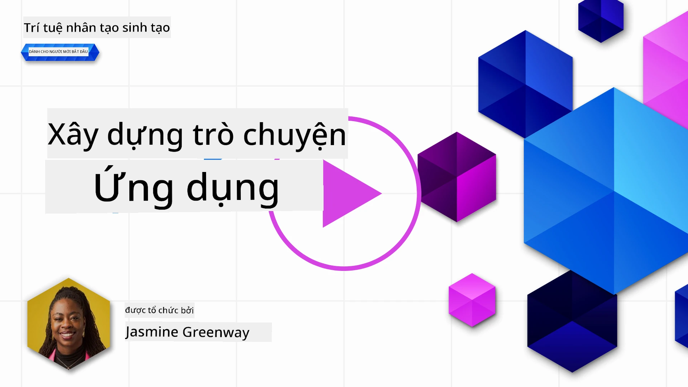
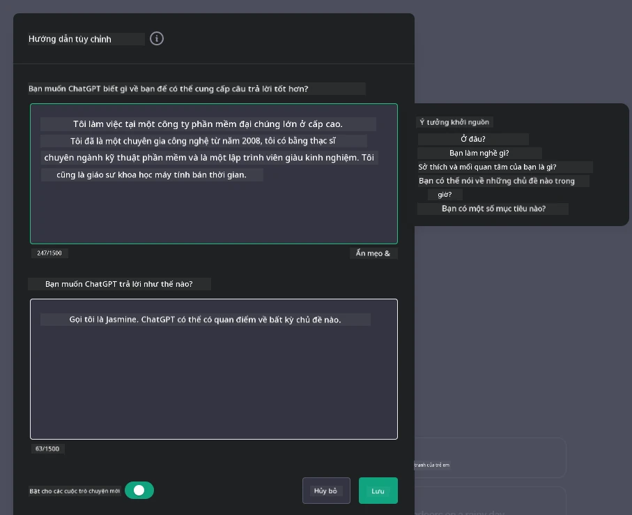

# Xây dựng Ứng dụng Trò chuyện Được hỗ trợ bởi Trí tuệ Nhân tạo Sinh tạo

[](https://youtu.be/R9V0ZY1BEQo?si=IHuU-fS9YWT8s4sA)

> _(Nhấn vào hình ảnh bên trên để xem video của bài học này)_

Bây giờ chúng ta đã thấy cách xây dựng các ứng dụng tạo văn bản, hãy cùng xem xét các ứng dụng trò chuyện.

Ứng dụng trò chuyện đã trở thành một phần không thể thiếu trong cuộc sống hàng ngày của chúng ta, không chỉ là một phương tiện trò chuyện thông thường. Chúng là một phần quan trọng của dịch vụ khách hàng, hỗ trợ kỹ thuật, và thậm chí là các hệ thống tư vấn tinh vi. Có lẽ bạn đã từng nhận được sự trợ giúp từ một ứng dụng trò chuyện không lâu trước đây. Khi chúng ta tích hợp các công nghệ tiên tiến hơn như trí tuệ nhân tạo sinh tạo vào các nền tảng này, độ phức tạp tăng lên và thách thức cũng vậy.

Một số câu hỏi cần được trả lời là:

- **Xây dựng ứng dụng**. Làm thế nào để chúng ta xây dựng hiệu quả và tích hợp liền mạch các ứng dụng được hỗ trợ bởi AI cho các trường hợp sử dụng cụ thể?
- **Giám sát**. Khi đã triển khai, làm thế nào để chúng ta giám sát và đảm bảo rằng các ứng dụng hoạt động ở mức chất lượng cao nhất, cả về mặt chức năng và tuân thủ [sáu nguyên tắc AI có trách nhiệm](https://www.microsoft.com/ai/responsible-ai?WT.mc_id=academic-105485-koreyst)?

Khi chúng ta bước sâu hơn vào thời đại được định hình bởi tự động hóa và tương tác con người-máy tính liền mạch, việc hiểu cách trí tuệ nhân tạo sinh tạo biến đổi phạm vi, chiều sâu và khả năng thích ứng của các ứng dụng trò chuyện trở nên thiết yếu. Bài học này sẽ khảo sát các khía cạnh kiến trúc hỗ trợ các hệ thống phức tạp này, xem xét các phương pháp tinh chỉnh cho các nhiệm vụ theo miền cụ thể, và đánh giá các chỉ số cùng các cân nhắc liên quan để đảm bảo triển khai AI có trách nhiệm.

## Giới thiệu

Bài học này bao gồm:

- Các kỹ thuật xây dựng và tích hợp ứng dụng trò chuyện hiệu quả.
- Cách áp dụng tùy chỉnh và tinh chỉnh cho các ứng dụng.
- Chiến lược và các cân nhắc để giám sát các ứng dụng trò chuyện hiệu quả.

## Mục tiêu học tập

Kết thúc bài học này, bạn sẽ có thể:

- Mô tả các cân nhắc khi xây dựng và tích hợp các ứng dụng trò chuyện vào hệ thống hiện có.
- Tùy chỉnh ứng dụng trò chuyện cho các trường hợp sử dụng cụ thể.
- Xác định các chỉ số và cân nhắc quan trọng để giám sát và duy trì chất lượng của các ứng dụng trò chuyện được hỗ trợ bởi AI.
- Đảm bảo các ứng dụng trò chuyện tận dụng AI một cách có trách nhiệm.

## Tích hợp Trí tuệ Nhân tạo Sinh tạo vào Ứng dụng Trò chuyện

Nâng cao ứng dụng trò chuyện thông qua AI sinh tạo không chỉ tập trung vào việc làm cho chúng thông minh hơn; mà là tối ưu hóa kiến trúc, hiệu suất, và giao diện người dùng để cung cấp trải nghiệm người dùng chất lượng. Điều này bao gồm khảo sát các nền tảng kiến trúc, tích hợp API, và các cân nhắc về giao diện người dùng. Phần này nhằm mang đến cho bạn một lộ trình toàn diện để điều hướng các lĩnh vực phức tạp này, dù bạn đang tích hợp vào hệ thống hiện có hay xây dựng như một nền tảng độc lập.

Kết thúc phần này, bạn sẽ có kiến thức chuyên môn cần thiết để xây dựng và tích hợp ứng dụng trò chuyện hiệu quả.

### Chatbot hay Ứng dụng Trò chuyện?

Trước khi đi vào xây dựng ứng dụng trò chuyện, hãy so sánh 'chatbot' và 'ứng dụng trò chuyện được hỗ trợ bởi AI', hai vai trò và chức năng khác nhau. Mục đích chính của một chatbot là tự động hóa các tác vụ hội thoại cụ thể, như trả lời các câu hỏi thường gặp hoặc theo dõi gói hàng. Nó thường được điều khiển bởi logic dựa trên quy tắc hoặc các thuật toán AI phức tạp. Ngược lại, một ứng dụng trò chuyện được hỗ trợ bởi AI là môi trường rộng lớn hơn nhiều, được thiết kế để hỗ trợ nhiều hình thức giao tiếp kỹ thuật số, như trò chuyện văn bản, giọng nói, và video giữa người dùng với nhau. Đặc điểm nổi bật là tích hợp mô hình AI sinh tạo mô phỏng các cuộc trò chuyện tinh tế, giống con người, tạo ra phản hồi dựa trên đa dạng đầu vào và tín hiệu ngữ cảnh. Một ứng dụng trò chuyện sử dụng AI sinh tạo có thể tham gia các cuộc thảo luận mở, thích ứng với các bối cảnh hội thoại đang phát triển, và thậm chí tạo ra các đoạn hội thoại sáng tạo hoặc phức tạp.

Bảng dưới đây tóm tắt các điểm khác biệt và tương đồng chính để giúp chúng ta hiểu rõ vai trò độc đáo của chúng trong giao tiếp kỹ thuật số.

| Chatbot                               | Ứng dụng Trò chuyện được Hỗ trợ bởi Trí tuệ Nhân tạo Sinh tạo |
| ------------------------------------- | -------------------------------------- |
| Tập trung vào nhiệm vụ và dựa trên quy tắc | Nhận biết ngữ cảnh                          |
| Thường tích hợp vào hệ thống lớn hơn   | Có thể chứa một hoặc nhiều chatbot       |
| Giới hạn trong các chức năng được lập trình | Bao gồm các mô hình AI sinh tạo         |
| Tương tác chuyên biệt & có cấu trúc     | Có khả năng thảo luận mở                   |

### Tận dụng chức năng có sẵn với SDK và API

Khi xây dựng một ứng dụng trò chuyện, bước đầu tốt là đánh giá những gì đã có sẵn. Sử dụng SDKs và APIs để xây dựng ứng dụng trò chuyện là một chiến lược có lợi vì nhiều lý do. Bằng cách tích hợp các SDK và API được tài liệu hóa kỹ lưỡng, bạn đang đặt chiến lược cho ứng dụng của mình thành công lâu dài, giải quyết các mối quan tâm về khả năng mở rộng và bảo trì.

- **Rút ngắn quá trình phát triển và giảm tải**: Dựa vào các chức năng đã xây dựng sẵn thay vì phải tự xây dựng tốn kém, cho phép bạn tập trung vào các khía cạnh khác của ứng dụng mà bạn cho là quan trọng hơn, như logic kinh doanh.
- **Hiệu suất tốt hơn**: Khi xây dựng chức năng từ đầu, bạn sẽ tự hỏi "Nó có mở rộng được không? Ứng dụng này có thể xử lý lượng người dùng đột biến không?" SDK và API được duy trì tốt thường có các giải pháp tích hợp cho các mối quan ngại này.
- **Dễ dàng bảo trì**: Việc cập nhật và cải tiến dễ dàng hơn vì hầu hết API và SDK chỉ yêu cầu cập nhật thư viện khi có phiên bản mới.
- **Tiếp cận công nghệ tiên tiến**: Tận dụng các mô hình đã được tinh chỉnh và huấn luyện trên bộ dữ liệu lớn cung cấp cho ứng dụng khả năng xử lý ngôn ngữ tự nhiên.

Việc truy cập chức năng của SDK hay API thường liên quan đến việc được phép sử dụng các dịch vụ được cung cấp, thường thông qua chìa khóa độc nhất hoặc mã xác thực. Chúng ta sẽ dùng Thư viện Python OpenAI để khám phá mô hình này. Bạn cũng có thể thử trong [notebook cho OpenAI](./python/oai-assignment.ipynb?WT.mc_id=academic-105485-koreyst) hoặc [notebook cho dịch vụ Azure OpenAI](./python/aoai-assignment.ipynb?WT.mc_id=academic-105485-koreys) cho bài học này.

```python
import os
from openai import OpenAI

API_KEY = os.getenv("OPENAI_API_KEY","")

client = OpenAI(
    api_key=API_KEY
    )

response = client.responses.create(model="gpt-4o-mini", input="Suggest two titles for an instructional lesson on chat applications for generative AI.", store=False)
print(response.output_text)
```

Ví dụ trên sử dụng mô hình GPT-4o mini với API Phản hồi để hoàn thành yêu cầu, nhưng lưu ý rằng khóa API được cài đặt trước khi thực hiện. Bạn sẽ nhận được lỗi nếu không đặt khóa.

## Trải nghiệm Người dùng (UX)

Các nguyên tắc UX chung áp dụng cho ứng dụng trò chuyện, nhưng dưới đây là một số cân nhắc bổ sung trở nên đặc biệt quan trọng do các thành phần học máy liên quan.

- **Cơ chế xử lý sự mơ hồ**: Các mô hình AI sinh tạo đôi khi tạo ra các câu trả lời mơ hồ. Một tính năng cho phép người dùng yêu cầu làm rõ có thể hữu ích khi họ gặp vấn đề này.
- **Duy trì ngữ cảnh**: Các mô hình AI sinh tạo nâng cao có khả năng ghi nhớ ngữ cảnh trong cuộc hội thoại, điều này có thể là một tài sản cần thiết cho trải nghiệm người dùng. Cho phép người dùng kiểm soát và quản lý ngữ cảnh cải thiện trải nghiệm, nhưng cũng tiềm ẩn rủi ro lưu trữ thông tin nhạy cảm của người dùng. Cần cân nhắc thời gian lưu trữ thông tin, như giới thiệu chính sách giữ dữ liệu, để cân bằng giữa nhu cầu ngữ cảnh và quyền riêng tư.
- **Cá nhân hóa**: Với khả năng học và thích ứng, các mô hình AI cung cấp trải nghiệm cá nhân hóa cho người dùng. Tùy chỉnh trải nghiệm qua các tính năng như hồ sơ người dùng không chỉ làm người dùng cảm thấy được thấu hiểu mà còn giúp họ tìm câu trả lời cụ thể hơn, tạo ra tương tác hiệu quả và hài lòng hơn.

Một ví dụ về cá nhân hóa là cài đặt "Hướng dẫn tùy chỉnh" trong ChatGPT của OpenAI. Nó cho phép bạn cung cấp thông tin về bản thân mà có thể là ngữ cảnh quan trọng cho các yêu cầu của bạn. Dưới đây là ví dụ về một hướng dẫn tùy chỉnh.



Hồ sơ này nhắc ChatGPT tạo một kế hoạch bài giảng về danh sách liên kết. Lưu ý rằng ChatGPT cân nhắc rằng người dùng có thể muốn kế hoạch bài giảng chi tiết hơn dựa trên kinh nghiệm của cô ấy.


### Khung thông báo hệ thống của Microsoft cho Mô hình Ngôn ngữ Lớn

[Microsoft đã cung cấp hướng dẫn](https://learn.microsoft.com/azure/ai-services/openai/concepts/system-message#define-the-models-output-format?WT.mc_id=academic-105485-koreyst) viết các thông điệp hệ thống hiệu quả khi sinh phản hồi từ LLM, chia thành 4 lĩnh vực:

1. Định nghĩa ai là đối tượng của mô hình, cùng với khả năng và giới hạn của nó.
2. Định nghĩa định dạng đầu ra của mô hình.
3. Cung cấp các ví dụ cụ thể thể hiện hành vi mong muốn của mô hình.
4. Cung cấp các rào chắn hành vi bổ sung.

### Khả năng tiếp cận

Dù người dùng có khiếm thị, thính giác, vận động hay nhận thức, một ứng dụng trò chuyện được thiết kế tốt nên có thể sử dụng được cho tất cả. Dưới đây là danh sách các tính năng cụ thể nhằm nâng cao khả năng tiếp cận cho các dạng khuyết tật khác nhau.

- **Tính năng cho người khiếm thị**: Chủ đề độ tương phản cao và phông chữ có thể điều chỉnh kích thước, tương thích với trình đọc màn hình.
- **Tính năng cho người khiếm thính**: Chức năng chuyển văn bản thành giọng nói và giọng nói thành văn bản, tín hiệu hình ảnh khi có thông báo âm thanh.
- **Tính năng cho người khuyết tật vận động**: Hỗ trợ điều hướng bằng bàn phím, lệnh giọng nói.
- **Tính năng cho người khuyết tật nhận thức**: Các tùy chọn ngôn ngữ đơn giản.

## Tùy chỉnh và tinh chỉnh cho Mô hình Ngôn ngữ theo Miền chuyên biệt

Hãy tưởng tượng một ứng dụng trò chuyện có thể hiểu thuật ngữ công ty bạn và dự đoán các câu hỏi phổ biến mà người dùng thường gặp. Có một vài cách tiếp cận đáng lưu ý:

- **Tận dụng mô hình DSL**. DSL là viết tắt của domain specific language (ngôn ngữ chuyên ngành). Bạn có thể tận dụng một mô hình DSL được huấn luyện trên một miền cụ thể để hiểu các khái niệm và kịch bản của nó.
- **Áp dụng tinh chỉnh**. Tinh chỉnh là quá trình huấn luyện thêm mô hình của bạn với dữ liệu cụ thể.

## Tùy chỉnh: Sử dụng DSL

Tận dụng các mô hình ngôn ngữ chuyên ngành (mô hình DSL) có thể tăng cường sự tương tác của người dùng bằng cách cung cấp các tương tác chuyên sâu, liên quan đến ngữ cảnh. Đây là mô hình được huấn luyện hoặc tinh chỉnh để hiểu và tạo văn bản liên quan đến một lĩnh vực, ngành nghề hoặc chủ đề cụ thể. Các lựa chọn sử dụng mô hình DSL có thể khác nhau từ huấn luyện từ đầu đến dùng các mô hình đã có sẵn qua SDKs và APIs. Một lựa chọn nữa là tinh chỉnh, tức là lấy một mô hình đã được huấn luyện sẵn và điều chỉnh cho một miền cụ thể.

## Tùy chỉnh: Áp dụng tinh chỉnh

Tinh chỉnh thường được cân nhắc khi một mô hình đã được huấn luyện sẵn gặp hạn chế trong một miền chuyên biệt hoặc nhiệm vụ cụ thể.

Ví dụ, các câu hỏi y tế rất phức tạp và đòi hỏi nhiều ngữ cảnh. Khi một chuyên gia y tế chẩn đoán bệnh cho bệnh nhân, họ dựa vào nhiều yếu tố như lối sống hoặc các tình trạng có sẵn, và có thể dựa vào các tạp chí y khoa gần đây để xác nhận chẩn đoán. Trong các kịch bản tinh tế như vậy, một ứng dụng trò chuyện AI đa năng không thể là nguồn tin cậy.

### Kịch bản: một ứng dụng y tế

Hãy xem xét một ứng dụng trò chuyện được thiết kế để hỗ trợ các nhân viên y tế bằng cách cung cấp các tài liệu nhanh về hướng dẫn điều trị, tương tác thuốc, hoặc các khám phá nghiên cứu mới nhất.

Một mô hình đa năng có thể đáp ứng đủ cho việc trả lời các câu hỏi y tế cơ bản hoặc cung cấp lời khuyên tổng quát, nhưng có thể gặp khó khăn với:

- **Các trường hợp đặc thù hoặc phức tạp cao**. Ví dụ, một bác sĩ thần kinh có thể hỏi ứng dụng: "Các phương pháp quản lý tốt nhất hiện nay cho chứng động kinh kháng thuốc ở bệnh nhi là gì?"
- **Thiếu cập nhật gần đây**. Một mô hình đa năng có thể khó cung cấp câu trả lời cập nhật nhất bao gồm các tiến bộ mới nhất trong thần kinh học và dược lý.

Trong các tình huống như vậy, việc tinh chỉnh mô hình với bộ dữ liệu y tế chuyên biệt có thể cải thiện đáng kể khả năng xử lý các câu hỏi y tế phức tạp một cách chính xác và đáng tin cậy hơn. Điều này đòi hỏi quyền truy cập vào bộ dữ liệu lớn và phù hợp thể hiện các thách thức và câu hỏi đặc thù của miền cần được giải quyết.

## Các cân nhắc cho trải nghiệm trò chuyện chất lượng cao dựa trên AI

Phần này giới thiệu các tiêu chí cho các ứng dụng trò chuyện "chất lượng cao", bao gồm ghi nhận các chỉ số có thể hành động và tuân thủ một khuôn khổ tận dụng công nghệ AI có trách nhiệm.

### Các chỉ số chính

Để duy trì hiệu suất chất lượng cao cho một ứng dụng, việc theo dõi các chỉ số và cân nhắc quan trọng là cần thiết. Những đo lường này không chỉ đảm bảo chức năng của ứng dụng mà còn đánh giá chất lượng mô hình AI và trải nghiệm người dùng. Dưới đây là danh sách bao gồm các chỉ số cơ bản, AI, và trải nghiệm người dùng để xem xét.

| Chỉ số                      | Định nghĩa                                                                                                             | Cân nhắc cho Nhà phát triển Ứng dụng Trò chuyện                  |
| ----------------------------- | ---------------------------------------------------------------------------------------------------------------------- | ----------------------------------------------------------------- |
| **Thời gian hoạt động (Uptime)** | Đo thời gian ứng dụng hoạt động và người dùng có thể truy cập.                                                        | Làm thế nào để bạn giảm thiểu thời gian ngưng hoạt động?           |
| **Thời gian phản hồi**             | Thời gian ứng dụng trả lời câu hỏi của người dùng.                                                                    | Làm thế nào để bạn tối ưu xử lý truy vấn để cải thiện thời gian phản hồi? |
| **Độ chính xác (Precision)**         | Tỷ lệ dự đoán đúng trong số các dự đoán dương tính.                                                                    | Làm thế nào để bạn xác thực độ chính xác của mô hình?              |
| **Độ nhớ (Recall, Độ nhạy)**          | Tỷ lệ dự đoán đúng trong số các trường hợp dương tính thực tế.                                                         | Làm thế nào để bạn đo lường và cải thiện độ nhớ?                   |
| **Điểm F1 (F1 Score)**               | Trung bình điều hòa giữa độ chính xác và độ nhớ, cân bằng giữa hai yếu tố.                                            | Mục tiêu điểm F1 của bạn là bao nhiêu? Làm thế nào để bạn cân bằng độ chính xác và độ nhớ? |
| **Độ phức tạp (Perplexity)**        | Đo mức độ phù hợp của phân phối xác suất do mô hình dự báo với phân phối thực tế của dữ liệu.                          | Làm thế nào để bạn giảm thiểu độ phức tạp?                         |
| **Chỉ số hài lòng người dùng** | Đo cảm nhận của người dùng về ứng dụng. Thường được thu thập qua khảo sát.                                             | Bạn thu thập phản hồi người dùng bao lâu một lần? Làm thế nào để bạn điều chỉnh theo phản hồi đó? |
| **Tỷ lệ lỗi**                      | Tỷ lệ mô hình mắc lỗi trong việc hiểu hoặc đầu ra.                                                                     | Bạn có các chiến lược nào để giảm tỷ lệ lỗi?                      |
| **Chu kỳ huấn luyện lại**          | Tần suất cập nhật mô hình để bổ sung dữ liệu và hiểu biết mới.                                                         | Bạn huấn luyện lại mô hình bao lâu một lần? Điều gì kích hoạt chu kỳ huấn luyện lại? |

| **Phát hiện Dị thường**         | Công cụ và kỹ thuật để xác định các mẫu bất thường không phù hợp với hành vi dự kiến.                        | Bạn sẽ phản ứng như thế nào với các dị thường?                                        |

### Triển khai các Thực hành Trí tuệ Nhân tạo Có trách nhiệm trong Ứng dụng Chat

Phương pháp của Microsoft về Trí tuệ Nhân tạo Có trách nhiệm đã xác định sáu nguyên tắc mà nên dẫn dắt việc phát triển và sử dụng AI. Dưới đây là các nguyên tắc, định nghĩa của chúng và những điều nhà phát triển ứng dụng chat nên cân nhắc và lý do tại sao họ nên nghiêm túc thực hiện.

| Nguyên tắc             | Định nghĩa của Microsoft                                | Những điều cần cân nhắc cho Nhà phát triển Chat                                   | Tại sao nó quan trọng                                                                    |
| ---------------------- | ----------------------------------------------------- | ------------------------------------------------------------------------------- | --------------------------------------------------------------------------------------- |
| Công bằng               | Hệ thống AI nên đối xử công bằng với tất cả mọi người. | Đảm bảo ứng dụng chat không phân biệt đối xử dựa trên dữ liệu người dùng.         | Để xây dựng niềm tin và sự bao trùm giữa người dùng; tránh các hệ lụy pháp lý.            |
| Đáng tin cậy và An toàn | Hệ thống AI nên hoạt động đáng tin cậy và an toàn.      | Triển khai kiểm thử và các biện pháp dự phòng để giảm thiểu lỗi và rủi ro.       | Đảm bảo sự hài lòng của người dùng và ngăn ngừa các nguy hại tiềm ẩn.                    |
| Quyền riêng tư và Bảo mật   | Hệ thống AI nên an toàn và tôn trọng quyền riêng tư.      | Triển khai mã hóa mạnh và các biện pháp bảo vệ dữ liệu.                          | Để bảo vệ dữ liệu nhạy cảm của người dùng và tuân thủ luật về quyền riêng tư.           |
| Tính hòa nhập          | Hệ thống AI nên trao quyền cho mọi người và thu hút họ. | Thiết kế UI/UX dễ truy cập và dễ sử dụng cho đa dạng đối tượng.                  | Đảm bảo nhiều người hơn có thể sử dụng ứng dụng một cách hiệu quả.                       |
| Tính minh bạch           | Hệ thống AI nên dễ hiểu.                                | Cung cấp tài liệu rõ ràng và lý giải các phản hồi AI.                            | Người dùng có nhiều khả năng tin tưởng hệ thống nếu họ có thể hiểu cách ra quyết định.  |
| Trách nhiệm giải trình         | Con người nên chịu trách nhiệm về các hệ thống AI.         | Thiết lập quy trình rõ ràng để kiểm tra và cải thiện các quyết định AI.           | Cho phép cải tiến liên tục và các biện pháp khắc phục khi có sai sót.                    |

## Bài Tập

Xem [assignment](../../../07-building-chat-applications/python). Nó sẽ dẫn bạn qua một chuỗi bài tập từ chạy các lời nhắc chat đầu tiên của bạn, đến phân loại và tóm tắt văn bản và nhiều hơn nữa. Lưu ý rằng các bài tập có sẵn bằng nhiều ngôn ngữ lập trình khác nhau!

## Làm Tốt Lắm! Tiếp tục Hành Trình

Sau khi hoàn thành bài học này, hãy xem bộ sưu tập [Generative AI Learning collection](https://aka.ms/genai-collection?WT.mc_id=academic-105485-koreyst) để tiếp tục nâng cao kiến thức về Generative AI của bạn!

Hãy đến Bài 8 để xem cách bạn có thể bắt đầu [xây dựng ứng dụng tìm kiếm](../08-building-search-applications/README.md?WT.mc_id=academic-105485-koreyst)!

---

<!-- CO-OP TRANSLATOR DISCLAIMER START -->
**Tuyên bố miễn trừ trách nhiệm**:
Tài liệu này đã được dịch bằng dịch vụ dịch thuật AI [Co-op Translator](https://github.com/Azure/co-op-translator). Mặc dù chúng tôi cố gắng đảm bảo độ chính xác, xin lưu ý rằng bản dịch tự động có thể chứa lỗi hoặc sai sót. Tài liệu gốc bằng ngôn ngữ gốc nên được coi là nguồn tin chính thức. Đối với thông tin quan trọng, nên sử dụng dịch vụ dịch thuật chuyên nghiệp bởi con người. Chúng tôi không chịu trách nhiệm về bất kỳ hiểu lầm hoặc giải thích sai nào phát sinh từ việc sử dụng bản dịch này.
<!-- CO-OP TRANSLATOR DISCLAIMER END -->