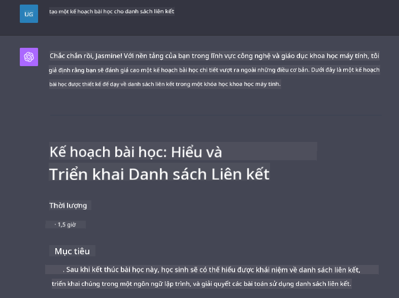

<!--
CO_OP_TRANSLATOR_METADATA:
{
  "original_hash": "a5308963a56cfbad2d73b0fa99fe84b3",
  "translation_date": "2025-10-17T20:37:10+00:00",
  "source_file": "07-building-chat-applications/README.md",
  "language_code": "vi"
}
-->
# Xây dựng ứng dụng trò chuyện sử dụng AI tạo sinh

[](https://youtu.be/R9V0ZY1BEQo?si=IHuU-fS9YWT8s4sA)

> _(Nhấp vào hình ảnh trên để xem video của bài học này)_

Sau khi đã tìm hiểu cách xây dựng ứng dụng tạo văn bản, hãy cùng khám phá các ứng dụng trò chuyện.

Các ứng dụng trò chuyện đã trở thành một phần không thể thiếu trong cuộc sống hàng ngày của chúng ta, không chỉ là phương tiện giao tiếp thông thường. Chúng là những phần quan trọng trong dịch vụ khách hàng, hỗ trợ kỹ thuật, và thậm chí là các hệ thống tư vấn phức tạp. Có lẽ bạn đã từng nhận được sự hỗ trợ từ một ứng dụng trò chuyện không lâu trước đây. Khi chúng ta tích hợp các công nghệ tiên tiến như AI tạo sinh vào các nền tảng này, độ phức tạp tăng lên và các thách thức cũng vậy.

Một số câu hỏi cần được trả lời là:

- **Xây dựng ứng dụng**. Làm thế nào để chúng ta xây dựng hiệu quả và tích hợp liền mạch các ứng dụng sử dụng AI cho các trường hợp cụ thể?
- **Giám sát**. Sau khi triển khai, làm thế nào để chúng ta giám sát và đảm bảo rằng các ứng dụng hoạt động với chất lượng cao nhất, cả về mặt chức năng và tuân thủ [sáu nguyên tắc AI có trách nhiệm](https://www.microsoft.com/ai/responsible-ai?WT.mc_id=academic-105485-koreyst)?

Khi chúng ta tiến xa hơn vào thời đại được định hình bởi tự động hóa và tương tác liền mạch giữa con người và máy móc, việc hiểu cách AI tạo sinh biến đổi phạm vi, chiều sâu và khả năng thích ứng của các ứng dụng trò chuyện trở nên rất quan trọng. Bài học này sẽ điều tra các khía cạnh kiến trúc hỗ trợ các hệ thống phức tạp này, đi sâu vào các phương pháp tinh chỉnh chúng cho các nhiệm vụ cụ thể theo lĩnh vực, và đánh giá các chỉ số cũng như các cân nhắc liên quan đến việc đảm bảo triển khai AI có trách nhiệm.

## Giới thiệu

Bài học này bao gồm:

- Các kỹ thuật để xây dựng và tích hợp ứng dụng trò chuyện một cách hiệu quả.
- Cách áp dụng tùy chỉnh và tinh chỉnh cho các ứng dụng.
- Các chiến lược và cân nhắc để giám sát hiệu quả các ứng dụng trò chuyện.

## Mục tiêu học tập

Sau khi hoàn thành bài học này, bạn sẽ có thể:

- Mô tả các cân nhắc khi xây dựng và tích hợp ứng dụng trò chuyện vào các hệ thống hiện có.
- Tùy chỉnh ứng dụng trò chuyện cho các trường hợp sử dụng cụ thể.
- Xác định các chỉ số chính và cân nhắc để giám sát và duy trì chất lượng của các ứng dụng trò chuyện sử dụng AI.
- Đảm bảo các ứng dụng trò chuyện sử dụng AI một cách có trách nhiệm.

## Tích hợp AI tạo sinh vào ứng dụng trò chuyện

Nâng cấp ứng dụng trò chuyện thông qua AI tạo sinh không chỉ tập trung vào việc làm cho chúng thông minh hơn; mà còn là tối ưu hóa kiến trúc, hiệu suất và giao diện người dùng để mang lại trải nghiệm người dùng chất lượng. Điều này bao gồm việc điều tra các nền tảng kiến trúc, tích hợp API, và các cân nhắc về giao diện người dùng. Phần này nhằm cung cấp cho bạn một lộ trình toàn diện để điều hướng các lĩnh vực phức tạp này, dù bạn đang tích hợp chúng vào các hệ thống hiện có hay xây dựng chúng như các nền tảng độc lập.

Sau khi hoàn thành phần này, bạn sẽ có đủ chuyên môn để xây dựng và tích hợp ứng dụng trò chuyện một cách hiệu quả.

### Chatbot hay ứng dụng trò chuyện?

Trước khi đi sâu vào việc xây dựng ứng dụng trò chuyện, hãy so sánh 'chatbot' với 'ứng dụng trò chuyện sử dụng AI', vì chúng có vai trò và chức năng khác nhau. Mục đích chính của chatbot là tự động hóa các nhiệm vụ trò chuyện cụ thể, chẳng hạn như trả lời các câu hỏi thường gặp hoặc theo dõi một gói hàng. Nó thường được điều khiển bởi logic dựa trên quy tắc hoặc các thuật toán AI phức tạp. Ngược lại, một ứng dụng trò chuyện sử dụng AI là một môi trường rộng lớn hơn nhiều, được thiết kế để tạo điều kiện cho các hình thức giao tiếp kỹ thuật số khác nhau, chẳng hạn như trò chuyện văn bản, giọng nói và video giữa người dùng. Đặc điểm nổi bật của nó là tích hợp mô hình AI tạo sinh mô phỏng các cuộc trò chuyện tinh tế, giống như con người, tạo ra các phản hồi dựa trên nhiều loại đầu vào và ngữ cảnh. Một ứng dụng trò chuyện sử dụng AI tạo sinh có thể tham gia vào các cuộc thảo luận mở, thích ứng với các ngữ cảnh trò chuyện đang phát triển, và thậm chí tạo ra các cuộc đối thoại sáng tạo hoặc phức tạp.

Bảng dưới đây nêu rõ các điểm khác biệt và tương đồng chính để giúp chúng ta hiểu vai trò độc đáo của chúng trong giao tiếp kỹ thuật số.

| Chatbot                               | Ứng dụng trò chuyện sử dụng AI tạo sinh |
| ------------------------------------- | -------------------------------------- |
| Tập trung vào nhiệm vụ và dựa trên quy tắc | Nhận biết ngữ cảnh                     |
| Thường được tích hợp vào các hệ thống lớn | Có thể chứa một hoặc nhiều chatbot      |
| Giới hạn trong các chức năng được lập trình | Tích hợp các mô hình AI tạo sinh        |
| Tương tác chuyên biệt & có cấu trúc   | Có khả năng thảo luận mở rộng          |

### Tận dụng các chức năng có sẵn với SDKs và APIs

Khi xây dựng một ứng dụng trò chuyện, một bước khởi đầu tuyệt vời là đánh giá những gì đã có sẵn. Sử dụng SDKs và APIs để xây dựng ứng dụng trò chuyện là một chiến lược có lợi vì nhiều lý do. Bằng cách tích hợp các SDKs và APIs được tài liệu hóa tốt, bạn đang định vị chiến lược ứng dụng của mình cho sự thành công lâu dài, giải quyết các mối quan tâm về khả năng mở rộng và bảo trì.

- **Đẩy nhanh quá trình phát triển và giảm chi phí**: Dựa vào các chức năng có sẵn thay vì quá trình xây dựng tốn kém cho phép bạn tập trung vào các khía cạnh khác của ứng dụng mà bạn có thể thấy quan trọng hơn, chẳng hạn như logic kinh doanh.
- **Hiệu suất tốt hơn**: Khi xây dựng chức năng từ đầu, bạn sẽ tự hỏi "Làm thế nào để nó mở rộng? Ứng dụng này có khả năng xử lý lượng người dùng tăng đột ngột không?" Các SDK và APIs được bảo trì tốt thường có các giải pháp tích hợp cho những mối quan tâm này.
- **Dễ dàng bảo trì**: Việc cập nhật và cải tiến dễ dàng hơn vì hầu hết các APIs và SDKs chỉ yêu cầu cập nhật thư viện khi có phiên bản mới được phát hành.
- **Truy cập công nghệ tiên tiến**: Tận dụng các mô hình đã được tinh chỉnh và huấn luyện trên các tập dữ liệu rộng lớn cung cấp cho ứng dụng của bạn khả năng xử lý ngôn ngữ tự nhiên.

Việc truy cập chức năng của một SDK hoặc API thường liên quan đến việc xin phép sử dụng các dịch vụ được cung cấp, thường thông qua việc sử dụng một khóa duy nhất hoặc mã thông báo xác thực. Chúng ta sẽ sử dụng Thư viện Python của OpenAI để khám phá cách thực hiện điều này. Bạn cũng có thể thử nghiệm trong [notebook cho OpenAI](./python/oai-assignment.ipynb?WT.mc_id=academic-105485-koreyst) hoặc [notebook cho Azure OpenAI Services](./python/aoai-assignment.ipynb?WT.mc_id=academic-105485-koreys) của bài học này.

```python
import os
from openai import OpenAI

API_KEY = os.getenv("OPENAI_API_KEY","")

client = OpenAI(
    api_key=API_KEY
    )

chat_completion = client.chat.completions.create(model="gpt-3.5-turbo", messages=[{"role": "user", "content": "Suggest two titles for an instructional lesson on chat applications for generative AI."}])
```

Ví dụ trên sử dụng mô hình GPT-3.5 Turbo để hoàn thành yêu cầu, nhưng lưu ý rằng khóa API được thiết lập trước khi thực hiện. Bạn sẽ nhận được lỗi nếu không thiết lập khóa.

## Trải nghiệm người dùng (UX)

Các nguyên tắc UX chung áp dụng cho các ứng dụng trò chuyện, nhưng đây là một số cân nhắc bổ sung trở nên đặc biệt quan trọng do các thành phần học máy liên quan.

- **Cơ chế giải quyết sự mơ hồ**: Các mô hình AI tạo sinh đôi khi tạo ra các câu trả lời mơ hồ. Một tính năng cho phép người dùng yêu cầu làm rõ có thể hữu ích nếu họ gặp phải vấn đề này.
- **Lưu giữ ngữ cảnh**: Các mô hình AI tạo sinh tiên tiến có khả năng ghi nhớ ngữ cảnh trong một cuộc trò chuyện, điều này có thể là một tài sản cần thiết cho trải nghiệm người dùng. Việc cho phép người dùng kiểm soát và quản lý ngữ cảnh cải thiện trải nghiệm người dùng, nhưng cũng mang lại rủi ro về việc lưu giữ thông tin nhạy cảm của người dùng. Các cân nhắc về thời gian lưu trữ thông tin này, chẳng hạn như việc giới thiệu chính sách lưu trữ, có thể cân bằng nhu cầu về ngữ cảnh với quyền riêng tư.
- **Cá nhân hóa**: Với khả năng học hỏi và thích nghi, các mô hình AI cung cấp trải nghiệm cá nhân hóa cho người dùng. Tùy chỉnh trải nghiệm người dùng thông qua các tính năng như hồ sơ người dùng không chỉ làm cho người dùng cảm thấy được hiểu, mà còn giúp họ tìm kiếm câu trả lời cụ thể, tạo ra một tương tác hiệu quả và hài lòng hơn.

Một ví dụ về cá nhân hóa là cài đặt "Hướng dẫn tùy chỉnh" trong ChatGPT của OpenAI. Nó cho phép bạn cung cấp thông tin về bản thân mà có thể là ngữ cảnh quan trọng cho các yêu cầu của bạn. Dưới đây là một ví dụ về hướng dẫn tùy chỉnh.


Hồ sơ này yêu cầu ChatGPT tạo một kế hoạch bài học về danh sách liên kết. Lưu ý rằng ChatGPT đã tính đến việc người dùng có thể muốn một kế hoạch bài học chi tiết hơn dựa trên kinh nghiệm của cô ấy.



### Khung tin nhắn hệ thống của Microsoft dành cho các mô hình ngôn ngữ lớn

[Microsoft đã cung cấp hướng dẫn](https://learn.microsoft.com/azure/ai-services/openai/concepts/system-message#define-the-models-output-format?WT.mc_id=academic-105485-koreyst) về cách viết tin nhắn hệ thống hiệu quả khi tạo phản hồi từ các mô hình ngôn ngữ lớn (LLMs), được chia thành 4 lĩnh vực:

1. Xác định đối tượng mà mô hình hướng đến, cũng như khả năng và hạn chế của nó.
2. Xác định định dạng đầu ra của mô hình.
3. Cung cấp các ví dụ cụ thể minh họa hành vi dự kiến của mô hình.
4. Cung cấp các rào cản hành vi bổ sung.

### Khả năng tiếp cận

Dù người dùng có gặp khó khăn về thị giác, thính giác, vận động hay nhận thức, một ứng dụng trò chuyện được thiết kế tốt nên có thể sử dụng được cho tất cả mọi người. Danh sách dưới đây phân tích các tính năng cụ thể nhằm nâng cao khả năng tiếp cận cho các khiếm khuyết của người dùng.

- **Tính năng cho người khiếm thị**: Chủ đề có độ tương phản cao và văn bản có thể thay đổi kích thước, tương thích với trình đọc màn hình.
- **Tính năng cho người khiếm thính**: Chức năng chuyển văn bản thành giọng nói và giọng nói thành văn bản, các tín hiệu hình ảnh cho thông báo âm thanh.
- **Tính năng cho người khiếm khuyết vận động**: Hỗ trợ điều hướng bằng bàn phím, lệnh giọng nói.
- **Tính năng cho người khiếm khuyết nhận thức**: Tùy chọn ngôn ngữ đơn giản hóa.

## Tùy chỉnh và tinh chỉnh cho các mô hình ngôn ngữ chuyên ngành

Hãy tưởng tượng một ứng dụng trò chuyện hiểu được thuật ngữ của công ty bạn và dự đoán các câu hỏi cụ thể mà người dùng thường có. Có một vài cách tiếp cận đáng được đề cập:

- **Tận dụng các mô hình ngôn ngữ chuyên ngành (DSL)**. DSL là viết tắt của ngôn ngữ chuyên ngành. Bạn có thể tận dụng một mô hình DSL được huấn luyện trên một lĩnh vực cụ thể để hiểu các khái niệm và kịch bản của nó.
- **Áp dụng tinh chỉnh**. Tinh chỉnh là quá trình huấn luyện thêm mô hình của bạn với dữ liệu cụ thể.

## Tùy chỉnh: Sử dụng DSL

Tận dụng các mô hình ngôn ngữ chuyên ngành (DSL Models) có thể tăng cường sự tương tác của người dùng bằng cách cung cấp các tương tác chuyên biệt, phù hợp với ngữ cảnh. Đây là một mô hình được huấn luyện hoặc tinh chỉnh để hiểu và tạo ra văn bản liên quan đến một lĩnh vực, ngành công nghiệp, hoặc chủ đề cụ thể. Các tùy chọn để sử dụng mô hình DSL có thể thay đổi từ việc huấn luyện một mô hình từ đầu, đến việc sử dụng các mô hình có sẵn thông qua SDKs và APIs. Một tùy chọn khác là tinh chỉnh, bao gồm việc lấy một mô hình đã được huấn luyện trước và điều chỉnh nó cho một lĩnh vực cụ thể.

## Tùy chỉnh: Áp dụng tinh chỉnh

Tinh chỉnh thường được xem xét khi một mô hình đã được huấn luyện trước không đáp ứng được trong một lĩnh vực chuyên biệt hoặc nhiệm vụ cụ thể.

Ví dụ, các câu hỏi y tế rất phức tạp và yêu cầu nhiều ngữ cảnh. Khi một chuyên gia y tế chẩn đoán bệnh nhân, nó dựa trên nhiều yếu tố như lối sống hoặc các tình trạng bệnh lý trước đó, và thậm chí có thể dựa vào các tạp chí y khoa gần đây để xác nhận chẩn đoán của họ. Trong các tình huống tinh tế như vậy, một ứng dụng trò chuyện AI mục đích chung không thể là nguồn đáng tin cậy.

### Tình huống: một ứng dụng y tế

Hãy xem xét một ứng dụng trò chuyện được thiết kế để hỗ trợ các chuyên gia y tế bằng cách cung cấp các tài liệu tham khảo nhanh về hướng dẫn điều trị, tương tác thuốc, hoặc các phát hiện nghiên cứu gần đây.

Một mô hình mục đích chung có thể đủ để trả lời các câu hỏi y tế cơ bản hoặc cung cấp lời khuyên chung, nhưng nó có thể gặp khó khăn với các vấn đề sau:

- **Các trường hợp rất cụ thể hoặc phức tạp**. Ví dụ, một bác sĩ thần kinh có thể hỏi ứng dụng, "Các phương pháp tốt nhất hiện nay để quản lý bệnh động kinh kháng thuốc ở bệnh nhân nhi là gì?"
- **Thiếu các tiến bộ gần đây**. Một mô hình mục đích chung có thể gặp khó khăn trong việc cung cấp câu trả lời hiện tại kết hợp các tiến bộ mới nhất trong thần kinh học và dược học.

Trong những trường hợp như vậy, việc tinh chỉnh mô hình với một tập dữ liệu y tế chuyên biệt có thể cải thiện đáng kể khả năng xử lý các câu hỏi y tế phức tạp một cách chính xác và đáng tin cậy. Điều này yêu cầu truy cập vào một tập dữ liệu lớn và phù hợp đại diện cho các thách thức và câu hỏi cụ thể theo lĩnh vực cần được giải quyết.

## Cân nhắc để có trải nghiệm trò chuyện chất lượng cao sử dụng AI

Phần này nêu rõ các tiêu chí cho ứng dụng trò chuyện "chất lượng cao", bao gồm việc thu thập các chỉ số có thể hành động và tuân thủ một khung làm việc sử dụng công nghệ AI một cách có trách nhiệm.

### Các chỉ số chính

Để duy trì hiệu suất chất lượng cao của một ứng dụng, điều quan trọng là phải theo dõi các chỉ số chính và các cân nhắc. Những phép đo này không chỉ đảm bảo chức năng của ứng dụng mà còn đánh giá chất lượng của mô hình AI và trải nghiệm người dùng. Dưới đây là danh sách các chỉ số cơ bản, AI, và trải nghiệm người dùng cần xem xét.

| Chỉ số                        | Định nghĩa                                                                                                             | Cân nhắc cho nhà phát triển ứng dụng trò chuyện                          |
| ----------------------------- | ---------------------------------------------------------------------------------------------------------------------- | ------------------------------------------------------------------------- |
| **Thời gian hoạt động**       | Đo lường thời gian ứng dụng hoạt động và có thể truy cập bởi người dùng.                                                | Làm thế nào để bạn giảm thiểu thời gian ngừng hoạt động?                  |
| **Thời gian phản hồi**        | Thời gian ứng dụng trả lời câu hỏi của người dùng.                                                                      | Làm thế nào để bạn tối ưu hóa quá trình xử lý yêu cầu để cải thiện thời gian phản hồi? |
| **Độ chính xác**              | Tỷ lệ dự đoán đúng tích cực so với tổng số dự đoán tích cực.                                                            | Làm thế nào để bạn xác thực độ chính xác của mô hình?                     |
| **Độ nhạy (Recall)**          | Tỷ lệ dự đoán đúng tích cực so với số lượng tích cực thực tế.                                                           | Làm thế nào để bạn đo lường và cải thiện độ nhạy?                         |
| **Điểm F1**                   | Trung bình điều hòa của độ chính xác và độ nhạy, cân bằng sự đánh đổi giữa cả hai.                                      | Điểm F1 mục tiêu của bạn là gì? Làm thế nào để bạn cân bằng độ chính xác và độ nhạy? |
| **Độ phức tạp (Perplexity)**  | Đo lường mức độ phân phối xác suất được dự đoán bởi mô hình phù hợp với phân phối thực tế của dữ liệu.                   | Làm thế nào để bạn giảm thiểu độ phức tạp?                                |
| **Chỉ số hài lòng của người dùng** | Đo lường nhận thức của người dùng về ứng dụng. Thường được thu thập thông qua khảo sát.                                | Bạn sẽ thu thập phản hồi của người dùng bao lâu một lần? Làm thế nào để bạn điều chỉnh dựa trên phản hồi đó? |
| **Tỷ lệ lỗi**                 | Tỷ lệ mà mô hình
| **Phát hiện bất thường**      | Công cụ và kỹ thuật để xác định các mẫu bất thường không tuân theo hành vi mong đợi.                                | Bạn sẽ phản ứng thế nào với các bất thường?                                         |

### Triển khai các thực hành AI có trách nhiệm trong ứng dụng trò chuyện

Cách tiếp cận AI có trách nhiệm của Microsoft đã xác định sáu nguyên tắc nên hướng dẫn việc phát triển và sử dụng AI. Dưới đây là các nguyên tắc, định nghĩa của chúng, và những điều mà nhà phát triển ứng dụng trò chuyện nên cân nhắc cũng như lý do tại sao họ nên coi trọng chúng.

| Nguyên tắc               | Định nghĩa của Microsoft                              | Những điều cần cân nhắc cho nhà phát triển ứng dụng trò chuyện          | Tại sao điều này quan trọng                                                                  |
| ------------------------ | ---------------------------------------------------- | ---------------------------------------------------------------------- | ------------------------------------------------------------------------------------------ |
| Công bằng               | Hệ thống AI nên đối xử công bằng với tất cả mọi người. | Đảm bảo ứng dụng trò chuyện không phân biệt đối xử dựa trên dữ liệu người dùng. | Xây dựng niềm tin và sự hòa nhập giữa người dùng; tránh các hậu quả pháp lý.               |
| Độ tin cậy và an toàn   | Hệ thống AI nên hoạt động đáng tin cậy và an toàn.    | Thực hiện kiểm tra và các biện pháp an toàn để giảm thiểu lỗi và rủi ro. | Đảm bảo sự hài lòng của người dùng và ngăn ngừa các tác hại tiềm ẩn.                       |
| Quyền riêng tư và bảo mật | Hệ thống AI nên an toàn và tôn trọng quyền riêng tư.  | Thực hiện các biện pháp mã hóa mạnh mẽ và bảo vệ dữ liệu.               | Bảo vệ dữ liệu nhạy cảm của người dùng và tuân thủ các luật về quyền riêng tư.             |
| Tính bao trùm           | Hệ thống AI nên trao quyền cho mọi người và gắn kết mọi người. | Thiết kế giao diện người dùng dễ tiếp cận và dễ sử dụng cho các nhóm đối tượng đa dạng. | Đảm bảo một phạm vi rộng hơn người dùng có thể sử dụng ứng dụng một cách hiệu quả.         |
| Tính minh bạch          | Hệ thống AI nên dễ hiểu.                              | Cung cấp tài liệu rõ ràng và lý giải cho các phản hồi của AI.           | Người dùng có xu hướng tin tưởng hệ thống hơn nếu họ hiểu cách các quyết định được đưa ra. |
| Trách nhiệm             | Con người nên chịu trách nhiệm về các hệ thống AI.    | Thiết lập quy trình rõ ràng để kiểm tra và cải thiện các quyết định của AI. | Cho phép cải tiến liên tục và các biện pháp sửa chữa trong trường hợp xảy ra sai sót.       |

## Bài tập

Xem [bài tập](../../../07-building-chat-applications/python). Nó sẽ hướng dẫn bạn qua một loạt các bài tập từ việc chạy các lời nhắc trò chuyện đầu tiên, đến phân loại và tóm tắt văn bản và nhiều hơn nữa. Lưu ý rằng các bài tập có sẵn bằng các ngôn ngữ lập trình khác nhau!

## Làm tốt lắm! Tiếp tục hành trình

Sau khi hoàn thành bài học này, hãy xem [bộ sưu tập học AI tạo sinh](https://aka.ms/genai-collection?WT.mc_id=academic-105485-koreyst) của chúng tôi để tiếp tục nâng cao kiến thức về AI tạo sinh!

Hãy chuyển sang Bài học 8 để xem cách bạn có thể bắt đầu [xây dựng các ứng dụng tìm kiếm](../08-building-search-applications/README.md?WT.mc_id=academic-105485-koreyst)!

---

**Tuyên bố miễn trừ trách nhiệm**:  
Tài liệu này đã được dịch bằng dịch vụ dịch thuật AI [Co-op Translator](https://github.com/Azure/co-op-translator). Mặc dù chúng tôi cố gắng đảm bảo độ chính xác, xin lưu ý rằng các bản dịch tự động có thể chứa lỗi hoặc không chính xác. Tài liệu gốc bằng ngôn ngữ bản địa nên được coi là nguồn thông tin chính thức. Đối với thông tin quan trọng, nên sử dụng dịch vụ dịch thuật chuyên nghiệp bởi con người. Chúng tôi không chịu trách nhiệm về bất kỳ sự hiểu lầm hoặc diễn giải sai nào phát sinh từ việc sử dụng bản dịch này.