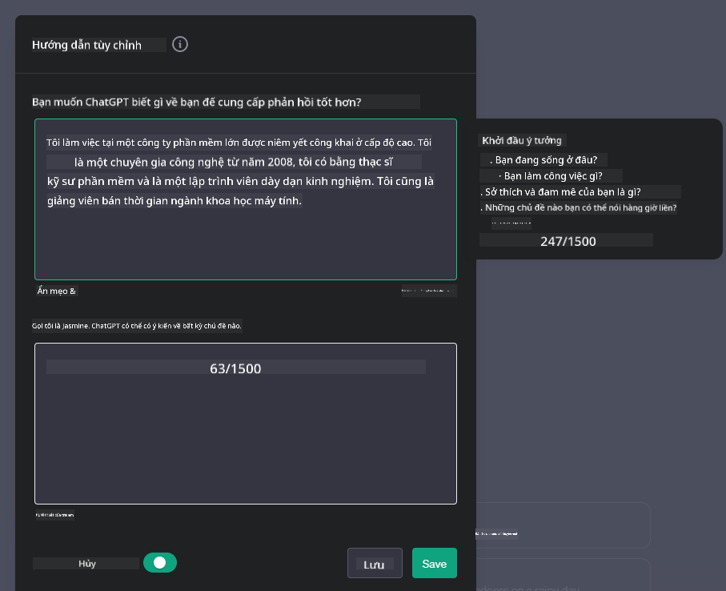

<!--
CO_OP_TRANSLATOR_METADATA:
{
  "original_hash": "ea4bbe640847aafbbba14dae4625e9af",
  "translation_date": "2025-07-09T12:34:27+00:00",
  "source_file": "07-building-chat-applications/README.md",
  "language_code": "vi"
}
-->
# Xây dựng Ứng dụng Chat Dựa trên AI Tạo Sinh

[](https://aka.ms/gen-ai-lessons7-gh?WT.mc_id=academic-105485-koreyst)

> _(Nhấn vào hình ảnh trên để xem video bài học này)_

Bây giờ khi chúng ta đã biết cách xây dựng các ứng dụng tạo văn bản, hãy cùng tìm hiểu về các ứng dụng chat.

Ứng dụng chat đã trở thành một phần không thể thiếu trong cuộc sống hàng ngày, không chỉ đơn thuần là phương tiện trò chuyện thông thường. Chúng là thành phần quan trọng trong dịch vụ khách hàng, hỗ trợ kỹ thuật, thậm chí là các hệ thống tư vấn phức tạp. Có thể bạn đã từng nhận được sự trợ giúp từ một ứng dụng chat không lâu trước đây. Khi chúng ta tích hợp các công nghệ tiên tiến như AI tạo sinh vào các nền tảng này, độ phức tạp và thách thức cũng tăng lên.

Một số câu hỏi cần được giải đáp là:

- **Xây dựng ứng dụng**. Làm thế nào để xây dựng và tích hợp hiệu quả các ứng dụng AI này cho các trường hợp sử dụng cụ thể?
- **Giám sát**. Sau khi triển khai, làm thế nào để giám sát và đảm bảo ứng dụng hoạt động với chất lượng cao nhất, cả về chức năng lẫn việc tuân thủ [sáu nguyên tắc AI có trách nhiệm](https://www.microsoft.com/ai/responsible-ai?WT.mc_id=academic-105485-koreyst)?

Khi chúng ta tiến sâu vào kỷ nguyên tự động hóa và tương tác liền mạch giữa con người và máy móc, việc hiểu cách AI tạo sinh thay đổi phạm vi, chiều sâu và khả năng thích ứng của các ứng dụng chat trở nên thiết yếu. Bài học này sẽ khám phá các khía cạnh kiến trúc hỗ trợ các hệ thống phức tạp này, đi sâu vào các phương pháp tinh chỉnh cho các nhiệm vụ chuyên ngành, và đánh giá các chỉ số cũng như cân nhắc liên quan đến việc triển khai AI có trách nhiệm.

## Giới thiệu

Bài học này bao gồm:

- Kỹ thuật xây dựng và tích hợp ứng dụng chat hiệu quả.
- Cách áp dụng tùy chỉnh và tinh chỉnh cho ứng dụng.
- Chiến lược và cân nhắc để giám sát ứng dụng chat hiệu quả.

## Mục tiêu học tập

Kết thúc bài học, bạn sẽ có thể:

- Mô tả các cân nhắc khi xây dựng và tích hợp ứng dụng chat vào hệ thống hiện có.
- Tùy chỉnh ứng dụng chat cho các trường hợp sử dụng cụ thể.
- Xác định các chỉ số và cân nhắc quan trọng để giám sát và duy trì chất lượng ứng dụng chat AI.
- Đảm bảo ứng dụng chat sử dụng AI một cách có trách nhiệm.

## Tích hợp AI Tạo Sinh vào Ứng dụng Chat

Nâng cao ứng dụng chat bằng AI tạo sinh không chỉ là làm cho chúng thông minh hơn; mà còn là tối ưu hóa kiến trúc, hiệu suất và giao diện người dùng để mang lại trải nghiệm chất lượng. Điều này bao gồm việc nghiên cứu nền tảng kiến trúc, tích hợp API và các cân nhắc về giao diện người dùng. Phần này nhằm cung cấp cho bạn một lộ trình toàn diện để điều hướng những lĩnh vực phức tạp này, dù bạn đang tích hợp vào hệ thống hiện có hay xây dựng nền tảng độc lập.

Kết thúc phần này, bạn sẽ có kiến thức cần thiết để xây dựng và tích hợp ứng dụng chat một cách hiệu quả.

### Chatbot hay Ứng dụng Chat?

Trước khi bắt đầu xây dựng ứng dụng chat, hãy so sánh 'chatbot' và 'ứng dụng chat AI', vì chúng phục vụ các vai trò và chức năng khác nhau. Mục đích chính của chatbot là tự động hóa các tác vụ trò chuyện cụ thể, như trả lời các câu hỏi thường gặp hoặc theo dõi đơn hàng. Nó thường được điều khiển bởi logic dựa trên quy tắc hoặc các thuật toán AI phức tạp. Ngược lại, ứng dụng chat AI là một môi trường rộng lớn hơn nhiều, được thiết kế để hỗ trợ nhiều hình thức giao tiếp kỹ thuật số như chat văn bản, thoại và video giữa người dùng. Điểm đặc trưng là tích hợp mô hình AI tạo sinh mô phỏng các cuộc trò chuyện tinh tế, giống con người, tạo ra phản hồi dựa trên nhiều loại đầu vào và ngữ cảnh khác nhau. Ứng dụng chat AI tạo sinh có thể tham gia vào các cuộc thảo luận mở, thích ứng với bối cảnh trò chuyện thay đổi, thậm chí tạo ra các đoạn hội thoại sáng tạo hoặc phức tạp.

Bảng dưới đây tóm tắt sự khác biệt và điểm tương đồng chính để giúp chúng ta hiểu vai trò riêng biệt của chúng trong giao tiếp kỹ thuật số.

| Chatbot                               | Ứng dụng Chat Dựa trên AI Tạo Sinh       |
| ------------------------------------- | ---------------------------------------- |
| Tập trung vào nhiệm vụ và dựa trên quy tắc | Nhận biết ngữ cảnh                        |
| Thường tích hợp vào hệ thống lớn hơn  | Có thể chứa một hoặc nhiều chatbot       |
| Giới hạn trong các chức năng được lập trình | Tích hợp mô hình AI tạo sinh              |
| Tương tác chuyên biệt và có cấu trúc  | Có khả năng thảo luận mở rộng              |

### Tận dụng chức năng có sẵn với SDK và API

Khi xây dựng ứng dụng chat, bước đầu tiên tốt là đánh giá những gì đã có sẵn. Sử dụng SDK và API để xây dựng ứng dụng chat là một chiến lược có lợi vì nhiều lý do. Bằng cách tích hợp các SDK và API được tài liệu hóa tốt, bạn đang định vị ứng dụng của mình cho thành công lâu dài, giải quyết các vấn đề về khả năng mở rộng và bảo trì.

- **Rút ngắn quá trình phát triển và giảm tải công việc**: Dựa vào các chức năng có sẵn thay vì tự xây dựng tốn kém giúp bạn tập trung vào các khía cạnh khác của ứng dụng mà bạn cho là quan trọng hơn, như logic nghiệp vụ.
- **Hiệu suất tốt hơn**: Khi xây dựng chức năng từ đầu, bạn sẽ tự hỏi "Nó có mở rộng được không? Ứng dụng này có thể xử lý lượng người dùng tăng đột biến không?" Các SDK và API được duy trì tốt thường có giải pháp tích hợp cho những vấn đề này.
- **Dễ bảo trì hơn**: Việc cập nhật và cải tiến dễ dàng hơn vì hầu hết API và SDK chỉ cần cập nhật thư viện khi có phiên bản mới.
- **Tiếp cận công nghệ tiên tiến**: Tận dụng các mô hình đã được tinh chỉnh và huấn luyện trên bộ dữ liệu lớn giúp ứng dụng của bạn có khả năng xử lý ngôn ngữ tự nhiên tốt.

Việc truy cập chức năng của SDK hoặc API thường yêu cầu có quyền sử dụng dịch vụ, thường thông qua khóa riêng hoặc token xác thực. Chúng ta sẽ sử dụng Thư viện Python OpenAI để khám phá cách thức hoạt động. Bạn cũng có thể thử tự mình trong [notebook cho OpenAI](../../../07-building-chat-applications/python/oai-assignment.ipynb) hoặc [notebook cho Azure OpenAI Services](../../../07-building-chat-applications/python/aoai-assignment.ipynb) cho bài học này.

```python
import os
from openai import OpenAI

API_KEY = os.getenv("OPENAI_API_KEY","")

client = OpenAI(
    api_key=API_KEY
    )

chat_completion = client.chat.completions.create(model="gpt-3.5-turbo", messages=[{"role": "user", "content": "Suggest two titles for an instructional lesson on chat applications for generative AI."}])
```

Ví dụ trên sử dụng mô hình GPT-3.5 Turbo để hoàn thành câu lệnh, nhưng lưu ý rằng khóa API phải được thiết lập trước khi thực hiện. Nếu không, bạn sẽ nhận được lỗi.

## Trải nghiệm Người dùng (UX)

Nguyên tắc UX chung áp dụng cho ứng dụng chat, nhưng có một số cân nhắc bổ sung trở nên đặc biệt quan trọng do các thành phần học máy liên quan.

- **Cơ chế xử lý sự mơ hồ**: Mô hình AI tạo sinh đôi khi tạo ra câu trả lời không rõ ràng. Tính năng cho phép người dùng yêu cầu làm rõ có thể hữu ích khi gặp phải vấn đề này.
- **Giữ ngữ cảnh**: Các mô hình AI tạo sinh tiên tiến có khả năng ghi nhớ ngữ cảnh trong cuộc trò chuyện, điều này rất cần thiết cho trải nghiệm người dùng. Việc cho phép người dùng kiểm soát và quản lý ngữ cảnh cải thiện trải nghiệm, nhưng cũng mang theo rủi ro lưu giữ thông tin nhạy cảm. Cân nhắc về thời gian lưu trữ thông tin, như áp dụng chính sách lưu giữ, có thể cân bằng giữa nhu cầu ngữ cảnh và quyền riêng tư.
- **Cá nhân hóa**: Với khả năng học hỏi và thích nghi, mô hình AI mang lại trải nghiệm cá nhân hóa cho người dùng. Tùy chỉnh trải nghiệm qua các tính năng như hồ sơ người dùng không chỉ giúp người dùng cảm thấy được thấu hiểu mà còn hỗ trợ họ tìm kiếm câu trả lời cụ thể, tạo ra tương tác hiệu quả và hài lòng hơn.

Một ví dụ về cá nhân hóa là cài đặt "Custom instructions" trong ChatGPT của OpenAI. Nó cho phép bạn cung cấp thông tin về bản thân có thể là ngữ cảnh quan trọng cho các câu lệnh của bạn. Dưới đây là ví dụ về một hướng dẫn tùy chỉnh.



"Thông tin hồ sơ" này yêu cầu ChatGPT tạo một kế hoạch bài học về danh sách liên kết. Lưu ý rằng ChatGPT đã xem xét người dùng có thể muốn một kế hoạch bài học sâu hơn dựa trên kinh nghiệm của cô ấy.


### Khung Thông điệp Hệ thống của Microsoft cho Mô hình Ngôn ngữ Lớn

[Microsoft đã cung cấp hướng dẫn](https://learn.microsoft.com/azure/ai-services/openai/concepts/system-message#define-the-models-output-format?WT.mc_id=academic-105485-koreyst) để viết thông điệp hệ thống hiệu quả khi tạo phản hồi từ LLM, chia thành 4 phần:

1. Xác định đối tượng mô hình, cũng như khả năng và giới hạn của nó.
2. Xác định định dạng đầu ra của mô hình.
3. Cung cấp ví dụ cụ thể minh họa hành vi mong muốn của mô hình.
4. Cung cấp các rào cản hành vi bổ sung.

### Khả năng tiếp cận

Dù người dùng gặp khiếm khuyết về thị giác, thính giác, vận động hay nhận thức, một ứng dụng chat được thiết kế tốt nên có thể sử dụng được cho tất cả. Danh sách dưới đây liệt kê các tính năng cụ thể nhằm nâng cao khả năng tiếp cận cho các dạng khiếm khuyết khác nhau.

- **Tính năng cho người khiếm thị**: Chủ đề tương phản cao và văn bản có thể thay đổi kích thước, tương thích với trình đọc màn hình.
- **Tính năng cho người khiếm thính**: Chức năng chuyển văn bản thành giọng nói và ngược lại, tín hiệu hình ảnh cho thông báo âm thanh.
- **Tính năng cho người khuyết tật vận động**: Hỗ trợ điều hướng bằng bàn phím, lệnh thoại.
- **Tính năng cho người khuyết tật nhận thức**: Tùy chọn ngôn ngữ đơn giản hóa.

## Tùy chỉnh và Tinh chỉnh cho Mô hình Ngôn ngữ Chuyên ngành

Hãy tưởng tượng một ứng dụng chat hiểu được thuật ngữ công ty bạn và dự đoán các câu hỏi phổ biến của người dùng. Có một vài cách tiếp cận đáng chú ý:

- **Tận dụng mô hình DSL**. DSL là viết tắt của domain specific language (ngôn ngữ chuyên ngành). Bạn có thể sử dụng mô hình DSL được huấn luyện trên một lĩnh vực cụ thể để hiểu các khái niệm và tình huống của nó.
- **Áp dụng tinh chỉnh**. Tinh chỉnh là quá trình tiếp tục huấn luyện mô hình với dữ liệu cụ thể.

## Tùy chỉnh: Sử dụng DSL

Tận dụng mô hình ngôn ngữ chuyên ngành (DSL Models) có thể nâng cao sự tương tác của người dùng bằng cách cung cấp các tương tác chuyên biệt, phù hợp với ngữ cảnh. Đây là mô hình được huấn luyện hoặc tinh chỉnh để hiểu và tạo văn bản liên quan đến một lĩnh vực, ngành nghề hoặc chủ đề cụ thể. Các lựa chọn sử dụng mô hình DSL có thể từ việc huấn luyện mới hoàn toàn, đến sử dụng các mô hình có sẵn thông qua SDK và API. Một lựa chọn khác là tinh chỉnh, tức là lấy một mô hình đã được huấn luyện trước và điều chỉnh cho một lĩnh vực cụ thể.

## Tùy chỉnh: Áp dụng tinh chỉnh

Tinh chỉnh thường được xem xét khi mô hình đã được huấn luyện trước không đáp ứng tốt trong một lĩnh vực chuyên biệt hoặc nhiệm vụ cụ thể.

Ví dụ, các câu hỏi y tế rất phức tạp và đòi hỏi nhiều ngữ cảnh. Khi một chuyên gia y tế chẩn đoán bệnh nhân, họ dựa trên nhiều yếu tố như lối sống hoặc các bệnh nền, thậm chí có thể tham khảo các tạp chí y khoa mới nhất để xác nhận chẩn đoán. Trong những trường hợp tinh vi như vậy, một ứng dụng chat AI đa năng không thể là nguồn tin đáng tin cậy.

### Tình huống: ứng dụng y tế

Hãy xem xét một ứng dụng chat được thiết kế để hỗ trợ các chuyên gia y tế bằng cách cung cấp nhanh các hướng dẫn điều trị, tương tác thuốc hoặc các nghiên cứu mới nhất.

Một mô hình đa năng có thể đủ để trả lời các câu hỏi y tế cơ bản hoặc cung cấp lời khuyên chung, nhưng có thể gặp khó khăn với:

- **Các trường hợp rất cụ thể hoặc phức tạp**. Ví dụ, một bác sĩ thần kinh có thể hỏi ứng dụng: "Các phương pháp tốt nhất hiện nay để quản lý động kinh kháng thuốc ở trẻ em là gì?"
- **Thiếu cập nhật mới nhất**. Mô hình đa năng có thể không cung cấp câu trả lời cập nhật nhất bao gồm các tiến bộ mới trong thần kinh học và dược lý.

Trong những trường hợp như vậy, việc tinh chỉnh mô hình với bộ dữ liệu y tế chuyên biệt có thể cải thiện đáng kể khả năng xử lý các câu hỏi y tế phức tạp một cách chính xác và đáng tin cậy hơn. Điều này đòi hỏi có quyền truy cập vào bộ dữ liệu lớn và phù hợp, đại diện cho các thách thức và câu hỏi đặc thù của lĩnh vực.

## Cân nhắc cho Trải nghiệm Chat AI Chất lượng Cao

Phần này trình bày các tiêu chí cho ứng dụng chat "chất lượng cao", bao gồm việc thu thập các chỉ số có thể hành động và tuân thủ khung làm việc sử dụng AI một cách có trách nhiệm.

### Các chỉ số chính

Để duy trì hiệu suất chất lượng cao của ứng dụng, cần theo dõi các chỉ số và cân nhắc quan trọng. Những đo lường này không chỉ đảm bảo chức năng của ứng dụng mà còn đánh giá chất lượng mô hình AI và trải nghiệm người dùng. Dưới đây là danh sách các chỉ số cơ bản, AI và trải nghiệm người dùng cần xem xét.

| Chỉ số                        | Định nghĩa                                                                                                             | Cân nhắc dành cho Nhà phát triển Chat                           |
| ----------------------------- | ---------------------------------------------------------------------------------------------------------------------- | ---------------------------------------------------------------- |
| **Thời gian hoạt động (Uptime)** | Đo thời gian ứng dụng hoạt động và người dùng có thể truy cập.                                                        | Làm thế nào để giảm thiểu thời gian ngừng hoạt động?             |
| **Thời gian phản hồi**         | Thời gian ứng dụng trả lời câu hỏi của người dùng.                                                                     | Làm thế nào tối ưu xử lý truy vấn để cải thiện thời gian phản hồi?|
| **Độ chính xác (Precision)**   | Tỷ lệ dự đoán đúng trên tổng số dự đoán dương tính.                                                                    | Làm thế nào để xác thực độ chính xác của mô hình?                 |
| **Độ nhạy (Recall)**           | Tỷ lệ dự đoán đúng trên tổng số trường hợp dương tính thực tế.                                                         | Làm thế nào đo lường và cải thiện độ nhạy?                        |
| **Điểm F1 (F1 Score)**         | Trung bình điều hòa của độ chính xác và độ nhạy, cân bằng giữa hai yếu tố.                                              | Mục tiêu điểm F1 của bạn là gì? Làm thế nào cân bằng độ chính xác và độ nhạy? |
| **Độ rối (Perplexity)**        | Đo mức độ phù hợp giữa phân phối xác suất do mô hình dự đoán và phân phối thực tế của dữ liệu.                          | Làm thế nào để giảm thiểu độ rối?                                 |
| **Chỉ số hài lòng người dùng** | Đo nhận thức của người dùng về ứng dụng, thường thu thập qua khảo sát.                                                 | Bao lâu bạn sẽ thu thập phản hồi người dùng? Làm thế nào điều chỉnh dựa trên đó? |
| **Tỷ lệ lỗi**                  | Tỷ lệ mô hình mắc lỗi trong việc hiểu hoặc tạo ra kết quả.                                                              | Bạn có chiến lược gì để giảm tỷ lệ lỗi?                           |
| **Chu kỳ huấn luyện lại**      | Tần suất mô hình được cập nhật để tích hợp dữ liệu và kiến thức mới.                                                    | Bao lâu bạn sẽ huấn luyện lại mô hình? Điều gì kích hoạt chu kỳ huấn luyện lại? |
| **Phát hiện bất thường**         | Công cụ và kỹ thuật để nhận diện các mẫu bất thường không tuân theo hành vi dự kiến.                        | Bạn sẽ phản ứng thế nào với các bất thường?                                        |

### Triển khai các thực hành AI có trách nhiệm trong ứng dụng chat

Cách tiếp cận của Microsoft về AI có trách nhiệm đã xác định sáu nguyên tắc nên hướng dẫn việc phát triển và sử dụng AI. Dưới đây là các nguyên tắc, định nghĩa của chúng, cùng những điều nhà phát triển chat nên cân nhắc và lý do tại sao cần nghiêm túc thực hiện.

| Nguyên tắc             | Định nghĩa của Microsoft                                | Những điều nhà phát triển chat cần cân nhắc                                      | Tại sao điều này quan trọng                                                                     |
| ---------------------- | ------------------------------------------------------- | ------------------------------------------------------------------------------ | ---------------------------------------------------------------------------------------------- |
| Công bằng              | Hệ thống AI nên đối xử công bằng với tất cả mọi người.  | Đảm bảo ứng dụng chat không phân biệt đối xử dựa trên dữ liệu người dùng.       | Xây dựng niềm tin và sự bao gồm giữa người dùng; tránh các hệ quả pháp lý.                      |
| Độ tin cậy và An toàn  | Hệ thống AI nên hoạt động ổn định và an toàn.           | Thực hiện kiểm thử và các biện pháp dự phòng để giảm thiểu lỗi và rủi ro.      | Đảm bảo sự hài lòng của người dùng và ngăn ngừa các tác hại tiềm ẩn.                            |
| Quyền riêng tư và Bảo mật | Hệ thống AI nên bảo mật và tôn trọng quyền riêng tư.    | Áp dụng mã hóa mạnh và các biện pháp bảo vệ dữ liệu.                           | Bảo vệ dữ liệu nhạy cảm của người dùng và tuân thủ các luật về quyền riêng tư.                  |
| Tính bao gồm           | Hệ thống AI nên trao quyền và thu hút mọi người tham gia. | Thiết kế giao diện người dùng dễ tiếp cận và thân thiện với đa dạng đối tượng. | Đảm bảo nhiều người có thể sử dụng ứng dụng một cách hiệu quả.                                 |
| Tính minh bạch         | Hệ thống AI nên dễ hiểu.                                | Cung cấp tài liệu rõ ràng và giải thích lý do cho các phản hồi của AI.         | Người dùng sẽ tin tưởng hệ thống hơn nếu họ hiểu cách các quyết định được đưa ra.              |
| Trách nhiệm            | Con người cần chịu trách nhiệm về hệ thống AI.          | Thiết lập quy trình rõ ràng để kiểm tra và cải thiện các quyết định của AI.    | Cho phép cải tiến liên tục và có biện pháp khắc phục khi xảy ra sai sót.                        |

## Bài tập

Xem [assignment](../../../07-building-chat-applications/python) để làm theo một loạt bài tập từ chạy các câu lệnh chat đầu tiên, phân loại và tóm tắt văn bản, và nhiều hơn nữa. Lưu ý rằng các bài tập có sẵn bằng nhiều ngôn ngữ lập trình khác nhau!

## Làm tốt lắm! Tiếp tục hành trình

Sau khi hoàn thành bài học này, hãy khám phá [Bộ sưu tập học Generative AI](https://aka.ms/genai-collection?WT.mc_id=academic-105485-koreyst) để tiếp tục nâng cao kiến thức về Generative AI!

Hãy đến Bài học 8 để xem cách bạn có thể bắt đầu [xây dựng ứng dụng tìm kiếm](../08-building-search-applications/README.md?WT.mc_id=academic-105485-koreyst)!

**Tuyên bố từ chối trách nhiệm**:  
Tài liệu này đã được dịch bằng dịch vụ dịch thuật AI [Co-op Translator](https://github.com/Azure/co-op-translator). Mặc dù chúng tôi cố gắng đảm bảo độ chính xác, xin lưu ý rằng các bản dịch tự động có thể chứa lỗi hoặc không chính xác. Tài liệu gốc bằng ngôn ngữ gốc của nó nên được coi là nguồn chính xác và đáng tin cậy. Đối với các thông tin quan trọng, nên sử dụng dịch vụ dịch thuật chuyên nghiệp do con người thực hiện. Chúng tôi không chịu trách nhiệm về bất kỳ sự hiểu lầm hoặc giải thích sai nào phát sinh từ việc sử dụng bản dịch này.