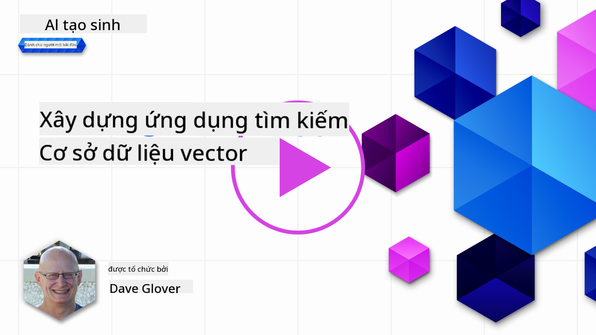
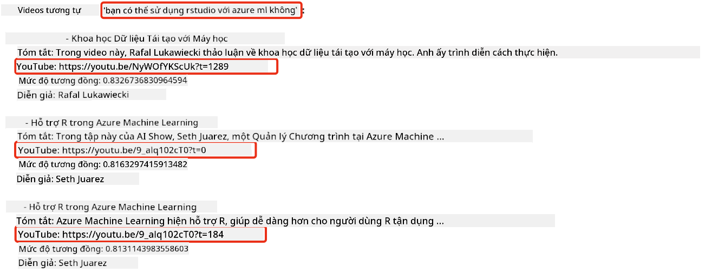

<!--
CO_OP_TRANSLATOR_METADATA:
{
  "original_hash": "d46aad0917a1a342d613e2c13d457da5",
  "translation_date": "2025-05-19T18:37:03+00:00",
  "source_file": "08-building-search-applications/README.md",
  "language_code": "vi"
}
-->
# Xây dựng ứng dụng tìm kiếm

[](https://aka.ms/gen-ai-lesson8-gh?WT.mc_id=academic-105485-koreyst)

> > _Nhấn vào hình ảnh trên để xem video của bài học này_

Có nhiều điều thú vị hơn về LLM ngoài chatbot và tạo văn bản. Bạn cũng có thể xây dựng ứng dụng tìm kiếm bằng cách sử dụng Embeddings. Embeddings là các biểu diễn số của dữ liệu, còn được gọi là vector, và có thể được sử dụng cho tìm kiếm ngữ nghĩa cho dữ liệu.

Trong bài học này, bạn sẽ xây dựng một ứng dụng tìm kiếm cho startup giáo dục của chúng tôi. Startup của chúng tôi là một tổ chức phi lợi nhuận cung cấp giáo dục miễn phí cho học sinh ở các nước đang phát triển. Startup của chúng tôi có một số lượng lớn video YouTube mà học sinh có thể sử dụng để học về AI. Startup của chúng tôi muốn xây dựng một ứng dụng tìm kiếm cho phép học sinh tìm kiếm một video YouTube bằng cách nhập câu hỏi.

Ví dụ, một học sinh có thể nhập 'Jupyter Notebooks là gì?' hoặc 'Azure ML là gì?' và ứng dụng tìm kiếm sẽ trả về danh sách các video YouTube có liên quan đến câu hỏi, và tốt hơn nữa, ứng dụng tìm kiếm sẽ trả về một liên kết đến nơi trong video nơi câu trả lời cho câu hỏi nằm.

## Giới thiệu

Trong bài học này, chúng ta sẽ bao gồm:

- Tìm kiếm ngữ nghĩa so với tìm kiếm từ khóa.
- Text Embeddings là gì.
- Tạo một chỉ mục Text Embeddings.
- Tìm kiếm trong chỉ mục Text Embeddings.

## Mục tiêu học tập

Sau khi hoàn thành bài học này, bạn sẽ có thể:

- Phân biệt giữa tìm kiếm ngữ nghĩa và tìm kiếm từ khóa.
- Giải thích Text Embeddings là gì.
- Tạo một ứng dụng sử dụng Embeddings để tìm kiếm dữ liệu.

## Tại sao xây dựng một ứng dụng tìm kiếm?

Tạo một ứng dụng tìm kiếm sẽ giúp bạn hiểu cách sử dụng Embeddings để tìm kiếm dữ liệu. Bạn cũng sẽ học cách xây dựng một ứng dụng tìm kiếm mà học sinh có thể sử dụng để tìm thông tin một cách nhanh chóng.

Bài học bao gồm một chỉ mục Embedding của các bản ghi YouTube cho kênh YouTube Microsoft [AI Show](https://www.youtube.com/playlist?list=PLlrxD0HtieHi0mwteKBOfEeOYf0LJU4O1). AI Show là một kênh YouTube dạy bạn về AI và học máy. Chỉ mục Embedding chứa các Embeddings cho mỗi bản ghi YouTube cho đến tháng 10 năm 2023. Bạn sẽ sử dụng chỉ mục Embedding để xây dựng một ứng dụng tìm kiếm cho startup của chúng tôi. Ứng dụng tìm kiếm trả về một liên kết đến nơi trong video nơi câu trả lời cho câu hỏi nằm. Đây là cách tuyệt vời để học sinh tìm thấy thông tin họ cần một cách nhanh chóng.

Dưới đây là một ví dụ về truy vấn ngữ nghĩa cho câu hỏi 'bạn có thể sử dụng rstudio với azure ml không?'. Hãy xem url YouTube, bạn sẽ thấy url chứa một dấu thời gian đưa bạn đến nơi trong video nơi câu trả lời cho câu hỏi nằm.



## Tìm kiếm ngữ nghĩa là gì?

Bây giờ bạn có thể thắc mắc, tìm kiếm ngữ nghĩa là gì? Tìm kiếm ngữ nghĩa là một kỹ thuật tìm kiếm sử dụng ngữ nghĩa, hoặc ý nghĩa, của các từ trong truy vấn để trả về các kết quả liên quan.

Đây là một ví dụ về tìm kiếm ngữ nghĩa. Giả sử bạn đang tìm mua một chiếc ô tô, bạn có thể tìm kiếm 'chiếc ô tô mơ ước của tôi', tìm kiếm ngữ nghĩa hiểu rằng bạn không `dreaming` về một chiếc ô tô, mà thay vào đó bạn đang tìm mua chiếc ô tô `ideal` của mình. Tìm kiếm ngữ nghĩa hiểu ý định của bạn và trả về các kết quả liên quan. Lựa chọn thay thế là `keyword search` sẽ tìm kiếm một cách trực tiếp về giấc mơ về ô tô và thường trả về các kết quả không liên quan.

## Text Embeddings là gì?

[Text embeddings](https://en.wikipedia.org/wiki/Word_embedding?WT.mc_id=academic-105485-koreyst) là một kỹ thuật biểu diễn văn bản được sử dụng trong [xử lý ngôn ngữ tự nhiên](https://en.wikipedia.org/wiki/Natural_language_processing?WT.mc_id=academic-105485-koreyst). Text embeddings là các biểu diễn số ngữ nghĩa của văn bản. Embeddings được sử dụng để biểu diễn dữ liệu theo cách dễ hiểu cho máy. Có nhiều mô hình để xây dựng text embeddings, trong bài học này, chúng ta sẽ tập trung vào việc tạo embeddings bằng cách sử dụng Mô hình Embedding của OpenAI.

Đây là một ví dụ, hãy tưởng tượng văn bản sau nằm trong một bản ghi từ một trong các tập trên kênh YouTube AI Show:

```text
Today we are going to learn about Azure Machine Learning.
```

Chúng tôi sẽ chuyển văn bản này đến API Embedding của OpenAI và nó sẽ trả về embedding sau đây gồm 1536 số, còn gọi là một vector. Mỗi số trong vector đại diện cho một khía cạnh khác nhau của văn bản. Để ngắn gọn, đây là 10 số đầu tiên trong vector.

```python
[-0.006655829958617687, 0.0026128944009542465, 0.008792596869170666, -0.02446001023054123, -0.008540431968867779, 0.022071078419685364, -0.010703742504119873, 0.003311325330287218, -0.011632772162556648, -0.02187200076878071, ...]
```

## Chỉ mục Embedding được tạo như thế nào?

Chỉ mục Embedding cho bài học này được tạo bằng một loạt các script Python. Bạn sẽ tìm thấy các script cùng với hướng dẫn trong [README](./scripts/README.md?WT.mc_id=academic-105485-koreyst) trong thư mục 'scripts' cho bài học này. Bạn không cần chạy các script này để hoàn thành bài học vì chỉ mục Embedding đã được cung cấp cho bạn.

Các script thực hiện các thao tác sau:

1. Bản ghi cho mỗi video YouTube trong danh sách phát [AI Show](https://www.youtube.com/playlist?list=PLlrxD0HtieHi0mwteKBOfEeOYf0LJU4O1) được tải xuống.
2. Sử dụng [Chức năng của OpenAI](https://learn.microsoft.com/azure/ai-services/openai/how-to/function-calling?WT.mc_id=academic-105485-koreyst), một nỗ lực được thực hiện để trích xuất tên người nói từ 3 phút đầu tiên của bản ghi YouTube. Tên người nói cho mỗi video được lưu trữ trong chỉ mục Embedding có tên `embedding_index_3m.json`.
3. Văn bản bản ghi sau đó được chia thành **các đoạn văn bản 3 phút**. Đoạn văn bản bao gồm khoảng 20 từ chồng chéo từ đoạn tiếp theo để đảm bảo rằng Embedding cho đoạn không bị cắt và cung cấp ngữ cảnh tìm kiếm tốt hơn.
4. Mỗi đoạn văn bản sau đó được chuyển đến API Chat của OpenAI để tóm tắt văn bản thành 60 từ. Bản tóm tắt cũng được lưu trữ trong chỉ mục Embedding `embedding_index_3m.json`.
5. Cuối cùng, văn bản đoạn được chuyển đến API Embedding của OpenAI. API Embedding trả về một vector gồm 1536 số đại diện cho ý nghĩa ngữ nghĩa của đoạn. Đoạn cùng với vector Embedding của OpenAI được lưu trữ trong chỉ mục Embedding `embedding_index_3m.json`.

### Cơ sở dữ liệu vector

Để đơn giản hóa bài học, chỉ mục Embedding được lưu trữ trong một tệp JSON có tên `embedding_index_3m.json` và được tải vào một DataFrame của Pandas. Tuy nhiên, trong sản xuất, chỉ mục Embedding sẽ được lưu trữ trong một cơ sở dữ liệu vector như [Azure Cognitive Search](https://learn.microsoft.com/training/modules/improve-search-results-vector-search?WT.mc_id=academic-105485-koreyst), [Redis](https://cookbook.openai.com/examples/vector_databases/redis/readme?WT.mc_id=academic-105485-koreyst), [Pinecone](https://cookbook.openai.com/examples/vector_databases/pinecone/readme?WT.mc_id=academic-105485-koreyst), [Weaviate](https://cookbook.openai.com/examples/vector_databases/weaviate/readme?WT.mc_id=academic-105485-koreyst), để kể một vài.

## Hiểu về độ tương đồng cosine

Chúng ta đã học về text embeddings, bước tiếp theo là học cách sử dụng text embeddings để tìm kiếm dữ liệu và đặc biệt là tìm các embeddings giống nhất với một truy vấn cho trước bằng cách sử dụng độ tương đồng cosine.

### Độ tương đồng cosine là gì?

Độ tương đồng cosine là một thước đo độ tương đồng giữa hai vector, bạn cũng sẽ nghe điều này được gọi là `nearest neighbor search`. Để thực hiện tìm kiếm độ tương đồng cosine, bạn cần _vector hóa_ văn bản _truy vấn_ bằng cách sử dụng API Embedding của OpenAI. Sau đó tính toán _độ tương đồng cosine_ giữa vector truy vấn và mỗi vector trong chỉ mục Embedding. Nhớ rằng, chỉ mục Embedding có một vector cho mỗi đoạn văn bản bản ghi YouTube. Cuối cùng, sắp xếp kết quả theo độ tương đồng cosine và các đoạn văn bản có độ tương đồng cosine cao nhất là giống nhất với truy vấn.

Từ góc độ toán học, độ tương đồng cosine đo lường cosine của góc giữa hai vector được chiếu trong không gian đa chiều. Đo lường này có lợi, vì nếu hai tài liệu cách xa nhau theo khoảng cách Euclidean do kích thước, chúng vẫn có thể có một góc nhỏ hơn giữa chúng và do đó có độ tương đồng cosine cao hơn. Để biết thêm thông tin về các phương trình độ tương đồng cosine, xem [Độ tương đồng cosine](https://en.wikipedia.org/wiki/Cosine_similarity?WT.mc_id=academic-105485-koreyst).

## Xây dựng ứng dụng tìm kiếm đầu tiên của bạn

Tiếp theo, chúng ta sẽ học cách xây dựng một ứng dụng tìm kiếm bằng cách sử dụng Embeddings. Ứng dụng tìm kiếm sẽ cho phép học sinh tìm kiếm một video bằng cách nhập một câu hỏi. Ứng dụng tìm kiếm sẽ trả về danh sách các video có liên quan đến câu hỏi. Ứng dụng tìm kiếm cũng sẽ trả về một liên kết đến nơi trong video nơi câu trả lời cho câu hỏi nằm.

Giải pháp này được xây dựng và thử nghiệm trên Windows 11, macOS, và Ubuntu 22.04 sử dụng Python 3.10 hoặc mới hơn. Bạn có thể tải xuống Python từ [python.org](https://www.python.org/downloads/?WT.mc_id=academic-105485-koreyst).

## Bài tập - xây dựng ứng dụng tìm kiếm, để hỗ trợ học sinh

Chúng tôi đã giới thiệu startup của chúng tôi ở đầu bài học này. Bây giờ là lúc để hỗ trợ học sinh xây dựng một ứng dụng tìm kiếm cho các bài đánh giá của họ.

Trong bài tập này, bạn sẽ tạo các Dịch vụ OpenAI của Azure sẽ được sử dụng để xây dựng ứng dụng tìm kiếm. Bạn sẽ tạo các Dịch vụ OpenAI của Azure sau đây. Bạn sẽ cần một đăng ký Azure để hoàn thành bài tập này.

### Khởi động Azure Cloud Shell

1. Đăng nhập vào [Azure portal](https://portal.azure.com/?WT.mc_id=academic-105485-koreyst).
2. Chọn biểu tượng Cloud Shell ở góc trên bên phải của Azure portal.
3. Chọn **Bash** cho loại môi trường.

#### Tạo một nhóm tài nguyên

> Đối với các hướng dẫn này, chúng tôi sử dụng nhóm tài nguyên có tên "semantic-video-search" ở Đông Mỹ.
> Bạn có thể thay đổi tên của nhóm tài nguyên, nhưng khi thay đổi vị trí cho các tài nguyên,
> hãy kiểm tra [bảng khả dụng mô hình](https://aka.ms/oai/models?WT.mc_id=academic-105485-koreyst).

```shell
az group create --name semantic-video-search --location eastus
```

#### Tạo một tài nguyên Dịch vụ OpenAI của Azure

Từ Azure Cloud Shell, chạy lệnh sau để tạo một tài nguyên Dịch vụ OpenAI của Azure.

```shell
az cognitiveservices account create --name semantic-video-openai --resource-group semantic-video-search \
    --location eastus --kind OpenAI --sku s0
```

#### Lấy điểm cuối và khóa để sử dụng trong ứng dụng này

Từ Azure Cloud Shell, chạy các lệnh sau để lấy điểm cuối và khóa cho tài nguyên Dịch vụ OpenAI của Azure.

```shell
az cognitiveservices account show --name semantic-video-openai \
   --resource-group  semantic-video-search | jq -r .properties.endpoint
az cognitiveservices account keys list --name semantic-video-openai \
   --resource-group semantic-video-search | jq -r .key1
```

#### Triển khai mô hình Embedding của OpenAI

Từ Azure Cloud Shell, chạy lệnh sau để triển khai mô hình Embedding của OpenAI.

```shell
az cognitiveservices account deployment create \
    --name semantic-video-openai \
    --resource-group  semantic-video-search \
    --deployment-name text-embedding-ada-002 \
    --model-name text-embedding-ada-002 \
    --model-version "2"  \
    --model-format OpenAI \
    --sku-capacity 100 --sku-name "Standard"
```

## Giải pháp

Mở [notebook giải pháp](../../../08-building-search-applications/python/aoai-solution.ipynb) trong GitHub Codespaces và làm theo hướng dẫn trong Jupyter Notebook.

Khi bạn chạy notebook, bạn sẽ được yêu cầu nhập một truy vấn. Hộp nhập sẽ trông như thế này:


## Làm tốt lắm! Tiếp tục học tập của bạn

Sau khi hoàn thành bài học này, hãy xem bộ sưu tập học tập AI tạo sinh của chúng tôi [Generative AI Learning collection](https://aka.ms/genai-collection?WT.mc_id=academic-105485-koreyst) để tiếp tục nâng cao kiến thức AI tạo sinh của bạn!

Hãy chuyển sang Bài học 9 nơi chúng ta sẽ xem xét cách [xây dựng ứng dụng tạo hình ảnh](../09-building-image-applications/README.md?WT.mc_id=academic-105485-koreyst)!

**Tuyên bố miễn trừ trách nhiệm**:  
Tài liệu này đã được dịch bằng dịch vụ dịch thuật AI [Co-op Translator](https://github.com/Azure/co-op-translator). Mặc dù chúng tôi cố gắng đảm bảo độ chính xác, xin lưu ý rằng các bản dịch tự động có thể chứa lỗi hoặc sự không chính xác. Tài liệu gốc bằng ngôn ngữ bản địa nên được coi là nguồn thông tin có thẩm quyền. Đối với thông tin quan trọng, nên sử dụng dịch vụ dịch thuật chuyên nghiệp từ con người. Chúng tôi không chịu trách nhiệm cho bất kỳ sự hiểu lầm hoặc giải thích sai nào phát sinh từ việc sử dụng bản dịch này.