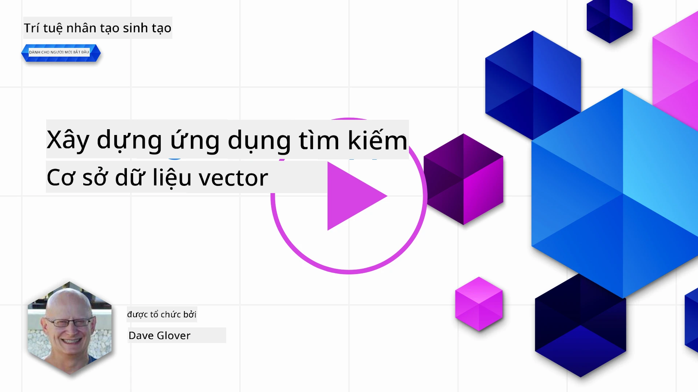
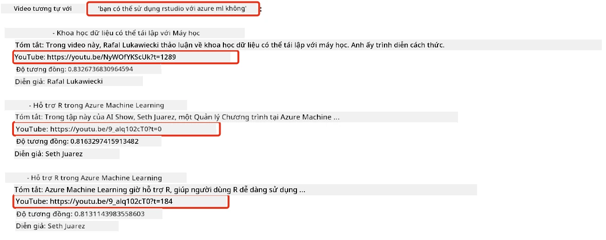
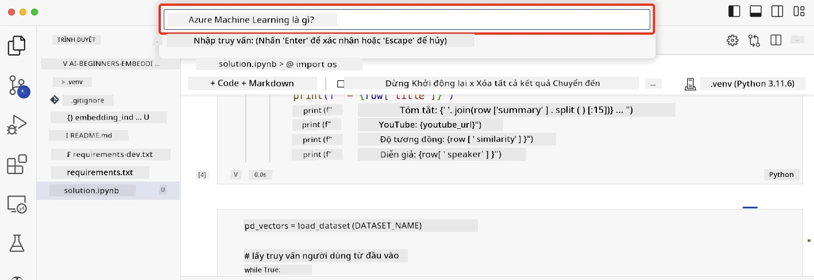

# Xây dựng Ứng dụng Tìm kiếm

[](https://youtu.be/W0-nzXjOjr0?si=GcsqiTTvd7RKbo7V)

> > _Nhấp vào hình ảnh ở trên để xem video của bài học này_

LLM không chỉ là các chatbot và tạo văn bản. Bạn cũng có thể xây dựng các ứng dụng tìm kiếm sử dụng Embeddings. Embeddings là các biểu diễn số của dữ liệu còn gọi là vector, và có thể được dùng để tìm kiếm ngữ nghĩa dữ liệu.

Trong bài học này, bạn sẽ xây dựng một ứng dụng tìm kiếm cho startup giáo dục của chúng ta. Startup của chúng ta là một tổ chức phi lợi nhuận cung cấp giáo dục miễn phí cho sinh viên ở các nước đang phát triển. Startup có nhiều video YouTube mà sinh viên có thể sử dụng để học về AI. Startup muốn xây dựng một ứng dụng tìm kiếm cho phép sinh viên tìm video YouTube bằng cách gõ câu hỏi.

Ví dụ, một sinh viên có thể gõ 'Jupyter Notebooks là gì?' hoặc 'Azure ML là gì' và ứng dụng tìm kiếm sẽ trả về danh sách các video YouTube liên quan đến câu hỏi, thậm chí còn tốt hơn, ứng dụng tìm kiếm sẽ trả về liên kết đến đúng vị trí trong video nơi câu trả lời cho câu hỏi được tìm thấy.

## Giới thiệu

Trong bài học này, chúng ta sẽ học:

- Tìm kiếm ngữ nghĩa so với tìm kiếm theo từ khóa.
- Embeddings văn bản là gì.
- Tạo chỉ mục Embeddings văn bản.
- Tìm kiếm trong chỉ mục Embeddings văn bản.

## Mục tiêu học tập

Sau khi hoàn thành bài học này, bạn sẽ có khả năng:

- Phân biệt tìm kiếm ngữ nghĩa và tìm kiếm theo từ khóa.
- Giải thích Embeddings văn bản là gì.
- Tạo một ứng dụng sử dụng Embeddings để tìm kiếm dữ liệu.

## Tại sao xây dựng ứng dụng tìm kiếm?

Tạo một ứng dụng tìm kiếm sẽ giúp bạn hiểu cách sử dụng Embeddings để tìm kiếm dữ liệu. Bạn cũng sẽ học cách xây dựng ứng dụng tìm kiếm mà sinh viên có thể dùng để tìm thông tin nhanh chóng.

Bài học bao gồm một Chỉ mục Embedding của các bản ghi phụ đề YouTube cho kênh Microsoft [AI Show](https://www.youtube.com/playlist?list=PLlrxD0HtieHi0mwteKBOfEeOYf0LJU4O1). AI Show là một kênh YouTube dạy bạn về AI và học máy. Chỉ mục Embedding chứa Embeddings cho mỗi bản ghi phụ đề YouTube đến tháng 10 năm 2023. Bạn sẽ dùng chỉ mục Embedding để xây dựng ứng dụng tìm kiếm cho startup. Ứng dụng tìm kiếm trả về liên kết đến vị trí trong video nơi câu trả lời cho câu hỏi được tìm thấy. Đây là cách tuyệt vời để sinh viên tìm thông tin họ cần nhanh hơn.

Dưới đây là ví dụ của một truy vấn ngữ nghĩa cho câu hỏi 'có thể dùng rstudio với azure ml không?'. Xem URL YouTube, bạn sẽ thấy URL chứa dấu thời gian dẫn đến vị trí trong video nơi câu trả lời cho câu hỏi được tìm thấy.



## Tìm kiếm ngữ nghĩa là gì?

Có thể bạn thắc mắc, tìm kiếm ngữ nghĩa là gì? Tìm kiếm ngữ nghĩa là kỹ thuật tìm kiếm sử dụng ngữ nghĩa, hay ý nghĩa của các từ trong truy vấn để trả về kết quả liên quan.

Đây là ví dụ về tìm kiếm ngữ nghĩa. Giả sử bạn muốn mua một chiếc xe, bạn có thể tìm 'chiếc xe trong mơ của tôi', tìm kiếm ngữ nghĩa hiểu rằng bạn không `mơ` về xe, mà bạn đang muốn mua chiếc xe `lý tưởng` của mình. Tìm kiếm ngữ nghĩa hiểu ý định của bạn và trả về kết quả phù hợp. Ngược lại là `tìm kiếm từ khóa` sẽ tìm đúng từ "mơ" và "xe" và thường trả về kết quả không liên quan.

## Embeddings văn bản là gì?

[Embeddings văn bản](https://en.wikipedia.org/wiki/Word_embedding?WT.mc_id=academic-105485-koreyst) là kỹ thuật biểu diễn văn bản được dùng trong [xử lý ngôn ngữ tự nhiên](https://en.wikipedia.org/wiki/Natural_language_processing?WT.mc_id=academic-105485-koreyst). Embeddings văn bản là biểu diễn số có ngữ nghĩa của văn bản. Embeddings được dùng để thể hiện dữ liệu theo cách máy dễ hiểu. Có nhiều mô hình tạo embeddings văn bản, trong bài học này, chúng ta sẽ tập trung vào tạo embeddings dùng Mô hình Embedding của OpenAI.

Đây là ví dụ, tưởng tượng đoạn văn bản dưới đây nằm trong một bản ghi phụ đề của một tập trên kênh AI Show YouTube:

```text
Today we are going to learn about Azure Machine Learning.
```

Chúng ta sẽ gửi văn bản này đến API Embedding của OpenAI và nó sẽ trả về embedding gồm 1536 số, còn gọi là vector. Mỗi số trong vector đại diện cho một khía cạnh khác nhau của văn bản. Để gọn, dưới đây là 10 số đầu trong vector.

```python
[-0.006655829958617687, 0.0026128944009542465, 0.008792596869170666, -0.02446001023054123, -0.008540431968867779, 0.022071078419685364, -0.010703742504119873, 0.003311325330287218, -0.011632772162556648, -0.02187200076878071, ...]
```

## Chỉ mục Embedding được tạo như thế nào?

Chỉ mục Embedding cho bài học này được tạo bằng một loạt script Python. Bạn sẽ tìm thấy các script cùng hướng dẫn trong [README](./scripts/README.md?WT.mc_id=academic-105485-koreyst) trong thư mục 'scripts' của bài học này. Bạn không cần chạy các script này để hoàn thành bài học vì chỉ mục Embedding đã được cung cấp sẵn.

Các script thực hiện các tác vụ sau:

1. Tải xuống bản ghi phụ đề cho mỗi video YouTube trong playlist [AI Show](https://www.youtube.com/playlist?list=PLlrxD0HtieHi0mwteKBOfEeOYf0LJU4O1).
2. Dùng [Chức năng OpenAI](https://learn.microsoft.com/azure/ai-foundry/openai/how-to/function-calling?WT.mc_id=academic-105485-koreyst) để cố gắng trích xuất tên người nói trong 3 phút đầu của bản ghi phụ đề YouTube. Tên người nói cho mỗi video được lưu trong Chỉ mục Embedding tên `embedding_index_3m.json`.
3. Văn bản bản ghi được chia thành **các đoạn văn bản 3 phút**. Mỗi đoạn bao gồm khoảng 20 từ chồng lên đoạn tiếp theo để đảm bảo embedding cho đoạn không bị cắt và cung cấp ngữ cảnh tìm kiếm tốt hơn.
4. Mỗi đoạn văn bản được gửi tới OpenAI Chat API để tóm tắt lại thành 60 từ. Bản tóm tắt cũng được lưu trong Chỉ mục Embedding `embedding_index_3m.json`.
5. Cuối cùng, đoạn văn bản được gửi tới OpenAI Embedding API. API Embedding trả về một vector gồm 1536 số biểu thị ý nghĩa ngữ nghĩa của đoạn. Đoạn cùng vector Embedding của OpenAI được lưu trong Chỉ mục Embedding `embedding_index_3m.json`.

### Cơ sở dữ liệu vector

Để đơn giản cho bài học, Chỉ mục Embedding được lưu trong file JSON tên `embedding_index_3m.json` và tải vào Pandas DataFrame. Tuy nhiên, trong môi trường sản xuất, Chỉ mục Embedding sẽ được lưu trong cơ sở dữ liệu vector như [Azure Cognitive Search](https://learn.microsoft.com/training/modules/improve-search-results-vector-search?WT.mc_id=academic-105485-koreyst), [Redis](https://cookbook.openai.com/examples/vector_databases/redis/readme?WT.mc_id=academic-105485-koreyst), [Pinecone](https://cookbook.openai.com/examples/vector_databases/pinecone/readme?WT.mc_id=academic-105485-koreyst), [Weaviate](https://cookbook.openai.com/examples/vector_databases/weaviate/readme?WT.mc_id=academic-105485-koreyst), chỉ kể vài ví dụ.

## Hiểu về độ tương đồng cosine

Chúng ta đã học về embeddings văn bản, bước tiếp theo là học cách dùng embeddings văn bản để tìm kiếm dữ liệu, đặc biệt tìm các embeddings giống nhất với truy vấn bằng cách sử dụng độ tương đồng cosine.

### Độ tương đồng cosine là gì?

Độ tương đồng cosine là thước đo sự tương đồng giữa hai vector, bạn cũng có thể nghe gọi là `tìm kiếm lân cận gần nhất`. Để thực hiện tìm kiếm độ tương đồng cosine, bạn cần _vector hóa_ văn bản _truy vấn_ bằng OpenAI Embedding API. Sau đó tính _độ tương đồng cosine_ giữa vector truy vấn và từng vector trong Chỉ mục Embedding. Nhớ rằng, Chỉ mục Embedding có vector cho mỗi đoạn văn bản bản ghi phụ đề YouTube. Cuối cùng, sắp xếp kết quả theo độ tương đồng cosine và các đoạn văn bản có độ tương đồng cosine cao nhất là giống truy vấn nhất.

Về mặt toán học, độ tương đồng cosine đo cos của góc giữa hai vector chiếu trong không gian đa chiều. Thước đo này hữu ích bởi vì nếu hai tài liệu cách xa nhau theo khoảng cách Euclid do kích thước, chúng vẫn có thể có góc nhỏ hơn giữa chúng và do đó độ tương đồng cosine lớn hơn. Để biết thêm thông tin về công thức độ tương đồng cosine, xem [Độ tương đồng cosine](https://en.wikipedia.org/wiki/Cosine_similarity?WT.mc_id=academic-105485-koreyst).

## Xây dựng ứng dụng tìm kiếm đầu tiên của bạn

Tiếp theo, chúng ta sẽ học cách xây dựng ứng dụng tìm kiếm sử dụng Embeddings. Ứng dụng tìm kiếm sẽ cho phép sinh viên tìm video bằng cách gõ câu hỏi. Ứng dụng sẽ trả về danh sách video liên quan đến câu hỏi. Ứng dụng cũng sẽ trả về liên kết đến vị trí trong video nơi câu trả lời được tìm thấy.

Giải pháp này được xây dựng và thử nghiệm trên Windows 11, macOS và Ubuntu 22.04 sử dụng Python 3.10 trở lên. Bạn có thể tải Python từ [python.org](https://www.python.org/downloads/?WT.mc_id=academic-105485-koreyst).

## Bài tập - xây dựng ứng dụng tìm kiếm, để hỗ trợ sinh viên

Chúng ta đã giới thiệu startup của mình ở đầu bài học. Bây giờ là lúc cho sinh viên xây dựng ứng dụng tìm kiếm phục vụ đánh giá của họ.

Trong bài tập này, bạn sẽ tạo các dịch vụ Azure OpenAI dùng để xây dựng ứng dụng tìm kiếm. Bạn sẽ tạo các dịch vụ Azure OpenAI sau đây. Bạn cần có đăng ký Azure để hoàn thành bài tập.

### Bắt đầu Azure Cloud Shell

1. Đăng nhập vào [cổng Azure](https://portal.azure.com/?WT.mc_id=academic-105485-koreyst).
2. Chọn biểu tượng Cloud Shell ở góc trên bên phải cổng Azure.
3. Chọn **Bash** làm loại môi trường.

#### Tạo nhóm tài nguyên

> Trong hướng dẫn này, chúng tôi sử dụng nhóm tài nguyên tên "semantic-video-search" tại East US.
> Bạn có thể thay đổi tên nhóm tài nguyên, nhưng khi thay đổi vị trí tài nguyên,
> hãy kiểm tra [bảng khả dụng mô hình](https://aka.ms/oai/models?WT.mc_id=academic-105485-koreyst).

```shell
az group create --name semantic-video-search --location eastus
```

#### Tạo dịch vụ Azure OpenAI

Từ Azure Cloud Shell, chạy lệnh sau để tạo dịch vụ Azure OpenAI.

```shell
az cognitiveservices account create --name semantic-video-openai --resource-group semantic-video-search \
    --location eastus --kind OpenAI --sku s0
```

#### Lấy endpoint và key để dùng trong ứng dụng này

Từ Azure Cloud Shell, chạy các lệnh sau để lấy endpoint và key cho dịch vụ Azure OpenAI.

```shell
az cognitiveservices account show --name semantic-video-openai \
   --resource-group  semantic-video-search | jq -r .properties.endpoint
az cognitiveservices account keys list --name semantic-video-openai \
   --resource-group semantic-video-search | jq -r .key1
```

#### Triển khai mô hình OpenAI Embedding

Từ Azure Cloud Shell, chạy lệnh sau để triển khai mô hình OpenAI Embedding.

```shell
az cognitiveservices account deployment create \
    --name semantic-video-openai \
    --resource-group  semantic-video-search \
    --deployment-name text-embedding-ada-002 \
    --model-name text-embedding-ada-002 \
    --model-version "2"  \
    --model-format OpenAI \
    --sku-capacity 100 --sku-name "Standard"
```

## Giải pháp

Mở [notebook giải pháp](./python/aoai-solution.ipynb?WT.mc_id=academic-105485-koreyst) trong GitHub Codespaces và theo hướng dẫn trong Jupyter Notebook.

Khi bạn chạy notebook, bạn sẽ được yêu cầu nhập truy vấn. Hộp nhập sẽ trông như hình sau:



## Làm tốt lắm! Tiếp tục học tập của bạn

Sau khi hoàn thành bài học, hãy xem bộ sưu tập [Học tập AI Tạo sinh](https://aka.ms/genai-collection?WT.mc_id=academic-105485-koreyst) của chúng tôi để tiếp tục nâng cao kiến thức AI Tạo sinh của bạn!

Hãy sang Bài học 9, nơi chúng ta sẽ xem cách [xây dựng ứng dụng tạo ảnh](../09-building-image-applications/README.md?WT.mc_id=academic-105485-koreyst)!

---

<!-- CO-OP TRANSLATOR DISCLAIMER START -->
**Tuyên bố miễn trừ trách nhiệm**:
Tài liệu này đã được dịch bằng dịch vụ dịch thuật AI [Co-op Translator](https://github.com/Azure/co-op-translator). Mặc dù chúng tôi cố gắng đảm bảo độ chính xác, xin lưu ý rằng bản dịch tự động có thể chứa lỗi hoặc sai sót. Tài liệu gốc bằng ngôn ngữ gốc nên được coi là nguồn tin chính thức. Đối với thông tin quan trọng, nên sử dụng dịch vụ dịch thuật chuyên nghiệp bởi con người. Chúng tôi không chịu trách nhiệm về bất kỳ hiểu lầm hoặc giải thích sai nào phát sinh từ việc sử dụng bản dịch này.
<!-- CO-OP TRANSLATOR DISCLAIMER END -->