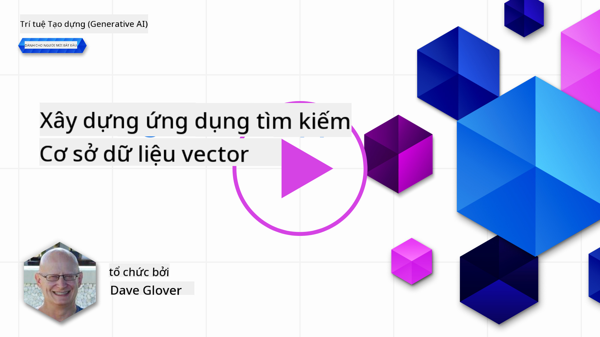
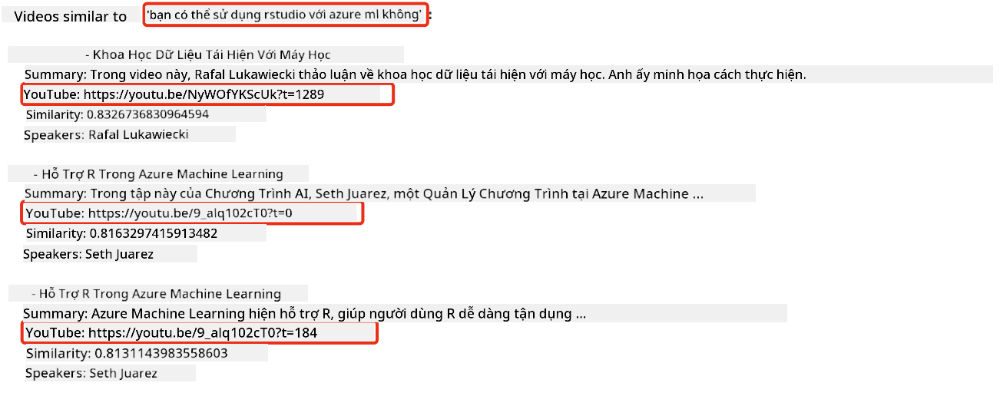
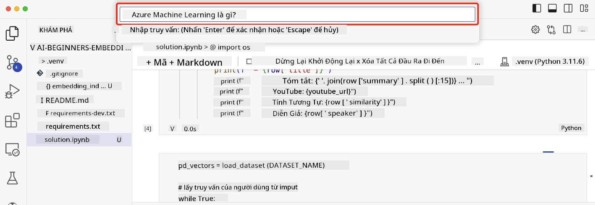

<!--
CO_OP_TRANSLATOR_METADATA:
{
  "original_hash": "d46aad0917a1a342d613e2c13d457da5",
  "translation_date": "2025-06-25T16:36:00+00:00",
  "source_file": "08-building-search-applications/README.md",
  "language_code": "vi"
}
-->
# Xây dựng Ứng dụng Tìm kiếm

[](https://aka.ms/gen-ai-lesson8-gh?WT.mc_id=academic-105485-koreyst)

> > _Nhấn vào hình ảnh ở trên để xem video của bài học này_

LLMs không chỉ có chatbot và tạo văn bản. Bạn cũng có thể xây dựng các ứng dụng tìm kiếm bằng cách sử dụng Embeddings. Embeddings là các biểu diễn số của dữ liệu, còn được gọi là vectors, và có thể được sử dụng cho tìm kiếm ngữ nghĩa dữ liệu.

Trong bài học này, bạn sẽ xây dựng một ứng dụng tìm kiếm cho startup giáo dục của chúng ta. Startup của chúng ta là một tổ chức phi lợi nhuận cung cấp giáo dục miễn phí cho học sinh ở các nước đang phát triển. Startup của chúng ta có một số lượng lớn video YouTube mà học sinh có thể sử dụng để học về AI. Startup của chúng ta muốn xây dựng một ứng dụng tìm kiếm cho phép học sinh tìm kiếm video YouTube bằng cách gõ câu hỏi.

Ví dụ, một học sinh có thể gõ 'Jupyter Notebooks là gì?' hoặc 'Azure ML là gì' và ứng dụng tìm kiếm sẽ trả về danh sách các video YouTube có liên quan đến câu hỏi, và tốt hơn nữa, ứng dụng tìm kiếm sẽ trả về liên kết đến nơi trong video mà câu trả lời cho câu hỏi đó được đặt.

## Giới thiệu

Trong bài học này, chúng ta sẽ đề cập đến:

- Tìm kiếm ngữ nghĩa so với tìm kiếm từ khóa.
- Text Embeddings là gì.
- Tạo chỉ mục Text Embeddings.
- Tìm kiếm trong chỉ mục Text Embeddings.

## Mục tiêu học tập

Sau khi hoàn thành bài học này, bạn sẽ có thể:

- Phân biệt giữa tìm kiếm ngữ nghĩa và tìm kiếm từ khóa.
- Giải thích Text Embeddings là gì.
- Tạo một ứng dụng sử dụng Embeddings để tìm kiếm dữ liệu.

## Tại sao xây dựng một ứng dụng tìm kiếm?

Tạo một ứng dụng tìm kiếm sẽ giúp bạn hiểu cách sử dụng Embeddings để tìm kiếm dữ liệu. Bạn cũng sẽ học cách xây dựng một ứng dụng tìm kiếm mà học sinh có thể sử dụng để tìm thông tin nhanh chóng.

Bài học bao gồm một Embedding Index của các bản ghi YouTube cho kênh YouTube Microsoft [AI Show](https://www.youtube.com/playlist?list=PLlrxD0HtieHi0mwteKBOfEeOYf0LJU4O1). AI Show là một kênh YouTube dạy bạn về AI và học máy. Embedding Index chứa các Embeddings cho mỗi bản ghi YouTube cho đến tháng 10 năm 2023. Bạn sẽ sử dụng Embedding Index để xây dựng một ứng dụng tìm kiếm cho startup của chúng ta. Ứng dụng tìm kiếm trả về liên kết đến nơi trong video mà câu trả lời cho câu hỏi đó được đặt. Đây là một cách tuyệt vời để học sinh tìm thông tin họ cần nhanh chóng.

Sau đây là một ví dụ về một truy vấn ngữ nghĩa cho câu hỏi 'bạn có thể sử dụng rstudio với azure ml không?'. Hãy xem URL YouTube, bạn sẽ thấy URL chứa một dấu thời gian đưa bạn đến nơi trong video mà câu trả lời cho câu hỏi đó được đặt.



## Tìm kiếm ngữ nghĩa là gì?

Bây giờ bạn có thể đang tự hỏi, tìm kiếm ngữ nghĩa là gì? Tìm kiếm ngữ nghĩa là một kỹ thuật tìm kiếm sử dụng ngữ nghĩa, hoặc ý nghĩa, của các từ trong truy vấn để trả về kết quả liên quan.

Đây là một ví dụ về tìm kiếm ngữ nghĩa. Giả sử bạn đang tìm mua một chiếc xe hơi, bạn có thể tìm kiếm 'chiếc xe mơ ước của tôi', tìm kiếm ngữ nghĩa hiểu rằng bạn không `dreaming` về một chiếc xe, mà bạn đang tìm mua chiếc xe `ideal` của mình. Tìm kiếm ngữ nghĩa hiểu ý định của bạn và trả về kết quả liên quan. Lựa chọn thay thế là `keyword search` mà sẽ tìm kiếm một cách trực tiếp về những giấc mơ liên quan đến xe và thường trả về kết quả không liên quan.

## Text Embeddings là gì?

[Text embeddings](https://en.wikipedia.org/wiki/Word_embedding?WT.mc_id=academic-105485-koreyst) là một kỹ thuật biểu diễn văn bản được sử dụng trong [xử lý ngôn ngữ tự nhiên](https://en.wikipedia.org/wiki/Natural_language_processing?WT.mc_id=academic-105485-koreyst). Text embeddings là các biểu diễn số ngữ nghĩa của văn bản. Embeddings được sử dụng để biểu diễn dữ liệu theo cách dễ hiểu cho máy. Có nhiều mô hình để xây dựng text embeddings, trong bài học này, chúng ta sẽ tập trung vào việc tạo embeddings bằng cách sử dụng OpenAI Embedding Model.

Đây là một ví dụ, tưởng tượng đoạn văn bản sau là trong bản ghi của một trong các tập trên kênh YouTube AI Show:

```text
Today we are going to learn about Azure Machine Learning.
```

Chúng ta sẽ truyền văn bản cho OpenAI Embedding API và nó sẽ trả về embedding gồm 1536 số, còn gọi là vector. Mỗi số trong vector đại diện cho một khía cạnh khác nhau của văn bản. Để ngắn gọn, đây là 10 số đầu tiên trong vector.

```python
[-0.006655829958617687, 0.0026128944009542465, 0.008792596869170666, -0.02446001023054123, -0.008540431968867779, 0.022071078419685364, -0.010703742504119873, 0.003311325330287218, -0.011632772162556648, -0.02187200076878071, ...]
```

## Chỉ mục Embedding được tạo ra như thế nào?

Chỉ mục Embedding cho bài học này được tạo ra với một loạt các script Python. Bạn sẽ tìm thấy các script cùng với hướng dẫn trong [README](./scripts/README.md?WT.mc_id=academic-105485-koreyst) trong thư mục 'scripts' cho bài học này. Bạn không cần phải chạy các script này để hoàn thành bài học vì Embedding Index đã được cung cấp cho bạn.

Các script thực hiện các hoạt động sau:

1. Bản ghi cho mỗi video YouTube trong playlist [AI Show](https://www.youtube.com/playlist?list=PLlrxD0HtieHi0mwteKBOfEeOYf0LJU4O1) được tải xuống.
2. Sử dụng [OpenAI Functions](https://learn.microsoft.com/azure/ai-services/openai/how-to/function-calling?WT.mc_id=academic-105485-koreyst), một nỗ lực được thực hiện để trích xuất tên người nói từ 3 phút đầu tiên của bản ghi YouTube. Tên người nói cho mỗi video được lưu trữ trong Embedding Index tên là `embedding_index_3m.json`.
3. Văn bản bản ghi sau đó được chia thành các **đoạn văn bản 3 phút**. Đoạn văn bản bao gồm khoảng 20 từ chồng lấp từ đoạn tiếp theo để đảm bảo rằng Embedding cho đoạn văn bản không bị cắt và cung cấp ngữ cảnh tìm kiếm tốt hơn.
4. Mỗi đoạn văn bản sau đó được truyền cho OpenAI Chat API để tóm tắt văn bản thành 60 từ. Tóm tắt cũng được lưu trữ trong Embedding Index `embedding_index_3m.json`.
5. Cuối cùng, văn bản đoạn được truyền cho OpenAI Embedding API. Embedding API trả về một vector gồm 1536 số đại diện cho ý nghĩa ngữ nghĩa của đoạn văn bản. Đoạn văn bản cùng với vector Embedding OpenAI được lưu trữ trong một Embedding Index `embedding_index_3m.json`.

### Cơ sở dữ liệu Vector

Để đơn giản hóa bài học, Embedding Index được lưu trữ trong một file JSON tên là `embedding_index_3m.json` và được tải vào một Pandas DataFrame. Tuy nhiên, trong sản xuất, Embedding Index sẽ được lưu trữ trong một cơ sở dữ liệu vector như [Azure Cognitive Search](https://learn.microsoft.com/training/modules/improve-search-results-vector-search?WT.mc_id=academic-105485-koreyst), [Redis](https://cookbook.openai.com/examples/vector_databases/redis/readme?WT.mc_id=academic-105485-koreyst), [Pinecone](https://cookbook.openai.com/examples/vector_databases/pinecone/readme?WT.mc_id=academic-105485-koreyst), [Weaviate](https://cookbook.openai.com/examples/vector_databases/weaviate/readme?WT.mc_id=academic-105485-koreyst), chỉ là một vài cái tên.

## Hiểu về sự tương đồng cosine

Chúng ta đã học về text embeddings, bước tiếp theo là học cách sử dụng text embeddings để tìm kiếm dữ liệu và đặc biệt là tìm các embeddings tương tự nhất với một truy vấn cho trước bằng cách sử dụng sự tương đồng cosine.

### Sự tương đồng cosine là gì?

Sự tương đồng cosine là một thước đo tương đồng giữa hai vectors, bạn cũng sẽ nghe điều này được gọi là `nearest neighbor search`. Để thực hiện tìm kiếm sự tương đồng cosine, bạn cần _vector hóa_ văn bản _truy vấn_ bằng cách sử dụng OpenAI Embedding API. Sau đó tính toán _sự tương đồng cosine_ giữa vector truy vấn và mỗi vector trong Embedding Index. Nhớ rằng, Embedding Index có một vector cho mỗi đoạn văn bản bản ghi YouTube. Cuối cùng, sắp xếp kết quả theo sự tương đồng cosine và các đoạn văn bản có sự tương đồng cosine cao nhất là tương tự nhất với truy vấn.

Từ góc độ toán học, sự tương đồng cosine đo lường cosine của góc giữa hai vectors được chiếu trong không gian đa chiều. Đo lường này có lợi ích, vì nếu hai tài liệu cách xa nhau bởi khoảng cách Euclidean do kích thước, chúng vẫn có thể có một góc nhỏ hơn giữa chúng và do đó có sự tương đồng cosine cao hơn. Để biết thêm thông tin về các phương trình sự tương đồng cosine, xem [Cosine similarity](https://en.wikipedia.org/wiki/Cosine_similarity?WT.mc_id=academic-105485-koreyst).

## Xây dựng ứng dụng tìm kiếm đầu tiên của bạn

Tiếp theo, chúng ta sẽ học cách xây dựng một ứng dụng tìm kiếm bằng cách sử dụng Embeddings. Ứng dụng tìm kiếm sẽ cho phép học sinh tìm kiếm một video bằng cách gõ câu hỏi. Ứng dụng tìm kiếm sẽ trả về danh sách các video có liên quan đến câu hỏi. Ứng dụng tìm kiếm cũng sẽ trả về liên kết đến nơi trong video mà câu trả lời cho câu hỏi đó được đặt.

Giải pháp này được xây dựng và kiểm tra trên Windows 11, macOS, và Ubuntu 22.04 sử dụng Python 3.10 trở lên. Bạn có thể tải Python từ [python.org](https://www.python.org/downloads/?WT.mc_id=academic-105485-koreyst).

## Bài tập - xây dựng một ứng dụng tìm kiếm, để hỗ trợ học sinh

Chúng ta đã giới thiệu startup của mình ở đầu bài học này. Bây giờ là lúc để hỗ trợ học sinh xây dựng một ứng dụng tìm kiếm cho các bài đánh giá của họ.

Trong bài tập này, bạn sẽ tạo các Azure OpenAI Services sẽ được sử dụng để xây dựng ứng dụng tìm kiếm. Bạn sẽ tạo các Azure OpenAI Services sau. Bạn sẽ cần một đăng ký Azure để hoàn thành bài tập này.

### Bắt đầu Azure Cloud Shell

1. Đăng nhập vào [Azure portal](https://portal.azure.com/?WT.mc_id=academic-105485-koreyst).
2. Chọn biểu tượng Cloud Shell ở góc trên bên phải của Azure portal.
3. Chọn **Bash** cho loại môi trường.

#### Tạo một nhóm tài nguyên

> Đối với các hướng dẫn này, chúng ta đang sử dụng nhóm tài nguyên tên là "semantic-video-search" ở East US.
> Bạn có thể thay đổi tên của nhóm tài nguyên, nhưng khi thay đổi vị trí cho các tài nguyên,
> hãy kiểm tra [bảng khả dụng của mô hình](https://aka.ms/oai/models?WT.mc_id=academic-105485-koreyst).

```shell
az group create --name semantic-video-search --location eastus
```

#### Tạo một tài nguyên Azure OpenAI Service

Từ Azure Cloud Shell, chạy lệnh sau để tạo một tài nguyên Azure OpenAI Service.

```shell
az cognitiveservices account create --name semantic-video-openai --resource-group semantic-video-search \
    --location eastus --kind OpenAI --sku s0
```

#### Lấy endpoint và keys để sử dụng trong ứng dụng này

Từ Azure Cloud Shell, chạy các lệnh sau để lấy endpoint và keys cho tài nguyên Azure OpenAI Service.

```shell
az cognitiveservices account show --name semantic-video-openai \
   --resource-group  semantic-video-search | jq -r .properties.endpoint
az cognitiveservices account keys list --name semantic-video-openai \
   --resource-group semantic-video-search | jq -r .key1
```

#### Triển khai mô hình Embedding OpenAI

Từ Azure Cloud Shell, chạy lệnh sau để triển khai mô hình Embedding OpenAI.

```shell
az cognitiveservices account deployment create \
    --name semantic-video-openai \
    --resource-group  semantic-video-search \
    --deployment-name text-embedding-ada-002 \
    --model-name text-embedding-ada-002 \
    --model-version "2"  \
    --model-format OpenAI \
    --sku-capacity 100 --sku-name "Standard"
```

## Giải pháp

Mở [notebook giải pháp](../../../08-building-search-applications/python/aoai-solution.ipynb) trong GitHub Codespaces và làm theo hướng dẫn trong Jupyter Notebook.

Khi bạn chạy notebook, bạn sẽ được nhắc nhập một truy vấn. Hộp nhập sẽ trông như thế này:



## Làm tốt lắm! Tiếp tục học tập của bạn

Sau khi hoàn thành bài học này, hãy xem bộ sưu tập [Generative AI Learning](https://aka.ms/genai-collection?WT.mc_id=academic-105485-koreyst) của chúng tôi để tiếp tục nâng cao kiến thức về Generative AI!

Hãy chuyển đến Bài học 9, nơi chúng ta sẽ xem cách [xây dựng ứng dụng tạo hình ảnh](../09-building-image-applications/README.md?WT.mc_id=academic-105485-koreyst)!

**Tuyên bố miễn trừ trách nhiệm**:  
Tài liệu này đã được dịch bằng dịch vụ dịch thuật AI [Co-op Translator](https://github.com/Azure/co-op-translator). Mặc dù chúng tôi cố gắng đảm bảo độ chính xác, xin lưu ý rằng các bản dịch tự động có thể chứa lỗi hoặc sự không chính xác. Tài liệu gốc bằng ngôn ngữ bản địa của nó nên được coi là nguồn thông tin chính thức. Đối với thông tin quan trọng, nên sử dụng dịch vụ dịch thuật chuyên nghiệp của con người. Chúng tôi không chịu trách nhiệm cho bất kỳ sự hiểu lầm hoặc diễn giải sai nào phát sinh từ việc sử dụng bản dịch này.