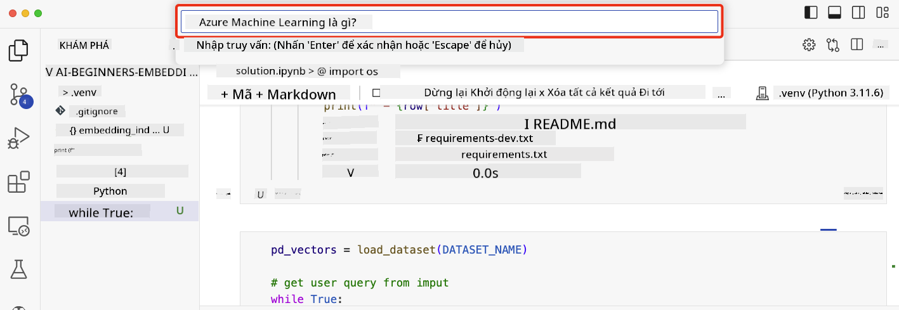

<!--
CO_OP_TRANSLATOR_METADATA:
{
  "original_hash": "d46aad0917a1a342d613e2c13d457da5",
  "translation_date": "2025-07-09T12:58:39+00:00",
  "source_file": "08-building-search-applications/README.md",
  "language_code": "vi"
}
-->
# Xây dựng Ứng dụng Tìm kiếm

[](https://aka.ms/gen-ai-lesson8-gh?WT.mc_id=academic-105485-koreyst)

> > _Nhấp vào hình ảnh trên để xem video bài học này_

LLM không chỉ dành cho chatbot và tạo văn bản. Bạn cũng có thể xây dựng các ứng dụng tìm kiếm sử dụng Embeddings. Embeddings là các biểu diễn số của dữ liệu, còn gọi là vector, và có thể được dùng để tìm kiếm ngữ nghĩa cho dữ liệu.

Trong bài học này, bạn sẽ xây dựng một ứng dụng tìm kiếm cho startup giáo dục của chúng tôi. Startup của chúng tôi là một tổ chức phi lợi nhuận cung cấp giáo dục miễn phí cho học sinh ở các nước đang phát triển. Startup có rất nhiều video YouTube mà học sinh có thể dùng để học về AI. Startup muốn xây dựng một ứng dụng tìm kiếm cho phép học sinh tìm video YouTube bằng cách nhập câu hỏi.

Ví dụ, một học sinh có thể nhập 'Jupyter Notebooks là gì?' hoặc 'Azure ML là gì' và ứng dụng tìm kiếm sẽ trả về danh sách các video YouTube liên quan đến câu hỏi, thậm chí còn tốt hơn, ứng dụng sẽ trả về liên kết đến đúng vị trí trong video nơi câu trả lời được đề cập.

## Giới thiệu

Trong bài học này, chúng ta sẽ tìm hiểu:

- Tìm kiếm ngữ nghĩa so với tìm kiếm theo từ khóa.
- Text Embeddings là gì.
- Tạo chỉ mục Text Embeddings.
- Tìm kiếm trong chỉ mục Text Embeddings.

## Mục tiêu học tập

Sau khi hoàn thành bài học, bạn sẽ có thể:

- Phân biệt được tìm kiếm ngữ nghĩa và tìm kiếm theo từ khóa.
- Giải thích được Text Embeddings là gì.
- Tạo ứng dụng sử dụng Embeddings để tìm kiếm dữ liệu.

## Tại sao lại xây dựng ứng dụng tìm kiếm?

Việc tạo ứng dụng tìm kiếm sẽ giúp bạn hiểu cách sử dụng Embeddings để tìm kiếm dữ liệu. Bạn cũng sẽ học cách xây dựng ứng dụng tìm kiếm giúp học sinh nhanh chóng tìm được thông tin.

Bài học bao gồm một Chỉ mục Embedding của các bản ghi phụ đề YouTube cho kênh Microsoft [AI Show](https://www.youtube.com/playlist?list=PLlrxD0HtieHi0mwteKBOfEeOYf0LJU4O1). AI Show là kênh YouTube dạy về AI và học máy. Chỉ mục Embedding chứa các Embeddings cho từng bản ghi phụ đề YouTube đến tháng 10 năm 2023. Bạn sẽ dùng chỉ mục này để xây dựng ứng dụng tìm kiếm cho startup. Ứng dụng tìm kiếm sẽ trả về liên kết đến vị trí trong video nơi câu trả lời được đề cập. Đây là cách tuyệt vời để học sinh nhanh chóng tìm được thông tin cần thiết.

Dưới đây là ví dụ về truy vấn ngữ nghĩa cho câu hỏi 'có thể dùng rstudio với azure ml không?'. Hãy xem URL YouTube, bạn sẽ thấy URL có dấu thời gian dẫn đến vị trí trong video nơi câu trả lời được đề cập.


## Tìm kiếm ngữ nghĩa là gì?

Có thể bạn đang thắc mắc, tìm kiếm ngữ nghĩa là gì? Tìm kiếm ngữ nghĩa là kỹ thuật tìm kiếm sử dụng ý nghĩa của các từ trong truy vấn để trả về kết quả phù hợp.

Dưới đây là ví dụ về tìm kiếm ngữ nghĩa. Giả sử bạn muốn mua một chiếc xe hơi, bạn có thể tìm kiếm 'xe mơ ước của tôi', tìm kiếm ngữ nghĩa hiểu rằng bạn không phải đang `mơ` về một chiếc xe, mà bạn đang tìm mua chiếc xe `lý tưởng` của mình. Tìm kiếm ngữ nghĩa hiểu được ý định của bạn và trả về kết quả phù hợp. Ngược lại, `tìm kiếm theo từ khóa` sẽ tìm kiếm đúng từ "mơ" và "xe" và thường trả về kết quả không liên quan.

## Text Embeddings là gì?

[Text embeddings](https://en.wikipedia.org/wiki/Word_embedding?WT.mc_id=academic-105485-koreyst) là kỹ thuật biểu diễn văn bản được sử dụng trong [xử lý ngôn ngữ tự nhiên](https://en.wikipedia.org/wiki/Natural_language_processing?WT.mc_id=academic-105485-koreyst). Text embeddings là các biểu diễn số mang tính ngữ nghĩa của văn bản. Embeddings được dùng để biểu diễn dữ liệu theo cách dễ hiểu cho máy. Có nhiều mô hình để tạo text embeddings, trong bài học này, chúng ta sẽ tập trung vào việc tạo embeddings bằng Mô hình Embedding của OpenAI.

Ví dụ, giả sử đoạn văn bản sau nằm trong bản ghi phụ đề của một tập trong kênh AI Show trên YouTube:

```text
Today we are going to learn about Azure Machine Learning.
```

Chúng ta sẽ gửi đoạn văn bản này đến OpenAI Embedding API và nó sẽ trả về embedding gồm 1536 số, còn gọi là vector. Mỗi số trong vector đại diện cho một khía cạnh khác nhau của văn bản. Để ngắn gọn, đây là 10 số đầu tiên trong vector.

```python
[-0.006655829958617687, 0.0026128944009542465, 0.008792596869170666, -0.02446001023054123, -0.008540431968867779, 0.022071078419685364, -0.010703742504119873, 0.003311325330287218, -0.011632772162556648, -0.02187200076878071, ...]
```

## Chỉ mục Embedding được tạo như thế nào?

Chỉ mục Embedding cho bài học này được tạo bằng một loạt script Python. Bạn có thể tìm thấy các script cùng hướng dẫn trong [README](./scripts/README.md?WT.mc_id=academic-105485-koreyst) trong thư mục 'scripts' của bài học. Bạn không cần chạy các script này để hoàn thành bài học vì chỉ mục Embedding đã được cung cấp sẵn.

Các script thực hiện các bước sau:

1. Tải bản ghi phụ đề cho từng video trong playlist [AI Show](https://www.youtube.com/playlist?list=PLlrxD0HtieHi0mwteKBOfEeOYf0LJU4O1).
2. Sử dụng [OpenAI Functions](https://learn.microsoft.com/azure/ai-services/openai/how-to/function-calling?WT.mc_id=academic-105485-koreyst), cố gắng trích xuất tên người nói từ 3 phút đầu của bản ghi phụ đề YouTube. Tên người nói cho mỗi video được lưu trong chỉ mục Embedding có tên `embedding_index_3m.json`.
3. Văn bản bản ghi được chia thành các đoạn văn bản dài **3 phút**. Mỗi đoạn có khoảng 20 từ chồng lấn với đoạn tiếp theo để đảm bảo embedding của đoạn không bị cắt và cung cấp ngữ cảnh tìm kiếm tốt hơn.
4. Mỗi đoạn văn bản được gửi đến OpenAI Chat API để tóm tắt thành 60 từ. Bản tóm tắt cũng được lưu trong chỉ mục Embedding `embedding_index_3m.json`.
5. Cuối cùng, đoạn văn bản được gửi đến OpenAI Embedding API. API trả về vector gồm 1536 số đại diện cho ý nghĩa ngữ nghĩa của đoạn. Đoạn cùng vector Embedding được lưu trong chỉ mục Embedding `embedding_index_3m.json`.

### Cơ sở dữ liệu vector

Để đơn giản, chỉ mục Embedding được lưu trong file JSON tên `embedding_index_3m.json` và được tải vào Pandas DataFrame. Tuy nhiên, trong môi trường sản xuất, chỉ mục Embedding sẽ được lưu trong cơ sở dữ liệu vector như [Azure Cognitive Search](https://learn.microsoft.com/training/modules/improve-search-results-vector-search?WT.mc_id=academic-105485-koreyst), [Redis](https://cookbook.openai.com/examples/vector_databases/redis/readme?WT.mc_id=academic-105485-koreyst), [Pinecone](https://cookbook.openai.com/examples/vector_databases/pinecone/readme?WT.mc_id=academic-105485-koreyst), [Weaviate](https://cookbook.openai.com/examples/vector_databases/weaviate/readme?WT.mc_id=academic-105485-koreyst), và nhiều hơn nữa.

## Hiểu về độ tương đồng cosine

Chúng ta đã tìm hiểu về text embeddings, bước tiếp theo là học cách sử dụng embeddings để tìm kiếm dữ liệu, đặc biệt là tìm các embeddings giống nhất với truy vấn bằng cách dùng độ tương đồng cosine.

### Độ tương đồng cosine là gì?

Độ tương đồng cosine là thước đo mức độ giống nhau giữa hai vector, còn được gọi là `tìm kiếm láng giềng gần nhất`. Để thực hiện tìm kiếm theo độ tương đồng cosine, bạn cần _vector hóa_ văn bản _truy vấn_ bằng OpenAI Embedding API. Sau đó tính _độ tương đồng cosine_ giữa vector truy vấn và từng vector trong chỉ mục Embedding. Nhớ rằng, chỉ mục Embedding có một vector cho mỗi đoạn văn bản bản ghi phụ đề YouTube. Cuối cùng, sắp xếp kết quả theo độ tương đồng cosine, các đoạn văn bản có độ tương đồng cao nhất là những đoạn giống truy vấn nhất.

Về mặt toán học, độ tương đồng cosine đo cosin của góc giữa hai vector được chiếu trong không gian đa chiều. Thước đo này hữu ích vì nếu hai tài liệu cách xa nhau theo khoảng cách Euclid do kích thước khác nhau, chúng vẫn có thể có góc nhỏ hơn và do đó độ tương đồng cosine cao hơn. Để biết thêm về công thức độ tương đồng cosine, xem [Cosine similarity](https://en.wikipedia.org/wiki/Cosine_similarity?WT.mc_id=academic-105485-koreyst).

## Xây dựng ứng dụng tìm kiếm đầu tiên của bạn

Tiếp theo, chúng ta sẽ học cách xây dựng ứng dụng tìm kiếm sử dụng Embeddings. Ứng dụng tìm kiếm sẽ cho phép học sinh tìm video bằng cách nhập câu hỏi. Ứng dụng sẽ trả về danh sách video liên quan đến câu hỏi. Ứng dụng cũng trả về liên kết đến vị trí trong video nơi câu trả lời được đề cập.

Giải pháp này được xây dựng và thử nghiệm trên Windows 11, macOS và Ubuntu 22.04 với Python 3.10 trở lên. Bạn có thể tải Python từ [python.org](https://www.python.org/downloads/?WT.mc_id=academic-105485-koreyst).

## Bài tập - xây dựng ứng dụng tìm kiếm, hỗ trợ học sinh

Chúng ta đã giới thiệu startup của mình ở đầu bài học. Bây giờ là lúc giúp học sinh xây dựng ứng dụng tìm kiếm cho bài kiểm tra của họ.

Trong bài tập này, bạn sẽ tạo các dịch vụ Azure OpenAI được dùng để xây dựng ứng dụng tìm kiếm. Bạn sẽ tạo các dịch vụ Azure OpenAI sau. Bạn cần có tài khoản Azure để hoàn thành bài tập này.

### Khởi động Azure Cloud Shell

1. Đăng nhập vào [Azure portal](https://portal.azure.com/?WT.mc_id=academic-105485-koreyst).
2. Chọn biểu tượng Cloud Shell ở góc trên bên phải của portal Azure.
3. Chọn **Bash** làm loại môi trường.

#### Tạo nhóm tài nguyên

> Trong hướng dẫn này, chúng ta dùng nhóm tài nguyên tên "semantic-video-search" ở East US.
> Bạn có thể đổi tên nhóm tài nguyên, nhưng khi thay đổi vị trí tài nguyên,
> hãy kiểm tra [bảng khả dụng mô hình](https://aka.ms/oai/models?WT.mc_id=academic-105485-koreyst).

```shell
az group create --name semantic-video-search --location eastus
```

#### Tạo tài nguyên Azure OpenAI Service

Từ Azure Cloud Shell, chạy lệnh sau để tạo tài nguyên Azure OpenAI Service.

```shell
az cognitiveservices account create --name semantic-video-openai --resource-group semantic-video-search \
    --location eastus --kind OpenAI --sku s0
```

#### Lấy endpoint và khóa để sử dụng trong ứng dụng

Từ Azure Cloud Shell, chạy các lệnh sau để lấy endpoint và khóa cho tài nguyên Azure OpenAI Service.

```shell
az cognitiveservices account show --name semantic-video-openai \
   --resource-group  semantic-video-search | jq -r .properties.endpoint
az cognitiveservices account keys list --name semantic-video-openai \
   --resource-group semantic-video-search | jq -r .key1
```

#### Triển khai mô hình OpenAI Embedding

Từ Azure Cloud Shell, chạy lệnh sau để triển khai mô hình OpenAI Embedding.

```shell
az cognitiveservices account deployment create \
    --name semantic-video-openai \
    --resource-group  semantic-video-search \
    --deployment-name text-embedding-ada-002 \
    --model-name text-embedding-ada-002 \
    --model-version "2"  \
    --model-format OpenAI \
    --sku-capacity 100 --sku-name "Standard"
```

## Giải pháp

Mở [notebook giải pháp](../../../08-building-search-applications/python/aoai-solution.ipynb) trong GitHub Codespaces và làm theo hướng dẫn trong Jupyter Notebook.

Khi chạy notebook, bạn sẽ được yêu cầu nhập truy vấn. Hộp nhập liệu sẽ trông như sau:



## Làm tốt lắm! Tiếp tục học tập

Sau khi hoàn thành bài học, hãy xem bộ sưu tập [Generative AI Learning](https://aka.ms/genai-collection?WT.mc_id=academic-105485-koreyst) để tiếp tục nâng cao kiến thức về Generative AI!

Hãy đến bài học 9, nơi chúng ta sẽ tìm hiểu cách [xây dựng ứng dụng tạo hình ảnh](../09-building-image-applications/README.md?WT.mc_id=academic-105485-koreyst)!

**Tuyên bố từ chối trách nhiệm**:  
Tài liệu này đã được dịch bằng dịch vụ dịch thuật AI [Co-op Translator](https://github.com/Azure/co-op-translator). Mặc dù chúng tôi cố gắng đảm bảo độ chính xác, xin lưu ý rằng các bản dịch tự động có thể chứa lỗi hoặc không chính xác. Tài liệu gốc bằng ngôn ngữ gốc của nó nên được coi là nguồn chính xác và đáng tin cậy. Đối với các thông tin quan trọng, nên sử dụng dịch vụ dịch thuật chuyên nghiệp do con người thực hiện. Chúng tôi không chịu trách nhiệm về bất kỳ sự hiểu lầm hoặc giải thích sai nào phát sinh từ việc sử dụng bản dịch này.