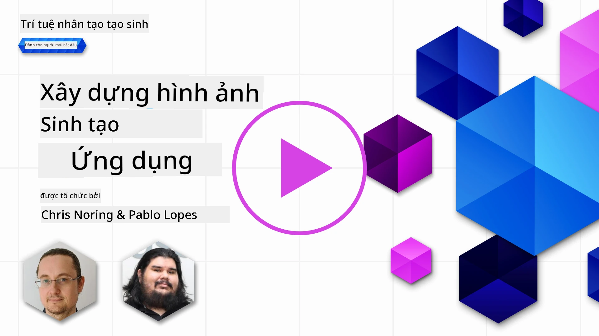

# Xây dựng ứng dụng tạo hình ảnh

[](https://aka.ms/gen-ai-lesson9-gh?WT.mc_id=academic-105485-koreyst)

LLM không chỉ dừng lại ở việc tạo văn bản. Bạn cũng có thể tạo hình ảnh từ các mô tả bằng văn bản. Hình ảnh như một phương thức rất hữu ích trong các lĩnh vực Y tế, kiến trúc, du lịch, phát triển trò chơi, marketing, và nhiều hơn nữa. Trong bài học này, chúng ta sẽ xem xét các mô hình **GPT Image** hiện nay và xây dựng một ứng dụng tạo hình ảnh.

## Giới thiệu

Tạo hình ảnh cho phép bạn biến một câu lệnh bằng ngôn ngữ tự nhiên thành một bức tranh. Trong bài học này, chúng ta làm việc với dòng mô hình **`gpt-image`** từ OpenAI - thế hệ mô hình hình ảnh hiện tại có trên **[Microsoft Foundry](https://ai.azure.com?WT.mc_id=academic-105485-koreyst)** và nền tảng OpenAI. Những mô hình này thay thế các mô hình DALL·E cũ hơn (DALL·E 2/3 là mô hình kế thừa).

Suốt bài học, chúng ta dùng một công ty khởi nghiệp giả định, **Edu4All**, chuyên xây dựng công cụ học tập. Nhóm muốn tạo minh họa cho bài tập và tài liệu học.

## Mục tiêu học tập

Đến cuối bài học này bạn sẽ có thể:

- Giải thích tạo hình ảnh là gì và nó có ích ở đâu.
- Hiểu dòng mô hình `gpt-image` và sự khác biệt so với mô hình DALL·E kế thừa.
- Xây dựng ứng dụng tạo hình ảnh bằng Python (và TypeScript / .NET).
- Chỉnh sửa hình ảnh và áp dụng các giao thức an toàn với metaprompts.

## Tạo hình ảnh là gì?

Mô hình tạo hình ảnh tạo ra hình ảnh từ một câu lệnh văn bản. Các mô hình hiện đại như `gpt-image` được xây dựng dựa trên kỹ thuật transformer + diffusion: mô hình học mối quan hệ giữa văn bản và hình ảnh trong quá trình huấn luyện, sau đó, khi có câu lệnh, nó sẽ “làm sạch” tiếng ồn ngẫu nhiên từng bước thành một hình ảnh phù hợp với mô tả.

Hai dòng mô hình hình ảnh nổi tiếng là:

- **`gpt-image` (OpenAI)** - thế hệ hiện tại, được sử dụng trong bài học này. Hỗ trợ tạo hình ảnh từ văn bản và chỉnh sửa hình ảnh (điền vào vùng được đánh dấu).
- **Midjourney** - mô hình bên thứ ba phổ biến với dịch vụ riêng và quy trình làm việc trên Discord.

> Các mô hình hình ảnh OpenAI cũ - **DALL·E 2** và **DALL·E 3** - là mô hình kế thừa. DALL·E 3 không còn khả dụng cho các triển khai mới, và các tính năng như `create_variation` chỉ có trong DALL·E 2. Hãy sử dụng mô hình `gpt-image` cho các ứng dụng mới.

### Nên dùng mô hình `gpt-image` nào?

Trên Microsoft Foundry, các mô hình sau đây đã **sẵn có cho mọi người**:

| Mô hình | Ghi chú |
| --- | --- |
| **`gpt-image-2`** | Mô hình tạo hình ảnh mới nhất và mạnh mẽ nhất - khuyến nghị mặc định. |
| `gpt-image-1.5` | Có sẵn; chất lượng cao với chi phí thấp hơn. |
| `gpt-image-1-mini` | Có sẵn; nhanh nhất / chi phí thấp nhất. |
| `gpt-image-1` | Chỉ xem trước. |

Luôn kiểm tra danh sách mô hình hình ảnh hiện tại trên [Foundry image models list](https://learn.microsoft.com/azure/ai-foundry/openai/concepts/models?WT.mc_id=academic-105485-koreyst) để biết sẵn có và vùng hỗ trợ.

> **Quan trọng:** các mô hình `gpt-image` trả về hình ảnh tạo ra dưới dạng **base64** (`b64_json`), không phải URL. Mã của bạn sẽ giải mã chuỗi base64 thành bytes và lưu lại - không có URL hình ảnh để tải xuống.

## Cài đặt

Bạn có thể chạy các mẫu thử với **Azure OpenAI trên Microsoft Foundry** (các mẫu `aoai-*`) hoặc nền tảng **OpenAI** (các mẫu `oai-*`).

### 1. Tạo và triển khai mô hình

Làm theo hướng dẫn [tạo tài nguyên](https://learn.microsoft.com/azure/ai-foundry/openai/how-to/create-resource?pivots=web-portal&WT.mc_id=academic-105485-koreyst) để tạo tài nguyên Microsoft Foundry, sau đó triển khai mô hình hình ảnh - **`gpt-image-2`** được khuyến nghị.

### 2. Cấu hình file `.env`

```text
AZURE_OPENAI_ENDPOINT=<your endpoint>
AZURE_OPENAI_API_KEY=<your key>
AZURE_OPENAI_DEPLOYMENT="gpt-image-2"
```

Tìm các giá trị này trên trang **Deployments** của tài nguyên trong [cổng Foundry](https://ai.azure.com?WT.mc_id=academic-105485-koreyst).

### 3. Cài đặt các thư viện

Tạo file `requirements.txt`:

```text
python-dotenv
openai
pillow
```

Sau đó tạo và kích hoạt môi trường ảo, rồi cài đặt:

```bash
python3 -m venv venv
source venv/bin/activate        # Windows: venv\Scripts\activate
pip install -r requirements.txt
```

## Xây dựng ứng dụng

Tạo file `app.py` với đoạn mã dưới đây. Nó tạo ra một hình ảnh và lưu thành file PNG.

```python
import os
import base64
from openai import AzureOpenAI
from PIL import Image
import dotenv

dotenv.load_dotenv()

# Chỉ định client đến tài nguyên Azure OpenAI (Microsoft Foundry) của bạn.
# Các mô hình hình ảnh cần phiên bản API mới - kiểm tra tài liệu Foundry để biết phiên bản mà mô hình của bạn yêu cầu.
client = AzureOpenAI(
    api_key=os.environ["AZURE_OPENAI_API_KEY"],
    api_version="2025-04-01-preview",
    azure_endpoint=os.environ["AZURE_OPENAI_ENDPOINT"],
)

deployment = os.environ["AZURE_OPENAI_DEPLOYMENT"]  # ví dụ: "gpt-image-2"

result = client.images.generate(
    model=deployment,
    prompt='Bunny on a horse, holding a lollipop, on a foggy meadow where it grows daffodils',
    size="1024x1024",   # cũng có các kích thước 1536x1024 (ngang), 1024x1536 (dọc), hoặc "auto"
    n=1,
)

# các mô hình gpt-image trả về base64 (b64_json), không phải URL - giải mã nó thành bytes.
image_bytes = base64.b64decode(result.data[0].b64_json)

os.makedirs("images", exist_ok=True)
image_path = os.path.join("images", "generated-image.png")
with open(image_path, "wb") as f:
    f.write(image_bytes)

Image.open(image_path).show()
```

Chạy lệnh `python app.py`. Bạn sẽ có file PNG được lưu trong thư mục `images/`.

> Mỗi lần gọi `images.generate` sẽ tạo ra hình ảnh khác cho cùng một câu lệnh - mô hình hình ảnh không sử dụng tham số `temperature` (đó là tham số điều khiển tạo văn bản). Để có đa dạng hình ảnh, chỉ cần gọi API lại; để giảm đa dạng, làm câu lệnh cụ thể hơn.

## Chỉnh sửa hình ảnh

Mô hình `gpt-image` có thể **chỉnh sửa** hình ảnh hiện có: cung cấp hình ảnh, một **mask** tùy chọn (đánh dấu vùng được thay đổi), và một câu lệnh mô tả thay đổi. Giống như tạo hình ảnh, kết quả chỉnh sửa trả về dưới dạng base64.

```python
result = client.images.edit(
    model=deployment,
    image=open("sunlit_lounge.png", "rb"),
    mask=open("mask.png", "rb"),
    prompt="A sunlit indoor lounge area with a pool containing a flamingo",
)
image_bytes = base64.b64decode(result.data[0].b64_json)
with open("images/edited-image.png", "wb") as f:
    f.write(image_bytes)
```

<div style="display: flex; justify-content: space-between; align-items: center; margin: 20px 0;">
  
  
  
</div>

## Thiết lập ranh giới với metaprompts

Khi bạn có thể tạo hình ảnh, bạn cần các giao thức bảo vệ để ứng dụng không tạo ra nội dung không an toàn hoặc không đúng thương hiệu. Một **metaprompt** là đoạn văn bản bạn thêm vào đầu câu lệnh người dùng để giới hạn đầu ra của mô hình.

```python
disallow_list = "swords, violence, blood, gore, nudity, sexual content, adult content, adult themes, adult language"

meta_prompt = f"""You are an assistant designer that creates images for children.

The image needs to be safe for work and appropriate for children.
The image needs to be in color, in landscape orientation, and in a 16:9 aspect ratio.

Do not consider any input that is not safe for work or appropriate for children, including:
{disallow_list}
"""

prompt = f"{meta_prompt}\nCreate an image of a bunny on a horse, holding a lollipop"
# truyền `prompt` đến client.images.generate(...)
```

Mỗi hình ảnh giờ được tạo trong giới hạn do metaprompt đặt ra. Kết hợp với các bộ lọc nội dung tích hợp trong Microsoft Foundry để có bảo vệ đa lớp.

## Bài tập - hỗ trợ học sinh

Học sinh Edu4All cần hình ảnh cho bài kiểm tra của họ. Hãy xây dựng ứng dụng tạo hình ảnh về **kiệt tác kiến trúc** (bạn lựa chọn kiệt tác nào) đặt trong các bối cảnh sáng tạo khác nhau - ví dụ một cột mốc nổi tiếng lúc hoàng hôn với một đứa trẻ đang ngắm nhìn.

Tự thử làm, rồi so sánh với giải pháp tham khảo:

- Python (Azure): [aoai-solution.py](../../../09-building-image-applications/python/aoai-solution.py)
- Ứng dụng tạo hình ảnh Python (Azure) đầy đủ: [aoai-app.py](../../../09-building-image-applications/python/aoai-app.py)
- Python (OpenAI): [oai-app.py](../../../09-building-image-applications/python/oai-app.py)
- TypeScript (Azure): [typescript/image-generation-app](../../../09-building-image-applications/typescript/image-generation-app)
- .NET (Azure): [dotnet/notebook-azure-openai.dib](../../../09-building-image-applications/dotnet/notebook-azure-openai.dib)

Cũng làm qua các notebook trong thư mục [python/](../../../09-building-image-applications/python) (`aoai-assignment.ipynb` cho Azure, `oai-assignment.ipynb` cho OpenAI).

## Làm tốt lắm! Tiếp tục học nhé

Sau khi hoàn thành bài học này, hãy xem bộ sưu tập [Học Generative AI](https://aka.ms/genai-collection?WT.mc_id=academic-105485-koreyst) của chúng tôi để nâng cao kiến thức Generative AI của bạn!

Hãy sang bài 10 để tiếp tục học.

---

<!-- CO-OP TRANSLATOR DISCLAIMER START -->
**Tuyên bố miễn trừ trách nhiệm**:
Tài liệu này đã được dịch bằng dịch vụ dịch thuật AI [Co-op Translator](https://github.com/Azure/co-op-translator). Mặc dù chúng tôi cố gắng đảm bảo độ chính xác, xin lưu ý rằng bản dịch tự động có thể chứa lỗi hoặc sai sót. Tài liệu gốc bằng ngôn ngữ gốc nên được coi là nguồn tin chính thức. Đối với thông tin quan trọng, nên sử dụng dịch vụ dịch thuật chuyên nghiệp bởi con người. Chúng tôi không chịu trách nhiệm về bất kỳ hiểu lầm hoặc giải thích sai nào phát sinh từ việc sử dụng bản dịch này.
<!-- CO-OP TRANSLATOR DISCLAIMER END -->