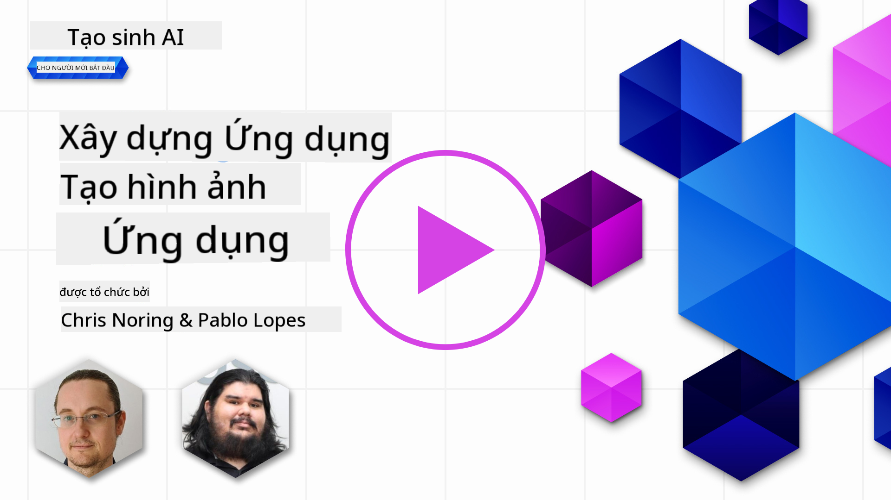

<!--
CO_OP_TRANSLATOR_METADATA:
{
  "original_hash": "ef74ad58fc01f7ad80788f79505f9816",
  "translation_date": "2025-08-26T18:13:17+00:00",
  "source_file": "09-building-image-applications/README.md",
  "language_code": "vi"
}
-->
# Xây dựng Ứng dụng Tạo Ảnh

[](https://aka.ms/gen-ai-lesson9-gh?WT.mc_id=academic-105485-koreyst)

LLM không chỉ dừng lại ở việc tạo văn bản. Chúng ta còn có thể tạo ra hình ảnh từ mô tả bằng văn bản. Việc sử dụng hình ảnh như một phương thức truyền tải có thể rất hữu ích trong nhiều lĩnh vực như công nghệ y tế, kiến trúc, du lịch, phát triển game và nhiều lĩnh vực khác. Trong chương này, chúng ta sẽ tìm hiểu về hai mô hình tạo ảnh phổ biến nhất hiện nay: DALL-E và Midjourney.

## Giới thiệu

Trong bài học này, chúng ta sẽ tìm hiểu:

- Tạo ảnh và lý do tại sao nó hữu ích.
- DALL-E và Midjourney là gì, cách chúng hoạt động.
- Cách xây dựng một ứng dụng tạo ảnh.

## Mục tiêu học tập

Sau khi hoàn thành bài học này, bạn sẽ có thể:

- Xây dựng một ứng dụng tạo ảnh.
- Đặt ra các giới hạn cho ứng dụng của bạn bằng các metaprompt.
- Làm việc với DALL-E và Midjourney.

## Tại sao nên xây dựng ứng dụng tạo ảnh?

Ứng dụng tạo ảnh là một cách tuyệt vời để khám phá khả năng của AI sinh sinh. Chúng có thể được sử dụng cho, ví dụ:

- **Chỉnh sửa và tổng hợp ảnh**. Bạn có thể tạo ra hình ảnh cho nhiều mục đích khác nhau, như chỉnh sửa ảnh hoặc tổng hợp ảnh.

- **Áp dụng cho nhiều ngành nghề**. Chúng cũng có thể được sử dụng để tạo hình ảnh cho nhiều ngành như công nghệ y tế, du lịch, phát triển game và nhiều lĩnh vực khác.

## Tình huống: Edu4All

Trong bài học này, chúng ta sẽ tiếp tục làm việc với startup Edu4All. Các học sinh sẽ tạo ra hình ảnh cho các bài kiểm tra của mình, hình ảnh cụ thể là gì sẽ do học sinh quyết định, có thể là minh họa cho truyện cổ tích của mình, tạo nhân vật mới cho câu chuyện hoặc giúp các em hình dung ý tưởng, khái niệm của mình.

Ví dụ, nếu học sinh của Edu4All đang học về các công trình kiến trúc nổi tiếng:


với một prompt như

> "Chó đứng cạnh tháp Eiffel dưới ánh nắng sớm"

## DALL-E và Midjourney là gì?

[DALL-E](https://openai.com/dall-e-2?WT.mc_id=academic-105485-koreyst) và [Midjourney](https://www.midjourney.com/?WT.mc_id=academic-105485-koreyst) là hai mô hình tạo ảnh phổ biến nhất hiện nay, cho phép bạn sử dụng prompt để tạo ra hình ảnh.

### DALL-E

Bắt đầu với DALL-E, đây là một mô hình AI sinh sinh có khả năng tạo ra hình ảnh từ mô tả bằng văn bản.

> [DALL-E là sự kết hợp của hai mô hình, CLIP và diffused attention](https://towardsdatascience.com/openais-dall-e-and-clip-101-a-brief-introduction-3a4367280d4e?WT.mc_id=academic-105485-koreyst).

- **CLIP** là một mô hình tạo ra các embedding, tức là biểu diễn số của dữ liệu, từ hình ảnh và văn bản.

- **Diffused attention** là mô hình tạo ra hình ảnh từ embedding. DALL-E được huấn luyện trên tập dữ liệu gồm hình ảnh và văn bản, có thể dùng để tạo ra hình ảnh từ mô tả bằng văn bản. Ví dụ, DALL-E có thể tạo ra hình ảnh mèo đội mũ, hoặc chó có kiểu tóc mohawk.

### Midjourney

Midjourney hoạt động tương tự như DALL-E, tạo ra hình ảnh từ prompt văn bản. Midjourney cũng có thể dùng để tạo hình ảnh với các prompt như “mèo đội mũ”, hoặc “chó có kiểu tóc mohawk”.


_Ảnh từ Wikipedia, tạo bởi Midjourney_

## DALL-E và Midjourney hoạt động như thế nào

Đầu tiên, [DALL-E](https://arxiv.org/pdf/2102.12092.pdf?WT.mc_id=academic-105485-koreyst). DALL-E là một mô hình AI sinh sinh dựa trên kiến trúc transformer với _autoregressive transformer_.

_Autoregressive transformer_ xác định cách mô hình tạo ra hình ảnh từ mô tả văn bản, nó tạo từng pixel một, sau đó dùng các pixel đã tạo để tạo pixel tiếp theo. Quá trình này lặp lại qua nhiều lớp của mạng nơ-ron cho đến khi hoàn thành hình ảnh.

Với quy trình này, DALL-E kiểm soát các thuộc tính, đối tượng, đặc điểm và nhiều yếu tố khác trong hình ảnh tạo ra. Tuy nhiên, DALL-E 2 và 3 có khả năng kiểm soát hình ảnh tạo ra tốt hơn.

## Xây dựng ứng dụng tạo ảnh đầu tiên của bạn

Vậy để xây dựng một ứng dụng tạo ảnh, bạn cần những thư viện sau:

- **python-dotenv**, rất nên dùng thư viện này để lưu các thông tin bí mật trong file _.env_ tách biệt với mã nguồn.
- **openai**, thư viện này dùng để tương tác với API OpenAI.
- **pillow**, để làm việc với hình ảnh trong Python.
- **requests**, hỗ trợ gửi các yêu cầu HTTP.

## Tạo và triển khai mô hình Azure OpenAI

Nếu bạn chưa làm, hãy làm theo hướng dẫn trên trang [Microsoft Learn](https://learn.microsoft.com/azure/ai-foundry/openai/how-to/create-resource?pivots=web-portal)
để tạo tài nguyên và mô hình Azure OpenAI. Chọn DALL-E 3 làm mô hình.  

## Tạo ứng dụng

1. Tạo file _.env_ với nội dung sau:

   ```text
   AZURE_OPENAI_ENDPOINT=<your endpoint>
   AZURE_OPENAI_API_KEY=<your key>
   AZURE_OPENAI_DEPLOYMENT="dall-e-3"
   ```

   Tìm thông tin này trong Azure OpenAI Foundry Portal cho tài nguyên của bạn ở phần "Deployments".

1. Gom các thư viện trên vào file _requirements.txt_ như sau:

   ```text
   python-dotenv
   openai
   pillow
   requests
   ```

1. Tiếp theo, tạo môi trường ảo và cài đặt các thư viện:

   ```bash
   python3 -m venv venv
   source venv/bin/activate
   pip install -r requirements.txt
   ```

   Đối với Windows, dùng các lệnh sau để tạo và kích hoạt môi trường ảo:

   ```bash
   python3 -m venv venv
   venv\Scripts\activate.bat
   ```

1. Thêm đoạn mã sau vào file _app.py_:

    ```python
    import openai
    import os
    import requests
    from PIL import Image
    import dotenv
    from openai import OpenAI, AzureOpenAI
    
    # import dotenv
    dotenv.load_dotenv()
    
    # configure Azure OpenAI service client 
    client = AzureOpenAI(
      azure_endpoint = os.environ["AZURE_OPENAI_ENDPOINT"],
      api_key=os.environ['AZURE_OPENAI_API_KEY'],
      api_version = "2024-02-01"
      )
    try:
        # Create an image by using the image generation API
        generation_response = client.images.generate(
                                prompt='Bunny on horse, holding a lollipop, on a foggy meadow where it grows daffodils',
                                size='1024x1024', n=1,
                                model=os.environ['AZURE_OPENAI_DEPLOYMENT']
                              )

        # Set the directory for the stored image
        image_dir = os.path.join(os.curdir, 'images')

        # If the directory doesn't exist, create it
        if not os.path.isdir(image_dir):
            os.mkdir(image_dir)

        # Initialize the image path (note the filetype should be png)
        image_path = os.path.join(image_dir, 'generated-image.png')

        # Retrieve the generated image
        image_url = generation_response.data[0].url  # extract image URL from response
        generated_image = requests.get(image_url).content  # download the image
        with open(image_path, "wb") as image_file:
            image_file.write(generated_image)

        # Display the image in the default image viewer
        image = Image.open(image_path)
        image.show()

    # catch exceptions
    except openai.InvalidRequestError as err:
        print(err)
   ```

Giải thích đoạn mã này:

- Đầu tiên, chúng ta import các thư viện cần thiết, bao gồm thư viện OpenAI, dotenv, requests và Pillow.

  ```python
  import openai
  import os
  import requests
  from PIL import Image
  import dotenv
  ```

- Tiếp theo, chúng ta tải các biến môi trường từ file _.env_.

  ```python
  # import dotenv
  dotenv.load_dotenv()
  ```

- Sau đó, cấu hình client dịch vụ Azure OpenAI 

  ```python
  # Get endpoint and key from environment variables
  client = AzureOpenAI(
      azure_endpoint = os.environ["AZURE_OPENAI_ENDPOINT"],
      api_key=os.environ['AZURE_OPENAI_API_KEY'],
      api_version = "2024-02-01"
      )
  ```

- Tiếp theo, chúng ta tạo ảnh:

  ```python
  # Create an image by using the image generation API
  generation_response = client.images.generate(
                        prompt='Bunny on horse, holding a lollipop, on a foggy meadow where it grows daffodils',
                        size='1024x1024', n=1,
                        model=os.environ['AZURE_OPENAI_DEPLOYMENT']
                      )
  ```

  Đoạn mã trên trả về một đối tượng JSON chứa URL của hình ảnh vừa tạo. Chúng ta có thể dùng URL này để tải ảnh về và lưu vào file.

- Cuối cùng, chúng ta mở ảnh và dùng trình xem ảnh mặc định để hiển thị:

  ```python
  image = Image.open(image_path)
  image.show()
  ```

### Chi tiết hơn về việc tạo ảnh

Hãy xem kỹ hơn đoạn mã tạo ảnh:

    ```python
      generation_response = client.images.generate(
                                prompt='Bunny on horse, holding a lollipop, on a foggy meadow where it grows daffodils',
                                size='1024x1024', n=1,
                                model=os.environ['AZURE_OPENAI_DEPLOYMENT']
                            )
    ```

- **prompt** là prompt văn bản dùng để tạo ảnh. Ở đây, chúng ta dùng prompt "Thỏ cưỡi ngựa, cầm kẹo mút, trên đồng cỏ sương mù có hoa thủy tiên".
- **size** là kích thước ảnh tạo ra. Ở đây, chúng ta tạo ảnh kích thước 1024x1024 pixel.
- **n** là số lượng ảnh tạo ra. Ở đây, chúng ta tạo hai ảnh.
- **temperature** là tham số kiểm soát mức độ ngẫu nhiên của kết quả từ mô hình AI sinh sinh. Giá trị temperature nằm trong khoảng từ 0 đến 1, 0 là kết quả xác định, 1 là hoàn toàn ngẫu nhiên. Giá trị mặc định là 0.7.

Còn nhiều điều bạn có thể làm với hình ảnh, chúng ta sẽ tìm hiểu ở phần tiếp theo.

## Các khả năng bổ sung của tạo ảnh

Bạn đã thấy cách chúng ta có thể tạo ảnh chỉ với vài dòng mã Python. Tuy nhiên, còn nhiều điều khác bạn có thể làm với hình ảnh.

Bạn cũng có thể:

- **Chỉnh sửa ảnh**. Bằng cách cung cấp một ảnh gốc, một mặt nạ và một prompt, bạn có thể thay đổi một phần của ảnh. Ví dụ, bạn có thể thêm một vật thể vào một phần của ảnh. Hãy tưởng tượng ảnh chú thỏ, bạn có thể thêm một chiếc mũ cho thỏ. Cách làm là cung cấp ảnh gốc, mặt nạ (xác định vùng cần thay đổi) và prompt mô tả thay đổi. 
> Lưu ý: tính năng này không hỗ trợ trên DALL-E 3. 
 
Đây là ví dụ sử dụng GPT Image:

    ```python
    response = client.images.edit(
        model="gpt-image-1",
        image=open("sunlit_lounge.png", "rb"),
        mask=open("mask.png", "rb"),
        prompt="A sunlit indoor lounge area with a pool containing a flamingo"
    )
    image_url = response.data[0].url
    ```

  Ảnh gốc chỉ có phòng khách với hồ bơi, còn ảnh kết quả sẽ có thêm con hồng hạc:

<div style="display: flex; justify-content: space-between; align-items: center; margin: 20px 0;">
  
  
  
</div>


- **Tạo biến thể**. Ý tưởng là bạn lấy một ảnh có sẵn và yêu cầu tạo ra các biến thể. Để tạo biến thể, bạn cung cấp ảnh và prompt văn bản, mã như sau:

  ```python
  response = openai.Image.create_variation(
    image=open("bunny-lollipop.png", "rb"),
    n=1,
    size="1024x1024"
  )
  image_url = response['data'][0]['url']
  ```

  > Lưu ý, chỉ hỗ trợ trên OpenAI

## Temperature

Temperature là tham số kiểm soát mức độ ngẫu nhiên của kết quả từ mô hình AI sinh sinh. Giá trị temperature nằm trong khoảng từ 0 đến 1, 0 là kết quả xác định, 1 là hoàn toàn ngẫu nhiên. Giá trị mặc định là 0.7.

Hãy xem ví dụ về cách temperature hoạt động, bằng cách chạy prompt này hai lần:

> Prompt : "Thỏ cưỡi ngựa, cầm kẹo mút, trên đồng cỏ sương mù có hoa thủy tiên"


Bây giờ hãy chạy lại prompt này để xem chúng ta có nhận được cùng một ảnh không:


Bạn có thể thấy, các ảnh khá giống nhau nhưng không hoàn toàn giống. Hãy thử thay đổi giá trị temperature thành 0.1 và xem điều gì xảy ra:

```python
 generation_response = client.images.create(
        prompt='Bunny on horse, holding a lollipop, on a foggy meadow where it grows daffodils',    # Enter your prompt text here
        size='1024x1024',
        n=2
    )
```

### Thay đổi temperature

Hãy thử làm cho kết quả xác định hơn. Quan sát hai ảnh vừa tạo, ở ảnh đầu có thỏ, ở ảnh sau có ngựa, nên các ảnh khác biệt khá nhiều.

Vì vậy, hãy thay đổi mã và đặt temperature về 0 như sau:

```python
generation_response = client.images.create(
        prompt='Bunny on horse, holding a lollipop, on a foggy meadow where it grows daffodils',    # Enter your prompt text here
        size='1024x1024',
        n=2,
        temperature=0
    )
```

Khi chạy mã này, bạn sẽ nhận được hai ảnh sau:

- 
- 

Bạn có thể thấy rõ hai ảnh này giống nhau hơn nhiều.

## Đặt giới hạn cho ứng dụng bằng metaprompt

Với demo này, chúng ta đã có thể tạo ảnh cho khách hàng. Tuy nhiên, chúng ta cần đặt ra một số giới hạn cho ứng dụng.

Ví dụ, chúng ta không muốn tạo ra các hình ảnh không phù hợp với môi trường làm việc, hoặc không phù hợp với trẻ em.

Chúng ta có thể làm điều này bằng _metaprompt_. Metaprompt là các prompt văn bản dùng để kiểm soát kết quả của mô hình AI sinh sinh. Ví dụ, chúng ta có thể dùng metaprompt để đảm bảo hình ảnh tạo ra phù hợp với môi trường làm việc, hoặc phù hợp với trẻ em.

### Cách hoạt động?

Vậy metaprompt hoạt động như thế nào?

Metaprompt là các prompt văn bản dùng để kiểm soát kết quả của mô hình AI sinh sinh, được đặt trước prompt chính, dùng để kiểm soát kết quả của mô hình và được nhúng vào ứng dụng để kiểm soát kết quả. Kết hợp prompt đầu vào và metaprompt thành một prompt duy nhất.

Một ví dụ về metaprompt như sau:

```text
You are an assistant designer that creates images for children.

The image needs to be safe for work and appropriate for children.

The image needs to be in color.

The image needs to be in landscape orientation.

The image needs to be in a 16:9 aspect ratio.

Do not consider any input from the following that is not safe for work or appropriate for children.

(Input)

```

Bây giờ, hãy xem cách sử dụng metaprompt trong demo của chúng ta.

```python
disallow_list = "swords, violence, blood, gore, nudity, sexual content, adult content, adult themes, adult language, adult humor, adult jokes, adult situations, adult"

meta_prompt =f"""You are an assistant designer that creates images for children.

The image needs to be safe for work and appropriate for children.

The image needs to be in color.

The image needs to be in landscape orientation.

The image needs to be in a 16:9 aspect ratio.

Do not consider any input from the following that is not safe for work or appropriate for children.
{disallow_list}
"""

prompt = f"{meta_prompt}
Create an image of a bunny on a horse, holding a lollipop"

# TODO add request to generate image
```

Từ prompt trên, bạn có thể thấy tất cả các ảnh được tạo ra đều tuân theo metaprompt.

## Bài tập - Hỗ trợ học sinh

Chúng ta đã giới thiệu Edu4All ở đầu bài học. Bây giờ là lúc giúp học sinh tạo ảnh cho các bài kiểm tra của mình.

Các học sinh sẽ tạo ảnh cho bài kiểm tra về các công trình kiến trúc nổi tiếng, cụ thể là công trình nào sẽ do học sinh quyết định. Các em được khuyến khích sáng tạo để đặt các công trình này vào các bối cảnh khác nhau.

## Gợi ý giải

Đây là một giải pháp có thể:

```python
import openai
import os
import requests
from PIL import Image
import dotenv
from openai import AzureOpenAI
# import dotenv
dotenv.load_dotenv()

# Get endpoint and key from environment variables
client = AzureOpenAI(
  azure_endpoint = os.environ["AZURE_OPENAI_ENDPOINT"],
  api_key=os.environ['AZURE_OPENAI_API_KEY'],
  api_version = "2024-02-01"
  )


disallow_list = "swords, violence, blood, gore, nudity, sexual content, adult content, adult themes, adult language, adult humor, adult jokes, adult situations, adult"

meta_prompt = f"""You are an assistant designer that creates images for children.

The image needs to be safe for work and appropriate for children.

The image needs to be in color.

The image needs to be in landscape orientation.

The image needs to be in a 16:9 aspect ratio.

Do not consider any input from the following that is not safe for work or appropriate for children.
{disallow_list}
"""

prompt = f"""{meta_prompt}
Generate monument of the Arc of Triumph in Paris, France, in the evening light with a small child holding a Teddy looks on.
""""

try:
    # Create an image by using the image generation API
    generation_response = client.images.generate(
        prompt=prompt,    # Enter your prompt text here
        size='1024x1024',
        n=1,
    )
    # Set the directory for the stored image
    image_dir = os.path.join(os.curdir, 'images')

    # If the directory doesn't exist, create it
    if not os.path.isdir(image_dir):
        os.mkdir(image_dir)

    # Initialize the image path (note the filetype should be png)
    image_path = os.path.join(image_dir, 'generated-image.png')

    # Retrieve the generated image
    image_url = generation_response.data[0].url  # extract image URL from response
    generated_image = requests.get(image_url).content  # download the image
    with open(image_path, "wb") as image_file:
        image_file.write(generated_image)

    # Display the image in the default image viewer
    image = Image.open(image_path)
    image.show()

# catch exceptions
except openai.BadRequestError as err:
    print(err)
```

## Tuyệt vời! Tiếp tục học nhé
Sau khi hoàn thành bài học này, hãy xem bộ sưu tập [Học về AI Tạo sinh](https://aka.ms/genai-collection?WT.mc_id=academic-105485-koreyst) để tiếp tục nâng cao kiến thức về AI Tạo sinh của bạn!

Hãy chuyển sang Bài 10, nơi chúng ta sẽ tìm hiểu cách [xây dựng ứng dụng AI với low-code](../10-building-low-code-ai-applications/README.md?WT.mc_id=academic-105485-koreyst)

---

**Tuyên bố miễn trừ trách nhiệm**:
Tài liệu này đã được dịch bằng dịch vụ dịch thuật AI [Co-op Translator](https://github.com/Azure/co-op-translator). Mặc dù chúng tôi cố gắng đảm bảo độ chính xác, xin lưu ý rằng bản dịch tự động có thể chứa lỗi hoặc không chính xác. Tài liệu gốc bằng ngôn ngữ bản địa nên được coi là nguồn tham khảo chính thức. Đối với các thông tin quan trọng, khuyến nghị sử dụng dịch vụ dịch thuật chuyên nghiệp bởi con người. Chúng tôi không chịu trách nhiệm đối với bất kỳ sự hiểu lầm hoặc diễn giải sai nào phát sinh từ việc sử dụng bản dịch này.