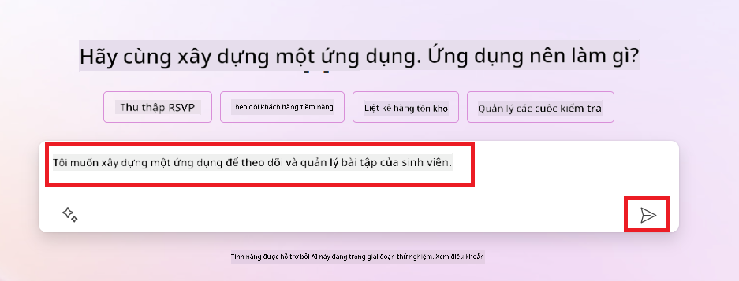
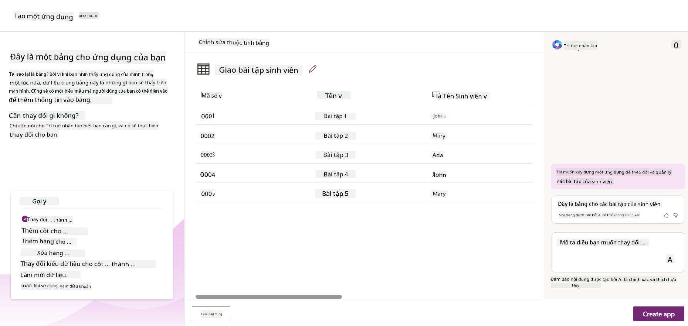
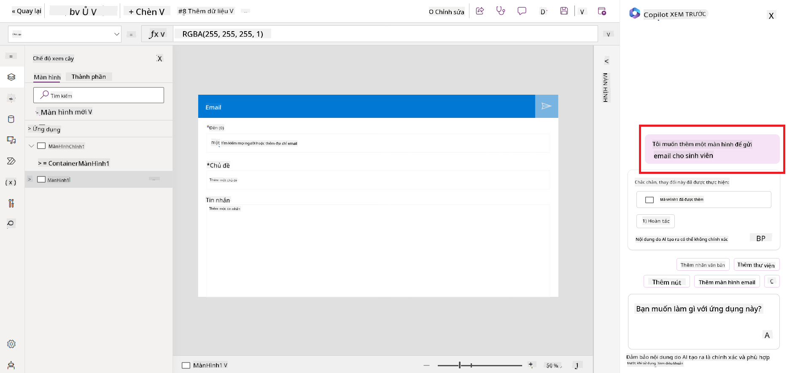
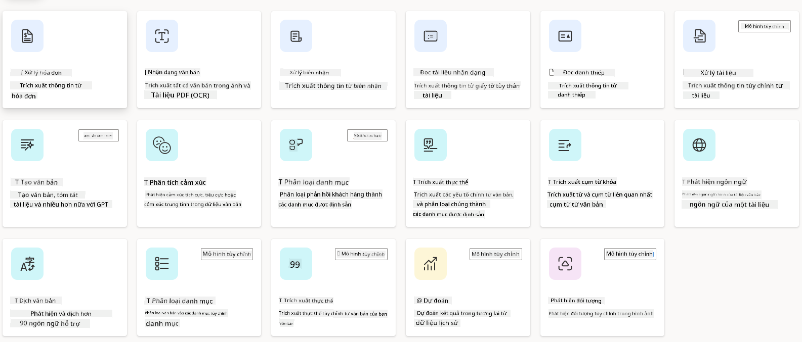
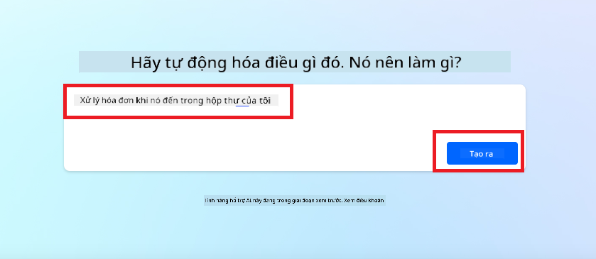
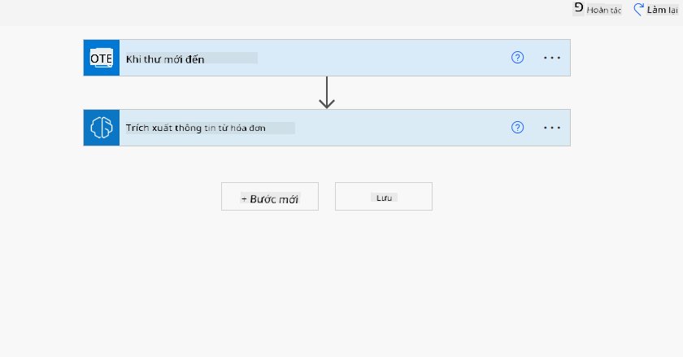
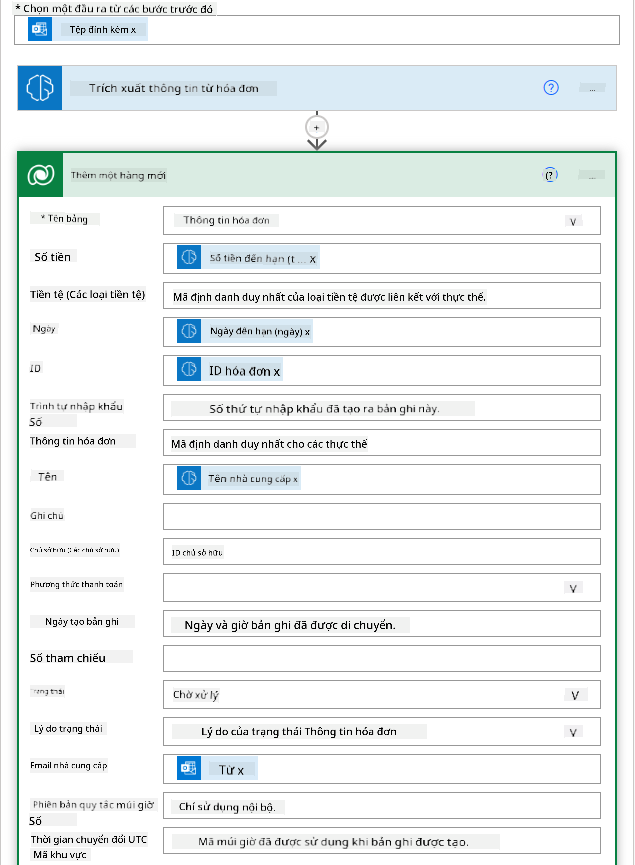
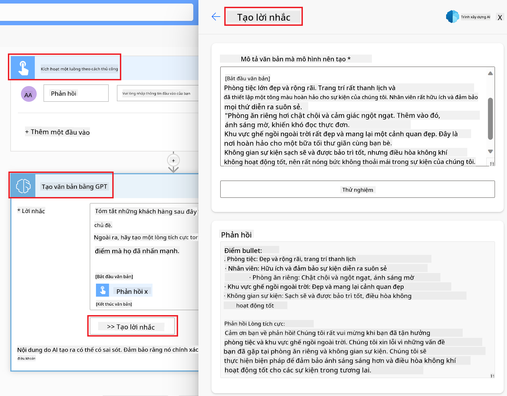

<!--
CO_OP_TRANSLATOR_METADATA:
{
  "original_hash": "f5ff3b6204a695a117d6f452403c95f7",
  "translation_date": "2025-05-19T20:43:35+00:00",
  "source_file": "10-building-low-code-ai-applications/README.md",
  "language_code": "vi"
}
-->
# Xây dựng Ứng dụng AI với Mã thấp

> _(Nhấp vào hình ảnh ở trên để xem video của bài học này)_

## Giới thiệu

Bây giờ chúng ta đã học cách xây dựng các ứng dụng tạo hình ảnh, hãy nói về mã thấp. AI tạo sinh có thể được sử dụng cho nhiều lĩnh vực khác nhau bao gồm mã thấp, nhưng mã thấp là gì và làm thế nào chúng ta có thể thêm AI vào nó?

Xây dựng ứng dụng và giải pháp đã trở nên dễ dàng hơn cho cả các nhà phát triển truyền thống và không phải là nhà phát triển thông qua việc sử dụng Nền tảng Phát triển Mã thấp. Nền tảng này cho phép bạn xây dựng ứng dụng và giải pháp với ít hoặc không cần mã. Điều này đạt được bằng cách cung cấp môi trường phát triển trực quan cho phép bạn kéo và thả các thành phần để xây dựng ứng dụng và giải pháp. Điều này cho phép bạn xây dựng ứng dụng và giải pháp nhanh hơn và với ít tài nguyên hơn. Trong bài học này, chúng ta sẽ đi sâu vào cách sử dụng Mã thấp và cách nâng cao phát triển mã thấp với AI bằng cách sử dụng Power Platform.

Power Platform cung cấp cho các tổ chức cơ hội để trao quyền cho đội ngũ của họ tự xây dựng các giải pháp thông qua môi trường mã thấp hoặc không mã trực quan. Môi trường này giúp đơn giản hóa quá trình xây dựng giải pháp. Với Power Platform, các giải pháp có thể được xây dựng trong vài ngày hoặc tuần thay vì vài tháng hoặc năm. Power Platform bao gồm năm sản phẩm chính: Power Apps, Power Automate, Power BI, Power Pages và Copilot Studio.

Bài học này bao gồm:

- Giới thiệu về AI tạo sinh trong Power Platform
- Giới thiệu về Copilot và cách sử dụng nó
- Sử dụng AI tạo sinh để xây dựng ứng dụng và luồng trong Power Platform
- Hiểu các Mô hình AI trong Power Platform với AI Builder

## Mục tiêu Học tập

Khi kết thúc bài học này, bạn sẽ có thể:

- Hiểu cách Copilot hoạt động trong Power Platform.

- Xây dựng một Ứng dụng Theo dõi Bài tập Sinh viên cho startup giáo dục của chúng tôi.

- Xây dựng một Luồng Xử lý Hóa đơn sử dụng AI để trích xuất thông tin từ hóa đơn.

- Áp dụng các thực hành tốt nhất khi sử dụng Mô hình AI Tạo Văn bản với GPT.

Các công cụ và công nghệ bạn sẽ sử dụng trong bài học này là:

- **Power Apps**, cho ứng dụng Theo dõi Bài tập Sinh viên, cung cấp môi trường phát triển mã thấp để xây dựng ứng dụng theo dõi, quản lý và tương tác với dữ liệu.

- **Dataverse**, để lưu trữ dữ liệu cho ứng dụng Theo dõi Bài tập Sinh viên, nơi Dataverse sẽ cung cấp một nền tảng dữ liệu mã thấp để lưu trữ dữ liệu của ứng dụng.

- **Power Automate**, cho luồng Xử lý Hóa đơn, nơi bạn sẽ có môi trường phát triển mã thấp để xây dựng quy trình tự động hóa xử lý hóa đơn.

- **AI Builder**, cho Mô hình AI Xử lý Hóa đơn, nơi bạn sẽ sử dụng các Mô hình AI đã được xây dựng sẵn để xử lý hóa đơn cho startup của chúng tôi.

## AI Tạo sinh trong Power Platform

Nâng cao phát triển và ứng dụng mã thấp với AI tạo sinh là một lĩnh vực trọng tâm chính cho Power Platform. Mục tiêu là cho phép mọi người xây dựng ứng dụng, trang web, bảng điều khiển và tự động hóa quy trình với AI, _mà không cần chuyên môn về khoa học dữ liệu_. Mục tiêu này được đạt được bằng cách tích hợp AI tạo sinh vào trải nghiệm phát triển mã thấp trong Power Platform dưới dạng Copilot và AI Builder.

### Điều này hoạt động như thế nào?

Copilot là một trợ lý AI cho phép bạn xây dựng các giải pháp Power Platform bằng cách mô tả yêu cầu của bạn qua một loạt các bước trò chuyện sử dụng ngôn ngữ tự nhiên. Bạn có thể, ví dụ, hướng dẫn trợ lý AI của mình nêu rõ các trường mà ứng dụng của bạn sẽ sử dụng và nó sẽ tạo ra cả ứng dụng và mô hình dữ liệu cơ bản hoặc bạn có thể chỉ định cách thiết lập một luồng trong Power Automate.

Bạn có thể sử dụng các chức năng điều khiển bằng Copilot như một tính năng trong các màn hình ứng dụng của bạn để cho phép người dùng khám phá thông tin thông qua các tương tác trò chuyện.

AI Builder là một khả năng AI mã thấp có sẵn trong Power Platform cho phép bạn sử dụng các Mô hình AI để giúp bạn tự động hóa quy trình và dự đoán kết quả. Với AI Builder, bạn có thể mang AI vào các ứng dụng và luồng của mình kết nối với dữ liệu trong Dataverse hoặc trong các nguồn dữ liệu đám mây khác nhau, chẳng hạn như SharePoint, OneDrive hoặc Azure.

Copilot có sẵn trong tất cả các sản phẩm của Power Platform: Power Apps, Power Automate, Power BI, Power Pages và Power Virtual Agents. AI Builder có sẵn trong Power Apps và Power Automate. Trong bài học này, chúng ta sẽ tập trung vào cách sử dụng Copilot và AI Builder trong Power Apps và Power Automate để xây dựng một giải pháp cho startup giáo dục của chúng tôi.

### Copilot trong Power Apps

Là một phần của Power Platform, Power Apps cung cấp môi trường phát triển mã thấp để xây dựng ứng dụng theo dõi, quản lý và tương tác với dữ liệu. Đây là một bộ dịch vụ phát triển ứng dụng với một nền tảng dữ liệu có thể mở rộng và khả năng kết nối với các dịch vụ đám mây và dữ liệu tại chỗ. Power Apps cho phép bạn xây dựng ứng dụng chạy trên trình duyệt, máy tính bảng và điện thoại, và có thể được chia sẻ với đồng nghiệp. Power Apps giúp người dùng dễ dàng bắt đầu phát triển ứng dụng với giao diện đơn giản, để mọi người dùng kinh doanh hoặc nhà phát triển chuyên nghiệp có thể xây dựng ứng dụng tùy chỉnh. Trải nghiệm phát triển ứng dụng cũng được nâng cao với AI Tạo sinh thông qua Copilot.

Tính năng trợ lý AI Copilot trong Power Apps cho phép bạn mô tả loại ứng dụng bạn cần và thông tin bạn muốn ứng dụng của mình theo dõi, thu thập hoặc hiển thị. Copilot sau đó sẽ tạo ra một ứng dụng Canvas đáp ứng dựa trên mô tả của bạn. Bạn có thể tùy chỉnh ứng dụng để đáp ứng nhu cầu của mình. AI Copilot cũng tạo ra và gợi ý một Bảng Dataverse với các trường bạn cần để lưu trữ dữ liệu bạn muốn theo dõi và một số dữ liệu mẫu. Chúng ta sẽ xem Dataverse là gì và cách bạn có thể sử dụng nó trong Power Apps trong bài học này sau. Bạn có thể tùy chỉnh bảng để đáp ứng nhu cầu của mình sử dụng tính năng trợ lý AI Copilot thông qua các bước trò chuyện. Tính năng này có sẵn ngay từ màn hình chính của Power Apps.

### Copilot trong Power Automate

Là một phần của Power Platform, Power Automate cho phép người dùng tạo các luồng công việc tự động giữa các ứng dụng và dịch vụ. Nó giúp tự động hóa các quy trình kinh doanh lặp đi lặp lại như giao tiếp, thu thập dữ liệu và phê duyệt quyết định. Giao diện đơn giản của nó cho phép người dùng với mọi trình độ kỹ thuật (từ người mới bắt đầu đến các nhà phát triển có kinh nghiệm) tự động hóa các nhiệm vụ công việc. Trải nghiệm phát triển luồng công việc cũng được nâng cao với AI Tạo sinh thông qua Copilot.

Tính năng trợ lý AI Copilot trong Power Automate cho phép bạn mô tả loại luồng bạn cần và các hành động bạn muốn luồng thực hiện. Copilot sau đó sẽ tạo ra một luồng dựa trên mô tả của bạn. Bạn có thể tùy chỉnh luồng để đáp ứng nhu cầu của mình. AI Copilot cũng tạo ra và gợi ý các hành động bạn cần để thực hiện nhiệm vụ bạn muốn tự động hóa. Chúng ta sẽ xem luồng là gì và cách bạn có thể sử dụng chúng trong Power Automate trong bài học này sau. Bạn có thể tùy chỉnh các hành động để đáp ứng nhu cầu của mình sử dụng tính năng trợ lý AI Copilot thông qua các bước trò chuyện. Tính năng này có sẵn ngay từ màn hình chính của Power Automate.

## Bài tập: Quản lý bài tập và hóa đơn cho startup của chúng tôi, sử dụng Copilot

Startup của chúng tôi cung cấp các khóa học trực tuyến cho sinh viên. Startup đã phát triển nhanh chóng và hiện đang gặp khó khăn trong việc đáp ứng nhu cầu cho các khóa học của mình. Startup đã thuê bạn làm nhà phát triển Power Platform để giúp họ xây dựng một giải pháp mã thấp để giúp họ quản lý bài tập và hóa đơn của sinh viên. Giải pháp của họ nên có khả năng giúp họ theo dõi và quản lý bài tập của sinh viên thông qua một ứng dụng và tự động hóa quá trình xử lý hóa đơn thông qua một luồng công việc. Bạn đã được yêu cầu sử dụng AI Tạo sinh để phát triển giải pháp.

Khi bạn bắt đầu sử dụng Copilot, bạn có thể sử dụng [Thư viện Gợi ý Copilot Power Platform](https://github.com/pnp/powerplatform-prompts?WT.mc_id=academic-109639-somelezediko) để bắt đầu với các gợi ý. Thư viện này chứa danh sách các gợi ý mà bạn có thể sử dụng để xây dựng ứng dụng và luồng với Copilot. Bạn cũng có thể sử dụng các gợi ý trong thư viện để có ý tưởng về cách mô tả yêu cầu của bạn cho Copilot.

### Xây dựng Ứng dụng Theo dõi Bài tập Sinh viên cho Startup của Chúng tôi

Các nhà giáo dục tại startup của chúng tôi đã gặp khó khăn trong việc theo dõi bài tập của sinh viên. Họ đã sử dụng bảng tính để theo dõi các bài tập nhưng điều này đã trở nên khó khăn để quản lý khi số lượng sinh viên tăng lên. Họ đã yêu cầu bạn xây dựng một ứng dụng giúp họ theo dõi và quản lý bài tập của sinh viên. Ứng dụng nên cho phép họ thêm bài tập mới, xem bài tập, cập nhật bài tập và xóa bài tập. Ứng dụng cũng nên cho phép các nhà giáo dục và sinh viên xem các bài tập đã được chấm điểm và những bài chưa được chấm điểm.

Bạn sẽ xây dựng ứng dụng sử dụng Copilot trong Power Apps theo các bước dưới đây:

1. Điều hướng đến màn hình chính của [Power Apps](https://make.powerapps.com?WT.mc_id=academic-105485-koreyst).

1. Sử dụng khu vực văn bản trên màn hình chính để mô tả ứng dụng bạn muốn xây dựng. Ví dụ, **_Tôi muốn xây dựng một ứng dụng để theo dõi và quản lý bài tập của sinh viên_**. Nhấp vào nút **Gửi** để gửi gợi ý cho AI Copilot.

1. AI Copilot sẽ gợi ý một Bảng Dataverse với các trường bạn cần để lưu trữ dữ liệu bạn muốn theo dõi và một số dữ liệu mẫu. Bạn có thể tùy chỉnh bảng để đáp ứng nhu cầu của mình sử dụng tính năng trợ lý AI Copilot thông qua các bước trò chuyện.

   > **Quan trọng**: Dataverse là nền tảng dữ liệu cơ bản cho Power Platform. Đây là một nền tảng dữ liệu mã thấp để lưu trữ dữ liệu của ứng dụng. Đây là một dịch vụ được quản lý hoàn toàn lưu trữ dữ liệu an toàn trong Đám mây Microsoft và được cung cấp trong môi trường Power Platform của bạn. Nó đi kèm với các khả năng quản trị dữ liệu tích hợp sẵn, chẳng hạn như phân loại dữ liệu, dòng dõi dữ liệu, kiểm soát truy cập chi tiết, và nhiều hơn nữa. Bạn có thể tìm hiểu thêm về Dataverse [tại đây](https://docs.microsoft.com/powerapps/maker/data-platform/data-platform-intro?WT.mc_id=academic-109639-somelezediko).

   

1. Các nhà giáo dục muốn gửi email cho các sinh viên đã nộp bài tập của họ để cập nhật cho họ về tiến độ của bài tập. Bạn có thể sử dụng Copilot để thêm một trường mới vào bảng để lưu trữ email của sinh viên. Ví dụ, bạn có thể sử dụng gợi ý sau để thêm một trường mới vào bảng: **_Tôi muốn thêm một cột để lưu trữ email của sinh viên_**. Nhấp vào nút **Gửi** để gửi gợi ý cho AI Copilot.

1. AI Copilot sẽ tạo ra một trường mới và bạn có thể tùy chỉnh trường để đáp ứng nhu cầu của mình.

1. Khi bạn đã hoàn thành với bảng, nhấp vào nút **Tạo ứng dụng** để tạo ứng dụng.

1. AI Copilot sẽ tạo ra một ứng dụng Canvas đáp ứng dựa trên mô tả của bạn. Bạn có thể tùy chỉnh ứng dụng để đáp ứng nhu cầu của mình.

1. Để các nhà giáo dục gửi email cho sinh viên, bạn có thể sử dụng Copilot để thêm một màn hình mới vào ứng dụng. Ví dụ, bạn có thể sử dụng gợi ý sau để thêm một màn hình mới vào ứng dụng: **_Tôi muốn thêm một màn hình để gửi email cho sinh viên_**. Nhấp vào nút **Gửi** để gửi gợi ý cho AI Copilot.

1. AI Copilot sẽ tạo ra một màn hình mới và bạn có thể tùy chỉnh màn hình để đáp ứng nhu cầu của mình.

1. Khi bạn đã hoàn thành với ứng dụng, nhấp vào nút **Lưu** để lưu ứng dụng.

1. Để chia sẻ ứng dụng với các nhà giáo dục, nhấp vào nút **Chia sẻ** và sau đó nhấp vào nút **Chia sẻ** lần nữa. Bạn có thể chia sẻ ứng dụng với các nhà giáo dục bằng cách nhập địa chỉ email của họ.

> **Bài tập về nhà của bạn**: Ứng dụng bạn vừa xây dựng là một khởi đầu tốt nhưng có thể được cải thiện. Với tính năng email, các nhà giáo dục chỉ có thể gửi email cho sinh viên thủ công bằng cách phải nhập email của họ. Bạn có thể sử dụng Copilot để xây dựng một tự động hóa cho phép các nhà giáo dục gửi email cho sinh viên tự động khi họ nộp bài tập không? Gợi ý của bạn là với gợi ý đúng, bạn có thể sử dụng Copilot trong Power Automate để xây dựng điều này.

### Xây dựng Bảng Thông tin Hóa đơn cho Startup của Chúng tôi

Đội ngũ tài chính của startup của chúng tôi đã gặp khó khăn trong việc theo dõi hóa đơn. Họ đã sử dụng bảng tính để theo dõi các hóa đơn nhưng điều này đã trở nên khó khăn để quản lý khi số lượng hóa đơn tăng lên. Họ đã yêu cầu bạn xây dựng một bảng giúp họ lưu trữ, theo dõi và quản lý thông tin của các hóa đơn họ nhận được. Bảng này nên được sử dụng để xây dựng một tự động hóa sẽ trích xuất tất cả thông tin hóa đơn và lưu trữ nó trong bảng. Bảng cũng nên cho phép đội ngũ tài chính xem các hóa đơn đã được thanh toán và những hóa đơn chưa được thanh toán.

Power Platform có một nền tảng dữ liệu cơ bản gọi là Dataverse cho phép bạn lưu trữ dữ liệu cho các ứng dụng và giải pháp của bạn. Dataverse cung cấp một nền tảng dữ liệu mã thấp để lưu trữ dữ liệu của ứng dụng. Đây là một dịch vụ được quản lý hoàn toàn lưu trữ dữ liệu an toàn trong Đám mây Microsoft và được cung cấp trong môi trường Power Platform của bạn. Nó đi kèm với các khả năng quản trị dữ liệu tích hợp sẵn, chẳng hạn như phân loại dữ liệu, dòng dõi dữ liệu, kiểm soát truy cập chi tiết, và nhiều hơn nữa. Bạn có thể tìm hiểu thêm [về Dataverse tại đây](https://docs.microsoft.com/powerapps/maker/data-platform/data-platform-intro?WT.mc_id=academic-109639-somelezediko).

Tại sao chúng ta nên sử dụng Dataverse cho startup của chúng tôi? Các bảng tiêu chuẩn và tùy chỉnh trong Dataverse cung cấp một tùy chọn lưu trữ an toàn và dựa trên đám mây cho dữ liệu của bạn. Các bảng cho phép bạn lưu trữ các loại dữ liệu khác nhau, tương tự như cách bạn có thể sử dụng nhiều bảng tính trong một sổ làm việc Excel duy nhất. Bạn có thể sử dụng các bảng để lưu trữ dữ liệu cụ thể cho tổ chức hoặc nhu cầu kinh doanh của bạn. Một số lợi ích mà startup của chúng tôi sẽ nhận được từ việc sử dụng Dataverse bao gồm nhưng không giới hạn ở:

- **Dễ quản lý**: Cả siêu dữ liệu và dữ liệu đều được lưu trữ trên đám mây, vì vậy bạn không cần lo lắng về chi tiết cách chúng được lưu trữ hoặc quản lý. Bạn có thể tập trung vào việc xây dựng các ứng dụng và giải pháp của mình.

- **An toàn**: Dataverse cung cấp một tùy chọn lưu trữ an toàn và dựa trên đám mây cho dữ liệu của bạn. Bạn có thể kiểm soát ai có quyền truy cập vào dữ liệu trong các bảng của bạn và cách họ có thể truy cập nó sử dụng bảo mật dựa trên vai trò.

- **Siêu dữ liệu phong phú**: Các loại dữ liệu và mối quan hệ được sử dụng trực tiếp trong Power Apps

- **Logic và xác thực**: Bạn có thể sử dụng quy tắc kinh doanh, trường tính toán, và quy tắc xác thực để thực thi logic kinh doanh và duy trì độ chính xác dữ liệu.

Bây giờ bạn đã biết Dataverse là gì và tại sao bạn nên sử dụng nó, hãy xem cách bạn có thể sử dụng Copilot để tạo một bảng trong Dataverse để đáp
một văn bản. - **Phân Tích Cảm Xúc**: Mô hình này phát hiện cảm xúc tích cực, tiêu cực, trung lập hoặc hỗn hợp trong văn bản. - **Trình Đọc Danh Thiếp**: Mô hình này trích xuất thông tin từ danh thiếp. - **Nhận Diện Văn Bản**: Mô hình này trích xuất văn bản từ hình ảnh. - **Phát Hiện Đối Tượng**: Mô hình này phát hiện và trích xuất các đối tượng từ hình ảnh. - **Xử Lý Tài Liệu**: Mô hình này trích xuất thông tin từ các biểu mẫu. - **Xử Lý Hóa Đơn**: Mô hình này trích xuất thông tin từ hóa đơn. Với Các Mô Hình AI Tùy Chỉnh, bạn có thể mang mô hình của mình vào AI Builder để nó hoạt động như bất kỳ mô hình tùy chỉnh nào của AI Builder, cho phép bạn huấn luyện mô hình bằng dữ liệu của riêng mình. Bạn có thể sử dụng các mô hình này để tự động hóa quy trình và dự đoán kết quả trong cả Power Apps và Power Automate. Khi sử dụng mô hình của riêng bạn, có những hạn chế áp dụng. Đọc thêm về những [hạn chế](https://learn.microsoft.com/ai-builder/byo-model#limitations?WT.mc_id=academic-105485-koreyst).  ## Bài Tập #2 - Xây Dựng Quy Trình Xử Lý Hóa Đơn Cho Công Ty Khởi Nghiệp Của Chúng Ta Đội ngũ tài chính đã gặp khó khăn trong việc xử lý hóa đơn. Họ đã sử dụng bảng tính để theo dõi hóa đơn nhưng điều này đã trở nên khó quản lý khi số lượng hóa đơn tăng lên. Họ đã yêu cầu bạn xây dựng một quy trình làm việc để giúp họ xử lý hóa đơn bằng AI. Quy trình làm việc này nên cho phép họ trích xuất thông tin từ hóa đơn và lưu trữ thông tin trong một bảng Dataverse. Quy trình làm việc cũng nên cho phép họ gửi email cho đội ngũ tài chính với thông tin đã trích xuất. Bây giờ bạn đã biết AI Builder là gì và tại sao bạn nên sử dụng nó, hãy xem cách bạn có thể sử dụng Mô Hình AI Xử Lý Hóa Đơn trong AI Builder, mà chúng ta đã đề cập trước đó, để xây dựng một quy trình làm việc giúp đội ngũ tài chính xử lý hóa đơn. Để xây dựng quy trình làm việc giúp đội ngũ tài chính xử lý hóa đơn bằng Mô Hình AI Xử Lý Hóa Đơn trong AI Builder, hãy thực hiện các bước sau: 1. Điều hướng đến màn hình chính của [Power Automate](https://make.powerautomate.com?WT.mc_id=academic-105485-koreyst). 2. Sử dụng khu vực văn bản trên màn hình chính để mô tả quy trình làm việc bạn muốn xây dựng. Ví dụ, **_Xử lý hóa đơn khi nó đến trong hộp thư của tôi_**. Nhấp vào nút **Gửi** để gửi lời nhắc đến AI Copilot.  3. AI Copilot sẽ đề xuất các hành động bạn cần thực hiện để hoàn thành nhiệm vụ bạn muốn tự động hóa. Bạn có thể nhấp vào nút **Tiếp theo** để đi qua các bước tiếp theo. 4. Ở bước tiếp theo, Power Automate sẽ yêu cầu bạn thiết lập các kết nối cần thiết cho quy trình. Khi bạn đã hoàn tất, nhấp vào nút **Tạo quy trình** để tạo quy trình. 5. AI Copilot sẽ tạo ra một quy trình và bạn có thể tùy chỉnh quy trình để đáp ứng nhu cầu của mình. 6. Cập nhật kích hoạt của quy trình và đặt **Thư Mục** vào thư mục nơi hóa đơn sẽ được lưu trữ. Ví dụ, bạn có thể đặt thư mục là **Hộp Thư Đến**. Nhấp vào **Hiển thị tùy chọn nâng cao** và đặt **Chỉ với Đính Kèm** thành **Có**. Điều này sẽ đảm bảo rằng quy trình chỉ chạy khi một email có đính kèm được nhận trong thư mục. 7. Xóa các hành động sau từ quy trình: **HTML sang văn bản**, **Compose**, **Compose 2**, **Compose 3** và **Compose 4** vì bạn sẽ không sử dụng chúng. 8. Xóa hành động **Điều Kiện** khỏi quy trình vì bạn sẽ không sử dụng nó. Nó nên trông giống như ảnh chụp màn hình sau:  9. Nhấp vào nút **Thêm một hành động** và tìm kiếm **Dataverse**. Chọn hành động **Thêm một hàng mới**. 10. Trên hành động **Trích Xuất Thông Tin từ hóa đơn**, cập nhật **Tệp Hóa Đơn** để trỏ đến **Nội Dung Đính Kèm** từ email. Điều này sẽ đảm bảo rằng quy trình trích xuất thông tin từ đính kèm hóa đơn. 11. Chọn **Bảng** bạn đã tạo trước đó. Ví dụ, bạn có thể chọn bảng **Thông Tin Hóa Đơn**. Chọn nội dung động từ hành động trước để điền vào các trường sau: - ID - Số tiền - Ngày - Tên - Trạng thái - Đặt **Trạng thái** thành **Đang chờ xử lý**. - Email nhà cung cấp - Sử dụng nội dung động **Từ** từ kích hoạt **Khi một email mới đến**.  12. Khi bạn đã hoàn thành quy trình, nhấp vào nút **Lưu** để lưu quy trình. Bạn có thể thử nghiệm quy trình bằng cách gửi một email với hóa đơn đến thư mục bạn đã chỉ định trong kích hoạt. > **Bài tập về nhà của bạn**: Quy trình bạn vừa xây dựng là một khởi đầu tốt, bây giờ bạn cần suy nghĩ về cách bạn có thể xây dựng một tự động hóa cho phép đội ngũ tài chính của chúng ta gửi email cho nhà cung cấp để cập nhật họ với trạng thái hiện tại của hóa đơn. Gợi ý của bạn: quy trình phải chạy khi trạng thái của hóa đơn thay đổi.

## Sử Dụng Mô Hình AI Tạo Văn Bản trong Power Automate

Mô Hình AI Tạo Văn Bản với GPT trong AI Builder cho phép bạn tạo văn bản dựa trên lời nhắc và được cung cấp bởi Microsoft Azure OpenAI Service. Với khả năng này, bạn có thể tích hợp công nghệ GPT (Generative Pre-Trained Transformer) vào ứng dụng và quy trình của mình để xây dựng nhiều quy trình tự động và ứng dụng thông minh.

Các mô hình GPT trải qua quá trình đào tạo rộng rãi trên lượng dữ liệu lớn, cho phép chúng tạo ra văn bản gần giống ngôn ngữ con người khi được cung cấp một lời nhắc. Khi tích hợp với tự động hóa quy trình làm việc, các mô hình AI như GPT có thể được khai thác để tối ưu hóa và tự động hóa nhiều nhiệm vụ.

Ví dụ, bạn có thể xây dựng quy trình để tự động tạo văn bản cho nhiều trường hợp sử dụng, như: bản thảo email, mô tả sản phẩm, và nhiều hơn nữa. Bạn cũng có thể sử dụng mô hình để tạo văn bản cho nhiều ứng dụng, như chatbot và ứng dụng dịch vụ khách hàng cho phép các đại lý dịch vụ khách hàng phản hồi hiệu quả và nhanh chóng các yêu cầu của khách hàng.

Để học cách sử dụng Mô Hình AI này trong Power Automate, hãy xem qua module [Thêm trí tuệ với AI Builder và GPT](https://learn.microsoft.com/training/modules/ai-builder-text-generation/?WT.mc_id=academic-109639-somelezediko).

## Làm Tốt Lắm! Tiếp Tục Học Tập

Sau khi hoàn thành bài học này, hãy xem bộ sưu tập [Học Tập AI Tạo Sinh](https://aka.ms/genai-collection?WT.mc_id=academic-105485-koreyst) của chúng tôi để tiếp tục nâng cao kiến thức AI Tạo Sinh của bạn!

Hãy đến Bài Học 11 nơi chúng ta sẽ xem cách [tích hợp AI Tạo Sinh với Gọi Hàm](../11-integrating-with-function-calling/README.md?WT.mc_id=academic-105485-koreyst)!

**Tuyên bố từ chối trách nhiệm**:  
Tài liệu này đã được dịch bằng dịch vụ dịch thuật AI [Co-op Translator](https://github.com/Azure/co-op-translator). Mặc dù chúng tôi cố gắng đảm bảo độ chính xác, xin lưu ý rằng các bản dịch tự động có thể chứa lỗi hoặc không chính xác. Tài liệu gốc bằng ngôn ngữ bản địa nên được coi là nguồn thông tin chính thức. Đối với thông tin quan trọng, nên sử dụng dịch vụ dịch thuật chuyên nghiệp từ con người. Chúng tôi không chịu trách nhiệm cho bất kỳ sự hiểu lầm hoặc diễn giải sai nào phát sinh từ việc sử dụng bản dịch này.