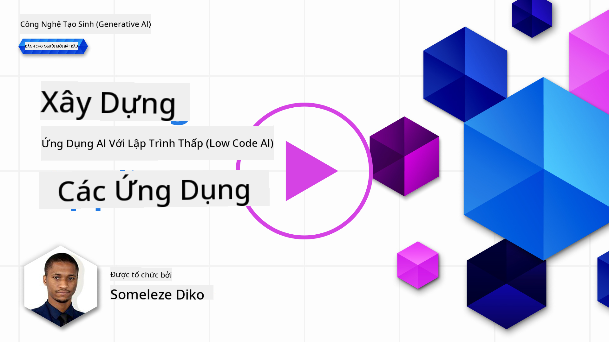
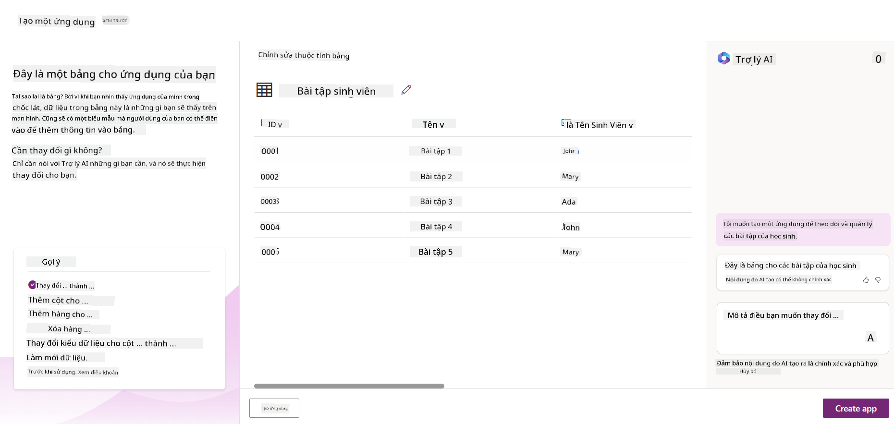
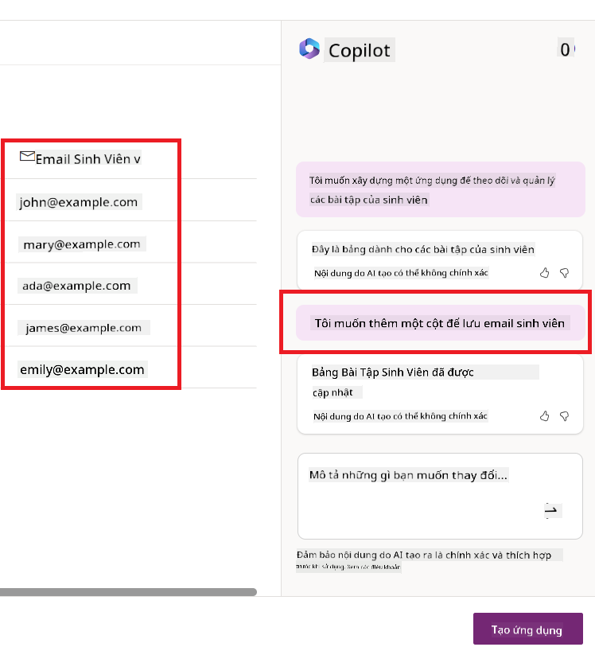
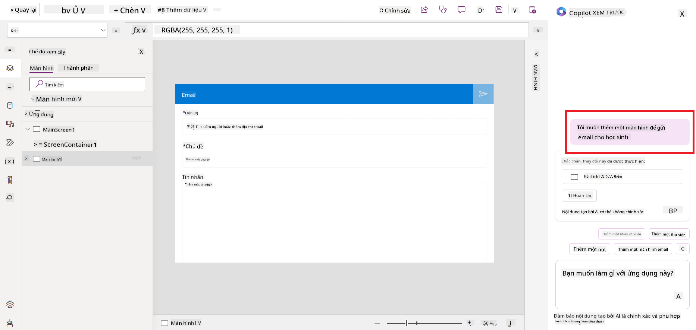

<!--
CO_OP_TRANSLATOR_METADATA:
{
  "original_hash": "f5ff3b6204a695a117d6f452403c95f7",
  "translation_date": "2025-06-25T19:04:21+00:00",
  "source_file": "10-building-low-code-ai-applications/README.md",
  "language_code": "vi"
}
-->
# Xây dựng Ứng dụng AI với Mã thấp

> _(Nhấp vào hình ảnh trên để xem video của bài học này)_

## Giới thiệu

Bây giờ chúng ta đã học cách xây dựng các ứng dụng tạo hình ảnh, hãy nói về mã thấp. AI tạo sinh có thể được sử dụng cho nhiều lĩnh vực khác nhau, bao gồm mã thấp, nhưng mã thấp là gì và làm thế nào chúng ta có thể thêm AI vào đó?

Việc xây dựng ứng dụng và giải pháp đã trở nên dễ dàng hơn cho các nhà phát triển truyền thống và không phải là nhà phát triển thông qua việc sử dụng các Nền tảng Phát triển Mã thấp. Các Nền tảng Phát triển Mã thấp cho phép bạn xây dựng ứng dụng và giải pháp với ít hoặc không cần mã. Điều này đạt được bằng cách cung cấp một môi trường phát triển trực quan cho phép bạn kéo và thả các thành phần để xây dựng ứng dụng và giải pháp. Điều này giúp bạn xây dựng ứng dụng và giải pháp nhanh hơn và với ít tài nguyên hơn. Trong bài học này, chúng ta sẽ đi sâu vào cách sử dụng Mã thấp và cách nâng cao phát triển mã thấp với AI bằng cách sử dụng Power Platform.

Power Platform cung cấp cho các tổ chức cơ hội để tăng cường khả năng cho các nhóm của họ để tự xây dựng các giải pháp thông qua một môi trường mã thấp hoặc không mã trực quan. Môi trường này giúp đơn giản hóa quá trình xây dựng giải pháp. Với Power Platform, các giải pháp có thể được xây dựng trong vài ngày hoặc tuần thay vì tháng hoặc năm. Power Platform bao gồm năm sản phẩm chính: Power Apps, Power Automate, Power BI, Power Pages và Copilot Studio.

Bài học này bao gồm:

- Giới thiệu về AI tạo sinh trong Power Platform
- Giới thiệu về Copilot và cách sử dụng nó
- Sử dụng AI tạo sinh để xây dựng ứng dụng và luồng trong Power Platform
- Hiểu các Mô hình AI trong Power Platform với AI Builder

## Mục tiêu Học tập

Cuối bài học này, bạn sẽ có thể:

- Hiểu cách Copilot hoạt động trong Power Platform.

- Xây dựng một ứng dụng Theo dõi Bài tập Sinh viên cho công ty khởi nghiệp giáo dục của chúng tôi.

- Xây dựng một Luồng Xử lý Hóa đơn sử dụng AI để trích xuất thông tin từ hóa đơn.

- Áp dụng các thực hành tốt nhất khi sử dụng Mô hình AI Tạo Văn bản với GPT.

Các công cụ và công nghệ mà bạn sẽ sử dụng trong bài học này là:

- **Power Apps**, cho ứng dụng Theo dõi Bài tập Sinh viên, cung cấp một môi trường phát triển mã thấp để xây dựng ứng dụng theo dõi, quản lý và tương tác với dữ liệu.

- **Dataverse**, để lưu trữ dữ liệu cho ứng dụng Theo dõi Bài tập Sinh viên nơi Dataverse sẽ cung cấp một nền tảng dữ liệu mã thấp để lưu trữ dữ liệu của ứng dụng.

- **Power Automate**, cho luồng Xử lý Hóa đơn nơi bạn sẽ có môi trường phát triển mã thấp để xây dựng các quy trình tự động hóa quy trình Xử lý Hóa đơn.

- **AI Builder**, cho Mô hình AI Xử lý Hóa đơn nơi bạn sẽ sử dụng các Mô hình AI đã được xây dựng sẵn để xử lý hóa đơn cho công ty khởi nghiệp của chúng tôi.

## AI tạo sinh trong Power Platform

Nâng cao phát triển và ứng dụng mã thấp với AI tạo sinh là một khu vực trọng tâm chính cho Power Platform. Mục tiêu là cho phép mọi người xây dựng ứng dụng, trang web, bảng điều khiển có sức mạnh AI và tự động hóa quy trình với AI, _mà không cần yêu cầu bất kỳ chuyên môn khoa học dữ liệu nào_. Mục tiêu này đạt được bằng cách tích hợp AI tạo sinh vào trải nghiệm phát triển mã thấp trong Power Platform dưới dạng Copilot và AI Builder.

### Điều này hoạt động như thế nào?

Copilot là một trợ lý AI cho phép bạn xây dựng các giải pháp Power Platform bằng cách mô tả yêu cầu của bạn trong một loạt các bước đối thoại sử dụng ngôn ngữ tự nhiên. Bạn có thể, ví dụ, hướng dẫn trợ lý AI của bạn để chỉ ra những trường mà ứng dụng của bạn sẽ sử dụng và nó sẽ tạo cả ứng dụng và mô hình dữ liệu cơ bản hoặc bạn có thể chỉ định cách thiết lập một luồng trong Power Automate.

Bạn có thể sử dụng các chức năng được điều khiển bởi Copilot như một tính năng trong màn hình ứng dụng của bạn để cho phép người dùng khám phá thông tin thông qua các tương tác đối thoại.

AI Builder là một khả năng AI mã thấp có sẵn trong Power Platform cho phép bạn sử dụng các Mô hình AI để giúp bạn tự động hóa quy trình và dự đoán kết quả. Với AI Builder, bạn có thể đưa AI vào ứng dụng và luồng của bạn kết nối với dữ liệu của bạn trong Dataverse hoặc trong các nguồn dữ liệu đám mây khác nhau, như SharePoint, OneDrive hoặc Azure.

Copilot có sẵn trong tất cả các sản phẩm của Power Platform: Power Apps, Power Automate, Power BI, Power Pages và Power Virtual Agents. AI Builder có sẵn trong Power Apps và Power Automate. Trong bài học này, chúng ta sẽ tập trung vào cách sử dụng Copilot và AI Builder trong Power Apps và Power Automate để xây dựng một giải pháp cho công ty khởi nghiệp giáo dục của chúng tôi.

### Copilot trong Power Apps

Là một phần của Power Platform, Power Apps cung cấp một môi trường phát triển mã thấp để xây dựng các ứng dụng theo dõi, quản lý và tương tác với dữ liệu. Đây là một bộ dịch vụ phát triển ứng dụng với một nền tảng dữ liệu có khả năng mở rộng và khả năng kết nối với các dịch vụ đám mây và dữ liệu tại chỗ. Power Apps cho phép bạn xây dựng các ứng dụng chạy trên trình duyệt, máy tính bảng và điện thoại, và có thể được chia sẻ với đồng nghiệp. Power Apps giúp người dùng bắt đầu phát triển ứng dụng với một giao diện đơn giản, để mọi người dùng doanh nghiệp hoặc nhà phát triển chuyên nghiệp có thể xây dựng các ứng dụng tùy chỉnh. Trải nghiệm phát triển ứng dụng cũng được nâng cao với AI Tạo Sinh thông qua Copilot.

Tính năng trợ lý AI Copilot trong Power Apps cho phép bạn mô tả loại ứng dụng bạn cần và thông tin bạn muốn ứng dụng của mình theo dõi, thu thập hoặc hiển thị. Copilot sau đó sẽ tạo ra một ứng dụng Canvas đáp ứng dựa trên mô tả của bạn. Bạn có thể tùy chỉnh ứng dụng để đáp ứng nhu cầu của mình. AI Copilot cũng tạo ra và đề xuất một Bảng Dataverse với các trường bạn cần để lưu trữ dữ liệu bạn muốn theo dõi và một số dữ liệu mẫu. Chúng ta sẽ xem xét Dataverse là gì và cách bạn có thể sử dụng nó trong Power Apps trong bài học này sau. Bạn có thể tùy chỉnh bảng để đáp ứng nhu cầu của mình bằng cách sử dụng tính năng trợ lý AI Copilot thông qua các bước đối thoại. Tính năng này có sẵn ngay từ màn hình chính của Power Apps.

### Copilot trong Power Automate

Là một phần của Power Platform, Power Automate cho phép người dùng tạo các quy trình tự động giữa các ứng dụng và dịch vụ. Nó giúp tự động hóa các quy trình kinh doanh lặp đi lặp lại như giao tiếp, thu thập dữ liệu và phê duyệt quyết định. Giao diện đơn giản của nó cho phép người dùng với mọi trình độ kỹ thuật (từ người mới bắt đầu đến nhà phát triển dày dạn) tự động hóa các nhiệm vụ công việc. Trải nghiệm phát triển quy trình làm việc cũng được nâng cao với AI Tạo Sinh thông qua Copilot.

Tính năng trợ lý AI Copilot trong Power Automate cho phép bạn mô tả loại luồng bạn cần và các hành động bạn muốn luồng của bạn thực hiện. Copilot sau đó sẽ tạo ra một luồng dựa trên mô tả của bạn. Bạn có thể tùy chỉnh luồng để đáp ứng nhu cầu của mình. AI Copilot cũng tạo ra và đề xuất các hành động bạn cần để thực hiện nhiệm vụ bạn muốn tự động hóa. Chúng ta sẽ xem xét luồng là gì và cách bạn có thể sử dụng chúng trong Power Automate trong bài học này sau. Bạn có thể tùy chỉnh các hành động để đáp ứng nhu cầu của mình bằng cách sử dụng tính năng trợ lý AI Copilot thông qua các bước đối thoại. Tính năng này có sẵn ngay từ màn hình chính của Power Automate.

## Bài tập: Quản lý bài tập sinh viên và hóa đơn cho công ty khởi nghiệp của chúng tôi, sử dụng Copilot

Công ty khởi nghiệp của chúng tôi cung cấp các khóa học trực tuyến cho sinh viên. Công ty đã phát triển nhanh chóng và hiện đang gặp khó khăn trong việc đáp ứng nhu cầu cho các khóa học của mình. Công ty đã thuê bạn làm nhà phát triển Power Platform để giúp họ xây dựng một giải pháp mã thấp để giúp họ quản lý bài tập sinh viên và hóa đơn. Giải pháp của họ nên có khả năng giúp họ theo dõi và quản lý bài tập sinh viên thông qua một ứng dụng và tự động hóa quy trình xử lý hóa đơn thông qua một luồng công việc. Bạn đã được yêu cầu sử dụng AI tạo sinh để phát triển giải pháp.

Khi bạn bắt đầu sử dụng Copilot, bạn có thể sử dụng [Thư viện Gợi ý Copilot Power Platform](https://github.com/pnp/powerplatform-prompts?WT.mc_id=academic-109639-somelezediko) để bắt đầu với các gợi ý. Thư viện này chứa danh sách các gợi ý mà bạn có thể sử dụng để xây dựng ứng dụng và luồng với Copilot. Bạn cũng có thể sử dụng các gợi ý trong thư viện để có ý tưởng về cách mô tả yêu cầu của bạn cho Copilot.

### Xây dựng Ứng dụng Theo dõi Bài tập Sinh viên cho Công ty Khởi nghiệp của Chúng tôi

Các nhà giáo dục tại công ty khởi nghiệp của chúng tôi đã gặp khó khăn trong việc theo dõi bài tập sinh viên. Họ đã sử dụng bảng tính để theo dõi bài tập nhưng điều này đã trở nên khó quản lý khi số lượng sinh viên tăng lên. Họ đã yêu cầu bạn xây dựng một ứng dụng sẽ giúp họ theo dõi và quản lý bài tập sinh viên. Ứng dụng nên cho phép họ thêm bài tập mới, xem bài tập, cập nhật bài tập và xóa bài tập. Ứng dụng cũng nên cho phép các nhà giáo dục và sinh viên xem các bài tập đã được chấm điểm và những bài chưa được chấm điểm.

Bạn sẽ xây dựng ứng dụng bằng cách sử dụng Copilot trong Power Apps theo các bước dưới đây:

1. Điều hướng đến màn hình chính của [Power Apps](https://make.powerapps.com?WT.mc_id=academic-105485-koreyst).

1. Sử dụng khu vực văn bản trên màn hình chính để mô tả ứng dụng bạn muốn xây dựng. Ví dụ, **_Tôi muốn xây dựng một ứng dụng để theo dõi và quản lý bài tập sinh viên_**. Nhấp vào nút **Gửi** để gửi gợi ý đến AI Copilot.

1. AI Copilot sẽ đề xuất một Bảng Dataverse với các trường bạn cần để lưu trữ dữ liệu bạn muốn theo dõi và một số dữ liệu mẫu. Bạn có thể tùy chỉnh bảng để đáp ứng nhu cầu của mình bằng cách sử dụng tính năng trợ lý AI Copilot thông qua các bước đối thoại.

   > **Quan trọng**: Dataverse là nền tảng dữ liệu cơ bản cho Power Platform. Đây là một nền tảng dữ liệu mã thấp để lưu trữ dữ liệu của ứng dụng. Đây là một dịch vụ được quản lý hoàn toàn lưu trữ dữ liệu một cách an toàn trong Đám mây Microsoft và được cung cấp trong môi trường Power Platform của bạn. Nó đi kèm với các khả năng quản trị dữ liệu tích hợp sẵn, chẳng hạn như phân loại dữ liệu, dòng dõi dữ liệu, kiểm soát truy cập chi tiết và hơn thế nữa. Bạn có thể tìm hiểu thêm về Dataverse [tại đây](https://docs.microsoft.com/powerapps/maker/data-platform/data-platform-intro?WT.mc_id=academic-109639-somelezediko).

   

1. Các nhà giáo dục muốn gửi email cho sinh viên đã nộp bài tập của họ để cập nhật cho họ về tiến độ của bài tập. Bạn có thể sử dụng Copilot để thêm một trường mới vào bảng để lưu trữ email của sinh viên. Ví dụ, bạn có thể sử dụng gợi ý sau để thêm một trường mới vào bảng: **_Tôi muốn thêm một cột để lưu trữ email của sinh viên_**. Nhấp vào nút **Gửi** để gửi gợi ý đến AI Copilot.

1. AI Copilot sẽ tạo ra một trường mới và bạn có thể tùy chỉnh trường để đáp ứng nhu cầu của mình.

1. Khi bạn đã hoàn tất với bảng, nhấp vào nút **Tạo ứng dụng** để tạo ứng dụng.

1. AI Copilot sẽ tạo ra một ứng dụng Canvas đáp ứng dựa trên mô tả của bạn. Bạn có thể tùy chỉnh ứng dụng để đáp ứng nhu cầu của mình.

1. Để các nhà giáo dục gửi email cho sinh viên, bạn có thể sử dụng Copilot để thêm một màn hình mới vào ứng dụng. Ví dụ, bạn có thể sử dụng gợi ý sau để thêm một màn hình mới vào ứng dụng: **_Tôi muốn thêm một màn hình để gửi email cho sinh viên_**. Nhấp vào nút **Gửi** để gửi gợi ý đến AI Copilot.

1. AI Copilot sẽ tạo ra một màn hình mới và bạn có thể tùy chỉnh màn hình để đáp ứng nhu cầu của mình.

1. Khi bạn đã hoàn tất với ứng dụng, nhấp vào nút **Lưu** để lưu ứng dụng.

1. Để chia sẻ ứng dụng với các nhà giáo dục, nhấp vào nút **Chia sẻ** và sau đó nhấp vào nút **Chia sẻ** một lần nữa. Bạn có thể chia sẻ ứng dụng với các nhà giáo dục bằng cách nhập địa chỉ email của họ.

> **Bài tập về nhà của bạn**: Ứng dụng bạn vừa xây dựng là một khởi đầu tốt nhưng có thể được cải thiện. Với tính năng email, các nhà giáo dục chỉ có thể gửi email cho sinh viên thủ công bằng cách phải nhập email của họ. Bạn có thể sử dụng Copilot để xây dựng một tự động hóa sẽ cho phép các nhà giáo dục gửi email cho sinh viên tự động khi họ nộp bài tập không? Gợi ý của bạn là với gợi ý đúng, bạn có thể sử dụng Copilot trong Power Automate để xây dựng điều này.

### Xây dựng Bảng Thông tin Hóa đơn cho Công ty Khởi nghiệp của Chúng tôi

Đội ngũ tài chính của công ty khởi nghiệp của chúng tôi đã gặp khó khăn trong việc theo dõi hóa đơn. Họ đã sử dụng bảng tính để theo dõi hóa đơn nhưng điều này đã trở nên khó quản lý khi số lượng hóa đơn tăng lên. Họ đã yêu cầu bạn xây dựng một bảng sẽ giúp họ lưu trữ, theo dõi và quản lý thông tin của các hóa đơn họ nhận được. Bảng nên được sử dụng để xây dựng một tự động hóa sẽ trích xuất tất cả thông tin hóa đơn và lưu trữ nó trong bảng. Bảng cũng nên cho phép đội ngũ tài chính xem các hóa đơn đã được thanh toán và những hóa đơn chưa được thanh toán.

Power Platform có một nền tảng dữ liệu cơ bản gọi là Dataverse cho phép bạn lưu trữ dữ liệu cho các ứng dụng và giải pháp của bạn. Dataverse cung cấp một nền tảng dữ liệu mã thấp để lưu trữ dữ liệu của ứng dụng. Đây là một dịch vụ được quản lý hoàn toàn lưu trữ dữ liệu một cách an toàn trong Đám mây Microsoft và được cung cấp trong môi trường Power Platform của bạn. Nó đi kèm với các khả năng quản trị dữ liệu tích hợp sẵn, chẳng hạn như phân loại dữ liệu, dòng dõi dữ liệu, kiểm soát truy cập chi tiết và hơn thế nữa. Bạn có thể tìm hiểu thêm [về Dataverse tại đây](https://docs.microsoft.com/powerapps/maker/data-platform/data-platform-intro?WT.mc_id=academic-109639-somelezediko).

Tại sao chúng ta nên sử dụng Dataverse cho công ty khởi nghiệp của mình? Các bảng tiêu chuẩn và tùy chỉnh trong Dataverse cung cấp một tùy chọn lưu trữ an toàn và dựa trên đám mây cho dữ liệu của bạn. Các bảng cho phép bạn lưu trữ các loại dữ liệu khác nhau, tương tự như cách bạn có thể sử dụng nhiều bảng tính trong một sổ làm việc Excel duy nhất. Bạn có thể sử dụng các bảng để lưu trữ dữ liệu cụ thể cho tổ chức hoặc nhu cầu kinh doanh của bạn. Một số lợi ích mà công ty khởi nghiệp của chúng tôi sẽ nhận được từ việc sử dụng Dataverse bao gồm nhưng không giới hạn ở:

- **Dễ quản lý**: Cả siêu dữ liệu và dữ liệu đều được lưu trữ trên đám mây, vì vậy bạn không cần lo lắng về các chi tiết của cách chúng được lưu trữ hoặc quản lý. Bạn có thể tập trung vào việc xây dựng các ứng dụng và giải pháp của mình.

- **An toàn**: Dataverse cung cấp một tùy chọn lưu trữ an toàn và dựa trên đám mây cho dữ liệu của bạn. Bạn có thể kiểm soát ai có quyền truy cập vào dữ liệu trong các bảng của bạn và cách họ có thể truy cập nó bằng cách sử dụng bảo mật dựa trên vai trò.

- **Siêu dữ liệu phong phú**: Các loại dữ liệu và mối quan hệ được sử dụng trực tiếp trong Power Apps

- **Logic và xác thực**: Bạn có thể sử dụng các
- **Phân Tích Cảm Xúc**: Mô hình này phát hiện cảm xúc tích cực, tiêu cực, trung tính hoặc hỗn hợp trong văn bản.
- **Trình Đọc Danh Thiếp**: Mô hình này trích xuất thông tin từ danh thiếp.
- **Nhận Dạng Văn Bản**: Mô hình này trích xuất văn bản từ hình ảnh.
- **Phát Hiện Đối Tượng**: Mô hình này phát hiện và trích xuất đối tượng từ hình ảnh.
- **Xử Lý Tài Liệu**: Mô hình này trích xuất thông tin từ biểu mẫu.
- **Xử Lý Hóa Đơn**: Mô hình này trích xuất thông tin từ hóa đơn.

Với các Mô Hình AI Tùy Chỉnh, bạn có thể mang mô hình của riêng mình vào AI Builder để nó có thể hoạt động như bất kỳ mô hình tùy chỉnh nào của AI Builder, cho phép bạn huấn luyện mô hình bằng dữ liệu của riêng bạn. Bạn có thể sử dụng các mô hình này để tự động hóa quy trình và dự đoán kết quả trong cả Power Apps và Power Automate. Khi sử dụng mô hình của riêng bạn, có một số hạn chế áp dụng. Đọc thêm về những [hạn chế này](https://learn.microsoft.com/ai-builder/byo-model#limitations?WT.mc_id=academic-105485-koreyst).

## Bài Tập #2 - Xây dựng Quy Trình Xử Lý Hóa Đơn cho Startup của Chúng Tôi

Nhóm tài chính đang gặp khó khăn trong việc xử lý hóa đơn. Họ đã sử dụng bảng tính để theo dõi hóa đơn nhưng việc này trở nên khó quản lý khi số lượng hóa đơn tăng lên. Họ đã yêu cầu bạn xây dựng một quy trình làm việc giúp họ xử lý hóa đơn bằng AI. Quy trình làm việc nên cho phép họ trích xuất thông tin từ hóa đơn và lưu thông tin vào bảng Dataverse. Quy trình làm việc cũng nên cho phép họ gửi email cho nhóm tài chính với thông tin đã trích xuất.

Bây giờ bạn đã biết AI Builder là gì và tại sao bạn nên sử dụng nó, hãy xem cách bạn có thể sử dụng Mô Hình AI Xử Lý Hóa Đơn trong AI Builder, mà chúng ta đã đề cập trước đó, để xây dựng một quy trình làm việc giúp nhóm tài chính xử lý hóa đơn. Để xây dựng một quy trình làm việc giúp nhóm tài chính xử lý hóa đơn bằng Mô Hình AI Xử Lý Hóa Đơn trong AI Builder, hãy làm theo các bước sau:

1. Điều hướng đến màn hình chính của [Power Automate](https://make.powerautomate.com?WT.mc_id=academic-105485-koreyst).
2. Sử dụng vùng văn bản trên màn hình chính để mô tả quy trình làm việc bạn muốn xây dựng. Ví dụ, **_Xử lý một hóa đơn khi nó đến trong hộp thư của tôi_**. Nhấn vào nút **Gửi** để gửi yêu cầu đến AI Copilot.
3. AI Copilot sẽ đề xuất các hành động bạn cần thực hiện để tự động hóa nhiệm vụ bạn muốn. Bạn có thể nhấn vào nút **Tiếp theo** để đi qua các bước tiếp theo.
4. Ở bước tiếp theo, Power Automate sẽ yêu cầu bạn thiết lập các kết nối cần thiết cho luồng. Khi bạn hoàn thành, nhấn vào nút **Tạo luồng** để tạo luồng.
5. AI Copilot sẽ tạo ra một luồng và bạn có thể tùy chỉnh luồng để đáp ứng nhu cầu của bạn.
6. Cập nhật kích hoạt của luồng và đặt **Thư mục** vào thư mục nơi hóa đơn sẽ được lưu trữ. Ví dụ, bạn có thể đặt thư mục là **Hộp thư đến**. Nhấn vào **Hiển thị các tùy chọn nâng cao** và đặt **Chỉ với Tệp đính kèm** thành **Có**. Điều này sẽ đảm bảo rằng luồng chỉ chạy khi một email với tệp đính kèm được nhận trong thư mục.
7. Loại bỏ các hành động sau khỏi luồng: **HTML to text**, **Compose**, **Compose 2**, **Compose 3** và **Compose 4** vì bạn sẽ không sử dụng chúng.
8. Loại bỏ hành động **Điều kiện** khỏi luồng vì bạn sẽ không sử dụng nó. Nó nên trông như hình ảnh sau:
9. Nhấn vào nút **Thêm một hành động** và tìm kiếm **Dataverse**. Chọn hành động **Thêm một hàng mới**.
10. Trên hành động **Trích xuất Thông tin từ hóa đơn**, cập nhật **Tệp Hóa Đơn** để trỏ đến **Nội dung Tệp đính kèm** từ email. Điều này sẽ đảm bảo rằng luồng trích xuất thông tin từ tệp đính kèm hóa đơn.
11. Chọn **Bảng** bạn đã tạo trước đó. Ví dụ, bạn có thể chọn bảng **Thông tin Hóa Đơn**. Chọn nội dung động từ hành động trước đó để điền vào các trường sau:
    - ID
    - Số tiền
    - Ngày
    - Tên
    - Trạng thái
    - Đặt **Trạng thái** thành **Chờ xử lý**.
    - Email Nhà cung cấp
    - Sử dụng nội dung động **Từ** từ kích hoạt **Khi một email mới đến**.
12. Khi bạn hoàn thành với luồng, nhấn vào nút **Lưu** để lưu luồng. Bạn có thể kiểm tra luồng bằng cách gửi một email với hóa đơn đến thư mục bạn đã chỉ định trong kích hoạt.

> **Bài tập về nhà của bạn**: Luồng bạn vừa xây dựng là một khởi đầu tốt, bây giờ bạn cần suy nghĩ cách bạn có thể xây dựng một tự động hóa cho phép nhóm tài chính của chúng ta gửi email cho nhà cung cấp để cập nhật họ với trạng thái hiện tại của hóa đơn của họ. Gợi ý của bạn: luồng phải chạy khi trạng thái của hóa đơn thay đổi.

## Sử Dụng Mô Hình AI Tạo Văn Bản trong Power Automate

Mô Hình AI Tạo Văn Bản với GPT trong AI Builder cho phép bạn tạo văn bản dựa trên một yêu cầu và được hỗ trợ bởi Dịch vụ Microsoft Azure OpenAI. Với khả năng này, bạn có thể tích hợp công nghệ GPT (Generative Pre-Trained Transformer) vào các ứng dụng và luồng của mình để xây dựng nhiều luồng tự động và ứng dụng thông minh.

Các mô hình GPT được đào tạo rộng rãi trên lượng dữ liệu lớn, cho phép chúng tạo ra văn bản gần giống với ngôn ngữ của con người khi được cung cấp một yêu cầu. Khi được tích hợp với tự động hóa quy trình làm việc, các mô hình AI như GPT có thể được sử dụng để tối ưu hóa và tự động hóa nhiều nhiệm vụ khác nhau.

Ví dụ, bạn có thể xây dựng các luồng để tự động tạo văn bản cho nhiều trường hợp sử dụng, như: bản nháp email, mô tả sản phẩm, và nhiều hơn nữa. Bạn cũng có thể sử dụng mô hình để tạo văn bản cho nhiều ứng dụng, như chatbot và ứng dụng dịch vụ khách hàng, giúp các đại lý dịch vụ khách hàng phản hồi hiệu quả và nhanh chóng đối với các yêu cầu của khách hàng.

Để tìm hiểu cách sử dụng Mô Hình AI này trong Power Automate, hãy tham khảo module [Thêm trí tuệ với AI Builder và GPT](https://learn.microsoft.com/training/modules/ai-builder-text-generation/?WT.mc_id=academic-109639-somelezediko).

## Làm Tốt Lắm! Tiếp Tục Học Tập

Sau khi hoàn thành bài học này, hãy xem bộ sưu tập [Học Tập AI Tạo Sinh](https://aka.ms/genai-collection?WT.mc_id=academic-105485-koreyst) của chúng tôi để tiếp tục nâng cao kiến thức về AI Tạo Sinh của bạn!

Hãy chuyển sang Bài Học 11, nơi chúng ta sẽ xem xét cách [tích hợp AI Tạo Sinh với Gọi Hàm](../11-integrating-with-function-calling/README.md?WT.mc_id=academic-105485-koreyst)!

**Tuyên bố miễn trừ trách nhiệm**:  
Tài liệu này đã được dịch bằng dịch vụ dịch thuật AI [Co-op Translator](https://github.com/Azure/co-op-translator). Mặc dù chúng tôi cố gắng đảm bảo độ chính xác, xin lưu ý rằng các bản dịch tự động có thể chứa lỗi hoặc không chính xác. Tài liệu gốc bằng ngôn ngữ bản địa nên được coi là nguồn thông tin chính thức. Đối với thông tin quan trọng, khuyến nghị sử dụng dịch vụ dịch thuật chuyên nghiệp của con người. Chúng tôi không chịu trách nhiệm cho bất kỳ sự hiểu lầm hoặc diễn giải sai nào phát sinh từ việc sử dụng bản dịch này.