# Xây dựng ứng dụng AI mã thấp  

[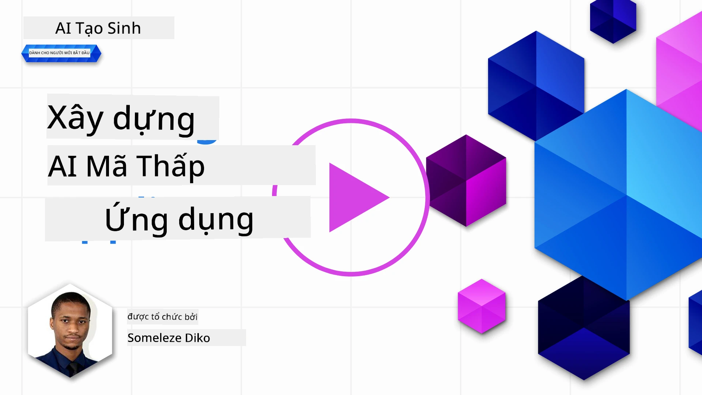](https://youtu.be/1vzq3Nd8GBA?si=h6LHWJXdmqf6mhDg)  

> _(Nhấp vào hình ảnh trên để xem video bài học này)_  

## Giới thiệu  

Bây giờ chúng ta đã học cách xây dựng các ứng dụng tạo hình ảnh, hãy nói về mã thấp. AI tạo sinh có thể được sử dụng cho nhiều lĩnh vực khác nhau bao gồm mã thấp, nhưng mã thấp là gì và làm thế nào chúng ta có thể thêm AI vào nó?  

Xây dựng các ứng dụng và giải pháp đã trở nên dễ dàng hơn cho cả các nhà phát triển truyền thống và những người không phải lập trình viên thông qua việc sử dụng Nền tảng Phát triển Mã Thấp. Nền tảng Phát triển Mã Thấp cho phép bạn xây dựng các ứng dụng và giải pháp với ít hoặc không cần mã. Điều này được thực hiện bằng cách cung cấp một môi trường phát triển trực quan cho phép bạn kéo và thả các thành phần để xây dựng ứng dụng và giải pháp. Điều này giúp bạn xây dựng ứng dụng và giải pháp nhanh hơn và với ít tài nguyên hơn. Trong bài học này, chúng ta sẽ đi sâu vào cách sử dụng mã thấp và cách nâng cao phát triển mã thấp với AI sử dụng Power Platform.  

Power Platform cung cấp cho các tổ chức cơ hội để trao quyền cho các nhóm của họ xây dựng các giải pháp riêng thông qua môi trường mã thấp hoặc không có mã rất trực quan. Môi trường này giúp đơn giản hóa quy trình xây dựng giải pháp. Với Power Platform, giải pháp có thể được xây dựng trong vài ngày hoặc vài tuần thay vì trong nhiều tháng hoặc năm. Power Platform gồm có năm sản phẩm chính: Power Apps, Power Automate, Power BI, Power Pages và Copilot Studio.  

Bài học này bao gồm:  

- Giới thiệu về AI tạo sinh trong Power Platform  
- Giới thiệu về Copilot và cách sử dụng  
- Sử dụng AI tạo sinh để xây dựng ứng dụng và luồng trong Power Platform  
- Hiểu về các mô hình AI trong Power Platform với AI Builder  
- Xây dựng các đại lý thông minh với Microsoft Copilot Studio  

## Mục tiêu học tập  

Sau bài học này, bạn sẽ có thể:  

- Hiểu cách hoạt động của Copilot trong Power Platform.  

- Xây dựng một ứng dụng theo dõi giao bài cho sinh viên cho startup giáo dục của chúng ta.  

- Xây dựng một luồng xử lý hóa đơn sử dụng AI để trích xuất thông tin từ hóa đơn.  

- Áp dụng các thực tiễn tốt nhất khi sử dụng mô hình AI Create Text with GPT.  

- Hiểu Microsoft Copilot Studio là gì và cách xây dựng các đại lý thông minh với nó.  

Các công cụ và công nghệ bạn sẽ sử dụng trong bài học này là:  

- **Power Apps**, cho ứng dụng theo dõi giao bài cho sinh viên, cung cấp môi trường phát triển mã thấp để xây dựng ứng dụng theo dõi, quản lý và tương tác với dữ liệu.  

- **Dataverse**, để lưu trữ dữ liệu cho ứng dụng theo dõi giao bài, trong đó Dataverse sẽ cung cấp nền tảng dữ liệu mã thấp để lưu trữ dữ liệu của ứng dụng.  

- **Power Automate**, cho luồng xử lý hóa đơn, nơi bạn sẽ có môi trường phát triển mã thấp để xây dựng các quy trình tự động hóa quy trình xử lý hóa đơn.  

- **AI Builder**, cho mô hình AI xử lý hóa đơn, nơi bạn sẽ sử dụng các mô hình AI có sẵn để xử lý hóa đơn cho startup của chúng ta.  

## AI tạo sinh trong Power Platform  

Nâng cao phát triển mã thấp và ứng dụng với AI tạo sinh là một lĩnh vực trọng tâm chính cho Power Platform. Mục tiêu là giúp mọi người xây dựng các ứng dụng, trang web, bảng điều khiển có AI và tự động hóa quy trình với AI, _không cần chuyên môn khoa học dữ liệu_. Mục tiêu này đạt được bằng cách tích hợp AI tạo sinh vào trải nghiệm phát triển mã thấp trong Power Platform dưới dạng Copilot và AI Builder.  

### Điều này hoạt động như thế nào?  

Copilot là trợ lý AI cho phép bạn xây dựng các giải pháp Power Platform bằng cách mô tả yêu cầu của bạn qua một chuỗi các bước hội thoại sử dụng ngôn ngữ tự nhiên. Ví dụ, bạn có thể chỉ dẫn trợ lý AI của mình nói ra các trường sử dụng trong ứng dụng và nó sẽ tạo ra cả ứng dụng và mô hình dữ liệu nền tảng hoặc bạn có thể xác định cách thiết lập một luồng trong Power Automate.  

Bạn có thể sử dụng các chức năng do Copilot điều khiển như một tính năng trên màn hình ứng dụng để cho phép người dùng khám phá các thông tin qua tương tác trò chuyện.  

AI Builder là chức năng AI mã thấp có sẵn trong Power Platform, cho phép bạn sử dụng các Mô hình AI giúp tự động hóa quy trình và dự đoán kết quả. Với AI Builder, bạn có thể đưa AI vào ứng dụng và luồng của mình kết nối với dữ liệu trong Dataverse hoặc trong nhiều nguồn dữ liệu đám mây khác nhau, như SharePoint, OneDrive hoặc Azure.  

Copilot có sẵn trong tất cả các sản phẩm của Power Platform: Power Apps, Power Automate, Power BI, Power Pages và Copilot Studio (trước là Power Virtual Agents). AI Builder có trong Power Apps và Power Automate. Trong bài học này, chúng ta sẽ tập trung vào cách sử dụng Copilot và AI Builder trong Power Apps và Power Automate để xây dựng giải pháp cho startup giáo dục của chúng ta.  

### Copilot trong Power Apps  

Là một phần của Power Platform, Power Apps cung cấp môi trường phát triển mã thấp để xây dựng ứng dụng theo dõi, quản lý và tương tác với dữ liệu. Đây là bộ dịch vụ phát triển ứng dụng với nền tảng dữ liệu mở rộng và khả năng kết nối với dịch vụ đám mây và dữ liệu tại chỗ. Power Apps cho phép bạn xây dựng ứng dụng chạy trên trình duyệt, máy tính bảng, điện thoại và có thể chia sẻ với đồng nghiệp. Power Apps giúp người dùng tiếp cận phát triển ứng dụng với giao diện đơn giản, để mọi người dùng doanh nghiệp hoặc nhà phát triển chuyên nghiệp đều có thể xây dựng ứng dụng tuỳ chỉnh. Trải nghiệm phát triển ứng dụng cũng được tăng cường nhờ AI tạo sinh thông qua Copilot.  

Tính năng trợ lý AI Copilot trong Power Apps cho phép bạn mô tả loại ứng dụng cần có và thông tin bạn muốn ứng dụng theo dõi, thu thập hoặc hiển thị. Copilot sau đó tạo ra một ứng dụng Canvas phản hồi dựa trên mô tả của bạn. Bạn có thể tuỳ chỉnh ứng dụng để đáp ứng nhu cầu của mình. AI Copilot cũng tạo và gợi ý một Bảng Dataverse với các trường cần thiết để lưu trữ dữ liệu bạn muốn theo dõi cùng với vài dữ liệu mẫu. Trong bài học này, chúng ta sẽ xem xét Dataverse là gì và cách bạn có thể sử dụng nó trong Power Apps. Bạn có thể tuỳ chỉnh bảng theo nhu cầu của mình bằng tính năng trợ lý AI Copilot qua các bước hội thoại. Tính năng này có sẵn ngay trên màn hình chính Power Apps.  

### Copilot trong Power Automate  

Là một phần của Power Platform, Power Automate cho phép người dùng tạo các luồng công việc tự động giữa các ứng dụng và dịch vụ. Nó giúp tự động hoá các quy trình kinh doanh lặp lại như giao tiếp, thu thập dữ liệu và phê duyệt quyết định. Giao diện đơn giản cho phép người dùng ở mọi trình độ kỹ thuật (từ người mới đến nhà phát triển chuyên nghiệp) tự động hoá các công việc. Trải nghiệm phát triển luồng cũng được nâng cao nhờ AI tạo sinh thông qua Copilot.  

Tính năng trợ lý AI Copilot trong Power Automate cho phép bạn mô tả loại luồng bạn cần và các hành động bạn muốn luồng thực hiện. Copilot sẽ tạo ra một luồng dựa trên mô tả của bạn. Bạn có thể tuỳ chỉnh luồng để đáp ứng nhu cầu. AI Copilot cũng tạo và gợi ý các hành động cần thiết để thực hiện nhiệm vụ bạn muốn tự động hoá. Trong bài học này, chúng ta sẽ xem luồng là gì và cách sử dụng chúng trong Power Automate. Bạn có thể tuỳ chỉnh các hành động theo nhu cầu của mình bằng tính năng trợ lý AI Copilot qua các bước hội thoại. Tính năng này có sẵn ngay trên màn hình chính Power Automate.  

## Xây dựng các đại lý thông minh với Microsoft Copilot Studio  

[Microsoft Copilot Studio](https://learn.microsoft.com/microsoft-copilot-studio/fundamentals-what-is-copilot-studio?WT.mc_id=academic-105485-koreyst) (trước đây là Power Virtual Agents) là thành viên mã thấp của Power Platform để xây dựng **đại lý AI** — các copilots hội thoại có thể trả lời câu hỏi, thực thi hành động và tự động hóa công việc thay cho người dùng. Giống như các phần còn lại của Power Platform, bạn xây dựng các đại lý này trong trải nghiệm trực quan, ưu tiên ngôn ngữ tự nhiên: bạn mô tả bạn muốn đại lý làm gì, và Copilot Studio hỗ trợ xây dựng các hướng dẫn, kiến thức và hành động cho đại lý.  

Với startup giáo dục của chúng ta, bạn có thể xây dựng đại lý trả lời câu hỏi của sinh viên về các khóa học, kiểm tra hạn nộp bài và thậm chí gửi email cho giảng viên — tất cả mà không cần viết mã.  

Dưới đây là một số khả năng mới nhất làm cho Copilot Studio mạnh mẽ:  

- **Trả lời tạo sinh từ kiến thức của bạn**. Thay vì tự viết mọi cuộc hội thoại, bạn có thể kết nối **nguồn kiến thức** — trang web công khai, SharePoint, OneDrive, Dataverse, tập tin tải lên, hoặc dữ liệu doanh nghiệp thông qua các kết nối — và đại lý tạo ra câu trả lời dựa trên chúng.  

- **Điều phối tạo sinh**. Thay vì dựa vào các câu lệnh kích hoạt cứng nhắc, đại lý sử dụng AI để hiểu yêu cầu và quyết định linh hoạt kiến thức, chủ đề và hành động cần kết hợp để thực hiện, kể cả kết hợp nhiều bước với nhau.  

- **Hành động và kết nối**. Đại lý có thể *thực hiện* việc chứ không chỉ trò chuyện. Bạn có thể cung cấp cho đại lý các hành động dựa trên hơn 1.500 kết nối có sẵn của Power Platform, luồng Power Automate, API REST tuỳ chỉnh, các gợi ý hoặc máy chủ **Model Context Protocol (MCP)**.  

- **Đại lý tự trị**. Đại lý không chỉ phản hồi trong cửa sổ chat. Bạn có thể xây dựng **đại lý tự trị** được kích hoạt bởi các sự kiện — như email mới, bản ghi mới trong Dataverse, hay tập tin được tải lên — rồi hoạt động nền để hoàn thành công việc.  

- **Điều phối đa đại lý**. Đại lý có thể gọi các đại lý khác. Đại lý Copilot Studio có thể chuyển giao hoặc được mở rộng bởi các đại lý khác, bao gồm đại lý xuất bản cho Microsoft 365 Copilot và đại lý xây dựng trong Microsoft Foundry.  

- **Lựa chọn mô hình**. Ngoài các mô hình tích hợp sẵn, bạn có thể đưa các mô hình từ danh mục mô hình Microsoft Foundry để tùy chỉnh cách đại lý suy luận và phản hồi.  

- **Xuất bản ở mọi nơi**. Sau khi xây dựng, đại lý có thể được xuất bản lên nhiều kênh — Microsoft Teams, Microsoft 365 Copilot, website hoặc ứng dụng tuỳ chỉnh, và nhiều hơn nữa — với bảo mật, xác thực và phân tích được quản lý qua trải nghiệm quản trị Power Platform.  

Bạn có thể bắt đầu xây dựng đại lý đầu tiên của mình tại [copilotstudio.microsoft.com](https://copilotstudio.microsoft.com?WT.mc_id=academic-105485-koreyst) và tìm hiểu thêm trong [tài liệu Microsoft Copilot Studio](https://learn.microsoft.com/microsoft-copilot-studio/?WT.mc_id=academic-105485-koreyst).  

## Bài tập: Quản lý bài tập sinh viên và hóa đơn cho startup của chúng ta, sử dụng Copilot  

Startup của chúng ta cung cấp các khóa học trực tuyến cho sinh viên. Startup đã phát triển nhanh chóng và hiện đang gặp khó khăn trong việc đáp ứng nhu cầu các khóa học. Startup đã thuê bạn làm nhà phát triển Power Platform để giúp họ xây dựng giải pháp mã thấp giúp quản lý bài tập sinh viên và hóa đơn. Giải pháp của họ cần có khả năng theo dõi và quản lý bài tập sinh viên thông qua ứng dụng và tự động hóa quy trình xử lý hóa đơn qua một luồng công việc. Bạn được yêu cầu sử dụng AI tạo sinh để phát triển giải pháp.  

Khi bắt đầu sử dụng Copilot, bạn có thể dùng [Thư viện Gợi ý Power Platform Copilot](https://github.com/pnp/powerplatform-prompts?WT.mc_id=academic-109639-somelezediko) để bắt đầu với các gợi ý. Thư viện này chứa danh sách các gợi ý mà bạn có thể dùng để xây dựng ứng dụng và luồng với Copilot. Bạn cũng có thể dùng các gợi ý trong thư viện để có ý tưởng về cách mô tả yêu cầu với Copilot.  

### Xây dựng ứng dụng theo dõi bài tập sinh viên cho Startup của chúng ta  

Các nhà giáo dục tại startup của chúng ta đang gặp khó khăn trong việc theo dõi bài tập sinh viên. Họ đã sử dụng bảng tính để theo dõi bài tập nhưng điều này trở nên khó quản lý khi số lượng sinh viên tăng lên. Họ đã yêu cầu bạn xây dựng một ứng dụng giúp họ theo dõi và quản lý bài tập sinh viên. Ứng dụng cần cho phép họ thêm bài tập mới, xem bài tập, cập nhật bài tập và xoá bài tập. Ứng dụng cũng nên cho phép giáo viên và sinh viên xem các bài tập đã chấm điểm và chưa chấm điểm.  

Bạn sẽ xây dựng ứng dụng sử dụng Copilot trong Power Apps theo các bước dưới đây:  

1. Truy cập màn hình chính của [Power Apps](https://make.powerapps.com?WT.mc_id=academic-105485-koreyst).  

1. Sử dụng khu vực nhập văn bản trên màn hình chính để mô tả ứng dụng bạn muốn xây dựng. Ví dụ, **_Tôi muốn xây dựng một ứng dụng để theo dõi và quản lý bài tập sinh viên_**. Nhấn nút **Send** để gửi gợi ý tới AI Copilot.  

  

1. AI Copilot sẽ gợi ý một Bảng Dataverse với các trường cần thiết để lưu dữ liệu bạn muốn theo dõi cùng với vài dữ liệu mẫu. Bạn có thể tuỳ chỉnh bảng theo nhu cầu bằng tính năng trợ lý AI Copilot qua các bước hội thoại.  

   > **Quan trọng**: Dataverse là nền tảng dữ liệu nền tảng cho Power Platform. Đây là nền tảng dữ liệu mã thấp để lưu trữ dữ liệu ứng dụng. Đây là dịch vụ được quản lý hoàn toàn, lưu trữ dữ liệu an toàn trên Microsoft Cloud và được cung cấp trong môi trường Power Platform của bạn. Nó đi kèm với chức năng quản trị dữ liệu tích hợp sẵn, như phân loại dữ liệu, dòng dữ liệu, kiểm soát truy cập chi tiết và nhiều hơn nữa. Bạn có thể tìm hiểu thêm về Dataverse [tại đây](https://docs.microsoft.com/powerapps/maker/data-platform/data-platform-intro?WT.mc_id=academic-109639-somelezediko).  

   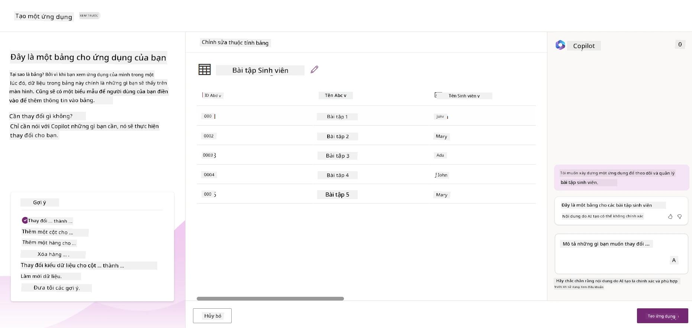  

1. Các nhà giáo dục muốn gửi email cho sinh viên đã nộp bài để cập nhật tiến trình của bài tập. Bạn có thể dùng Copilot để thêm trường mới vào bảng để lưu email sinh viên. Ví dụ, bạn có thể dùng gợi ý: **_Tôi muốn thêm một cột để lưu email sinh viên_**. Nhấn nút **Send** để gửi gợi ý tới AI Copilot.  

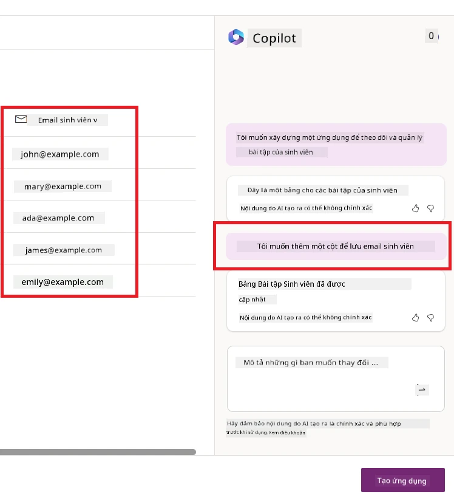  

1. AI Copilot sẽ tạo trường mới và bạn có thể tuỳ chỉnh trường theo nhu cầu.  

1. Khi bạn hoàn thành bảng, hãy nhấp vào nút **Create app** để tạo ứng dụng.

1. AI Copilot sẽ tạo một ứng dụng Canvas đáp ứng dựa trên mô tả của bạn. Sau đó bạn có thể tùy chỉnh ứng dụng để đáp ứng nhu cầu của mình.

1. Đối với giáo viên muốn gửi email đến học sinh, bạn có thể sử dụng Copilot để thêm một màn hình mới vào ứng dụng. Ví dụ, bạn có thể sử dụng lời nhắc sau để thêm màn hình mới vào ứng dụng: **_I want to add a screen to send emails to students_**. Nhấp vào nút **Send** để gửi lời nhắc cho AI Copilot.

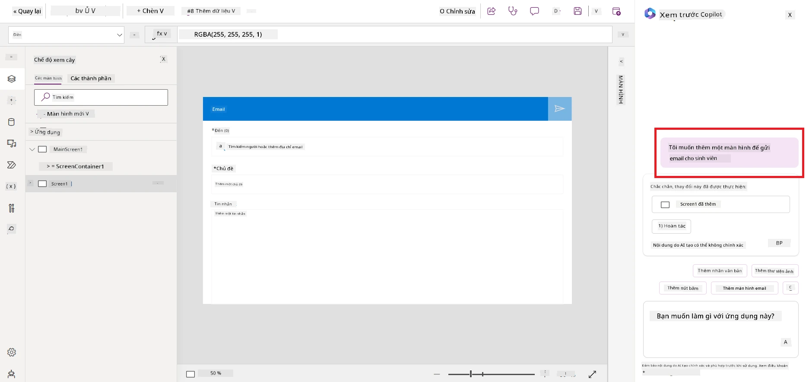

1. AI Copilot sẽ tạo một màn hình mới và bạn có thể tùy chỉnh màn hình để đáp ứng nhu cầu của mình.

1. Khi bạn hoàn thành ứng dụng, hãy nhấp vào nút **Save** để lưu ứng dụng.

1. Để chia sẻ ứng dụng với giáo viên, nhấp vào nút **Share** rồi nhấp lại vào nút **Share**. Sau đó bạn có thể chia sẻ ứng dụng với các giáo viên bằng cách nhập địa chỉ email của họ.

> **Bài tập của bạn**: Ứng dụng bạn vừa tạo là một khởi đầu tốt nhưng có thể cải thiện hơn. Với tính năng email, giáo viên chỉ có thể gửi email đến học sinh bằng tay bằng cách phải gõ email của họ. Bạn có thể dùng Copilot để xây dựng một tự động hóa giúp giáo viên gửi email đến học sinh tự động khi họ nộp bài tập không? Gợi ý của bạn là với lời nhắc đúng, bạn có thể dùng Copilot trong Power Automate để xây dựng điều này.

### Tạo một Bảng Thông Tin Hóa Đơn cho Startup của Chúng Ta

Nhóm tài chính của startup chúng ta đã gặp khó khăn trong việc theo dõi hóa đơn. Họ đã sử dụng bảng tính để theo dõi hóa đơn nhưng điều này trở nên khó quản lý khi số hóa đơn tăng lên. Họ đã yêu cầu bạn tạo một bảng giúp lưu trữ, theo dõi và quản lý thông tin các hóa đơn họ nhận được. Bảng này sẽ được dùng để xây dựng một tự động hóa trích xuất tất cả thông tin hóa đơn và lưu trữ vào bảng. Bảng cũng cần cho phép nhóm tài chính xem các hóa đơn đã thanh toán và chưa thanh toán.

Power Platform có một nền tảng dữ liệu cơ bản gọi là Dataverse cho phép bạn lưu trữ dữ liệu cho các ứng dụng và giải pháp của mình. Dataverse cung cấp một nền tảng dữ liệu low-code để lưu trữ dữ liệu ứng dụng. Đây là một dịch vụ được quản lý hoàn toàn, lưu trữ dữ liệu một cách an toàn trong Microsoft Cloud và được cung cấp trong môi trường Power Platform của bạn. Nó đi kèm với các khả năng quản trị dữ liệu tích hợp sẵn, chẳng hạn như phân loại dữ liệu, dòng dữ liệu, kiểm soát truy cập chi tiết và nhiều hơn nữa. Bạn có thể tìm hiểu thêm [về Dataverse ở đây](https://docs.microsoft.com/powerapps/maker/data-platform/data-platform-intro?WT.mc_id=academic-109639-somelezediko).

Tại sao chúng ta nên sử dụng Dataverse cho startup? Các bảng chuẩn và tùy chỉnh trong Dataverse cung cấp một tùy chọn lưu trữ an toàn và dựa trên đám mây cho dữ liệu của bạn. Các bảng cho phép bạn lưu trữ các loại dữ liệu khác nhau, tương tự như cách bạn có thể dùng nhiều trang tính trong một workbook Excel duy nhất. Bạn có thể dùng bảng để lưu trữ dữ liệu đặc thù cho tổ chức hoặc nhu cầu kinh doanh của bạn. Một số lợi ích mà startup chúng ta sẽ nhận được khi sử dụng Dataverse bao gồm nhưng không giới hạn:

- **Dễ quản lý**: Cả metadata và dữ liệu đều được lưu trữ trên đám mây, vì vậy bạn không phải lo lắng về chi tiết cách chúng được lưu hay quản lý. Bạn có thể tập trung vào xây dựng ứng dụng và giải pháp của mình.

- **An toàn**: Dataverse cung cấp một lựa chọn lưu trữ an toàn và dựa trên đám mây cho dữ liệu của bạn. Bạn có thể kiểm soát ai có quyền truy cập dữ liệu trong các bảng và cách họ truy cập thông qua bảo mật dựa trên vai trò.

- **Metadata phong phú**: Các loại dữ liệu và mối quan hệ được sử dụng trực tiếp trong Power Apps

- **Logic và xác thực**: Bạn có thể sử dụng các quy tắc nghiệp vụ, trường tính toán và quy tắc xác thực để thực thi logic nghiệp vụ và duy trì độ chính xác của dữ liệu.

Bây giờ bạn đã biết Dataverse là gì và tại sao nên dùng nó, hãy xem cách bạn có thể sử dụng Copilot để tạo một bảng trong Dataverse đáp ứng yêu cầu nhóm tài chính của chúng ta.

> **Lưu ý**: Bạn sẽ sử dụng bảng này trong phần tiếp theo để xây dựng một tự động hóa trích xuất tất cả thông tin hóa đơn và lưu trữ vào bảng.

Để tạo một bảng trong Dataverse bằng Copilot, làm theo các bước sau:

1. Điều hướng đến màn hình chính của [Power Apps](https://make.powerapps.com?WT.mc_id=academic-105485-koreyst).

2. Trên thanh điều hướng bên trái, chọn **Tables** rồi nhấp vào **Describe the new Table**.

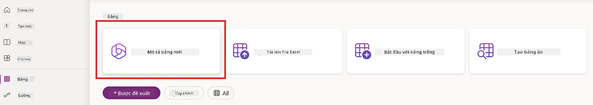

1. Trên màn hình **Describe the new Table**, dùng khu vực văn bản để mô tả bảng bạn muốn tạo. Ví dụ, **_I want to create a table to store invoice information_**. Nhấn nút **Send** để gửi lời nhắc đến AI Copilot.

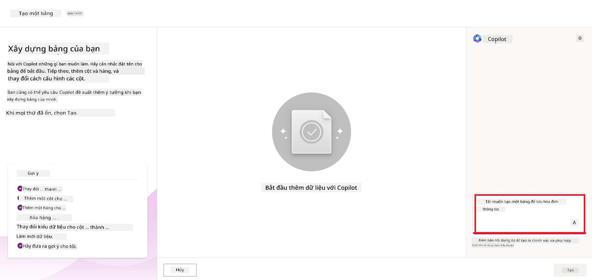

1. AI Copilot sẽ đề xuất một bảng Dataverse với các trường bạn cần để lưu dữ liệu bạn muốn theo dõi cùng với một số dữ liệu mẫu. Sau đó bạn có thể tùy chỉnh bảng để đáp ứng nhu cầu bằng tính năng trợ lý AI Copilot qua các bước đối thoại.

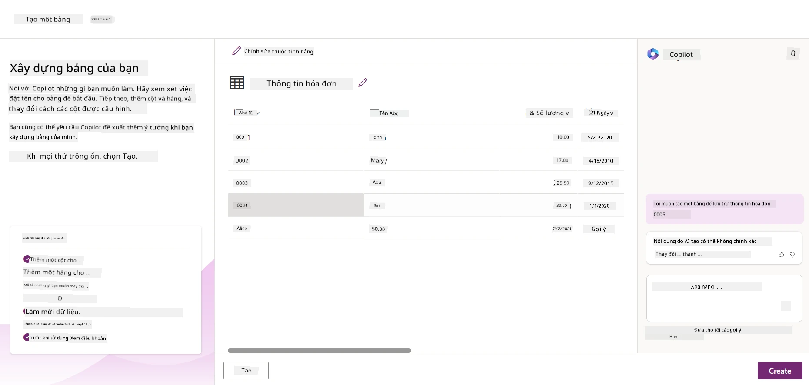

1. Nhóm tài chính muốn gửi email cho nhà cung cấp để cập nhật trạng thái hiện tại của hóa đơn. Bạn có thể dùng Copilot thêm một trường mới vào bảng để lưu email nhà cung cấp. Ví dụ, bạn có thể dùng lời nhắc sau để thêm trường mới vào bảng: **_I want to add a column to store supplier email_**. Nhấn nút **Send** để gửi lời nhắc cho AI Copilot.

1. AI Copilot sẽ tạo một trường mới và bạn có thể tùy chỉnh trường để đáp ứng nhu cầu của mình.

1. Khi hoàn thành bảng, nhấn nút **Create** để tạo bảng.

## Mô hình AI trong Power Platform với AI Builder

AI Builder là một khả năng AI low-code có sẵn trong Power Platform cho phép bạn sử dụng các Mô hình AI để giúp tự động hóa các quy trình và dự đoán kết quả. Với AI Builder, bạn có thể đưa AI vào ứng dụng và luồng của mình kết nối với dữ liệu trong Dataverse hoặc nhiều nguồn dữ liệu đám mây khác nhau như SharePoint, OneDrive hoặc Azure.

## Mô hình AI đã có sẵn vs Mô hình AI tùy chỉnh

AI Builder cung cấp hai loại Mô hình AI: Mô hình AI đã có sẵn và Mô hình AI tùy chỉnh. Mô hình AI đã có sẵn là các mô hình được Microsoft huấn luyện sẵn và có trong Power Platform. Chúng giúp bạn thêm trí thông minh vào ứng dụng và luồng mà không cần thu thập dữ liệu, xây dựng, huấn luyện và phát hành mô hình riêng. Bạn có thể dùng các mô hình này để tự động hóa quy trình và dự đoán kết quả.

Một số Mô hình AI đã có sẵn trong Power Platform gồm:

- **Trích xuất cụm từ khóa**: Mô hình này trích xuất các cụm từ khóa từ văn bản.
- **Phát hiện ngôn ngữ**: Mô hình này phát hiện ngôn ngữ của văn bản.
- **Phân tích cảm xúc**: Mô hình này phát hiện cảm xúc tích cực, tiêu cực, trung lập hoặc hỗn hợp trong văn bản.
- **Đọc danh thiếp**: Mô hình này trích xuất thông tin từ danh thiếp.
- **Nhận dạng văn bản**: Mô hình này trích xuất văn bản từ hình ảnh.
- **Phát hiện đối tượng**: Mô hình này phát hiện và trích xuất đối tượng từ hình ảnh.
- **Xử lý tài liệu**: Mô hình này trích xuất thông tin từ các mẫu đơn.
- **Xử lý hóa đơn**: Mô hình này trích xuất thông tin từ các hóa đơn.

Với Mô hình AI tùy chỉnh, bạn có thể đưa mô hình của mình vào AI Builder để nó hoạt động như bất kỳ mô hình tùy chỉnh AI Builder nào, cho phép bạn huấn luyện mô hình bằng dữ liệu riêng. Bạn có thể dùng mô hình này để tự động hóa quy trình và dự đoán kết quả trong cả Power Apps và Power Automate. Khi sử dụng mô hình riêng, có một số giới hạn áp dụng. Tìm hiểu thêm về các [giới hạn này](https://learn.microsoft.com/ai-builder/byo-model#limitations?WT.mc_id=academic-105485-koreyst).

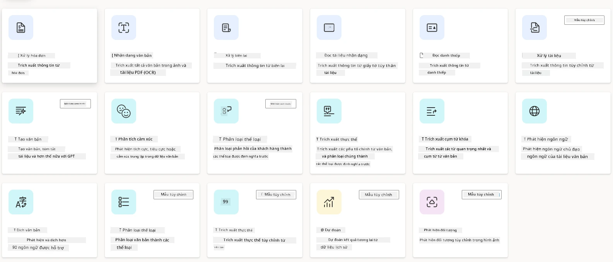

## Bài tập #2 - Xây dựng luồng xử lý hóa đơn cho Startup của chúng ta

Nhóm tài chính gặp khó khăn trong việc xử lý hóa đơn. Họ đã sử dụng bảng tính để theo dõi hóa đơn nhưng điều này trở nên khó quản lý khi số lượng hóa đơn tăng lên. Họ yêu cầu bạn xây dựng một quy trình làm việc giúp họ xử lý hóa đơn sử dụng AI. Quy trình này sẽ cho phép họ trích xuất thông tin từ hóa đơn và lưu thông tin vào bảng Dataverse. Quy trình cũng cho phép họ gửi email cho nhóm tài chính kèm thông tin đã trích xuất.

Bây giờ bạn đã biết AI Builder là gì và tại sao nên dùng, hãy xem cách bạn dùng Mô hình AI xử lý hóa đơn trong AI Builder, mà chúng ta đã đề cập trước đó, để xây dựng quy trình giúp nhóm tài chính xử lý hóa đơn.

Để xây dựng quy trình giúp nhóm tài chính xử lý hóa đơn sử dụng Mô hình AI xử lý hóa đơn trong AI Builder, làm theo các bước sau:

1. Điều hướng đến màn hình chính của [Power Automate](https://make.powerautomate.com?WT.mc_id=academic-105485-koreyst).

2. Sử dụng khu vực văn bản trên màn hình chính để mô tả quy trình bạn muốn xây dựng. Ví dụ, **_Process an invoice when it arrives in my mailbox_**. Nhấn nút **Send** để gửi lời nhắc đến AI Copilot.

   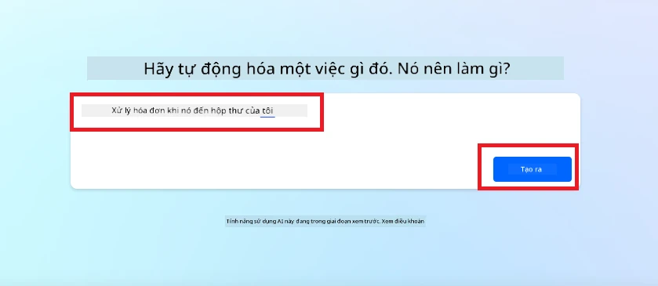

3. AI Copilot sẽ đề xuất các hành động bạn cần để thực hiện nhiệm vụ tự động hóa. Bạn có thể nhấn nút **Next** để qua bước tiếp theo.

4. Ở bước tiếp theo, Power Automate sẽ nhắc bạn thiết lập các kết nối cần thiết cho luồng. Khi xong, nhấn nút **Create flow** để tạo luồng.

5. AI Copilot sẽ tạo luồng và bạn có thể tùy chỉnh luồng để đáp ứng nhu cầu của mình.

6. Cập nhật trigger của luồng và đặt **Folder** thành thư mục lưu trữ hóa đơn. Ví dụ, bạn có thể đặt thư mục là **Inbox**. Nhấn **Show advanced options** và đặt **Only with Attachments** thành **Yes**. Điều này đảm bảo luồng chỉ chạy khi một email có đính kèm được nhận trong thư mục đó.

7. Xóa các hành động sau khỏi luồng: **HTML to text**, **Compose**, **Compose 2**, **Compose 3** và **Compose 4** vì bạn sẽ không dùng chúng.

8. Xóa hành động **Condition** khỏi luồng vì bạn sẽ không sử dụng. Nó sẽ trông như hình sau:

   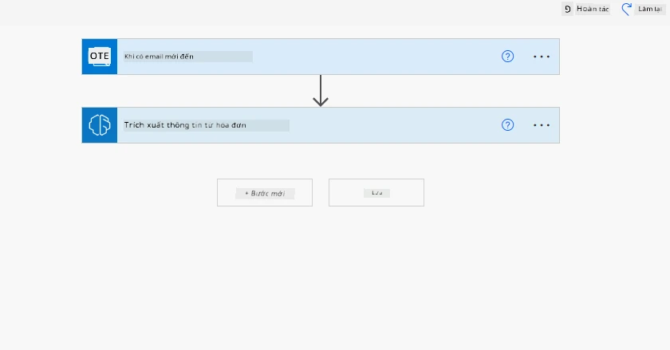

9. Nhấp nút **Add an action** và tìm kiếm **Dataverse**. Chọn hành động **Add a new row**.

10. Trong hành động **Extract Information from invoices**, cập nhật **Invoice File** trỏ tới **Attachment Content** từ email. Điều này đảm bảo luồng trích xuất thông tin từ đính kèm hóa đơn.

11. Chọn **Table** bạn đã tạo trước đó. Ví dụ, bạn có thể chọn bảng **Invoice Information**. Chọn nội dung động từ hành động trước để điền các trường sau:

    - ID
    - Amount
    - Date
    - Name
    - Status - Đặt **Status** thành **Pending**.
    - Supplier Email - Dùng nội dung động **From** từ trigger **When a new email arrives**.

    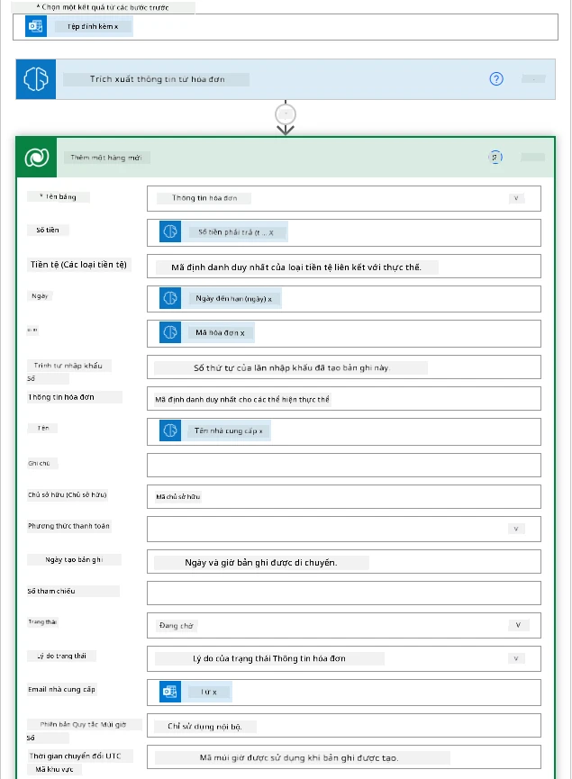

12. Khi hoàn thành luồng, nhấn nút **Save** để lưu luồng. Bạn có thể kiểm tra luồng bằng cách gửi một email kèm hóa đơn vào thư mục đã chỉ định trong trigger.

> **Bài tập của bạn**: Luồng bạn vừa xây dựng là một khởi đầu tốt, bây giờ bạn cần nghĩ cách xây dựng một tự động hóa để nhóm tài chính gửi email cập nhật trạng thái hóa đơn cho nhà cung cấp. Gợi ý: luồng phải chạy khi trạng thái hóa đơn thay đổi.

## Sử dụng Mô hình AI Tạo Văn bản trong Power Automate

Mô hình AI Create Text with GPT trong AI Builder cho phép bạn tạo văn bản dựa trên lời nhắc và được hỗ trợ bởi Microsoft Azure OpenAI Service. Với khả năng này, bạn có thể tích hợp công nghệ GPT (Generative Pre-Trained Transformer) vào ứng dụng và luồng của mình để xây dựng các luồng tự động hóa đa dạng và các ứng dụng có tính sáng tạo.

Mô hình GPT trải qua huấn luyện sâu trên lượng dữ liệu lớn, cho phép tạo ra văn bản gần giống ngôn ngữ con người khi được cung cấp lời nhắc. Khi tích hợp với tự động hóa quy trình, các mô hình AI như GPT có thể được dùng để tối ưu và tự động hóa nhiều tác vụ.

Ví dụ, bạn có thể xây dựng các luồng tự động tạo văn bản cho nhiều mục đích sử dụng, như: bản nháp email, mô tả sản phẩm, và nhiều hơn thế. Bạn cũng có thể dùng mô hình để tạo văn bản cho nhiều ứng dụng, như chatbot và ứng dụng dịch vụ khách hàng giúp đại lý phản hồi nhanh chóng và hiệu quả các yêu cầu của khách hàng.

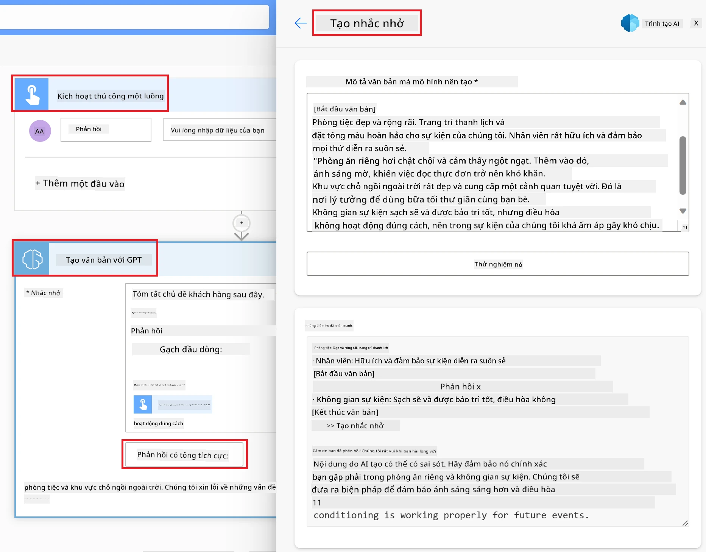

Để tìm hiểu cách sử dụng Mô hình AI này trong Power Automate, hãy xem qua module [Thêm trí thông minh với AI Builder và GPT](https://learn.microsoft.com/training/modules/ai-builder-text-generation/?WT.mc_id=academic-109639-somelezediko).

## Làm rất tốt! Tiếp tục Học tập của bạn

Sau khi hoàn thành bài học này, hãy xem bộ sưu tập [Học về AI Sinh Tạo của chúng tôi](https://aka.ms/genai-collection?WT.mc_id=academic-105485-koreyst) để tiếp tục nâng cao kiến thức về AI Sinh Tạo!

Muốn tùy chỉnh và tận dụng tối đa Copilot? Khám phá [Awesome Copilot](https://github.com/github/awesome-copilot?WT.mc_id=academic-105485-koreyst) — một bộ sưu tập do cộng đồng đóng góp các chỉ dẫn, tác nhân, kỹ năng và cấu hình giúp bạn tận dụng GitHub Copilot một cách tối ưu.

Hãy chuyển đến Bài học 11, nơi chúng ta sẽ tìm hiểu cách [tích hợp AI Sinh Tạo với Gọi Hàm](../11-integrating-with-function-calling/README.md?WT.mc_id=academic-105485-koreyst)!

---

<!-- CO-OP TRANSLATOR DISCLAIMER START -->
**Tuyên bố miễn trừ trách nhiệm**:
Tài liệu này đã được dịch bằng dịch vụ dịch thuật AI [Co-op Translator](https://github.com/Azure/co-op-translator). Mặc dù chúng tôi cố gắng đảm bảo độ chính xác, xin lưu ý rằng bản dịch tự động có thể chứa lỗi hoặc sai sót. Tài liệu gốc bằng ngôn ngữ gốc nên được coi là nguồn tin chính thức. Đối với thông tin quan trọng, nên sử dụng dịch vụ dịch thuật chuyên nghiệp bởi con người. Chúng tôi không chịu trách nhiệm về bất kỳ hiểu lầm hoặc giải thích sai nào phát sinh từ việc sử dụng bản dịch này.
<!-- CO-OP TRANSLATOR DISCLAIMER END -->