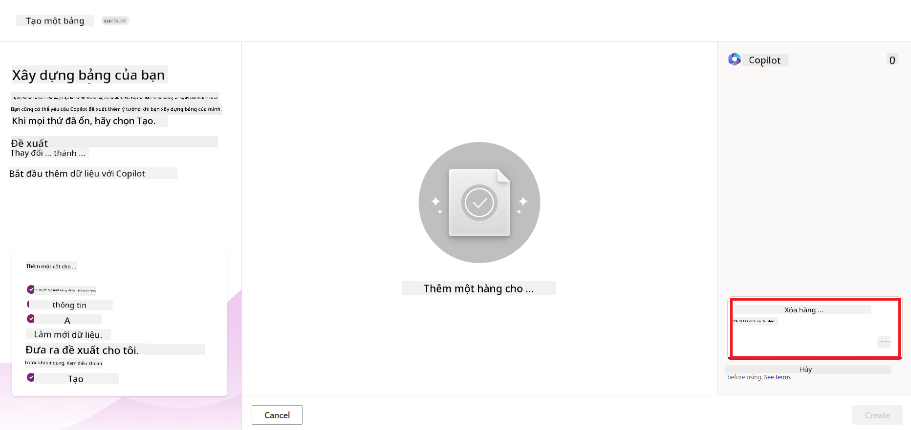
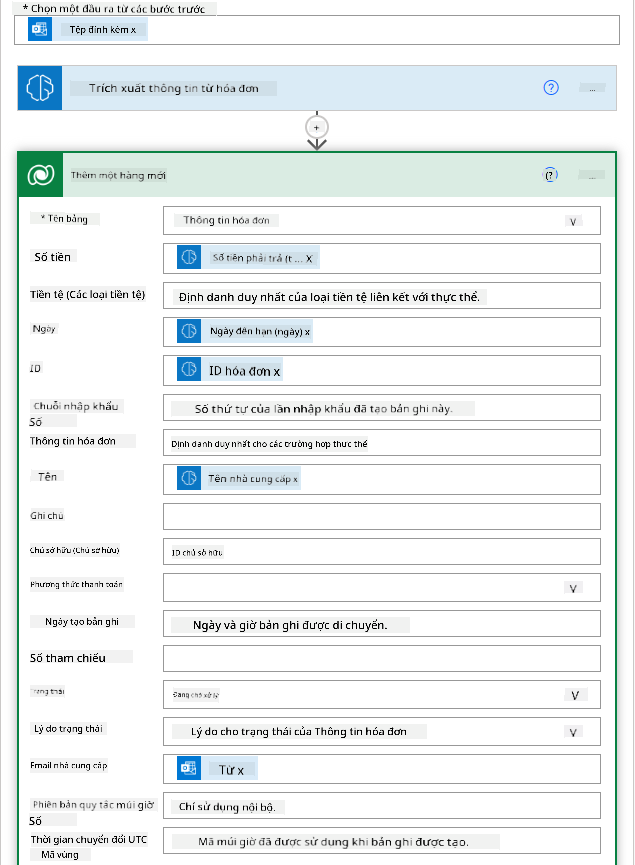

<!--
CO_OP_TRANSLATOR_METADATA:
{
  "original_hash": "f5ff3b6204a695a117d6f452403c95f7",
  "translation_date": "2025-07-09T14:06:36+00:00",
  "source_file": "10-building-low-code-ai-applications/README.md",
  "language_code": "vi"
}
-->
# Xây dựng Ứng dụng AI Low Code

> _(Nhấp vào hình ảnh trên để xem video bài học này)_

## Giới thiệu

Bây giờ khi chúng ta đã học cách xây dựng các ứng dụng tạo hình ảnh, hãy cùng tìm hiểu về low code. Generative AI có thể được sử dụng trong nhiều lĩnh vực khác nhau bao gồm cả low code, nhưng low code là gì và làm thế nào để chúng ta có thể thêm AI vào đó?

Việc xây dựng ứng dụng và giải pháp đã trở nên dễ dàng hơn cho cả các nhà phát triển truyền thống và người không phải lập trình viên thông qua việc sử dụng các Nền tảng Phát triển Low Code. Các Nền tảng Phát triển Low Code cho phép bạn xây dựng ứng dụng và giải pháp với rất ít hoặc không cần viết mã. Điều này được thực hiện bằng cách cung cấp một môi trường phát triển trực quan cho phép bạn kéo thả các thành phần để xây dựng ứng dụng và giải pháp. Điều này giúp bạn xây dựng ứng dụng và giải pháp nhanh hơn và tiết kiệm tài nguyên hơn. Trong bài học này, chúng ta sẽ đi sâu vào cách sử dụng Low Code và cách nâng cao phát triển low code với AI bằng Power Platform.

Power Platform cung cấp cho các tổ chức cơ hội để trao quyền cho các nhóm của họ xây dựng các giải pháp riêng thông qua một môi trường low-code hoặc no-code trực quan. Môi trường này giúp đơn giản hóa quá trình xây dựng giải pháp. Với Power Platform, các giải pháp có thể được xây dựng trong vài ngày hoặc vài tuần thay vì hàng tháng hoặc hàng năm. Power Platform bao gồm năm sản phẩm chính: Power Apps, Power Automate, Power BI, Power Pages và Copilot Studio.

Bài học này bao gồm:

- Giới thiệu về Generative AI trong Power Platform  
- Giới thiệu về Copilot và cách sử dụng  
- Sử dụng Generative AI để xây dựng ứng dụng và luồng trong Power Platform  
- Hiểu về các Mô hình AI trong Power Platform với AI Builder  

## Mục tiêu học tập

Kết thúc bài học này, bạn sẽ có thể:

- Hiểu cách Copilot hoạt động trong Power Platform.

- Xây dựng ứng dụng Theo dõi Bài tập Sinh viên cho startup giáo dục của chúng ta.

- Xây dựng luồng Xử lý Hóa đơn sử dụng AI để trích xuất thông tin từ hóa đơn.

- Áp dụng các thực hành tốt nhất khi sử dụng Mô hình AI Create Text với GPT.

Các công cụ và công nghệ bạn sẽ sử dụng trong bài học này là:

- **Power Apps**, cho ứng dụng Theo dõi Bài tập Sinh viên, cung cấp môi trường phát triển low-code để xây dựng ứng dụng theo dõi, quản lý và tương tác với dữ liệu.

- **Dataverse**, để lưu trữ dữ liệu cho ứng dụng Theo dõi Bài tập Sinh viên, nơi Dataverse sẽ cung cấp nền tảng dữ liệu low-code để lưu trữ dữ liệu của ứng dụng.

- **Power Automate**, cho luồng Xử lý Hóa đơn, nơi bạn sẽ có môi trường phát triển low-code để xây dựng các luồng công việc tự động hóa quy trình xử lý hóa đơn.

- **AI Builder**, cho Mô hình AI Xử lý Hóa đơn, nơi bạn sẽ sử dụng các Mô hình AI có sẵn để xử lý hóa đơn cho startup của chúng ta.

## Generative AI trong Power Platform

Nâng cao phát triển low-code và ứng dụng với generative AI là một trọng tâm chính của Power Platform. Mục tiêu là giúp mọi người có thể xây dựng các ứng dụng, trang web, bảng điều khiển được hỗ trợ AI và tự động hóa quy trình với AI, _mà không cần có chuyên môn về khoa học dữ liệu_. Mục tiêu này được thực hiện bằng cách tích hợp generative AI vào trải nghiệm phát triển low-code trong Power Platform dưới dạng Copilot và AI Builder.

### Cách thức hoạt động?

Copilot là một trợ lý AI cho phép bạn xây dựng các giải pháp Power Platform bằng cách mô tả yêu cầu của bạn qua một loạt các bước hội thoại sử dụng ngôn ngữ tự nhiên. Ví dụ, bạn có thể hướng dẫn trợ lý AI của mình nêu rõ các trường mà ứng dụng sẽ sử dụng và nó sẽ tạo ra cả ứng dụng lẫn mô hình dữ liệu nền tảng hoặc bạn có thể chỉ định cách thiết lập một luồng trong Power Automate.

Bạn có thể sử dụng các chức năng do Copilot điều khiển như một tính năng trong các màn hình ứng dụng để người dùng khám phá thông tin qua các tương tác hội thoại.

AI Builder là một khả năng AI low-code có sẵn trong Power Platform cho phép bạn sử dụng các Mô hình AI để giúp tự động hóa quy trình và dự đoán kết quả. Với AI Builder, bạn có thể đưa AI vào các ứng dụng và luồng của mình kết nối với dữ liệu trong Dataverse hoặc các nguồn dữ liệu đám mây khác như SharePoint, OneDrive hoặc Azure.

Copilot có mặt trong tất cả các sản phẩm của Power Platform: Power Apps, Power Automate, Power BI, Power Pages và Power Virtual Agents. AI Builder có mặt trong Power Apps và Power Automate. Trong bài học này, chúng ta sẽ tập trung vào cách sử dụng Copilot và AI Builder trong Power Apps và Power Automate để xây dựng giải pháp cho startup giáo dục của chúng ta.

### Copilot trong Power Apps

Là một phần của Power Platform, Power Apps cung cấp môi trường phát triển low-code để xây dựng ứng dụng theo dõi, quản lý và tương tác với dữ liệu. Đây là bộ dịch vụ phát triển ứng dụng với nền tảng dữ liệu có khả năng mở rộng và khả năng kết nối với các dịch vụ đám mây và dữ liệu tại chỗ. Power Apps cho phép bạn xây dựng ứng dụng chạy trên trình duyệt, máy tính bảng và điện thoại, và có thể chia sẻ với đồng nghiệp. Power Apps giúp người dùng dễ dàng tiếp cận phát triển ứng dụng với giao diện đơn giản, để mọi người dùng doanh nghiệp hoặc nhà phát triển chuyên nghiệp đều có thể xây dựng ứng dụng tùy chỉnh. Trải nghiệm phát triển ứng dụng cũng được nâng cao với Generative AI thông qua Copilot.

Tính năng trợ lý AI Copilot trong Power Apps cho phép bạn mô tả loại ứng dụng bạn cần và thông tin bạn muốn ứng dụng theo dõi, thu thập hoặc hiển thị. Copilot sau đó tạo ra một ứng dụng Canvas đáp ứng dựa trên mô tả của bạn. Bạn có thể tùy chỉnh ứng dụng để phù hợp với nhu cầu. AI Copilot cũng tạo và đề xuất một Bảng Dataverse với các trường bạn cần để lưu trữ dữ liệu bạn muốn theo dõi cùng với một số dữ liệu mẫu. Chúng ta sẽ tìm hiểu Dataverse là gì và cách sử dụng nó trong Power Apps trong phần sau của bài học này. Bạn có thể tùy chỉnh bảng theo nhu cầu bằng tính năng trợ lý AI Copilot qua các bước hội thoại. Tính năng này có sẵn ngay trên màn hình chính của Power Apps.

### Copilot trong Power Automate

Là một phần của Power Platform, Power Automate cho phép người dùng tạo các luồng công việc tự động giữa các ứng dụng và dịch vụ. Nó giúp tự động hóa các quy trình kinh doanh lặp đi lặp lại như giao tiếp, thu thập dữ liệu và phê duyệt quyết định. Giao diện đơn giản cho phép người dùng ở mọi trình độ kỹ thuật (từ người mới bắt đầu đến nhà phát triển chuyên nghiệp) có thể tự động hóa các công việc. Trải nghiệm phát triển luồng công việc cũng được nâng cao với Generative AI thông qua Copilot.

Tính năng trợ lý AI Copilot trong Power Automate cho phép bạn mô tả loại luồng bạn cần và các hành động bạn muốn luồng thực hiện. Copilot sau đó tạo ra một luồng dựa trên mô tả của bạn. Bạn có thể tùy chỉnh luồng để phù hợp với nhu cầu. AI Copilot cũng tạo và đề xuất các hành động bạn cần để thực hiện nhiệm vụ bạn muốn tự động hóa. Chúng ta sẽ tìm hiểu luồng là gì và cách sử dụng chúng trong Power Automate trong phần sau của bài học này. Bạn có thể tùy chỉnh các hành động theo nhu cầu bằng tính năng trợ lý AI Copilot qua các bước hội thoại. Tính năng này có sẵn ngay trên màn hình chính của Power Automate.

## Bài tập: Quản lý bài tập sinh viên và hóa đơn cho startup của chúng ta, sử dụng Copilot

Startup của chúng ta cung cấp các khóa học trực tuyến cho sinh viên. Startup đã phát triển nhanh chóng và hiện đang gặp khó khăn trong việc đáp ứng nhu cầu các khóa học. Startup đã thuê bạn làm nhà phát triển Power Platform để giúp họ xây dựng giải pháp low code giúp quản lý bài tập sinh viên và hóa đơn. Giải pháp của họ cần giúp theo dõi và quản lý bài tập sinh viên qua một ứng dụng và tự động hóa quy trình xử lý hóa đơn qua một luồng công việc. Bạn được yêu cầu sử dụng Generative AI để phát triển giải pháp.

Khi bắt đầu sử dụng Copilot, bạn có thể dùng [Thư viện Prompt Copilot Power Platform](https://github.com/pnp/powerplatform-prompts?WT.mc_id=academic-109639-somelezediko) để bắt đầu với các prompt. Thư viện này chứa danh sách các prompt bạn có thể dùng để xây dựng ứng dụng và luồng với Copilot. Bạn cũng có thể dùng các prompt trong thư viện để hình dung cách mô tả yêu cầu của mình cho Copilot.

### Xây dựng ứng dụng Theo dõi Bài tập Sinh viên cho Startup của chúng ta

Các giáo viên tại startup của chúng ta đang gặp khó khăn trong việc theo dõi bài tập của sinh viên. Họ đã sử dụng bảng tính để theo dõi bài tập nhưng điều này trở nên khó quản lý khi số lượng sinh viên tăng lên. Họ yêu cầu bạn xây dựng một ứng dụng giúp họ theo dõi và quản lý bài tập sinh viên. Ứng dụng cần cho phép họ thêm bài tập mới, xem bài tập, cập nhật bài tập và xóa bài tập. Ứng dụng cũng cần cho phép giáo viên và sinh viên xem các bài tập đã được chấm điểm và những bài chưa được chấm.

Bạn sẽ xây dựng ứng dụng bằng Copilot trong Power Apps theo các bước sau:

1. Truy cập màn hình chính của [Power Apps](https://make.powerapps.com?WT.mc_id=academic-105485-koreyst).

1. Sử dụng khu vực nhập văn bản trên màn hình chính để mô tả ứng dụng bạn muốn xây dựng. Ví dụ, **_Tôi muốn xây dựng một ứng dụng để theo dõi và quản lý bài tập sinh viên_**. Nhấn nút **Send** để gửi prompt đến AI Copilot.

1. AI Copilot sẽ đề xuất một Bảng Dataverse với các trường bạn cần để lưu trữ dữ liệu bạn muốn theo dõi cùng với một số dữ liệu mẫu. Bạn có thể tùy chỉnh bảng theo nhu cầu bằng tính năng trợ lý AI Copilot qua các bước hội thoại.

   > **Quan trọng**: Dataverse là nền tảng dữ liệu nền tảng cho Power Platform. Đây là nền tảng dữ liệu low-code để lưu trữ dữ liệu của ứng dụng. Nó là dịch vụ được quản lý toàn diện, lưu trữ dữ liệu an toàn trên Microsoft Cloud và được cấp phát trong môi trường Power Platform của bạn. Nó đi kèm với các khả năng quản trị dữ liệu tích hợp sẵn, như phân loại dữ liệu, nguồn gốc dữ liệu, kiểm soát truy cập chi tiết và nhiều hơn nữa. Bạn có thể tìm hiểu thêm về Dataverse [tại đây](https://docs.microsoft.com/powerapps/maker/data-platform/data-platform-intro?WT.mc_id=academic-109639-somelezediko).

   

1. Giáo viên muốn gửi email cho sinh viên đã nộp bài tập để cập nhật tiến độ bài tập. Bạn có thể dùng Copilot để thêm trường mới vào bảng để lưu email sinh viên. Ví dụ, bạn có thể dùng prompt sau để thêm trường mới: **_Tôi muốn thêm một cột để lưu email sinh viên_**. Nhấn nút **Send** để gửi prompt đến AI Copilot.

1. AI Copilot sẽ tạo trường mới và bạn có thể tùy chỉnh trường để phù hợp với nhu cầu.

1. Khi hoàn tất với bảng, nhấn nút **Create app** để tạo ứng dụng.

1. AI Copilot sẽ tạo một ứng dụng Canvas đáp ứng dựa trên mô tả của bạn. Bạn có thể tùy chỉnh ứng dụng để phù hợp với nhu cầu.

1. Để giáo viên gửi email cho sinh viên, bạn có thể dùng Copilot để thêm màn hình mới vào ứng dụng. Ví dụ, bạn có thể dùng prompt sau để thêm màn hình mới: **_Tôi muốn thêm một màn hình để gửi email cho sinh viên_**. Nhấn nút **Send** để gửi prompt đến AI Copilot.

1. AI Copilot sẽ tạo màn hình mới và bạn có thể tùy chỉnh màn hình để phù hợp với nhu cầu.

1. Khi hoàn tất với ứng dụng, nhấn nút **Save** để lưu ứng dụng.

1. Để chia sẻ ứng dụng với giáo viên, nhấn nút **Share** rồi nhấn lại nút **Share**. Bạn có thể chia sẻ ứng dụng với giáo viên bằng cách nhập địa chỉ email của họ.

> **Bài tập về nhà của bạn**: Ứng dụng bạn vừa xây dựng là một khởi đầu tốt nhưng có thể cải thiện hơn. Với tính năng email, giáo viên chỉ có thể gửi email cho sinh viên thủ công bằng cách nhập địa chỉ email. Bạn có thể dùng Copilot để xây dựng một tự động hóa cho phép giáo viên gửi email cho sinh viên tự động khi họ nộp bài tập không? Gợi ý của bạn là với prompt phù hợp, bạn có thể dùng Copilot trong Power Automate để xây dựng điều này.

### Xây dựng Bảng Thông tin Hóa đơn cho Startup của chúng ta

Nhóm tài chính của startup đang gặp khó khăn trong việc theo dõi hóa đơn. Họ đã sử dụng bảng tính để theo dõi hóa đơn nhưng điều này trở nên khó quản lý khi số lượng hóa đơn tăng lên. Họ yêu cầu bạn xây dựng một bảng giúp lưu trữ, theo dõi và quản lý thông tin các hóa đơn họ nhận được. Bảng này sẽ được dùng để xây dựng một tự động hóa trích xuất tất cả thông tin hóa đơn và lưu vào bảng. Bảng cũng cần cho phép nhóm tài chính xem các hóa đơn đã được thanh toán và những hóa đơn chưa thanh toán.

Power Platform có nền tảng dữ liệu nền tảng gọi là Dataverse cho phép bạn lưu trữ dữ liệu cho các ứng dụng và giải pháp của mình. Dataverse cung cấp nền tảng dữ liệu low-code để lưu trữ dữ liệu ứng dụng. Đây là dịch vụ được quản lý toàn diện, lưu trữ dữ liệu an toàn trên Microsoft Cloud và được cấp phát trong môi trường Power Platform của bạn. Nó đi kèm với các khả năng quản trị dữ liệu tích hợp sẵn, như phân loại dữ liệu, nguồn gốc dữ liệu, kiểm soát truy cập chi tiết và nhiều hơn nữa. Bạn có thể tìm hiểu thêm [về Dataverse tại đây](https://docs.microsoft.com/powerapps/maker/data-platform/data-platform-intro?WT.mc_id=academic-109639-somelezediko).

Tại sao chúng ta nên dùng Dataverse cho startup? Các bảng chuẩn và bảng tùy chỉnh trong Dataverse cung cấp một lựa chọn lưu trữ an toàn và dựa trên đám mây cho dữ liệu của bạn. Các bảng cho phép bạn lưu trữ các loại dữ liệu khác nhau, tương tự như cách bạn có thể sử dụng nhiều trang tính trong một workbook Excel. Bạn có thể dùng bảng để lưu trữ dữ liệu đặc thù cho tổ chức hoặc nhu cầu kinh doanh của bạn. Một số lợi ích mà startup của chúng ta sẽ nhận được khi sử dụng Dataverse bao gồm nhưng không giới hạn:
- **Dễ quản lý**: Cả metadata và dữ liệu đều được lưu trữ trên đám mây, vì vậy bạn không cần phải lo lắng về cách chúng được lưu trữ hay quản lý. Bạn có thể tập trung xây dựng các ứng dụng và giải pháp của mình.

- **Bảo mật**: Dataverse cung cấp một tùy chọn lưu trữ an toàn và dựa trên đám mây cho dữ liệu của bạn. Bạn có thể kiểm soát ai được truy cập dữ liệu trong các bảng và cách họ truy cập thông qua bảo mật dựa trên vai trò.

- **Metadata phong phú**: Các kiểu dữ liệu và mối quan hệ được sử dụng trực tiếp trong Power Apps.

- **Logic và xác thực**: Bạn có thể sử dụng các quy tắc nghiệp vụ, trường tính toán và quy tắc xác thực để thực thi logic nghiệp vụ và duy trì độ chính xác của dữ liệu.

Bây giờ bạn đã biết Dataverse là gì và tại sao nên sử dụng nó, hãy cùng xem cách bạn có thể dùng Copilot để tạo một bảng trong Dataverse đáp ứng yêu cầu của đội tài chính.

> **Note** : Bạn sẽ sử dụng bảng này trong phần tiếp theo để xây dựng một quy trình tự động trích xuất tất cả thông tin hóa đơn và lưu trữ vào bảng.

Để tạo bảng trong Dataverse bằng Copilot, làm theo các bước sau:

1. Truy cập màn hình chính của [Power Apps](https://make.powerapps.com?WT.mc_id=academic-105485-koreyst).

2. Trên thanh điều hướng bên trái, chọn **Tables** rồi nhấn vào **Describe the new Table**.

3. Trên màn hình **Describe the new Table**, sử dụng khu vực nhập văn bản để mô tả bảng bạn muốn tạo. Ví dụ, **_Tôi muốn tạo một bảng để lưu trữ thông tin hóa đơn_**. Nhấn nút **Send** để gửi yêu cầu đến AI Copilot.

4. AI Copilot sẽ đề xuất một bảng Dataverse với các trường cần thiết để lưu trữ dữ liệu bạn muốn theo dõi cùng với một số dữ liệu mẫu. Bạn có thể tùy chỉnh bảng theo nhu cầu bằng tính năng trợ lý AI Copilot qua các bước hội thoại.

5. Đội tài chính muốn gửi email cho nhà cung cấp để cập nhật trạng thái hiện tại của hóa đơn. Bạn có thể dùng Copilot để thêm một trường mới vào bảng để lưu email nhà cung cấp. Ví dụ, bạn có thể dùng yêu cầu sau để thêm trường mới: **_Tôi muốn thêm một cột để lưu email nhà cung cấp_**. Nhấn nút **Send** để gửi yêu cầu đến AI Copilot.

6. AI Copilot sẽ tạo trường mới và bạn có thể tùy chỉnh trường này theo nhu cầu.

7. Khi hoàn tất bảng, nhấn nút **Create** để tạo bảng.

## AI Models trong Power Platform với AI Builder

AI Builder là một khả năng AI low-code có trong Power Platform, giúp bạn sử dụng các AI Models để tự động hóa quy trình và dự đoán kết quả. Với AI Builder, bạn có thể tích hợp AI vào các ứng dụng và luồng công việc kết nối với dữ liệu trong Dataverse hoặc các nguồn dữ liệu đám mây khác như SharePoint, OneDrive hoặc Azure.

## AI Models có sẵn so với AI Models tùy chỉnh

AI Builder cung cấp hai loại AI Models: AI Models có sẵn (Prebuilt AI Models) và AI Models tùy chỉnh (Custom AI Models). AI Models có sẵn là các mô hình AI đã được Microsoft huấn luyện và có sẵn trong Power Platform. Chúng giúp bạn thêm trí tuệ vào ứng dụng và luồng công việc mà không cần phải thu thập dữ liệu, xây dựng, huấn luyện và xuất bản mô hình riêng. Bạn có thể dùng các mô hình này để tự động hóa quy trình và dự đoán kết quả.

Một số AI Models có sẵn trong Power Platform bao gồm:

- **Key Phrase Extraction**: Mô hình trích xuất các cụm từ khóa từ văn bản.
- **Language Detection**: Mô hình nhận diện ngôn ngữ của văn bản.
- **Sentiment Analysis**: Mô hình phân tích cảm xúc tích cực, tiêu cực, trung tính hoặc hỗn hợp trong văn bản.
- **Business Card Reader**: Mô hình trích xuất thông tin từ danh thiếp.
- **Text Recognition**: Mô hình trích xuất văn bản từ hình ảnh.
- **Object Detection**: Mô hình phát hiện và trích xuất đối tượng từ hình ảnh.
- **Document processing**: Mô hình trích xuất thông tin từ các biểu mẫu.
- **Invoice Processing**: Mô hình trích xuất thông tin từ hóa đơn.

Với AI Models tùy chỉnh, bạn có thể đưa mô hình riêng của mình vào AI Builder để nó hoạt động như một mô hình tùy chỉnh, cho phép bạn huấn luyện mô hình bằng dữ liệu của chính mình. Bạn có thể dùng các mô hình này để tự động hóa quy trình và dự đoán kết quả trong cả Power Apps và Power Automate. Khi sử dụng mô hình riêng, có một số giới hạn áp dụng. Đọc thêm về các [giới hạn này](https://learn.microsoft.com/ai-builder/byo-model#limitations?WT.mc_id=academic-105485-koreyst).

## Bài tập #2 - Xây dựng luồng xử lý hóa đơn cho Startup của chúng ta

Đội tài chính đang gặp khó khăn trong việc xử lý hóa đơn. Họ đã sử dụng bảng tính để theo dõi hóa đơn nhưng việc này trở nên khó quản lý khi số lượng hóa đơn tăng lên. Họ yêu cầu bạn xây dựng một quy trình làm việc giúp họ xử lý hóa đơn bằng AI. Quy trình này cần cho phép trích xuất thông tin từ hóa đơn và lưu trữ thông tin vào bảng Dataverse. Đồng thời, quy trình cũng phải cho phép gửi email đến đội tài chính với thông tin đã trích xuất.

Bây giờ bạn đã biết AI Builder là gì và tại sao nên dùng nó, hãy cùng xem cách sử dụng AI Model Invoice Processing trong AI Builder, như đã đề cập trước đó, để xây dựng quy trình giúp đội tài chính xử lý hóa đơn.

Để xây dựng quy trình giúp đội tài chính xử lý hóa đơn bằng AI Model Invoice Processing trong AI Builder, làm theo các bước sau:

1. Truy cập màn hình chính của [Power Automate](https://make.powerautomate.com?WT.mc_id=academic-105485-koreyst).

2. Sử dụng khu vực nhập văn bản trên màn hình chính để mô tả quy trình bạn muốn xây dựng. Ví dụ, **_Xử lý hóa đơn khi nó đến hộp thư của tôi_**. Nhấn nút **Send** để gửi yêu cầu đến AI Copilot.

   

3. AI Copilot sẽ đề xuất các hành động bạn cần thực hiện để tự động hóa tác vụ. Bạn có thể nhấn nút **Next** để tiếp tục các bước tiếp theo.

4. Ở bước tiếp theo, Power Automate sẽ yêu cầu bạn thiết lập các kết nối cần thiết cho luồng. Khi hoàn tất, nhấn nút **Create flow** để tạo luồng.

5. AI Copilot sẽ tạo ra một luồng và bạn có thể tùy chỉnh luồng này theo nhu cầu.

6. Cập nhật trigger của luồng và đặt **Folder** thành thư mục nơi các hóa đơn sẽ được lưu. Ví dụ, bạn có thể đặt thư mục là **Inbox**. Nhấn **Show advanced options** và đặt **Only with Attachments** thành **Yes**. Điều này đảm bảo luồng chỉ chạy khi có email kèm tệp đính kèm trong thư mục.

7. Xóa các hành động sau khỏi luồng: **HTML to text**, **Compose**, **Compose 2**, **Compose 3** và **Compose 4** vì bạn sẽ không sử dụng chúng.

8. Xóa hành động **Condition** khỏi luồng vì bạn sẽ không dùng đến. Luồng sẽ trông giống như ảnh chụp màn hình dưới đây:

   

9. Nhấn nút **Add an action** và tìm kiếm **Dataverse**. Chọn hành động **Add a new row**.

10. Trong hành động **Extract Information from invoices**, cập nhật **Invoice File** để trỏ đến **Attachment Content** từ email. Điều này đảm bảo luồng trích xuất thông tin từ tệp đính kèm hóa đơn.

11. Chọn **Table** bạn đã tạo trước đó. Ví dụ, bạn có thể chọn bảng **Invoice Information**. Chọn nội dung động từ hành động trước để điền vào các trường sau:

    - ID
    - Amount
    - Date
    - Name
    - Status - Đặt **Status** thành **Pending**.
    - Supplier Email - Dùng nội dung động **From** từ trigger **When a new email arrives**.

    

12. Khi hoàn tất luồng, nhấn nút **Save** để lưu lại. Bạn có thể thử luồng bằng cách gửi email kèm hóa đơn đến thư mục bạn đã chỉ định trong trigger.

> **Bài tập về nhà của bạn**: Luồng bạn vừa xây dựng là một khởi đầu tốt, giờ bạn cần nghĩ cách xây dựng một quy trình tự động cho phép đội tài chính gửi email cho nhà cung cấp để cập nhật trạng thái hiện tại của hóa đơn. Gợi ý: luồng phải chạy khi trạng thái của hóa đơn thay đổi.

## Sử dụng AI Model tạo văn bản trong Power Automate

AI Model Create Text with GPT trong AI Builder cho phép bạn tạo văn bản dựa trên một yêu cầu và được hỗ trợ bởi Microsoft Azure OpenAI Service. Với khả năng này, bạn có thể tích hợp công nghệ GPT (Generative Pre-Trained Transformer) vào các ứng dụng và luồng công việc để xây dựng nhiều luồng tự động và ứng dụng thông minh.

Các mô hình GPT được huấn luyện trên lượng dữ liệu khổng lồ, giúp chúng tạo ra văn bản gần giống ngôn ngữ con người khi được cung cấp yêu cầu. Khi tích hợp với tự động hóa quy trình, các mô hình AI như GPT có thể được sử dụng để đơn giản hóa và tự động hóa nhiều tác vụ khác nhau.

Ví dụ, bạn có thể xây dựng các luồng tự động tạo văn bản cho nhiều trường hợp sử dụng như: bản nháp email, mô tả sản phẩm, và nhiều hơn nữa. Bạn cũng có thể dùng mô hình để tạo văn bản cho các ứng dụng như chatbot và ứng dụng dịch vụ khách hàng, giúp nhân viên phản hồi hiệu quả và nhanh chóng các yêu cầu của khách hàng.

Để tìm hiểu cách sử dụng AI Model này trong Power Automate, hãy tham khảo module [Add intelligence with AI Builder and GPT](https://learn.microsoft.com/training/modules/ai-builder-text-generation/?WT.mc_id=academic-109639-somelezediko).

## Làm tốt lắm! Tiếp tục học hỏi

Sau khi hoàn thành bài học này, hãy khám phá bộ sưu tập [Generative AI Learning collection](https://aka.ms/genai-collection?WT.mc_id=academic-105485-koreyst) để tiếp tục nâng cao kiến thức về Generative AI!

Hãy đến bài học 11, nơi chúng ta sẽ tìm hiểu cách [tích hợp Generative AI với Function Calling](../11-integrating-with-function-calling/README.md?WT.mc_id=academic-105485-koreyst)!

**Tuyên bố từ chối trách nhiệm**:  
Tài liệu này đã được dịch bằng dịch vụ dịch thuật AI [Co-op Translator](https://github.com/Azure/co-op-translator). Mặc dù chúng tôi cố gắng đảm bảo độ chính xác, xin lưu ý rằng các bản dịch tự động có thể chứa lỗi hoặc không chính xác. Tài liệu gốc bằng ngôn ngữ gốc của nó nên được coi là nguồn chính xác và đáng tin cậy. Đối với các thông tin quan trọng, nên sử dụng dịch vụ dịch thuật chuyên nghiệp do con người thực hiện. Chúng tôi không chịu trách nhiệm về bất kỳ sự hiểu lầm hoặc giải thích sai nào phát sinh từ việc sử dụng bản dịch này.