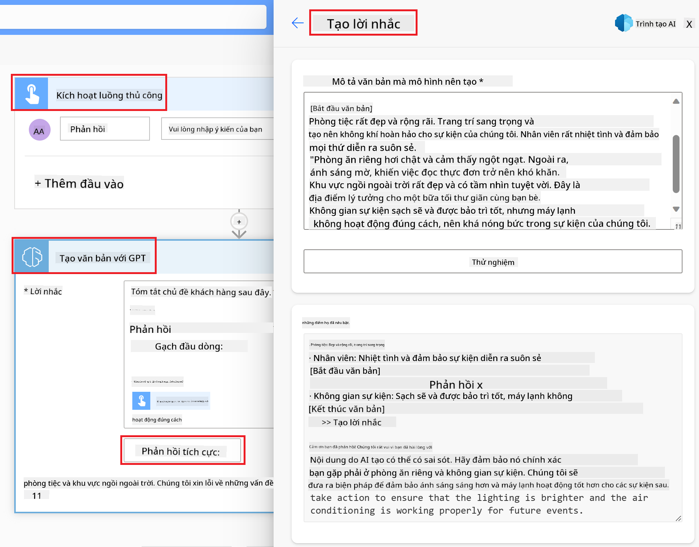

<!--
CO_OP_TRANSLATOR_METADATA:
{
  "original_hash": "846ac8e3b7dcfb697d3309fec05f0fea",
  "translation_date": "2025-10-17T20:35:20+00:00",
  "source_file": "10-building-low-code-ai-applications/README.md",
  "language_code": "vi"
}
-->
# Xây dựng ứng dụng AI mã thấp

> _(Nhấp vào hình ảnh trên để xem video bài học này)_

## Giới thiệu

Bây giờ chúng ta đã học cách xây dựng ứng dụng tạo hình ảnh, hãy nói về mã thấp. AI tạo sinh có thể được sử dụng trong nhiều lĩnh vực khác nhau, bao gồm mã thấp, nhưng mã thấp là gì và làm thế nào chúng ta có thể thêm AI vào đó?

Việc xây dựng ứng dụng và giải pháp đã trở nên dễ dàng hơn đối với các nhà phát triển truyền thống và cả những người không phải là nhà phát triển thông qua việc sử dụng các nền tảng phát triển mã thấp. Các nền tảng phát triển mã thấp cho phép bạn xây dựng ứng dụng và giải pháp với rất ít hoặc không cần mã. Điều này được thực hiện bằng cách cung cấp một môi trường phát triển trực quan, cho phép bạn kéo và thả các thành phần để xây dựng ứng dụng và giải pháp. Điều này giúp bạn xây dựng ứng dụng và giải pháp nhanh hơn và với ít tài nguyên hơn. Trong bài học này, chúng ta sẽ đi sâu vào cách sử dụng mã thấp và cách nâng cao phát triển mã thấp với AI bằng Power Platform.

Power Platform cung cấp cho các tổ chức cơ hội để trao quyền cho đội ngũ của họ tự xây dựng các giải pháp thông qua một môi trường mã thấp hoặc không mã trực quan. Môi trường này giúp đơn giản hóa quá trình xây dựng giải pháp. Với Power Platform, các giải pháp có thể được xây dựng trong vài ngày hoặc vài tuần thay vì vài tháng hoặc vài năm. Power Platform bao gồm năm sản phẩm chính: Power Apps, Power Automate, Power BI, Power Pages và Copilot Studio.

Bài học này bao gồm:

- Giới thiệu về AI tạo sinh trong Power Platform
- Giới thiệu về Copilot và cách sử dụng nó
- Sử dụng AI tạo sinh để xây dựng ứng dụng và luồng trong Power Platform
- Hiểu các mô hình AI trong Power Platform với AI Builder

## Mục tiêu học tập

Kết thúc bài học này, bạn sẽ có thể:

- Hiểu cách Copilot hoạt động trong Power Platform.

- Xây dựng ứng dụng theo dõi bài tập của học sinh cho startup giáo dục của chúng ta.

- Xây dựng luồng xử lý hóa đơn sử dụng AI để trích xuất thông tin từ hóa đơn.

- Áp dụng các thực hành tốt nhất khi sử dụng mô hình AI Tạo Văn Bản với GPT.

Các công cụ và công nghệ bạn sẽ sử dụng trong bài học này bao gồm:

- **Power Apps**, để xây dựng ứng dụng theo dõi bài tập của học sinh, cung cấp môi trường phát triển mã thấp để xây dựng ứng dụng theo dõi, quản lý và tương tác với dữ liệu.

- **Dataverse**, để lưu trữ dữ liệu cho ứng dụng theo dõi bài tập của học sinh, nơi Dataverse sẽ cung cấp nền tảng dữ liệu mã thấp để lưu trữ dữ liệu của ứng dụng.

- **Power Automate**, để xây dựng luồng xử lý hóa đơn, nơi bạn sẽ có môi trường phát triển mã thấp để xây dựng các luồng công việc tự động hóa quy trình xử lý hóa đơn.

- **AI Builder**, để xây dựng mô hình AI xử lý hóa đơn, nơi bạn sẽ sử dụng các mô hình AI được xây dựng sẵn để xử lý hóa đơn cho startup của chúng ta.

## AI tạo sinh trong Power Platform

Nâng cao phát triển mã thấp và ứng dụng với AI tạo sinh là một lĩnh vực trọng tâm chính của Power Platform. Mục tiêu là cho phép mọi người xây dựng ứng dụng, trang web, bảng điều khiển và tự động hóa quy trình với AI, _mà không cần chuyên môn về khoa học dữ liệu_. Mục tiêu này được thực hiện bằng cách tích hợp AI tạo sinh vào trải nghiệm phát triển mã thấp trong Power Platform dưới dạng Copilot và AI Builder.

### Điều này hoạt động như thế nào?

Copilot là một trợ lý AI cho phép bạn xây dựng các giải pháp Power Platform bằng cách mô tả yêu cầu của bạn thông qua một loạt các bước hội thoại sử dụng ngôn ngữ tự nhiên. Ví dụ, bạn có thể hướng dẫn trợ lý AI của mình nêu rõ các trường mà ứng dụng của bạn sẽ sử dụng và nó sẽ tạo cả ứng dụng và mô hình dữ liệu cơ bản hoặc bạn có thể chỉ định cách thiết lập một luồng trong Power Automate.

Bạn có thể sử dụng các chức năng do Copilot điều khiển như một tính năng trong màn hình ứng dụng của bạn để cho phép người dùng khám phá thông tin chi tiết thông qua các tương tác hội thoại.

AI Builder là một khả năng AI mã thấp có sẵn trong Power Platform, cho phép bạn sử dụng các mô hình AI để giúp bạn tự động hóa quy trình và dự đoán kết quả. Với AI Builder, bạn có thể mang AI vào ứng dụng và luồng của mình kết nối với dữ liệu trong Dataverse hoặc trong các nguồn dữ liệu đám mây khác nhau, chẳng hạn như SharePoint, OneDrive hoặc Azure.

Copilot có sẵn trong tất cả các sản phẩm của Power Platform: Power Apps, Power Automate, Power BI, Power Pages và Power Virtual Agents. AI Builder có sẵn trong Power Apps và Power Automate. Trong bài học này, chúng ta sẽ tập trung vào cách sử dụng Copilot và AI Builder trong Power Apps và Power Automate để xây dựng giải pháp cho startup giáo dục của chúng ta.

### Copilot trong Power Apps

Là một phần của Power Platform, Power Apps cung cấp môi trường phát triển mã thấp để xây dựng ứng dụng theo dõi, quản lý và tương tác với dữ liệu. Đây là một bộ dịch vụ phát triển ứng dụng với nền tảng dữ liệu có khả năng mở rộng và khả năng kết nối với các dịch vụ đám mây và dữ liệu tại chỗ. Power Apps cho phép bạn xây dựng ứng dụng chạy trên trình duyệt, máy tính bảng và điện thoại, và có thể được chia sẻ với đồng nghiệp. Power Apps giúp người dùng dễ dàng tiếp cận phát triển ứng dụng với giao diện đơn giản, để mọi người dùng doanh nghiệp hoặc nhà phát triển chuyên nghiệp đều có thể xây dựng ứng dụng tùy chỉnh. Trải nghiệm phát triển ứng dụng cũng được nâng cao với AI tạo sinh thông qua Copilot.

Tính năng trợ lý AI Copilot trong Power Apps cho phép bạn mô tả loại ứng dụng bạn cần và thông tin bạn muốn ứng dụng của mình theo dõi, thu thập hoặc hiển thị. Copilot sau đó sẽ tạo một ứng dụng Canvas đáp ứng dựa trên mô tả của bạn. Bạn có thể tùy chỉnh ứng dụng để đáp ứng nhu cầu của mình. AI Copilot cũng tạo và gợi ý một bảng Dataverse với các trường bạn cần để lưu trữ dữ liệu bạn muốn theo dõi và một số dữ liệu mẫu. Chúng ta sẽ tìm hiểu Dataverse là gì và cách bạn có thể sử dụng nó trong Power Apps trong bài học này sau. Bạn có thể tùy chỉnh bảng để đáp ứng nhu cầu của mình bằng tính năng trợ lý AI Copilot thông qua các bước hội thoại. Tính năng này có sẵn ngay từ màn hình chính của Power Apps.

### Copilot trong Power Automate

Là một phần của Power Platform, Power Automate cho phép người dùng tạo các luồng công việc tự động giữa các ứng dụng và dịch vụ. Nó giúp tự động hóa các quy trình kinh doanh lặp lại như giao tiếp, thu thập dữ liệu và phê duyệt quyết định. Giao diện đơn giản của nó cho phép người dùng ở mọi trình độ kỹ thuật (từ người mới bắt đầu đến nhà phát triển dày dạn kinh nghiệm) tự động hóa các nhiệm vụ công việc. Trải nghiệm phát triển luồng công việc cũng được nâng cao với AI tạo sinh thông qua Copilot.

Tính năng trợ lý AI Copilot trong Power Automate cho phép bạn mô tả loại luồng bạn cần và các hành động bạn muốn luồng của mình thực hiện. Copilot sau đó sẽ tạo một luồng dựa trên mô tả của bạn. Bạn có thể tùy chỉnh luồng để đáp ứng nhu cầu của mình. AI Copilot cũng tạo và gợi ý các hành động bạn cần để thực hiện nhiệm vụ bạn muốn tự động hóa. Chúng ta sẽ tìm hiểu luồng là gì và cách bạn có thể sử dụng chúng trong Power Automate trong bài học này sau. Bạn có thể tùy chỉnh các hành động để đáp ứng nhu cầu của mình bằng tính năng trợ lý AI Copilot thông qua các bước hội thoại. Tính năng này có sẵn ngay từ màn hình chính của Power Automate.

## Bài tập: Quản lý bài tập của học sinh và hóa đơn cho startup của chúng ta, sử dụng Copilot

Startup của chúng ta cung cấp các khóa học trực tuyến cho học sinh. Startup đã phát triển nhanh chóng và hiện đang gặp khó khăn trong việc đáp ứng nhu cầu cho các khóa học của mình. Startup đã thuê bạn làm nhà phát triển Power Platform để giúp họ xây dựng một giải pháp mã thấp để giúp họ quản lý bài tập của học sinh và hóa đơn. Giải pháp của họ nên có khả năng giúp họ theo dõi và quản lý bài tập của học sinh thông qua một ứng dụng và tự động hóa quy trình xử lý hóa đơn thông qua một luồng công việc. Bạn đã được yêu cầu sử dụng AI tạo sinh để phát triển giải pháp.

Khi bạn bắt đầu sử dụng Copilot, bạn có thể sử dụng [Thư viện Prompt Copilot Power Platform](https://github.com/pnp/powerplatform-prompts?WT.mc_id=academic-109639-somelezediko) để bắt đầu với các prompt. Thư viện này chứa danh sách các prompt mà bạn có thể sử dụng để xây dựng ứng dụng và luồng với Copilot. Bạn cũng có thể sử dụng các prompt trong thư viện để có ý tưởng về cách mô tả yêu cầu của mình cho Copilot.

### Xây dựng ứng dụng theo dõi bài tập của học sinh cho startup của chúng ta

Các giáo viên tại startup của chúng ta đã gặp khó khăn trong việc theo dõi bài tập của học sinh. Họ đã sử dụng bảng tính để theo dõi bài tập nhưng điều này đã trở nên khó quản lý khi số lượng học sinh tăng lên. Họ đã yêu cầu bạn xây dựng một ứng dụng giúp họ theo dõi và quản lý bài tập của học sinh. Ứng dụng nên cho phép họ thêm bài tập mới, xem bài tập, cập nhật bài tập và xóa bài tập. Ứng dụng cũng nên cho phép giáo viên và học sinh xem các bài tập đã được chấm điểm và những bài tập chưa được chấm điểm.

Bạn sẽ xây dựng ứng dụng bằng Copilot trong Power Apps theo các bước dưới đây:

1. Điều hướng đến màn hình chính của [Power Apps](https://make.powerapps.com?WT.mc_id=academic-105485-koreyst).

1. Sử dụng khu vực văn bản trên màn hình chính để mô tả ứng dụng bạn muốn xây dựng. Ví dụ, **_Tôi muốn xây dựng một ứng dụng để theo dõi và quản lý bài tập của học sinh_**. Nhấp vào nút **Gửi** để gửi prompt đến AI Copilot.

1. AI Copilot sẽ gợi ý một bảng Dataverse với các trường bạn cần để lưu trữ dữ liệu bạn muốn theo dõi và một số dữ liệu mẫu. Bạn có thể tùy chỉnh bảng để đáp ứng nhu cầu của mình bằng tính năng trợ lý AI Copilot thông qua các bước hội thoại.

   > **Quan trọng**: Dataverse là nền tảng dữ liệu cơ bản cho Power Platform. Đây là một nền tảng dữ liệu mã thấp để lưu trữ dữ liệu của ứng dụng. Đây là một dịch vụ được quản lý hoàn toàn, lưu trữ dữ liệu một cách an toàn trong Microsoft Cloud và được cung cấp trong môi trường Power Platform của bạn. Nó đi kèm với các khả năng quản trị dữ liệu tích hợp, chẳng hạn như phân loại dữ liệu, nguồn gốc dữ liệu, kiểm soát truy cập chi tiết và nhiều hơn nữa. Bạn có thể tìm hiểu thêm về Dataverse [tại đây](https://docs.microsoft.com/powerapps/maker/data-platform/data-platform-intro?WT.mc_id=academic-109639-somelezediko).

   

1. Giáo viên muốn gửi email cho học sinh đã nộp bài tập để cập nhật tiến độ bài tập của họ. Bạn có thể sử dụng Copilot để thêm một trường mới vào bảng để lưu trữ email của học sinh. Ví dụ, bạn có thể sử dụng prompt sau để thêm một trường mới vào bảng: **_Tôi muốn thêm một cột để lưu trữ email của học sinh_**. Nhấp vào nút **Gửi** để gửi prompt đến AI Copilot.

1. AI Copilot sẽ tạo một trường mới và bạn có thể tùy chỉnh trường để đáp ứng nhu cầu của mình.

1. Khi bạn hoàn tất bảng, nhấp vào nút **Tạo ứng dụng** để tạo ứng dụng.

1. AI Copilot sẽ tạo một ứng dụng Canvas đáp ứng dựa trên mô tả của bạn. Bạn có thể tùy chỉnh ứng dụng để đáp ứng nhu cầu của mình.

1. Để giáo viên gửi email cho học sinh, bạn có thể sử dụng Copilot để thêm một màn hình mới vào ứng dụng. Ví dụ, bạn có thể sử dụng prompt sau để thêm một màn hình mới vào ứng dụng: **_Tôi muốn thêm một màn hình để gửi email cho học sinh_**. Nhấp vào nút **Gửi** để gửi prompt đến AI Copilot.

1. AI Copilot sẽ tạo một màn hình mới và bạn có thể tùy chỉnh màn hình để đáp ứng nhu cầu của mình.

1. Khi bạn hoàn tất ứng dụng, nhấp vào nút **Lưu** để lưu ứng dụng.

1. Để chia sẻ ứng dụng với giáo viên, nhấp vào nút **Chia sẻ** và sau đó nhấp vào nút **Chia sẻ** một lần nữa. Bạn có thể chia sẻ ứng dụng với giáo viên bằng cách nhập địa chỉ email của họ.

> **Bài tập về nhà của bạn**: Ứng dụng bạn vừa xây dựng là một khởi đầu tốt nhưng có thể được cải thiện. Với tính năng email, giáo viên chỉ có thể gửi email cho học sinh một cách thủ công bằng cách phải nhập email của họ. Bạn có thể sử dụng Copilot để xây dựng một tự động hóa cho phép giáo viên gửi email cho học sinh một cách tự động khi họ nộp bài tập không? Gợi ý của bạn là với prompt đúng, bạn có thể sử dụng Copilot trong Power Automate để xây dựng điều này.

### Xây dựng bảng thông tin hóa đơn cho startup của chúng ta

Đội ngũ tài chính của startup của chúng ta đã gặp khó khăn trong việc theo dõi hóa đơn. Họ đã sử dụng bảng tính để theo dõi hóa đơn nhưng điều này đã trở nên khó quản lý khi số lượng hóa đơn tăng lên. Họ đã yêu cầu bạn xây dựng một bảng giúp họ lưu trữ, theo dõi và quản lý thông tin của các hóa đơn họ nhận được. Bảng này nên được sử dụng để xây dựng một tự động hóa sẽ trích xuất tất cả thông tin hóa đơn và lưu trữ nó trong bảng. Bảng cũng nên cho phép đội ngũ tài chính xem các hóa đơn đã được thanh toán và những hóa đơn chưa được thanh toán.

Power Platform có một nền tảng dữ liệu cơ bản gọi là Dataverse, cho phép bạn lưu trữ dữ liệu cho ứng dụng và giải pháp của mình. Dataverse cung cấp một nền tảng dữ liệu mã thấp để lưu trữ dữ liệu của ứng dụng. Đây là một dịch vụ được quản lý hoàn toàn, lưu trữ dữ liệu một cách an toàn trong Microsoft Cloud và được cung cấp trong môi trường Power Platform của bạn. Nó đi kèm với các khả năng quản trị dữ liệu tích hợp, chẳng hạn như phân loại dữ liệu, nguồn gốc dữ liệu, kiểm soát truy cập chi tiết và nhiều hơn nữa. Bạn có thể tìm hiểu thêm [về Dataverse tại đây](https://docs.microsoft.com/powerapps/maker/data-platform/data-platform-intro?WT.mc_id=academic-109639-somelezediko).
Tại sao chúng ta nên sử dụng Dataverse cho startup của mình? Các bảng tiêu chuẩn và tùy chỉnh trong Dataverse cung cấp một tùy chọn lưu trữ an toàn và dựa trên đám mây cho dữ liệu của bạn. Các bảng cho phép bạn lưu trữ các loại dữ liệu khác nhau, tương tự như cách bạn sử dụng nhiều bảng tính trong một tệp Excel. Bạn có thể sử dụng các bảng để lưu trữ dữ liệu phù hợp với nhu cầu của tổ chức hoặc doanh nghiệp của mình. Một số lợi ích mà startup của chúng ta sẽ nhận được khi sử dụng Dataverse bao gồm nhưng không giới hạn:

- **Dễ quản lý**: Cả metadata và dữ liệu đều được lưu trữ trên đám mây, vì vậy bạn không cần lo lắng về cách chúng được lưu trữ hoặc quản lý. Bạn có thể tập trung vào việc xây dựng ứng dụng và giải pháp của mình.

- **An toàn**: Dataverse cung cấp một tùy chọn lưu trữ an toàn và dựa trên đám mây cho dữ liệu của bạn. Bạn có thể kiểm soát ai có quyền truy cập vào dữ liệu trong các bảng của mình và cách họ có thể truy cập thông qua bảo mật dựa trên vai trò.

- **Metadata phong phú**: Các loại dữ liệu và mối quan hệ được sử dụng trực tiếp trong Power Apps.

- **Logic và xác thực**: Bạn có thể sử dụng các quy tắc kinh doanh, trường tính toán và quy tắc xác thực để thực thi logic kinh doanh và duy trì độ chính xác của dữ liệu.

Bây giờ bạn đã biết Dataverse là gì và tại sao nên sử dụng nó, hãy cùng xem cách bạn có thể sử dụng Copilot để tạo một bảng trong Dataverse nhằm đáp ứng yêu cầu của đội ngũ tài chính của chúng ta.

> **Note**: Bạn sẽ sử dụng bảng này trong phần tiếp theo để xây dựng một quy trình tự động trích xuất tất cả thông tin hóa đơn và lưu trữ vào bảng.

Để tạo một bảng trong Dataverse bằng Copilot, hãy làm theo các bước dưới đây:

1. Truy cập vào màn hình chính của [Power Apps](https://make.powerapps.com?WT.mc_id=academic-105485-koreyst).

2. Trên thanh điều hướng bên trái, chọn **Tables** và sau đó nhấp vào **Describe the new Table**.

3. Trên màn hình **Describe the new Table**, sử dụng khu vực văn bản để mô tả bảng bạn muốn tạo. Ví dụ, **_Tôi muốn tạo một bảng để lưu trữ thông tin hóa đơn_**. Nhấp vào nút **Send** để gửi yêu cầu đến AI Copilot.

4. AI Copilot sẽ gợi ý một bảng Dataverse với các trường bạn cần để lưu trữ dữ liệu mà bạn muốn theo dõi và một số dữ liệu mẫu. Sau đó, bạn có thể tùy chỉnh bảng để phù hợp với nhu cầu của mình bằng tính năng trợ lý AI Copilot thông qua các bước hội thoại.

5. Đội ngũ tài chính muốn gửi email cho nhà cung cấp để cập nhật trạng thái hiện tại của hóa đơn. Bạn có thể sử dụng Copilot để thêm một trường mới vào bảng để lưu trữ email của nhà cung cấp. Ví dụ, bạn có thể sử dụng yêu cầu sau để thêm một trường mới vào bảng: **_Tôi muốn thêm một cột để lưu trữ email của nhà cung cấp_**. Nhấp vào nút **Send** để gửi yêu cầu đến AI Copilot.

6. AI Copilot sẽ tạo một trường mới và sau đó bạn có thể tùy chỉnh trường để phù hợp với nhu cầu của mình.

7. Sau khi hoàn tất bảng, nhấp vào nút **Create** để tạo bảng.

## Các mô hình AI trong Power Platform với AI Builder

AI Builder là một khả năng AI mã thấp có sẵn trong Power Platform, cho phép bạn sử dụng các mô hình AI để giúp tự động hóa quy trình và dự đoán kết quả. Với AI Builder, bạn có thể mang AI vào ứng dụng và quy trình của mình kết nối với dữ liệu trong Dataverse hoặc các nguồn dữ liệu đám mây khác, chẳng hạn như SharePoint, OneDrive hoặc Azure.

## Mô hình AI có sẵn và mô hình AI tùy chỉnh

AI Builder cung cấp hai loại mô hình AI: Mô hình AI có sẵn và Mô hình AI tùy chỉnh. Mô hình AI có sẵn là các mô hình AI đã được Microsoft đào tạo và có sẵn trong Power Platform. Những mô hình này giúp bạn thêm trí tuệ vào ứng dụng và quy trình của mình mà không cần phải thu thập dữ liệu, sau đó xây dựng, đào tạo và xuất bản các mô hình của riêng bạn. Bạn có thể sử dụng các mô hình này để tự động hóa quy trình và dự đoán kết quả.

Một số mô hình AI có sẵn trong Power Platform bao gồm:

- **Trích xuất cụm từ chính**: Mô hình này trích xuất các cụm từ chính từ văn bản.
- **Phát hiện ngôn ngữ**: Mô hình này phát hiện ngôn ngữ của văn bản.
- **Phân tích cảm xúc**: Mô hình này phát hiện cảm xúc tích cực, tiêu cực, trung lập hoặc hỗn hợp trong văn bản.
- **Đọc thẻ kinh doanh**: Mô hình này trích xuất thông tin từ thẻ kinh doanh.
- **Nhận dạng văn bản**: Mô hình này trích xuất văn bản từ hình ảnh.
- **Phát hiện đối tượng**: Mô hình này phát hiện và trích xuất các đối tượng từ hình ảnh.
- **Xử lý tài liệu**: Mô hình này trích xuất thông tin từ biểu mẫu.
- **Xử lý hóa đơn**: Mô hình này trích xuất thông tin từ hóa đơn.

Với Mô hình AI tùy chỉnh, bạn có thể mang mô hình của riêng mình vào AI Builder để nó hoạt động như bất kỳ mô hình tùy chỉnh nào của AI Builder, cho phép bạn đào tạo mô hình bằng dữ liệu của riêng mình. Bạn có thể sử dụng các mô hình này để tự động hóa quy trình và dự đoán kết quả trong cả Power Apps và Power Automate. Khi sử dụng mô hình của riêng bạn, có một số hạn chế áp dụng. Đọc thêm về các [hạn chế](https://learn.microsoft.com/ai-builder/byo-model#limitations?WT.mc_id=academic-105485-koreyst).

## Bài tập #2 - Xây dựng quy trình xử lý hóa đơn cho startup của chúng ta

Đội ngũ tài chính đã gặp khó khăn trong việc xử lý hóa đơn. Họ đã sử dụng bảng tính để theo dõi hóa đơn nhưng việc này trở nên khó quản lý khi số lượng hóa đơn tăng lên. Họ đã yêu cầu bạn xây dựng một quy trình làm việc giúp họ xử lý hóa đơn bằng AI. Quy trình làm việc này sẽ cho phép họ trích xuất thông tin từ hóa đơn và lưu trữ thông tin vào bảng Dataverse. Quy trình làm việc cũng sẽ cho phép họ gửi email cho đội ngũ tài chính với thông tin đã được trích xuất.

Bây giờ bạn đã biết AI Builder là gì và tại sao nên sử dụng nó, hãy cùng xem cách bạn có thể sử dụng Mô hình AI Xử lý Hóa đơn trong AI Builder, mà chúng ta đã đề cập trước đó, để xây dựng một quy trình làm việc giúp đội ngũ tài chính xử lý hóa đơn.

Để xây dựng một quy trình làm việc giúp đội ngũ tài chính xử lý hóa đơn bằng Mô hình AI Xử lý Hóa đơn trong AI Builder, hãy làm theo các bước dưới đây:

1. Truy cập vào màn hình chính của [Power Automate](https://make.powerautomate.com?WT.mc_id=academic-105485-koreyst).

2. Sử dụng khu vực văn bản trên màn hình chính để mô tả quy trình làm việc bạn muốn xây dựng. Ví dụ, **_Xử lý hóa đơn khi nó đến trong hộp thư của tôi_**. Nhấp vào nút **Send** để gửi yêu cầu đến AI Copilot.

   

3. AI Copilot sẽ gợi ý các hành động bạn cần thực hiện để tự động hóa nhiệm vụ bạn muốn. Bạn có thể nhấp vào nút **Next** để tiếp tục các bước tiếp theo.

4. Ở bước tiếp theo, Power Automate sẽ yêu cầu bạn thiết lập các kết nối cần thiết cho quy trình. Sau khi hoàn tất, nhấp vào nút **Create flow** để tạo quy trình.

5. AI Copilot sẽ tạo một quy trình và sau đó bạn có thể tùy chỉnh quy trình để phù hợp với nhu cầu của mình.

6. Cập nhật trình kích hoạt của quy trình và đặt **Folder** vào thư mục nơi hóa đơn sẽ được lưu trữ. Ví dụ, bạn có thể đặt thư mục là **Inbox**. Nhấp vào **Show advanced options** và đặt **Only with Attachments** thành **Yes**. Điều này sẽ đảm bảo rằng quy trình chỉ chạy khi một email có tệp đính kèm được nhận trong thư mục.

7. Xóa các hành động sau khỏi quy trình: **HTML to text**, **Compose**, **Compose 2**, **Compose 3** và **Compose 4** vì bạn sẽ không sử dụng chúng.

8. Xóa hành động **Condition** khỏi quy trình vì bạn sẽ không sử dụng nó. Quy trình sẽ trông giống như ảnh chụp màn hình sau:

   

9. Nhấp vào nút **Add an action** và tìm kiếm **Dataverse**. Chọn hành động **Add a new row**.

10. Trên hành động **Extract Information from invoices**, cập nhật **Invoice File** để trỏ đến **Attachment Content** từ email. Điều này sẽ đảm bảo rằng quy trình trích xuất thông tin từ tệp đính kèm hóa đơn.

11. Chọn **Table** bạn đã tạo trước đó. Ví dụ, bạn có thể chọn bảng **Invoice Information**. Chọn nội dung động từ hành động trước đó để điền vào các trường sau:

    - ID
    - Amount
    - Date
    - Name
    - Status - Đặt **Status** thành **Pending**.
    - Supplier Email - Sử dụng nội dung động **From** từ trình kích hoạt **When a new email arrives**.

    

12. Sau khi hoàn tất quy trình, nhấp vào nút **Save** để lưu quy trình. Sau đó, bạn có thể kiểm tra quy trình bằng cách gửi một email có hóa đơn đến thư mục bạn đã chỉ định trong trình kích hoạt.

> **Bài tập về nhà của bạn**: Quy trình bạn vừa xây dựng là một khởi đầu tốt, bây giờ bạn cần suy nghĩ cách xây dựng một quy trình tự động cho phép đội ngũ tài chính của chúng ta gửi email cho nhà cung cấp để cập nhật trạng thái hiện tại của hóa đơn. Gợi ý của bạn: quy trình phải chạy khi trạng thái của hóa đơn thay đổi.

## Sử dụng Mô hình AI Tạo Văn Bản trong Power Automate

Mô hình AI Tạo Văn Bản với GPT trong AI Builder cho phép bạn tạo văn bản dựa trên một yêu cầu và được hỗ trợ bởi Microsoft Azure OpenAI Service. Với khả năng này, bạn có thể tích hợp công nghệ GPT (Generative Pre-Trained Transformer) vào ứng dụng và quy trình của mình để xây dựng nhiều quy trình tự động và ứng dụng thông minh.

Các mô hình GPT trải qua quá trình đào tạo rộng rãi trên lượng dữ liệu lớn, cho phép chúng tạo ra văn bản gần giống ngôn ngữ con người khi được cung cấp một yêu cầu. Khi được tích hợp với tự động hóa quy trình làm việc, các mô hình AI như GPT có thể được tận dụng để hợp lý hóa và tự động hóa nhiều nhiệm vụ.

Ví dụ, bạn có thể xây dựng các quy trình để tự động tạo văn bản cho nhiều trường hợp sử dụng, chẳng hạn như: bản nháp email, mô tả sản phẩm, và nhiều hơn nữa. Bạn cũng có thể sử dụng mô hình để tạo văn bản cho nhiều ứng dụng, chẳng hạn như chatbot và ứng dụng dịch vụ khách hàng, giúp nhân viên dịch vụ khách hàng phản hồi hiệu quả và nhanh chóng các yêu cầu của khách hàng.

Để tìm hiểu cách sử dụng Mô hình AI này trong Power Automate, hãy tham khảo module [Thêm trí tuệ với AI Builder và GPT](https://learn.microsoft.com/training/modules/ai-builder-text-generation/?WT.mc_id=academic-109639-somelezediko).

## Làm tốt lắm! Tiếp tục học tập

Sau khi hoàn thành bài học này, hãy xem bộ sưu tập [Học về AI Tạo Sinh](https://aka.ms/genai-collection?WT.mc_id=academic-105485-koreyst) để tiếp tục nâng cao kiến thức về AI Tạo Sinh!

Hãy chuyển sang Bài học 11, nơi chúng ta sẽ tìm hiểu cách [tích hợp AI Tạo Sinh với Gọi Hàm](../11-integrating-with-function-calling/README.md?WT.mc_id=academic-105485-koreyst)!

---

**Tuyên bố miễn trừ trách nhiệm**:  
Tài liệu này đã được dịch bằng dịch vụ dịch thuật AI [Co-op Translator](https://github.com/Azure/co-op-translator). Mặc dù chúng tôi cố gắng đảm bảo độ chính xác, xin lưu ý rằng các bản dịch tự động có thể chứa lỗi hoặc không chính xác. Tài liệu gốc bằng ngôn ngữ bản địa nên được coi là nguồn thông tin chính thức. Đối với thông tin quan trọng, khuyến nghị sử dụng dịch vụ dịch thuật chuyên nghiệp bởi con người. Chúng tôi không chịu trách nhiệm cho bất kỳ sự hiểu lầm hoặc diễn giải sai nào phát sinh từ việc sử dụng bản dịch này.