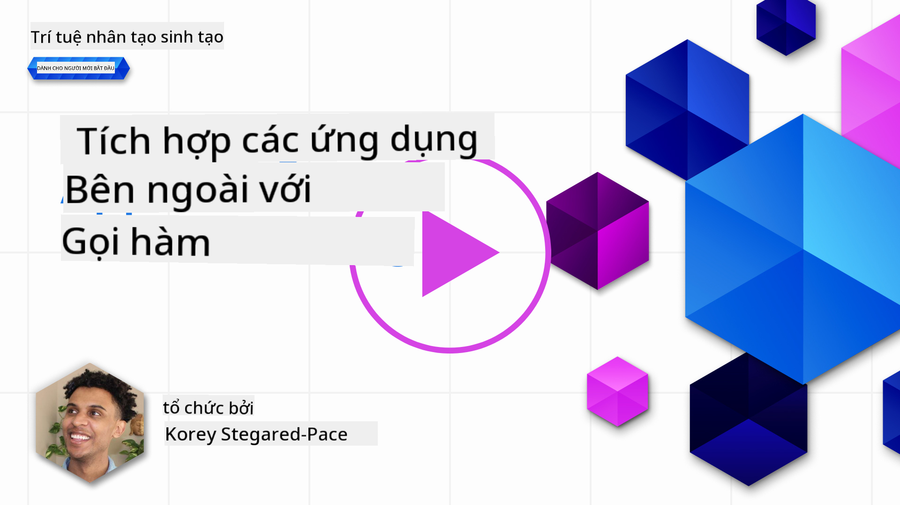
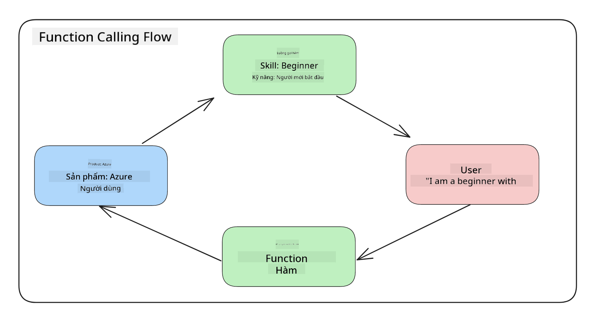
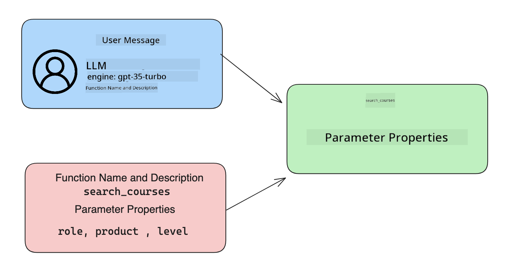

<!--
CO_OP_TRANSLATOR_METADATA:
{
  "original_hash": "77a48a201447be19aa7560706d6f93a0",
  "translation_date": "2025-07-09T14:38:38+00:00",
  "source_file": "11-integrating-with-function-calling/README.md",
  "language_code": "vi"
}
-->
# Tích hợp với gọi hàm

[](https://aka.ms/gen-ai-lesson11-gh?WT.mc_id=academic-105485-koreyst)

Bạn đã học được khá nhiều trong các bài học trước. Tuy nhiên, chúng ta có thể cải thiện hơn nữa. Một số vấn đề cần giải quyết là làm thế nào để có được định dạng phản hồi nhất quán hơn nhằm dễ dàng xử lý phản hồi ở các bước tiếp theo. Ngoài ra, chúng ta cũng có thể muốn thêm dữ liệu từ các nguồn khác để làm phong phú thêm ứng dụng của mình.

Những vấn đề được đề cập ở trên chính là những gì chương này sẽ giải quyết.

## Giới thiệu

Bài học này sẽ bao gồm:

- Giải thích gọi hàm là gì và các trường hợp sử dụng của nó.
- Tạo một cuộc gọi hàm sử dụng Azure OpenAI.
- Cách tích hợp cuộc gọi hàm vào ứng dụng.

## Mục tiêu học tập

Kết thúc bài học này, bạn sẽ có thể:

- Giải thích mục đích sử dụng gọi hàm.
- Thiết lập Function Call sử dụng Azure OpenAI Service.
- Thiết kế các cuộc gọi hàm hiệu quả cho trường hợp sử dụng của ứng dụng bạn.

## Kịch bản: Cải thiện chatbot với các hàm

Trong bài học này, chúng ta muốn xây dựng một tính năng cho startup giáo dục của mình, cho phép người dùng sử dụng chatbot để tìm các khóa học kỹ thuật. Chúng ta sẽ đề xuất các khóa học phù hợp với trình độ kỹ năng, vai trò hiện tại và công nghệ mà họ quan tâm.

Để hoàn thành kịch bản này, chúng ta sẽ sử dụng kết hợp:

- `Azure OpenAI` để tạo trải nghiệm trò chuyện cho người dùng.
- `Microsoft Learn Catalog API` để giúp người dùng tìm khóa học dựa trên yêu cầu.
- `Function Calling` để lấy truy vấn của người dùng và gửi đến một hàm để thực hiện yêu cầu API.

Để bắt đầu, hãy xem tại sao chúng ta lại muốn sử dụng gọi hàm ngay từ đầu:

## Tại sao lại dùng Function Calling

Trước khi có gọi hàm, các phản hồi từ LLM thường không có cấu trúc và không nhất quán. Các nhà phát triển phải viết mã kiểm tra phức tạp để đảm bảo có thể xử lý mọi biến thể của phản hồi. Người dùng cũng không thể nhận được câu trả lời như "Thời tiết hiện tại ở Stockholm như thế nào?". Điều này là do các mô hình bị giới hạn bởi dữ liệu được huấn luyện.

Function Calling là một tính năng của Azure OpenAI Service nhằm khắc phục các hạn chế sau:

- **Định dạng phản hồi nhất quán**. Nếu chúng ta kiểm soát tốt hơn định dạng phản hồi, việc tích hợp phản hồi vào các hệ thống khác sẽ dễ dàng hơn.
- **Dữ liệu bên ngoài**. Khả năng sử dụng dữ liệu từ các nguồn khác của ứng dụng trong ngữ cảnh trò chuyện.

## Minh họa vấn đề qua một kịch bản

> Chúng tôi khuyên bạn sử dụng [notebook đính kèm](../../../11-integrating-with-function-calling/python/aoai-assignment.ipynb) nếu muốn chạy kịch bản dưới đây. Bạn cũng có thể chỉ đọc để hiểu cách các hàm có thể giúp giải quyết vấn đề.

Hãy xem ví dụ minh họa vấn đề về định dạng phản hồi:

Giả sử chúng ta muốn tạo một cơ sở dữ liệu về thông tin sinh viên để có thể đề xuất khóa học phù hợp. Dưới đây là hai mô tả về sinh viên có dữ liệu rất giống nhau.

1. Tạo kết nối đến tài nguyên Azure OpenAI của chúng ta:

   ```python
   import os
   import json
   from openai import AzureOpenAI
   from dotenv import load_dotenv
   load_dotenv()

   client = AzureOpenAI(
   api_key=os.environ['AZURE_OPENAI_API_KEY'],  # this is also the default, it can be omitted
   api_version = "2023-07-01-preview"
   )

   deployment=os.environ['AZURE_OPENAI_DEPLOYMENT']
   ```

   Dưới đây là một đoạn mã Python để cấu hình kết nối đến Azure OpenAI, trong đó chúng ta thiết lập `api_type`, `api_base`, `api_version` và `api_key`.

1. Tạo hai mô tả sinh viên sử dụng biến `student_1_description` và `student_2_description`.

   ```python
   student_1_description="Emily Johnson is a sophomore majoring in computer science at Duke University. She has a 3.7 GPA. Emily is an active member of the university's Chess Club and Debate Team. She hopes to pursue a career in software engineering after graduating."

   student_2_description = "Michael Lee is a sophomore majoring in computer science at Stanford University. He has a 3.8 GPA. Michael is known for his programming skills and is an active member of the university's Robotics Club. He hopes to pursue a career in artificial intelligence after finishing his studies."
   ```

   Chúng ta muốn gửi các mô tả sinh viên trên đến LLM để phân tích dữ liệu. Dữ liệu này sau đó có thể được sử dụng trong ứng dụng và gửi đến API hoặc lưu vào cơ sở dữ liệu.

1. Tạo hai prompt giống hệt nhau, trong đó chúng ta hướng dẫn LLM thông tin mà chúng ta quan tâm:

   ```python
   prompt1 = f'''
   Please extract the following information from the given text and return it as a JSON object:

   name
   major
   school
   grades
   club

   This is the body of text to extract the information from:
   {student_1_description}
   '''

   prompt2 = f'''
   Please extract the following information from the given text and return it as a JSON object:

   name
   major
   school
   grades
   club

   This is the body of text to extract the information from:
   {student_2_description}
   '''
   ```

   Các prompt trên yêu cầu LLM trích xuất thông tin và trả về phản hồi dưới dạng JSON.

1. Sau khi thiết lập prompt và kết nối đến Azure OpenAI, chúng ta sẽ gửi prompt đến LLM bằng cách sử dụng `openai.ChatCompletion`. Chúng ta lưu prompt trong biến `messages` và gán vai trò là `user`. Điều này nhằm mô phỏng một tin nhắn từ người dùng gửi đến chatbot.

   ```python
   # response from prompt one
   openai_response1 = client.chat.completions.create(
   model=deployment,
   messages = [{'role': 'user', 'content': prompt1}]
   )
   openai_response1.choices[0].message.content

   # response from prompt two
   openai_response2 = client.chat.completions.create(
   model=deployment,
   messages = [{'role': 'user', 'content': prompt2}]
   )
   openai_response2.choices[0].message.content
   ```

Bây giờ chúng ta có thể gửi cả hai yêu cầu đến LLM và kiểm tra phản hồi nhận được bằng cách truy cập `openai_response1['choices'][0]['message']['content']`.

1. Cuối cùng, chúng ta có thể chuyển phản hồi sang định dạng JSON bằng cách gọi `json.loads`:

   ```python
   # Loading the response as a JSON object
   json_response1 = json.loads(openai_response1.choices[0].message.content)
   json_response1
   ```

   Phản hồi 1:

   ```json
   {
     "name": "Emily Johnson",
     "major": "computer science",
     "school": "Duke University",
     "grades": "3.7",
     "club": "Chess Club"
   }
   ```

   Phản hồi 2:

   ```json
   {
     "name": "Michael Lee",
     "major": "computer science",
     "school": "Stanford University",
     "grades": "3.8 GPA",
     "club": "Robotics Club"
   }
   ```

   Mặc dù prompt giống nhau và mô tả cũng tương tự, chúng ta thấy giá trị của thuộc tính `Grades` được định dạng khác nhau, ví dụ có lúc là `3.7` hoặc `3.7 GPA`.

   Kết quả này là do LLM nhận dữ liệu không có cấu trúc dưới dạng prompt viết tay và cũng trả về dữ liệu không có cấu trúc. Chúng ta cần có định dạng có cấu trúc để biết được điều gì sẽ xảy ra khi lưu trữ hoặc sử dụng dữ liệu này.

Vậy làm thế nào để giải quyết vấn đề định dạng? Bằng cách sử dụng gọi hàm, chúng ta có thể đảm bảo nhận được dữ liệu có cấu trúc. Khi dùng gọi hàm, LLM không thực sự gọi hoặc chạy hàm nào. Thay vào đó, chúng ta tạo một cấu trúc để LLM tuân theo trong phản hồi của nó. Sau đó, chúng ta dùng các phản hồi có cấu trúc đó để biết hàm nào cần chạy trong ứng dụng.



Chúng ta có thể lấy kết quả trả về từ hàm và gửi lại cho LLM. LLM sẽ trả lời bằng ngôn ngữ tự nhiên để đáp ứng truy vấn của người dùng.

## Các trường hợp sử dụng gọi hàm

Có nhiều trường hợp sử dụng khác nhau mà gọi hàm có thể cải thiện ứng dụng của bạn như:

- **Gọi công cụ bên ngoài**. Chatbot rất giỏi trong việc trả lời câu hỏi của người dùng. Bằng cách sử dụng gọi hàm, chatbot có thể dùng tin nhắn của người dùng để thực hiện các tác vụ nhất định. Ví dụ, một sinh viên có thể yêu cầu chatbot "Gửi email cho giảng viên của tôi nói rằng tôi cần thêm trợ giúp về môn học này". Chatbot có thể gọi hàm `send_email(to: string, body: string)`.

- **Tạo truy vấn API hoặc cơ sở dữ liệu**. Người dùng có thể tìm thông tin bằng ngôn ngữ tự nhiên, sau đó được chuyển đổi thành truy vấn hoặc yêu cầu API có định dạng. Ví dụ, một giáo viên hỏi "Ai là những sinh viên đã hoàn thành bài tập cuối cùng" có thể gọi hàm `get_completed(student_name: string, assignment: int, current_status: string)`.

- **Tạo dữ liệu có cấu trúc**. Người dùng có thể lấy một đoạn văn bản hoặc CSV và dùng LLM để trích xuất thông tin quan trọng. Ví dụ, một sinh viên có thể chuyển một bài viết Wikipedia về các hiệp định hòa bình thành các flashcard AI. Việc này có thể thực hiện bằng hàm `get_important_facts(agreement_name: string, date_signed: string, parties_involved: list)`.

## Tạo cuộc gọi hàm đầu tiên của bạn

Quy trình tạo cuộc gọi hàm gồm 3 bước chính:

1. **Gọi** API Chat Completions với danh sách các hàm và một tin nhắn từ người dùng.
2. **Đọc** phản hồi của mô hình để thực hiện hành động, ví dụ gọi hàm hoặc gọi API.
3. **Thực hiện** một cuộc gọi khác đến API Chat Completions với phản hồi từ hàm để tạo câu trả lời cho người dùng.



### Bước 1 - tạo tin nhắn

Bước đầu tiên là tạo một tin nhắn người dùng. Tin nhắn này có thể được gán động bằng cách lấy giá trị từ một ô nhập liệu hoặc bạn có thể gán giá trị trực tiếp. Nếu đây là lần đầu bạn làm việc với API Chat Completions, bạn cần định nghĩa `role` và `content` của tin nhắn.

`role` có thể là `system` (tạo quy tắc), `assistant` (mô hình) hoặc `user` (người dùng cuối). Với gọi hàm, chúng ta sẽ gán là `user` và một câu hỏi ví dụ.

```python
messages= [ {"role": "user", "content": "Find me a good course for a beginner student to learn Azure."} ]
```

Việc gán các vai trò khác nhau giúp LLM hiểu rõ ai đang nói, hệ thống hay người dùng, từ đó xây dựng lịch sử hội thoại mà LLM có thể dựa vào.

### Bước 2 - tạo hàm

Tiếp theo, chúng ta sẽ định nghĩa một hàm và các tham số của hàm đó. Ở đây chúng ta chỉ dùng một hàm duy nhất tên là `search_courses` nhưng bạn có thể tạo nhiều hàm.

> **Quan trọng**: Các hàm được đưa vào tin nhắn hệ thống gửi đến LLM và sẽ tính vào số lượng token bạn có thể sử dụng.

Dưới đây, chúng ta tạo các hàm dưới dạng một mảng các phần tử. Mỗi phần tử là một hàm và có các thuộc tính `name`, `description` và `parameters`:

```python
functions = [
   {
      "name":"search_courses",
      "description":"Retrieves courses from the search index based on the parameters provided",
      "parameters":{
         "type":"object",
         "properties":{
            "role":{
               "type":"string",
               "description":"The role of the learner (i.e. developer, data scientist, student, etc.)"
            },
            "product":{
               "type":"string",
               "description":"The product that the lesson is covering (i.e. Azure, Power BI, etc.)"
            },
            "level":{
               "type":"string",
               "description":"The level of experience the learner has prior to taking the course (i.e. beginner, intermediate, advanced)"
            }
         },
         "required":[
            "role"
         ]
      }
   }
]
```

Hãy mô tả chi tiết từng phần của hàm:

- `name` - Tên hàm mà chúng ta muốn gọi.
- `description` - Mô tả cách hàm hoạt động. Ở đây cần rõ ràng và cụ thể.
- `parameters` - Danh sách các giá trị và định dạng mà bạn muốn mô hình trả về trong phản hồi. Mảng parameters gồm các phần tử có các thuộc tính sau:
  1. `type` - Kiểu dữ liệu của thuộc tính sẽ được lưu trữ.
  2. `properties` - Danh sách các giá trị cụ thể mà mô hình sẽ sử dụng trong phản hồi có định dạng.
      1. `name` - Khóa là tên thuộc tính mà mô hình sẽ dùng trong phản hồi, ví dụ `product`.
      2. `type` - Kiểu dữ liệu của thuộc tính này, ví dụ `string`.
      3. `description` - Mô tả thuộc tính cụ thể.

Ngoài ra còn có thuộc tính tùy chọn `required` - thuộc tính bắt buộc để cuộc gọi hàm hoàn thành.

### Bước 3 - Thực hiện cuộc gọi hàm

Sau khi định nghĩa hàm, chúng ta cần đưa nó vào cuộc gọi API Chat Completion. Chúng ta làm điều này bằng cách thêm `functions` vào yêu cầu. Ở đây là `functions=functions`.

Cũng có tùy chọn đặt `function_call` thành `auto`. Điều này có nghĩa là để LLM quyết định hàm nào nên được gọi dựa trên tin nhắn người dùng thay vì chúng ta chỉ định.

Dưới đây là đoạn mã gọi `ChatCompletion.create`, chú ý cách chúng ta đặt `functions=functions` và `function_call="auto"`, cho phép LLM tự chọn khi nào gọi các hàm được cung cấp:

```python
response = client.chat.completions.create(model=deployment,
                                        messages=messages,
                                        functions=functions,
                                        function_call="auto")

print(response.choices[0].message)
```

Phản hồi nhận được sẽ trông như sau:

```json
{
  "role": "assistant",
  "function_call": {
    "name": "search_courses",
    "arguments": "{\n  \"role\": \"student\",\n  \"product\": \"Azure\",\n  \"level\": \"beginner\"\n}"
  }
}
```

Ở đây ta thấy hàm `search_courses` đã được gọi với các đối số như thế nào, được liệt kê trong thuộc tính `arguments` của phản hồi JSON.

Kết luận là LLM đã tìm được dữ liệu phù hợp với các đối số của hàm khi trích xuất từ giá trị truyền vào tham số `messages` trong cuộc gọi chat completion. Dưới đây là nhắc lại giá trị `messages`:

```python
messages= [ {"role": "user", "content": "Find me a good course for a beginner student to learn Azure."} ]
```

Như bạn thấy, `student`, `Azure` và `beginner` được trích xuất từ `messages` và được dùng làm đầu vào cho hàm. Sử dụng hàm theo cách này là một cách tuyệt vời để trích xuất thông tin từ prompt đồng thời cung cấp cấu trúc cho LLM và có chức năng tái sử dụng.

Tiếp theo, chúng ta sẽ xem cách sử dụng điều này trong ứng dụng.

## Tích hợp cuộc gọi hàm vào ứng dụng

Sau khi đã thử nghiệm phản hồi có định dạng từ LLM, giờ chúng ta có thể tích hợp nó vào ứng dụng.

### Quản lý luồng xử lý

Để tích hợp vào ứng dụng, hãy thực hiện các bước sau:

1. Đầu tiên, gọi dịch vụ OpenAI và lưu tin nhắn vào biến `response_message`.

   ```python
   response_message = response.choices[0].message
   ```

1. Bây giờ định nghĩa hàm sẽ gọi Microsoft Learn API để lấy danh sách khóa học:

   ```python
   import requests

   def search_courses(role, product, level):
     url = "https://learn.microsoft.com/api/catalog/"
     params = {
        "role": role,
        "product": product,
        "level": level
     }
     response = requests.get(url, params=params)
     modules = response.json()["modules"]
     results = []
     for module in modules[:5]:
        title = module["title"]
        url = module["url"]
        results.append({"title": title, "url": url})
     return str(results)
   ```

   Lưu ý chúng ta tạo một hàm Python thực tế tương ứng với tên hàm đã định nghĩa trong biến `functions`. Đồng thời thực hiện các cuộc gọi API bên ngoài thực tế để lấy dữ liệu cần thiết. Ở đây, chúng ta gọi Microsoft Learn API để tìm kiếm các module đào tạo.

Vậy chúng ta đã tạo biến `functions` và hàm Python tương ứng, làm sao để cho LLM biết cách liên kết hai cái này để hàm Python được gọi?

1. Để kiểm tra xem có cần gọi hàm Python không, ta xem phản hồi của LLM có chứa `function_call` không và gọi hàm được chỉ định. Dưới đây là cách kiểm tra:

   ```python
   # Check if the model wants to call a function
   if response_message.function_call.name:
    print("Recommended Function call:")
    print(response_message.function_call.name)
    print()

    # Call the function.
    function_name = response_message.function_call.name

    available_functions = {
            "search_courses": search_courses,
    }
    function_to_call = available_functions[function_name]

    function_args = json.loads(response_message.function_call.arguments)
    function_response = function_to_call(**function_args)

    print("Output of function call:")
    print(function_response)
    print(type(function_response))


    # Add the assistant response and function response to the messages
    messages.append( # adding assistant response to messages
        {
            "role": response_message.role,
            "function_call": {
                "name": function_name,
                "arguments": response_message.function_call.arguments,
            },
            "content": None
        }
    )
    messages.append( # adding function response to messages
        {
            "role": "function",
            "name": function_name,
            "content":function_response,
        }
    )
   ```

   Ba dòng này đảm bảo ta trích xuất tên hàm, các đối số và thực hiện cuộc gọi:

   ```python
   function_to_call = available_functions[function_name]

   function_args = json.loads(response_message.function_call.arguments)
   function_response = function_to_call(**function_args)
   ```

   Dưới đây là kết quả khi chạy đoạn mã:

   **Kết quả**

   ```Recommended Function call:
   {
     "name": "search_courses",
     "arguments": "{\n  \"role\": \"student\",\n  \"product\": \"Azure\",\n  \"level\": \"beginner\"\n}"
   }

   Output of function call:
   [{'title': 'Describe concepts of cryptography', 'url': 'https://learn.microsoft.com/training/modules/describe-concepts-of-cryptography/?
   WT.mc_id=api_CatalogApi'}, {'title': 'Introduction to audio classification with TensorFlow', 'url': 'https://learn.microsoft.com/en-
   us/training/modules/intro-audio-classification-tensorflow/?WT.mc_id=api_CatalogApi'}, {'title': 'Design a Performant Data Model in Azure SQL
   Database with Azure Data Studio', 'url': 'https://learn.microsoft.com/training/modules/design-a-data-model-with-ads/?
   WT.mc_id=api_CatalogApi'}, {'title': 'Getting started with the Microsoft Cloud Adoption Framework for Azure', 'url':
   'https://learn.microsoft.com/training/modules/cloud-adoption-framework-getting-started/?WT.mc_id=api_CatalogApi'}, {'title': 'Set up the
   Rust development environment', 'url': 'https://learn.microsoft.com/training/modules/rust-set-up-environment/?WT.mc_id=api_CatalogApi'}]
   <class 'str'>
   ```

1. Bây giờ gửi tin nhắn cập nhật, `messages` đến LLM để nhận phản hồi bằng ngôn ngữ tự nhiên thay vì phản hồi JSON định dạng API.

   ```python
   print("Messages in next request:")
   print(messages)
   print()

   second_response = client.chat.completions.create(
      messages=messages,
      model=deployment,
      function_call="auto",
      functions=functions,
      temperature=0
         )  # get a new response from GPT where it can see the function response


   print(second_response.choices[0].message)
   ```

   **Kết quả**

   ```python
   {
     "role": "assistant",
     "content": "I found some good courses for beginner students to learn Azure:\n\n1. [Describe concepts of cryptography] (https://learn.microsoft.com/training/modules/describe-concepts-of-cryptography/?WT.mc_id=api_CatalogApi)\n2. [Introduction to audio classification with TensorFlow](https://learn.microsoft.com/training/modules/intro-audio-classification-tensorflow/?WT.mc_id=api_CatalogApi)\n3. [Design a Performant Data Model in Azure SQL Database with Azure Data Studio](https://learn.microsoft.com/training/modules/design-a-data-model-with-ads/?WT.mc_id=api_CatalogApi)\n4. [Getting started with the Microsoft Cloud Adoption Framework for Azure](https://learn.microsoft.com/training/modules/cloud-adoption-framework-getting-started/?WT.mc_id=api_CatalogApi)\n5. [Set up the Rust development environment](https://learn.microsoft.com/training/modules/rust-set-up-environment/?WT.mc_id=api_CatalogApi)\n\nYou can click on the links to access the courses."
   }

   ```

## Bài tập

Để tiếp tục học về Azure OpenAI Function Calling, bạn có thể xây dựng:

- Thêm nhiều tham số cho hàm để giúp người học tìm nhiều khóa học hơn.
- Tạo một cuộc gọi hàm khác lấy thêm thông tin từ người học như ngôn ngữ mẹ đẻ.
- Tạo xử lý lỗi khi cuộc gọi hàm và/hoặc cuộc gọi API không trả về khóa học phù hợp nào.
## Tuyệt vời! Tiếp tục hành trình

Sau khi hoàn thành bài học này, hãy khám phá bộ sưu tập [Generative AI Learning](https://aka.ms/genai-collection?WT.mc_id=academic-105485-koreyst) của chúng tôi để tiếp tục nâng cao kiến thức về Generative AI!

Hãy đến với Bài học 12, nơi chúng ta sẽ tìm hiểu cách [thiết kế UX cho các ứng dụng AI](../12-designing-ux-for-ai-applications/README.md?WT.mc_id=academic-105485-koreyst)!

**Tuyên bố từ chối trách nhiệm**:  
Tài liệu này đã được dịch bằng dịch vụ dịch thuật AI [Co-op Translator](https://github.com/Azure/co-op-translator). Mặc dù chúng tôi cố gắng đảm bảo độ chính xác, xin lưu ý rằng các bản dịch tự động có thể chứa lỗi hoặc không chính xác. Tài liệu gốc bằng ngôn ngữ gốc của nó nên được coi là nguồn chính xác và đáng tin cậy. Đối với các thông tin quan trọng, nên sử dụng dịch vụ dịch thuật chuyên nghiệp do con người thực hiện. Chúng tôi không chịu trách nhiệm về bất kỳ sự hiểu lầm hoặc giải thích sai nào phát sinh từ việc sử dụng bản dịch này.