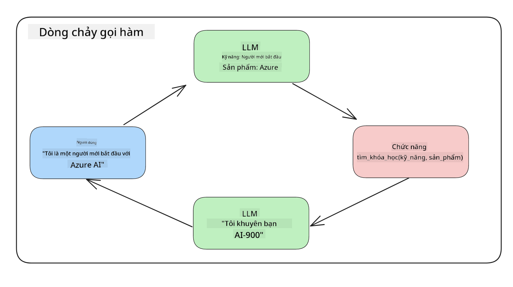
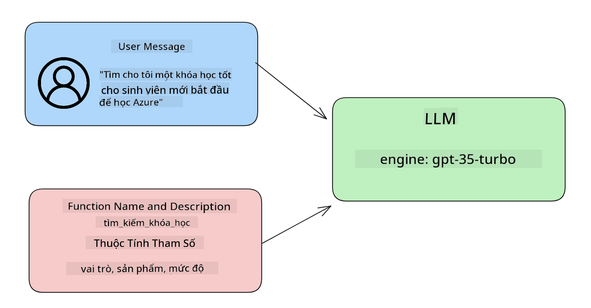

<!--
CO_OP_TRANSLATOR_METADATA:
{
  "original_hash": "77a48a201447be19aa7560706d6f93a0",
  "translation_date": "2025-05-19T21:33:36+00:00",
  "source_file": "11-integrating-with-function-calling/README.md",
  "language_code": "vi"
}
-->
# Tích hợp với gọi hàm

Bạn đã học được khá nhiều trong các bài học trước. Tuy nhiên, chúng ta có thể cải thiện thêm. Một số vấn đề chúng ta có thể giải quyết là làm thế nào để có được định dạng phản hồi nhất quán hơn để dễ dàng làm việc với phản hồi ở các bước sau. Ngoài ra, chúng ta có thể muốn thêm dữ liệu từ các nguồn khác để làm phong phú thêm ứng dụng của mình.

Những vấn đề được đề cập ở trên là những gì chương này muốn giải quyết.

## Giới thiệu

Bài học này sẽ bao gồm:

- Giải thích gọi hàm là gì và các trường hợp sử dụng của nó.
- Tạo một cuộc gọi hàm sử dụng Azure OpenAI.
- Cách tích hợp một cuộc gọi hàm vào một ứng dụng.

## Mục tiêu học tập

Kết thúc bài học này, bạn sẽ có thể:

- Giải thích mục đích của việc sử dụng gọi hàm.
- Thiết lập Gọi Hàm sử dụng Dịch vụ Azure OpenAI.
- Thiết kế các cuộc gọi hàm hiệu quả cho trường hợp sử dụng ứng dụng của bạn.

## Kịch bản: Cải thiện chatbot của chúng ta với các hàm

Trong bài học này, chúng ta muốn xây dựng một tính năng cho startup giáo dục của mình cho phép người dùng sử dụng chatbot để tìm các khóa học kỹ thuật. Chúng ta sẽ đề xuất các khóa học phù hợp với trình độ kỹ năng, vai trò hiện tại và công nghệ mà họ quan tâm.

Để hoàn thành kịch bản này, chúng ta sẽ sử dụng kết hợp của:

- `Azure OpenAI` để tạo trải nghiệm chat cho người dùng.
- `Microsoft Learn Catalog API` để giúp người dùng tìm các khóa học dựa trên yêu cầu của họ.
- `Function Calling` để lấy truy vấn của người dùng và gửi nó đến một hàm để thực hiện yêu cầu API.

Để bắt đầu, hãy xem tại sao chúng ta lại muốn sử dụng gọi hàm ngay từ đầu:

## Tại sao Gọi Hàm

Trước khi có gọi hàm, phản hồi từ một LLM không có cấu trúc và không nhất quán. Các nhà phát triển phải viết mã xác thực phức tạp để đảm bảo họ có thể xử lý từng biến thể của phản hồi. Người dùng không thể nhận được câu trả lời như "Thời tiết hiện tại ở Stockholm là gì?". Điều này là do các mô hình bị giới hạn vào thời điểm dữ liệu được huấn luyện.

Gọi Hàm là một tính năng của Dịch vụ Azure OpenAI để vượt qua những hạn chế sau:

- **Định dạng phản hồi nhất quán**. Nếu chúng ta có thể kiểm soát tốt hơn định dạng phản hồi, chúng ta có thể dễ dàng tích hợp phản hồi vào các hệ thống khác.
- **Dữ liệu bên ngoài**. Khả năng sử dụng dữ liệu từ các nguồn khác của ứng dụng trong ngữ cảnh chat.

## Minh họa vấn đề qua một kịch bản

> Chúng tôi khuyến nghị bạn sử dụng [notebook đính kèm](../../../11-integrating-with-function-calling/python/aoai-assignment.ipynb) nếu bạn muốn chạy kịch bản dưới đây. Bạn cũng có thể chỉ đọc theo khi chúng tôi đang cố gắng minh họa một vấn đề mà các hàm có thể giúp giải quyết.

Hãy xem ví dụ minh họa vấn đề định dạng phản hồi:

Giả sử chúng ta muốn tạo một cơ sở dữ liệu về dữ liệu sinh viên để chúng ta có thể gợi ý khóa học phù hợp cho họ. Dưới đây chúng ta có hai mô tả về sinh viên rất giống nhau trong dữ liệu mà chúng chứa.

1. Tạo một kết nối tới tài nguyên Azure OpenAI của chúng ta:

   ```python
   import os
   import json
   from openai import AzureOpenAI
   from dotenv import load_dotenv
   load_dotenv()

   client = AzureOpenAI(
   api_key=os.environ['AZURE_OPENAI_API_KEY'],  # this is also the default, it can be omitted
   api_version = "2023-07-01-preview"
   )

   deployment=os.environ['AZURE_OPENAI_DEPLOYMENT']
   ```

   Dưới đây là một số mã Python để cấu hình kết nối của chúng ta tới Azure OpenAI nơi chúng ta thiết lập `api_type`, `api_base`, `api_version` and `api_key`.

1. Creating two student descriptions using variables `student_1_description` and `student_2_description`.

   ```python
   student_1_description="Emily Johnson is a sophomore majoring in computer science at Duke University. She has a 3.7 GPA. Emily is an active member of the university's Chess Club and Debate Team. She hopes to pursue a career in software engineering after graduating."

   student_2_description = "Michael Lee is a sophomore majoring in computer science at Stanford University. He has a 3.8 GPA. Michael is known for his programming skills and is an active member of the university's Robotics Club. He hopes to pursue a career in artificial intelligence after finishing his studies."
   ```

   Chúng ta muốn gửi các mô tả sinh viên ở trên tới một LLM để phân tích dữ liệu. Dữ liệu này có thể được sử dụng trong ứng dụng của chúng ta và được gửi tới một API hoặc lưu trữ trong cơ sở dữ liệu.

1. Hãy tạo hai lời nhắc giống hệt nhau trong đó chúng ta hướng dẫn LLM về thông tin mà chúng ta quan tâm:

   ```python
   prompt1 = f'''
   Please extract the following information from the given text and return it as a JSON object:

   name
   major
   school
   grades
   club

   This is the body of text to extract the information from:
   {student_1_description}
   '''

   prompt2 = f'''
   Please extract the following information from the given text and return it as a JSON object:

   name
   major
   school
   grades
   club

   This is the body of text to extract the information from:
   {student_2_description}
   '''
   ```

   Các lời nhắc ở trên hướng dẫn LLM trích xuất thông tin và trả lại phản hồi ở định dạng JSON.

1. Sau khi thiết lập các lời nhắc và kết nối tới Azure OpenAI, chúng ta sẽ gửi các lời nhắc tới LLM bằng cách sử dụng `openai.ChatCompletion`. We store the prompt in the `messages` variable and assign the role to `user`. Điều này để mô phỏng một tin nhắn từ người dùng được viết tới chatbot.

   ```python
   # response from prompt one
   openai_response1 = client.chat.completions.create(
   model=deployment,
   messages = [{'role': 'user', 'content': prompt1}]
   )
   openai_response1.choices[0].message.content

   # response from prompt two
   openai_response2 = client.chat.completions.create(
   model=deployment,
   messages = [{'role': 'user', 'content': prompt2}]
   )
   openai_response2.choices[0].message.content
   ```

Giờ chúng ta có thể gửi cả hai yêu cầu tới LLM và kiểm tra phản hồi mà chúng ta nhận được bằng cách tìm nó như sau `openai_response1['choices'][0]['message']['content']`.

1. Lastly, we can convert the response to JSON format by calling `json.loads`:

   ```python
   # Loading the response as a JSON object
   json_response1 = json.loads(openai_response1.choices[0].message.content)
   json_response1
   ```

   Phản hồi 1:

   ```json
   {
     "name": "Emily Johnson",
     "major": "computer science",
     "school": "Duke University",
     "grades": "3.7",
     "club": "Chess Club"
   }
   ```

   Phản hồi 2:

   ```json
   {
     "name": "Michael Lee",
     "major": "computer science",
     "school": "Stanford University",
     "grades": "3.8 GPA",
     "club": "Robotics Club"
   }
   ```

   Mặc dù các lời nhắc giống nhau và các mô tả tương tự, chúng ta thấy các giá trị của `Grades` property formatted differently, as we can sometimes get the format `3.7` or `3.7 GPA` for example.

   This result is because the LLM takes unstructured data in the form of the written prompt and returns also unstructured data. We need to have a structured format so that we know what to expect when storing or using this data

So how do we solve the formatting problem then? By using functional calling, we can make sure that we receive structured data back. When using function calling, the LLM does not actually call or run any functions. Instead, we create a structure for the LLM to follow for its responses. We then use those structured responses to know what function to run in our applications.



We can then take what is returned from the function and send this back to the LLM. The LLM will then respond using natural language to answer the user's query.

## Use Cases for using function calls

There are many different use cases where function calls can improve your app like:

- **Calling External Tools**. Chatbots are great at providing answers to questions from users. By using function calling, the chatbots can use messages from users to complete certain tasks. For example, a student can ask the chatbot to "Send an email to my instructor saying I need more assistance with this subject". This can make a function call to `send_email(to: string, body: string)`

- **Create API or Database Queries**. Users can find information using natural language that gets converted into a formatted query or API request. An example of this could be a teacher who requests "Who are the students that completed the last assignment" which could call a function named `get_completed(student_name: string, assignment: int, current_status: string)`

- **Creating Structured Data**. Users can take a block of text or CSV and use the LLM to extract important information from it. For example, a student can convert a Wikipedia article about peace agreements to create AI flashcards. This can be done by using a function called `get_important_facts(agreement_name: string, date_signed: string, parties_involved: list)`

## Creating Your First Function Call

The process of creating a function call includes 3 main steps:

1. **Calling** the Chat Completions API with a list of your functions and a user message.
2. **Reading** the model's response to perform an action i.e. execute a function or API Call.
3. **Making** another call to Chat Completions API with the response from your function to use that information to create a response to the user.



### Step 1 - creating messages

The first step is to create a user message. This can be dynamically assigned by taking the value of a text input or you can assign a value here. If this is your first time working with the Chat Completions API, we need to define the `role` and the `content` of the message.

The `role` can be either `system` (creating rules), `assistant` (the model) or `user` (the end-user). For function calling, we will assign this as `user` và một câu hỏi ví dụ.

```python
messages= [ {"role": "user", "content": "Find me a good course for a beginner student to learn Azure."} ]
```

Bằng cách gán các vai trò khác nhau, rõ ràng hơn cho LLM nếu đó là hệ thống nói điều gì đó hay người dùng, điều này giúp xây dựng lịch sử cuộc trò chuyện mà LLM có thể phát triển.

### Bước 2 - tạo các hàm

Tiếp theo, chúng ta sẽ định nghĩa một hàm và các tham số của hàm đó. Chúng ta sẽ chỉ sử dụng một hàm ở đây gọi là `search_courses` but you can create multiple functions.

> **Important** : Functions are included in the system message to the LLM and will be included in the amount of available tokens you have available.

Below, we create the functions as an array of items. Each item is a function and has properties `name`, `description` and `parameters`:

```python
functions = [
   {
      "name":"search_courses",
      "description":"Retrieves courses from the search index based on the parameters provided",
      "parameters":{
         "type":"object",
         "properties":{
            "role":{
               "type":"string",
               "description":"The role of the learner (i.e. developer, data scientist, student, etc.)"
            },
            "product":{
               "type":"string",
               "description":"The product that the lesson is covering (i.e. Azure, Power BI, etc.)"
            },
            "level":{
               "type":"string",
               "description":"The level of experience the learner has prior to taking the course (i.e. beginner, intermediate, advanced)"
            }
         },
         "required":[
            "role"
         ]
      }
   }
]
```

Hãy mô tả chi tiết hơn từng trường hợp hàm bên dưới:

- `name` - The name of the function that we want to have called.
- `description` - This is the description of how the function works. Here it's important to be specific and clear.
- `parameters` - A list of values and format that you want the model to produce in its response. The parameters array consists of items where the items have the following properties:
  1.  `type` - The data type of the properties will be stored in.
  1.  `properties` - List of the specific values that the model will use for its response
      1. `name` - The key is the name of the property that the model will use in its formatted response, for example, `product`.
      1. `type` - The data type of this property, for example, `string`.
      1. `description` - Description of the specific property.

There's also an optional property `required` - required property for the function call to be completed.

### Step 3 - Making the function call

After defining a function, we now need to include it in the call to the Chat Completion API. We do this by adding `functions` to the request. In this case `functions=functions`.

There is also an option to set `function_call` to `auto`. This means we will let the LLM decide which function should be called based on the user message rather than assigning it ourselves.

Here's some code below where we call `ChatCompletion.create`, note how we set `functions=functions` and `function_call="auto"` và do đó cho LLM lựa chọn khi nào gọi các hàm mà chúng ta cung cấp cho nó:

```python
response = client.chat.completions.create(model=deployment,
                                        messages=messages,
                                        functions=functions,
                                        function_call="auto")

print(response.choices[0].message)
```

Phản hồi trở về bây giờ trông như thế này:

```json
{
  "role": "assistant",
  "function_call": {
    "name": "search_courses",
    "arguments": "{\n  \"role\": \"student\",\n  \"product\": \"Azure\",\n  \"level\": \"beginner\"\n}"
  }
}
```

Ở đây chúng ta có thể thấy cách hàm `search_courses` was called and with what arguments, as listed in the `arguments` property in the JSON response.

The conclusion the LLM was able to find the data to fit the arguments of the function as it was extracting it from the value provided to the `messages` parameter in the chat completion call. Below is a reminder of the `messages` giá trị:

```python
messages= [ {"role": "user", "content": "Find me a good course for a beginner student to learn Azure."} ]
```

Như bạn có thể thấy, `student`, `Azure` and `beginner` was extracted from `messages` and set as input to the function. Using functions this way is a great way to extract information from a prompt but also to provide structure to the LLM and have reusable functionality.

Next, we need to see how we can use this in our app.

## Integrating Function Calls into an Application

After we have tested the formatted response from the LLM, we can now integrate this into an application.

### Managing the flow

To integrate this into our application, let's take the following steps:

1. First, let's make the call to the OpenAI services and store the message in a variable called `response_message`.

   ```python
   response_message = response.choices[0].message
   ```

1. Giờ chúng ta sẽ định nghĩa hàm sẽ gọi API Microsoft Learn để lấy danh sách các khóa học:

   ```python
   import requests

   def search_courses(role, product, level):
     url = "https://learn.microsoft.com/api/catalog/"
     params = {
        "role": role,
        "product": product,
        "level": level
     }
     response = requests.get(url, params=params)
     modules = response.json()["modules"]
     results = []
     for module in modules[:5]:
        title = module["title"]
        url = module["url"]
        results.append({"title": title, "url": url})
     return str(results)
   ```

   Lưu ý cách chúng ta tạo một hàm Python thực tế ánh xạ tới các tên hàm đã được giới thiệu trong `functions` variable. We're also making real external API calls to fetch the data we need. In this case, we go against the Microsoft Learn API to search for training modules.

Ok, so we created `functions` variables and a corresponding Python function, how do we tell the LLM how to map these two together so our Python function is called?

1. To see if we need to call a Python function, we need to look into the LLM response and see if `function_call` là một phần của nó và gọi hàm đã chỉ định. Dưới đây là cách bạn có thể thực hiện kiểm tra được đề cập:

   ```python
   # Check if the model wants to call a function
   if response_message.function_call.name:
    print("Recommended Function call:")
    print(response_message.function_call.name)
    print()

    # Call the function.
    function_name = response_message.function_call.name

    available_functions = {
            "search_courses": search_courses,
    }
    function_to_call = available_functions[function_name]

    function_args = json.loads(response_message.function_call.arguments)
    function_response = function_to_call(**function_args)

    print("Output of function call:")
    print(function_response)
    print(type(function_response))


    # Add the assistant response and function response to the messages
    messages.append( # adding assistant response to messages
        {
            "role": response_message.role,
            "function_call": {
                "name": function_name,
                "arguments": response_message.function_call.arguments,
            },
            "content": None
        }
    )
    messages.append( # adding function response to messages
        {
            "role": "function",
            "name": function_name,
            "content":function_response,
        }
    )
   ```

   Ba dòng này, đảm bảo chúng ta trích xuất tên hàm, các tham số và thực hiện cuộc gọi:

   ```python
   function_to_call = available_functions[function_name]

   function_args = json.loads(response_message.function_call.arguments)
   function_response = function_to_call(**function_args)
   ```

   Dưới đây là kết quả đầu ra từ việc chạy mã của chúng ta:

   **Kết quả**

   ```Recommended Function call:
   {
     "name": "search_courses",
     "arguments": "{\n  \"role\": \"student\",\n  \"product\": \"Azure\",\n  \"level\": \"beginner\"\n}"
   }

   Output of function call:
   [{'title': 'Describe concepts of cryptography', 'url': 'https://learn.microsoft.com/training/modules/describe-concepts-of-cryptography/?
   WT.mc_id=api_CatalogApi'}, {'title': 'Introduction to audio classification with TensorFlow', 'url': 'https://learn.microsoft.com/en-
   us/training/modules/intro-audio-classification-tensorflow/?WT.mc_id=api_CatalogApi'}, {'title': 'Design a Performant Data Model in Azure SQL
   Database with Azure Data Studio', 'url': 'https://learn.microsoft.com/training/modules/design-a-data-model-with-ads/?
   WT.mc_id=api_CatalogApi'}, {'title': 'Getting started with the Microsoft Cloud Adoption Framework for Azure', 'url':
   'https://learn.microsoft.com/training/modules/cloud-adoption-framework-getting-started/?WT.mc_id=api_CatalogApi'}, {'title': 'Set up the
   Rust development environment', 'url': 'https://learn.microsoft.com/training/modules/rust-set-up-environment/?WT.mc_id=api_CatalogApi'}]
   <class 'str'>
   ```

1. Giờ chúng ta sẽ gửi tin nhắn đã cập nhật, `messages` tới LLM để chúng ta có thể nhận được phản hồi ngôn ngữ tự nhiên thay vì phản hồi định dạng JSON API.

   ```python
   print("Messages in next request:")
   print(messages)
   print()

   second_response = client.chat.completions.create(
      messages=messages,
      model=deployment,
      function_call="auto",
      functions=functions,
      temperature=0
         )  # get a new response from GPT where it can see the function response


   print(second_response.choices[0].message)
   ```

   **Kết quả**

   ```python
   {
     "role": "assistant",
     "content": "I found some good courses for beginner students to learn Azure:\n\n1. [Describe concepts of cryptography] (https://learn.microsoft.com/training/modules/describe-concepts-of-cryptography/?WT.mc_id=api_CatalogApi)\n2. [Introduction to audio classification with TensorFlow](https://learn.microsoft.com/training/modules/intro-audio-classification-tensorflow/?WT.mc_id=api_CatalogApi)\n3. [Design a Performant Data Model in Azure SQL Database with Azure Data Studio](https://learn.microsoft.com/training/modules/design-a-data-model-with-ads/?WT.mc_id=api_CatalogApi)\n4. [Getting started with the Microsoft Cloud Adoption Framework for Azure](https://learn.microsoft.com/training/modules/cloud-adoption-framework-getting-started/?WT.mc_id=api_CatalogApi)\n5. [Set up the Rust development environment](https://learn.microsoft.com/training/modules/rust-set-up-environment/?WT.mc_id=api_CatalogApi)\n\nYou can click on the links to access the courses."
   }

   ```

## Bài tập

Để tiếp tục học tập về Gọi Hàm Azure OpenAI bạn có thể xây dựng:

- Thêm các tham số của hàm có thể giúp người học tìm thấy nhiều khóa học hơn.
- Tạo một cuộc gọi hàm khác lấy thêm thông tin từ người học như ngôn ngữ mẹ đẻ của họ
- Tạo xử lý lỗi khi cuộc gọi hàm và/hoặc cuộc gọi API không trả về khóa học phù hợp nào

Gợi ý: Theo dõi trang [tài liệu tham khảo API Learn](https://learn.microsoft.com/training/support/catalog-api-developer-reference?WT.mc_id=academic-105485-koreyst) để xem cách và nơi dữ liệu này có sẵn.

## Làm tốt lắm! Tiếp tục hành trình

Sau khi hoàn thành bài học này, hãy xem bộ sưu tập [Học AI Tạo Sinh](https://aka.ms/genai-collection?WT.mc_id=academic-105485-koreyst) của chúng tôi để tiếp tục nâng cao kiến thức về AI Tạo Sinh của bạn!

Hãy tiến tới Bài học 12, nơi chúng ta sẽ xem xét cách [thiết kế UX cho các ứng dụng AI](../12-designing-ux-for-ai-applications/README.md?WT.mc_id=academic-105485-koreyst)!

**Tuyên bố miễn trừ trách nhiệm**:  
Tài liệu này đã được dịch bằng dịch vụ dịch thuật AI [Co-op Translator](https://github.com/Azure/co-op-translator). Mặc dù chúng tôi cố gắng đảm bảo độ chính xác, xin lưu ý rằng các bản dịch tự động có thể chứa lỗi hoặc sự không chính xác. Tài liệu gốc bằng ngôn ngữ bản địa nên được coi là nguồn thông tin có thẩm quyền. Đối với thông tin quan trọng, khuyến nghị sử dụng dịch vụ dịch thuật chuyên nghiệp của con người. Chúng tôi không chịu trách nhiệm cho bất kỳ sự hiểu lầm hoặc diễn giải sai nào phát sinh từ việc sử dụng bản dịch này.