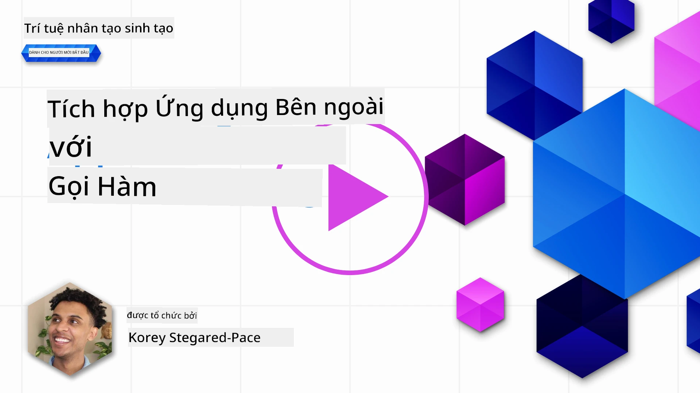
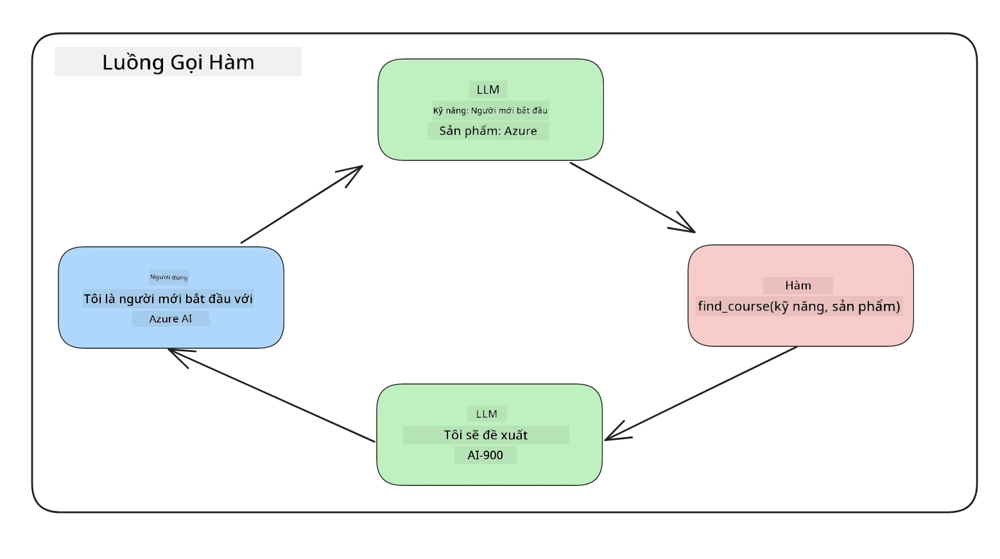
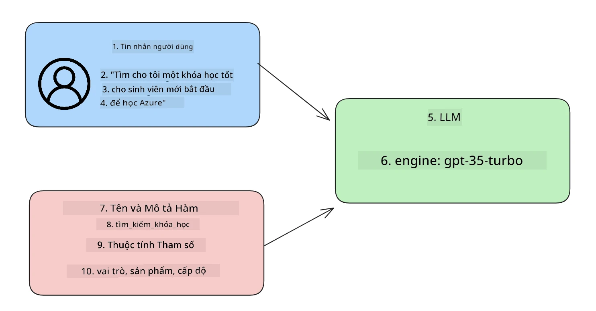

# Tích hợp với gọi hàm

[](https://youtu.be/DgUdCLX8qYQ?si=f1ouQU5HQx6F8Gl2)

Bạn đã học được khá nhiều cho đến giờ trong các bài học trước. Tuy nhiên, chúng ta có thể cải thiện hơn nữa. Một số vấn đề chúng ta có thể giải quyết là làm thế nào để có định dạng phản hồi nhất quán hơn nhằm giúp dễ dàng xử lý phản hồi trong các bước tiếp theo. Ngoài ra, chúng ta có thể muốn thêm dữ liệu từ các nguồn khác để làm giàu thêm cho ứng dụng của mình.

Những vấn đề đã được nhắc đến trên đây chính là những gì chương này muốn giải quyết.

## Giới thiệu

Bài học này sẽ giới thiệu:

- Giải thích về gọi hàm là gì và các trường hợp sử dụng của nó.
- Tạo một cuộc gọi hàm sử dụng Azure OpenAI.
- Cách tích hợp một cuộc gọi hàm vào ứng dụng.

## Mục tiêu học tập

Đến cuối bài học này, bạn sẽ có thể:

- Giải thích mục đích sử dụng gọi hàm.
- Thiết lập Cuộc Gọi Hàm sử dụng dịch vụ Azure OpenAI.
- Thiết kế các cuộc gọi hàm hiệu quả cho trường hợp sử dụng của ứng dụng bạn.

## Tình huống: Cải thiện chatbot của chúng ta với các hàm

Cho bài học này, chúng ta muốn xây dựng một tính năng cho startup giáo dục của mình cho phép người dùng sử dụng chatbot để tìm các khóa học kỹ thuật. Chúng ta sẽ đề xuất các khóa học phù hợp với trình độ kỹ năng, vai trò hiện tại và công nghệ họ quan tâm.

Để hoàn thành tình huống này, chúng ta sẽ sử dụng kết hợp:

- `Azure OpenAI` để tạo trải nghiệm trò chuyện cho người dùng.
- `Microsoft Learn Catalog API` để giúp người dùng tìm khóa học dựa trên yêu cầu.
- `Gọi Hàm` để lấy truy vấn của người dùng và gửi nó đến một hàm để thực hiện yêu cầu API.

Để bắt đầu, hãy xem tại sao chúng ta muốn dùng gọi hàm ngay từ đầu:

## Tại sao dùng Gọi Hàm

Trước khi có gọi hàm, các phản hồi từ LLM rất không có cấu trúc và không nhất quán. Các nhà phát triển phải viết mã kiểm tra phức tạp để đảm bảo có thể xử lý mọi biến thể phản hồi. Người dùng cũng không thể có câu trả lời như "Thời tiết hiện tại ở Stockholm như thế nào?". Bởi vì các mô hình bị giới hạn ở dữ liệu được đào tạo tại thời điểm đó.

Gọi Hàm là một tính năng của dịch vụ Azure OpenAI nhằm khắc phục các hạn chế sau:

- **Định dạng phản hồi nhất quán**. Nếu chúng ta kiểm soát tốt hơn định dạng phản hồi, ta có thể dễ dàng tích hợp phản hồi cho các hệ thống bên dưới.
- **Dữ liệu bên ngoài**. Có khả năng sử dụng dữ liệu từ các nguồn khác của ứng dụng trong ngữ cảnh trò chuyện.

## Minh họa vấn đề qua một tình huống

> Chúng tôi khuyên bạn sử dụng [notebook kèm theo](./python/aoai-assignment.ipynb?WT.mc_id=academic-105485-koreyst) nếu bạn muốn chạy tình huống dưới đây. Bạn cũng có thể chỉ đọc theo khi chúng tôi cố gắng minh họa vấn đề mà hàm có thể giúp giải quyết.

Hãy xem ví dụ minh họa vấn đề với định dạng phản hồi:

Giả sử chúng ta muốn tạo một cơ sở dữ liệu về dữ liệu sinh viên để có thể gợi ý khóa học phù hợp cho họ. Dưới đây là hai mô tả về sinh viên rất giống nhau về dữ liệu chứa trong đó.

1. Tạo kết nối đến tài nguyên Azure OpenAI của chúng ta:

   ```python
   import os
   import json
   from openai import OpenAI
   from dotenv import load_dotenv
   load_dotenv()

   # API Phản hồi được phục vụ từ điểm cuối Azure OpenAI (Microsoft Foundry) v1
   # nên chúng tôi hướng client OpenAI đến <your-endpoint>/openai/v1/.
   endpoint = os.environ['AZURE_OPENAI_ENDPOINT']
   client = OpenAI(
   api_key=os.environ['AZURE_OPENAI_API_KEY'],
   base_url=f"{endpoint.rstrip('/')}/openai/v1/",
   )

   deployment=os.environ['AZURE_OPENAI_DEPLOYMENT']
   ```

   Dưới đây là một số mã Python để cấu hình kết nối của chúng ta tới Azure OpenAI. Vì dùng điểm cuối v1, chúng ta chỉ cần thiết lập `api_key` và `base_url` (không cần `api_version`).

1. Tạo hai biến mô tả sinh viên với tên `student_1_description` và `student_2_description`.

   ```python
   student_1_description="Emily Johnson is a sophomore majoring in computer science at Duke University. She has a 3.7 GPA. Emily is an active member of the university's Chess Club and Debate Team. She hopes to pursue a career in software engineering after graduating."

   student_2_description = "Michael Lee is a sophomore majoring in computer science at Stanford University. He has a 3.8 GPA. Michael is known for his programming skills and is an active member of the university's Robotics Club. He hopes to pursue a career in artificial intelligence after finishing his studies."
   ```

   Chúng ta muốn gửi các mô tả sinh viên trên đến LLM để phân tích dữ liệu. Dữ liệu này có thể được sử dụng trong ứng dụng và gửi đến API hoặc lưu vào cơ sở dữ liệu.

1. Hãy tạo hai prompt giống hệt nhau mà trong đó chúng ta chỉ dẫn cho LLM biết thông tin nào quan tâm:

   ```python
   prompt1 = f'''
   Please extract the following information from the given text and return it as a JSON object:

   name
   major
   school
   grades
   club

   This is the body of text to extract the information from:
   {student_1_description}
   '''

   prompt2 = f'''
   Please extract the following information from the given text and return it as a JSON object:

   name
   major
   school
   grades
   club

   This is the body of text to extract the information from:
   {student_2_description}
   '''
   ```

   Các prompt trên yêu cầu LLM trích xuất thông tin và trả về phản hồi ở định dạng JSON.

1. Sau khi thiết lập prompt và kết nối Azure OpenAI, ta sẽ gửi prompt đến LLM sử dụng `client.responses.create`. Chúng ta lưu prompt trong biến `input` và gán vai trò `user`. Điều này nhằm bắt chước một thông điệp do người dùng viết cho chatbot.

   ```python
   # phản hồi từ lời nhắc một
   openai_response1 = client.responses.create(
   model=deployment,
   input = [{'role': 'user', 'content': prompt1}],
   store=False,
   )
   openai_response1.output_text

   # phản hồi từ lời nhắc hai
   openai_response2 = client.responses.create(
   model=deployment,
   input = [{'role': 'user', 'content': prompt2}],
   store=False,
   )
   openai_response2.output_text
   ```

Bây giờ ta có thể gửi cả hai yêu cầu đến LLM và xem xét phản hồi nhận được bằng cách tìm như sau `openai_response1.output_text`.

1. Cuối cùng, chúng ta có thể chuyển phản hồi thành định dạng JSON bằng cách gọi `json.loads`:

   ```python
   # Tải phản hồi dưới dạng đối tượng JSON
   json_response1 = json.loads(openai_response1.output_text)
   json_response1
   ```

   Phản hồi 1:

   ```json
   {
     "name": "Emily Johnson",
     "major": "computer science",
     "school": "Duke University",
     "grades": "3.7",
     "club": "Chess Club"
   }
   ```

   Phản hồi 2:

   ```json
   {
     "name": "Michael Lee",
     "major": "computer science",
     "school": "Stanford University",
     "grades": "3.8 GPA",
     "club": "Robotics Club"
   }
   ```

   Mặc dù prompt giống nhau và mô tả cũng tương tự, nhưng ta thấy các giá trị của thuộc tính `Grades` được định dạng khác nhau, ví dụ có khi nhận được `3.7` hoặc `3.7 GPA`.

   Kết quả này là do LLM nhận dữ liệu không có cấu trúc từ prompt viết tay và trả về cũng dữ liệu không có cấu trúc. Ta cần có định dạng cấu trúc để biết được gì sẽ nhận được khi lưu hoặc sử dụng dữ liệu.

Vậy làm sao để ta giải quyết vấn đề định dạng này? Bằng cách sử dụng gọi hàm, chúng ta có thể đảm bảo nhận được dữ liệu có cấu trúc. Khi dùng gọi hàm, LLM không thực sự gọi hoặc chạy hàm nào. Thay vào đó, ta tạo ra một cấu trúc để LLM tuân theo phản hồi của nó. Rồi dùng những phản hồi có cấu trúc đó để biết hàm nào cần chạy trong ứng dụng.



Ta có thể lấy dữ liệu trả về từ hàm và gửi lại cho LLM. LLM sẽ trả lời bằng ngôn ngữ tự nhiên để đáp lại truy vấn của người dùng.

## Các trường hợp sử dụng gọi hàm

Có nhiều trường hợp khác nhau mà gọi hàm có thể cải thiện ứng dụng của bạn như:

- **Gọi công cụ bên ngoài**. Chatbot rất giỏi trong việc cung cấp câu trả lời cho các câu hỏi của người dùng. Bằng cách sử dụng gọi hàm, chatbot có thể dùng tin nhắn từ người dùng để hoàn thành một số nhiệm vụ. Ví dụ, sinh viên có thể yêu cầu chatbot "Gửi email cho giảng viên của tôi nói rằng tôi cần thêm trợ giúp với môn này". Chatbot có thể thực hiện gọi hàm `send_email(to: string, body: string)`

- **Tạo truy vấn API hoặc cơ sở dữ liệu**. Người dùng có thể tìm thông tin dùng ngôn ngữ tự nhiên được chuyển đổi thành truy vấn hoặc yêu cầu API định dạng sẵn. Ví dụ một giáo viên hỏi "Ai là những học sinh đã hoàn thành bài tập cuối cùng" có thể gọi hàm `get_completed(student_name: string, assignment: int, current_status: string)`

- **Tạo dữ liệu có cấu trúc**. Người dùng có thể lấy một đoạn văn bản hoặc CSV và dùng LLM để trích thông tin quan trọng. Ví dụ sinh viên chuyển đổi bài Wikipedia về các thỏa thuận hòa bình để tạo flashcard AI. Việc này có thể làm bằng gọi hàm `get_important_facts(agreement_name: string, date_signed: string, parties_involved: list)`

## Tạo Cuộc Gọi Hàm Đầu Tiên của Bạn

Quá trình tạo cuộc gọi hàm gồm 3 bước chính:

1. **Gọi** API Responses với danh sách các hàm (công cụ) và tin nhắn người dùng.
2. **Đọc** phản hồi của mô hình để thực hiện hành động tức chạy hàm hoặc gọi API.
3. **Thực hiện** gọi tiếp theo đến API Responses với phản hồi từ hàm để dùng thông tin đó tạo phản hồi cho người dùng.



### Bước 1 - Tạo tin nhắn

Bước đầu là tạo một tin nhắn người dùng. Điều này có thể được gán động bằng cách lấy giá trị nhập văn bản hoặc bạn có thể gán giá trị ở đây. Nếu đây là lần đầu bạn làm việc với API Responses, ta cần định nghĩa `role` và `content` của tin nhắn.

`role` có thể là `system` (tạo quy tắc), `assistant` (mô hình) hoặc `user` (người dùng cuối). Đối với gọi hàm, ta gán là `user` và kèm theo câu hỏi mẫu.

```python
messages= [ {"role": "user", "content": "Find me a good course for a beginner student to learn Azure."} ]
```

Việc gán các vai trò khác nhau giúp LLM rõ ràng hơn liệu đang là hệ thống nói hay người dùng nói, điều này giúp xây dựng lịch sử hội thoại mà LLM dựa vào đó.

### Bước 2 - tạo hàm

Tiếp theo, ta sẽ định nghĩa một hàm và các tham số của hàm đó. Ta chỉ dùng một hàm duy nhất là `search_courses` nhưng bạn có thể tạo nhiều hàm.

> **Quan trọng**: Các hàm được đưa vào tin nhắn hệ thống gửi đến LLM và sẽ tính vào số token khả dụng của bạn.

Dưới đây, ta tạo một mảng các hàm. Mỗi phần tử là một công cụ theo định dạng phẳng API Responses, với thuộc tính `type`, `name`, `description` và `parameters`:

```python
functions = [
   {
      "type":"function",
      "name":"search_courses",
      "description":"Retrieves courses from the search index based on the parameters provided",
      "parameters":{
         "type":"object",
         "properties":{
            "role":{
               "type":"string",
               "description":"The role of the learner (i.e. developer, data scientist, student, etc.)"
            },
            "product":{
               "type":"string",
               "description":"The product that the lesson is covering (i.e. Azure, Power BI, etc.)"
            },
            "level":{
               "type":"string",
               "description":"The level of experience the learner has prior to taking the course (i.e. beginner, intermediate, advanced)"
            }
         },
         "required":[
            "role"
         ]
      }
   }
]
```

Hãy mô tả từng phần tử hàm chi tiết bên dưới:

- `name` - Tên hàm bạn muốn gọi.
- `description` - Mô tả cách thức hoạt động của hàm. Ở đây cần rõ ràng và cụ thể.
- `parameters` - Danh sách các giá trị và định dạng bạn muốn mô hình trả về trong phản hồi của nó. Mảng parameters gồm các phần tử có các thuộc tính sau:
  1. `type` - Kiểu dữ liệu mà thuộc tính sẽ được lưu.
  1. `properties` - Danh sách giá trị cụ thể mà mô hình sẽ dùng cho phản hồi.
      1. `name` - Khóa là tên thuộc tính mà mô hình sẽ dùng trong phản hồi có cấu trúc, ví dụ như `product`.
      1. `type` - Kiểu dữ liệu của thuộc tính, ví dụ `string`.
      1. `description` - Mô tả thuộc tính cụ thể.

Cũng có thuộc tính tùy chọn `required` - thuộc tính bắt buộc để cuộc gọi hàm hoàn thành.

### Bước 3 - Thực hiện cuộc gọi hàm

Sau khi định nghĩa hàm, ta cần đưa nó vào trong cuộc gọi API Responses. Ta làm điều này bằng cách thêm `tools` vào yêu cầu. Trong trường hợp này `tools=functions`.

Ngoài ra có tùy chọn `tool_choice` là `auto`. Có nghĩa ta để cho LLM quyết định hàm nào nên được gọi dựa trên tin nhắn người dùng thay vì gán cố định.

Dưới đây là đoạn mã gọi `client.responses.create`, chú ý ta đặt `tools=functions` và `tool_choice="auto"` để cho phép LLM chọn hàm khi nào gọi:

```python
response = client.responses.create(model=deployment,
                                        input=messages,
                                        tools=functions,
                                        tool_choice="auto",
                                        store=False)

print(response.output)
```

Phản hồi thu về bây giờ có thêm mục `function_call` trong `response.output` trông như sau:

```json
{
  "type": "function_call",
  "name": "search_courses",
  "call_id": "call_abc123",
  "arguments": "{\n  \"role\": \"student\",\n  \"product\": \"Azure\",\n  \"level\": \"beginner\"\n}"
}
```

Ở đây ta thấy hàm `search_courses` được gọi với các tham số liệt kê trong thuộc tính `arguments` của phản hồi JSON.

Kết luận là LLM đã tìm được dữ liệu phù hợp các đối số của hàm khi lấy ra từ giá trị truyền vào tham số `input` trong gọi API Responses. Dưới đây là nhắc lại giá trị `messages`:

```python
messages= [ {"role": "user", "content": "Find me a good course for a beginner student to learn Azure."} ]
```

Như bạn thấy, `student`, `Azure` và `beginner` được trích ra từ `messages` và đặt làm đầu vào cho hàm. Dùng hàm theo cách này giúp trích xuất thông tin từ prompt đồng thời tạo cấu trúc cho LLM và có thể tái sử dụng tính năng.

Tiếp theo, chúng ta cần xem làm sao dùng điều này trong ứng dụng.

## Tích hợp Cuộc Gọi Hàm vào Ứng dụng

Sau khi đã thử phản hồi có cấu trúc từ LLM, ta có thể tích hợp vào ứng dụng.

### Quản lý luồng xử lý

Để tích hợp vào ứng dụng ta thực hiện các bước sau:

1. Trước tiên, gọi dịch vụ OpenAI và trích xuất phần tử gọi hàm từ phản hồi `output`.

   ```python
   response_items = response.output
   tool_calls = [item for item in response_items if item.type == "function_call"]
   ```

1. Bây giờ định nghĩa hàm sẽ gọi Microsoft Learn API để lấy danh sách khóa học:

   ```python
   import requests

   def search_courses(role, product, level):
     url = "https://learn.microsoft.com/api/catalog/"
     params = {
        "role": role,
        "product": product,
        "level": level
     }
     response = requests.get(url, params=params)
     modules = response.json()["modules"]
     results = []
     for module in modules[:5]:
        title = module["title"]
        url = module["url"]
        results.append({"title": title, "url": url})
     return str(results)
   ```

   Lưu ý ta đang tạo hàm Python thực tế tương ứng với tên hàm trong biến `functions`. Chúng ta cũng gọi API bên ngoài thực tế để lấy dữ liệu cần. Trong trường hợp này, ta gọi API Microsoft Learn để tìm module đào tạo.

Vậy, ta đã có biến `functions` và hàm Python tương ứng, làm sao ta nói LLM kết nối hai cái này để gọi hàm Python?

1. Để biết có cần gọi hàm Python hay không, ta xem trong phản hồi LLM có phần tử `function_call` không và gọi hàm được chỉ ra. Dưới đây là cách kiểm tra:

   ```python
   # Kiểm tra xem mô hình có muốn gọi một hàm không
   if tool_calls:
    for tool_call in tool_calls:
     print("Recommended Function call:")
     print(tool_call.name)
     print()

     # Gọi hàm đó.
     function_name = tool_call.name

     available_functions = {
             "search_courses": search_courses,
     }
     function_to_call = available_functions[function_name]

     function_args = json.loads(tool_call.arguments)
     function_response = function_to_call(**function_args)

     print("Output of function call:")
     print(function_response)
     print(type(function_response))

     # Thêm cuộc gọi hàm và kết quả của nó trở lại cuộc trò chuyện.
     # Mục function_call của mô hình phải được thêm vào trước phần đầu ra của nó.
     messages.append(tool_call)  # mục function_call của trợ lý
     messages.append( # kết quả của hàm
         {
             "type": "function_call_output",
             "call_id": tool_call.call_id,
             "output": function_response,
         }
     )
   ```

   Ba dòng này đảm bảo ta lấy được tên hàm, tham số và gọi hàm:

   ```python
   function_to_call = available_functions[function_name]

   function_args = json.loads(tool_call.arguments)
   function_response = function_to_call(**function_args)
   ```

   Dưới đây là kết quả chạy mã:

   **Kết quả**

   ```Recommended Function call:
   {
     "name": "search_courses",
     "arguments": "{\n  \"role\": \"student\",\n  \"product\": \"Azure\",\n  \"level\": \"beginner\"\n}"
   }

   Output of function call:
   [{'title': 'Describe concepts of cryptography', 'url': 'https://learn.microsoft.com/training/modules/describe-concepts-of-cryptography/?
   WT.mc_id=api_CatalogApi'}, {'title': 'Introduction to audio classification with TensorFlow', 'url': 'https://learn.microsoft.com/en-
   us/training/modules/intro-audio-classification-tensorflow/?WT.mc_id=api_CatalogApi'}, {'title': 'Design a Performant Data Model in Azure SQL
   Database with Azure Data Studio', 'url': 'https://learn.microsoft.com/training/modules/design-a-data-model-with-ads/?
   WT.mc_id=api_CatalogApi'}, {'title': 'Getting started with the Microsoft Cloud Adoption Framework for Azure', 'url':
   'https://learn.microsoft.com/training/modules/cloud-adoption-framework-getting-started/?WT.mc_id=api_CatalogApi'}, {'title': 'Set up the
   Rust development environment', 'url': 'https://learn.microsoft.com/training/modules/rust-set-up-environment/?WT.mc_id=api_CatalogApi'}]
   <class 'str'>
   ```

1. Giờ ta sẽ gửi lại tin nhắn cập nhật `messages` cho LLM để nhận phản hồi bằng ngôn ngữ tự nhiên thay vì JSON dạng API.

   ```python
   print("Messages in next request:")
   print(messages)
   print()

   second_response = client.responses.create(
      input=messages,
      model=deployment,
      tool_choice="auto",
      tools=functions,
      temperature=0,
      store=False,
         )  # lấy phản hồi mới từ mô hình nơi nó có thể thấy phản hồi của hàm


   print(second_response.output_text)
   ```

   **Kết quả**

   ```text
   I found some good courses for beginner students to learn Azure:

   1. [Describe concepts of cryptography](https://learn.microsoft.com/training/modules/describe-concepts-of-cryptography/?WT.mc_id=api_CatalogApi)
   2. [Introduction to audio classification with TensorFlow](https://learn.microsoft.com/training/modules/intro-audio-classification-tensorflow/?WT.mc_id=api_CatalogApi)
   3. [Design a Performant Data Model in Azure SQL Database with Azure Data Studio](https://learn.microsoft.com/training/modules/design-a-data-model-with-ads/?WT.mc_id=api_CatalogApi)
   4. [Getting started with the Microsoft Cloud Adoption Framework for Azure](https://learn.microsoft.com/training/modules/cloud-adoption-framework-getting-started/?WT.mc_id=api_CatalogApi)
   5. [Set up the Rust development environment](https://learn.microsoft.com/training/modules/rust-set-up-environment/?WT.mc_id=api_CatalogApi)

   You can click on the links to access the courses.
   ```

## Bài tập

Để tiếp tục học Gọi Hàm Azure OpenAI bạn có thể xây dựng:

- Thêm các tham số cho hàm có thể giúp người học tìm thêm nhiều khóa học hơn.

- Tạo một cuộc gọi hàm khác lấy thêm thông tin từ người học như ngôn ngữ mẹ đẻ của họ
- Tạo xử lý lỗi khi cuộc gọi hàm và/hoặc cuộc gọi API không trả về khóa học phù hợp nào

Gợi ý: Theo dõi trang [Tài liệu tham khảo API Learn](https://learn.microsoft.com/training/support/catalog-api-developer-reference?WT.mc_id=academic-105485-koreyst) để xem cách thức và nơi dữ liệu này có sẵn.

## Làm tốt lắm! Tiếp tục hành trình

Sau khi hoàn thành bài học này, hãy xem bộ sưu tập [Học Generative AI](https://aka.ms/genai-collection?WT.mc_id=academic-105485-koreyst) của chúng tôi để tiếp tục nâng cao kiến thức Generative AI của bạn!

Hãy chuyển sang Bài học 12, nơi chúng ta sẽ xem cách [thiết kế UX cho ứng dụng AI](../12-designing-ux-for-ai-applications/README.md?WT.mc_id=academic-105485-koreyst)!

---

<!-- CO-OP TRANSLATOR DISCLAIMER START -->
**Tuyên bố miễn trừ trách nhiệm**:
Tài liệu này đã được dịch bằng dịch vụ dịch thuật AI [Co-op Translator](https://github.com/Azure/co-op-translator). Mặc dù chúng tôi cố gắng đảm bảo độ chính xác, xin lưu ý rằng bản dịch tự động có thể chứa lỗi hoặc sai sót. Tài liệu gốc bằng ngôn ngữ gốc nên được coi là nguồn tin chính thức. Đối với thông tin quan trọng, nên sử dụng dịch vụ dịch thuật chuyên nghiệp bởi con người. Chúng tôi không chịu trách nhiệm về bất kỳ hiểu lầm hoặc giải thích sai nào phát sinh từ việc sử dụng bản dịch này.
<!-- CO-OP TRANSLATOR DISCLAIMER END -->