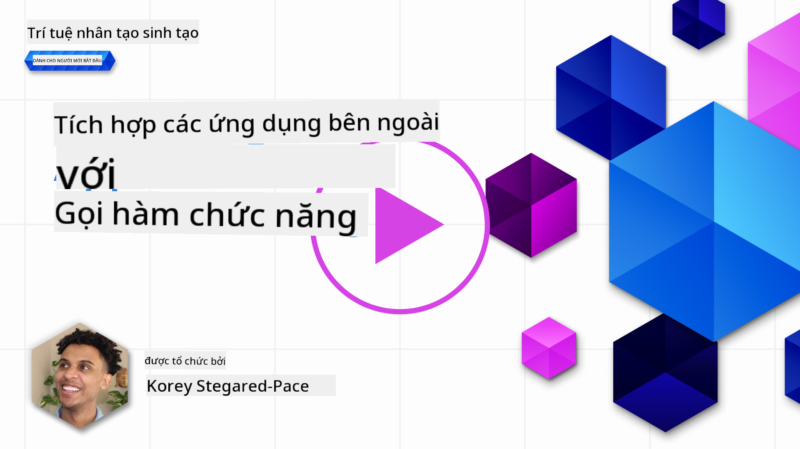
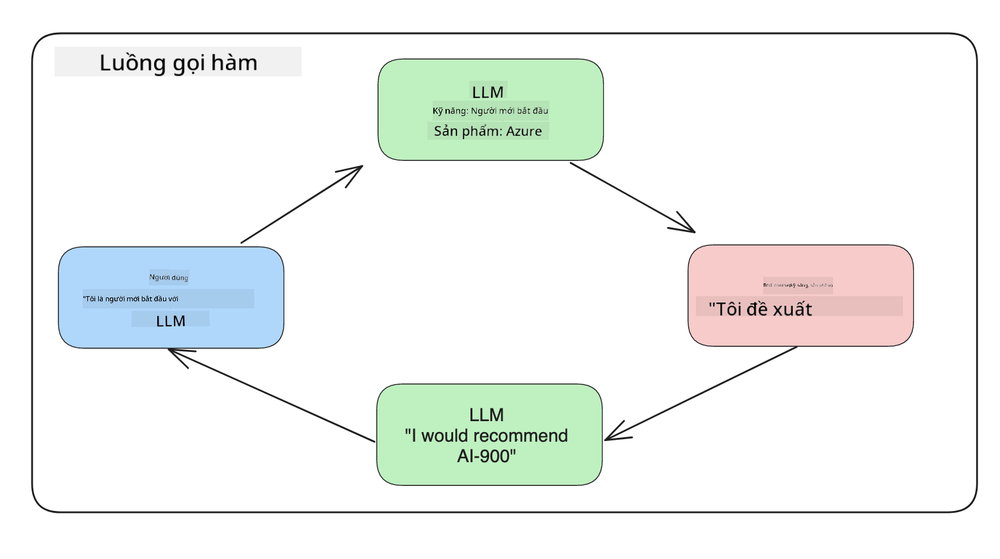
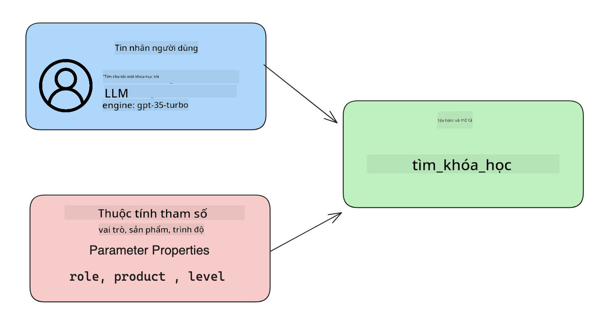

<!--
CO_OP_TRANSLATOR_METADATA:
{
  "original_hash": "f6f84f9ef2d066cd25850cab93580a50",
  "translation_date": "2025-10-17T20:32:11+00:00",
  "source_file": "11-integrating-with-function-calling/README.md",
  "language_code": "vi"
}
-->
# Tích hợp với chức năng gọi hàm

[](https://youtu.be/DgUdCLX8qYQ?si=f1ouQU5HQx6F8Gl2)

Bạn đã học được khá nhiều điều trong các bài học trước. Tuy nhiên, chúng ta vẫn có thể cải thiện thêm. Một số vấn đề cần giải quyết là làm thế nào để có được định dạng phản hồi nhất quán hơn, giúp dễ dàng làm việc với phản hồi ở các bước tiếp theo. Ngoài ra, chúng ta cũng có thể muốn thêm dữ liệu từ các nguồn khác để làm phong phú thêm ứng dụng của mình.

Những vấn đề được đề cập ở trên chính là nội dung mà chương này sẽ giải quyết.

## Giới thiệu

Bài học này sẽ bao gồm:

- Giải thích chức năng gọi hàm là gì và các trường hợp sử dụng của nó.
- Tạo một chức năng gọi hàm bằng Azure OpenAI.
- Cách tích hợp chức năng gọi hàm vào ứng dụng.

## Mục tiêu học tập

Sau khi hoàn thành bài học này, bạn sẽ có thể:

- Giải thích mục đích của việc sử dụng chức năng gọi hàm.
- Thiết lập chức năng gọi hàm bằng Azure OpenAI Service.
- Thiết kế các chức năng gọi hàm hiệu quả cho trường hợp sử dụng của ứng dụng của bạn.

## Kịch bản: Cải thiện chatbot của chúng ta với các chức năng

Trong bài học này, chúng ta muốn xây dựng một tính năng cho startup giáo dục của mình, cho phép người dùng sử dụng chatbot để tìm các khóa học kỹ thuật. Chúng ta sẽ đề xuất các khóa học phù hợp với trình độ kỹ năng, vai trò hiện tại và công nghệ mà họ quan tâm.

Để hoàn thành kịch bản này, chúng ta sẽ sử dụng kết hợp:

- `Azure OpenAI` để tạo trải nghiệm trò chuyện cho người dùng.
- `Microsoft Learn Catalog API` để giúp người dùng tìm kiếm các khóa học dựa trên yêu cầu của họ.
- `Function Calling` để lấy truy vấn của người dùng và gửi nó đến một hàm để thực hiện yêu cầu API.

Để bắt đầu, hãy xem tại sao chúng ta lại muốn sử dụng chức năng gọi hàm ngay từ đầu:

## Tại sao cần chức năng gọi hàm

Trước khi có chức năng gọi hàm, các phản hồi từ LLM thường không có cấu trúc và không nhất quán. Các nhà phát triển phải viết mã xác thực phức tạp để đảm bảo họ có thể xử lý từng biến thể của phản hồi. Người dùng không thể nhận được câu trả lời như "Thời tiết hiện tại ở Stockholm là gì?". Điều này là do các mô hình bị giới hạn bởi thời điểm dữ liệu được huấn luyện.

Chức năng gọi hàm là một tính năng của Azure OpenAI Service để khắc phục các hạn chế sau:

- **Định dạng phản hồi nhất quán**. Nếu chúng ta có thể kiểm soát tốt hơn định dạng phản hồi, chúng ta có thể dễ dàng tích hợp phản hồi vào các hệ thống khác.
- **Dữ liệu bên ngoài**. Khả năng sử dụng dữ liệu từ các nguồn khác của ứng dụng trong ngữ cảnh trò chuyện.

## Minh họa vấn đề qua một kịch bản

> Chúng tôi khuyến nghị bạn sử dụng [notebook đi kèm](./python/aoai-assignment.ipynb?WT.mc_id=academic-105485-koreyst) nếu bạn muốn chạy kịch bản dưới đây. Bạn cũng có thể chỉ cần đọc qua vì chúng tôi đang cố gắng minh họa một vấn đề mà các chức năng có thể giúp giải quyết.

Hãy xem ví dụ minh họa vấn đề định dạng phản hồi:

Giả sử chúng ta muốn tạo một cơ sở dữ liệu về dữ liệu sinh viên để có thể gợi ý khóa học phù hợp cho họ. Dưới đây là hai mô tả về sinh viên rất giống nhau về dữ liệu mà chúng chứa.

1. Tạo kết nối với tài nguyên Azure OpenAI của chúng ta:

   ```python
   import os
   import json
   from openai import AzureOpenAI
   from dotenv import load_dotenv
   load_dotenv()

   client = AzureOpenAI(
   api_key=os.environ['AZURE_OPENAI_API_KEY'],  # this is also the default, it can be omitted
   api_version = "2023-07-01-preview"
   )

   deployment=os.environ['AZURE_OPENAI_DEPLOYMENT']
   ```

   Dưới đây là một số mã Python để cấu hình kết nối của chúng ta với Azure OpenAI, nơi chúng ta thiết lập `api_type`, `api_base`, `api_version` và `api_key`.

1. Tạo hai mô tả sinh viên bằng cách sử dụng các biến `student_1_description` và `student_2_description`.

   ```python
   student_1_description="Emily Johnson is a sophomore majoring in computer science at Duke University. She has a 3.7 GPA. Emily is an active member of the university's Chess Club and Debate Team. She hopes to pursue a career in software engineering after graduating."

   student_2_description = "Michael Lee is a sophomore majoring in computer science at Stanford University. He has a 3.8 GPA. Michael is known for his programming skills and is an active member of the university's Robotics Club. He hopes to pursue a career in artificial intelligence after finishing his studies."
   ```

   Chúng ta muốn gửi các mô tả sinh viên trên đến một LLM để phân tích dữ liệu. Dữ liệu này sau đó có thể được sử dụng trong ứng dụng của chúng ta và được gửi đến một API hoặc lưu trữ trong cơ sở dữ liệu.

1. Hãy tạo hai lời nhắc giống nhau, trong đó chúng ta hướng dẫn LLM về thông tin mà chúng ta quan tâm:

   ```python
   prompt1 = f'''
   Please extract the following information from the given text and return it as a JSON object:

   name
   major
   school
   grades
   club

   This is the body of text to extract the information from:
   {student_1_description}
   '''

   prompt2 = f'''
   Please extract the following information from the given text and return it as a JSON object:

   name
   major
   school
   grades
   club

   This is the body of text to extract the information from:
   {student_2_description}
   '''
   ```

   Các lời nhắc trên hướng dẫn LLM trích xuất thông tin và trả về phản hồi ở định dạng JSON.

1. Sau khi thiết lập các lời nhắc và kết nối với Azure OpenAI, bây giờ chúng ta sẽ gửi các lời nhắc đến LLM bằng cách sử dụng `openai.ChatCompletion`. Chúng ta lưu trữ lời nhắc trong biến `messages` và gán vai trò là `user`. Điều này nhằm mô phỏng một tin nhắn từ người dùng được viết cho chatbot.

   ```python
   # response from prompt one
   openai_response1 = client.chat.completions.create(
   model=deployment,
   messages = [{'role': 'user', 'content': prompt1}]
   )
   openai_response1.choices[0].message.content

   # response from prompt two
   openai_response2 = client.chat.completions.create(
   model=deployment,
   messages = [{'role': 'user', 'content': prompt2}]
   )
   openai_response2.choices[0].message.content
   ```

Bây giờ chúng ta có thể gửi cả hai yêu cầu đến LLM và kiểm tra phản hồi nhận được bằng cách tìm nó như sau `openai_response1['choices'][0]['message']['content']`.

1. Cuối cùng, chúng ta có thể chuyển đổi phản hồi sang định dạng JSON bằng cách gọi `json.loads`:

   ```python
   # Loading the response as a JSON object
   json_response1 = json.loads(openai_response1.choices[0].message.content)
   json_response1
   ```

   Phản hồi 1:

   ```json
   {
     "name": "Emily Johnson",
     "major": "computer science",
     "school": "Duke University",
     "grades": "3.7",
     "club": "Chess Club"
   }
   ```

   Phản hồi 2:

   ```json
   {
     "name": "Michael Lee",
     "major": "computer science",
     "school": "Stanford University",
     "grades": "3.8 GPA",
     "club": "Robotics Club"
   }
   ```

   Mặc dù các lời nhắc giống nhau và các mô tả tương tự, chúng ta thấy các giá trị của thuộc tính `Grades` được định dạng khác nhau, đôi khi có định dạng `3.7` hoặc `3.7 GPA` chẳng hạn.

   Kết quả này là do LLM nhận dữ liệu không có cấu trúc dưới dạng lời nhắc viết và cũng trả về dữ liệu không có cấu trúc. Chúng ta cần có một định dạng có cấu trúc để biết điều gì cần mong đợi khi lưu trữ hoặc sử dụng dữ liệu này.

Vậy làm thế nào để giải quyết vấn đề định dạng? Bằng cách sử dụng chức năng gọi hàm, chúng ta có thể đảm bảo rằng chúng ta nhận được dữ liệu có cấu trúc. Khi sử dụng chức năng gọi hàm, LLM thực sự không gọi hoặc chạy bất kỳ hàm nào. Thay vào đó, chúng ta tạo một cấu trúc để LLM tuân theo cho các phản hồi của nó. Sau đó, chúng ta sử dụng các phản hồi có cấu trúc đó để biết hàm nào cần chạy trong ứng dụng của mình.



Chúng ta có thể lấy những gì được trả về từ hàm và gửi lại cho LLM. LLM sau đó sẽ phản hồi bằng ngôn ngữ tự nhiên để trả lời truy vấn của người dùng.

## Các trường hợp sử dụng chức năng gọi hàm

Có nhiều trường hợp sử dụng khác nhau mà chức năng gọi hàm có thể cải thiện ứng dụng của bạn như:

- **Gọi công cụ bên ngoài**. Chatbot rất tốt trong việc cung cấp câu trả lời cho các câu hỏi từ người dùng. Bằng cách sử dụng chức năng gọi hàm, chatbot có thể sử dụng tin nhắn từ người dùng để hoàn thành các nhiệm vụ nhất định. Ví dụ, một sinh viên có thể yêu cầu chatbot "Gửi email cho giảng viên của tôi nói rằng tôi cần thêm sự hỗ trợ về chủ đề này". Điều này có thể thực hiện một chức năng gọi hàm `send_email(to: string, body: string)`.

- **Tạo yêu cầu API hoặc truy vấn cơ sở dữ liệu**. Người dùng có thể tìm thông tin bằng ngôn ngữ tự nhiên được chuyển đổi thành truy vấn hoặc yêu cầu API có định dạng. Một ví dụ về điều này có thể là một giáo viên yêu cầu "Ai là những sinh viên đã hoàn thành bài tập cuối cùng" có thể gọi một hàm tên là `get_completed(student_name: string, assignment: int, current_status: string)`.

- **Tạo dữ liệu có cấu trúc**. Người dùng có thể lấy một khối văn bản hoặc CSV và sử dụng LLM để trích xuất thông tin quan trọng từ đó. Ví dụ, một sinh viên có thể chuyển đổi một bài viết Wikipedia về các hiệp định hòa bình để tạo flashcard AI. Điều này có thể được thực hiện bằng cách sử dụng một hàm gọi `get_important_facts(agreement_name: string, date_signed: string, parties_involved: list)`.

## Tạo chức năng gọi hàm đầu tiên của bạn

Quá trình tạo chức năng gọi hàm bao gồm 3 bước chính:

1. **Gọi** API Chat Completions với danh sách các hàm của bạn và một tin nhắn từ người dùng.
2. **Đọc** phản hồi của mô hình để thực hiện một hành động, ví dụ: thực thi một hàm hoặc yêu cầu API.
3. **Thực hiện** một cuộc gọi khác đến API Chat Completions với phản hồi từ hàm của bạn để sử dụng thông tin đó tạo phản hồi cho người dùng.



### Bước 1 - tạo tin nhắn

Bước đầu tiên là tạo một tin nhắn từ người dùng. Điều này có thể được gán động bằng cách lấy giá trị từ một đầu vào văn bản hoặc bạn có thể gán giá trị tại đây. Nếu đây là lần đầu tiên bạn làm việc với API Chat Completions, chúng ta cần xác định `role` và `content` của tin nhắn.

`role` có thể là `system` (tạo quy tắc), `assistant` (mô hình) hoặc `user` (người dùng cuối). Đối với chức năng gọi hàm, chúng ta sẽ gán vai trò này là `user` và một câu hỏi ví dụ.

```python
messages= [ {"role": "user", "content": "Find me a good course for a beginner student to learn Azure."} ]
```

Bằng cách gán các vai trò khác nhau, LLM sẽ hiểu rõ hơn liệu đó là hệ thống đang nói hay người dùng, điều này giúp xây dựng lịch sử cuộc trò chuyện mà LLM có thể dựa vào.

### Bước 2 - tạo các hàm

Tiếp theo, chúng ta sẽ định nghĩa một hàm và các tham số của hàm đó. Chúng ta sẽ chỉ sử dụng một hàm ở đây gọi là `search_courses`, nhưng bạn có thể tạo nhiều hàm.

> **Quan trọng**: Các hàm được bao gồm trong tin nhắn hệ thống gửi đến LLM và sẽ được tính vào số lượng token bạn có sẵn.

Dưới đây, chúng ta tạo các hàm dưới dạng một mảng các mục. Mỗi mục là một hàm và có các thuộc tính `name`, `description` và `parameters`:

```python
functions = [
   {
      "name":"search_courses",
      "description":"Retrieves courses from the search index based on the parameters provided",
      "parameters":{
         "type":"object",
         "properties":{
            "role":{
               "type":"string",
               "description":"The role of the learner (i.e. developer, data scientist, student, etc.)"
            },
            "product":{
               "type":"string",
               "description":"The product that the lesson is covering (i.e. Azure, Power BI, etc.)"
            },
            "level":{
               "type":"string",
               "description":"The level of experience the learner has prior to taking the course (i.e. beginner, intermediate, advanced)"
            }
         },
         "required":[
            "role"
         ]
      }
   }
]
```

Hãy mô tả chi tiết hơn từng trường hợp hàm dưới đây:

- `name` - Tên của hàm mà chúng ta muốn được gọi.
- `description` - Đây là mô tả về cách hàm hoạt động. Ở đây cần cụ thể và rõ ràng.
- `parameters` - Một danh sách các giá trị và định dạng mà bạn muốn mô hình tạo ra trong phản hồi của nó. Mảng parameters bao gồm các mục, trong đó các mục có các thuộc tính sau:
  1.  `type` - Kiểu dữ liệu của các thuộc tính sẽ được lưu trữ.
  1.  `properties` - Danh sách các giá trị cụ thể mà mô hình sẽ sử dụng cho phản hồi của nó.
      1. `name` - Khóa là tên của thuộc tính mà mô hình sẽ sử dụng trong phản hồi có định dạng của nó, ví dụ, `product`.
      1. `type` - Kiểu dữ liệu của thuộc tính này, ví dụ, `string`.
      1. `description` - Mô tả về thuộc tính cụ thể.

Ngoài ra còn có một thuộc tính tùy chọn `required` - thuộc tính bắt buộc để hoàn thành chức năng gọi hàm.

### Bước 3 - Thực hiện chức năng gọi hàm

Sau khi định nghĩa một hàm, chúng ta cần bao gồm nó trong cuộc gọi đến API Chat Completion. Chúng ta thực hiện điều này bằng cách thêm `functions` vào yêu cầu. Trong trường hợp này `functions=functions`.

Cũng có tùy chọn đặt `function_call` thành `auto`. Điều này có nghĩa là chúng ta sẽ để LLM quyết định hàm nào nên được gọi dựa trên tin nhắn của người dùng thay vì tự gán.

Dưới đây là một số mã nơi chúng ta gọi `ChatCompletion.create`, lưu ý cách chúng ta đặt `functions=functions` và `function_call="auto"` và do đó cho phép LLM lựa chọn khi nào gọi các hàm mà chúng ta cung cấp:

```python
response = client.chat.completions.create(model=deployment,
                                        messages=messages,
                                        functions=functions,
                                        function_call="auto")

print(response.choices[0].message)
```

Phản hồi nhận được bây giờ trông như sau:

```json
{
  "role": "assistant",
  "function_call": {
    "name": "search_courses",
    "arguments": "{\n  \"role\": \"student\",\n  \"product\": \"Azure\",\n  \"level\": \"beginner\"\n}"
  }
}
```

Ở đây chúng ta có thể thấy cách hàm `search_courses` được gọi và với các đối số nào, như được liệt kê trong thuộc tính `arguments` trong phản hồi JSON.

Kết luận là LLM đã có thể tìm dữ liệu phù hợp với các đối số của hàm khi nó trích xuất từ giá trị được cung cấp cho tham số `messages` trong cuộc gọi hoàn thành trò chuyện. Dưới đây là nhắc lại giá trị của `messages`:

```python
messages= [ {"role": "user", "content": "Find me a good course for a beginner student to learn Azure."} ]
```

Như bạn có thể thấy, `student`, `Azure` và `beginner` đã được trích xuất từ `messages` và đặt làm đầu vào cho hàm. Sử dụng các hàm theo cách này là một cách tuyệt vời để trích xuất thông tin từ lời nhắc nhưng cũng để cung cấp cấu trúc cho LLM và có chức năng tái sử dụng.

Tiếp theo, chúng ta cần xem cách sử dụng điều này trong ứng dụng của mình.

## Tích hợp chức năng gọi hàm vào ứng dụng

Sau khi chúng ta đã kiểm tra phản hồi có định dạng từ LLM, bây giờ chúng ta có thể tích hợp điều này vào ứng dụng.

### Quản lý luồng

Để tích hợp điều này vào ứng dụng của mình, hãy thực hiện các bước sau:

1. Đầu tiên, hãy thực hiện cuộc gọi đến dịch vụ OpenAI và lưu tin nhắn trong một biến gọi là `response_message`.

   ```python
   response_message = response.choices[0].message
   ```

1. Bây giờ chúng ta sẽ định nghĩa hàm sẽ gọi API Microsoft Learn để lấy danh sách các khóa học:

   ```python
   import requests

   def search_courses(role, product, level):
     url = "https://learn.microsoft.com/api/catalog/"
     params = {
        "role": role,
        "product": product,
        "level": level
     }
     response = requests.get(url, params=params)
     modules = response.json()["modules"]
     results = []
     for module in modules[:5]:
        title = module["title"]
        url = module["url"]
        results.append({"title": title, "url": url})
     return str(results)
   ```

   Lưu ý cách chúng ta bây giờ tạo một hàm Python thực sự ánh xạ tới tên hàm được giới thiệu trong biến `functions`. Chúng ta cũng thực hiện các cuộc gọi API bên ngoài thực sự để lấy dữ liệu cần thiết. Trong trường hợp này, chúng ta sử dụng API Microsoft Learn để tìm kiếm các mô-đun đào tạo.

Được rồi, vậy chúng ta đã tạo biến `functions` và một hàm Python tương ứng, làm thế nào để chúng ta nói với LLM cách ánh xạ hai điều này để hàm Python của chúng ta được gọi?

1. Để xem liệu chúng ta có cần gọi một hàm Python hay không, chúng ta cần xem phản hồi của LLM và kiểm tra xem `function_call` có phải là một phần của nó hay không và gọi hàm được chỉ định. Dưới đây là cách bạn có thể thực hiện kiểm tra được đề cập:

   ```python
   # Check if the model wants to call a function
   if response_message.function_call.name:
    print("Recommended Function call:")
    print(response_message.function_call.name)
    print()

    # Call the function.
    function_name = response_message.function_call.name

    available_functions = {
            "search_courses": search_courses,
    }
    function_to_call = available_functions[function_name]

    function_args = json.loads(response_message.function_call.arguments)
    function_response = function_to_call(**function_args)

    print("Output of function call:")
    print(function_response)
    print(type(function_response))


    # Add the assistant response and function response to the messages
    messages.append( # adding assistant response to messages
        {
            "role": response_message.role,
            "function_call": {
                "name": function_name,
                "arguments": response_message.function_call.arguments,
            },
            "content": None
        }
    )
    messages.append( # adding function response to messages
        {
            "role": "function",
            "name": function_name,
            "content":function_response,
        }
    )
   ```

   Ba dòng này đảm bảo chúng ta trích xuất tên hàm, các đối số và thực hiện cuộc gọi:

   ```python
   function_to_call = available_functions[function_name]

   function_args = json.loads(response_message.function_call.arguments)
   function_response = function_to_call(**function_args)
   ```

   Dưới đây là đầu ra từ việc chạy mã của chúng ta:

   **Đầu ra**

   ```Recommended Function call:
   {
     "name": "search_courses",
     "arguments": "{\n  \"role\": \"student\",\n  \"product\": \"Azure\",\n  \"level\": \"beginner\"\n}"
   }

   Output of function call:
   [{'title': 'Describe concepts of cryptography', 'url': 'https://learn.microsoft.com/training/modules/describe-concepts-of-cryptography/?
   WT.mc_id=api_CatalogApi'}, {'title': 'Introduction to audio classification with TensorFlow', 'url': 'https://learn.microsoft.com/en-
   us/training/modules/intro-audio-classification-tensorflow/?WT.mc_id=api_CatalogApi'}, {'title': 'Design a Performant Data Model in Azure SQL
   Database with Azure Data Studio', 'url': 'https://learn.microsoft.com/training/modules/design-a-data-model-with-ads/?
   WT.mc_id=api_CatalogApi'}, {'title': 'Getting started with the Microsoft Cloud Adoption Framework for Azure', 'url':
   'https://learn.microsoft.com/training/modules/cloud-adoption-framework-getting-started/?WT.mc_id=api_CatalogApi'}, {'title': 'Set up the
   Rust development environment', 'url': 'https://learn.microsoft.com/training/modules/rust-set-up-environment/?WT.mc_id=api_CatalogApi'}]
   <class 'str'>
   ```

1. Bây giờ chúng ta sẽ gửi tin nhắn đã cập nhật, `messages`, đến LLM để nhận phản hồi bằng ngôn ngữ tự nhiên thay vì phản hồi JSON được định dạng API.

   ```python
   print("Messages in next request:")
   print(messages)
   print()

   second_response = client.chat.completions.create(
      messages=messages,
      model=deployment,
      function_call="auto",
      functions=functions,
      temperature=0
         )  # get a new response from GPT where it can see the function response


   print(second_response.choices[0].message)
   ```

   **Đầu ra**

   ```python
   {
     "role": "assistant",
     "content": "I found some good courses for beginner students to learn Azure:\n\n1. [Describe concepts of cryptography] (https://learn.microsoft.com/training/modules/describe-concepts-of-cryptography/?WT.mc_id=api_CatalogApi)\n2. [Introduction to audio classification with TensorFlow](https://learn.microsoft.com/training/modules/intro-audio-classification-tensorflow/?WT.mc_id=api_CatalogApi)\n3. [Design a Performant Data Model in Azure SQL Database with Azure Data Studio](https://learn.microsoft.com/training/modules/design-a-data-model-with-ads/?WT.mc_id=api_CatalogApi)\n4. [Getting started with the Microsoft Cloud Adoption Framework for Azure](https://learn.microsoft.com/training/modules/cloud-adoption-framework-getting-started/?WT.mc_id=api_CatalogApi)\n5. [Set up the Rust development environment](https://learn.microsoft.com/training/modules/rust-set-up-environment/?WT.mc_id=api_CatalogApi)\n\nYou can click on the links to access the courses."
   }

   ```

## Bài tập

Để tiếp tục học về Azure OpenAI Function Calling, bạn có thể xây dựng:

- Thêm các tham số của hàm có thể giúp người học tìm thêm các khóa học.
- Tạo một chức năng gọi hàm khác lấy thêm thông tin từ người học như ngôn ngữ mẹ đẻ của họ.
- Tạo xử lý lỗi khi cuộc gọi hàm và/hoặc cuộc gọi API không trả về bất kỳ khóa học phù hợp nào

Gợi ý: Xem trang [Tài liệu tham khảo API Learn](https://learn.microsoft.com/training/support/catalog-api-developer-reference?WT.mc_id=academic-105485-koreyst) để biết cách và nơi dữ liệu này có sẵn.

## Làm tốt lắm! Tiếp tục hành trình

Sau khi hoàn thành bài học này, hãy xem bộ sưu tập [Học về AI tạo sinh](https://aka.ms/genai-collection?WT.mc_id=academic-105485-koreyst) để tiếp tục nâng cao kiến thức về AI tạo sinh của bạn!

Hãy chuyển sang Bài học 12, nơi chúng ta sẽ tìm hiểu cách [thiết kế UX cho các ứng dụng AI](../12-designing-ux-for-ai-applications/README.md?WT.mc_id=academic-105485-koreyst)!

---

**Tuyên bố miễn trừ trách nhiệm**:  
Tài liệu này đã được dịch bằng dịch vụ dịch thuật AI [Co-op Translator](https://github.com/Azure/co-op-translator). Mặc dù chúng tôi cố gắng đảm bảo độ chính xác, xin lưu ý rằng các bản dịch tự động có thể chứa lỗi hoặc không chính xác. Tài liệu gốc bằng ngôn ngữ bản địa nên được coi là nguồn thông tin chính xác nhất. Đối với thông tin quan trọng, chúng tôi khuyến nghị sử dụng dịch vụ dịch thuật chuyên nghiệp bởi con người. Chúng tôi không chịu trách nhiệm cho bất kỳ sự hiểu lầm hoặc diễn giải sai nào phát sinh từ việc sử dụng bản dịch này.