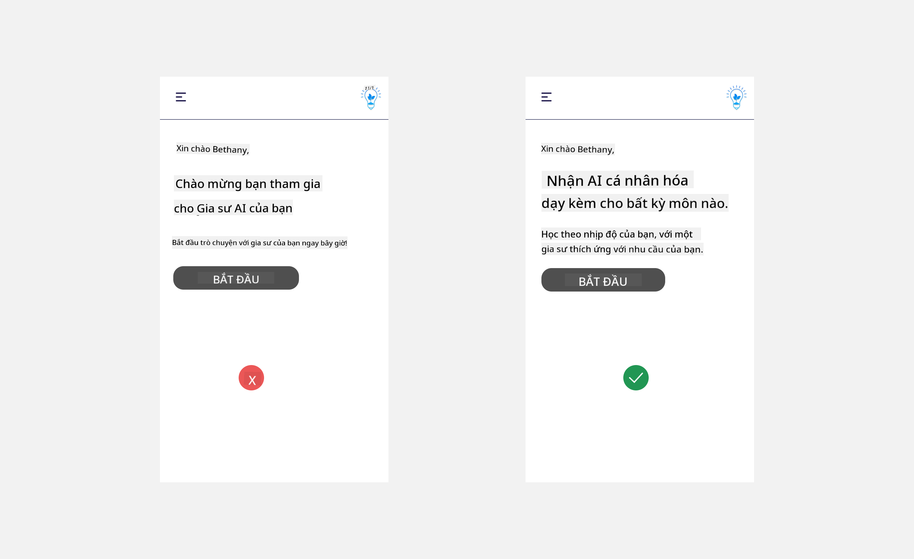
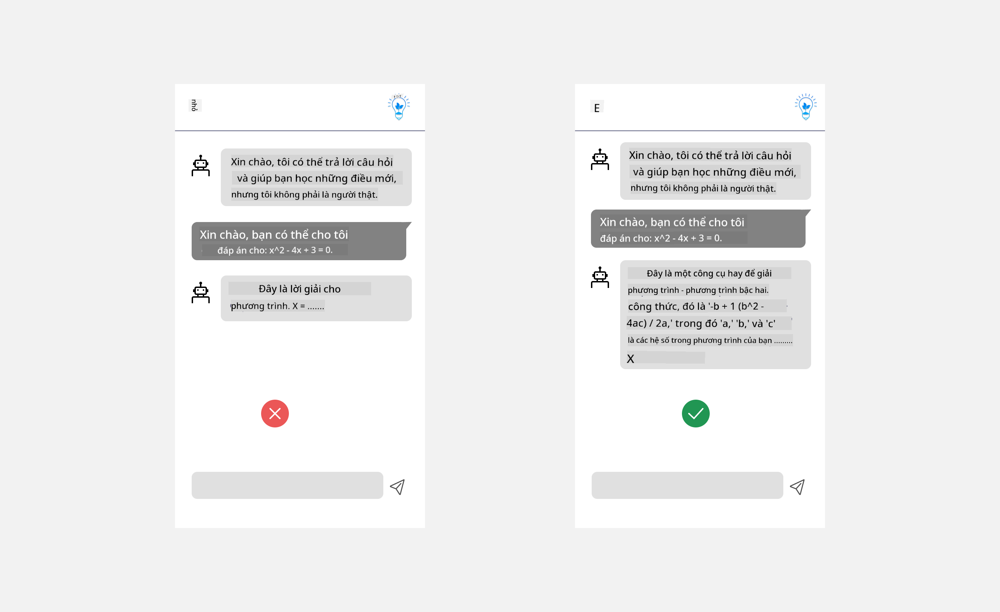
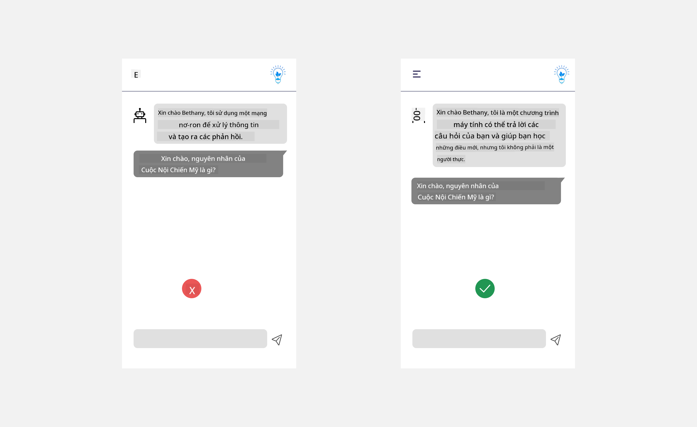

<!--
CO_OP_TRANSLATOR_METADATA:
{
  "original_hash": "ec385b41ee50579025d50cc03bfb3a25",
  "translation_date": "2025-05-19T22:00:29+00:00",
  "source_file": "12-designing-ux-for-ai-applications/README.md",
  "language_code": "vi"
}
-->
# Thiết kế UX cho ứng dụng AI

> _(Nhấn vào hình trên để xem video của bài học này)_

Trải nghiệm người dùng là một khía cạnh rất quan trọng trong việc xây dựng ứng dụng. Người dùng cần có khả năng sử dụng ứng dụng của bạn một cách hiệu quả để thực hiện các nhiệm vụ. Hiệu quả là một chuyện nhưng bạn cũng cần thiết kế ứng dụng sao cho mọi người đều có thể sử dụng, để làm cho chúng _dễ tiếp cận_. Chương này sẽ tập trung vào lĩnh vực này để bạn có thể thiết kế một ứng dụng mà mọi người có thể và muốn sử dụng.

## Giới thiệu

Trải nghiệm người dùng là cách mà một người dùng tương tác và sử dụng một sản phẩm hoặc dịch vụ cụ thể dù đó là hệ thống, công cụ, hay thiết kế. Khi phát triển ứng dụng AI, các nhà phát triển không chỉ tập trung vào việc đảm bảo trải nghiệm người dùng hiệu quả mà còn phải đạo đức. Trong bài học này, chúng tôi sẽ đề cập đến cách xây dựng ứng dụng Trí tuệ nhân tạo (AI) đáp ứng nhu cầu của người dùng.

Bài học sẽ bao gồm các lĩnh vực sau:

- Giới thiệu về Trải nghiệm Người dùng và Hiểu Nhu cầu Người dùng
- Thiết kế Ứng dụng AI để Đảm bảo Tin cậy và Minh bạch
- Thiết kế Ứng dụng AI để Hợp tác và Phản hồi

## Mục tiêu học tập

Sau khi hoàn thành bài học này, bạn sẽ có thể:

- Hiểu cách xây dựng ứng dụng AI đáp ứng nhu cầu của người dùng.
- Thiết kế ứng dụng AI thúc đẩy tin cậy và hợp tác.

### Điều kiện tiên quyết

Hãy dành thời gian để đọc thêm về [trải nghiệm người dùng và tư duy thiết kế.](https://learn.microsoft.com/training/modules/ux-design?WT.mc_id=academic-105485-koreyst)

## Giới thiệu về Trải nghiệm Người dùng và Hiểu Nhu cầu Người dùng

Trong công ty khởi nghiệp giáo dục giả tưởng của chúng tôi, chúng tôi có hai người dùng chính, giáo viên và học sinh. Mỗi người dùng có nhu cầu riêng biệt. Thiết kế tập trung vào người dùng ưu tiên người dùng, đảm bảo sản phẩm có liên quan và có lợi cho những người mà nó dành cho.

Ứng dụng nên **hữu ích, đáng tin cậy, dễ tiếp cận và dễ chịu** để cung cấp trải nghiệm người dùng tốt.

### Tính hữu dụng

Hữu ích có nghĩa là ứng dụng có chức năng phù hợp với mục đích dự kiến của nó, chẳng hạn như tự động hóa quá trình chấm điểm hoặc tạo flashcard để ôn tập. Một ứng dụng tự động hóa quá trình chấm điểm nên có khả năng gán điểm chính xác và hiệu quả cho công việc của học sinh dựa trên các tiêu chí được xác định trước. Tương tự, một ứng dụng tạo flashcard ôn tập nên có khả năng tạo ra các câu hỏi liên quan và đa dạng dựa trên dữ liệu của nó.

### Độ tin cậy

Đáng tin cậy có nghĩa là ứng dụng có thể thực hiện nhiệm vụ của mình một cách nhất quán và không có lỗi. Tuy nhiên, AI cũng như con người không hoàn hảo và có thể dễ mắc lỗi. Các ứng dụng có thể gặp lỗi hoặc tình huống không mong đợi cần sự can thiệp hoặc sửa chữa của con người. Bạn xử lý lỗi như thế nào? Trong phần cuối của bài học này, chúng tôi sẽ đề cập đến cách thiết kế hệ thống và ứng dụng AI để hợp tác và phản hồi.

### Khả năng tiếp cận

Dễ tiếp cận có nghĩa là mở rộng trải nghiệm người dùng cho người dùng với các khả năng khác nhau, bao gồm cả những người khuyết tật, đảm bảo không ai bị bỏ lại phía sau. Bằng cách tuân theo các hướng dẫn và nguyên tắc về khả năng tiếp cận, các giải pháp AI trở nên bao hàm hơn, dễ sử dụng và có lợi cho tất cả người dùng.

### Dễ chịu

Dễ chịu có nghĩa là ứng dụng mang lại sự thoải mái khi sử dụng. Trải nghiệm người dùng hấp dẫn có thể có tác động tích cực đến người dùng, khuyến khích họ quay lại ứng dụng và tăng doanh thu kinh doanh.

Không phải mọi thách thức đều có thể được giải quyết bằng AI. AI đến để tăng cường trải nghiệm người dùng của bạn, dù đó là tự động hóa các nhiệm vụ thủ công hay cá nhân hóa trải nghiệm người dùng.

## Thiết kế Ứng dụng AI để Đảm bảo Tin cậy và Minh bạch

Xây dựng niềm tin là rất quan trọng khi thiết kế ứng dụng AI. Niềm tin đảm bảo rằng người dùng tự tin rằng ứng dụng sẽ hoàn thành công việc, cung cấp kết quả nhất quán và kết quả đó là những gì người dùng cần. Một rủi ro trong lĩnh vực này là mất niềm tin và tin tưởng quá mức. Mất niềm tin xảy ra khi người dùng có ít hoặc không tin tưởng vào hệ thống AI, dẫn đến việc người dùng từ chối ứng dụng của bạn. Tin tưởng quá mức xảy ra khi người dùng đánh giá quá cao khả năng của hệ thống AI, dẫn đến việc người dùng tin tưởng hệ thống AI quá mức. Ví dụ, một hệ thống chấm điểm tự động trong trường hợp tin tưởng quá mức có thể khiến giáo viên không kiểm tra kỹ một số bài thi để đảm bảo hệ thống chấm điểm hoạt động tốt. Điều này có thể dẫn đến điểm số không công bằng hoặc không chính xác cho học sinh, hoặc bỏ lỡ cơ hội để phản hồi và cải thiện.

Hai cách để đảm bảo rằng niềm tin được đặt ở trung tâm của thiết kế là giải thích và kiểm soát.

### Giải thích

Khi AI giúp thông tin quyết định như truyền đạt kiến thức cho các thế hệ tương lai, điều quan trọng là giáo viên và phụ huynh hiểu cách AI đưa ra quyết định. Đây là giải thích - hiểu cách ứng dụng AI đưa ra quyết định. Thiết kế để giải thích bao gồm việc thêm chi tiết của các ví dụ về những gì một ứng dụng AI có thể làm. Ví dụ, thay vì "Bắt đầu với AI giáo viên", hệ thống có thể sử dụng: "Tóm tắt ghi chú của bạn để dễ dàng ôn tập hơn bằng AI."

Một ví dụ khác là cách AI sử dụng dữ liệu người dùng và cá nhân. Ví dụ, một người dùng với nhân cách học sinh có thể có giới hạn dựa trên nhân cách của họ. AI có thể không tiết lộ câu trả lời cho các câu hỏi nhưng có thể giúp hướng dẫn người dùng suy nghĩ về cách họ có thể giải quyết vấn đề.

Một phần quan trọng cuối cùng của giải thích là đơn giản hóa các giải thích. Học sinh và giáo viên có thể không phải là chuyên gia AI, do đó các giải thích về những gì ứng dụng có thể hoặc không thể làm nên được đơn giản hóa và dễ hiểu.

### Kiểm soát

AI tạo ra sự hợp tác giữa AI và người dùng, nơi mà ví dụ người dùng có thể sửa đổi các gợi ý để có kết quả khác nhau. Ngoài ra, khi một kết quả được tạo ra, người dùng nên có khả năng sửa đổi kết quả để cảm thấy họ có quyền kiểm soát. Ví dụ, khi sử dụng Bing, bạn có thể điều chỉnh gợi ý của mình dựa trên định dạng, giọng điệu và độ dài. Ngoài ra, bạn có thể thêm thay đổi vào kết quả của mình và sửa đổi kết quả như hình dưới đây:

Một tính năng khác trong Bing cho phép người dùng kiểm soát ứng dụng là khả năng chọn tham gia và rời khỏi dữ liệu mà AI sử dụng. Đối với một ứng dụng trường học, một học sinh có thể muốn sử dụng ghi chú của họ cũng như tài liệu của giáo viên làm tài liệu ôn tập.

> Khi thiết kế ứng dụng AI, tính chủ ý là chìa khóa để đảm bảo người dùng không tin tưởng quá mức và đặt kỳ vọng không thực tế về khả năng của nó. Một cách để làm điều này là tạo ra ma sát giữa các gợi ý và kết quả. Nhắc nhở người dùng rằng đây là AI và không phải là một người đồng nghiệp

## Thiết kế Ứng dụng AI để Hợp tác và Phản hồi

Như đã đề cập trước đó, AI tạo ra sự hợp tác giữa người dùng và AI. Hầu hết các tương tác là với một người dùng nhập một gợi ý và AI tạo ra một kết quả. Điều gì xảy ra nếu kết quả không chính xác? Ứng dụng xử lý lỗi như thế nào nếu chúng xảy ra? AI có đổ lỗi cho người dùng hay dành thời gian để giải thích lỗi?

Ứng dụng AI nên được xây dựng để nhận và cung cấp phản hồi. Điều này không chỉ giúp hệ thống AI cải thiện mà còn xây dựng niềm tin với người dùng. Một vòng phản hồi nên được bao gồm trong thiết kế, một ví dụ có thể là một nút thích hoặc không thích đơn giản trên kết quả.

Một cách khác để xử lý điều này là giao tiếp rõ ràng về khả năng và giới hạn của hệ thống. Khi người dùng mắc lỗi yêu cầu điều gì đó vượt quá khả năng của AI, cũng nên có một cách để xử lý điều này, như được minh họa dưới đây.

Lỗi hệ thống thường gặp với các ứng dụng nơi người dùng có thể cần trợ giúp với thông tin ngoài phạm vi của AI hoặc ứng dụng có thể có giới hạn về số lượng câu hỏi/chủ đề mà người dùng có thể tạo tóm tắt. Ví dụ, một ứng dụng AI được đào tạo với dữ liệu về các chủ đề giới hạn như Lịch sử và Toán học có thể không thể xử lý các câu hỏi về Địa lý. Để giảm thiểu điều này, hệ thống AI có thể đưa ra phản hồi như: "Xin lỗi, sản phẩm của chúng tôi đã được đào tạo với dữ liệu trong các môn học sau....., tôi không thể trả lời câu hỏi bạn đã hỏi."

Ứng dụng AI không hoàn hảo, do đó, chúng có thể mắc lỗi. Khi thiết kế ứng dụng của bạn, bạn nên đảm bảo rằng bạn tạo ra không gian cho phản hồi từ người dùng và xử lý lỗi một cách đơn giản và dễ hiểu.

## Bài tập

Hãy xem xét bất kỳ ứng dụng AI nào bạn đã xây dựng cho đến nay, hãy cân nhắc thực hiện các bước dưới đây trong ứng dụng của bạn:

- **Dễ chịu:** Xem xét cách bạn có thể làm cho ứng dụng của bạn dễ chịu hơn. Bạn có đang thêm giải thích ở mọi nơi không? Bạn có đang khuyến khích người dùng khám phá không? Bạn đang diễn đạt thông điệp lỗi của mình như thế nào?

- **Tính hữu dụng:** Xây dựng một ứng dụng web. Đảm bảo ứng dụng của bạn có thể điều hướng được bằng cả chuột và bàn phím.

- **Tin cậy và minh bạch:** Đừng hoàn toàn tin tưởng AI và kết quả của nó, hãy cân nhắc cách bạn sẽ thêm một con người vào quá trình để xác minh kết quả. Ngoài ra, hãy cân nhắc và thực hiện các cách khác để đạt được tin cậy và minh bạch.

- **Kiểm soát:** Cho phép người dùng kiểm soát dữ liệu mà họ cung cấp cho ứng dụng. Thực hiện một cách để người dùng có thể chọn tham gia và rời khỏi việc thu thập dữ liệu trong ứng dụng AI.

## Tiếp tục Học tập của bạn!

Sau khi hoàn thành bài học này, hãy xem bộ sưu tập [Học AI Tạo sinh](https://aka.ms/genai-collection?WT.mc_id=academic-105485-koreyst) của chúng tôi để tiếp tục nâng cao kiến thức về AI Tạo sinh của bạn!

Hãy chuyển sang Bài học 13, nơi chúng tôi sẽ xem xét cách [bảo mật ứng dụng AI](../13-securing-ai-applications/README.md?WT.mc_id=academic-105485-koreyst)!

**Tuyên bố miễn trừ trách nhiệm**:  
Tài liệu này đã được dịch bằng dịch vụ dịch thuật AI [Co-op Translator](https://github.com/Azure/co-op-translator). Mặc dù chúng tôi cố gắng đảm bảo độ chính xác, xin lưu ý rằng các bản dịch tự động có thể chứa lỗi hoặc sự không chính xác. Tài liệu gốc bằng ngôn ngữ bản địa nên được coi là nguồn đáng tin cậy. Đối với thông tin quan trọng, nên sử dụng dịch vụ dịch thuật chuyên nghiệp của con người. Chúng tôi không chịu trách nhiệm cho bất kỳ sự hiểu lầm hoặc diễn giải sai nào phát sinh từ việc sử dụng bản dịch này.