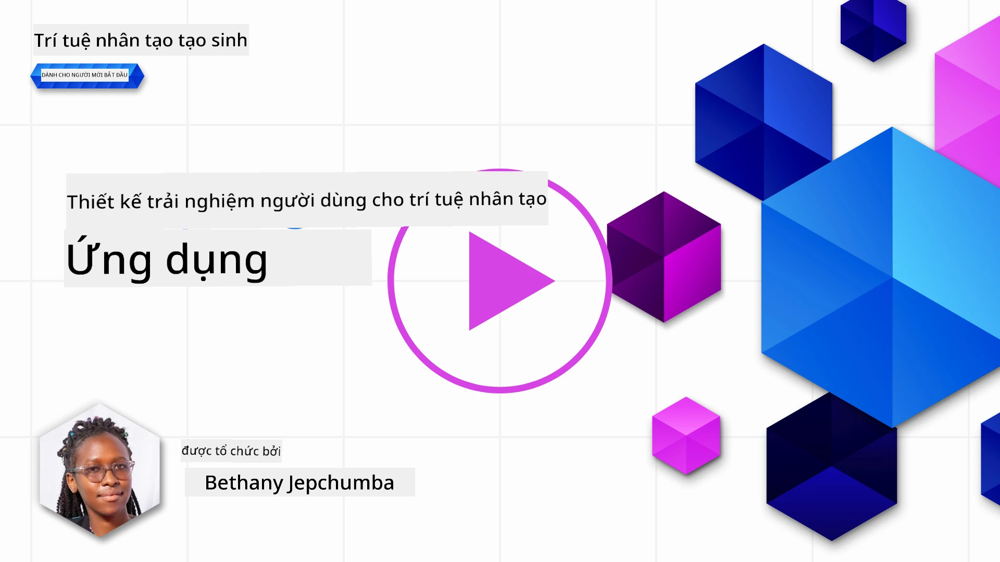
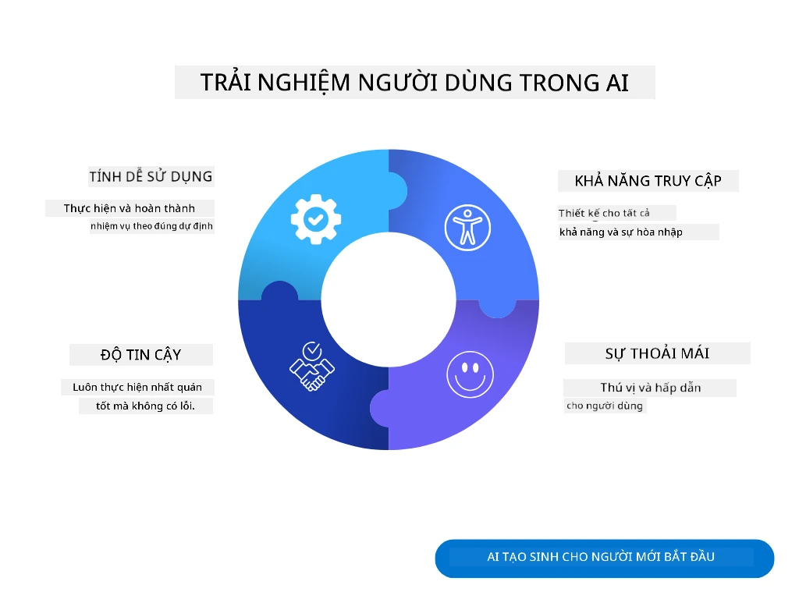
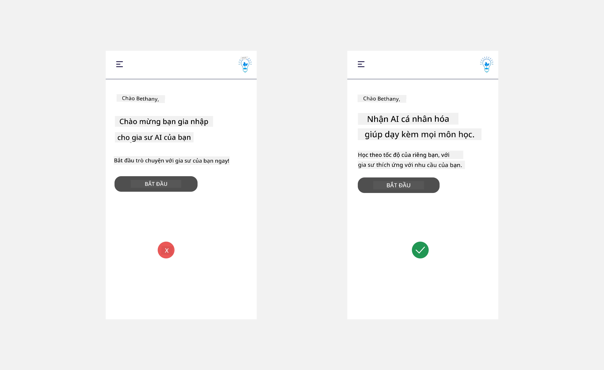
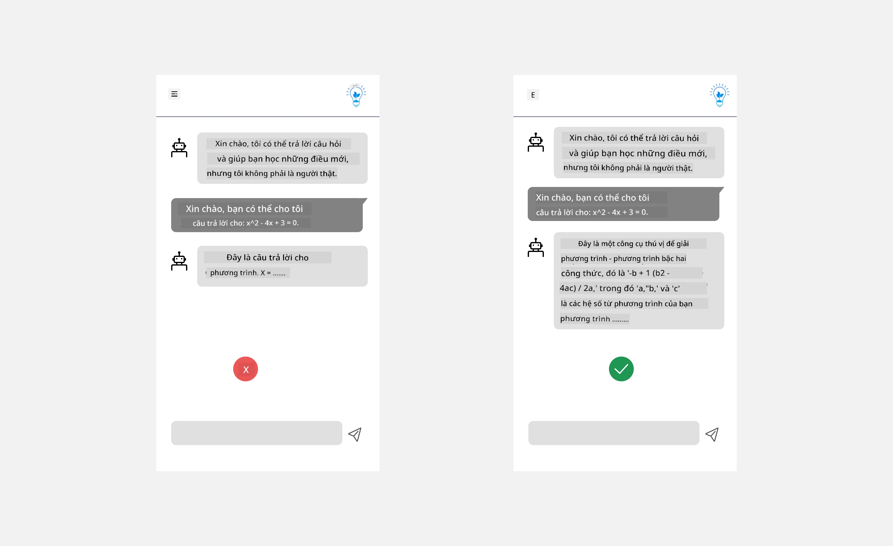
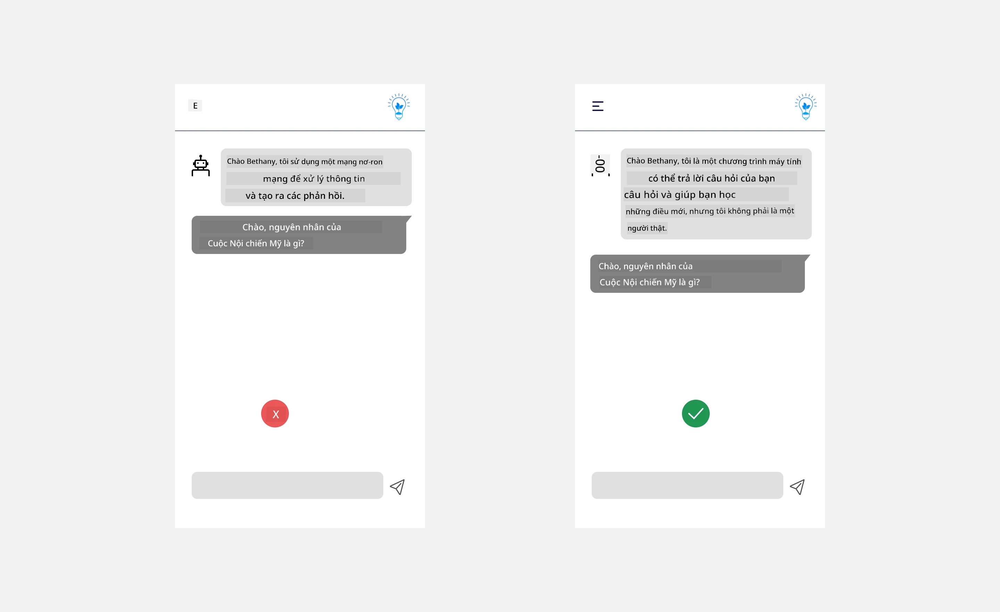
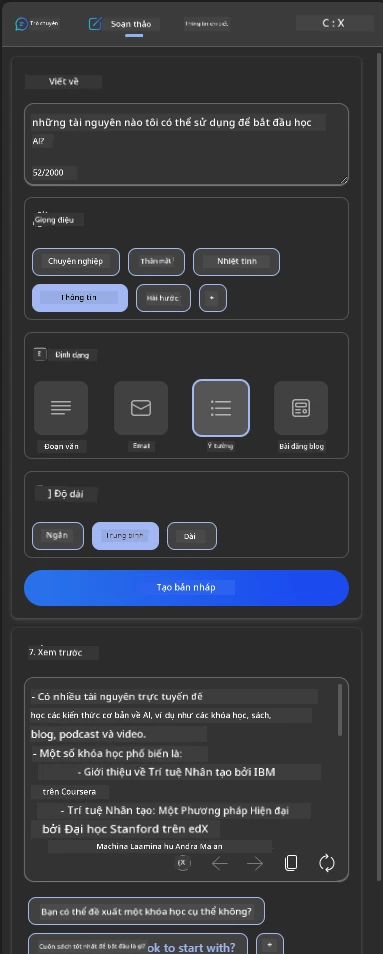
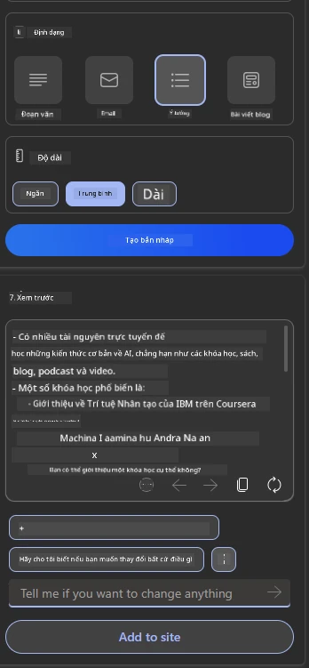
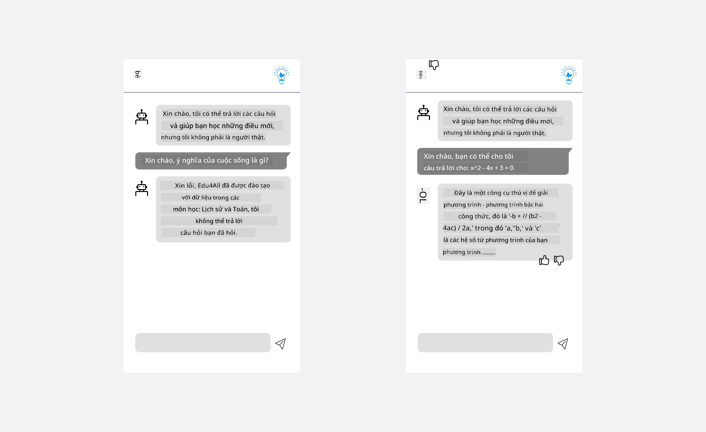

# Thiết kế UX cho Ứng dụng AI

> _(Nhấp vào hình ảnh trên để xem video bài học này)_

Trải nghiệm người dùng là một khía cạnh rất quan trọng khi xây dựng ứng dụng. Người dùng cần có khả năng sử dụng ứng dụng của bạn một cách hiệu quả để hoàn thành các nhiệm vụ. Hiệu quả là một điều nhưng bạn cũng cần thiết kế ứng dụng sao cho mọi người đều có thể sử dụng, để làm cho ứng dụng trở nên _dễ tiếp cận_. Chương này sẽ tập trung vào lĩnh vực này để bạn hy vọng sẽ thiết kế được một ứng dụng mà mọi người có thể và muốn sử dụng.

## Giới thiệu

Trải nghiệm người dùng là cách một người dùng tương tác và sử dụng một sản phẩm hoặc dịch vụ cụ thể, dù đó là hệ thống, công cụ hay thiết kế. Khi phát triển các ứng dụng AI, các nhà phát triển không chỉ tập trung vào việc đảm bảo trải nghiệm người dùng hiệu quả mà còn phải đạo đức. Trong bài học này, chúng ta sẽ tìm hiểu cách xây dựng các ứng dụng Trí tuệ Nhân tạo (AI) đáp ứng nhu cầu của người dùng.

Bài học sẽ bao gồm các lĩnh vực sau:

- Giới thiệu về Trải nghiệm Người dùng và Hiểu biết về Nhu cầu Người dùng
- Thiết kế Ứng dụng AI để Tạo niềm tin và Minh bạch
- Thiết kế Ứng dụng AI để Hợp tác và Phản hồi

## Mục tiêu học tập

Sau khi hoàn thành bài học này, bạn sẽ có khả năng:

- Hiểu cách xây dựng các ứng dụng AI đáp ứng nhu cầu người dùng.
- Thiết kế các ứng dụng AI thúc đẩy sự tin tưởng và hợp tác.

### Yêu cầu trước

Dành thời gian và đọc thêm về [trải nghiệm người dùng và tư duy thiết kế.](https://learn.microsoft.com/training/modules/ux-design?WT.mc_id=academic-105485-koreyst)

## Giới thiệu về Trải nghiệm Người Dùng và Hiểu biết về Nhu cầu Người Dùng

Trong công ty khởi nghiệp giáo dục giả định của chúng ta, có hai nhóm người dùng chính là giáo viên và học sinh. Mỗi nhóm người dùng đều có những nhu cầu riêng biệt. Thiết kế lấy người dùng làm trung tâm ưu tiên người dùng đảm bảo sản phẩm phù hợp và có lợi cho những người mà nó hướng tới.

Ứng dụng nên **hữu ích, đáng tin cậy, dễ tiếp cận và dễ chịu** để mang lại trải nghiệm người dùng tốt.

### Khả năng sử dụng

Hữu ích có nghĩa là ứng dụng có chức năng phù hợp với mục đích dự định, chẳng hạn như tự động hóa quá trình chấm điểm hoặc tạo thẻ học để ôn tập. Một ứng dụng tự động hóa việc chấm điểm nên có khả năng phân loại điểm chính xác và hiệu quả dựa trên các tiêu chí đã định sẵn. Tương tự, một ứng dụng tạo thẻ ôn tập nên có thể tạo ra các câu hỏi liên quan và đa dạng dựa trên dữ liệu của nó.

### Độ tin cậy

Đáng tin cậy có nghĩa là ứng dụng có thể thực hiện nhiệm vụ một cách nhất quán và không có lỗi. Tuy nhiên, AI cũng giống như con người không phải hoàn hảo và có thể có lỗi. Các ứng dụng có thể gặp lỗi hoặc tình huống không mong đợi cần sự can thiệp hoặc sửa chữa của con người. Bạn sẽ xử lý lỗi như thế nào? Trong phần cuối cùng của bài học này, chúng tôi sẽ đề cập cách hệ thống và ứng dụng AI được thiết kế để hợp tác và phản hồi.

### Khả năng tiếp cận

Dễ tiếp cận có nghĩa là mở rộng trải nghiệm người dùng đối với những người có khả năng khác nhau, bao gồm cả người khuyết tật, đảm bảo không ai bị bỏ lại phía sau. Bằng cách tuân thủ các hướng dẫn và nguyên tắc tiếp cận, các giải pháp AI trở nên toàn diện hơn, dễ sử dụng và có lợi cho tất cả người dùng.

### Dễ chịu

Dễ chịu có nghĩa là ứng dụng mang lại trải nghiệm thú vị khi sử dụng. Một trải nghiệm người dùng hấp dẫn có thể có ảnh hưởng tích cực, khuyến khích người dùng quay lại ứng dụng và tăng doanh thu cho doanh nghiệp.

Không phải mọi thách thức đều có thể giải quyết bằng AI. AI giúp tăng cường trải nghiệm người dùng của bạn, dù là tự động hóa các công việc thủ công, hay cá nhân hóa trải nghiệm người dùng.

## Thiết kế Ứng dụng AI để Tạo niềm tin và Minh bạch

Xây dựng niềm tin là rất quan trọng khi thiết kế ứng dụng AI. Niềm tin đảm bảo người dùng tự tin rằng ứng dụng sẽ hoàn thành công việc, cung cấp kết quả một cách nhất quán và kết quả đó là những gì người dùng cần. Một rủi ro trong lĩnh vực này là thiếu tin tưởng hoặc tin tưởng quá mức. Thiếu tin tưởng xảy ra khi người dùng ít hoặc không có niềm tin vào hệ thống AI, dẫn đến việc người dùng từ chối ứng dụng của bạn. Tin tưởng quá mức xảy ra khi người dùng đánh giá quá cao khả năng của một hệ thống AI, dẫn đến việc người dùng tin tưởng hệ thống AI quá nhiều. Ví dụ, một hệ thống chấm điểm tự động trong trường hợp tin tưởng quá mức có thể dẫn đến giáo viên không kiểm tra kỹ một số bài để đảm bảo hệ thống chấm điểm hoạt động tốt. Điều này có thể dẫn đến điểm số không công bằng hoặc không chính xác cho học sinh, hoặc bỏ lỡ cơ hội phản hồi và cải thiện.

Hai cách để đảm bảo niềm tin được đặt đúng vào trung tâm của thiết kế là khả năng giải thích và kiểm soát.

### Khả năng giải thích

Khi AI giúp hỗ trợ quyết định như truyền đạt kiến thức cho các thế hệ tương lai, điều quan trọng là giáo viên và phụ huynh phải hiểu cách AI đưa ra quyết định. Đây là khả năng giải thích - hiểu cách các ứng dụng AI đưa ra quyết định. Thiết kế để có khả năng giải thích bao gồm bổ sung các chi tiết làm nổi bật cách AI đưa ra kết quả. Khán giả phải nhận thức rằng kết quả này là do AI tạo ra chứ không phải do con người. Ví dụ, thay vì nói "Bắt đầu trò chuyện với gia sư của bạn ngay bây giờ", hãy nói "Sử dụng gia sư AI thích nghi với nhu cầu của bạn và giúp bạn học theo nhịp độ riêng."

Một ví dụ khác là cách AI sử dụng dữ liệu người dùng và dữ liệu cá nhân. Ví dụ, một người dùng với nhân dạng học sinh có thể có những giới hạn dựa trên nhân dạng của họ. AI có thể không tiết lộ câu trả lời cho các câu hỏi nhưng có thể giúp hướng dẫn người dùng suy nghĩ cách giải quyết vấn đề.

Một phần quan trọng cuối cùng của khả năng giải thích là đơn giản hóa các lời giải thích. Học sinh và giáo viên có thể không phải là chuyên gia AI, vì vậy các lời giải thích về những gì ứng dụng có thể hoặc không thể làm nên được đơn giản hóa và dễ hiểu.

### Kiểm soát

AI tạo sinh tạo ra sự cộng tác giữa AI và người dùng, ví dụ người dùng có thể sửa đổi câu lệnh (prompt) để có kết quả khác nhau. Ngoài ra, khi kết quả đã được tạo ra, người dùng nên có khả năng sửa đổi kết quả, giúp họ cảm thấy kiểm soát. Ví dụ, khi sử dụng Microsoft Copilot (trước đây là Bing Chat), bạn có thể điều chỉnh yêu cầu dựa trên định dạng, giọng điệu và độ dài. Ngoài ra, bạn có thể thêm thay đổi vào kết quả và chỉnh sửa kết quả như hình dưới đây:

Một tính năng khác trong Microsoft Copilot cho phép người dùng kiểm soát ứng dụng là khả năng chọn tham gia hoặc rút lui khỏi việc AI sử dụng dữ liệu. Đối với một ứng dụng trường học, học sinh có thể muốn sử dụng ghi chú của mình cũng như tài nguyên của giáo viên làm tài liệu ôn tập.

> Khi thiết kế ứng dụng AI, sự chủ ý là yếu tố then chốt để đảm bảo người dùng không tin tưởng quá mức dẫn đến kỳ vọng không thực tế về khả năng của nó. Một cách làm điều này là tạo sự cản trở giữa câu lệnh và kết quả. Nhắc nhở người dùng rằng đây là AI chứ không phải một con người đồng hành.

## Thiết kế Ứng dụng AI để Hợp tác và Phản hồi

Như đã đề cập, AI tạo sinh tạo ra sự hợp tác giữa người dùng và AI. Hầu hết các tương tác là người dùng nhập câu lệnh và AI tạo ra kết quả. Nếu kết quả không chính xác thì sao? Ứng dụng xử lý lỗi như thế nào nếu xảy ra? AI có đổ lỗi cho người dùng hay dành thời gian giải thích lỗi không?

Các ứng dụng AI nên được xây dựng để nhận và cung cấp phản hồi. Điều này không chỉ giúp hệ thống AI cải thiện mà còn xây dựng niềm tin với người dùng. Một vòng phản hồi nên được bao gồm trong thiết kế, ví dụ như biểu tượng thích hoặc không thích đơn giản trên kết quả.

Cách khác để xử lý điều này là truyền đạt rõ ràng khả năng và hạn chế của hệ thống. Khi người dùng nhập yêu cầu vượt quá khả năng của AI, cũng cần có cách xử lý như dưới đây.

Lỗi hệ thống thường xảy ra với ứng dụng, nơi người dùng có thể cần trợ giúp với thông tin ngoài phạm vi AI hoặc ứng dụng có giới hạn số lượng câu hỏi/môn học người dùng có thể tạo tóm tắt. Ví dụ, một ứng dụng AI được đào tạo với dữ liệu về một số môn học hạn chế như Lịch sử và Toán có thể không giải quyết được các câu hỏi về Địa lý. Để giảm thiểu điều này, hệ thống AI có thể đưa ra phản hồi như: "Xin lỗi, sản phẩm của chúng tôi được đào tạo với dữ liệu trong các môn học sau..., tôi không thể trả lời câu hỏi bạn đã hỏi."

Các ứng dụng AI không hoàn hảo, do đó chắc chắn sẽ mắc sai lầm. Khi thiết kế ứng dụng, bạn nên đảm bảo tạo không gian cho phản hồi từ người dùng và xử lý lỗi theo cách đơn giản và dễ giải thích.

## Bài tập

Lấy bất kỳ ứng dụng AI nào bạn đã xây dựng đến nay, hãy cân nhắc thực hiện các bước dưới đây trong ứng dụng của bạn:

- **Dễ chịu:** Cân nhắc làm thế nào để ứng dụng của bạn trở nên dễ chịu hơn. Bạn có đang thêm lời giải thích khắp nơi không? Bạn có khuyến khích người dùng khám phá không? Bạn đang diễn đạt thông báo lỗi như thế nào?

- **Khả năng sử dụng:** Xây dựng một ứng dụng web. Đảm bảo ứng dụng của bạn có thể điều hướng được bằng cả chuột và bàn phím.

- **Tin cậy và minh bạch:** Đừng hoàn toàn tin tưởng AI và kết quả của nó, cân nhắc cách bạn thêm yếu tố con người vào quy trình để xác minh kết quả. Ngoài ra, cân nhắc và thực hiện các cách khác để đạt được sự tin cậy và minh bạch.

- **Kiểm soát:** Cho phép người dùng kiểm soát dữ liệu họ cung cấp cho ứng dụng. Triển khai cách để người dùng có thể chọn tham gia hoặc không tham gia thu thập dữ liệu trong ứng dụng AI.

<!-- ## [Post-lecture quiz](../../../12-designing-ux-for-ai-applications/quiz-url) -->

## Tiếp tục học tập!

Sau khi hoàn thành bài học này, hãy xem bộ sưu tập [Học Generative AI](https://aka.ms/genai-collection?WT.mc_id=academic-105485-koreyst) để tiếp tục nâng cao kiến thức Generative AI của bạn!

Hãy chuyển sang Bài học 13, nơi chúng ta sẽ tìm hiểu cách [bảo mật ứng dụng AI](../13-securing-ai-applications/README.md?WT.mc_id=academic-105485-koreyst)!

---

<!-- CO-OP TRANSLATOR DISCLAIMER START -->
**Tuyên bố miễn trừ trách nhiệm**:
Tài liệu này đã được dịch bằng dịch vụ dịch thuật AI [Co-op Translator](https://github.com/Azure/co-op-translator). Mặc dù chúng tôi cố gắng đảm bảo độ chính xác, xin lưu ý rằng bản dịch tự động có thể chứa lỗi hoặc sai sót. Tài liệu gốc bằng ngôn ngữ gốc nên được coi là nguồn tin chính thức. Đối với thông tin quan trọng, nên sử dụng dịch vụ dịch thuật chuyên nghiệp bởi con người. Chúng tôi không chịu trách nhiệm về bất kỳ hiểu lầm hoặc giải thích sai nào phát sinh từ việc sử dụng bản dịch này.
<!-- CO-OP TRANSLATOR DISCLAIMER END -->