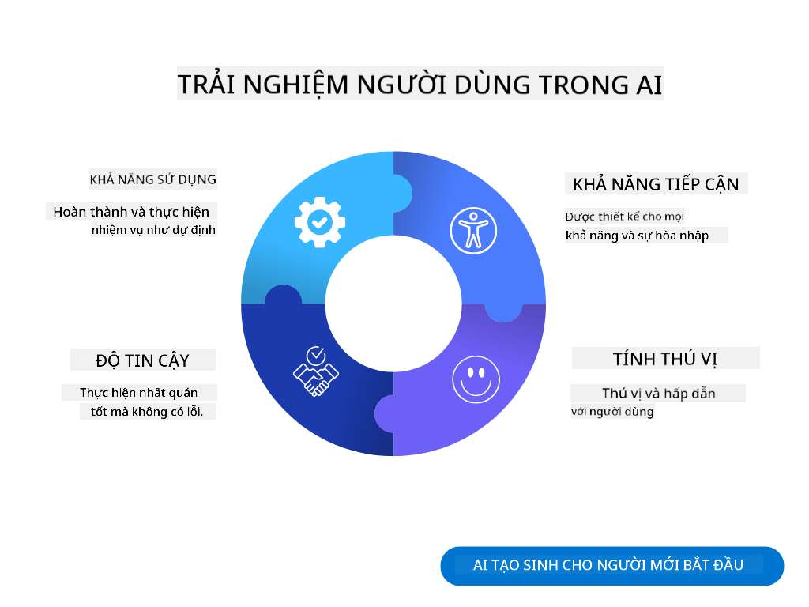
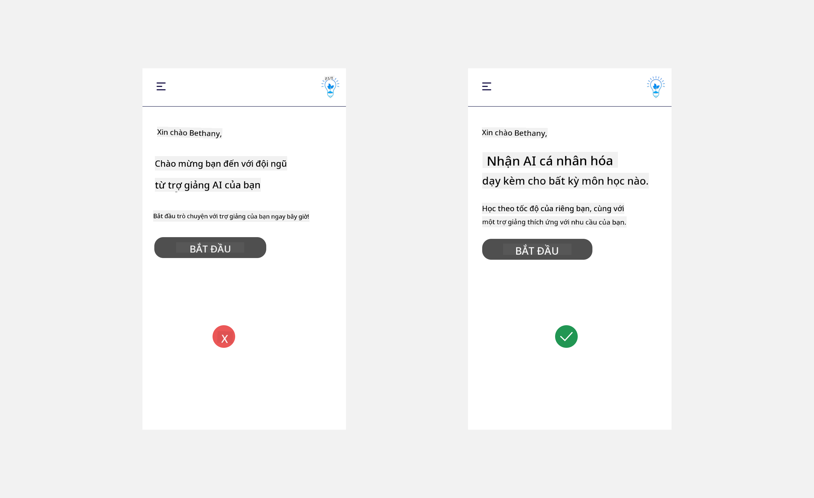
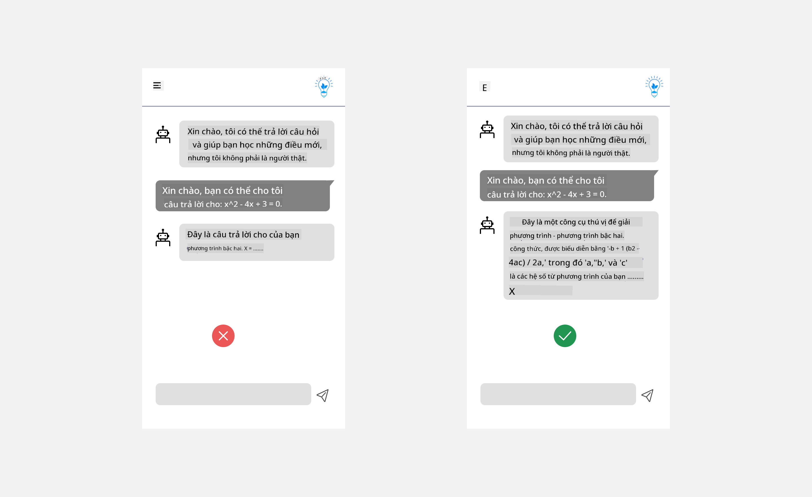
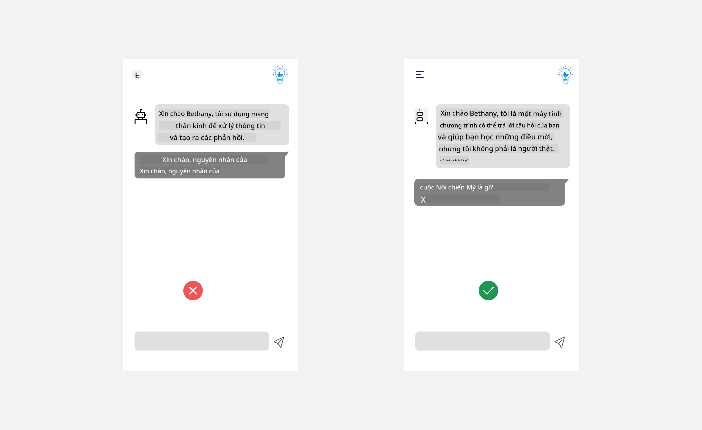
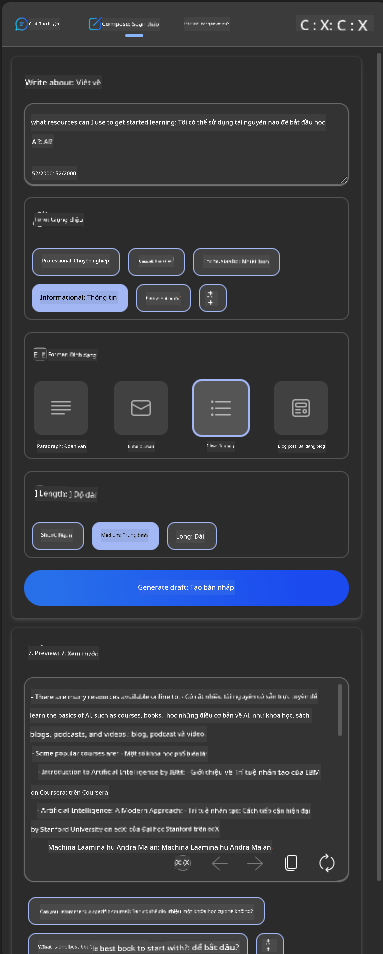
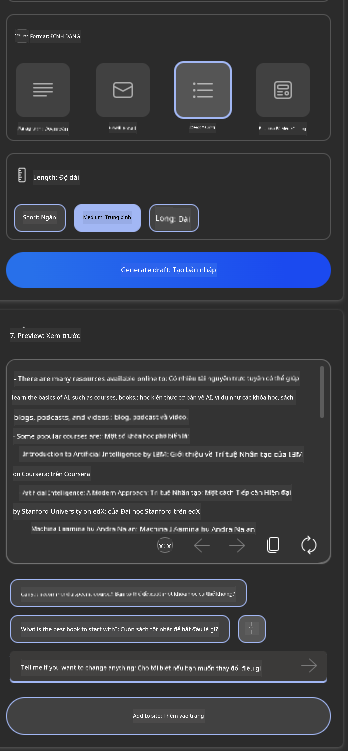
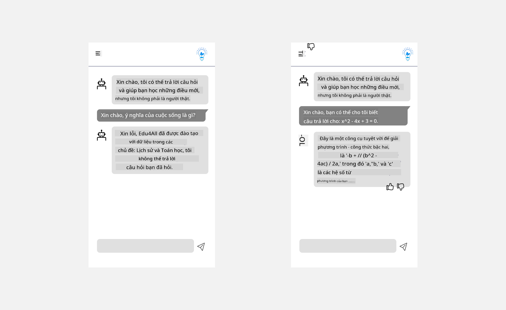

<!--
CO_OP_TRANSLATOR_METADATA:
{
  "original_hash": "ec385b41ee50579025d50cc03bfb3a25",
  "translation_date": "2025-06-25T20:28:13+00:00",
  "source_file": "12-designing-ux-for-ai-applications/README.md",
  "language_code": "vi"
}
-->
# Thiết Kế Trải Nghiệm Người Dùng cho Ứng Dụng AI

> _(Nhấp vào hình ảnh trên để xem video của bài học này)_

Trải nghiệm người dùng là một khía cạnh rất quan trọng khi xây dựng ứng dụng. Người dùng cần có khả năng sử dụng ứng dụng của bạn một cách hiệu quả để thực hiện các nhiệm vụ. Hiệu quả là một điều nhưng bạn cũng cần thiết kế ứng dụng để mọi người có thể sử dụng, làm cho nó _dễ tiếp cận_. Chương này sẽ tập trung vào lĩnh vực này để bạn có thể thiết kế một ứng dụng mà mọi người có thể và muốn sử dụng.

## Giới Thiệu

Trải nghiệm người dùng là cách một người dùng tương tác và sử dụng một sản phẩm hoặc dịch vụ cụ thể, dù đó là hệ thống, công cụ hay thiết kế. Khi phát triển các ứng dụng AI, các nhà phát triển không chỉ tập trung vào việc đảm bảo trải nghiệm người dùng hiệu quả mà còn phải có đạo đức. Trong bài học này, chúng ta sẽ tìm hiểu cách xây dựng các ứng dụng Trí Tuệ Nhân Tạo (AI) đáp ứng nhu cầu của người dùng.

Bài học sẽ bao gồm các lĩnh vực sau:

- Giới thiệu về Trải Nghiệm Người Dùng và Hiểu Nhu Cầu Người Dùng
- Thiết Kế Ứng Dụng AI cho Sự Tin Cậy và Minh Bạch
- Thiết Kế Ứng Dụng AI cho Sự Hợp Tác và Phản Hồi

## Mục Tiêu Học Tập

Sau khi hoàn thành bài học này, bạn sẽ có thể:

- Hiểu cách xây dựng ứng dụng AI đáp ứng nhu cầu của người dùng.
- Thiết kế ứng dụng AI thúc đẩy sự tin cậy và hợp tác.

### Điều Kiện Tiên Quyết

Dành thời gian và đọc thêm về [trải nghiệm người dùng và tư duy thiết kế.](https://learn.microsoft.com/training/modules/ux-design?WT.mc_id=academic-105485-koreyst)

## Giới Thiệu về Trải Nghiệm Người Dùng và Hiểu Nhu Cầu Người Dùng

Trong startup giáo dục giả định của chúng ta, chúng ta có hai người dùng chính, giáo viên và học sinh. Mỗi người dùng có nhu cầu riêng biệt. Thiết kế tập trung vào người dùng ưu tiên người dùng, đảm bảo các sản phẩm phù hợp và có lợi cho những người mà nó hướng đến.

Ứng dụng nên **hữu ích, đáng tin cậy, dễ tiếp cận và thú vị** để mang lại trải nghiệm người dùng tốt.

### Tính Hữu Ích

Hữu ích có nghĩa là ứng dụng có chức năng phù hợp với mục đích sử dụng, chẳng hạn như tự động hóa quá trình chấm điểm hoặc tạo flashcard cho việc ôn tập. Một ứng dụng tự động hóa quá trình chấm điểm nên có khả năng gán điểm chính xác và hiệu quả cho công việc của học sinh dựa trên tiêu chí đã định trước. Tương tự, một ứng dụng tạo flashcard ôn tập nên có khả năng tạo ra các câu hỏi phù hợp và đa dạng dựa trên dữ liệu của nó.

### Đáng Tin Cậy

Đáng tin cậy có nghĩa là ứng dụng có thể thực hiện nhiệm vụ của mình một cách nhất quán và không có lỗi. Tuy nhiên, AI cũng giống như con người không hoàn hảo và có thể dễ mắc lỗi. Các ứng dụng có thể gặp lỗi hoặc tình huống không mong đợi cần sự can thiệp hoặc sửa chữa của con người. Làm thế nào để bạn xử lý lỗi? Trong phần cuối của bài học này, chúng ta sẽ tìm hiểu cách thiết kế các hệ thống và ứng dụng AI để hợp tác và phản hồi.

### Dễ Tiếp Cận

Dễ tiếp cận có nghĩa là mở rộng trải nghiệm người dùng đến những người dùng với nhiều khả năng khác nhau, bao gồm cả những người khuyết tật, đảm bảo không ai bị bỏ lại phía sau. Bằng cách tuân theo các hướng dẫn và nguyên tắc về khả năng tiếp cận, các giải pháp AI trở nên bao gồm hơn, dễ sử dụng và có lợi cho tất cả người dùng.

### Thú Vị

Thú vị có nghĩa là ứng dụng mang lại niềm vui khi sử dụng. Một trải nghiệm người dùng hấp dẫn có thể có tác động tích cực đến người dùng, khuyến khích họ quay lại sử dụng ứng dụng và tăng doanh thu kinh doanh.

Không phải mọi thách thức đều có thể được giải quyết bằng AI. AI đến để bổ sung trải nghiệm người dùng của bạn, dù đó là tự động hóa các nhiệm vụ thủ công hay cá nhân hóa trải nghiệm người dùng.

## Thiết Kế Ứng Dụng AI cho Sự Tin Cậy và Minh Bạch

Xây dựng sự tin cậy là rất quan trọng khi thiết kế các ứng dụng AI. Sự tin cậy đảm bảo người dùng tự tin rằng ứng dụng sẽ hoàn thành công việc, cung cấp kết quả nhất quán và kết quả đó là những gì người dùng cần. Một rủi ro trong lĩnh vực này là sự không tin tưởng và tin tưởng quá mức. Không tin tưởng xảy ra khi người dùng có ít hoặc không có niềm tin vào hệ thống AI, điều này dẫn đến việc người dùng từ chối ứng dụng của bạn. Tin tưởng quá mức xảy ra khi người dùng đánh giá quá cao khả năng của hệ thống AI, dẫn đến việc người dùng tin tưởng hệ thống AI quá nhiều. Ví dụ, một hệ thống chấm điểm tự động trong trường hợp tin tưởng quá mức có thể dẫn đến việc giáo viên không kiểm tra lại một số bài để đảm bảo hệ thống chấm điểm hoạt động tốt. Điều này có thể dẫn đến điểm số không công bằng hoặc không chính xác cho học sinh, hoặc bỏ lỡ cơ hội phản hồi và cải thiện.

Hai cách để đảm bảo rằng sự tin cậy được đặt vào trung tâm thiết kế là khả năng giải thích và kiểm soát.

### Khả Năng Giải Thích

Khi AI giúp đưa ra quyết định như truyền đạt kiến thức cho thế hệ tương lai, điều quan trọng là giáo viên và phụ huynh phải hiểu cách AI đưa ra quyết định. Đây là khả năng giải thích - hiểu cách ứng dụng AI đưa ra quyết định. Thiết kế cho khả năng giải thích bao gồm việc thêm chi tiết về các ví dụ về những gì một ứng dụng AI có thể làm. Ví dụ, thay vì "Bắt đầu với AI giáo viên", hệ thống có thể sử dụng: "Tóm tắt ghi chú của bạn để dễ dàng ôn tập bằng AI."

Một ví dụ khác là cách AI sử dụng dữ liệu người dùng và cá nhân. Ví dụ, một người dùng với persona học sinh có thể có giới hạn dựa trên persona của họ. AI có thể không tiết lộ câu trả lời cho các câu hỏi nhưng có thể giúp hướng dẫn người dùng suy nghĩ cách giải quyết vấn đề.

Một phần quan trọng cuối cùng của khả năng giải thích là đơn giản hóa các giải thích. Học sinh và giáo viên có thể không phải là chuyên gia AI, do đó các giải thích về những gì ứng dụng có thể hoặc không thể làm nên được đơn giản hóa và dễ hiểu.

### Kiểm Soát

AI tạo ra sự hợp tác giữa AI và người dùng, nơi mà ví dụ một người dùng có thể chỉnh sửa prompt để có kết quả khác nhau. Ngoài ra, khi một đầu ra được tạo ra, người dùng nên có khả năng chỉnh sửa kết quả, mang lại cho họ cảm giác kiểm soát. Ví dụ, khi sử dụng Bing, bạn có thể tùy chỉnh prompt của mình dựa trên định dạng, giọng điệu và độ dài. Ngoài ra, bạn có thể thêm thay đổi vào đầu ra của mình và chỉnh sửa đầu ra như dưới đây:

Một tính năng khác trong Bing cho phép người dùng có quyền kiểm soát ứng dụng là khả năng chọn tham gia và chọn không tham gia vào dữ liệu mà AI sử dụng. Đối với một ứng dụng trường học, một học sinh có thể muốn sử dụng ghi chú của họ cũng như tài liệu của giáo viên làm tài liệu ôn tập.

> Khi thiết kế các ứng dụng AI, sự cố ý là chìa khóa để đảm bảo người dùng không tin tưởng quá mức, đặt ra những kỳ vọng không thực tế về khả năng của nó. Một cách để làm điều này là tạo ra sự ma sát giữa prompt và kết quả. Nhắc nhở người dùng rằng đây là AI và không phải là một con người

## Thiết Kế Ứng Dụng AI cho Sự Hợp Tác và Phản Hồi

Như đã đề cập trước đó, AI tạo ra sự hợp tác giữa người dùng và AI. Hầu hết các tương tác là với người dùng nhập prompt và AI tạo ra một đầu ra. Nếu đầu ra không chính xác thì sao? Ứng dụng xử lý lỗi như thế nào nếu chúng xảy ra? AI có đổ lỗi cho người dùng hay dành thời gian giải thích lỗi không?

Các ứng dụng AI nên được xây dựng để nhận và đưa ra phản hồi. Điều này không chỉ giúp hệ thống AI cải thiện mà còn xây dựng sự tin cậy với người dùng. Một vòng phản hồi nên được bao gồm trong thiết kế, một ví dụ có thể là một nút thích hoặc không thích đơn giản trên đầu ra.

Một cách khác để xử lý điều này là truyền đạt rõ ràng khả năng và giới hạn của hệ thống. Khi người dùng mắc lỗi yêu cầu điều gì đó ngoài khả năng của AI, cũng nên có cách xử lý điều này, như được hiển thị dưới đây.

Lỗi hệ thống là phổ biến với các ứng dụng mà người dùng có thể cần trợ giúp với thông tin ngoài phạm vi của AI hoặc ứng dụng có thể có giới hạn về số lượng câu hỏi/chủ đề mà người dùng có thể tạo tóm tắt. Ví dụ, một ứng dụng AI được đào tạo với dữ liệu về các chủ đề hạn chế, chẳng hạn như Lịch sử và Toán học, có thể không thể xử lý các câu hỏi về Địa lý. Để giảm thiểu điều này, hệ thống AI có thể đưa ra phản hồi như: "Xin lỗi, sản phẩm của chúng tôi đã được đào tạo với dữ liệu trong các chủ đề sau....., tôi không thể trả lời câu hỏi bạn đã hỏi."

Các ứng dụng AI không hoàn hảo, do đó, chúng có thể mắc sai lầm. Khi thiết kế ứng dụng của bạn, bạn nên đảm bảo tạo không gian cho phản hồi từ người dùng và xử lý lỗi một cách đơn giản và dễ hiểu.

## Bài Tập

Lấy bất kỳ ứng dụng AI nào bạn đã xây dựng cho đến nay, xem xét thực hiện các bước dưới đây trong ứng dụng của bạn:

- **Thú vị:** Xem xét cách bạn có thể làm cho ứng dụng của mình thú vị hơn. Bạn có đang thêm giải thích ở mọi nơi không? Bạn có đang khuyến khích người dùng khám phá không? Bạn đang diễn đạt thông điệp lỗi của mình như thế nào?

- **Tính Hữu Ích:** Xây dựng một ứng dụng web. Đảm bảo ứng dụng của bạn có thể điều hướng bằng cả chuột và bàn phím.

- **Sự Tin Cậy và Minh Bạch:** Đừng tin tưởng hoàn toàn vào AI và đầu ra của nó, xem xét cách bạn sẽ thêm một con người vào quy trình để xác minh đầu ra. Ngoài ra, xem xét và thực hiện các cách khác để đạt được sự tin cậy và minh bạch.

- **Kiểm Soát:** Cung cấp cho người dùng quyền kiểm soát dữ liệu mà họ cung cấp cho ứng dụng. Thực hiện một cách để người dùng có thể chọn tham gia và chọn không tham gia vào việc thu thập dữ liệu trong ứng dụng AI.

## Tiếp Tục Học Tập!

Sau khi hoàn thành bài học này, hãy xem bộ sưu tập [Học Tập AI Tạo Sinh](https://aka.ms/genai-collection?WT.mc_id=academic-105485-koreyst) của chúng tôi để tiếp tục nâng cao kiến thức AI Tạo Sinh của bạn!

Hãy chuyển sang Bài học 13, nơi chúng ta sẽ tìm hiểu cách [bảo mật các ứng dụng AI](../13-securing-ai-applications/README.md?WT.mc_id=academic-105485-koreyst)!

**Tuyên bố miễn trừ trách nhiệm**:  
Tài liệu này đã được dịch bằng dịch vụ dịch thuật AI [Co-op Translator](https://github.com/Azure/co-op-translator). Mặc dù chúng tôi cố gắng đảm bảo độ chính xác, xin lưu ý rằng các bản dịch tự động có thể chứa lỗi hoặc sự không chính xác. Tài liệu gốc bằng ngôn ngữ bản địa nên được coi là nguồn tài liệu có thẩm quyền. Đối với thông tin quan trọng, nên sử dụng dịch vụ dịch thuật chuyên nghiệp của con người. Chúng tôi không chịu trách nhiệm cho bất kỳ sự hiểu lầm hoặc diễn giải sai nào phát sinh từ việc sử dụng bản dịch này.