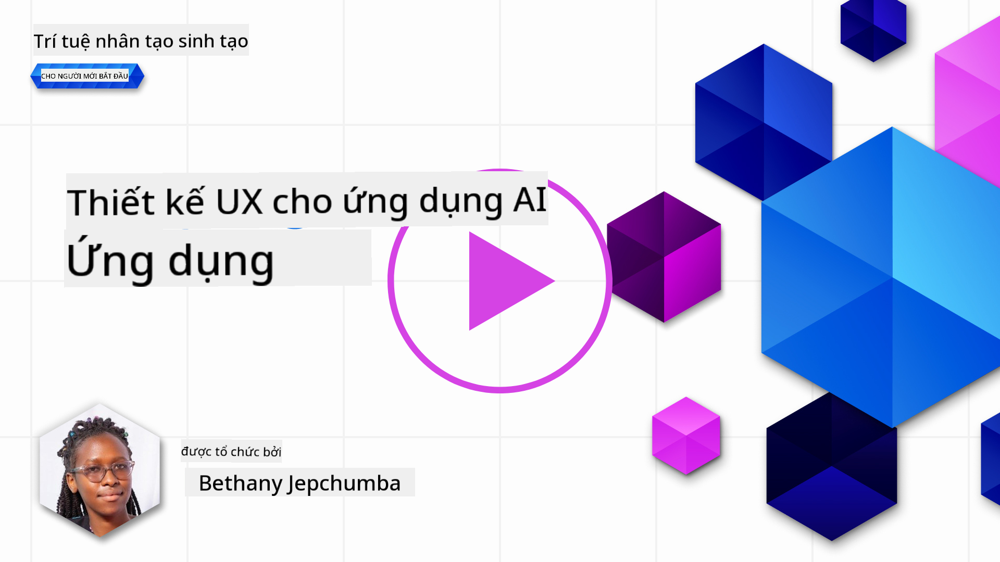
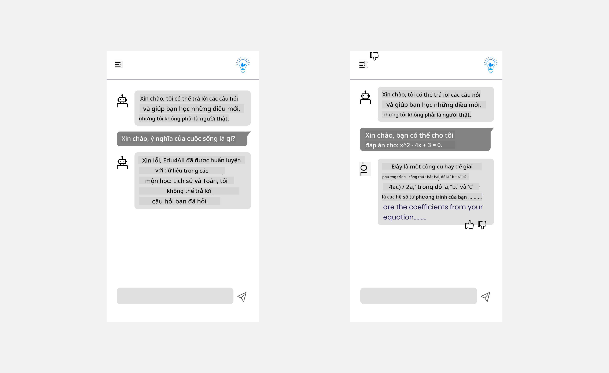

<!--
CO_OP_TRANSLATOR_METADATA:
{
  "original_hash": "747668e4c53d067369f06e9ec2e6313e",
  "translation_date": "2025-08-26T18:14:11+00:00",
  "source_file": "12-designing-ux-for-ai-applications/README.md",
  "language_code": "vi"
}
-->
# Thiết kế Trải nghiệm Người dùng (UX) cho Ứng dụng AI

> _(Nhấn vào hình trên để xem video của bài học này)_

Trải nghiệm người dùng là một yếu tố rất quan trọng khi xây dựng ứng dụng. Người dùng cần có khả năng sử dụng ứng dụng của bạn một cách hiệu quả để hoàn thành công việc. Hiệu quả là một chuyện, nhưng bạn cũng cần thiết kế ứng dụng sao cho mọi người đều có thể sử dụng, tức là _dễ tiếp cận_. Chương này sẽ tập trung vào chủ đề này để bạn có thể thiết kế một ứng dụng mà mọi người đều có thể và muốn sử dụng.

## Giới thiệu

Trải nghiệm người dùng là cách một người dùng tương tác và sử dụng một sản phẩm hoặc dịch vụ cụ thể, có thể là một hệ thống, công cụ hoặc thiết kế. Khi phát triển các ứng dụng AI, các nhà phát triển không chỉ tập trung vào việc đảm bảo trải nghiệm người dùng hiệu quả mà còn phải đảm bảo tính đạo đức. Trong bài học này, chúng ta sẽ tìm hiểu cách xây dựng các ứng dụng Trí tuệ Nhân tạo (AI) đáp ứng nhu cầu của người dùng.

Bài học này sẽ đề cập đến các nội dung sau:

- Giới thiệu về Trải nghiệm Người dùng và Hiểu Nhu cầu Người dùng
- Thiết kế Ứng dụng AI hướng đến Sự tin tưởng và Minh bạch
- Thiết kế Ứng dụng AI cho Sự hợp tác và Phản hồi

## Mục tiêu học tập

Sau khi hoàn thành bài học này, bạn sẽ có thể:

- Hiểu cách xây dựng ứng dụng AI đáp ứng nhu cầu người dùng.
- Thiết kế ứng dụng AI thúc đẩy sự tin tưởng và hợp tác.

### Yêu cầu trước

Hãy dành thời gian đọc thêm về [trải nghiệm người dùng và tư duy thiết kế.](https://learn.microsoft.com/training/modules/ux-design?WT.mc_id=academic-105485-koreyst)

## Giới thiệu về Trải nghiệm Người dùng và Hiểu Nhu cầu Người dùng

Trong startup giáo dục giả định của chúng ta, có hai nhóm người dùng chính: giáo viên và học sinh. Mỗi nhóm có những nhu cầu riêng biệt. Thiết kế lấy người dùng làm trung tâm sẽ ưu tiên người dùng, đảm bảo sản phẩm phù hợp và mang lại lợi ích cho đúng đối tượng.

Ứng dụng nên **hữu ích, đáng tin cậy, dễ tiếp cận và dễ chịu** để mang lại trải nghiệm người dùng tốt.

### Tính hữu dụng

Hữu ích nghĩa là ứng dụng có các chức năng phù hợp với mục đích sử dụng, ví dụ như tự động chấm điểm hoặc tạo thẻ ghi nhớ cho việc ôn tập. Một ứng dụng tự động chấm điểm cần có khả năng chấm điểm chính xác và hiệu quả dựa trên tiêu chí đã định sẵn. Tương tự, ứng dụng tạo thẻ ghi nhớ cần tạo ra các câu hỏi phù hợp và đa dạng dựa trên dữ liệu có sẵn.

### Độ tin cậy

Đáng tin cậy nghĩa là ứng dụng có thể thực hiện nhiệm vụ một cách nhất quán và không mắc lỗi. Tuy nhiên, AI cũng như con người, không hoàn hảo và có thể gặp lỗi. Ứng dụng có thể gặp sự cố hoặc tình huống bất ngờ cần sự can thiệp hoặc chỉnh sửa của con người. Làm thế nào để xử lý lỗi? Ở phần cuối của bài học này, chúng ta sẽ tìm hiểu cách thiết kế hệ thống AI cho sự hợp tác và phản hồi.

### Tính dễ tiếp cận

Dễ tiếp cận nghĩa là mở rộng trải nghiệm người dùng cho mọi đối tượng, bao gồm cả người khuyết tật, đảm bảo không ai bị bỏ lại phía sau. Bằng cách tuân thủ các nguyên tắc và hướng dẫn về khả năng tiếp cận, giải pháp AI sẽ trở nên toàn diện, dễ sử dụng và mang lại lợi ích cho tất cả người dùng.

### Dễ chịu

Dễ chịu nghĩa là ứng dụng mang lại cảm giác thoải mái, thích thú khi sử dụng. Trải nghiệm người dùng hấp dẫn có thể tạo tác động tích cực, khuyến khích người dùng quay lại ứng dụng và tăng doanh thu cho doanh nghiệp.

Không phải thách thức nào cũng có thể giải quyết bằng AI. AI được sử dụng để tăng cường trải nghiệm người dùng, ví dụ như tự động hóa các tác vụ thủ công hoặc cá nhân hóa trải nghiệm.

## Thiết kế Ứng dụng AI hướng đến Sự tin tưởng và Minh bạch

Xây dựng sự tin tưởng là yếu tố then chốt khi thiết kế ứng dụng AI. Sự tin tưởng giúp người dùng yên tâm rằng ứng dụng sẽ hoàn thành công việc, mang lại kết quả nhất quán và đáp ứng đúng nhu cầu. Rủi ro ở đây là mất niềm tin hoặc quá tin tưởng. Mất niềm tin xảy ra khi người dùng không tin hoặc ít tin vào hệ thống AI, dẫn đến việc từ chối sử dụng ứng dụng. Quá tin tưởng xảy ra khi người dùng đánh giá quá cao khả năng của AI, dẫn đến việc quá phụ thuộc vào hệ thống. Ví dụ, hệ thống chấm điểm tự động nếu bị quá tin tưởng có thể khiến giáo viên không kiểm tra lại bài, dẫn đến điểm số không công bằng hoặc thiếu chính xác, hoặc bỏ lỡ cơ hội phản hồi và cải thiện.

Hai cách để đảm bảo sự tin tưởng được đặt ở trung tâm thiết kế là khả năng giải thích và quyền kiểm soát.

### Khả năng giải thích

Khi AI hỗ trợ ra quyết định, ví dụ như truyền đạt kiến thức cho thế hệ tương lai, điều quan trọng là giáo viên và phụ huynh phải hiểu cách AI đưa ra quyết định. Đó là khả năng giải thích - hiểu được cách ứng dụng AI đưa ra quyết định. Thiết kế cho khả năng giải thích bao gồm việc bổ sung thông tin làm rõ cách AI tạo ra kết quả. Người dùng cần biết rằng kết quả được tạo ra bởi AI chứ không phải con người. Ví dụ, thay vì nói "Bắt đầu trò chuyện với gia sư của bạn ngay bây giờ", hãy nói "Sử dụng gia sư AI phù hợp với nhu cầu của bạn và giúp bạn học theo tốc độ riêng".

Một ví dụ khác là cách AI sử dụng dữ liệu cá nhân và thông tin người dùng. Ví dụ, một người dùng với vai trò học sinh có thể bị giới hạn dựa trên vai trò đó. AI có thể không tiết lộ đáp án nhưng sẽ hướng dẫn người dùng suy nghĩ để tự giải quyết vấn đề.

Một yếu tố quan trọng nữa của khả năng giải thích là đơn giản hóa lời giải thích. Học sinh và giáo viên có thể không phải là chuyên gia AI, vì vậy các giải thích về những gì ứng dụng có thể hoặc không thể làm nên được trình bày đơn giản, dễ hiểu.

### Quyền kiểm soát

AI sinh sinh tạo ra sự hợp tác giữa AI và người dùng, ví dụ người dùng có thể chỉnh sửa prompt để nhận kết quả khác nhau. Ngoài ra, sau khi có kết quả, người dùng nên có khả năng chỉnh sửa kết quả để cảm thấy mình có quyền kiểm soát. Ví dụ, khi sử dụng Bing, bạn có thể điều chỉnh prompt theo định dạng, giọng điệu và độ dài. Bạn cũng có thể chỉnh sửa kết quả như hình dưới đây:

Một tính năng khác của Bing cho phép người dùng kiểm soát ứng dụng là khả năng chọn tham gia hoặc không tham gia vào việc sử dụng dữ liệu của AI. Đối với ứng dụng trường học, học sinh có thể muốn sử dụng cả ghi chú cá nhân và tài liệu của giáo viên để ôn tập.

> Khi thiết kế ứng dụng AI, sự chủ động là yếu tố then chốt để đảm bảo người dùng không quá tin tưởng và đặt kỳ vọng không thực tế vào khả năng của AI. Một cách để làm điều này là tạo ra sự "ma sát" giữa prompt và kết quả. Nhắc nhở người dùng rằng đây là AI chứ không phải con người.

## Thiết kế Ứng dụng AI cho Sự hợp tác và Phản hồi

Như đã đề cập, AI sinh sinh tạo ra sự hợp tác giữa người dùng và AI. Phần lớn tương tác là người dùng nhập prompt và AI tạo ra kết quả. Vậy nếu kết quả sai thì sao? Ứng dụng xử lý lỗi như thế nào? AI có đổ lỗi cho người dùng hay giải thích nguyên nhân lỗi?

Ứng dụng AI nên được xây dựng để nhận và cung cấp phản hồi. Điều này không chỉ giúp hệ thống AI cải thiện mà còn xây dựng niềm tin với người dùng. Vòng lặp phản hồi nên được tích hợp vào thiết kế, ví dụ như nút thích hoặc không thích cho kết quả.

Một cách khác để xử lý là truyền đạt rõ ràng khả năng và giới hạn của hệ thống. Khi người dùng yêu cầu điều gì đó vượt quá khả năng của AI, cũng cần có cách xử lý phù hợp như hình dưới đây.

Lỗi hệ thống là điều thường gặp với các ứng dụng, khi người dùng cần thông tin ngoài phạm vi AI hoặc ứng dụng giới hạn số lượng câu hỏi/chủ đề mà người dùng có thể tạo tóm tắt. Ví dụ, một ứng dụng AI chỉ được huấn luyện với dữ liệu về Lịch sử và Toán sẽ không thể trả lời câu hỏi về Địa lý. Để khắc phục, hệ thống AI có thể trả lời: "Xin lỗi, sản phẩm của chúng tôi chỉ được huấn luyện với dữ liệu các môn sau....., tôi không thể trả lời câu hỏi bạn vừa hỏi."

Ứng dụng AI không hoàn hảo, vì vậy chắc chắn sẽ có sai sót. Khi thiết kế ứng dụng, bạn nên đảm bảo có chỗ cho phản hồi từ người dùng và xử lý lỗi một cách đơn giản, dễ hiểu.

## Bài tập

Hãy lấy bất kỳ ứng dụng AI nào bạn đã xây dựng, cân nhắc thực hiện các bước sau trong ứng dụng của mình:

- **Dễ chịu:** Xem xét cách làm cho ứng dụng của bạn dễ chịu hơn. Bạn đã giải thích ở mọi nơi chưa? Bạn có khuyến khích người dùng khám phá không? Bạn diễn đạt thông báo lỗi như thế nào?

- **Tính hữu dụng:** Nếu xây dựng web app, hãy đảm bảo ứng dụng của bạn có thể điều hướng bằng cả chuột và bàn phím.

- **Tin tưởng và minh bạch:** Đừng hoàn toàn tin tưởng vào AI và kết quả của nó, hãy cân nhắc cách thêm yếu tố con người để xác minh kết quả. Đồng thời, cân nhắc và triển khai các cách khác để xây dựng sự tin tưởng và minh bạch.

- **Quyền kiểm soát:** Cho phép người dùng kiểm soát dữ liệu mà họ cung cấp cho ứng dụng. Triển khai cách để người dùng có thể chọn tham gia hoặc không tham gia thu thập dữ liệu trong ứng dụng AI.

## Tiếp tục học tập!

Sau khi hoàn thành bài học này, hãy khám phá [Bộ sưu tập học Generative AI](https://aka.ms/genai-collection?WT.mc_id=academic-105485-koreyst) để tiếp tục nâng cao kiến thức về Generative AI!

Hãy chuyển sang Bài học 13, nơi chúng ta sẽ tìm hiểu về [bảo mật ứng dụng AI](../13-securing-ai-applications/README.md?WT.mc_id=academic-105485-koreyst)!

---

**Tuyên bố miễn trừ trách nhiệm**:
Tài liệu này đã được dịch bằng dịch vụ dịch thuật AI [Co-op Translator](https://github.com/Azure/co-op-translator). Mặc dù chúng tôi cố gắng đảm bảo độ chính xác, xin lưu ý rằng các bản dịch tự động có thể chứa lỗi hoặc không chính xác. Tài liệu gốc bằng ngôn ngữ bản địa nên được coi là nguồn tham khảo chính thức. Đối với các thông tin quan trọng, khuyến nghị sử dụng dịch vụ dịch thuật chuyên nghiệp bởi con người. Chúng tôi không chịu trách nhiệm về bất kỳ sự hiểu lầm hoặc diễn giải sai nào phát sinh từ việc sử dụng bản dịch này.