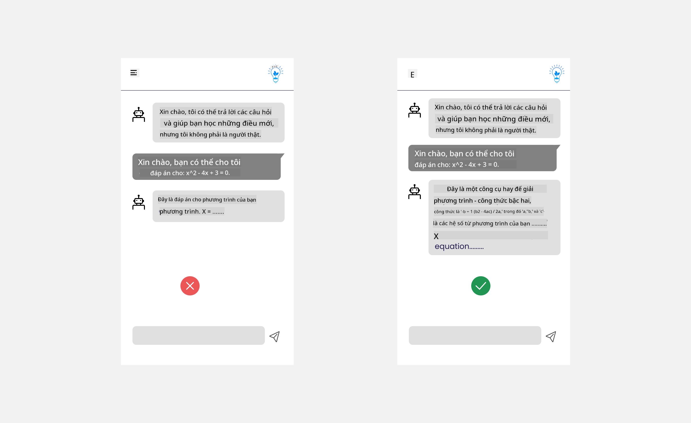

<!--
CO_OP_TRANSLATOR_METADATA:
{
  "original_hash": "78bbeed50fd4dc9fdee931f5daf98cb3",
  "translation_date": "2025-10-17T20:31:26+00:00",
  "source_file": "12-designing-ux-for-ai-applications/README.md",
  "language_code": "vi"
}
-->
# Thiết kế UX cho Ứng dụng AI

> _(Nhấn vào hình ảnh trên để xem video của bài học này)_

Trải nghiệm người dùng là một khía cạnh rất quan trọng trong việc xây dựng ứng dụng. Người dùng cần có khả năng sử dụng ứng dụng của bạn một cách hiệu quả để thực hiện các nhiệm vụ. Hiệu quả là một điều, nhưng bạn cũng cần thiết kế ứng dụng sao cho mọi người đều có thể sử dụng, để làm cho nó _dễ tiếp cận_. Chương này sẽ tập trung vào lĩnh vực này để bạn có thể thiết kế một ứng dụng mà mọi người có thể và muốn sử dụng.

## Giới thiệu

Trải nghiệm người dùng là cách mà người dùng tương tác và sử dụng một sản phẩm hoặc dịch vụ cụ thể, dù đó là hệ thống, công cụ hay thiết kế. Khi phát triển các ứng dụng AI, các nhà phát triển không chỉ tập trung vào việc đảm bảo trải nghiệm người dùng hiệu quả mà còn phải đảm bảo tính đạo đức. Trong bài học này, chúng ta sẽ tìm hiểu cách xây dựng các ứng dụng Trí tuệ Nhân tạo (AI) đáp ứng nhu cầu của người dùng.

Bài học sẽ bao gồm các nội dung sau:

- Giới thiệu về Trải nghiệm Người dùng và Hiểu Nhu cầu của Người dùng
- Thiết kế Ứng dụng AI để Tăng Cường Niềm Tin và Tính Minh Bạch
- Thiết kế Ứng dụng AI để Tăng Cường Hợp Tác và Phản Hồi

## Mục tiêu học tập

Sau khi hoàn thành bài học này, bạn sẽ có thể:

- Hiểu cách xây dựng các ứng dụng AI đáp ứng nhu cầu của người dùng.
- Thiết kế các ứng dụng AI thúc đẩy niềm tin và sự hợp tác.

### Yêu cầu trước

Hãy dành thời gian để tìm hiểu thêm về [trải nghiệm người dùng và tư duy thiết kế.](https://learn.microsoft.com/training/modules/ux-design?WT.mc_id=academic-105485-koreyst)

## Giới thiệu về Trải nghiệm Người dùng và Hiểu Nhu cầu của Người dùng

Trong startup giáo dục giả định của chúng ta, có hai nhóm người dùng chính, giáo viên và học sinh. Mỗi nhóm người dùng có nhu cầu riêng biệt. Thiết kế tập trung vào người dùng ưu tiên người dùng, đảm bảo sản phẩm phù hợp và hữu ích cho những người mà nó hướng đến.

Ứng dụng nên **hữu ích, đáng tin cậy, dễ tiếp cận và thú vị** để mang lại trải nghiệm người dùng tốt.

### Tính hữu dụng

Hữu ích có nghĩa là ứng dụng có chức năng phù hợp với mục đích sử dụng, chẳng hạn như tự động hóa quá trình chấm điểm hoặc tạo thẻ ghi nhớ để ôn tập. Một ứng dụng tự động hóa quá trình chấm điểm cần có khả năng chấm điểm chính xác và hiệu quả cho bài làm của học sinh dựa trên các tiêu chí đã được định trước. Tương tự, một ứng dụng tạo thẻ ghi nhớ ôn tập cần có khả năng tạo ra các câu hỏi liên quan và đa dạng dựa trên dữ liệu của nó.

### Tính đáng tin cậy

Đáng tin cậy có nghĩa là ứng dụng có thể thực hiện nhiệm vụ của mình một cách nhất quán và không có lỗi. Tuy nhiên, AI cũng giống như con người, không hoàn hảo và có thể gặp lỗi. Các ứng dụng có thể gặp phải lỗi hoặc tình huống bất ngờ cần sự can thiệp hoặc chỉnh sửa của con người. Làm thế nào để bạn xử lý lỗi? Trong phần cuối của bài học này, chúng ta sẽ tìm hiểu cách các hệ thống và ứng dụng AI được thiết kế để hợp tác và phản hồi.

### Tính dễ tiếp cận

Dễ tiếp cận có nghĩa là mở rộng trải nghiệm người dùng đến những người dùng có khả năng khác nhau, bao gồm cả những người khuyết tật, đảm bảo không ai bị bỏ lại phía sau. Bằng cách tuân theo các hướng dẫn và nguyên tắc về khả năng tiếp cận, các giải pháp AI trở nên bao quát hơn, dễ sử dụng và hữu ích cho tất cả người dùng.

### Tính thú vị

Thú vị có nghĩa là ứng dụng mang lại cảm giác dễ chịu khi sử dụng. Một trải nghiệm người dùng hấp dẫn có thể có tác động tích cực đến người dùng, khuyến khích họ quay lại ứng dụng và tăng doanh thu kinh doanh.

Không phải mọi thách thức đều có thể được giải quyết bằng AI. AI được sử dụng để tăng cường trải nghiệm người dùng, dù là tự động hóa các nhiệm vụ thủ công hay cá nhân hóa trải nghiệm người dùng.

## Thiết kế Ứng dụng AI để Tăng Cường Niềm Tin và Tính Minh Bạch

Xây dựng niềm tin là yếu tố quan trọng khi thiết kế các ứng dụng AI. Niềm tin đảm bảo rằng người dùng tự tin rằng ứng dụng sẽ hoàn thành công việc, cung cấp kết quả một cách nhất quán và kết quả đó là những gì người dùng cần. Một rủi ro trong lĩnh vực này là sự thiếu tin tưởng và sự tin tưởng quá mức. Thiếu tin tưởng xảy ra khi người dùng có ít hoặc không tin tưởng vào hệ thống AI, dẫn đến việc người dùng từ chối ứng dụng của bạn. Tin tưởng quá mức xảy ra khi người dùng đánh giá quá cao khả năng của hệ thống AI, dẫn đến việc người dùng tin tưởng hệ thống AI quá mức. Ví dụ, một hệ thống chấm điểm tự động trong trường hợp tin tưởng quá mức có thể khiến giáo viên không kiểm tra lại một số bài làm để đảm bảo hệ thống chấm điểm hoạt động tốt. Điều này có thể dẫn đến việc chấm điểm không công bằng hoặc không chính xác cho học sinh, hoặc bỏ lỡ cơ hội để đưa ra phản hồi và cải thiện.

Hai cách để đảm bảo rằng niềm tin được đặt đúng trọng tâm của thiết kế là tính giải thích và kiểm soát.

### Tính giải thích

Khi AI giúp đưa ra quyết định như truyền đạt kiến thức cho các thế hệ tương lai, điều quan trọng là giáo viên và phụ huynh phải hiểu cách các quyết định của AI được đưa ra. Đây là tính giải thích - hiểu cách các ứng dụng AI đưa ra quyết định. Thiết kế cho tính giải thích bao gồm việc thêm các chi tiết làm nổi bật cách AI đạt được kết quả. Người dùng phải nhận thức rằng kết quả được tạo ra bởi AI chứ không phải con người. Ví dụ, thay vì nói "Bắt đầu trò chuyện với gia sư của bạn ngay bây giờ" hãy nói "Sử dụng gia sư AI thích ứng với nhu cầu của bạn và giúp bạn học theo tốc độ của mình."

Một ví dụ khác là cách AI sử dụng dữ liệu người dùng và dữ liệu cá nhân. Ví dụ, một người dùng với nhân vật học sinh có thể có những hạn chế dựa trên nhân vật của họ. AI có thể không tiết lộ câu trả lời cho các câu hỏi nhưng có thể giúp hướng dẫn người dùng suy nghĩ cách giải quyết vấn đề.

Một phần quan trọng cuối cùng của tính giải thích là sự đơn giản hóa các giải thích. Học sinh và giáo viên có thể không phải là chuyên gia về AI, do đó các giải thích về những gì ứng dụng có thể hoặc không thể làm nên được đơn giản hóa và dễ hiểu.

### Kiểm soát

AI tạo ra sự hợp tác giữa AI và người dùng, nơi mà ví dụ người dùng có thể chỉnh sửa các yêu cầu để có kết quả khác nhau. Ngoài ra, khi một kết quả được tạo ra, người dùng nên có khả năng chỉnh sửa kết quả, mang lại cho họ cảm giác kiểm soát. Ví dụ, khi sử dụng Bing, bạn có thể điều chỉnh yêu cầu của mình dựa trên định dạng, giọng điệu và độ dài. Ngoài ra, bạn có thể thêm thay đổi vào kết quả và chỉnh sửa kết quả như hình dưới đây:

Một tính năng khác trong Bing cho phép người dùng kiểm soát ứng dụng là khả năng chọn tham gia hoặc không tham gia vào dữ liệu mà AI sử dụng. Đối với một ứng dụng trường học, một học sinh có thể muốn sử dụng ghi chú của mình cũng như tài liệu của giáo viên làm tài liệu ôn tập.

> Khi thiết kế các ứng dụng AI, sự cố ý là yếu tố quan trọng để đảm bảo người dùng không tin tưởng quá mức, đặt ra những kỳ vọng không thực tế về khả năng của nó. Một cách để làm điều này là tạo ra sự cản trở giữa các yêu cầu và kết quả. Nhắc nhở người dùng rằng đây là AI chứ không phải một con người.

## Thiết kế Ứng dụng AI để Tăng Cường Hợp Tác và Phản Hồi

Như đã đề cập trước đó, AI tạo ra sự hợp tác giữa người dùng và AI. Hầu hết các tương tác là người dùng nhập yêu cầu và AI tạo ra kết quả. Nếu kết quả không chính xác thì sao? Làm thế nào ứng dụng xử lý lỗi nếu chúng xảy ra? AI có đổ lỗi cho người dùng hay dành thời gian để giải thích lỗi?

Các ứng dụng AI nên được xây dựng để nhận và cung cấp phản hồi. Điều này không chỉ giúp hệ thống AI cải thiện mà còn xây dựng niềm tin với người dùng. Một vòng lặp phản hồi nên được bao gồm trong thiết kế, một ví dụ có thể là một nút thích hoặc không thích đơn giản trên kết quả.

Một cách khác để xử lý điều này là truyền đạt rõ ràng khả năng và hạn chế của hệ thống. Khi người dùng mắc lỗi yêu cầu điều gì đó vượt quá khả năng của AI, cũng nên có cách để xử lý điều này, như hình dưới đây.

Lỗi hệ thống là điều phổ biến với các ứng dụng, nơi người dùng có thể cần hỗ trợ thông tin ngoài phạm vi của AI hoặc ứng dụng có thể có giới hạn về số lượng câu hỏi/chủ đề mà người dùng có thể tạo tóm tắt. Ví dụ, một ứng dụng AI được đào tạo với dữ liệu về các môn học giới hạn, chẳng hạn như Lịch sử và Toán học, có thể không xử lý được các câu hỏi liên quan đến Địa lý. Để giảm thiểu điều này, hệ thống AI có thể đưa ra phản hồi như: "Xin lỗi, sản phẩm của chúng tôi đã được đào tạo với dữ liệu trong các môn học sau....., tôi không thể trả lời câu hỏi bạn đã hỏi."

Các ứng dụng AI không hoàn hảo, do đó, chúng có thể mắc lỗi. Khi thiết kế ứng dụng của bạn, bạn nên đảm bảo tạo không gian cho phản hồi từ người dùng và xử lý lỗi một cách đơn giản và dễ hiểu.

## Bài tập

Hãy xem xét bất kỳ ứng dụng AI nào bạn đã xây dựng cho đến nay, và cân nhắc thực hiện các bước dưới đây trong ứng dụng của bạn:

- **Thú vị:** Xem xét cách bạn có thể làm cho ứng dụng của mình thú vị hơn. Bạn có thêm giải thích ở mọi nơi không? Bạn có khuyến khích người dùng khám phá không? Bạn diễn đạt thông điệp lỗi như thế nào?

- **Hữu dụng:** Xây dựng một ứng dụng web. Đảm bảo ứng dụng của bạn có thể điều hướng bằng cả chuột và bàn phím.

- **Niềm tin và tính minh bạch:** Đừng hoàn toàn tin tưởng vào AI và kết quả của nó, hãy xem xét cách bạn có thể thêm yếu tố con người vào quy trình để xác minh kết quả. Ngoài ra, hãy xem xét và thực hiện các cách khác để đạt được niềm tin và tính minh bạch.

- **Kiểm soát:** Cung cấp cho người dùng quyền kiểm soát dữ liệu mà họ cung cấp cho ứng dụng. Thực hiện cách để người dùng có thể chọn tham gia hoặc không tham gia vào việc thu thập dữ liệu trong ứng dụng AI.

<!-- ## [Câu hỏi sau bài giảng](../../../12-designing-ux-for-ai-applications/quiz-url) -->

## Tiếp tục học tập!

Sau khi hoàn thành bài học này, hãy xem bộ sưu tập [Học về AI Tạo sinh](https://aka.ms/genai-collection?WT.mc_id=academic-105485-koreyst) của chúng tôi để tiếp tục nâng cao kiến thức về AI Tạo sinh!

Hãy chuyển sang Bài học 13, nơi chúng ta sẽ tìm hiểu cách [bảo mật các ứng dụng AI](../13-securing-ai-applications/README.md?WT.mc_id=academic-105485-koreyst)!

---

**Tuyên bố miễn trừ trách nhiệm**:  
Tài liệu này đã được dịch bằng dịch vụ dịch thuật AI [Co-op Translator](https://github.com/Azure/co-op-translator). Mặc dù chúng tôi cố gắng đảm bảo độ chính xác, xin lưu ý rằng các bản dịch tự động có thể chứa lỗi hoặc không chính xác. Tài liệu gốc bằng ngôn ngữ bản địa nên được coi là nguồn thông tin chính thức. Đối với thông tin quan trọng, khuyến nghị sử dụng dịch vụ dịch thuật chuyên nghiệp bởi con người. Chúng tôi không chịu trách nhiệm cho bất kỳ sự hiểu lầm hoặc diễn giải sai nào phát sinh từ việc sử dụng bản dịch này.