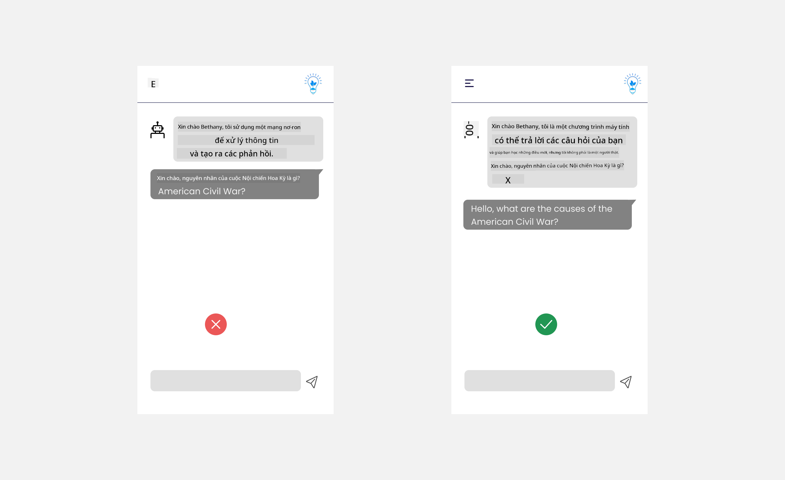

<!--
CO_OP_TRANSLATOR_METADATA:
{
  "original_hash": "ec385b41ee50579025d50cc03bfb3a25",
  "translation_date": "2025-07-09T15:01:05+00:00",
  "source_file": "12-designing-ux-for-ai-applications/README.md",
  "language_code": "vi"
}
-->
# Thiết kế UX cho Ứng dụng AI

> _(Nhấp vào hình ảnh trên để xem video bài học này)_

Trải nghiệm người dùng là một khía cạnh rất quan trọng trong việc xây dựng ứng dụng. Người dùng cần có khả năng sử dụng ứng dụng của bạn một cách hiệu quả để thực hiện các nhiệm vụ. Hiệu quả là một điều, nhưng bạn cũng cần thiết kế ứng dụng sao cho mọi người đều có thể sử dụng được, để làm cho chúng _dễ tiếp cận_. Chương này sẽ tập trung vào lĩnh vực này để bạn có thể thiết kế một ứng dụng mà mọi người có thể và muốn sử dụng.

## Giới thiệu

Trải nghiệm người dùng là cách một người dùng tương tác và sử dụng một sản phẩm hoặc dịch vụ cụ thể, có thể là hệ thống, công cụ hoặc thiết kế. Khi phát triển các ứng dụng AI, các nhà phát triển không chỉ tập trung vào việc đảm bảo trải nghiệm người dùng hiệu quả mà còn phải đảm bảo tính đạo đức. Trong bài học này, chúng ta sẽ tìm hiểu cách xây dựng các ứng dụng Trí tuệ Nhân tạo (AI) đáp ứng nhu cầu của người dùng.

Bài học sẽ bao gồm các nội dung sau:

- Giới thiệu về Trải nghiệm Người dùng và Hiểu nhu cầu Người dùng
- Thiết kế Ứng dụng AI để xây dựng Niềm tin và Tính minh bạch
- Thiết kế Ứng dụng AI cho Hợp tác và Phản hồi

## Mục tiêu học tập

Sau khi hoàn thành bài học này, bạn sẽ có thể:

- Hiểu cách xây dựng các ứng dụng AI đáp ứng nhu cầu người dùng.
- Thiết kế các ứng dụng AI thúc đẩy niềm tin và sự hợp tác.

### Yêu cầu trước

Dành chút thời gian đọc thêm về [trải nghiệm người dùng và tư duy thiết kế.](https://learn.microsoft.com/training/modules/ux-design?WT.mc_id=academic-105485-koreyst)

## Giới thiệu về Trải nghiệm Người dùng và Hiểu nhu cầu Người dùng

Trong startup giáo dục giả định của chúng ta, có hai nhóm người dùng chính là giáo viên và học sinh. Mỗi nhóm người dùng đều có những nhu cầu riêng biệt. Thiết kế lấy người dùng làm trung tâm ưu tiên người dùng, đảm bảo sản phẩm phù hợp và có lợi cho những người mà nó hướng đến.

Ứng dụng nên **hữu ích, đáng tin cậy, dễ tiếp cận và dễ chịu** để mang lại trải nghiệm người dùng tốt.

### Tính khả dụng

Hữu ích có nghĩa là ứng dụng có các chức năng phù hợp với mục đích sử dụng, chẳng hạn như tự động chấm điểm hoặc tạo flashcard để ôn tập. Một ứng dụng tự động chấm điểm cần có khả năng chấm điểm chính xác và hiệu quả dựa trên các tiêu chí đã định trước. Tương tự, một ứng dụng tạo flashcard ôn tập cần có khả năng tạo ra các câu hỏi phù hợp và đa dạng dựa trên dữ liệu của nó.

### Độ tin cậy

Đáng tin cậy có nghĩa là ứng dụng có thể thực hiện nhiệm vụ một cách nhất quán và không gặp lỗi. Tuy nhiên, AI cũng giống như con người, không hoàn hảo và có thể mắc lỗi. Ứng dụng có thể gặp phải lỗi hoặc tình huống bất ngờ cần sự can thiệp hoặc chỉnh sửa của con người. Bạn sẽ xử lý lỗi như thế nào? Ở phần cuối của bài học này, chúng ta sẽ tìm hiểu cách thiết kế hệ thống và ứng dụng AI để hợp tác và nhận phản hồi.

### Khả năng tiếp cận

Dễ tiếp cận có nghĩa là mở rộng trải nghiệm người dùng đến những người dùng có khả năng khác nhau, bao gồm cả người khuyết tật, đảm bảo không ai bị bỏ lại phía sau. Bằng cách tuân theo các hướng dẫn và nguyên tắc về khả năng tiếp cận, các giải pháp AI trở nên bao trùm hơn, dễ sử dụng và có lợi cho tất cả người dùng.

### Dễ chịu

Dễ chịu có nghĩa là ứng dụng mang lại cảm giác thoải mái khi sử dụng. Một trải nghiệm người dùng hấp dẫn có thể tạo ảnh hưởng tích cực, khuyến khích người dùng quay lại ứng dụng và tăng doanh thu cho doanh nghiệp.

Không phải mọi thách thức đều có thể giải quyết bằng AI. AI được sử dụng để tăng cường trải nghiệm người dùng, có thể là tự động hóa các công việc thủ công hoặc cá nhân hóa trải nghiệm người dùng.

## Thiết kế Ứng dụng AI để xây dựng Niềm tin và Tính minh bạch

Xây dựng niềm tin là điều then chốt khi thiết kế các ứng dụng AI. Niềm tin giúp người dùng tin tưởng rằng ứng dụng sẽ hoàn thành công việc, cung cấp kết quả nhất quán và kết quả đó đúng với những gì người dùng cần. Một rủi ro trong lĩnh vực này là mất niềm tin hoặc tin tưởng quá mức. Mất niềm tin xảy ra khi người dùng không hoặc rất ít tin tưởng vào hệ thống AI, dẫn đến việc từ chối sử dụng ứng dụng. Tin tưởng quá mức xảy ra khi người dùng đánh giá quá cao khả năng của hệ thống AI, dẫn đến việc tin tưởng AI quá mức. Ví dụ, trong hệ thống chấm điểm tự động, tin tưởng quá mức có thể khiến giáo viên không kiểm tra lại một số bài làm, dẫn đến điểm số không công bằng hoặc không chính xác cho học sinh, hoặc bỏ lỡ cơ hội phản hồi và cải thiện.

Hai cách để đảm bảo niềm tin được đặt đúng vị trí trung tâm trong thiết kế là khả năng giải thích và kiểm soát.

### Khả năng giải thích

Khi AI giúp đưa ra quyết định như truyền đạt kiến thức cho các thế hệ tương lai, việc giáo viên và phụ huynh hiểu cách AI đưa ra quyết định là rất quan trọng. Đây chính là khả năng giải thích - hiểu cách các ứng dụng AI đưa ra quyết định. Thiết kế để có khả năng giải thích bao gồm việc thêm các ví dụ chi tiết về những gì ứng dụng AI có thể làm. Ví dụ, thay vì "Bắt đầu với AI giáo viên", hệ thống có thể sử dụng: "Tóm tắt ghi chú của bạn để ôn tập dễ dàng hơn bằng AI."

Một ví dụ khác là cách AI sử dụng dữ liệu người dùng và dữ liệu cá nhân. Ví dụ, một người dùng với vai trò học sinh có thể có những giới hạn dựa trên vai trò đó. AI có thể không tiết lộ trực tiếp câu trả lời nhưng có thể hướng dẫn người dùng suy nghĩ cách giải quyết vấn đề.

Một phần quan trọng cuối cùng của khả năng giải thích là đơn giản hóa các giải thích. Học sinh và giáo viên có thể không phải là chuyên gia AI, do đó các giải thích về những gì ứng dụng có thể hoặc không thể làm nên được đơn giản hóa và dễ hiểu.

### Kiểm soát

Generative AI tạo ra sự hợp tác giữa AI và người dùng, ví dụ như người dùng có thể chỉnh sửa các câu lệnh để có kết quả khác nhau. Thêm vào đó, khi một kết quả được tạo ra, người dùng nên có khả năng chỉnh sửa kết quả đó để cảm thấy mình có quyền kiểm soát. Ví dụ, khi sử dụng Bing, bạn có thể điều chỉnh câu lệnh dựa trên định dạng, giọng điệu và độ dài. Ngoài ra, bạn có thể thêm các thay đổi vào kết quả và chỉnh sửa kết quả như hình dưới đây:

Một tính năng khác trong Bing cho phép người dùng kiểm soát ứng dụng là khả năng chọn tham gia hoặc không tham gia vào việc sử dụng dữ liệu AI. Ví dụ, trong ứng dụng dành cho trường học, học sinh có thể muốn sử dụng ghi chú của mình cũng như tài nguyên của giáo viên làm tài liệu ôn tập.

> Khi thiết kế ứng dụng AI, sự chủ ý là yếu tố then chốt để đảm bảo người dùng không tin tưởng quá mức, đặt ra kỳ vọng không thực tế về khả năng của ứng dụng. Một cách để làm điều này là tạo ra sự cản trở giữa câu lệnh và kết quả, nhắc nhở người dùng rằng đây là AI chứ không phải con người.

## Thiết kế Ứng dụng AI cho Hợp tác và Phản hồi

Như đã đề cập trước đó, generative AI tạo ra sự hợp tác giữa người dùng và AI. Phần lớn tương tác là người dùng nhập câu lệnh và AI tạo ra kết quả. Nếu kết quả sai thì sao? Ứng dụng xử lý lỗi như thế nào khi xảy ra? AI có đổ lỗi cho người dùng hay dành thời gian giải thích lỗi?

Ứng dụng AI nên được xây dựng để nhận và đưa phản hồi. Điều này không chỉ giúp hệ thống AI cải thiện mà còn xây dựng niềm tin với người dùng. Một vòng phản hồi nên được tích hợp trong thiết kế, ví dụ như nút thích hoặc không thích đơn giản cho kết quả.

Một cách khác để xử lý là truyền đạt rõ ràng khả năng và giới hạn của hệ thống. Khi người dùng yêu cầu điều gì đó vượt quá khả năng của AI, cũng nên có cách xử lý, như minh họa dưới đây.

Lỗi hệ thống là điều phổ biến với các ứng dụng, khi người dùng có thể cần trợ giúp với thông tin ngoài phạm vi của AI hoặc ứng dụng có giới hạn về số lượng câu hỏi/môn học mà người dùng có thể tạo tóm tắt. Ví dụ, một ứng dụng AI được đào tạo với dữ liệu về các môn học hạn chế như Lịch sử và Toán có thể không xử lý được các câu hỏi về Địa lý. Để giảm thiểu điều này, hệ thống AI có thể trả lời như sau: "Xin lỗi, sản phẩm của chúng tôi được đào tạo với dữ liệu về các môn học sau..., tôi không thể trả lời câu hỏi bạn đã hỏi."

Ứng dụng AI không hoàn hảo, do đó chắc chắn sẽ có sai sót. Khi thiết kế ứng dụng, bạn nên tạo điều kiện để người dùng phản hồi và xử lý lỗi một cách đơn giản và dễ hiểu.

## Bài tập

Hãy lấy bất kỳ ứng dụng AI nào bạn đã xây dựng cho đến nay, cân nhắc thực hiện các bước dưới đây trong ứng dụng của bạn:

- **Dễ chịu:** Xem xét cách làm cho ứng dụng của bạn dễ chịu hơn. Bạn có đang thêm giải thích ở khắp nơi không? Bạn có khuyến khích người dùng khám phá không? Bạn đang diễn đạt thông báo lỗi như thế nào?

- **Tính khả dụng:** Xây dựng một ứng dụng web. Đảm bảo ứng dụng của bạn có thể điều hướng được bằng cả chuột và bàn phím.

- **Niềm tin và tính minh bạch:** Đừng hoàn toàn tin tưởng AI và kết quả của nó, hãy cân nhắc cách bạn thêm con người vào quy trình để xác minh kết quả. Ngoài ra, hãy cân nhắc và thực hiện các cách khác để đạt được niềm tin và tính minh bạch.

- **Kiểm soát:** Cho phép người dùng kiểm soát dữ liệu họ cung cấp cho ứng dụng. Thực hiện cách để người dùng có thể chọn tham gia hoặc không tham gia thu thập dữ liệu trong ứng dụng AI.

## Tiếp tục học tập!

Sau khi hoàn thành bài học này, hãy khám phá bộ sưu tập [Generative AI Learning](https://aka.ms/genai-collection?WT.mc_id=academic-105485-koreyst) để tiếp tục nâng cao kiến thức về Generative AI!

Hãy đến với Bài học 13, nơi chúng ta sẽ tìm hiểu cách [bảo mật ứng dụng AI](../13-securing-ai-applications/README.md?WT.mc_id=academic-105485-koreyst)!

**Tuyên bố từ chối trách nhiệm**:  
Tài liệu này đã được dịch bằng dịch vụ dịch thuật AI [Co-op Translator](https://github.com/Azure/co-op-translator). Mặc dù chúng tôi cố gắng đảm bảo độ chính xác, xin lưu ý rằng các bản dịch tự động có thể chứa lỗi hoặc không chính xác. Tài liệu gốc bằng ngôn ngữ gốc của nó nên được coi là nguồn chính xác và đáng tin cậy. Đối với các thông tin quan trọng, nên sử dụng dịch vụ dịch thuật chuyên nghiệp do con người thực hiện. Chúng tôi không chịu trách nhiệm về bất kỳ sự hiểu lầm hoặc giải thích sai nào phát sinh từ việc sử dụng bản dịch này.