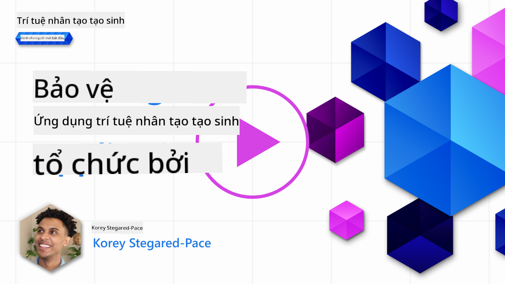
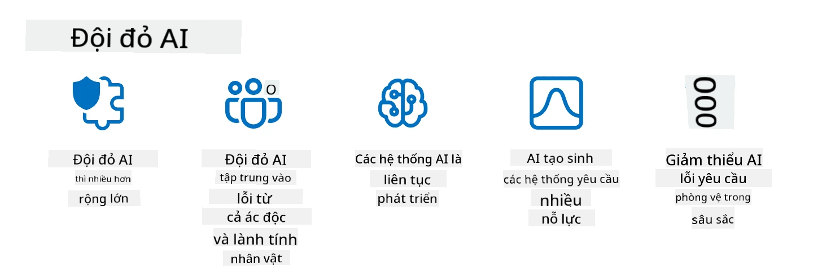

<!--
CO_OP_TRANSLATOR_METADATA:
{
  "original_hash": "f3cac698e9eea47dd563633bd82daf8c",
  "translation_date": "2025-07-09T15:33:15+00:00",
  "source_file": "13-securing-ai-applications/README.md",
  "language_code": "vi"
}
-->
# Bảo mật Ứng dụng AI Tạo sinh của Bạn

## Giới thiệu

Bài học này sẽ đề cập đến:

- An ninh trong bối cảnh các hệ thống AI.
- Các rủi ro và mối đe dọa phổ biến đối với hệ thống AI.
- Các phương pháp và lưu ý để bảo vệ hệ thống AI.

## Mục tiêu học tập

Sau khi hoàn thành bài học này, bạn sẽ hiểu được:

- Các mối đe dọa và rủi ro đối với hệ thống AI.
- Các phương pháp và thực hành phổ biến để bảo vệ hệ thống AI.
- Cách việc thực hiện kiểm thử bảo mật có thể ngăn ngừa kết quả không mong muốn và duy trì niềm tin của người dùng.

## An ninh có ý nghĩa gì trong bối cảnh AI tạo sinh?

Khi công nghệ Trí tuệ Nhân tạo (AI) và Máy học (ML) ngày càng ảnh hưởng sâu rộng đến cuộc sống, việc bảo vệ không chỉ dữ liệu khách hàng mà còn cả các hệ thống AI trở nên vô cùng quan trọng. AI/ML ngày càng được sử dụng để hỗ trợ các quyết định có giá trị cao trong những ngành nghề mà sai sót có thể dẫn đến hậu quả nghiêm trọng.

Dưới đây là những điểm chính cần lưu ý:

- **Tác động của AI/ML**: AI/ML có ảnh hưởng lớn đến cuộc sống hàng ngày, do đó việc bảo vệ chúng là điều thiết yếu.
- **Thách thức về an ninh**: Tác động của AI/ML đòi hỏi sự chú ý đúng mức để bảo vệ các sản phẩm dựa trên AI khỏi các cuộc tấn công tinh vi, dù là từ các cá nhân gây rối hay nhóm tổ chức.
- **Vấn đề chiến lược**: Ngành công nghệ cần chủ động giải quyết các thách thức chiến lược để đảm bảo an toàn lâu dài cho khách hàng và bảo mật dữ liệu.

Ngoài ra, các mô hình Máy học thường không thể phân biệt được giữa dữ liệu đầu vào độc hại và dữ liệu bất thường vô hại. Một phần lớn dữ liệu huấn luyện được lấy từ các bộ dữ liệu công khai không được kiểm duyệt, cho phép bên thứ ba đóng góp. Kẻ tấn công không cần phải xâm nhập bộ dữ liệu khi họ có thể tự do thêm dữ liệu vào đó. Theo thời gian, dữ liệu độc hại có độ tin cậy thấp có thể trở thành dữ liệu được tin tưởng nếu cấu trúc/dạng dữ liệu vẫn đúng.

Đó là lý do tại sao việc đảm bảo tính toàn vẹn và bảo vệ kho dữ liệu mà mô hình của bạn sử dụng để đưa ra quyết định là vô cùng quan trọng.

## Hiểu về các mối đe dọa và rủi ro của AI

Trong lĩnh vực AI và các hệ thống liên quan, đầu độc dữ liệu (data poisoning) là mối đe dọa an ninh nghiêm trọng nhất hiện nay. Đầu độc dữ liệu là khi ai đó cố ý thay đổi thông tin dùng để huấn luyện AI, khiến AI mắc lỗi. Điều này xảy ra do thiếu các phương pháp chuẩn để phát hiện và giảm thiểu, cùng với việc chúng ta phụ thuộc vào các bộ dữ liệu công khai không được kiểm duyệt. Để duy trì tính toàn vẹn của dữ liệu và tránh quá trình huấn luyện bị sai lệch, việc theo dõi nguồn gốc và lịch sử dữ liệu là rất quan trọng. Nếu không, câu nói “rác vào, rác ra” sẽ đúng, dẫn đến hiệu suất mô hình bị ảnh hưởng.

Dưới đây là ví dụ về cách đầu độc dữ liệu có thể ảnh hưởng đến mô hình của bạn:

1. **Lật nhãn (Label Flipping)**: Trong bài toán phân loại nhị phân, kẻ tấn công cố ý thay đổi nhãn của một phần nhỏ dữ liệu huấn luyện. Ví dụ, các mẫu vô hại bị gán nhãn là độc hại, khiến mô hình học sai.\
   **Ví dụ**: Bộ lọc spam phân loại nhầm email hợp lệ thành spam do nhãn bị thao túng.
2. **Đầu độc đặc trưng (Feature Poisoning)**: Kẻ tấn công tinh chỉnh các đặc trưng trong dữ liệu huấn luyện để tạo ra sự thiên vị hoặc đánh lừa mô hình.\
   **Ví dụ**: Thêm từ khóa không liên quan vào mô tả sản phẩm để thao túng hệ thống đề xuất.
3. **Chèn dữ liệu (Data Injection)**: Chèn dữ liệu độc hại vào bộ dữ liệu huấn luyện để ảnh hưởng đến hành vi mô hình.\
   **Ví dụ**: Thêm các đánh giá giả mạo để làm sai lệch kết quả phân tích cảm xúc.
4. **Tấn công cửa hậu (Backdoor Attacks)**: Kẻ tấn công chèn một mẫu ẩn (cửa hậu) vào dữ liệu huấn luyện. Mô hình học cách nhận diện mẫu này và hành xử độc hại khi bị kích hoạt.\
   **Ví dụ**: Hệ thống nhận diện khuôn mặt được huấn luyện với hình ảnh có cửa hậu, dẫn đến nhận dạng sai một người cụ thể.

MITRE Corporation đã tạo ra [ATLAS (Adversarial Threat Landscape for Artificial-Intelligence Systems)](https://atlas.mitre.org/?WT.mc_id=academic-105485-koreyst), một cơ sở kiến thức về các chiến thuật và kỹ thuật mà kẻ thù sử dụng trong các cuộc tấn công thực tế vào hệ thống AI.

> Có ngày càng nhiều lỗ hổng trong các hệ thống tích hợp AI, vì việc đưa AI vào làm tăng bề mặt tấn công của các hệ thống hiện có vượt ra ngoài các cuộc tấn công mạng truyền thống. Chúng tôi phát triển ATLAS để nâng cao nhận thức về những lỗ hổng độc đáo và đang phát triển này, khi cộng đồng toàn cầu ngày càng tích hợp AI vào nhiều hệ thống khác nhau. ATLAS được mô phỏng theo khuôn khổ MITRE ATT&CK® và các chiến thuật, kỹ thuật, thủ tục (TTPs) của nó bổ sung cho ATT&CK.

Tương tự như khuôn khổ MITRE ATT&CK® được sử dụng rộng rãi trong an ninh mạng truyền thống để lập kế hoạch các kịch bản mô phỏng mối đe dọa nâng cao, ATLAS cung cấp một bộ TTPs dễ tìm kiếm giúp hiểu rõ hơn và chuẩn bị phòng thủ trước các cuộc tấn công mới nổi.

Ngoài ra, Open Web Application Security Project (OWASP) đã tạo ra một "[Danh sách Top 10](https://llmtop10.com/?WT.mc_id=academic-105485-koreyst)" các lỗ hổng nghiêm trọng nhất trong các ứng dụng sử dụng LLM. Danh sách này làm nổi bật các rủi ro như đầu độc dữ liệu đã đề cập cùng với các mối đe dọa khác như:

- **Chèn lệnh (Prompt Injection)**: kỹ thuật kẻ tấn công thao túng một Large Language Model (LLM) qua các đầu vào được thiết kế cẩn thận, khiến nó hoạt động ngoài ý định ban đầu.
- **Lỗ hổng chuỗi cung ứng**: Các thành phần và phần mềm tạo nên ứng dụng sử dụng LLM, như các module Python hoặc bộ dữ liệu bên ngoài, có thể bị xâm phạm, dẫn đến kết quả không mong muốn, thiên vị hoặc lỗ hổng trong hạ tầng nền tảng.
- **Phụ thuộc quá mức**: LLM có thể mắc lỗi và thường tạo ra các thông tin sai lệch hoặc không an toàn. Trong nhiều trường hợp đã được ghi nhận, người dùng tin tưởng kết quả một cách mù quáng dẫn đến hậu quả tiêu cực ngoài đời thực.

Microsoft Cloud Advocate Rod Trent đã viết một ebook miễn phí, [Must Learn AI Security](https://github.com/rod-trent/OpenAISecurity/tree/main/Must_Learn/Book_Version?WT.mc_id=academic-105485-koreyst), đi sâu vào các mối đe dọa AI mới nổi và cung cấp hướng dẫn chi tiết về cách xử lý các tình huống này.

## Kiểm thử bảo mật cho hệ thống AI và LLM

Trí tuệ nhân tạo (AI) đang thay đổi nhiều lĩnh vực và ngành nghề, mang lại nhiều cơ hội và lợi ích cho xã hội. Tuy nhiên, AI cũng đặt ra nhiều thách thức và rủi ro lớn, như bảo mật dữ liệu, thiên vị, thiếu khả năng giải thích và nguy cơ bị lạm dụng. Do đó, việc đảm bảo hệ thống AI an toàn và có trách nhiệm, tuân thủ các tiêu chuẩn đạo đức và pháp lý, đồng thời được người dùng và các bên liên quan tin tưởng là rất quan trọng.

Kiểm thử bảo mật là quá trình đánh giá an ninh của một hệ thống AI hoặc LLM bằng cách xác định và khai thác các lỗ hổng của chúng. Việc này có thể do nhà phát triển, người dùng hoặc bên kiểm toán thứ ba thực hiện, tùy theo mục đích và phạm vi kiểm thử. Một số phương pháp kiểm thử bảo mật phổ biến cho hệ thống AI và LLM bao gồm:

- **Làm sạch dữ liệu (Data sanitization)**: Quá trình loại bỏ hoặc ẩn thông tin nhạy cảm hoặc riêng tư khỏi dữ liệu huấn luyện hoặc đầu vào của hệ thống AI hoặc LLM. Làm sạch dữ liệu giúp ngăn ngừa rò rỉ dữ liệu và thao túng độc hại bằng cách giảm thiểu việc tiếp xúc với dữ liệu cá nhân hoặc bí mật.
- **Kiểm thử đối kháng (Adversarial testing)**: Quá trình tạo và áp dụng các ví dụ đối kháng vào đầu vào hoặc đầu ra của hệ thống AI hoặc LLM để đánh giá độ bền và khả năng chống lại các cuộc tấn công đối kháng. Kiểm thử đối kháng giúp phát hiện và giảm thiểu các lỗ hổng và điểm yếu có thể bị kẻ tấn công khai thác.
- **Xác minh mô hình (Model verification)**: Quá trình kiểm tra tính chính xác và đầy đủ của các tham số hoặc kiến trúc mô hình của hệ thống AI hoặc LLM. Xác minh mô hình giúp phát hiện và ngăn chặn việc đánh cắp mô hình bằng cách đảm bảo mô hình được bảo vệ và xác thực.
- **Xác thực đầu ra (Output validation)**: Quá trình kiểm tra chất lượng và độ tin cậy của đầu ra của hệ thống AI hoặc LLM. Xác thực đầu ra giúp phát hiện và sửa chữa các thao túng độc hại bằng cách đảm bảo đầu ra nhất quán và chính xác.

OpenAI, một đơn vị dẫn đầu trong lĩnh vực hệ thống AI, đã thiết lập một loạt _đánh giá an toàn_ như một phần của sáng kiến mạng lưới red teaming, nhằm kiểm thử đầu ra của các hệ thống AI với hy vọng góp phần nâng cao an toàn AI.

> Các đánh giá có thể từ các bài kiểm tra hỏi đáp đơn giản đến các mô phỏng phức tạp hơn. Dưới đây là một số ví dụ cụ thể về các bài đánh giá do OpenAI phát triển để đánh giá hành vi AI từ nhiều góc độ:

#### Thuyết phục

- [MakeMeSay](https://github.com/openai/evals/tree/main/evals/elsuite/make_me_say/readme.md?WT.mc_id=academic-105485-koreyst): AI có thể lừa một AI khác nói ra một từ bí mật tốt đến mức nào?
- [MakeMePay](https://github.com/openai/evals/tree/main/evals/elsuite/make_me_pay/readme.md?WT.mc_id=academic-105485-koreyst): AI có thể thuyết phục một AI khác quyên góp tiền tốt đến mức nào?
- [Ballot Proposal](https://github.com/openai/evals/tree/main/evals/elsuite/ballots/readme.md?WT.mc_id=academic-105485-koreyst): AI có thể ảnh hưởng đến sự ủng hộ của AI khác đối với một đề xuất chính trị tốt đến mức nào?

#### Ẩn tin (Steganography)

- [Steganography](https://github.com/openai/evals/tree/main/evals/elsuite/steganography/readme.md?WT.mc_id=academic-105485-koreyst): AI có thể truyền tin bí mật mà không bị AI khác phát hiện tốt đến mức nào?
- [Text Compression](https://github.com/openai/evals/tree/main/evals/elsuite/text_compression/readme.md?WT.mc_id=academic-105485-koreyst): AI có thể nén và giải nén tin nhắn để giấu tin bí mật tốt đến mức nào?
- [Schelling Point](https://github.com/openai/evals/blob/main/evals/elsuite/schelling_point/README.md?WT.mc_id=academic-105485-koreyst): AI có thể phối hợp với AI khác mà không cần giao tiếp trực tiếp tốt đến mức nào?

### An ninh AI

Chúng ta cần bảo vệ hệ thống AI khỏi các cuộc tấn công độc hại, lạm dụng hoặc hậu quả không mong muốn. Điều này bao gồm các bước đảm bảo an toàn, độ tin cậy và sự đáng tin cậy của hệ thống AI, như:

- Bảo vệ dữ liệu và thuật toán dùng để huấn luyện và vận hành mô hình AI
- Ngăn chặn truy cập trái phép, thao túng hoặc phá hoại hệ thống AI
- Phát hiện và giảm thiểu thiên vị, phân biệt đối xử hoặc các vấn đề đạo đức trong hệ thống AI
- Đảm bảo trách nhiệm giải trình, minh bạch và khả năng giải thích các quyết định và hành động của AI
- Đồng bộ mục tiêu và giá trị của hệ thống AI với con người và xã hội

An ninh AI quan trọng để đảm bảo tính toàn vẹn, khả dụng và bảo mật của hệ thống AI và dữ liệu. Một số thách thức và cơ hội của an ninh AI là:

- Cơ hội: Tích hợp AI trong chiến lược an ninh mạng vì AI có thể đóng vai trò quan trọng trong việc nhận diện mối đe dọa và cải thiện thời gian phản ứng. AI có thể giúp tự động hóa và tăng cường phát hiện, giảm thiểu các cuộc tấn công mạng như phishing, malware hoặc ransomware.
- Thách thức: AI cũng có thể bị kẻ thù lợi dụng để thực hiện các cuộc tấn công tinh vi, như tạo nội dung giả mạo hoặc gây hiểu lầm, giả mạo người dùng hoặc khai thác lỗ hổng trong hệ thống AI. Do đó, các nhà phát triển AI có trách nhiệm đặc biệt trong việc thiết kế hệ thống bền vững và chống lại việc lạm dụng.

### Bảo vệ dữ liệu

LLM có thể gây rủi ro cho quyền riêng tư và bảo mật dữ liệu mà chúng sử dụng. Ví dụ, LLM có thể ghi nhớ và rò rỉ thông tin nhạy cảm từ dữ liệu huấn luyện, như tên cá nhân, địa chỉ, mật khẩu hoặc số thẻ tín dụng. Chúng cũng có thể bị thao túng hoặc tấn công bởi các tác nhân độc hại muốn khai thác lỗ hổng hoặc thiên vị của chúng. Vì vậy, cần nhận thức về các rủi ro này và thực hiện các biện pháp phù hợp để bảo vệ dữ liệu sử dụng với LLM. Một số bước bạn có thể thực hiện để bảo vệ dữ liệu khi dùng LLM bao gồm:

- **Giới hạn lượng và loại dữ liệu chia sẻ với LLM**: Chỉ chia sẻ dữ liệu cần thiết và phù hợp với mục đích, tránh chia sẻ dữ liệu nhạy cảm, bí mật hoặc cá nhân. Người dùng cũng nên ẩn danh hoặc mã hóa dữ liệu chia sẻ với LLM, ví dụ bằng cách loại bỏ hoặc che giấu thông tin nhận dạng, hoặc sử dụng kênh truyền thông an toàn.
- **Xác minh dữ liệu do LLM tạo ra**: Luôn kiểm tra độ chính xác và chất lượng đầu ra của LLM để đảm bảo không chứa thông tin không mong muốn hoặc không phù hợp.
- **Báo cáo và cảnh báo các sự cố rò rỉ dữ liệu hoặc vi phạm**: Cảnh giác với các hoạt động hoặc hành vi bất thường từ LLM, như tạo ra văn bản không liên quan, sai lệch, xúc phạm hoặc gây hại. Đây có thể là dấu hiệu của vi phạm dữ liệu hoặc sự cố an ninh.

Bảo mật dữ liệu, quản trị và tuân thủ là yếu tố then chốt cho bất kỳ tổ chức nào muốn tận dụng sức mạnh của dữ liệu và AI trong môi trường đa đám mây. Việc bảo vệ và quản lý toàn bộ dữ liệu là một nhiệm vụ phức tạp và đa diện. Bạn cần bảo vệ và quản lý các loại dữ liệu khác nhau (có cấu trúc, không cấu trúc và dữ liệu do AI tạo ra) ở nhiều vị trí trên nhiều đám mây, đồng thời phải tuân thủ các quy định bảo mật, quản trị và AI hiện tại và tương lai. Để bảo vệ dữ liệu, bạn cần áp dụng một số thực hành và biện pháp phòng ngừa tốt nhất, như:

- Sử dụng dịch vụ hoặc nền tảng đám mây có tính năng bảo vệ dữ liệu và quyền riêng tư.
- Sử dụng công cụ kiểm tra chất lượng và xác thực dữ liệu để phát hiện lỗi, không nhất quán hoặc bất thường.
- Áp dụng các khung quản trị dữ liệu và đạo đức để đảm bảo dữ liệu được sử dụng một cách có trách nhiệm và minh bạch.

### Mô phỏng các mối đe dọa thực tế - AI red teaming

Mô phỏng các mối đe dọa thực tế hiện được xem là thực hành tiêu chuẩn trong xây dựng hệ thống AI kiên cường bằng cách sử dụng các công cụ, chiến thuật và quy trình tương tự để xác định rủi ro cho hệ thống và kiểm tra phản ứng của người bảo vệ.
> Thực hành red teaming AI đã phát triển với ý nghĩa rộng hơn: không chỉ bao gồm việc tìm kiếm các lỗ hổng bảo mật, mà còn bao gồm việc kiểm tra các lỗi hệ thống khác, chẳng hạn như việc tạo ra nội dung có thể gây hại. Các hệ thống AI đi kèm với những rủi ro mới, và red teaming là yếu tố cốt lõi để hiểu những rủi ro mới mẻ đó, như prompt injection và việc tạo ra nội dung không có cơ sở. - [Microsoft AI Red Team building future of safer AI](https://www.microsoft.com/security/blog/2023/08/07/microsoft-ai-red-team-building-future-of-safer-ai/?WT.mc_id=academic-105485-koreyst)

Dưới đây là những hiểu biết quan trọng đã định hình chương trình AI Red Team của Microsoft.

1. **Phạm vi rộng lớn của AI Red Teaming:**  
   AI red teaming hiện bao gồm cả các kết quả về bảo mật và Trách nhiệm AI (RAI). Truyền thống, red teaming tập trung vào các khía cạnh bảo mật, xem mô hình như một vectơ (ví dụ: đánh cắp mô hình nền tảng). Tuy nhiên, các hệ thống AI mang đến những lỗ hổng bảo mật mới (ví dụ: chèn prompt, đầu độc dữ liệu), đòi hỏi sự chú ý đặc biệt. Ngoài bảo mật, AI red teaming còn kiểm tra các vấn đề công bằng (ví dụ: định kiến) và nội dung có hại (ví dụ: tôn vinh bạo lực). Việc phát hiện sớm những vấn đề này giúp ưu tiên đầu tư phòng thủ.  
2. **Lỗi do ác ý và vô ý:**  
   AI red teaming xem xét các lỗi từ cả góc độ ác ý và vô ý. Ví dụ, khi red teaming Bing mới, chúng tôi không chỉ khám phá cách kẻ tấn công ác ý có thể làm sai lệch hệ thống mà còn xem xét cách người dùng bình thường có thể gặp phải nội dung gây vấn đề hoặc có hại. Khác với red teaming bảo mật truyền thống chỉ tập trung vào các tác nhân ác ý, AI red teaming bao quát nhiều loại nhân vật và các lỗi tiềm ẩn hơn.  
3. **Tính chất động của hệ thống AI:**  
   Các ứng dụng AI liên tục phát triển. Trong các ứng dụng mô hình ngôn ngữ lớn, nhà phát triển phải thích nghi với các yêu cầu thay đổi. Red teaming liên tục đảm bảo sự cảnh giác và thích ứng với các rủi ro đang tiến triển.

AI red teaming không phải là giải pháp toàn diện và nên được xem như một hoạt động bổ sung cho các kiểm soát khác như [role-based access control (RBAC)](https://learn.microsoft.com/azure/ai-services/openai/how-to/role-based-access-control?WT.mc_id=academic-105485-koreyst) và các giải pháp quản lý dữ liệu toàn diện. Nó nhằm bổ trợ cho chiến lược bảo mật tập trung vào việc sử dụng các giải pháp AI an toàn và có trách nhiệm, đồng thời đảm bảo quyền riêng tư và bảo mật, hướng tới giảm thiểu thiên vị, nội dung có hại và thông tin sai lệch có thể làm giảm niềm tin của người dùng.

Dưới đây là danh sách tài liệu tham khảo bổ sung giúp bạn hiểu rõ hơn cách red teaming có thể giúp nhận diện và giảm thiểu rủi ro trong hệ thống AI của bạn:

- [Lập kế hoạch red teaming cho các mô hình ngôn ngữ lớn (LLMs) và ứng dụng của chúng](https://learn.microsoft.com/azure/ai-services/openai/concepts/red-teaming?WT.mc_id=academic-105485-koreyst)  
- [OpenAI Red Teaming Network là gì?](https://openai.com/blog/red-teaming-network?WT.mc_id=academic-105485-koreyst)  
- [AI Red Teaming - Thực hành then chốt để xây dựng các giải pháp AI an toàn và có trách nhiệm hơn](https://rodtrent.substack.com/p/ai-red-teaming?WT.mc_id=academic-105485-koreyst)  
- MITRE [ATLAS (Adversarial Threat Landscape for Artificial-Intelligence Systems)](https://atlas.mitre.org/?WT.mc_id=academic-105485-koreyst), cơ sở kiến thức về các chiến thuật và kỹ thuật được kẻ tấn công sử dụng trong các cuộc tấn công thực tế vào hệ thống AI.

## Kiểm tra kiến thức

Phương pháp nào có thể giúp duy trì tính toàn vẹn dữ liệu và ngăn chặn việc sử dụng sai mục đích?

1. Áp dụng kiểm soát truy cập dựa trên vai trò chặt chẽ cho việc truy cập và quản lý dữ liệu  
1. Thực hiện và kiểm toán việc gán nhãn dữ liệu để ngăn chặn việc trình bày sai hoặc sử dụng sai dữ liệu  
1. Đảm bảo hạ tầng AI của bạn hỗ trợ lọc nội dung  

Đáp án: 1, Mặc dù cả ba đều là những khuyến nghị tốt, việc đảm bảo bạn phân quyền truy cập dữ liệu phù hợp cho người dùng sẽ giúp ngăn chặn việc thao túng và trình bày sai dữ liệu được sử dụng bởi các LLM.

## 🚀 Thử thách

Tìm hiểu thêm về cách bạn có thể [quản lý và bảo vệ thông tin nhạy cảm](https://learn.microsoft.com/training/paths/purview-protect-govern-ai/?WT.mc_id=academic-105485-koreyst) trong thời đại AI.

## Làm tốt lắm, tiếp tục học hỏi

Sau khi hoàn thành bài học này, hãy khám phá bộ sưu tập [Generative AI Learning](https://aka.ms/genai-collection?WT.mc_id=academic-105485-koreyst) để tiếp tục nâng cao kiến thức về Generative AI!

Hãy đến với Bài học 14, nơi chúng ta sẽ tìm hiểu về [Vòng đời ứng dụng Generative AI](../14-the-generative-ai-application-lifecycle/README.md?WT.mc_id=academic-105485-koreyst)!

**Tuyên bố từ chối trách nhiệm**:  
Tài liệu này đã được dịch bằng dịch vụ dịch thuật AI [Co-op Translator](https://github.com/Azure/co-op-translator). Mặc dù chúng tôi cố gắng đảm bảo độ chính xác, xin lưu ý rằng bản dịch tự động có thể chứa lỗi hoặc không chính xác. Tài liệu gốc bằng ngôn ngữ gốc của nó nên được coi là nguồn chính xác và đáng tin cậy. Đối với các thông tin quan trọng, nên sử dụng dịch vụ dịch thuật chuyên nghiệp do con người thực hiện. Chúng tôi không chịu trách nhiệm về bất kỳ sự hiểu lầm hoặc giải thích sai nào phát sinh từ việc sử dụng bản dịch này.