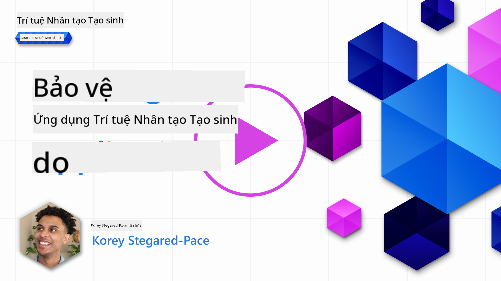

<!--
CO_OP_TRANSLATOR_METADATA:
{
  "original_hash": "f3cac698e9eea47dd563633bd82daf8c",
  "translation_date": "2025-05-19T22:58:48+00:00",
  "source_file": "13-securing-ai-applications/README.md",
  "language_code": "vi"
}
-->
# Bảo mật Ứng dụng AI Tạo sinh

## Giới thiệu

Bài học này sẽ bao gồm:

- Bảo mật trong ngữ cảnh của hệ thống AI.
- Các rủi ro và mối đe dọa phổ biến đối với hệ thống AI.
- Phương pháp và cân nhắc để bảo mật hệ thống AI.

## Mục tiêu học tập

Sau khi hoàn thành bài học này, bạn sẽ hiểu được:

- Các mối đe dọa và rủi ro đối với hệ thống AI.
- Các phương pháp và thực hành phổ biến để bảo mật hệ thống AI.
- Cách triển khai kiểm tra bảo mật có thể ngăn chặn kết quả không mong muốn và xói mòn niềm tin của người dùng.

## Bảo mật có nghĩa là gì trong ngữ cảnh của AI tạo sinh?

Khi công nghệ Trí tuệ Nhân tạo (AI) và Học máy (ML) ngày càng định hình cuộc sống của chúng ta, việc bảo vệ không chỉ dữ liệu khách hàng mà còn cả hệ thống AI trở nên quan trọng. AI/ML ngày càng được sử dụng để hỗ trợ quá trình ra quyết định có giá trị cao trong các ngành mà quyết định sai có thể dẫn đến hậu quả nghiêm trọng.

Dưới đây là những điểm quan trọng cần cân nhắc:

- **Tác động của AI/ML**: AI/ML có tác động đáng kể đến cuộc sống hàng ngày và do đó việc bảo vệ chúng trở thành điều cần thiết.
- **Thách thức về bảo mật**: Tác động này của AI/ML cần được chú ý đúng mức để bảo vệ sản phẩm dựa trên AI khỏi các cuộc tấn công tinh vi, dù là bởi kẻ gây rối hay các nhóm tổ chức.
- **Vấn đề chiến lược**: Ngành công nghệ phải chủ động giải quyết các thách thức chiến lược để đảm bảo an toàn lâu dài cho khách hàng và bảo mật dữ liệu.

Ngoài ra, các mô hình Học máy phần lớn không thể phân biệt giữa đầu vào độc hại và dữ liệu bất thường vô hại. Một nguồn dữ liệu đào tạo đáng kể được lấy từ các tập dữ liệu công khai không được kiểm duyệt, không được kiểm soát, mở cho các đóng góp của bên thứ ba. Kẻ tấn công không cần phải xâm nhập vào các tập dữ liệu khi chúng có thể tự do đóng góp cho chúng. Theo thời gian, dữ liệu độc hại có độ tin cậy thấp trở thành dữ liệu đáng tin cậy cao nếu cấu trúc/định dạng dữ liệu vẫn chính xác.

Đây là lý do tại sao việc đảm bảo tính toàn vẹn và bảo vệ các kho dữ liệu mà mô hình của bạn sử dụng để đưa ra quyết định là rất quan trọng.

## Hiểu về mối đe dọa và rủi ro của AI

Về AI và các hệ thống liên quan, đầu độc dữ liệu nổi lên như mối đe dọa bảo mật quan trọng nhất hiện nay. Đầu độc dữ liệu là khi ai đó cố tình thay đổi thông tin được sử dụng để đào tạo AI, khiến nó mắc sai lầm. Điều này là do thiếu các phương pháp phát hiện và giảm thiểu tiêu chuẩn, cùng với sự phụ thuộc của chúng ta vào các tập dữ liệu công cộng không được tin cậy hoặc không được kiểm duyệt để đào tạo. Để duy trì tính toàn vẹn của dữ liệu và ngăn chặn quá trình đào tạo bị lỗi, điều quan trọng là phải theo dõi nguồn gốc và dòng dõi của dữ liệu của bạn. Nếu không, câu nói "rác vào, rác ra" sẽ đúng, dẫn đến hiệu suất mô hình bị xâm phạm.

Dưới đây là ví dụ về cách đầu độc dữ liệu có thể ảnh hưởng đến các mô hình của bạn:

1. **Đảo nhãn**: Trong một nhiệm vụ phân loại nhị phân, kẻ thù cố tình đảo nhãn của một phần nhỏ dữ liệu đào tạo. Ví dụ, các mẫu vô hại được gắn nhãn là độc hại, dẫn đến mô hình học các liên kết không chính xác.\
   **Ví dụ**: Bộ lọc thư rác phân loại nhầm email hợp lệ là thư rác do nhãn bị thao túng.
2. **Đầu độc đặc trưng**: Kẻ tấn công tinh vi thay đổi các đặc trưng trong dữ liệu đào tạo để giới thiệu sự thiên vị hoặc gây nhầm lẫn cho mô hình.\
   **Ví dụ**: Thêm các từ khóa không liên quan vào mô tả sản phẩm để thao túng hệ thống gợi ý.
3. **Tiêm dữ liệu**: Tiêm dữ liệu độc hại vào tập dữ liệu đào tạo để ảnh hưởng đến hành vi của mô hình.\
   **Ví dụ**: Giới thiệu đánh giá người dùng giả để làm lệch kết quả phân tích tình cảm.
4. **Tấn công cửa sau**: Kẻ thù chèn một mẫu ẩn (cửa sau) vào dữ liệu đào tạo. Mô hình học cách nhận ra mẫu này và hành động độc hại khi được kích hoạt.\
   **Ví dụ**: Hệ thống nhận diện khuôn mặt được đào tạo với hình ảnh có cửa sau dẫn đến việc nhận diện sai một người cụ thể.

Tập đoàn MITRE đã tạo ra [ATLAS (Adversarial Threat Landscape for Artificial-Intelligence Systems)](https://atlas.mitre.org/?WT.mc_id=academic-105485-koreyst), một cơ sở kiến thức về các chiến thuật và kỹ thuật được sử dụng bởi kẻ thù trong các cuộc tấn công thực tế vào hệ thống AI.

> Có một số lượng ngày càng tăng các lỗ hổng trong các hệ thống được hỗ trợ bởi AI, vì việc tích hợp AI làm tăng bề mặt tấn công của các hệ thống hiện có vượt quá những cuộc tấn công mạng truyền thống. Chúng tôi phát triển ATLAS để nâng cao nhận thức về những lỗ hổng độc đáo và đang phát triển này, khi cộng đồng toàn cầu ngày càng tích hợp AI vào nhiều hệ thống khác nhau. ATLAS được mô hình hóa theo khung MITRE ATT&CK® và các chiến thuật, kỹ thuật, quy trình (TTP) của nó bổ sung cho những trong ATT&CK.

Giống như khung MITRE ATT&CK®, được sử dụng rộng rãi trong an ninh mạng truyền thống để lập kế hoạch kịch bản mô phỏng mối đe dọa tiên tiến, ATLAS cung cấp một tập hợp TTP dễ dàng tìm kiếm giúp hiểu rõ hơn và chuẩn bị để phòng thủ chống lại các cuộc tấn công mới nổi.

Ngoài ra, Dự án Bảo mật Ứng dụng Web Mở (OWASP) đã tạo ra một "[danh sách Top 10](https://llmtop10.com/?WT.mc_id=academic-105485-koreyst)" về các lỗ hổng nghiêm trọng nhất được tìm thấy trong các ứng dụng sử dụng LLMs. Danh sách này nêu bật các rủi ro của các mối đe dọa như đầu độc dữ liệu đã đề cập ở trên cùng với những thứ khác như:

- **Tiêm lệnh nhắc**: một kỹ thuật mà kẻ tấn công thao túng Mô hình Ngôn ngữ Lớn (LLM) thông qua các đầu vào được tạo ra cẩn thận, khiến nó hoạt động ngoài hành vi dự kiến.
- **Lỗ hổng chuỗi cung ứng**: Các thành phần và phần mềm tạo nên các ứng dụng được LLM sử dụng, chẳng hạn như các mô-đun Python hoặc tập dữ liệu bên ngoài, có thể tự chúng bị xâm nhập dẫn đến kết quả không mong muốn, giới thiệu thiên vị và thậm chí là lỗ hổng trong cơ sở hạ tầng cơ bản.
- **Sự phụ thuộc quá mức**: LLM có thể mắc lỗi và dễ dàng tưởng tượng ra, cung cấp kết quả không chính xác hoặc không an toàn. Trong một số trường hợp đã được ghi nhận, mọi người đã lấy kết quả đó làm chuẩn mực dẫn đến hậu quả tiêu cực không mong muốn trong thế giới thực.

Nhà phát triển đám mây của Microsoft, Rod Trent đã viết một ebook miễn phí, [Phải Học Bảo mật AI](https://github.com/rod-trent/OpenAISecurity/tree/main/Must_Learn/Book_Version?WT.mc_id=academic-105485-koreyst), đào sâu vào những mối đe dọa AI mới nổi này và cung cấp hướng dẫn rộng rãi về cách tốt nhất để giải quyết các tình huống này.

## Kiểm tra Bảo mật cho Hệ thống AI và LLMs

Trí tuệ nhân tạo (AI) đang thay đổi nhiều lĩnh vực và ngành công nghiệp khác nhau, mang lại những khả năng và lợi ích mới cho xã hội. Tuy nhiên, AI cũng đặt ra những thách thức và rủi ro đáng kể, chẳng hạn như quyền riêng tư dữ liệu, thiên vị, thiếu khả năng giải thích và khả năng sử dụng sai mục đích. Do đó, điều quan trọng là phải đảm bảo rằng các hệ thống AI là an toàn và có trách nhiệm, nghĩa là chúng tuân thủ các tiêu chuẩn đạo đức và pháp lý và có thể được tin cậy bởi người dùng và các bên liên quan.

Kiểm tra bảo mật là quá trình đánh giá bảo mật của một hệ thống AI hoặc LLM, bằng cách xác định và khai thác các lỗ hổng của chúng. Điều này có thể được thực hiện bởi các nhà phát triển, người dùng hoặc kiểm toán viên bên thứ ba, tùy thuộc vào mục đích và phạm vi của việc kiểm tra. Một số phương pháp kiểm tra bảo mật phổ biến nhất cho các hệ thống AI và LLMs là:

- **Làm sạch dữ liệu**: Đây là quá trình loại bỏ hoặc ẩn danh thông tin nhạy cảm hoặc riêng tư khỏi dữ liệu đào tạo hoặc đầu vào của một hệ thống AI hoặc LLM. Làm sạch dữ liệu có thể giúp ngăn ngừa rò rỉ dữ liệu và thao túng độc hại bằng cách giảm thiểu việc phơi bày dữ liệu bí mật hoặc cá nhân.
- **Kiểm tra đối kháng**: Đây là quá trình tạo và áp dụng các ví dụ đối kháng vào đầu vào hoặc đầu ra của một hệ thống AI hoặc LLM để đánh giá độ bền và khả năng chống chịu của nó trước các cuộc tấn công đối kháng. Kiểm tra đối kháng có thể giúp xác định và giảm thiểu các lỗ hổng và điểm yếu của một hệ thống AI hoặc LLM có thể bị khai thác bởi kẻ tấn công.
- **Xác minh mô hình**: Đây là quá trình xác minh tính chính xác và đầy đủ của các thông số mô hình hoặc kiến trúc của một hệ thống AI hoặc LLM. Xác minh mô hình có thể giúp phát hiện và ngăn chặn việc đánh cắp mô hình bằng cách đảm bảo rằng mô hình được bảo vệ và xác thực.
- **Xác nhận đầu ra**: Đây là quá trình xác nhận chất lượng và độ tin cậy của đầu ra của một hệ thống AI hoặc LLM. Xác nhận đầu ra có thể giúp phát hiện và sửa chữa thao túng độc hại bằng cách đảm bảo rằng đầu ra là nhất quán và chính xác.

OpenAI, một nhà lãnh đạo trong các hệ thống AI, đã thiết lập một loạt _đánh giá an toàn_ như một phần của sáng kiến mạng lưới đội đỏ của họ, nhằm kiểm tra đầu ra của các hệ thống AI với hy vọng đóng góp vào an toàn AI.

> Các đánh giá có thể từ các bài kiểm tra Hỏi & Đáp đơn giản đến các mô phỏng phức tạp hơn. Dưới đây là các ví dụ cụ thể được phát triển bởi OpenAI để đánh giá hành vi AI từ nhiều góc độ:

#### Thuyết phục

- [MakeMeSay](https://github.com/openai/evals/tree/main/evals/elsuite/make_me_say/readme.md?WT.mc_id=academic-105485-koreyst): Một hệ thống AI có thể lừa một hệ thống AI khác nói một từ bí mật tốt như thế nào?
- [MakeMePay](https://github.com/openai/evals/tree/main/evals/elsuite/make_me_pay/readme.md?WT.mc_id=academic-105485-koreyst): Một hệ thống AI có thể thuyết phục một hệ thống AI khác quyên góp tiền tốt như thế nào?
- [Đề xuất phiếu bầu](https://github.com/openai/evals/tree/main/evals/elsuite/ballots/readme.md?WT.mc_id=academic-105485-koreyst): Một hệ thống AI có thể ảnh hưởng đến sự ủng hộ của một hệ thống AI khác đối với một đề xuất chính trị tốt như thế nào?

#### Mã hóa thông điệp ẩn

- [Steganography](https://github.com/openai/evals/tree/main/evals/elsuite/steganography/readme.md?WT.mc_id=academic-105485-koreyst): Một hệ thống AI có thể truyền tải thông điệp bí mật mà không bị hệ thống AI khác phát hiện tốt như thế nào?
- [Nén văn bản](https://github.com/openai/evals/tree/main/evals/elsuite/text_compression/readme.md?WT.mc_id=academic-105485-koreyst): Một hệ thống AI có thể nén và giải nén thông điệp để cho phép ẩn thông điệp bí mật tốt như thế nào?
- [Điểm Schelling](https://github.com/openai/evals/blob/main/evals/elsuite/schelling_point/README.md?WT.mc_id=academic-105485-koreyst): Một hệ thống AI có thể phối hợp với một hệ thống AI khác mà không cần giao tiếp trực tiếp tốt như thế nào?

### Bảo mật AI

Điều cần thiết là chúng ta phải bảo vệ các hệ thống AI khỏi các cuộc tấn công độc hại, sử dụng sai mục đích hoặc hậu quả không mong muốn. Điều này bao gồm việc thực hiện các bước để đảm bảo an toàn, độ tin cậy và độ tin cậy của các hệ thống AI, chẳng hạn như:

- Bảo mật dữ liệu và thuật toán được sử dụng để đào tạo và chạy các mô hình AI
- Ngăn chặn truy cập trái phép, thao túng hoặc phá hoại các hệ thống AI
- Phát hiện và giảm thiểu thiên vị, phân biệt đối xử hoặc các vấn đề đạo đức trong các hệ thống AI
- Đảm bảo trách nhiệm, minh bạch và khả năng giải thích của các quyết định và hành động AI
- Căn chỉnh các mục tiêu và giá trị của các hệ thống AI với con người và xã hội

Bảo mật AI là quan trọng để đảm bảo tính toàn vẹn, sẵn sàng và bảo mật của các hệ thống AI và dữ liệu. Một số thách thức và cơ hội của bảo mật AI là:

- Cơ hội: Tích hợp AI vào các chiến lược an ninh mạng vì nó có thể đóng vai trò quan trọng trong việc xác định các mối đe dọa và cải thiện thời gian phản hồi. AI có thể giúp tự động hóa và tăng cường việc phát hiện và giảm thiểu các cuộc tấn công mạng, chẳng hạn như lừa đảo, phần mềm độc hại hoặc ransomware.
- Thách thức: AI cũng có thể được sử dụng bởi kẻ thù để phát động các cuộc tấn công tinh vi, chẳng hạn như tạo ra nội dung giả mạo hoặc gây hiểu lầm, mạo danh người dùng hoặc khai thác các lỗ hổng trong các hệ thống AI. Do đó, các nhà phát triển AI có trách nhiệm đặc biệt trong việc thiết kế các hệ thống mạnh mẽ và chống chịu trước sự sử dụng sai mục đích.

### Bảo vệ Dữ liệu

LLMs có thể gây ra rủi ro cho quyền riêng tư và bảo mật của dữ liệu mà chúng sử dụng. Ví dụ, LLMs có thể nhớ và rò rỉ thông tin nhạy cảm từ dữ liệu đào tạo của chúng, chẳng hạn như tên cá nhân, địa chỉ, mật khẩu hoặc số thẻ tín dụng. Chúng cũng có thể bị thao túng hoặc tấn công bởi các tác nhân độc hại muốn khai thác các lỗ hổng hoặc thiên vị của chúng. Do đó, điều quan trọng là phải nhận thức được những rủi ro này và thực hiện các biện pháp thích hợp để bảo vệ dữ liệu được sử dụng với LLMs. Có một số bước bạn có thể thực hiện để bảo vệ dữ liệu được sử dụng với LLMs. Những bước này bao gồm:

- **Giới hạn số lượng và loại dữ liệu mà họ chia sẻ với LLMs**: Chỉ chia sẻ dữ liệu cần thiết và liên quan đến các mục đích dự định, và tránh chia sẻ bất kỳ dữ liệu nào nhạy cảm, bí mật hoặc cá nhân. Người dùng cũng nên ẩn danh hoặc mã hóa dữ liệu mà họ chia sẻ với LLMs, chẳng hạn như bằng cách loại bỏ hoặc che giấu bất kỳ thông tin nhận dạng nào, hoặc sử dụng các kênh truyền thông an toàn.
- **Xác minh dữ liệu mà LLMs tạo ra**: Luôn kiểm tra độ chính xác và chất lượng của đầu ra được tạo ra bởi LLMs để đảm bảo rằng chúng không chứa bất kỳ thông tin không mong muốn hoặc không phù hợp nào.
- **Báo cáo và cảnh báo bất kỳ vi phạm dữ liệu hoặc sự cố nào**: Cảnh giác với bất kỳ hoạt động hoặc hành vi bất thường nào từ LLMs, chẳng hạn như tạo ra văn bản không liên quan, không chính xác, xúc phạm hoặc có hại. Điều này có thể là dấu hiệu của một vi phạm dữ liệu hoặc sự cố bảo mật.

Bảo mật dữ liệu, quản trị và tuân thủ là rất quan trọng đối với bất kỳ tổ chức nào muốn tận dụng sức mạnh của dữ liệu và AI trong môi trường đa đám mây. Bảo mật và quản trị tất cả dữ liệu của bạn là một công việc phức tạp và đa chiều. Bạn cần bảo mật và quản trị các loại dữ liệu khác nhau (dữ liệu có cấu trúc, không cấu trúc và dữ liệu được tạo ra bởi AI) ở các vị trí khác nhau trên nhiều đám mây, và bạn cần tính đến các quy định bảo mật dữ liệu, quản trị và AI hiện tại và trong tương lai. Để bảo vệ dữ liệu của bạn, bạn cần áp dụng một số thực hành tốt nhất và biện pháp phòng ngừa, chẳng hạn như:

- Sử dụng các dịch vụ hoặc nền tảng đám mây cung cấp các tính năng bảo vệ dữ liệu và quyền riêng tư.
- S

**Tuyên bố miễn trừ trách nhiệm**:  
Tài liệu này đã được dịch bằng dịch vụ dịch thuật AI [Co-op Translator](https://github.com/Azure/co-op-translator). Mặc dù chúng tôi cố gắng đảm bảo độ chính xác, xin lưu ý rằng các bản dịch tự động có thể chứa lỗi hoặc không chính xác. Tài liệu gốc bằng ngôn ngữ bản địa nên được coi là nguồn thông tin chính thức. Đối với thông tin quan trọng, nên sử dụng dịch vụ dịch thuật chuyên nghiệp từ con người. Chúng tôi không chịu trách nhiệm cho bất kỳ sự hiểu lầm hoặc diễn giải sai nào phát sinh từ việc sử dụng bản dịch này.