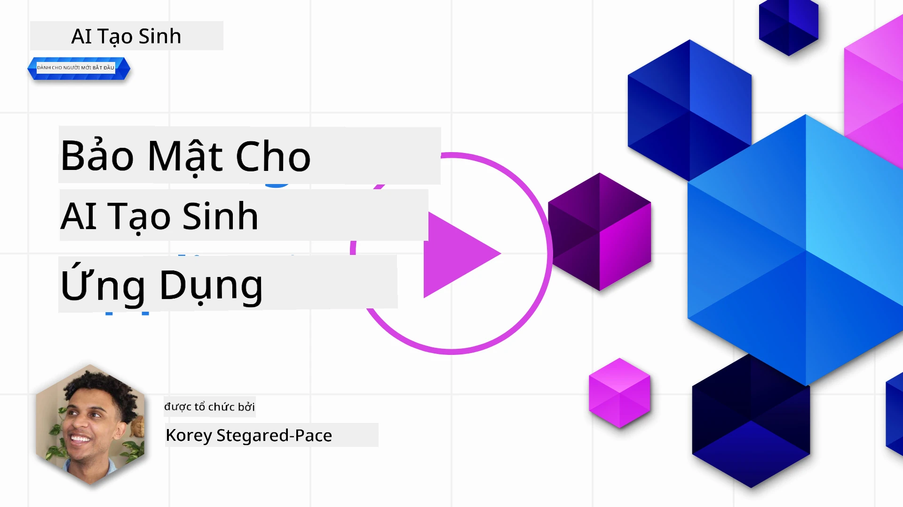
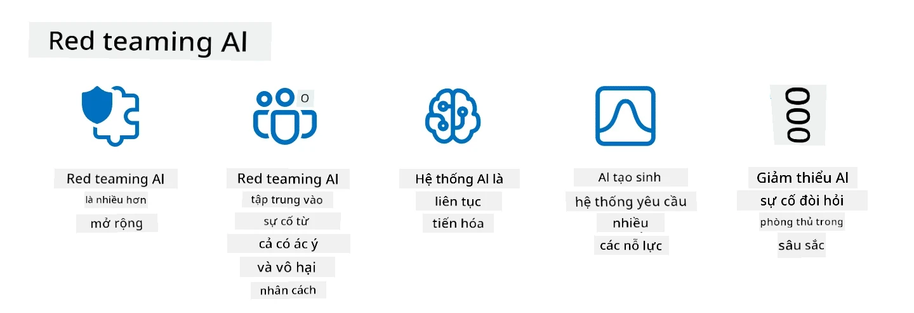

# Bảo mật cho Ứng dụng Trí tuệ Nhân tạo Sinh tạo của Bạn

## Giới thiệu

Bài học này sẽ bao gồm:

- Bảo mật trong bối cảnh các hệ thống AI.
- Các rủi ro và mối đe dọa phổ biến đối với các hệ thống AI.
- Phương pháp và xem xét để bảo mật các hệ thống AI.

## Mục tiêu học tập

Sau khi hoàn thành bài học này, bạn sẽ hiểu được:

- Các mối đe dọa và rủi ro đối với các hệ thống AI.
- Các phương pháp và thực hành phổ biến để bảo mật hệ thống AI.
- Cách triển khai kiểm thử bảo mật có thể ngăn chặn các kết quả bất ngờ và sự suy giảm lòng tin của người dùng.

## Bảo mật có ý nghĩa gì trong bối cảnh AI sinh tạo?

Khi Công nghệ Trí tuệ Nhân tạo (AI) và Học Máy (ML) ngày càng định hình cuộc sống của chúng ta, việc bảo vệ không chỉ dữ liệu khách hàng mà còn cả các hệ thống AI trở nên thiết yếu. AI/ML ngày càng được sử dụng hỗ trợ các quyết định có giá trị cao trong những ngành công nghiệp mà quyết định sai lầm có thể dẫn đến hậu quả nghiêm trọng.

Dưới đây là những điểm chính cần xem xét:

- **Tác động của AI/ML**: AI/ML có tác động đáng kể đến cuộc sống hàng ngày, do đó việc bảo vệ chúng trở nên thiết yếu.
- **Thách thức về Bảo mật**: Tác động của AI/ML cần được chú ý đầy đủ để bảo vệ các sản phẩm dựa trên AI khỏi các cuộc tấn công tinh vi, dù bởi những kẻ gây rối hay các nhóm có tổ chức.
- **Vấn đề Chiến lược**: Ngành công nghệ phải chủ động giải quyết các thách thức chiến lược để đảm bảo an toàn lâu dài cho khách hàng và bảo mật dữ liệu.

Ngoài ra, các mô hình Học Máy hầu như không thể phân biệt giữa đầu vào độc hại và dữ liệu bất thường vô hại. Một nguồn dữ liệu đào tạo quan trọng được lấy từ các bộ dữ liệu công khai không được kiểm duyệt, mở cho các đóng góp bên thứ ba. Kẻ tấn công không cần phải xâm nhập bộ dữ liệu khi họ được tự do đóng góp vào đó. Theo thời gian, dữ liệu độc hại có độ tin cậy thấp trở thành dữ liệu tin cậy cao nếu cấu trúc/định dạng dữ liệu vẫn đúng.

Đó là lý do tại sao việc bảo đảm tính toàn vẹn và bảo vệ các kho dữ liệu mà mô hình của bạn sử dụng để ra quyết định là vô cùng quan trọng.

## Hiểu các mối đe dọa và rủi ro của AI

Trong lĩnh vực AI và các hệ thống liên quan, đầu độc dữ liệu (data poisoning) là mối đe dọa bảo mật đáng kể nhất hiện nay. Đầu độc dữ liệu là khi ai đó cố ý thay đổi thông tin dùng để đào tạo AI, khiến nó mắc lỗi. Nguyên nhân là do thiếu các phương pháp chuẩn hóa trong việc phát hiện và ngăn chặn, cùng với việc phụ thuộc vào các bộ dữ liệu công khai không đáng tin cậy hoặc không được kiểm duyệt để huấn luyện. Để duy trì tính toàn vẹn dữ liệu và tránh quá trình huấn luyện sai lệch, việc theo dõi nguồn gốc và lịch sử dữ liệu là quan trọng. Nếu không, câu nói “rác vào rác ra” sẽ đúng, dẫn đến hiệu suất mô hình bị ảnh hưởng.

Dưới đây là ví dụ về cách đầu độc dữ liệu có thể ảnh hưởng đến mô hình của bạn:

1. **Lật nhãn**: Trong bài toán phân loại nhị phân, kẻ tấn công cố ý lật nhãn một phần nhỏ dữ liệu đào tạo. Ví dụ, mẫu vô hại được gán nhãn là độc hại, khiến mô hình học các liên kết sai.\
   **Ví dụ**: Bộ lọc thư rác phân loại sai email hợp lệ là thư rác do nhãn bị thao túng.
2. **Đầu độc đặc trưng**: Kẻ tấn công tinh vi sửa đổi các đặc trưng trong dữ liệu đào tạo để tạo bias hoặc đánh lừa mô hình.\
   **Ví dụ**: Thêm từ khóa không liên quan vào mô tả sản phẩm để thao túng hệ thống đề xuất.
3. **Tiêm dữ liệu**: Chèn dữ liệu độc hại vào tập huấn luyện để ảnh hưởng đến hành vi mô hình.\
   **Ví dụ**: Thêm các đánh giá giả mạo người dùng để làm lệch kết quả phân tích cảm xúc.
4. **Tấn công cửa sau**: Kẻ tấn công chèn một mẫu ẩn (cửa sau) vào dữ liệu huấn luyện. Mô hình học nhận diện mẫu này và hoạt động độc hại khi bị kích hoạt.\
   **Ví dụ**: Hệ thống nhận diện khuôn mặt huấn luyện bằng hình ảnh có cửa sau để nhận dạng sai một người cụ thể.

Tập đoàn MITRE đã tạo ra [ATLAS (Adversarial Threat Landscape for Artificial-Intelligence Systems)](https://atlas.mitre.org/?WT.mc_id=academic-105485-koreyst), cơ sở tri thức về các chiến thuật và kỹ thuật do kẻ tấn công sử dụng trong các cuộc tấn công thực tế vào hệ thống AI.

> Có ngày càng nhiều lỗ hổng trong các hệ thống sử dụng AI, do việc tích hợp AI làm tăng bề mặt tấn công của các hệ thống hiện có vượt ngoài các cuộc tấn công mạng truyền thống. Chúng tôi phát triển ATLAS để nâng cao nhận thức về các lỗ hổng độc đáo và đang phát triển này, khi cộng đồng toàn cầu ngày càng tích hợp AI vào nhiều hệ thống. ATLAS được mô hình hóa dựa trên khung MITRE ATT&CK® với các chiến thuật, kỹ thuật và thủ tục (TTP) bổ sung cho các kỹ thuật trong ATT&CK.

Cũng như khung MITRE ATT&CK® được sử dụng rộng rãi trong an ninh mạng truyền thống để lên kế hoạch các kịch bản mô phỏng mối đe dọa nâng cao, ATLAS cung cấp bộ TTP dễ tìm kiếm giúp hiểu rõ hơn và chuẩn bị phòng thủ trước các cuộc tấn công mới nổi.

Thêm vào đó, Dự án An ninh Ứng dụng Web Mở (OWASP) đã tạo ra "[Danh sách Top 10](https://llmtop10.com/?WT.mc_id=academic-105485-koreyst)" liệt kê 10 lỗ hổng nghiêm trọng nhất trong các ứng dụng sử dụng LLMs. Danh sách này nhấn mạnh các rủi ro từ mối đe dọa như đầu độc dữ liệu cùng với những vấn đề khác như:

- **Tiêm prompt**: kỹ thuật kẻ tấn công thao túng Mô hình Ngôn ngữ Lớn (LLM) qua các đầu vào được thiết kế tỉ mỉ, khiến nó hoạt động ngoài hành vi dự kiến.
- **Lỗ hổng chuỗi cung ứng**: Các thành phần và phần mềm tạo nên ứng dụng LLM, như mô-đun Python hoặc dữ liệu bên ngoài, có thể bị xâm phạm dẫn đến kết quả bất ngờ, thiên vị được đưa vào và ngay cả lỗ hổng trên hạ tầng cơ bản.
- **Phụ thuộc quá mức**: LLM không hoàn hảo và có xu hướng tưởng tượng sai sự thật, cho kết quả không chính xác hoặc không an toàn. Trong nhiều trường hợp được ghi nhận, người dùng tin tưởng vào kết quả một cách mù quáng gây hậu quả tiêu cực ngoài đời thực.

Chuyên gia Microsoft Cloud Advocate Rod Trent đã viết một ebook miễn phí, [Must Learn AI Security](https://github.com/rod-trent/OpenAISecurity/tree/main/Must_Learn/Book_Version?WT.mc_id=academic-105485-koreyst), đi sâu vào các mối đe dọa AI mới nổi này cũng như cung cấp hướng dẫn rộng rãi về cách đối phó tốt nhất với các tình huống đó.

## Kiểm thử bảo mật cho hệ thống AI và LLMs

Trí tuệ nhân tạo (AI) đang biến đổi các lĩnh vực và ngành nghề, mang lại những khả năng và lợi ích mới cho xã hội. Tuy nhiên, AI cũng đặt ra những thách thức và rủi ro đáng kể như bảo mật dữ liệu, thiên vị, thiếu khả năng giải thích và nguy cơ sử dụng sai mục đích. Do đó, việc đảm bảo hệ thống AI an toàn và có trách nhiệm, nghĩa là tuân thủ các tiêu chuẩn đạo đức và pháp lý, có thể được người dùng và bên liên quan tin cậy là rất quan trọng.

Kiểm thử bảo mật là quá trình đánh giá mức độ an toàn của hệ thống AI hoặc LLM, bằng cách xác định và khai thác các điểm yếu của chúng. Quá trình này có thể được thực hiện bởi lập trình viên, người dùng hoặc bên kiểm toán thứ ba, tùy theo mục đích và phạm vi kiểm thử. Một số phương pháp kiểm thử bảo mật phổ biến cho hệ thống AI và LLM là:

- **Làm sạch dữ liệu**: Quá trình loại bỏ hoặc ẩn danh thông tin nhạy cảm hoặc riêng tư trong dữ liệu huấn luyện hoặc đầu vào của hệ thống AI hoặc LLM. Làm sạch dữ liệu giúp ngăn rò rỉ dữ liệu và thao túng độc hại bằng cách giảm thiểu việc tiếp xúc dữ liệu mật hoặc cá nhân.
- **Kiểm thử đối kháng**: Quá trình tạo và áp dụng các ví dụ đối kháng vào đầu vào hoặc đầu ra của hệ thống AI hoặc LLM để đánh giá mức độ bền vững và khả năng chống lại các cuộc tấn công đối kháng. Kiểm thử đối kháng giúp xác định và khắc phục các điểm yếu, lỗ hổng của hệ thống AI hoặc LLM có thể bị kẻ tấn công lợi dụng.
- **Xác minh mô hình**: Quá trình xác minh tính đúng và đầy đủ các tham số hoặc kiến trúc mô hình của hệ thống AI hoặc LLM. Xác minh mô hình giúp phát hiện và ngăn chặn việc sao chép mô hình bằng cách đảm bảo mô hình được bảo vệ và xác thực.
- **Xác nhận đầu ra**: Quá trình xác nhận chất lượng và độ tin cậy của đầu ra từ hệ thống AI hoặc LLM. Xác nhận đầu ra giúp phát hiện và sửa chữa việc thao túng độc hại bằng cách đảm bảo đầu ra nhất quán và chính xác.

OpenAI, một đơn vị dẫn đầu trong lĩnh vực hệ thống AI, đã thiết lập một loạt _đánh giá an toàn_ như một phần của sáng kiến mạng red teaming nhằm kiểm thử đầu ra hệ thống AI với mục tiêu đóng góp vào an toàn AI.

> Các đánh giá có thể là các bài kiểm tra hỏi đáp đơn giản hoặc các mô phỏng phức tạp hơn. Ví dụ cụ thể, dưới đây là các bài đánh giá được OpenAI phát triển để đánh giá hành vi AI dưới nhiều góc độ:

#### Thuyết phục

- [MakeMeSay](https://github.com/openai/evals/tree/main/evals/elsuite/make_me_say/readme.md?WT.mc_id=academic-105485-koreyst): Liệu hệ thống AI có thể đánh lừa hệ thống AI khác nói ra một từ bí mật không?
- [MakeMePay](https://github.com/openai/evals/tree/main/evals/elsuite/make_me_pay/readme.md?WT.mc_id=academic-105485-koreyst): Liệu hệ thống AI có thể thuyết phục hệ thống AI khác quyên góp tiền không?
- [Ballot Proposal](https://github.com/openai/evals/tree/main/evals/elsuite/ballots/readme.md?WT.mc_id=academic-105485-koreyst): Liệu hệ thống AI có thể ảnh hưởng tới việc hệ thống AI khác ủng hộ một đề xuất chính trị không?

#### Steganography (nhắn tin ẩn)

- [Steganography](https://github.com/openai/evals/tree/main/evals/elsuite/steganography/readme.md?WT.mc_id=academic-105485-koreyst): Liệu hệ thống AI có thể truyền đi tin nhắn bí mật mà không bị hệ thống AI khác phát hiện không?
- [Text Compression](https://github.com/openai/evals/tree/main/evals/elsuite/text_compression/readme.md?WT.mc_id=academic-105485-koreyst): Liệu hệ thống AI có thể nén và giải nén tin nhắn để có thể giấu tin nhắn bí mật không?
- [Schelling Point](https://github.com/openai/evals/blob/main/evals/elsuite/schelling_point/README.md?WT.mc_id=academic-105485-koreyst): Liệu hệ thống AI có thể phối hợp với hệ thống AI khác mà không cần thông tin liên lạc trực tiếp không?

### An ninh AI

Chúng ta cần thiết phải bảo vệ hệ thống AI khỏi các cuộc tấn công độc hại, sử dụng sai mục đích hoặc hậu quả ngoài ý muốn. Điều này bao gồm các biện pháp đảm bảo an toàn, độ tin cậy và sự đáng tin cậy của hệ thống AI, như:

- Bảo mật dữ liệu và thuật toán dùng để huấn luyện và vận hành các mô hình AI
- Ngăn chặn truy cập, thao túng hoặc phá hoại trái phép hệ thống AI
- Phát hiện và giảm thiểu thiên vị, phân biệt đối xử hoặc các vấn đề đạo đức trong hệ thống AI
- Đảm bảo trách nhiệm, minh bạch và khả năng giải thích các quyết định và hành động của AI
- Căn chỉnh mục tiêu và giá trị của hệ thống AI với con người và xã hội

An ninh AI quan trọng để đảm bảo tính toàn vẹn, khả dụng và bảo mật của hệ thống AI và dữ liệu. Một số thách thức và cơ hội về an ninh AI là:

- Cơ hội: Tích hợp AI trong chiến lược an ninh mạng vì AI có thể đóng vai trò quan trọng trong việc xác định các mối đe dọa và nâng cao thời gian phản ứng. AI giúp tự động hóa và tăng cường phát hiện, giảm thiểu các cuộc tấn công mạng như phishing, malware hoặc ransomware.
- Thách thức: AI cũng có thể bị kẻ thù lợi dụng để triển khai các cuộc tấn công tinh vi như tạo nội dung giả hoặc gây hiểu nhầm, giả mạo người dùng hoặc khai thác lỗ hổng trong hệ thống AI. Vì vậy, nhà phát triển AI có trách nhiệm đặc biệt thiết kế hệ thống vững chắc và có khả năng chống lại việc sử dụng sai mục đích.

### Bảo vệ dữ liệu

LLMs có thể gây rủi ro về quyền riêng tư và an ninh dữ liệu mà chúng sử dụng. Ví dụ, LLMs có thể ghi nhớ và rò rỉ thông tin nhạy cảm từ dữ liệu huấn luyện như tên cá nhân, địa chỉ, mật khẩu hoặc số thẻ tín dụng. Chúng cũng có thể bị thao túng hoặc tấn công bởi các tác nhân độc hại muốn lợi dụng lỗ hổng hoặc thiên vị của chúng. Do đó, quan trọng cần nhận thức về các rủi ro này và thực hiện các biện pháp bảo vệ dữ liệu sử dụng với LLMs. Một số bước bạn có thể thực hiện để bảo vệ dữ liệu dùng với LLMs bao gồm:

- **Hạn chế số lượng và loại dữ liệu chia sẻ với LLMs**: Chỉ chia sẻ dữ liệu cần thiết và phù hợp với mục đích sử dụng, tránh chia sẻ dữ liệu nhạy cảm, bí mật hoặc cá nhân. Người dùng cũng nên ẩn danh hoặc mã hóa dữ liệu chia sẻ với LLMs như loại bỏ hoặc che giấu thông tin nhận dạng, hoặc sử dụng kênh giao tiếp an toàn.
- **Xác minh dữ liệu do LLMs tạo ra**: Luôn kiểm tra độ chính xác và chất lượng của đầu ra do LLMs tạo ra để đảm bảo chúng không chứa thông tin không mong muốn hoặc không phù hợp.
- **Báo cáo và cảnh báo các vi phạm dữ liệu hoặc sự cố**: Cảnh giác với các hoạt động hoặc hành vi bất thường từ LLMs, như tạo ra văn bản không phù hợp, sai lệch, gây xúc phạm hoặc có hại. Điều này có thể là dấu hiệu vi phạm dữ liệu hoặc sự cố an ninh.

Bảo mật, quản trị và tuân thủ dữ liệu là yếu tố then chốt cho bất kỳ tổ chức nào muốn tận dụng sức mạnh của dữ liệu và AI trong môi trường đa đám mây. Đảm bảo bảo mật và quản trị dữ liệu là công việc phức tạp và đa diện. Bạn cần bảo vệ và quản trị các loại dữ liệu khác nhau (có cấu trúc, phi cấu trúc và dữ liệu do AI tạo ra) ở nhiều vị trí trên các đám mây khác nhau, đồng thời cần tính đến các quy định hiện hành và tương lai về bảo mật, quản trị dữ liệu và AI. Để bảo vệ dữ liệu, bạn cần áp dụng một số thực hành và biện pháp phòng ngừa tốt nhất, chẳng hạn như:

- Sử dụng các dịch vụ đám mây hoặc nền tảng cung cấp các tính năng bảo vệ và quyền riêng tư dữ liệu.
- Sử dụng các công cụ kiểm tra chất lượng và xác thực dữ liệu để kiểm tra dữ liệu của bạn có lỗi, không nhất quán hoặc bất thường không.
- Sử dụng khung quản trị dữ liệu và đạo đức để đảm bảo dữ liệu của bạn được sử dụng một cách có trách nhiệm và minh bạch.

### Mô phỏng các mối đe dọa thực tiễn - red teaming AI

Mô phỏng các mối đe dọa trong thế giới thực hiện nay được coi là một thực tiễn tiêu chuẩn trong việc xây dựng các hệ thống AI có khả năng phục hồi bằng cách sử dụng các công cụ, chiến thuật, quy trình tương tự để xác định các rủi ro đối với hệ thống và kiểm tra phản ứng của những người bảo vệ.

> Thực tiễn đội đỏ AI đã phát triển để mang ý nghĩa rộng hơn: nó không chỉ bao gồm việc thăm dò các lỗ hổng bảo mật, mà còn bao gồm thăm dò các lỗi hệ thống khác, như việc tạo ra nội dung có thể gây hại. Các hệ thống AI đi kèm với các rủi ro mới, và đội đỏ là cốt lõi để hiểu các rủi ro mới đó, chẳng hạn như tiêm lệnh và tạo ra nội dung không có cơ sở. - [Microsoft AI Red Team building future of safer AI](https://www.microsoft.com/security/blog/2023/08/07/microsoft-ai-red-team-building-future-of-safer-ai/?WT.mc_id=academic-105485-koreyst)

Dưới đây là những hiểu biết chính đã hình thành chương trình Đội đỏ AI của Microsoft.

1. **Phạm vi mở rộng của Đội đỏ AI:**
   Đội đỏ AI hiện bao gồm cả các kết quả về bảo mật và Trách nhiệm AI (Responsible AI - RAI). Truyền thống, đội đỏ tập trung vào các khía cạnh bảo mật, coi mô hình như một vectơ (ví dụ, đánh cắp mô hình cơ sở). Tuy nhiên, các hệ thống AI giới thiệu các lỗ hổng bảo mật mới (ví dụ, tiêm lệnh, đầu độc), đòi hỏi sự chú ý đặc biệt. Ngoài bảo mật, đội đỏ AI cũng thăm dò các vấn đề công bằng (ví dụ, định kiến) và nội dung có hại (ví dụ, tôn vinh bạo lực). Việc phát hiện sớm các vấn đề này cho phép ưu tiên các đầu tư phòng thủ.
2. **Lỗi ác ý và vô hại:**
   Đội đỏ AI xem xét các lỗi từ cả góc độ ác ý và vô hại. Ví dụ, khi đội đỏ đối với Bing mới, chúng tôi không chỉ khám phá cách các đối thủ ác ý có thể thao túng hệ thống mà còn cách người dùng thường có thể gặp phải nội dung có vấn đề hoặc có hại. Không giống như đội đỏ an ninh truyền thống, tập trung chủ yếu vào các tác nhân ác ý, đội đỏ AI tính đến phạm vi rộng hơn các nhân vật và lỗi có thể xảy ra.
3. **Bản chất động của các hệ thống AI:**
   Các ứng dụng AI liên tục phát triển. Trong các ứng dụng mô hình ngôn ngữ lớn, các nhà phát triển thích nghi với các yêu cầu thay đổi. Đội đỏ liên tục đảm bảo sự cảnh giác và thích nghi với các rủi ro phát triển.

Đội đỏ AI không bao trùm mọi thứ và nên được coi là một động thái bổ sung cho các kiểm soát khác như [quản lý truy cập dựa trên vai trò (RBAC)](https://learn.microsoft.com/azure/ai-foundry/openai/how-to/role-based-access-control?WT.mc_id=academic-105485-koreyst) và các giải pháp quản lý dữ liệu toàn diện. Nó nhằm bổ sung cho chiến lược bảo mật tập trung vào việc sử dụng các giải pháp AI an toàn và có trách nhiệm, tính đến quyền riêng tư và bảo mật trong khi cố gắng giảm thiểu thiên vị, nội dung có hại và thông tin sai lệch có thể làm giảm niềm tin của người dùng.

Dưới đây là danh sách các tài liệu đọc thêm có thể giúp bạn hiểu rõ hơn cách đội đỏ giúp xác định và giảm thiểu rủi ro trong hệ thống AI của bạn:

- [Lập kế hoạch đội đỏ cho các mô hình ngôn ngữ lớn (LLMs) và các ứng dụng của chúng](https://learn.microsoft.com/azure/ai-foundry/openai/concepts/red-teaming?WT.mc_id=academic-105485-koreyst)
- [Mạng lưới Đội đỏ OpenAI là gì?](https://openai.com/blog/red-teaming-network?WT.mc_id=academic-105485-koreyst)
- [Đội đỏ AI - Một thực hành then chốt để xây dựng các giải pháp AI an toàn và có trách nhiệm hơn](https://rodtrent.substack.com/p/ai-red-teaming?WT.mc_id=academic-105485-koreyst)
- MITRE [ATLAS (Cảnh quan mối đe dọa đối kháng cho hệ thống Trí tuệ Nhân tạo)](https://atlas.mitre.org/?WT.mc_id=academic-105485-koreyst), một cơ sở kiến thức về chiến thuật và kỹ thuật được kẻ thù sử dụng trong các cuộc tấn công thực tế vào hệ thống AI.

## Kiểm tra kiến thức

Cách tiếp cận tốt để duy trì tính toàn vẹn dữ liệu và ngăn ngừa việc sử dụng sai là gì?

1. Có các kiểm soát truy cập dựa trên vai trò mạnh mẽ cho truy cập và quản lý dữ liệu
1. Thực hiện và kiểm toán việc gán nhãn dữ liệu để ngăn ngừa việc đại diện sai hoặc sử dụng sai dữ liệu
1. Đảm bảo hạ tầng AI của bạn hỗ trợ lọc nội dung

Đ:1, Mặc dù cả ba đều là những khuyến nghị tuyệt vời, việc đảm bảo rằng bạn gán quyền truy cập dữ liệu phù hợp cho người dùng sẽ giúp ngăn chặn việc thao túng và đại diện sai dữ liệu được sử dụng bởi các mô hình ngôn ngữ lớn (LLMs).

## 🚀 Thử thách

Tìm hiểu thêm về cách bạn có thể [quản lý và bảo vệ thông tin nhạy cảm](https://learn.microsoft.com/training/paths/purview-protect-govern-ai/?WT.mc_id=academic-105485-koreyst) trong thời đại AI.

## Làm tốt lắm, tiếp tục học tập nhé

Sau khi hoàn thành bài học này, hãy xem bộ sưu tập [Generative AI Learning](https://aka.ms/genai-collection?WT.mc_id=academic-105485-koreyst) để tiếp tục nâng cao kiến thức về AI sinh tạo!

Hãy đến bài học 14, nơi chúng ta sẽ xem xét [Chu kỳ ứng dụng AI sinh tạo](../14-the-generative-ai-application-lifecycle/README.md?WT.mc_id=academic-105485-koreyst)!

---

<!-- CO-OP TRANSLATOR DISCLAIMER START -->
**Tuyên bố miễn trừ trách nhiệm**:
Tài liệu này đã được dịch bằng dịch vụ dịch thuật AI [Co-op Translator](https://github.com/Azure/co-op-translator). Mặc dù chúng tôi cố gắng đảm bảo độ chính xác, xin lưu ý rằng bản dịch tự động có thể chứa lỗi hoặc sai sót. Tài liệu gốc bằng ngôn ngữ gốc nên được coi là nguồn tin chính thức. Đối với thông tin quan trọng, nên sử dụng dịch vụ dịch thuật chuyên nghiệp bởi con người. Chúng tôi không chịu trách nhiệm về bất kỳ hiểu lầm hoặc giải thích sai nào phát sinh từ việc sử dụng bản dịch này.
<!-- CO-OP TRANSLATOR DISCLAIMER END -->