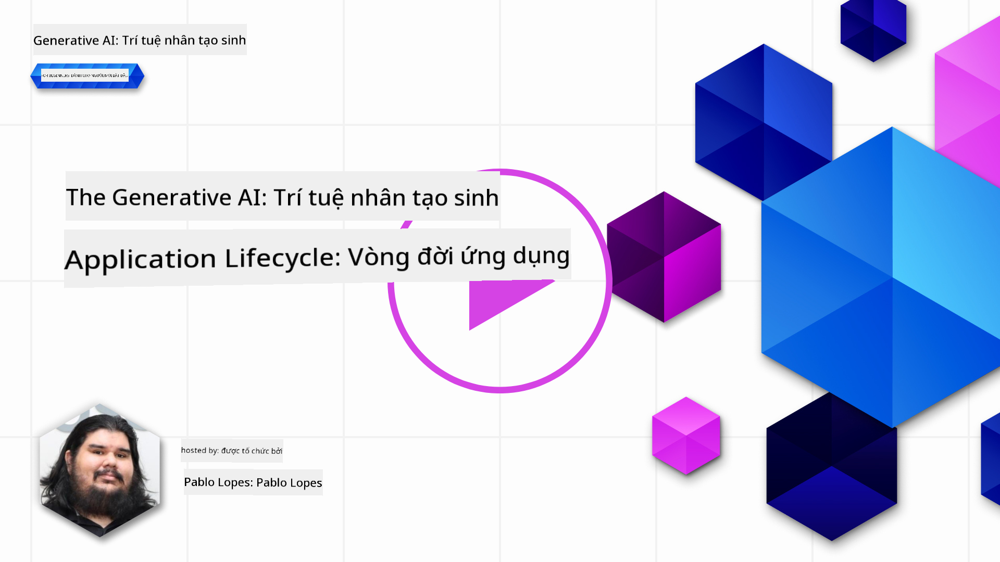
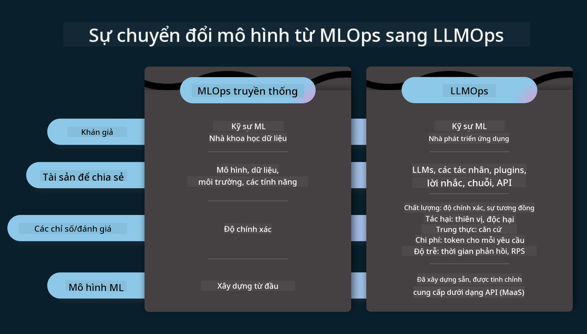
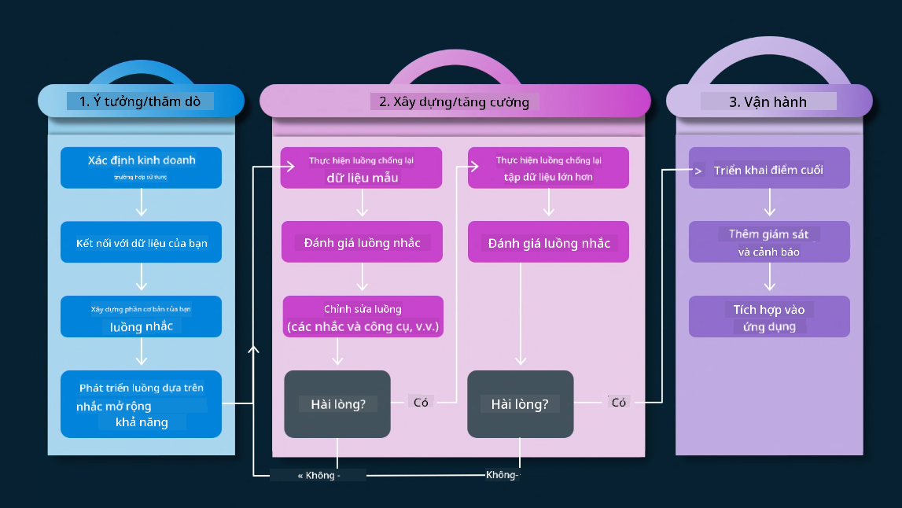
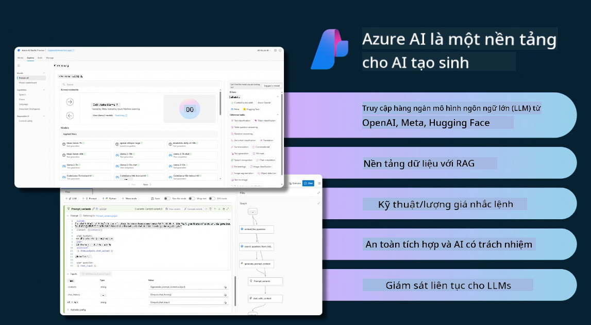
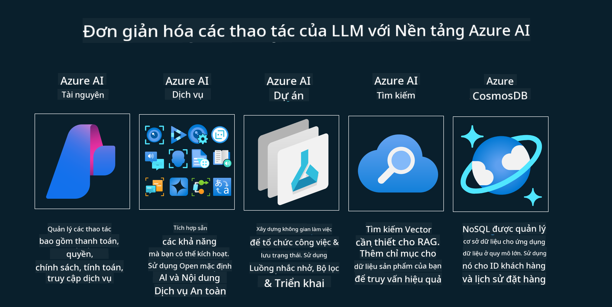
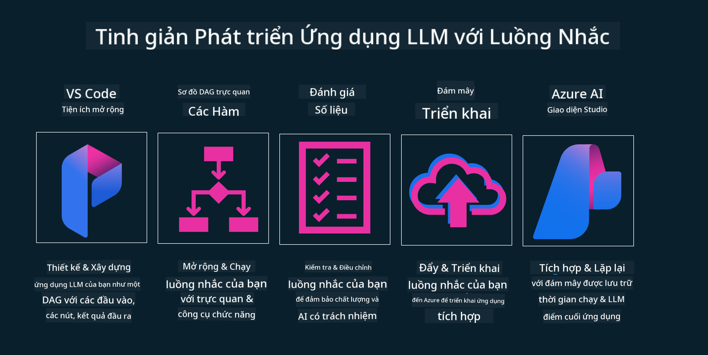

<!--
CO_OP_TRANSLATOR_METADATA:
{
  "original_hash": "27a5347a5022d5ef0a72ab029b03526a",
  "translation_date": "2025-05-19T23:31:19+00:00",
  "source_file": "14-the-generative-ai-application-lifecycle/README.md",
  "language_code": "vi"
}
-->

# Vòng đời Ứng dụng AI Tạo Sinh

Một câu hỏi quan trọng cho tất cả các ứng dụng AI là sự liên quan của các tính năng AI, vì AI là một lĩnh vực phát triển nhanh chóng. Để đảm bảo ứng dụng của bạn luôn phù hợp, đáng tin cậy và mạnh mẽ, bạn cần giám sát, đánh giá và cải thiện nó liên tục. Đây là lúc vòng đời AI tạo sinh trở nên quan trọng.

Vòng đời AI tạo sinh là một khung hướng dẫn bạn qua các giai đoạn phát triển, triển khai và duy trì một ứng dụng AI tạo sinh. Nó giúp bạn xác định mục tiêu, đo lường hiệu suất, nhận diện thách thức và triển khai giải pháp. Nó cũng giúp bạn điều chỉnh ứng dụng theo tiêu chuẩn đạo đức và pháp lý của lĩnh vực và các bên liên quan. Bằng cách theo dõi vòng đời AI tạo sinh, bạn có thể đảm bảo rằng ứng dụng của bạn luôn cung cấp giá trị và làm hài lòng người dùng.

## Giới thiệu

Trong chương này, bạn sẽ:

- Hiểu sự chuyển đổi từ MLOps sang LLMOps
- Vòng đời LLM
- Công cụ Vòng đời
- Đánh giá và đo lường Vòng đời

## Hiểu sự chuyển đổi từ MLOps sang LLMOps

LLM là một công cụ mới trong kho vũ khí của Trí tuệ nhân tạo, chúng cực kỳ mạnh mẽ trong các nhiệm vụ phân tích và tạo cho ứng dụng, tuy nhiên sức mạnh này có một số hệ quả đối với cách chúng ta tối ưu hóa nhiệm vụ AI và Máy học cổ điển.

Với điều này, chúng ta cần một Khung mới để thích ứng công cụ này một cách linh hoạt, với các động lực đúng đắn. Chúng ta có thể phân loại các ứng dụng AI cũ là "Ứng dụng ML" và các ứng dụng AI mới là "Ứng dụng GenAI" hoặc chỉ "Ứng dụng AI", phản ánh công nghệ và kỹ thuật chủ đạo được sử dụng vào thời điểm đó. Điều này thay đổi câu chuyện của chúng ta theo nhiều cách, hãy xem so sánh sau.

Lưu ý rằng trong LLMOps, chúng ta tập trung nhiều hơn vào các Nhà phát triển ứng dụng, sử dụng tích hợp là điểm chính, sử dụng "Models-as-a-Service" và nghĩ đến các điểm sau cho các chỉ số.

- Chất lượng: Chất lượng phản hồi
- Tác hại: AI có trách nhiệm
- Trung thực: Sự hợp lý của phản hồi (Có hợp lý không? Nó có đúng không?)
- Chi phí: Ngân sách giải pháp
- Độ trễ: Thời gian trung bình cho phản hồi token

## Vòng đời LLM

Đầu tiên, để hiểu vòng đời và các sửa đổi, hãy xem infographic tiếp theo.

Như bạn có thể thấy, điều này khác với Vòng đời thông thường từ MLOps. LLM có nhiều yêu cầu mới, như Prompting, các kỹ thuật khác nhau để cải thiện chất lượng (Fine-Tuning, RAG, Meta-Prompts), đánh giá và trách nhiệm khác nhau với AI có trách nhiệm, cuối cùng là các chỉ số đánh giá mới (Chất lượng, Tác hại, Trung thực, Chi phí và Độ trễ).

Ví dụ, hãy xem cách chúng ta hình thành ý tưởng. Sử dụng kỹ thuật tạo prompt để thử nghiệm với các LLM khác nhau để khám phá khả năng kiểm tra xem Giả thuyết của họ có thể đúng hay không.

Lưu ý rằng điều này không phải là tuyến tính, mà là các vòng tích hợp, lặp đi lặp lại và có một chu kỳ bao quát.

Làm thế nào chúng ta có thể khám phá các bước đó? Hãy đi vào chi tiết về cách chúng ta có thể xây dựng một vòng đời.

Điều này có thể trông hơi phức tạp, hãy tập trung vào ba bước lớn trước.

1. Hình thành ý tưởng/Khám phá: Khám phá, ở đây chúng ta có thể khám phá theo nhu cầu kinh doanh của mình. Tạo mẫu, tạo một [PromptFlow](https://microsoft.github.io/promptflow/index.html?WT.mc_id=academic-105485-koreyst) và kiểm tra xem nó có đủ hiệu quả cho Giả thuyết của chúng ta không.
2. Xây dựng/Tăng cường: Triển khai, bây giờ, chúng ta bắt đầu đánh giá cho các tập dữ liệu lớn hơn, triển khai các kỹ thuật như Fine-tuning và RAG, để kiểm tra tính mạnh mẽ của giải pháp của chúng ta. Nếu không, việc triển khai lại nó, thêm các bước mới vào luồng của chúng ta hoặc cấu trúc lại dữ liệu, có thể giúp. Sau khi thử nghiệm luồng và quy mô của chúng ta, nếu nó hoạt động và kiểm tra các chỉ số của chúng ta, nó đã sẵn sàng cho bước tiếp theo.
3. Vận hành: Tích hợp, bây giờ thêm Hệ thống giám sát và cảnh báo vào hệ thống của chúng ta, triển khai và tích hợp ứng dụng vào Ứng dụng của chúng ta.

Sau đó, chúng ta có chu kỳ bao quát của Quản lý, tập trung vào bảo mật, tuân thủ và quản trị.

Chúc mừng, bây giờ bạn đã có ứng dụng AI sẵn sàng hoạt động. Để có trải nghiệm thực hành, hãy xem [Contoso Chat Demo.](https://nitya.github.io/contoso-chat/?WT.mc_id=academic-105485-koreys)

Bây giờ, những công cụ nào chúng ta có thể sử dụng?

## Công cụ Vòng đời

Đối với công cụ, Microsoft cung cấp [Nền tảng AI Azure](https://azure.microsoft.com/solutions/ai/?WT.mc_id=academic-105485-koreys) và [PromptFlow](https://microsoft.github.io/promptflow/index.html?WT.mc_id=academic-105485-koreyst) để dễ dàng thực hiện và sẵn sàng đi vào vòng đời của bạn.

[Nền tảng AI Azure](https://azure.microsoft.com/solutions/ai/?WT.mc_id=academic-105485-koreys), cho phép bạn sử dụng [AI Studio](https://ai.azure.com/?WT.mc_id=academic-105485-koreys). AI Studio là một cổng web cho phép bạn khám phá các mô hình, mẫu và công cụ. Quản lý tài nguyên của bạn, luồng phát triển UI và các tùy chọn SDK/CLI cho phát triển Code-First.

Azure AI, cho phép bạn sử dụng nhiều tài nguyên, để quản lý hoạt động, dịch vụ, dự án, tìm kiếm vector và nhu cầu cơ sở dữ liệu.

Xây dựng, từ Proof-of-Concept(POC) đến các ứng dụng quy mô lớn với PromptFlow:

- Thiết kế và Xây dựng ứng dụng từ VS Code, với các công cụ trực quan và chức năng
- Kiểm tra và tinh chỉnh ứng dụng của bạn cho AI chất lượng, một cách dễ dàng.
- Sử dụng Azure AI Studio để Tích hợp và Lặp lại với đám mây, Đẩy và Triển khai cho tích hợp nhanh chóng.

## Tuyệt vời! Tiếp tục học hỏi!

Tuyệt vời, bây giờ hãy tìm hiểu thêm về cách chúng ta cấu trúc một ứng dụng để sử dụng các khái niệm với [Ứng dụng Chat Contoso](https://nitya.github.io/contoso-chat/?WT.mc_id=academic-105485-koreyst), để kiểm tra cách Cloud Advocacy thêm các khái niệm đó vào các cuộc trình diễn. Để có thêm nội dung, hãy xem phiên họp đột phá của chúng tôi tại [Ignite!](https://www.youtube.com/watch?v=DdOylyrTOWg)

Bây giờ, hãy xem Bài học 15, để hiểu cách [Tạo Sinh Tăng Cường và Cơ sở Dữ liệu Vector](../15-rag-and-vector-databases/README.md?WT.mc_id=academic-105485-koreyst) ảnh hưởng đến AI Tạo Sinh và tạo ra các ứng dụng hấp dẫn hơn!

**Tuyên bố từ chối trách nhiệm**:  
Tài liệu này đã được dịch bằng dịch vụ dịch thuật AI [Co-op Translator](https://github.com/Azure/co-op-translator). Mặc dù chúng tôi cố gắng đảm bảo độ chính xác, xin lưu ý rằng các bản dịch tự động có thể chứa lỗi hoặc không chính xác. Tài liệu gốc bằng ngôn ngữ bản địa của nó nên được coi là nguồn thông tin chính thức. Đối với thông tin quan trọng, nên sử dụng dịch vụ dịch thuật chuyên nghiệp của con người. Chúng tôi không chịu trách nhiệm cho bất kỳ sự hiểu lầm hoặc diễn giải sai nào phát sinh từ việc sử dụng bản dịch này.