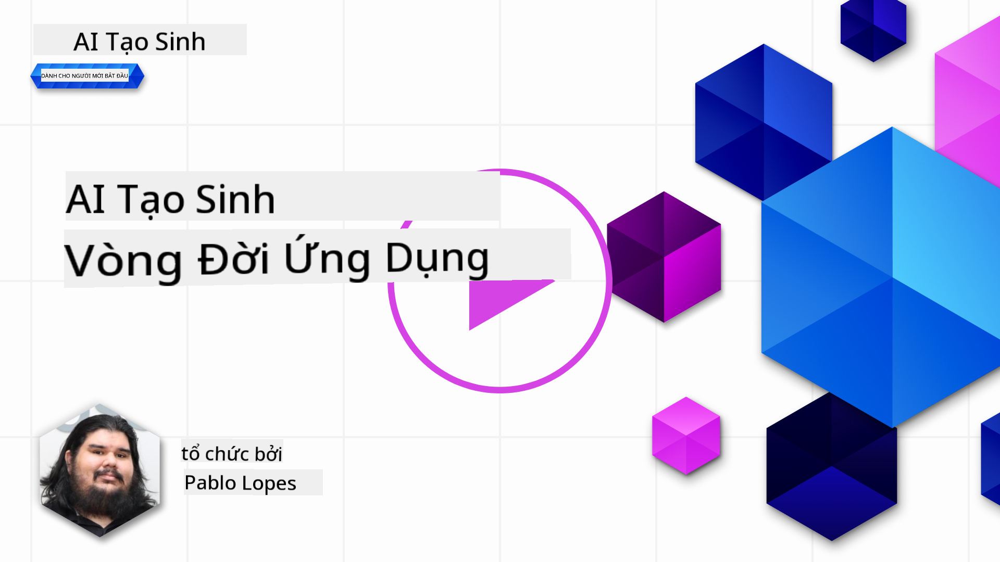
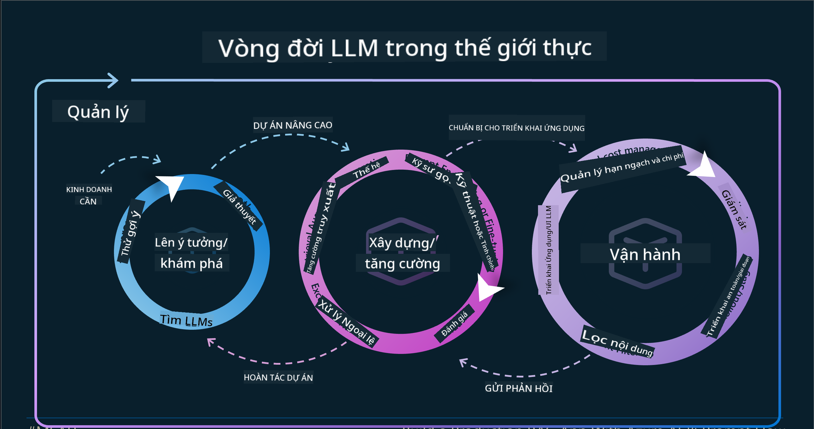
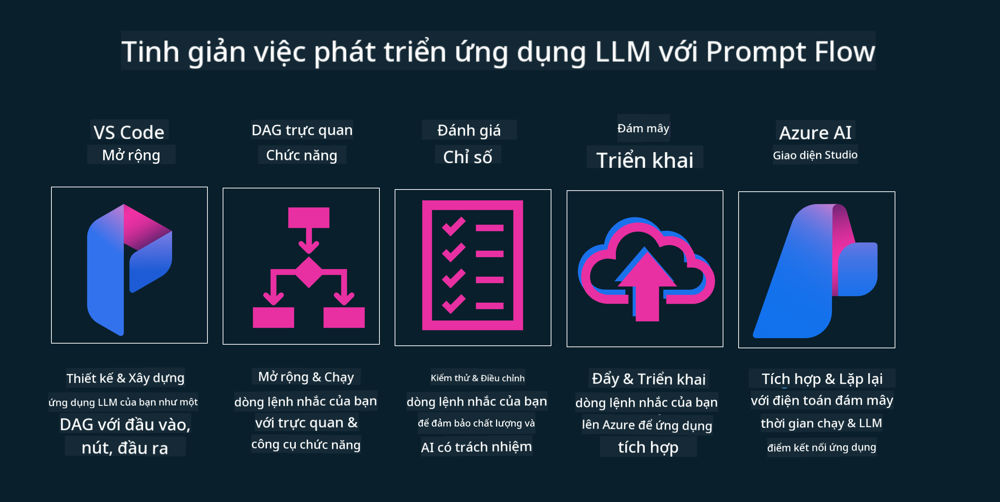

<!--
CO_OP_TRANSLATOR_METADATA:
{
  "original_hash": "27a5347a5022d5ef0a72ab029b03526a",
  "translation_date": "2025-07-09T15:56:11+00:00",
  "source_file": "14-the-generative-ai-application-lifecycle/README.md",
  "language_code": "vi"
}
-->

# Vòng đời Ứng dụng AI Tạo sinh

Một câu hỏi quan trọng đối với tất cả các ứng dụng AI là tính phù hợp của các tính năng AI, vì AI là một lĩnh vực phát triển nhanh, để đảm bảo ứng dụng của bạn luôn phù hợp, đáng tin cậy và bền vững, bạn cần liên tục theo dõi, đánh giá và cải tiến nó. Đây chính là vai trò của vòng đời AI tạo sinh.

Vòng đời AI tạo sinh là một khung hướng dẫn bạn qua các giai đoạn phát triển, triển khai và duy trì một ứng dụng AI tạo sinh. Nó giúp bạn xác định mục tiêu, đo lường hiệu suất, nhận diện thách thức và triển khai giải pháp. Đồng thời, nó giúp bạn đảm bảo ứng dụng phù hợp với các tiêu chuẩn đạo đức và pháp lý trong lĩnh vực và với các bên liên quan. Bằng cách tuân theo vòng đời AI tạo sinh, bạn có thể đảm bảo ứng dụng luôn mang lại giá trị và làm hài lòng người dùng.

## Giới thiệu

Trong chương này, bạn sẽ:

- Hiểu sự chuyển đổi mô hình từ MLOps sang LLMOps
- Vòng đời LLM
- Công cụ hỗ trợ vòng đời
- Đo lường và đánh giá vòng đời

## Hiểu sự chuyển đổi mô hình từ MLOps sang LLMOps

LLM là một công cụ mới trong kho vũ khí Trí tuệ Nhân tạo, chúng cực kỳ mạnh mẽ trong các nhiệm vụ phân tích và tạo nội dung cho ứng dụng, tuy nhiên sức mạnh này cũng kéo theo những hệ quả trong cách chúng ta tối ưu hóa các tác vụ AI và Học máy truyền thống.

Vì vậy, chúng ta cần một mô hình mới để thích nghi với công cụ này một cách linh hoạt, với các động lực phù hợp. Chúng ta có thể phân loại các ứng dụng AI cũ là "ML Apps" và các ứng dụng AI mới là "GenAI Apps" hoặc đơn giản là "AI Apps", phản ánh công nghệ và kỹ thuật chủ đạo được sử dụng tại thời điểm đó. Điều này thay đổi cách nhìn nhận của chúng ta theo nhiều hướng, hãy xem so sánh dưới đây.

Lưu ý rằng trong LLMOps, chúng ta tập trung nhiều hơn vào các Nhà phát triển ứng dụng, sử dụng tích hợp như một điểm mấu chốt, dùng "Models-as-a-Service" và cân nhắc các điểm sau cho các chỉ số.

- Chất lượng: Chất lượng phản hồi
- Tác hại: AI có trách nhiệm
- Trung thực: Độ chính xác của phản hồi (Có hợp lý? Có đúng không?)
- Chi phí: Ngân sách giải pháp
- Độ trễ: Thời gian trung bình để phản hồi từng token

## Vòng đời LLM

Đầu tiên, để hiểu vòng đời và các thay đổi, hãy xem infographic dưới đây.

Như bạn có thể thấy, điều này khác với các vòng đời thông thường của MLOps. LLM có nhiều yêu cầu mới, như Prompting, các kỹ thuật khác nhau để cải thiện chất lượng (Fine-Tuning, RAG, Meta-Prompts), các phương pháp đánh giá và trách nhiệm với AI có trách nhiệm, cuối cùng là các chỉ số đánh giá mới (Chất lượng, Tác hại, Trung thực, Chi phí và Độ trễ).

Ví dụ, hãy xem cách chúng ta lên ý tưởng. Sử dụng kỹ thuật prompt engineering để thử nghiệm với nhiều LLM khác nhau nhằm khám phá khả năng và kiểm tra xem giả thuyết của họ có thể đúng không.

Lưu ý rằng đây không phải là một quá trình tuyến tính, mà là các vòng lặp tích hợp, lặp đi lặp lại và có một chu trình tổng thể bao quát.

Chúng ta có thể khám phá các bước đó như thế nào? Hãy đi sâu vào chi tiết cách xây dựng một vòng đời.

Điều này có thể trông hơi phức tạp, hãy tập trung vào ba bước lớn trước.

1. Lên ý tưởng/Khám phá: Khám phá, tại đây chúng ta có thể khám phá theo nhu cầu kinh doanh. Tạo mẫu, xây dựng một [PromptFlow](https://microsoft.github.io/promptflow/index.html?WT.mc_id=academic-105485-koreyst) và kiểm tra xem nó có đủ hiệu quả cho giả thuyết của chúng ta không.
1. Xây dựng/Tăng cường: Triển khai, bây giờ, chúng ta bắt đầu đánh giá với các bộ dữ liệu lớn hơn, áp dụng các kỹ thuật như Fine-tuning và RAG để kiểm tra độ bền vững của giải pháp. Nếu không đạt, việc triển khai lại, thêm các bước mới vào quy trình hoặc tái cấu trúc dữ liệu có thể giúp cải thiện. Sau khi thử nghiệm quy trình và quy mô, nếu hoạt động tốt và các chỉ số đạt yêu cầu, nó sẵn sàng cho bước tiếp theo.
1. Vận hành: Tích hợp, bây giờ thêm hệ thống giám sát và cảnh báo vào hệ thống, triển khai và tích hợp ứng dụng vào hệ thống của bạn.

Sau đó, chúng ta có chu trình tổng thể của Quản lý, tập trung vào bảo mật, tuân thủ và quản trị.

Chúc mừng, giờ bạn đã có ứng dụng AI sẵn sàng hoạt động. Để trải nghiệm thực tế, hãy xem [Demo Contoso Chat.](https://nitya.github.io/contoso-chat/?WT.mc_id=academic-105485-koreys)

Vậy, chúng ta có thể sử dụng công cụ nào?

## Công cụ hỗ trợ vòng đời

Về công cụ, Microsoft cung cấp [Azure AI Platform](https://azure.microsoft.com/solutions/ai/?WT.mc_id=academic-105485-koreys) và [PromptFlow](https://microsoft.github.io/promptflow/index.html?WT.mc_id=academic-105485-koreyst) giúp bạn dễ dàng triển khai và vận hành vòng đời.

[Azure AI Platform](https://azure.microsoft.com/solutions/ai/?WT.mc_id=academic-105485-koreys) cho phép bạn sử dụng [AI Studio](https://ai.azure.com/?WT.mc_id=academic-105485-koreys). AI Studio là một cổng web giúp bạn khám phá các mô hình, mẫu và công cụ. Quản lý tài nguyên, phát triển giao diện người dùng và các tùy chọn SDK/CLI cho phát triển theo hướng code.

Azure AI cho phép bạn sử dụng nhiều tài nguyên để quản lý hoạt động, dịch vụ, dự án, tìm kiếm vector và nhu cầu cơ sở dữ liệu.

Xây dựng từ Proof-of-Concept (POC) đến các ứng dụng quy mô lớn với PromptFlow:

- Thiết kế và xây dựng ứng dụng từ VS Code, với các công cụ trực quan và chức năng
- Kiểm thử và tinh chỉnh ứng dụng để đạt chất lượng AI cao, dễ dàng thực hiện
- Sử dụng Azure AI Studio để tích hợp và lặp lại với đám mây, đẩy và triển khai nhanh chóng

## Tuyệt vời! Tiếp tục học hỏi!

Thật tuyệt, giờ hãy tìm hiểu thêm về cách chúng ta cấu trúc một ứng dụng để áp dụng các khái niệm với [Contoso Chat App](https://nitya.github.io/contoso-chat/?WT.mc_id=academic-105485-koreyst), để xem cách Cloud Advocacy áp dụng các khái niệm này trong các buổi trình diễn. Để có thêm nội dung, hãy xem [buổi breakout session tại Ignite!](https://www.youtube.com/watch?v=DdOylyrTOWg)

Bây giờ, hãy xem Bài học 15 để hiểu cách [Retrieval Augmented Generation và Vector Databases](../15-rag-and-vector-databases/README.md?WT.mc_id=academic-105485-koreyst) ảnh hưởng đến AI tạo sinh và giúp tạo ra các ứng dụng hấp dẫn hơn!

**Tuyên bố từ chối trách nhiệm**:  
Tài liệu này đã được dịch bằng dịch vụ dịch thuật AI [Co-op Translator](https://github.com/Azure/co-op-translator). Mặc dù chúng tôi cố gắng đảm bảo độ chính xác, xin lưu ý rằng bản dịch tự động có thể chứa lỗi hoặc không chính xác. Tài liệu gốc bằng ngôn ngữ gốc của nó nên được coi là nguồn chính xác và đáng tin cậy. Đối với các thông tin quan trọng, nên sử dụng dịch vụ dịch thuật chuyên nghiệp do con người thực hiện. Chúng tôi không chịu trách nhiệm về bất kỳ sự hiểu lầm hoặc giải thích sai nào phát sinh từ việc sử dụng bản dịch này.