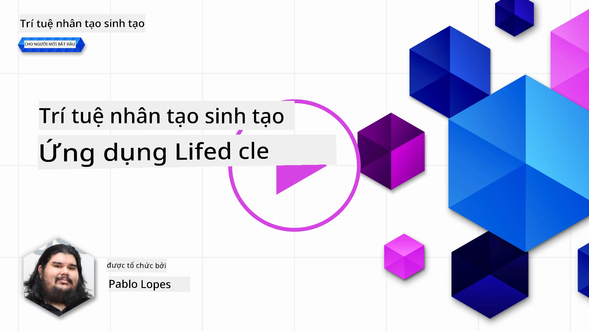
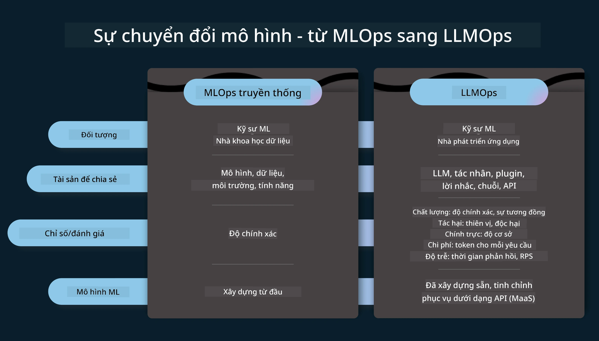
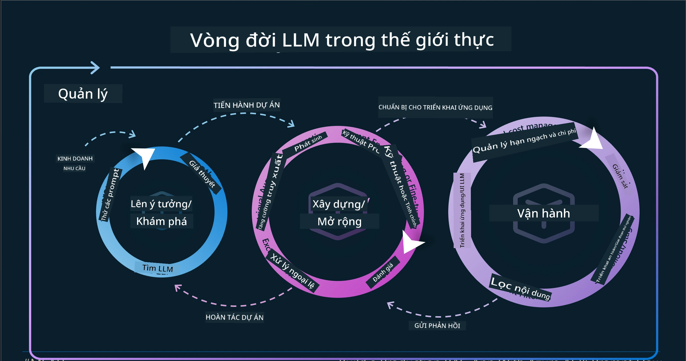
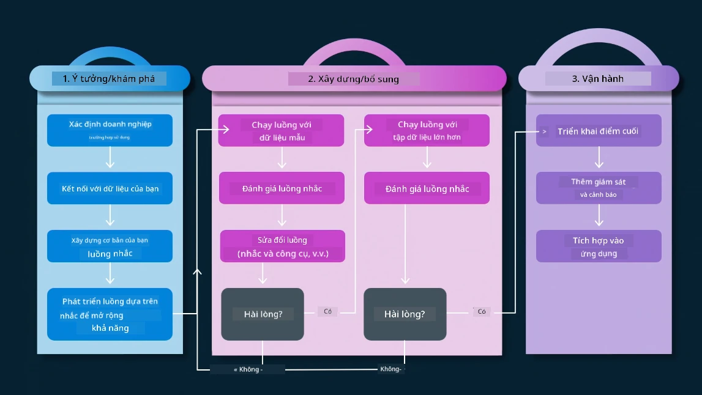
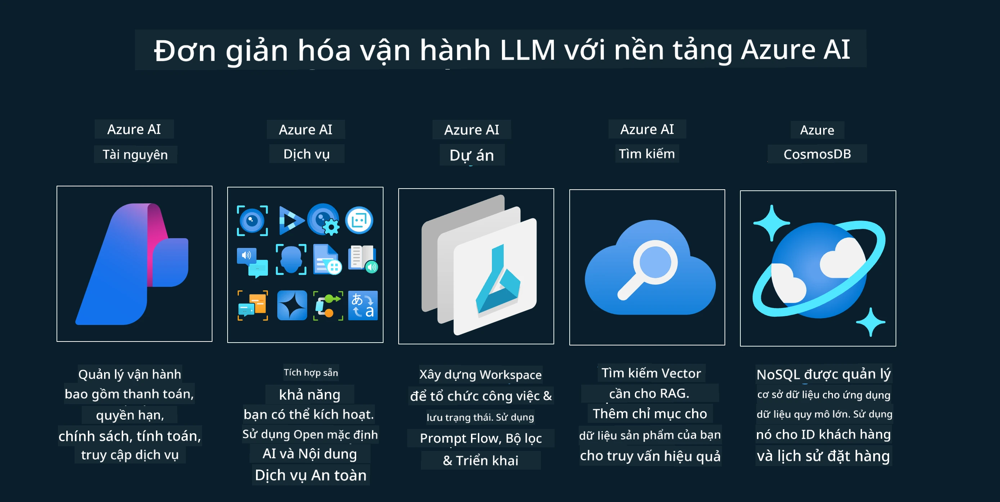
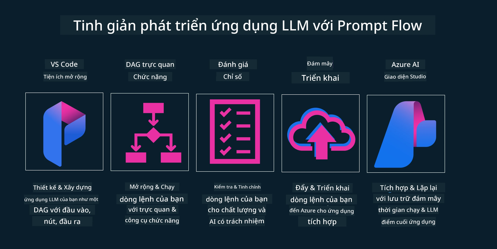

# Vòng đời Ứng dụng AI Tạo sinh

Một câu hỏi quan trọng đối với tất cả các ứng dụng AI là mức độ liên quan của các tính năng AI, vì AI là một lĩnh vực phát triển nhanh, để đảm bảo rằng ứng dụng của bạn luôn liên quan, đáng tin cậy và bền vững, bạn cần giám sát, đánh giá và cải tiến nó liên tục. Đây chính là vai trò của vòng đời AI tạo sinh.

Vòng đời AI tạo sinh là một khung hướng dẫn bạn qua các giai đoạn phát triển, triển khai và duy trì một ứng dụng AI tạo sinh. Nó giúp bạn xác định mục tiêu, đo lường hiệu suất, nhận diện thách thức và triển khai các giải pháp. Nó cũng giúp bạn điều chỉnh ứng dụng phù hợp với các tiêu chuẩn đạo đức và pháp lý của lĩnh vực và các bên liên quan. Bằng cách tuân theo vòng đời AI tạo sinh, bạn có thể đảm bảo rằng ứng dụng của bạn luôn mang lại giá trị và làm hài lòng người dùng.

## Giới thiệu

Trong chương này, bạn sẽ:

- Hiểu về Sự thay đổi mô hình từ MLOps sang LLMOps
- Vòng đời LLM
- Công cụ vòng đời
- Đánh giá và đo lường vòng đời

## Hiểu về Sự thay đổi mô hình từ MLOps sang LLMOps

LLM là công cụ mới trong kho vũ khí Trí tuệ nhân tạo, chúng rất mạnh trong các tác vụ phân tích và tạo nội dung cho các ứng dụng, tuy nhiên sức mạnh này cũng kéo theo một số hệ quả trong cách chúng ta tinh gọn các tác vụ AI và Học máy cổ điển.

Với điều này, chúng ta cần một Mô hình mới để thích nghi công cụ này một cách linh hoạt, với các động lực phù hợp. Chúng ta có thể phân loại các ứng dụng AI cũ là "Ứng dụng ML" và các ứng dụng AI mới là "Ứng dụng GenAI" hoặc chỉ là "Ứng dụng AI", phản ánh công nghệ và kỹ thuật chủ đạo được sử dụng tại thời điểm đó. Điều này làm thay đổi cách nhìn nhận của chúng ta theo nhiều hướng, hãy xem so sánh dưới đây.

Lưu ý rằng trong LLMOps, chúng ta tập trung hơn vào Nhà phát triển ứng dụng, sử dụng tích hợp làm điểm then chốt, dùng "Mô hình như một dịch vụ" và suy nghĩ theo các điểm sau cho các chỉ số.

- Chất lượng: Chất lượng phản hồi
- Tác hại: AI có trách nhiệm
- Trung thực: Tính căn cứ của phản hồi (Có hợp lý? Có chính xác?)
- Chi phí: Ngân sách giải pháp
- Độ trễ: Thời gian trung bình phản hồi token

## Vòng đời LLM

Đầu tiên, để hiểu vòng đời và các thay đổi, hãy xem infographic sau.

Như bạn thấy, điều này khác so với vòng đời thông thường của MLOps. LLM có nhiều yêu cầu mới, như Prompting, các kỹ thuật khác nhau để cải thiện chất lượng (Tối ưu hóa, RAG, Meta-Prompts), đánh giá và trách nhiệm với AI có trách nhiệm, cuối cùng là các chỉ số đánh giá mới (Chất lượng, Tác hại, Trung thực, Chi phí và Độ trễ).

Ví dụ, hãy nhìn cách chúng ta xây dựng ý tưởng. Sử dụng kỹ thuật thiết kế prompt để thử nghiệm với nhiều LLM khác nhau nhằm khám phá khả năng để kiểm tra giả thuyết của họ có thể đúng không.

Lưu ý rằng đây không phải là quá trình tuyến tính, mà là các vòng lặp tích hợp, lặp đi lặp lại và có chu trình tổng thể bao quát.

Chúng ta có thể khám phá những bước đó như thế nào? Hãy đi sâu vào chi tiết cách xây dựng vòng đời.

Điều này có vẻ hơi phức tạp, hãy tập trung trước vào ba bước chính.

1. Tạo ý tưởng / Khám phá: Khám phá, ở đây chúng ta có thể khám phá theo nhu cầu kinh doanh. Tạo mẫu thử, xây dựng một [PromptFlow](https://microsoft.github.io/promptflow/index.html?WT.mc_id=academic-105485-koreyst) và kiểm tra xem nó có đủ hiệu quả cho giả thuyết của chúng ta không.
1. Xây dựng / Bổ sung: Triển khai, bây giờ chúng ta bắt đầu đánh giá với bộ dữ liệu lớn hơn, áp dụng các kỹ thuật như Tinh chỉnh và RAG, để kiểm tra tính bền vững của giải pháp. Nếu không thành công, việc triển khai lại, thêm bước mới vào quy trình hoặc cấu trúc lại dữ liệu có thể giúp. Sau khi kiểm tra luồng và quy mô, nếu hoạt động tốt và kiểm tra các chỉ số, nó sẵn sàng cho bước tiếp theo.
1. Vận hành hóa: Tích hợp, bây giờ thêm hệ thống Giám sát và Cảnh báo vào hệ thống, triển khai và tích hợp ứng dụng.

Sau đó, chúng ta có chu trình tổng thể của Quản lý, tập trung vào bảo mật, tuân thủ và quản trị.

Chúc mừng, giờ bạn đã có ứng dụng AI sẵn sàng hoạt động. Để trải nghiệm thực hành, hãy xem [Demo Contoso Chat.](https://nitya.github.io/contoso-chat/?WT.mc_id=academic-105485-koreyst)

Vậy, chúng ta có thể dùng công cụ nào?

## Công cụ vòng đời

Về công cụ, Microsoft cung cấp [Nền tảng Azure AI](https://azure.microsoft.com/solutions/ai/?WT.mc_id=academic-105485-koreyst) và [PromptFlow](https://microsoft.github.io/promptflow/index.html?WT.mc_id=academic-105485-koreyst) giúp bạn dễ dàng triển khai và vận hành chu trình.

[Nền tảng Azure AI](https://azure.microsoft.com/solutions/ai/?WT.mc_id=academic-105485-koreyst), cho phép bạn sử dụng [AI Studio](https://ai.azure.com/?WT.mc_id=academic-105485-koreyst). AI Studio là một cổng web cho phép bạn khám phá mô hình, mẫu và công cụ. Quản lý tài nguyên, luồng phát triển UI và tùy chọn SDK/CLI dành cho phát triển ưu tiên CODE.

Azure AI cho phép bạn sử dụng nhiều nguồn lực khác nhau để quản lý vận hành, dịch vụ, dự án, tìm kiếm vectơ và các nhu cầu cơ sở dữ liệu.

Xây dựng, từ bằng chứng khái niệm (POC) đến các ứng dụng quy mô lớn với PromptFlow:

- Thiết kế và xây dựng ứng dụng từ VS Code, với các công cụ trực quan và chức năng
- Kiểm thử và tinh chỉnh ứng dụng để đạt AI chất lượng, một cách dễ dàng.
- Sử dụng Azure AI Studio để tích hợp và lặp lại với đám mây, đẩy và triển khai nhanh chóng.

## Tuyệt vời! Hãy tiếp tục học thêm!

Thật tuyệt, bây giờ hãy tìm hiểu thêm về cách chúng ta cấu trúc một ứng dụng để sử dụng các khái niệm với [Ứng dụng Contoso Chat](https://nitya.github.io/contoso-chat/?WT.mc_id=academic-105485-koreyst), để xem cách Cloud Advocacy đưa những khái niệm này vào các minh họa. Để có thêm nội dung, xem phiên breakout tại [Ignite!](https://www.youtube.com/watch?v=DdOylyrTOWg)

Bây giờ, hãy sang Bài 15, để hiểu cách [Truy xuất tăng cường và Cơ sở dữ liệu vectơ](../15-rag-and-vector-databases/README.md?WT.mc_id=academic-105485-koreyst) ảnh hưởng đến AI tạo sinh và để tạo ra các ứng dụng hấp dẫn hơn!

---

<!-- CO-OP TRANSLATOR DISCLAIMER START -->
**Miễn trừ trách nhiệm**:  
Tài liệu này đã được dịch bằng dịch vụ dịch thuật AI [Co-op Translator](https://github.com/Azure/co-op-translator). Mặc dù chúng tôi cố gắng đảm bảo độ chính xác, xin lưu ý rằng bản dịch tự động có thể chứa lỗi hoặc không chính xác. Tài liệu gốc bằng ngôn ngữ gốc được coi là nguồn thông tin chính xác và có thẩm quyền. Đối với các thông tin quan trọng, nên sử dụng dịch thuật chuyên nghiệp bởi con người. Chúng tôi không chịu trách nhiệm về bất kỳ hiểu lầm hoặc sai lệch nào phát sinh từ việc sử dụng bản dịch này.
<!-- CO-OP TRANSLATOR DISCLAIMER END -->