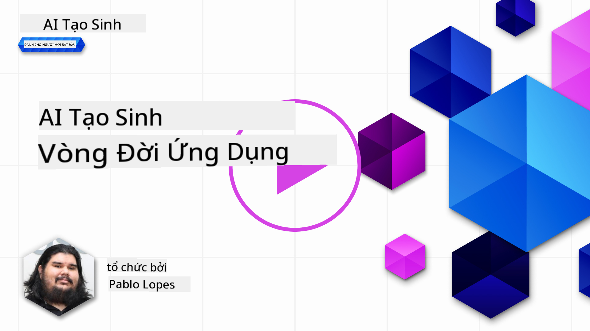
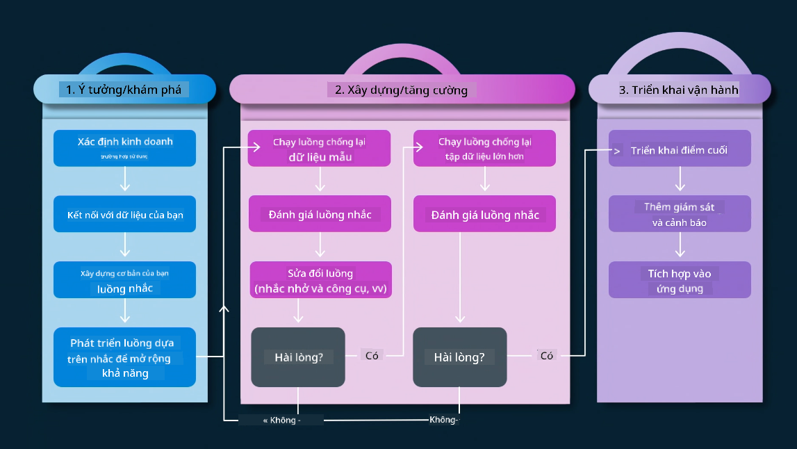
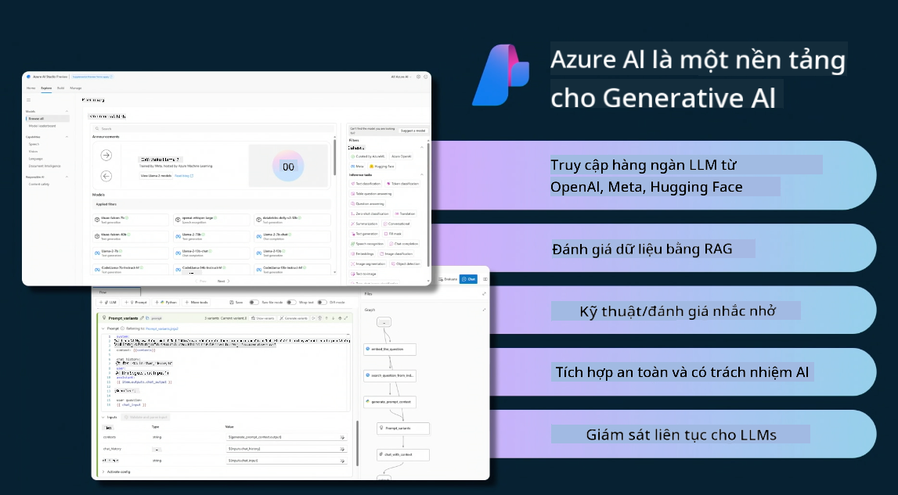
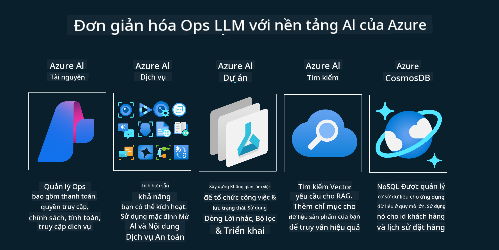

<!--
CO_OP_TRANSLATOR_METADATA:
{
  "original_hash": "27a5347a5022d5ef0a72ab029b03526a",
  "translation_date": "2025-06-25T22:06:55+00:00",
  "source_file": "14-the-generative-ai-application-lifecycle/README.md",
  "language_code": "vi"
}
-->

# Vòng đời ứng dụng AI sinh

Một câu hỏi quan trọng đối với tất cả các ứng dụng AI là sự liên quan của các tính năng AI, vì AI là một lĩnh vực phát triển nhanh chóng, để đảm bảo rằng ứng dụng của bạn vẫn phù hợp, đáng tin cậy và mạnh mẽ, bạn cần theo dõi, đánh giá và cải tiến liên tục. Đây là nơi vòng đời AI sinh đi vào.

Vòng đời AI sinh là một khung hướng dẫn bạn qua các giai đoạn phát triển, triển khai và duy trì ứng dụng AI sinh. Nó giúp bạn xác định mục tiêu, đo lường hiệu suất, xác định thách thức và triển khai giải pháp. Nó cũng giúp bạn điều chỉnh ứng dụng của mình với các tiêu chuẩn đạo đức và pháp lý của lĩnh vực và các bên liên quan. Bằng cách tuân theo vòng đời AI sinh, bạn có thể đảm bảo rằng ứng dụng của bạn luôn mang lại giá trị và đáp ứng nhu cầu của người dùng.

## Giới thiệu

Trong chương này, bạn sẽ:

- Hiểu sự chuyển đổi từ MLOps sang LLMOps
- Vòng đời LLM
- Công cụ vòng đời
- Đo lường và đánh giá vòng đời

## Hiểu sự chuyển đổi từ MLOps sang LLMOps

LLM là một công cụ mới trong kho vũ khí Trí tuệ Nhân tạo, chúng vô cùng mạnh mẽ trong các nhiệm vụ phân tích và tạo ra cho các ứng dụng, tuy nhiên sức mạnh này có một số hệ quả trong cách chúng ta tối ưu hóa các nhiệm vụ AI và Máy học Cổ điển.

Với điều này, chúng ta cần một mô hình mới để thích ứng công cụ này một cách linh hoạt, với các động lực đúng đắn. Chúng ta có thể phân loại các ứng dụng AI cũ là "Ứng dụng ML" và các ứng dụng AI mới là "Ứng dụng GenAI" hoặc chỉ là "Ứng dụng AI", phản ánh công nghệ và kỹ thuật phổ biến được sử dụng vào thời điểm đó. Điều này thay đổi câu chuyện của chúng ta theo nhiều cách, hãy xem so sánh sau đây.

Lưu ý rằng trong LLMOps, chúng ta tập trung hơn vào các nhà phát triển ứng dụng, sử dụng tích hợp như một điểm quan trọng, sử dụng "Models-as-a-Service" và suy nghĩ về các điểm sau cho các chỉ số.

- Chất lượng: Chất lượng phản hồi
- Tổn hại: AI có trách nhiệm
- Tính trung thực: Sự chính xác của phản hồi (Có hợp lý không? Nó có đúng không?)
- Chi phí: Ngân sách giải pháp
- Độ trễ: Thời gian trung bình cho phản hồi token

## Vòng đời LLM

Trước tiên, để hiểu vòng đời và các sửa đổi, hãy xem xét đồ họa thông tin tiếp theo.

Như bạn có thể thấy, điều này khác với các vòng đời thông thường từ MLOps. LLM có nhiều yêu cầu mới, như Prompting, các kỹ thuật khác nhau để cải thiện chất lượng (Fine-Tuning, RAG, Meta-Prompts), đánh giá và trách nhiệm với AI có trách nhiệm, cuối cùng, các chỉ số đánh giá mới (Chất lượng, Tổn hại, Tính trung thực, Chi phí và Độ trễ).

Ví dụ, hãy xem cách chúng ta lên ý tưởng. Sử dụng kỹ thuật gợi ý để thử nghiệm với các LLM khác nhau để khám phá các khả năng để kiểm tra xem giả thuyết của họ có thể đúng không.

Lưu ý rằng đây không phải là tuyến tính, mà là các vòng lặp tích hợp, lặp đi lặp lại và có một chu kỳ bao quát.

Làm thế nào chúng ta có thể khám phá những bước đó? Hãy đi vào chi tiết về cách chúng ta có thể xây dựng một vòng đời.

Điều này có thể trông hơi phức tạp, hãy tập trung vào ba bước lớn trước.

1. Lên ý tưởng/Khám phá: Khám phá, ở đây chúng ta có thể khám phá theo nhu cầu kinh doanh của mình. Tạo mẫu, tạo một [PromptFlow](https://microsoft.github.io/promptflow/index.html?WT.mc_id=academic-105485-koreyst) và kiểm tra xem nó có đủ hiệu quả cho giả thuyết của chúng ta không.
2. Xây dựng/Tăng cường: Triển khai, bây giờ, chúng ta bắt đầu đánh giá cho các tập dữ liệu lớn hơn, triển khai các kỹ thuật như Fine-tuning và RAG để kiểm tra tính mạnh mẽ của giải pháp của chúng ta. Nếu không, việc tái triển khai nó, thêm các bước mới vào luồng của chúng ta hoặc cấu trúc lại dữ liệu có thể giúp ích. Sau khi thử nghiệm luồng và quy mô của chúng ta, nếu nó hoạt động và kiểm tra các chỉ số của chúng ta, nó sẵn sàng cho bước tiếp theo.
3. Vận hành: Tích hợp, bây giờ thêm hệ thống giám sát và cảnh báo vào hệ thống của chúng ta, triển khai và tích hợp ứng dụng vào ứng dụng của chúng ta.

Sau đó, chúng ta có chu kỳ bao quát của Quản lý, tập trung vào bảo mật, tuân thủ và quản trị.

Chúc mừng, bây giờ bạn đã có ứng dụng AI của mình sẵn sàng hoạt động. Để có trải nghiệm thực tế, hãy xem [Contoso Chat Demo.](https://nitya.github.io/contoso-chat/?WT.mc_id=academic-105485-koreys)

Bây giờ, chúng ta có thể sử dụng những công cụ nào?

## Công cụ vòng đời

Đối với công cụ, Microsoft cung cấp [Nền tảng AI Azure](https://azure.microsoft.com/solutions/ai/?WT.mc_id=academic-105485-koreys) và [PromptFlow](https://microsoft.github.io/promptflow/index.html?WT.mc_id=academic-105485-koreyst) để dễ dàng thực hiện và sẵn sàng cho vòng đời của bạn.

[Nền tảng AI Azure](https://azure.microsoft.com/solutions/ai/?WT.mc_id=academic-105485-koreys), cho phép bạn sử dụng [AI Studio](https://ai.azure.com/?WT.mc_id=academic-105485-koreys). AI Studio là một cổng web cho phép bạn khám phá các mô hình, mẫu và công cụ. Quản lý tài nguyên của bạn, phát triển UI và các tùy chọn SDK/CLI cho phát triển Code-First.

Azure AI, cho phép bạn sử dụng nhiều tài nguyên, để quản lý các hoạt động, dịch vụ, dự án, tìm kiếm vector và nhu cầu cơ sở dữ liệu của bạn.

Xây dựng, từ Proof-of-Concept(POC) đến ứng dụng quy mô lớn với PromptFlow:

- Thiết kế và xây dựng ứng dụng từ VS Code, với các công cụ trực quan và chức năng
- Kiểm tra và tinh chỉnh ứng dụng của bạn để có chất lượng AI, một cách dễ dàng.
- Sử dụng Azure AI Studio để tích hợp và lặp lại với đám mây, đẩy và triển khai để tích hợp nhanh chóng.

## Tuyệt vời! Tiếp tục học hỏi!

Tuyệt vời, bây giờ hãy tìm hiểu thêm về cách chúng ta cấu trúc một ứng dụng để sử dụng các khái niệm với [Ứng dụng Chat Contoso](https://nitya.github.io/contoso-chat/?WT.mc_id=academic-105485-koreyst), để kiểm tra cách Cloud Advocacy thêm những khái niệm đó vào các cuộc biểu diễn. Để biết thêm nội dung, hãy xem phiên họp tại [Ignite breakout session!
](https://www.youtube.com/watch?v=DdOylyrTOWg)

Bây giờ, hãy xem Bài học 15, để hiểu cách [Retrieval Augmented Generation và Cơ sở dữ liệu Vector](../15-rag-and-vector-databases/README.md?WT.mc_id=academic-105485-koreyst) ảnh hưởng đến AI sinh và tạo ra các ứng dụng hấp dẫn hơn!

**Tuyên bố miễn trừ trách nhiệm**:  
Tài liệu này đã được dịch bằng dịch vụ dịch thuật AI [Co-op Translator](https://github.com/Azure/co-op-translator). Mặc dù chúng tôi cố gắng đảm bảo độ chính xác, xin lưu ý rằng các bản dịch tự động có thể chứa lỗi hoặc không chính xác. Tài liệu gốc bằng ngôn ngữ bản địa nên được coi là nguồn đáng tin cậy. Đối với thông tin quan trọng, nên sử dụng dịch vụ dịch thuật chuyên nghiệp từ con người. Chúng tôi không chịu trách nhiệm cho bất kỳ sự hiểu lầm hoặc diễn giải sai nào phát sinh từ việc sử dụng bản dịch này.