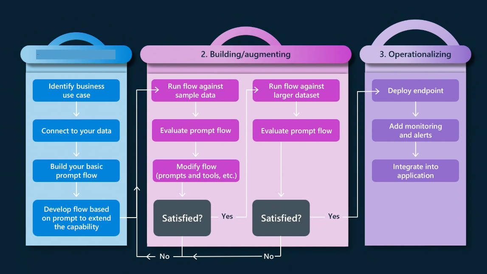
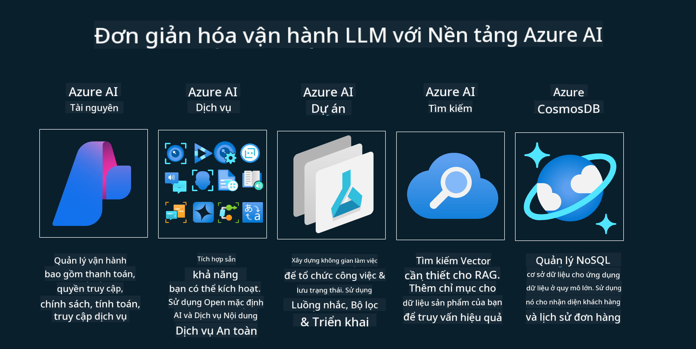
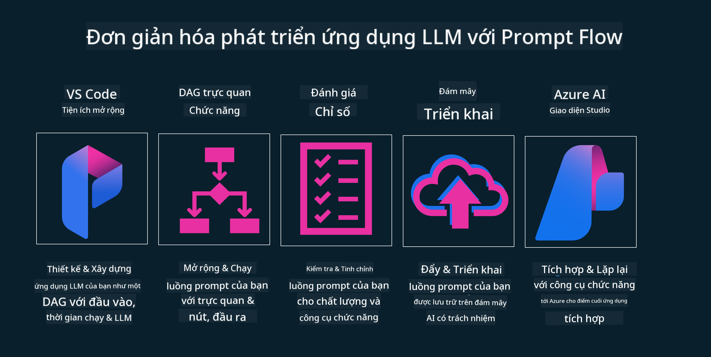

<!--
CO_OP_TRANSLATOR_METADATA:
{
  "original_hash": "df44972d5575ea8cef3c52ee31696d04",
  "translation_date": "2025-12-19T16:01:40+00:00",
  "source_file": "14-the-generative-ai-application-lifecycle/README.md",
  "language_code": "vi"
}
-->

# Vòng đời Ứng dụng AI Tạo sinh

Một câu hỏi quan trọng đối với tất cả các ứng dụng AI là tính liên quan của các tính năng AI, vì AI là một lĩnh vực phát triển nhanh, để đảm bảo rằng ứng dụng của bạn luôn phù hợp, đáng tin cậy và vững chắc, bạn cần theo dõi, đánh giá và cải thiện nó liên tục. Đây chính là nơi vòng đời AI tạo sinh phát huy tác dụng.

Vòng đời AI tạo sinh là một khung hướng dẫn bạn qua các giai đoạn phát triển, triển khai và duy trì một ứng dụng AI tạo sinh. Nó giúp bạn xác định mục tiêu, đo lường hiệu suất, nhận diện các thách thức và thực hiện các giải pháp. Nó cũng giúp bạn điều chỉnh ứng dụng của mình phù hợp với các tiêu chuẩn đạo đức và pháp lý của lĩnh vực và các bên liên quan. Bằng cách tuân theo vòng đời AI tạo sinh, bạn có thể đảm bảo rằng ứng dụng của mình luôn mang lại giá trị và làm hài lòng người dùng.

## Giới thiệu

Trong chương này, bạn sẽ:

- Hiểu sự chuyển đổi mô hình từ MLOps sang LLMOps
- Vòng đời LLM
- Công cụ vòng đời
- Đo lường và đánh giá vòng đời

## Hiểu sự chuyển đổi mô hình từ MLOps sang LLMOps

LLM là một công cụ mới trong kho vũ khí Trí tuệ Nhân tạo, chúng cực kỳ mạnh mẽ trong các nhiệm vụ phân tích và tạo sinh cho các ứng dụng, tuy nhiên sức mạnh này có một số hệ quả trong cách chúng ta tinh giản các nhiệm vụ AI và Học máy Cổ điển.

Với điều này, chúng ta cần một mô hình mới để thích nghi công cụ này một cách linh hoạt, với các động lực phù hợp. Chúng ta có thể phân loại các ứng dụng AI cũ là "Ứng dụng ML" và các ứng dụng AI mới hơn là "Ứng dụng GenAI" hoặc chỉ đơn giản là "Ứng dụng AI", phản ánh công nghệ và kỹ thuật chủ đạo được sử dụng vào thời điểm đó. Điều này thay đổi cách kể chuyện của chúng ta theo nhiều cách, hãy xem so sánh sau đây.

Lưu ý rằng trong LLMOps, chúng ta tập trung nhiều hơn vào Nhà phát triển Ứng dụng, sử dụng tích hợp như một điểm then chốt, sử dụng "Mô hình như một Dịch vụ" và suy nghĩ theo các điểm sau cho các chỉ số.

- Chất lượng: Chất lượng phản hồi
- Tác hại: AI có trách nhiệm
- Trung thực: Độ căn cứ của phản hồi (Có hợp lý? Có chính xác không?)
- Chi phí: Ngân sách giải pháp
- Độ trễ: Thời gian trung bình cho phản hồi token

## Vòng đời LLM

Trước tiên, để hiểu vòng đời và các sửa đổi, hãy xem infographic tiếp theo.

Như bạn có thể nhận thấy, điều này khác với các vòng đời thông thường của MLOps. LLM có nhiều yêu cầu mới, như Prompting, các kỹ thuật khác nhau để cải thiện chất lượng (Fine-Tuning, RAG, Meta-Prompts), đánh giá và trách nhiệm khác với AI có trách nhiệm, cuối cùng là các chỉ số đánh giá mới (Chất lượng, Tác hại, Trung thực, Chi phí và Độ trễ).

Ví dụ, hãy xem cách chúng ta ý tưởng hóa. Sử dụng kỹ thuật prompt để thử nghiệm với các LLM khác nhau nhằm khám phá các khả năng để kiểm tra xem Giả thuyết của họ có thể đúng không.

Lưu ý rằng đây không phải là tuyến tính, mà là các vòng lặp tích hợp, lặp đi lặp lại và có một chu trình tổng thể.

Chúng ta có thể khám phá các bước đó như thế nào? Hãy đi vào chi tiết cách xây dựng một vòng đời.

Điều này có thể trông hơi phức tạp, hãy tập trung vào ba bước lớn trước.

1. Ý tưởng/Hướng khám phá: Khám phá, ở đây chúng ta có thể khám phá theo nhu cầu kinh doanh. Tạo mẫu, tạo một [PromptFlow](https://microsoft.github.io/promptflow/index.html?WT.mc_id=academic-105485-koreyst) và kiểm tra xem nó có đủ hiệu quả cho Giả thuyết của chúng ta không.
1. Xây dựng/Tăng cường: Triển khai, bây giờ, chúng ta bắt đầu đánh giá với các bộ dữ liệu lớn hơn, áp dụng các kỹ thuật như Fine-tuning và RAG, để kiểm tra độ vững chắc của giải pháp. Nếu không, việc triển khai lại, thêm các bước mới vào quy trình hoặc tái cấu trúc dữ liệu có thể giúp. Sau khi thử nghiệm quy trình và quy mô, nếu nó hoạt động và kiểm tra các chỉ số, nó sẵn sàng cho bước tiếp theo.
1. Vận hành: Tích hợp, bây giờ thêm Hệ thống Giám sát và Cảnh báo vào hệ thống, triển khai và tích hợp ứng dụng vào Ứng dụng của chúng ta.

Sau đó, chúng ta có chu trình tổng thể của Quản lý, tập trung vào bảo mật, tuân thủ và quản trị.

Chúc mừng, bây giờ bạn đã có Ứng dụng AI sẵn sàng hoạt động. Để có trải nghiệm thực hành, hãy xem [Demo Chat Contoso.](https://nitya.github.io/contoso-chat/?WT.mc_id=academic-105485-koreys)

Bây giờ, chúng ta có thể sử dụng công cụ nào?

## Công cụ vòng đời

Về công cụ, Microsoft cung cấp [Nền tảng AI Azure](https://azure.microsoft.com/solutions/ai/?WT.mc_id=academic-105485-koreys) và [PromptFlow](https://microsoft.github.io/promptflow/index.html?WT.mc_id=academic-105485-koreyst) giúp đơn giản hóa và làm cho chu trình của bạn dễ triển khai và sẵn sàng sử dụng.

[Nền tảng AI Azure](https://azure.microsoft.com/solutions/ai/?WT.mc_id=academic-105485-koreys) cho phép bạn sử dụng [AI Studio](https://ai.azure.com/?WT.mc_id=academic-105485-koreys). AI Studio là một cổng web cho phép bạn khám phá các mô hình, mẫu và công cụ. Quản lý tài nguyên, phát triển giao diện người dùng và các tùy chọn SDK/CLI cho phát triển theo hướng mã.

Azure AI cho phép bạn sử dụng nhiều tài nguyên để quản lý các hoạt động, dịch vụ, dự án, tìm kiếm vector và nhu cầu cơ sở dữ liệu.

Xây dựng, từ Bằng chứng Khái niệm (POC) đến các ứng dụng quy mô lớn với PromptFlow:

- Thiết kế và xây dựng ứng dụng từ VS Code, với các công cụ trực quan và chức năng
- Kiểm tra và tinh chỉnh ứng dụng để có AI chất lượng, dễ dàng.
- Sử dụng Azure AI Studio để tích hợp và lặp lại với đám mây, Đẩy và Triển khai để tích hợp nhanh.

## Tuyệt vời! Tiếp tục học tập!

Tuyệt vời, bây giờ hãy tìm hiểu thêm về cách chúng ta cấu trúc một ứng dụng để sử dụng các khái niệm với [Ứng dụng Chat Contoso](https://nitya.github.io/contoso-chat/?WT.mc_id=academic-105485-koreyst), để xem cách Cloud Advocacy thêm các khái niệm đó trong các buổi trình diễn. Để có thêm nội dung, hãy xem [phiên breakout Ignite!](https://www.youtube.com/watch?v=DdOylyrTOWg)

Bây giờ, hãy xem Bài học 15, để hiểu cách [Tăng cường Truy xuất và Cơ sở dữ liệu Vector](../15-rag-and-vector-databases/README.md?WT.mc_id=academic-105485-koreyst) ảnh hưởng đến AI Tạo sinh và làm cho các Ứng dụng hấp dẫn hơn!

---

<!-- CO-OP TRANSLATOR DISCLAIMER START -->
**Tuyên bố từ chối trách nhiệm**:  
Tài liệu này đã được dịch bằng dịch vụ dịch thuật AI [Co-op Translator](https://github.com/Azure/co-op-translator). Mặc dù chúng tôi cố gắng đảm bảo độ chính xác, xin lưu ý rằng bản dịch tự động có thể chứa lỗi hoặc không chính xác. Tài liệu gốc bằng ngôn ngữ gốc nên được coi là nguồn tham khảo chính thức. Đối với các thông tin quan trọng, nên sử dụng dịch vụ dịch thuật chuyên nghiệp do con người thực hiện. Chúng tôi không chịu trách nhiệm về bất kỳ sự hiểu lầm hoặc giải thích sai nào phát sinh từ việc sử dụng bản dịch này.
<!-- CO-OP TRANSLATOR DISCLAIMER END -->