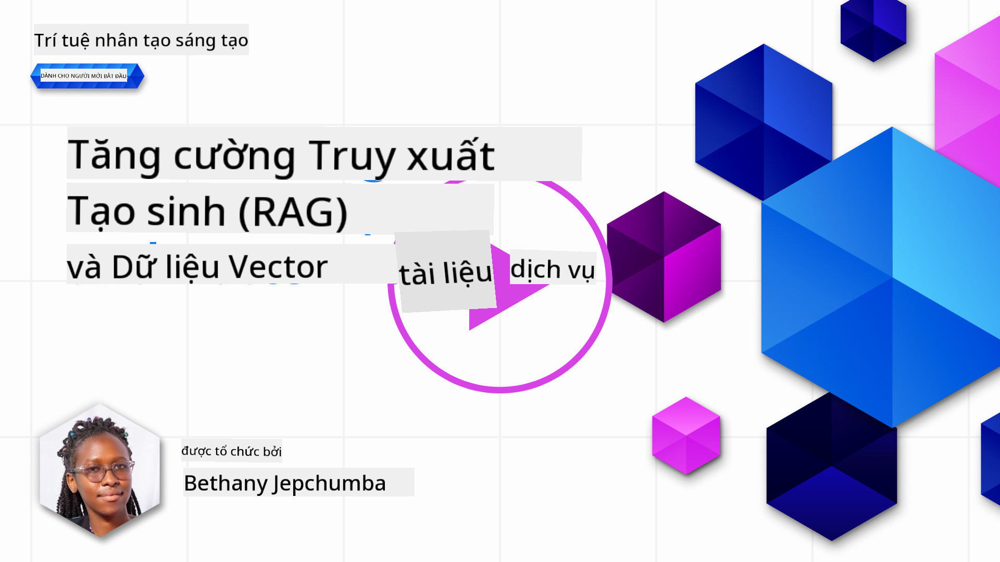
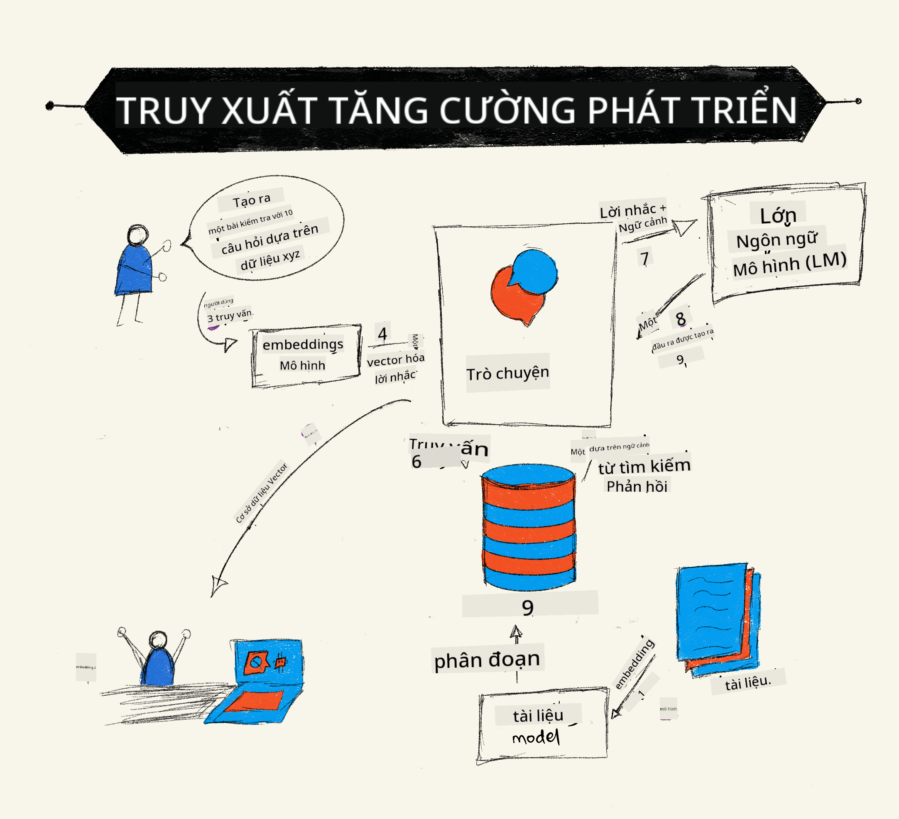
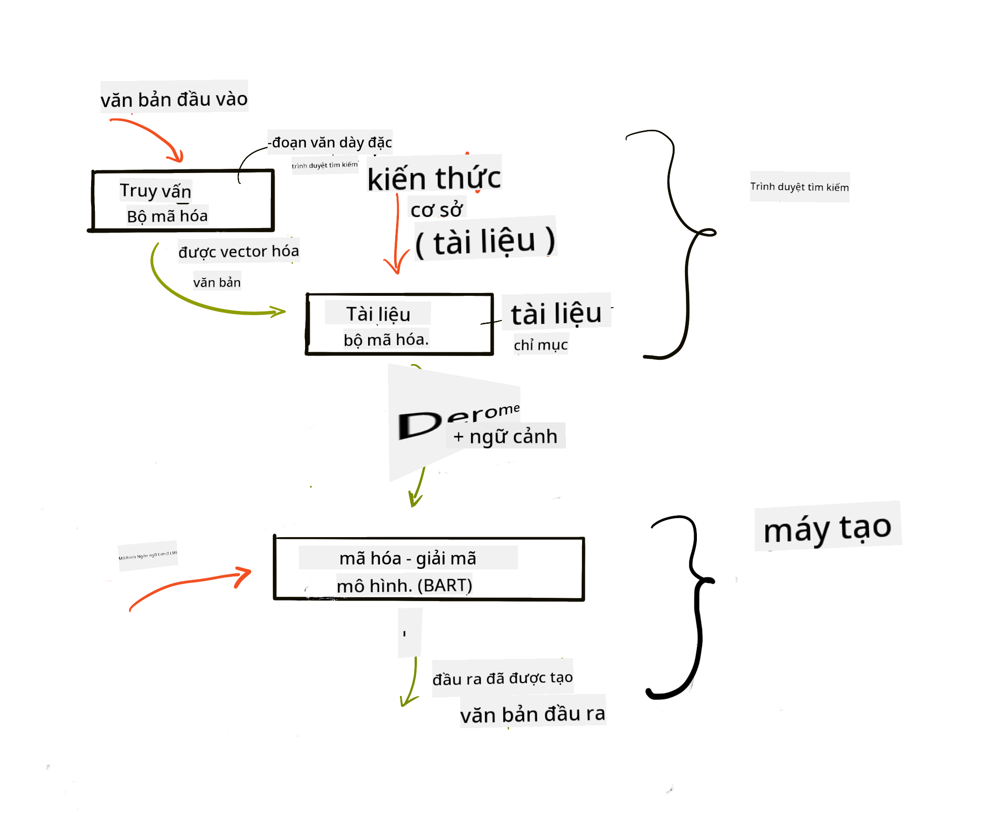
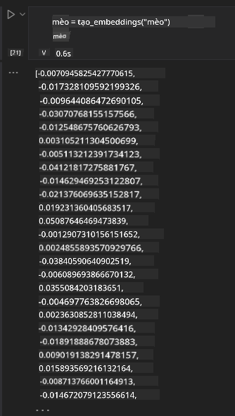

<!--
CO_OP_TRANSLATOR_METADATA:
{
  "original_hash": "e2861bbca91c0567ef32bc77fe054f9e",
  "translation_date": "2025-05-20T01:36:16+00:00",
  "source_file": "15-rag-and-vector-databases/README.md",
  "language_code": "vi"
}
-->
# Retrieval Augmented Generation (RAG) và Cơ sở Dữ liệu Vector

[](https://aka.ms/gen-ai-lesson15-gh?WT.mc_id=academic-105485-koreyst)

Trong bài học về ứng dụng tìm kiếm, chúng ta đã tìm hiểu ngắn gọn về cách tích hợp dữ liệu của riêng bạn vào Mô hình Ngôn ngữ Lớn (LLMs). Trong bài học này, chúng ta sẽ đi sâu hơn vào các khái niệm về việc nền tảng hóa dữ liệu của bạn trong ứng dụng LLM, cơ chế của quá trình và các phương pháp lưu trữ dữ liệu, bao gồm cả embeddings và văn bản.

> **Video sẽ sớm có**

## Giới thiệu

Trong bài học này, chúng ta sẽ đề cập đến:

- Giới thiệu về RAG, nó là gì và tại sao nó được sử dụng trong AI (trí tuệ nhân tạo).

- Hiểu cơ sở dữ liệu vector là gì và tạo một cơ sở dữ liệu cho ứng dụng của chúng ta.

- Một ví dụ thực tế về cách tích hợp RAG vào một ứng dụng.

## Mục tiêu học tập

Sau khi hoàn thành bài học này, bạn sẽ có thể:

- Giải thích ý nghĩa của RAG trong việc truy xuất và xử lý dữ liệu.

- Thiết lập ứng dụng RAG và nền tảng hóa dữ liệu của bạn vào một LLM.

- Tích hợp hiệu quả RAG và Cơ sở Dữ liệu Vector trong Ứng dụng LLM.

## Tình huống của chúng ta: nâng cao LLMs của chúng ta với dữ liệu của riêng mình

Đối với bài học này, chúng ta muốn thêm các ghi chú của mình vào startup giáo dục, cho phép chatbot có thêm thông tin về các chủ đề khác nhau. Sử dụng các ghi chú mà chúng ta có, người học sẽ có thể học tốt hơn và hiểu các chủ đề khác nhau, giúp dễ dàng ôn tập cho các kỳ thi của họ. Để tạo tình huống của chúng ta, chúng ta sẽ sử dụng:

- `Azure OpenAI:` LLM mà chúng ta sẽ sử dụng để tạo chatbot của mình

- `AI for beginners' lesson on Neural Networks`: đây sẽ là dữ liệu mà chúng ta nền tảng hóa LLM của mình

- `Azure AI Search` và `Azure Cosmos DB:` cơ sở dữ liệu vector để lưu trữ dữ liệu của chúng ta và tạo một chỉ mục tìm kiếm

Người dùng sẽ có thể tạo các bài kiểm tra thực hành từ ghi chú của họ, thẻ ôn tập và tóm tắt nó thành các tổng quan ngắn gọn. Để bắt đầu, hãy cùng tìm hiểu RAG là gì và cách hoạt động của nó:

## Retrieval Augmented Generation (RAG)

Một chatbot được cung cấp bởi LLM xử lý các gợi ý của người dùng để tạo ra các phản hồi. Nó được thiết kế để tương tác và giao tiếp với người dùng về một loạt các chủ đề. Tuy nhiên, các phản hồi của nó bị giới hạn trong ngữ cảnh được cung cấp và dữ liệu huấn luyện nền tảng của nó. Ví dụ, GPT-4 có giới hạn kiến thức đến tháng 9 năm 2021, nghĩa là, nó thiếu kiến thức về các sự kiện đã xảy ra sau thời điểm này. Ngoài ra, dữ liệu được sử dụng để huấn luyện LLMs không bao gồm thông tin bảo mật như ghi chú cá nhân hoặc hướng dẫn sản phẩm của công ty.

### Cách hoạt động của RAGs (Retrieval Augmented Generation)



Giả sử bạn muốn triển khai một chatbot tạo ra các bài kiểm tra từ ghi chú của bạn, bạn sẽ cần một kết nối đến cơ sở kiến thức. Đây là lúc RAG phát huy tác dụng. RAGs hoạt động như sau:

- **Cơ sở kiến thức:** Trước khi truy xuất, các tài liệu này cần được nạp vào và xử lý trước, thường là chia nhỏ các tài liệu lớn thành các phần nhỏ hơn, chuyển đổi chúng thành text embedding và lưu trữ trong một cơ sở dữ liệu.

- **Truy vấn của người dùng:** người dùng đặt câu hỏi

- **Truy xuất:** Khi người dùng đặt câu hỏi, mô hình embedding truy xuất thông tin liên quan từ cơ sở kiến thức của chúng ta để cung cấp thêm ngữ cảnh sẽ được tích hợp vào gợi ý.

- **Tạo ra được tăng cường:** LLM cải thiện phản hồi của nó dựa trên dữ liệu đã truy xuất. Nó cho phép phản hồi được tạo ra không chỉ dựa trên dữ liệu đã huấn luyện trước mà còn cả thông tin liên quan từ ngữ cảnh được thêm vào. Dữ liệu truy xuất được sử dụng để tăng cường các phản hồi của LLM. LLM sau đó trả lại một câu trả lời cho câu hỏi của người dùng.



Kiến trúc cho RAGs được triển khai bằng cách sử dụng transformers bao gồm hai phần: một encoder và một decoder. Ví dụ, khi một người dùng đặt câu hỏi, văn bản đầu vào được 'mã hóa' thành các vector nắm bắt ý nghĩa của các từ và các vector được 'giải mã' vào chỉ mục tài liệu của chúng ta và tạo ra văn bản mới dựa trên truy vấn của người dùng. LLM sử dụng cả mô hình encoder-decoder để tạo ra đầu ra.

Hai cách tiếp cận khi triển khai RAG theo bài báo đề xuất: [Retrieval-Augmented Generation for Knowledge intensive NLP (natural language processing software) Tasks](https://arxiv.org/pdf/2005.11401.pdf?WT.mc_id=academic-105485-koreyst) là:

- **_RAG-Sequence_** sử dụng các tài liệu đã truy xuất để dự đoán câu trả lời tốt nhất có thể cho truy vấn của người dùng

- **RAG-Token** sử dụng các tài liệu để tạo ra token tiếp theo, sau đó truy xuất chúng để trả lời truy vấn của người dùng

### Tại sao bạn nên sử dụng RAGs?

- **Sự phong phú thông tin:** đảm bảo các phản hồi văn bản được cập nhật và hiện tại. Do đó, nó cải thiện hiệu suất trên các nhiệm vụ cụ thể của miền bằng cách truy cập vào cơ sở kiến thức nội bộ.

- Giảm sự bịa đặt bằng cách sử dụng **dữ liệu có thể kiểm chứng** trong cơ sở kiến thức để cung cấp ngữ cảnh cho các truy vấn của người dùng.

- Nó **tiết kiệm chi phí** vì chúng kinh tế hơn so với việc tinh chỉnh một LLM.

## Tạo một cơ sở kiến thức

Ứng dụng của chúng ta dựa trên dữ liệu cá nhân của chúng ta, tức là bài học về Mạng Nơ-ron trong chương trình giảng dạy AI Dành cho Người Mới Bắt Đầu.

### Cơ sở Dữ liệu Vector

Một cơ sở dữ liệu vector, không giống như các cơ sở dữ liệu truyền thống, là một cơ sở dữ liệu chuyên biệt được thiết kế để lưu trữ, quản lý và tìm kiếm các vector nhúng. Nó lưu trữ các biểu diễn số của các tài liệu. Phân tích dữ liệu thành các nhúng số giúp hệ thống AI của chúng ta dễ dàng hiểu và xử lý dữ liệu hơn.

Chúng ta lưu trữ các nhúng của mình trong cơ sở dữ liệu vector vì LLMs có giới hạn về số lượng token mà chúng chấp nhận làm đầu vào. Vì bạn không thể chuyển toàn bộ nhúng đến một LLM, chúng ta sẽ cần chia nhỏ chúng thành các phần và khi một người dùng đặt câu hỏi, các nhúng giống nhất với câu hỏi sẽ được trả lại cùng với gợi ý. Chia nhỏ cũng giảm chi phí về số lượng token được truyền qua một LLM.

Một số cơ sở dữ liệu vector phổ biến bao gồm Azure Cosmos DB, Clarifyai, Pinecone, Chromadb, ScaNN, Qdrant và DeepLake. Bạn có thể tạo một mô hình Azure Cosmos DB bằng cách sử dụng Azure CLI với lệnh sau:

```bash
az login
az group create -n <resource-group-name> -l <location>
az cosmosdb create -n <cosmos-db-name> -r <resource-group-name>
az cosmosdb list-keys -n <cosmos-db-name> -g <resource-group-name>
```

### Từ văn bản đến nhúng

Trước khi chúng ta lưu trữ dữ liệu của mình, chúng ta sẽ cần chuyển đổi nó thành vector nhúng trước khi nó được lưu trữ trong cơ sở dữ liệu. Nếu bạn đang làm việc với các tài liệu lớn hoặc văn bản dài, bạn có thể chia nhỏ chúng dựa trên các truy vấn mà bạn mong đợi. Chia nhỏ có thể được thực hiện ở mức câu hoặc đoạn văn. Vì chia nhỏ dẫn xuất ý nghĩa từ các từ xung quanh, bạn có thể thêm một số ngữ cảnh khác vào một phần, ví dụ, bằng cách thêm tiêu đề tài liệu hoặc bao gồm một số văn bản trước hoặc sau phần đó. Bạn có thể chia nhỏ dữ liệu như sau:

```python
def split_text(text, max_length, min_length):
    words = text.split()
    chunks = []
    current_chunk = []

    for word in words:
        current_chunk.append(word)
        if len(' '.join(current_chunk)) < max_length and len(' '.join(current_chunk)) > min_length:
            chunks.append(' '.join(current_chunk))
            current_chunk = []

    # If the last chunk didn't reach the minimum length, add it anyway
    if current_chunk:
        chunks.append(' '.join(current_chunk))

    return chunks
```

Khi đã chia nhỏ, chúng ta có thể nhúng văn bản của mình bằng cách sử dụng các mô hình nhúng khác nhau. Một số mô hình bạn có thể sử dụng bao gồm: word2vec, ada-002 của OpenAI, Azure Computer Vision và nhiều hơn nữa. Việc chọn mô hình sử dụng sẽ phụ thuộc vào ngôn ngữ bạn đang sử dụng, loại nội dung được mã hóa (văn bản/hình ảnh/âm thanh), kích thước đầu vào mà nó có thể mã hóa và độ dài của đầu ra nhúng.

Một ví dụ về văn bản nhúng sử dụng mô hình `text-embedding-ada-002` của OpenAI là:


## Truy xuất và Tìm kiếm Vector

Khi một người dùng đặt câu hỏi, trình truy xuất chuyển đổi nó thành một vector bằng cách sử dụng trình mã hóa truy vấn, sau đó nó tìm kiếm qua chỉ mục tìm kiếm tài liệu của chúng ta để tìm các vector liên quan trong tài liệu có liên quan đến đầu vào. Khi hoàn tất, nó chuyển đổi cả vector đầu vào và vector tài liệu thành văn bản và chuyển qua LLM.

### Truy xuất

Truy xuất xảy ra khi hệ thống cố gắng nhanh chóng tìm các tài liệu từ chỉ mục thỏa mãn tiêu chí tìm kiếm. Mục tiêu của trình truy xuất là lấy các tài liệu sẽ được sử dụng để cung cấp ngữ cảnh và nền tảng hóa LLM trên dữ liệu của bạn.

Có nhiều cách để thực hiện tìm kiếm trong cơ sở dữ liệu của chúng ta như:

- **Tìm kiếm theo từ khóa** - được sử dụng cho các tìm kiếm văn bản

- **Tìm kiếm ngữ nghĩa** - sử dụng ý nghĩa ngữ nghĩa của từ

- **Tìm kiếm vector** - chuyển đổi tài liệu từ văn bản sang các biểu diễn vector bằng cách sử dụng các mô hình nhúng. Truy xuất sẽ được thực hiện bằng cách truy vấn các tài liệu có biểu diễn vector gần nhất với câu hỏi của người dùng.

- **Kết hợp** - kết hợp cả tìm kiếm từ khóa và tìm kiếm vector.

Một thách thức với truy xuất xảy ra khi không có phản hồi tương tự nào cho truy vấn trong cơ sở dữ liệu, hệ thống sau đó sẽ trả lại thông tin tốt nhất mà họ có thể nhận được, tuy nhiên, bạn có thể sử dụng các chiến thuật như thiết lập khoảng cách tối đa cho sự liên quan hoặc sử dụng tìm kiếm kết hợp kết hợp cả từ khóa và tìm kiếm vector. Trong bài học này, chúng ta sẽ sử dụng tìm kiếm kết hợp, một sự kết hợp của cả tìm kiếm vector và từ khóa. Chúng ta sẽ lưu trữ dữ liệu của mình vào một dataframe với các cột chứa các phần cũng như các nhúng.

### Tương tự Vector

Trình truy xuất sẽ tìm kiếm qua cơ sở dữ liệu kiến thức để tìm các nhúng gần nhau, là những văn bản tương tự. Trong trường hợp một người dùng đặt một truy vấn, nó được nhúng trước sau đó so khớp với các nhúng tương tự. Đo lường phổ biến được sử dụng để tìm hiểu mức độ tương tự của các vector khác nhau là độ tương tự cosine dựa trên góc giữa hai vector.

Chúng ta có thể đo lường sự tương tự bằng các phương pháp khác mà chúng ta có thể sử dụng là khoảng cách Euclidean là đường thẳng giữa các điểm cuối vector và tích vô hướng đo lường tổng của các sản phẩm của các phần tử tương ứng của hai vector.

### Chỉ mục tìm kiếm

Khi thực hiện truy xuất, chúng ta sẽ cần xây dựng một chỉ mục tìm kiếm cho cơ sở kiến thức của mình trước khi thực hiện tìm kiếm. Một chỉ mục sẽ lưu trữ các nhúng của chúng ta và có thể nhanh chóng truy xuất các phần tương tự nhất ngay cả trong một cơ sở dữ liệu lớn. Chúng ta có thể tạo chỉ mục của mình cục bộ bằng cách sử dụng:

```python
from sklearn.neighbors import NearestNeighbors

embeddings = flattened_df['embeddings'].to_list()

# Create the search index
nbrs = NearestNeighbors(n_neighbors=5, algorithm='ball_tree').fit(embeddings)

# To query the index, you can use the kneighbors method
distances, indices = nbrs.kneighbors(embeddings)
```

### Sắp xếp lại

Sau khi bạn đã truy vấn cơ sở dữ liệu, bạn có thể cần sắp xếp kết quả từ những kết quả liên quan nhất. Một LLM sắp xếp lại sử dụng Máy Học để cải thiện sự liên quan của kết quả tìm kiếm bằng cách sắp xếp chúng từ những kết quả liên quan nhất. Sử dụng Azure AI Search, việc sắp xếp lại được thực hiện tự động cho bạn bằng cách sử dụng một bộ sắp xếp ngữ nghĩa. Một ví dụ về cách sắp xếp lại hoạt động sử dụng các hàng xóm gần nhất:

```python
# Find the most similar documents
distances, indices = nbrs.kneighbors([query_vector])

index = []
# Print the most similar documents
for i in range(3):
    index = indices[0][i]
    for index in indices[0]:
        print(flattened_df['chunks'].iloc[index])
        print(flattened_df['path'].iloc[index])
        print(flattened_df['distances'].iloc[index])
    else:
        print(f"Index {index} not found in DataFrame")
```

## Kết hợp tất cả lại với nhau

Bước cuối cùng là thêm LLM của chúng ta vào để có thể nhận được các phản hồi được nền tảng hóa trên dữ liệu của chúng ta. Chúng ta có thể triển khai nó như sau:

```python
user_input = "what is a perceptron?"

def chatbot(user_input):
    # Convert the question to a query vector
    query_vector = create_embeddings(user_input)

    # Find the most similar documents
    distances, indices = nbrs.kneighbors([query_vector])

    # add documents to query  to provide context
    history = []
    for index in indices[0]:
        history.append(flattened_df['chunks'].iloc[index])

    # combine the history and the user input
    history.append(user_input)

    # create a message object
    messages=[
        {"role": "system", "content": "You are an AI assistant that helps with AI questions."},
        {"role": "user", "content": history[-1]}
    ]

    # use chat completion to generate a response
    response = openai.chat.completions.create(
        model="gpt-4",
        temperature=0.7,
        max_tokens=800,
        messages=messages
    )

    return response.choices[0].message

chatbot(user_input)
```

## Đánh giá ứng dụng của chúng ta

### Chỉ số Đánh giá

- Chất lượng của các phản hồi được cung cấp đảm bảo nó nghe tự nhiên, trôi chảy và giống con người

- Nền tảng của dữ liệu: đánh giá liệu phản hồi có xuất phát từ các tài liệu đã cung cấp

- Sự liên quan: đánh giá phản hồi có khớp và liên quan đến câu hỏi đã hỏi

- Sự trôi chảy - liệu phản hồi có hợp lý về mặt ngữ pháp

## Các trường hợp sử dụng cho việc sử dụng RAG (Retrieval Augmented Generation) và cơ sở dữ liệu vector

Có nhiều trường hợp sử dụng khác nhau mà các cuộc gọi hàm có thể cải thiện ứng dụng của bạn như:

- Hỏi và Đáp: nền tảng hóa dữ liệu công ty của bạn cho một cuộc trò chuyện có thể được sử dụng bởi nhân viên để đặt câu hỏi.

- Hệ thống Gợi ý: nơi bạn có thể tạo một hệ thống khớp các giá trị tương tự nhất ví dụ: phim, nhà hàng và nhiều hơn nữa.

- Dịch vụ Chatbot: bạn có thể lưu trữ lịch sử trò chuyện và cá nhân hóa cuộc trò chuyện dựa trên dữ liệu người dùng.

- Tìm kiếm hình ảnh dựa trên các nhúng vector, hữu ích khi thực hiện nhận dạng hình ảnh và phát hiện bất thường.

## Tóm tắt

Chúng ta đã đề cập đến các lĩnh vực cơ bản của RAG từ việc thêm dữ liệu của chúng ta vào ứng dụng, truy vấn của người dùng và đầu ra. Để đơn giản hóa việc tạo RAG, bạn có thể sử dụng các khung như Semanti Kernel, Langchain hoặc Autogen.

## Bài tập

Để tiếp tục học về Retrieval Augmented Generation (RAG), bạn có thể xây dựng:

- Xây dựng một giao diện cho ứng dụng bằng cách sử dụng khung bạn chọn

- Sử dụng một khung, hoặc LangChain hoặc Semantic Kernel, và tái tạo ứng dụng của bạn.

Chúc mừng bạn đã hoàn thành bài học 👏.

## Học không dừng lại ở đây, tiếp tục hành trình

Sau khi hoàn thành bài học này, hãy xem bộ sưu tập [Generative AI Learning](https://aka.ms/genai-collection?WT.mc_id=academic-105485-koreyst) của chúng tôi để tiếp tục nâng cao kiến thức về Generative AI của bạn!

**Tuyên bố miễn trừ trách nhiệm**:  
Tài liệu này đã được dịch bằng dịch vụ dịch thuật AI [Co-op Translator](https://github.com/Azure/co-op-translator). Mặc dù chúng tôi cố gắng đảm bảo độ chính xác, xin lưu ý rằng các bản dịch tự động có thể chứa lỗi hoặc sự không chính xác. Tài liệu gốc bằng ngôn ngữ bản địa nên được coi là nguồn thông tin có thẩm quyền. Đối với thông tin quan trọng, nên sử dụng dịch vụ dịch thuật chuyên nghiệp của con người. Chúng tôi không chịu trách nhiệm cho bất kỳ sự hiểu lầm hoặc diễn giải sai nào phát sinh từ việc sử dụng bản dịch này.