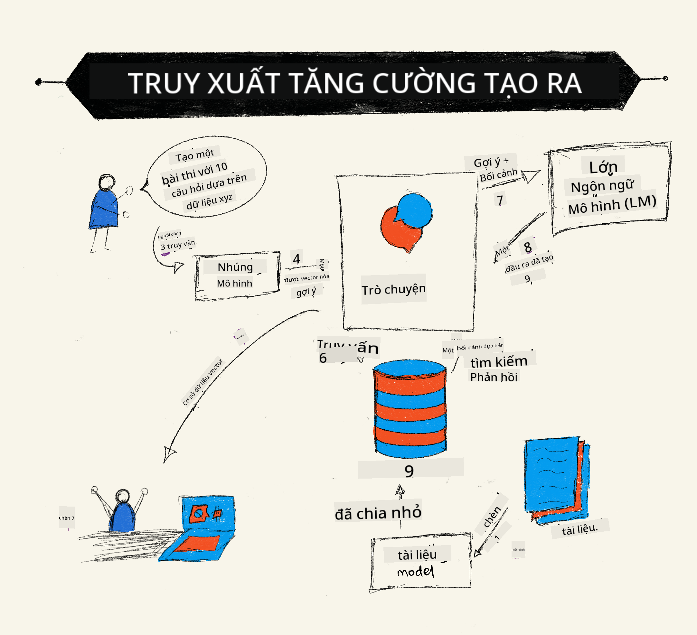
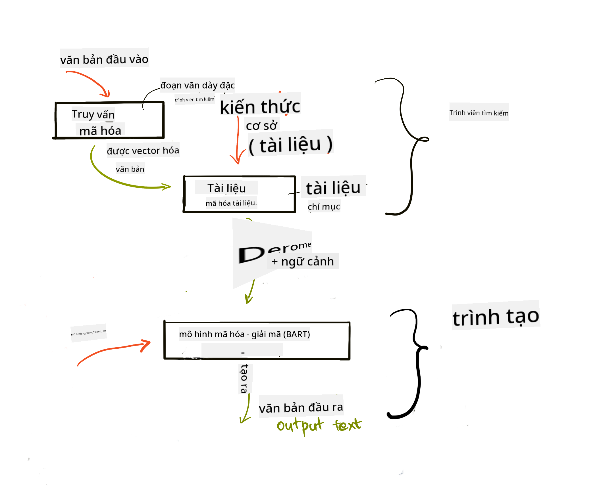
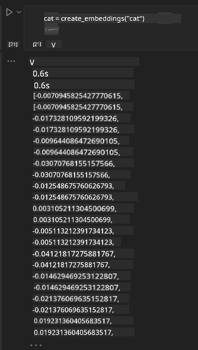

<!--
CO_OP_TRANSLATOR_METADATA:
{
  "original_hash": "e2861bbca91c0567ef32bc77fe054f9e",
  "translation_date": "2025-07-09T16:16:18+00:00",
  "source_file": "15-rag-and-vector-databases/README.md",
  "language_code": "vi"
}
-->
# Retrieval Augmented Generation (RAG) và Cơ sở dữ liệu Vector

[](https://aka.ms/gen-ai-lesson15-gh?WT.mc_id=academic-105485-koreyst)

Trong bài học về ứng dụng tìm kiếm, chúng ta đã tìm hiểu sơ lược cách tích hợp dữ liệu của riêng bạn vào các Mô hình Ngôn ngữ Lớn (LLMs). Trong bài học này, chúng ta sẽ đi sâu hơn vào khái niệm gắn dữ liệu của bạn vào ứng dụng LLM, cơ chế của quá trình này và các phương pháp lưu trữ dữ liệu, bao gồm cả embeddings và văn bản.

> **Video sẽ sớm ra mắt**

## Giới thiệu

Trong bài học này, chúng ta sẽ đề cập đến:

- Giới thiệu về RAG, nó là gì và tại sao nó được sử dụng trong AI (trí tuệ nhân tạo).

- Hiểu về cơ sở dữ liệu vector là gì và cách tạo một cơ sở dữ liệu cho ứng dụng của chúng ta.

- Ví dụ thực tế về cách tích hợp RAG vào một ứng dụng.

## Mục tiêu học tập

Sau khi hoàn thành bài học này, bạn sẽ có thể:

- Giải thích tầm quan trọng của RAG trong việc truy xuất và xử lý dữ liệu.

- Thiết lập ứng dụng RAG và gắn dữ liệu của bạn vào LLM.

- Tích hợp hiệu quả RAG và Cơ sở dữ liệu Vector trong các ứng dụng LLM.

## Kịch bản của chúng ta: nâng cao LLM với dữ liệu riêng

Trong bài học này, chúng ta muốn thêm các ghi chú của riêng mình vào startup giáo dục, giúp chatbot có thêm thông tin về các môn học khác nhau. Sử dụng các ghi chú này, người học sẽ có thể học tốt hơn và hiểu rõ các chủ đề, giúp việc ôn tập cho kỳ thi trở nên dễ dàng hơn. Để tạo kịch bản này, chúng ta sẽ sử dụng:

- `Azure OpenAI:` LLM mà chúng ta sẽ dùng để tạo chatbot

- `Bài học AI cho người mới bắt đầu về Mạng Neural:` đây sẽ là dữ liệu để gắn vào LLM của chúng ta

- `Azure AI Search` và `Azure Cosmos DB:` cơ sở dữ liệu vector để lưu trữ dữ liệu và tạo chỉ mục tìm kiếm

Người dùng sẽ có thể tạo các bài kiểm tra thực hành từ ghi chú, thẻ ôn tập và tóm tắt thành các bản tổng quan ngắn gọn. Để bắt đầu, hãy cùng tìm hiểu RAG là gì và cách nó hoạt động:

## Retrieval Augmented Generation (RAG)

Chatbot được hỗ trợ bởi LLM xử lý các câu hỏi của người dùng để tạo ra câu trả lời. Nó được thiết kế để tương tác và trao đổi với người dùng về nhiều chủ đề khác nhau. Tuy nhiên, câu trả lời của nó bị giới hạn trong ngữ cảnh được cung cấp và dữ liệu đào tạo nền tảng. Ví dụ, GPT-4 có kiến thức cập nhật đến tháng 9 năm 2021, nghĩa là nó không biết về các sự kiện xảy ra sau thời điểm đó. Thêm vào đó, dữ liệu dùng để đào tạo LLM không bao gồm thông tin bí mật như ghi chú cá nhân hay hướng dẫn sản phẩm của công ty.

### Cách hoạt động của RAG (Retrieval Augmented Generation)



Giả sử bạn muốn triển khai một chatbot tạo bài kiểm tra từ ghi chú của bạn, bạn sẽ cần kết nối với cơ sở tri thức. Đây chính là lúc RAG phát huy tác dụng. RAG hoạt động như sau:

- **Cơ sở tri thức:** Trước khi truy xuất, các tài liệu này cần được nhập và xử lý trước, thường là chia nhỏ các tài liệu lớn thành các phần nhỏ hơn, chuyển đổi chúng thành embeddings văn bản và lưu trữ trong cơ sở dữ liệu.

- **Truy vấn người dùng:** người dùng đặt câu hỏi

- **Truy xuất:** Khi người dùng hỏi, mô hình embedding sẽ truy xuất thông tin liên quan từ cơ sở tri thức để cung cấp thêm ngữ cảnh, được tích hợp vào prompt.

- **Tạo câu trả lời nâng cao:** LLM cải thiện câu trả lời dựa trên dữ liệu được truy xuất. Điều này cho phép câu trả lời không chỉ dựa trên dữ liệu đã được đào tạo mà còn dựa trên thông tin liên quan từ ngữ cảnh bổ sung. Dữ liệu truy xuất được dùng để tăng cường câu trả lời của LLM. Sau đó, LLM trả lời câu hỏi của người dùng.



Kiến trúc của RAG được triển khai bằng transformer gồm hai phần: encoder và decoder. Ví dụ, khi người dùng đặt câu hỏi, văn bản đầu vào được 'mã hóa' thành các vector thể hiện ý nghĩa của từ, sau đó các vector này được 'giải mã' vào chỉ mục tài liệu và tạo ra văn bản mới dựa trên truy vấn của người dùng. LLM sử dụng mô hình encoder-decoder để tạo ra kết quả.

Có hai cách tiếp cận khi triển khai RAG theo bài báo đề xuất: [Retrieval-Augmented Generation for Knowledge intensive NLP Tasks](https://arxiv.org/pdf/2005.11401.pdf?WT.mc_id=academic-105485-koreyst):

- **_RAG-Sequence_** sử dụng tài liệu truy xuất để dự đoán câu trả lời tốt nhất cho truy vấn người dùng

- **RAG-Token** sử dụng tài liệu để tạo token tiếp theo, sau đó truy xuất chúng để trả lời câu hỏi của người dùng

### Tại sao bạn nên dùng RAG?

- **Đa dạng thông tin:** đảm bảo câu trả lời văn bản luôn cập nhật và chính xác. Do đó, nó nâng cao hiệu suất trong các nhiệm vụ chuyên ngành bằng cách truy cập cơ sở tri thức nội bộ.

- Giảm thiểu thông tin sai lệch bằng cách sử dụng **dữ liệu có thể kiểm chứng** trong cơ sở tri thức để cung cấp ngữ cảnh cho câu hỏi của người dùng.

- **Tiết kiệm chi phí** vì nó kinh tế hơn so với việc tinh chỉnh lại LLM.

## Tạo cơ sở tri thức

Ứng dụng của chúng ta dựa trên dữ liệu cá nhân, cụ thể là bài học về Mạng Neural trong chương trình AI cho người mới bắt đầu.

### Cơ sở dữ liệu Vector

Cơ sở dữ liệu vector, khác với cơ sở dữ liệu truyền thống, là một loại cơ sở dữ liệu chuyên biệt để lưu trữ, quản lý và tìm kiếm các vector nhúng. Nó lưu trữ các biểu diễn số của tài liệu. Việc chuyển dữ liệu thành embeddings số giúp hệ thống AI dễ dàng hiểu và xử lý dữ liệu hơn.

Chúng ta lưu embeddings trong cơ sở dữ liệu vector vì LLM có giới hạn số token đầu vào. Vì không thể truyền toàn bộ embeddings vào LLM, chúng ta cần chia nhỏ chúng thành các phần, và khi người dùng hỏi, các embeddings phù hợp nhất sẽ được trả về cùng với prompt. Việc chia nhỏ cũng giúp giảm chi phí dựa trên số token truyền qua LLM.

Một số cơ sở dữ liệu vector phổ biến gồm Azure Cosmos DB, Clarifyai, Pinecone, Chromadb, ScaNN, Qdrant và DeepLake. Bạn có thể tạo mô hình Azure Cosmos DB bằng Azure CLI với lệnh sau:

```bash
az login
az group create -n <resource-group-name> -l <location>
az cosmosdb create -n <cosmos-db-name> -r <resource-group-name>
az cosmosdb list-keys -n <cosmos-db-name> -g <resource-group-name>
```

### Từ văn bản đến embeddings

Trước khi lưu trữ dữ liệu, chúng ta cần chuyển đổi nó thành embeddings vector. Nếu bạn làm việc với tài liệu lớn hoặc văn bản dài, bạn có thể chia nhỏ dựa trên các truy vấn dự kiến. Việc chia nhỏ có thể thực hiện ở cấp câu hoặc đoạn văn. Vì việc chia nhỏ dựa trên ý nghĩa của các từ xung quanh, bạn có thể thêm một số ngữ cảnh khác vào phần chia nhỏ, ví dụ như thêm tiêu đề tài liệu hoặc một số văn bản trước hoặc sau phần đó. Bạn có thể chia nhỏ dữ liệu như sau:

```python
def split_text(text, max_length, min_length):
    words = text.split()
    chunks = []
    current_chunk = []

    for word in words:
        current_chunk.append(word)
        if len(' '.join(current_chunk)) < max_length and len(' '.join(current_chunk)) > min_length:
            chunks.append(' '.join(current_chunk))
            current_chunk = []

    # If the last chunk didn't reach the minimum length, add it anyway
    if current_chunk:
        chunks.append(' '.join(current_chunk))

    return chunks
```

Sau khi chia nhỏ, chúng ta có thể nhúng văn bản bằng các mô hình embedding khác nhau. Một số mô hình bạn có thể dùng gồm: word2vec, ada-002 của OpenAI, Azure Computer Vision và nhiều hơn nữa. Việc chọn mô hình phụ thuộc vào ngôn ngữ bạn sử dụng, loại nội dung mã hóa (văn bản/hình ảnh/âm thanh), kích thước đầu vào có thể mã hóa và độ dài đầu ra embedding.

Ví dụ về văn bản được nhúng bằng mô hình `text-embedding-ada-002` của OpenAI là:


## Truy xuất và Tìm kiếm Vector

Khi người dùng đặt câu hỏi, bộ truy xuất sẽ chuyển đổi câu hỏi thành vector bằng bộ mã hóa truy vấn, sau đó tìm kiếm trong chỉ mục tài liệu các vector liên quan đến đầu vào. Khi hoàn thành, nó chuyển đổi cả vector đầu vào và vector tài liệu thành văn bản và truyền qua LLM.

### Truy xuất

Truy xuất xảy ra khi hệ thống cố gắng nhanh chóng tìm các tài liệu trong chỉ mục thỏa mãn tiêu chí tìm kiếm. Mục tiêu của bộ truy xuất là lấy các tài liệu sẽ được dùng để cung cấp ngữ cảnh và gắn LLM vào dữ liệu của bạn.

Có nhiều cách để tìm kiếm trong cơ sở dữ liệu như:

- **Tìm kiếm theo từ khóa** - dùng cho tìm kiếm văn bản

- **Tìm kiếm ngữ nghĩa** - sử dụng ý nghĩa ngữ cảnh của từ

- **Tìm kiếm vector** - chuyển tài liệu từ văn bản sang biểu diễn vector bằng mô hình embedding. Truy xuất sẽ dựa trên việc truy vấn các tài liệu có vector gần nhất với câu hỏi người dùng.

- **Kết hợp** - kết hợp cả tìm kiếm theo từ khóa và vector.

Một thách thức khi truy xuất là khi không có câu trả lời tương tự trong cơ sở dữ liệu, hệ thống sẽ trả về thông tin tốt nhất có thể, tuy nhiên bạn có thể dùng các chiến thuật như thiết lập khoảng cách tối đa cho độ liên quan hoặc dùng tìm kiếm kết hợp cả từ khóa và vector. Trong bài học này, chúng ta sẽ dùng tìm kiếm kết hợp, kết hợp cả vector và từ khóa. Dữ liệu sẽ được lưu trong dataframe với các cột chứa phần chia nhỏ cũng như embeddings.

### Độ tương đồng vector

Bộ truy xuất sẽ tìm kiếm trong cơ sở tri thức các embeddings gần nhau nhất, gọi là láng giềng gần nhất, vì chúng là các văn bản tương tự. Trong kịch bản, khi người dùng đặt câu hỏi, câu hỏi được nhúng rồi so khớp với các embeddings tương tự. Phương pháp phổ biến để đo độ tương đồng giữa các vector là cosine similarity dựa trên góc giữa hai vector.

Chúng ta cũng có thể đo độ tương đồng bằng các phương pháp khác như khoảng cách Euclidean (đường thẳng giữa hai điểm vector) và tích vô hướng (dot product) đo tổng tích các phần tử tương ứng của hai vector.

### Chỉ mục tìm kiếm

Khi thực hiện truy xuất, chúng ta cần xây dựng chỉ mục tìm kiếm cho cơ sở tri thức trước khi tìm kiếm. Chỉ mục sẽ lưu embeddings và có thể nhanh chóng truy xuất các phần chia nhỏ tương tự nhất ngay cả trong cơ sở dữ liệu lớn. Chúng ta có thể tạo chỉ mục cục bộ bằng:

```python
from sklearn.neighbors import NearestNeighbors

embeddings = flattened_df['embeddings'].to_list()

# Create the search index
nbrs = NearestNeighbors(n_neighbors=5, algorithm='ball_tree').fit(embeddings)

# To query the index, you can use the kneighbors method
distances, indices = nbrs.kneighbors(embeddings)
```

### Sắp xếp lại kết quả

Sau khi truy vấn cơ sở dữ liệu, bạn có thể cần sắp xếp kết quả theo mức độ liên quan. Một LLM sắp xếp lại sử dụng Machine Learning để cải thiện độ liên quan của kết quả tìm kiếm bằng cách xếp chúng theo thứ tự từ liên quan nhất. Sử dụng Azure AI Search, việc sắp xếp lại được thực hiện tự động bằng bộ sắp xếp ngữ nghĩa. Ví dụ về cách sắp xếp lại sử dụng láng giềng gần nhất:

```python
# Find the most similar documents
distances, indices = nbrs.kneighbors([query_vector])

index = []
# Print the most similar documents
for i in range(3):
    index = indices[0][i]
    for index in indices[0]:
        print(flattened_df['chunks'].iloc[index])
        print(flattened_df['path'].iloc[index])
        print(flattened_df['distances'].iloc[index])
    else:
        print(f"Index {index} not found in DataFrame")
```

## Kết hợp tất cả lại

Bước cuối cùng là thêm LLM vào để có thể nhận được câu trả lời dựa trên dữ liệu của chúng ta. Chúng ta có thể triển khai như sau:

```python
user_input = "what is a perceptron?"

def chatbot(user_input):
    # Convert the question to a query vector
    query_vector = create_embeddings(user_input)

    # Find the most similar documents
    distances, indices = nbrs.kneighbors([query_vector])

    # add documents to query  to provide context
    history = []
    for index in indices[0]:
        history.append(flattened_df['chunks'].iloc[index])

    # combine the history and the user input
    history.append(user_input)

    # create a message object
    messages=[
        {"role": "system", "content": "You are an AI assistant that helps with AI questions."},
        {"role": "user", "content": history[-1]}
    ]

    # use chat completion to generate a response
    response = openai.chat.completions.create(
        model="gpt-4",
        temperature=0.7,
        max_tokens=800,
        messages=messages
    )

    return response.choices[0].message

chatbot(user_input)
```

## Đánh giá ứng dụng

### Các chỉ số đánh giá

- Chất lượng câu trả lời đảm bảo tự nhiên, trôi chảy và giống con người

- Tính gắn kết dữ liệu: đánh giá câu trả lời có dựa trên tài liệu cung cấp hay không

- Tính liên quan: đánh giá câu trả lời phù hợp và liên quan đến câu hỏi

- Tính trôi chảy - câu trả lời có hợp lý về ngữ pháp hay không

## Các trường hợp sử dụng RAG và cơ sở dữ liệu vector

Có nhiều trường hợp sử dụng khác nhau mà function calls có thể cải thiện ứng dụng của bạn như:

- Hỏi đáp: gắn dữ liệu công ty vào chatbot để nhân viên có thể đặt câu hỏi.

- Hệ thống đề xuất: tạo hệ thống khớp các giá trị tương tự nhất ví dụ như phim, nhà hàng và nhiều hơn nữa.

- Dịch vụ chatbot: lưu lịch sử trò chuyện và cá nhân hóa cuộc hội thoại dựa trên dữ liệu người dùng.

- Tìm kiếm hình ảnh dựa trên embeddings vector, hữu ích trong nhận dạng hình ảnh và phát hiện bất thường.

## Tóm tắt

Chúng ta đã bao quát các khía cạnh cơ bản của RAG từ việc thêm dữ liệu vào ứng dụng, truy vấn người dùng đến kết quả đầu ra. Để đơn giản hóa việc tạo RAG, bạn có thể sử dụng các framework như Semantic Kernel, Langchain hoặc Autogen.

## Bài tập

Để tiếp tục học về Retrieval Augmented Generation (RAG), bạn có thể xây dựng:

- Tạo giao diện front-end cho ứng dụng bằng framework bạn chọn

- Sử dụng một framework, LangChain hoặc Semantic Kernel, và tái tạo ứng dụng của bạn.

Chúc mừng bạn đã hoàn thành bài học 👏.

## Học tập không dừng lại ở đây, hãy tiếp tục hành trình

Sau khi hoàn thành bài học này, hãy khám phá bộ sưu tập [Generative AI Learning collection](https://aka.ms/genai-collection?WT.mc_id=academic-105485-koreyst) để tiếp tục nâng cao kiến thức về Generative AI!

**Tuyên bố từ chối trách nhiệm**:  
Tài liệu này đã được dịch bằng dịch vụ dịch thuật AI [Co-op Translator](https://github.com/Azure/co-op-translator). Mặc dù chúng tôi cố gắng đảm bảo độ chính xác, xin lưu ý rằng các bản dịch tự động có thể chứa lỗi hoặc không chính xác. Tài liệu gốc bằng ngôn ngữ gốc của nó nên được coi là nguồn chính xác và đáng tin cậy. Đối với các thông tin quan trọng, nên sử dụng dịch vụ dịch thuật chuyên nghiệp do con người thực hiện. Chúng tôi không chịu trách nhiệm về bất kỳ sự hiểu lầm hoặc giải thích sai nào phát sinh từ việc sử dụng bản dịch này.