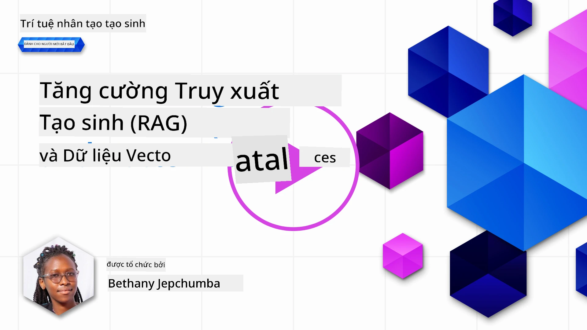
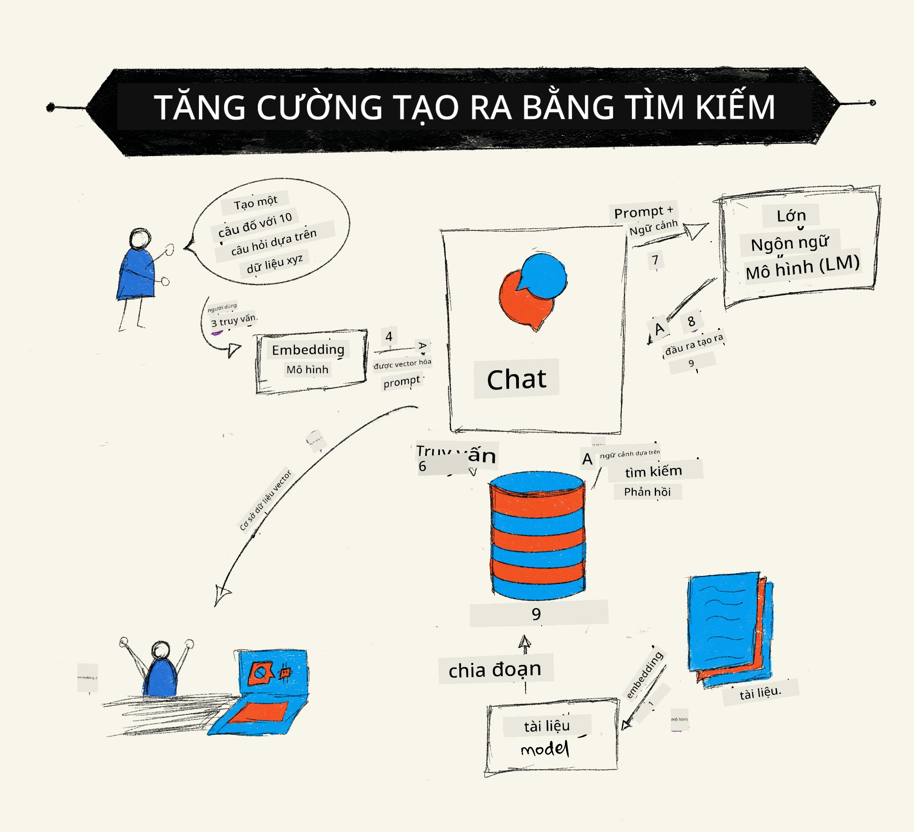
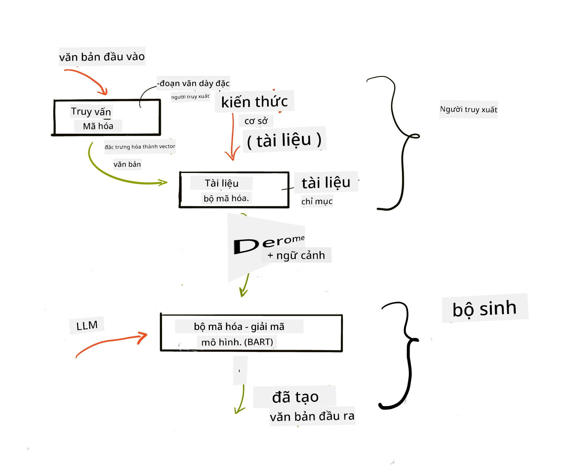
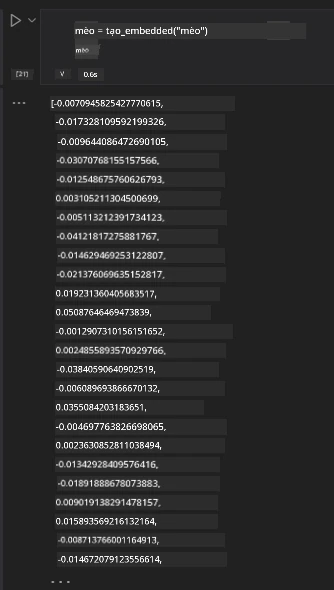

# Tạo sinh tăng cường truy xuất (RAG) và cơ sở dữ liệu vector

[](https://youtu.be/4l8zhHUBeyI?si=BmvDmL1fnHtgQYkL)

Trong bài học ứng dụng tìm kiếm, chúng ta đã học sơ lược cách tích hợp dữ liệu của riêng bạn vào Mô hình Ngôn ngữ Lớn (LLM). Trong bài học này, chúng ta sẽ đi sâu hơn vào các khái niệm về cách gắn dữ liệu vào ứng dụng LLM của bạn, cơ chế của quá trình và các phương pháp lưu trữ dữ liệu, bao gồm cả embeddings và văn bản.

> **Video sẽ sớm ra mắt**

## Giới thiệu

Trong bài học này, chúng ta sẽ bao gồm các nội dung sau:

- Giới thiệu về RAG, đó là gì và tại sao nó lại được sử dụng trong AI (trí tuệ nhân tạo).

- Hiểu về cơ sở dữ liệu vector là gì và cách tạo một cơ sở dữ liệu cho ứng dụng của chúng ta.

- Một ví dụ thực tế về cách tích hợp RAG vào ứng dụng.

## Mục tiêu học tập

Sau khi hoàn thành bài học này, bạn sẽ có thể:

- Giải thích tầm quan trọng của RAG trong việc truy xuất và xử lý dữ liệu.

- Thiết lập ứng dụng RAG và gắn dữ liệu của bạn vào LLM

- Tích hợp hiệu quả RAG và cơ sở dữ liệu vector trong các ứng dụng LLM.

## Kịch bản của chúng ta: nâng cao LLMs của chúng ta với dữ liệu riêng

Trong bài học này, chúng ta muốn thêm các ghi chú của riêng mình vào nền tảng giáo dục khởi nghiệp, cho phép chatbot nhận thêm thông tin về các chủ đề khác nhau. Sử dụng các ghi chú mà chúng ta có, người học sẽ có thể học tập tốt hơn và hiểu các chủ đề khác nhau, giúp việc ôn tập cho kỳ thi dễ dàng hơn. Để tạo kịch bản của mình, chúng ta sẽ sử dụng:

- `Azure OpenAI:` mô hình LLM mà chúng ta sẽ dùng để tạo chatbot

- `Bài học AI dành cho người mới về Mạng Nơ-ron nhân tạo`: đây sẽ là dữ liệu làm nền tảng cho LLM của chúng ta

- `Azure AI Search` và `Azure Cosmos DB:` cơ sở dữ liệu vector để lưu trữ dữ liệu và tạo chỉ mục tìm kiếm

Người dùng sẽ có thể tạo các bài kiểm tra luyện tập từ ghi chú của họ, thẻ ghi nhớ ôn tập và tóm tắt thành các cái nhìn tổng quan ngắn gọn. Để bắt đầu, hãy cùng xem RAG là gì và nó hoạt động như thế nào:

## Tạo sinh tăng cường truy xuất (RAG)

Một chatbot chạy trên LLM xử lý các yêu cầu của người dùng để tạo câu trả lời. Nó được thiết kế để tương tác và trò chuyện với người dùng về nhiều chủ đề khác nhau. Tuy nhiên, các câu trả lời của nó bị giới hạn trong ngữ cảnh được cung cấp và dữ liệu huấn luyện cơ bản. Ví dụ, GPT-4 có giới hạn kiến thức đến tháng 9 năm 2021, nghĩa là nó không biết về các sự kiện xảy ra sau thời điểm này. Thêm vào đó, dữ liệu dùng để huấn luyện LLM không bao gồm thông tin bí mật như ghi chú cá nhân hoặc sách hướng dẫn sản phẩm của công ty.

### Cách RAG (Tạo sinh tăng cường truy xuất) hoạt động



Giả sử bạn muốn triển khai một chatbot tạo bài kiểm tra từ các ghi chú, bạn sẽ cần một kết nối tới cơ sở tri thức. Đây chính là lúc RAG phát huy tác dụng. RAG hoạt động như sau:

- **Cơ sở tri thức:** Trước khi truy xuất, các tài liệu cần được nhập và xử lý trước, thường là phá nhỏ các tài liệu lớn thành các phần nhỏ hơn, chuyển đổi chúng thành các embedding văn bản và lưu trữ trong cơ sở dữ liệu.

- **Truy vấn của người dùng:** người dùng đặt câu hỏi

- **Truy xuất:** Khi người dùng hỏi, mô hình embedding sẽ truy xuất thông tin liên quan từ cơ sở tri thức để cung cấp thêm ngữ cảnh, được đưa vào prompt.

- **Tạo sinh tăng cường:** LLM cải thiện câu trả lời dựa trên dữ liệu truy xuất được. Điều này cho phép câu trả lời không chỉ dựa trên dữ liệu huấn luyện mà còn trên các thông tin liên quan từ ngữ cảnh thêm vào. Dữ liệu truy xuất được dùng để tăng cường câu trả lời LLM. Sau đó LLM trả lại câu trả lời cho câu hỏi của người dùng.



Kiến trúc của RAG được triển khai sử dụng bộ biến đổi bao gồm hai phần: mã hóa (encoder) và giải mã (decoder). Ví dụ, khi người dùng hỏi, văn bản đầu vào được ‘mã hóa’ thành các vector thể hiện ý nghĩa từ và các vector được ‘giải mã’ vào chỉ mục tài liệu của chúng ta và tạo ra văn bản mới dựa trên truy vấn người dùng. LLM sử dụng cả mô hình mã hóa-giải mã để tạo đầu ra.

Hai cách tiếp cận khi triển khai RAG theo bài báo đề xuất: [Retrieval-Augmented Generation for Knowledge intensive NLP (xử lý ngôn ngữ tự nhiên)](https://arxiv.org/pdf/2005.11401.pdf?WT.mc_id=academic-105485-koreyst) là:

- **_RAG-Sequence_** sử dụng tài liệu truy xuất để dự đoán câu trả lời tốt nhất cho truy vấn của người dùng

- **RAG-Token** sử dụng tài liệu để tạo token tiếp theo, rồi truy xuất chúng để trả lời câu hỏi người dùng

### Tại sao bạn nên dùng RAG? 

- **Giàu thông tin:** đảm bảo các câu trả lời văn bản luôn cập nhật và mới nhất. Do đó, nâng cao hiệu quả trong các tác vụ chuyên ngành bằng cách truy cập cơ sở tri thức nội bộ.

- Giảm thiểu việc bịa đặt thông tin bằng cách sử dụng **dữ liệu có thể kiểm chứng** trong cơ sở tri thức để cung cấp ngữ cảnh cho truy vấn người dùng.

- **Hiệu quả về chi phí** vì chúng tiết kiệm so với việc tinh chỉnh lại một LLM

## Tạo cơ sở tri thức

Ứng dụng của chúng ta dựa trên dữ liệu cá nhân, tức là bài học về Mạng Nơ-ron trong chương trình AI dành cho người mới.

### Cơ sở dữ liệu vector

Một cơ sở dữ liệu vector, khác với cơ sở dữ liệu truyền thống, là cơ sở dữ liệu chuyên biệt để lưu trữ, quản lý và tìm kiếm các vector nhúng. Nó lưu trữ các biểu diễn số của tài liệu. Việc chuyển dữ liệu thành các embedding số giúp hệ thống AI của chúng ta hiểu và xử lý dữ liệu dễ dàng hơn.

Chúng ta lưu trữ embedding vào cơ sở dữ liệu vector vì LLM có giới hạn số token mà nó chấp nhận làm đầu vào. Bạn không thể đưa toàn bộ embedding vào LLM, nên cần chia nhỏ chúng thành các phần (chunk) và khi người dùng hỏi, embedding phù hợp nhất với câu hỏi sẽ được trả về cùng với prompt. Việc chia nhỏ cũng giúp giảm chi phí về số token truyền qua LLM.

Một số cơ sở dữ liệu vector phổ biến gồm Azure Cosmos DB, Clarifyai, Pinecone, Chromadb, ScaNN, Qdrant và DeepLake. Bạn có thể tạo mô hình Azure Cosmos DB bằng Azure CLI với lệnh sau:

```bash
az login
az group create -n <resource-group-name> -l <location>
az cosmosdb create -n <cosmos-db-name> -r <resource-group-name>
az cosmosdb list-keys -n <cosmos-db-name> -g <resource-group-name>
```

### Từ văn bản sang embeddings

Trước khi lưu trữ dữ liệu, chúng ta cần chuyển đổi nó thành các vector embeddings trước khi lưu vào cơ sở dữ liệu. Nếu bạn làm việc với tài liệu lớn hoặc văn bản dài, bạn có thể chia nhỏ chúng dựa trên các truy vấn bạn mong đợi. Việc chia nhỏ có thể thực hiện ở mức câu hoặc đoạn văn. Vì việc chia nhỏ dựa trên ngữ nghĩa của các từ xung quanh, bạn có thể thêm một số ngữ cảnh cho mỗi phần, ví dụ, bằng cách thêm tiêu đề tài liệu hoặc bao gồm một số văn bản trước hoặc sau phần đó. Bạn có thể chia nhỏ dữ liệu như sau:

```python
def split_text(text, max_length, min_length):
    words = text.split()
    chunks = []
    current_chunk = []

    for word in words:
        current_chunk.append(word)
        if len(' '.join(current_chunk)) < max_length and len(' '.join(current_chunk)) > min_length:
            chunks.append(' '.join(current_chunk))
            current_chunk = []

    # Nếu phần cuối cùng không đạt đến chiều dài tối thiểu, vẫn thêm nó vào
    if current_chunk:
        chunks.append(' '.join(current_chunk))

    return chunks
```

Sau khi chia nhỏ, chúng ta có thể nhúng văn bản dùng các mô hình embedding khác nhau. Một số mô hình bạn có thể sử dụng gồm: word2vec, ada-002 của OpenAI, Azure Computer Vision và nhiều hơn nữa. Việc chọn mô hình phụ thuộc vào ngôn ngữ bạn sử dụng, loại nội dung mã hóa (văn bản/hình ảnh/âm thanh), kích thước đầu vào và độ dài đầu ra embedding.

Ví dụ embedding văn bản sử dụng mô hình `text-embedding-ada-002` của OpenAI là:


## Truy xuất và tìm kiếm vector

Khi người dùng hỏi, bộ truy xuất (retriever) biến đổi câu hỏi thành vector dùng bộ mã hóa truy vấn, rồi tìm kiếm qua chỉ mục tài liệu của chúng ta để tìm các vector liên quan trong tài liệu phù hợp với đầu vào. Khi xong, nó chuyển đổi cả vector đầu vào và vector tài liệu thành văn bản và truyền qua LLM.

### Truy xuất

Truy xuất xảy ra khi hệ thống cố gắng nhanh chóng tìm các tài liệu trong chỉ mục thỏa mãn tiêu chí tìm kiếm. Mục tiêu của bộ truy xuất là lấy về các tài liệu dùng để cung cấp ngữ cảnh và gắn LLM vào dữ liệu của bạn.

Có một số cách để thực hiện tìm kiếm trong cơ sở dữ liệu như:

- **Tìm kiếm theo từ khóa** - dùng cho tìm kiếm văn bản

- **Tìm kiếm vector** - chuyển văn bản thành biểu diễn vector dùng mô hình embedding, cho phép tìm kiếm **ngữ nghĩa** dựa trên ý nghĩa từ ngữ. Truy xuất sẽ thực hiện bằng cách truy vấn các tài liệu có vector biểu diễn gần nhất với câu hỏi của người dùng.

- **Kết hợp** - sự kết hợp của tìm kiếm theo từ khóa và vector.

Một thách thức khi truy xuất là khi không có câu trả lời tương tự trong cơ sở dữ liệu, hệ thống sẽ trả lại thông tin tốt nhất nó có thể tìm, tuy nhiên bạn có thể sử dụng các chiến thuật thiết lập khoảng cách tối đa cho sự liên quan hoặc dùng tìm kiếm kết hợp cả từ khóa và vector. Trong bài học này, chúng ta sẽ dùng tìm kiếm kết hợp, kết hợp cả tìm kiếm vector và từ khóa. Chúng ta sẽ lưu dữ liệu vào một dataframe với các cột chứa các phần chia nhỏ cùng embedding.

### Tương đồng vector

Bộ truy xuất sẽ tìm qua cơ sở tri thức các embedding gần nhau nhất, những láng giềng gần nhất, vì chúng là văn bản tương tự. Trong kịch bản khi người dùng hỏi, câu hỏi trước tiên được nhúng rồi so khớp với embedding tương tự. Thước đo phổ biến dùng để xác định độ tương tự giữa các vector là cosine similarity dựa trên góc giữa hai vector.

Chúng ta có thể đo độ tương tự bằng các cách khác như khoảng cách Euclidean (khoảng cách thẳng giữa hai điểm cuối vector) và tích vô hướng (dot product) đo tổng tích của các phần tử tương ứng trong hai vector.

### Chỉ mục tìm kiếm

Khi thực hiện truy xuất, chúng ta cần xây dựng một chỉ mục tìm kiếm cho cơ sở tri thức trước. Một chỉ mục sẽ lưu các embedding và có thể truy xuất nhanh các phần chia nhỏ tương tự nhất ngay cả trong cơ sở dữ liệu lớn. Chúng ta có thể tạo chỉ mục cục bộ bằng:

```python
from sklearn.neighbors import NearestNeighbors

embeddings = flattened_df['embeddings'].to_list()

# Tạo chỉ mục tìm kiếm
nbrs = NearestNeighbors(n_neighbors=5, algorithm='ball_tree').fit(embeddings)

# Để truy vấn chỉ mục, bạn có thể sử dụng phương thức kneighbors
distances, indices = nbrs.kneighbors(embeddings)
```

### Sắp xếp lại

Khi bạn đã truy vấn cơ sở dữ liệu, có thể bạn cần sắp xếp lại kết quả theo mức độ liên quan nhất. Một LLM sắp xếp lại sử dụng học máy để cải thiện mức độ liên quan của kết quả tìm kiếm bằng cách sắp xếp chúng từ liên quan nhất. Dùng Azure AI Search, sắp xếp lại được thực hiện tự động bằng bộ sắp xếp ngữ nghĩa. Ví dụ cách sắp xếp lại làm việc bằng các láng giềng gần nhất:

```python
# Tìm các tài liệu giống nhất
distances, indices = nbrs.kneighbors([query_vector])

index = []
# In các tài liệu giống nhất
for i in range(3):
    index = indices[0][i]
    for index in indices[0]:
        print(flattened_df['chunks'].iloc[index])
        print(flattened_df['path'].iloc[index])
        print(flattened_df['distances'].iloc[index])
    else:
        print(f"Index {index} not found in DataFrame")
```

## Tổng hợp tất cả

Bước cuối cùng là thêm LLM của chúng ta vào để có thể nhận câu trả lời dựa trên dữ liệu. Chúng ta có thể triển khai như sau:

```python
user_input = "what is a perceptron?"

def chatbot(user_input):
    # Chuyển câu hỏi thành một vector truy vấn
    query_vector = create_embeddings(user_input)

    # Tìm các tài liệu tương tự nhất
    distances, indices = nbrs.kneighbors([query_vector])

    # thêm tài liệu vào truy vấn để cung cấp ngữ cảnh
    history = []
    for index in indices[0]:
        history.append(flattened_df['chunks'].iloc[index])

    # kết hợp lịch sử và đầu vào của người dùng
    history.append(user_input)

    # tạo một đối tượng tin nhắn
    messages=[
        {"role": "system", "content": "You are an AI assistant that helps with AI questions."},
        {"role": "user", "content": "\n\n".join(history) }
    ]

    # sử dụng API Responses để tạo phản hồi
    response = client.responses.create(
        model="gpt-5-mini",
        max_output_tokens=800,
        input=messages,
        store=False,
    )

    return response.output_text

chatbot(user_input)
```

## Đánh giá ứng dụng của chúng ta

### Các thước đo đánh giá

- Chất lượng câu trả lời cung cấp đảm bảo nó nghe tự nhiên, trôi chảy và như người thật

- Sự gắn dữ liệu: đánh giá xem câu trả lời có xuất phát từ tài liệu cung cấp hay không

- Mức độ liên quan: đánh giá câu trả lời có phù hợp và liên quan đến câu hỏi đã đặt hay không

- Tính trôi chảy - xem câu trả lời có hợp lý về mặt ngữ pháp không

## Các trường hợp sử dụng RAG (Tạo sinh tăng cường truy xuất) và cơ sở dữ liệu vector

Có nhiều trường hợp sử dụng khác nhau mà các function call có thể cải thiện ứng dụng của bạn như:

- Hỏi và Đáp: gắn dữ liệu công ty của bạn vào một chat có thể dùng cho nhân viên đặt câu hỏi.

- Hệ thống gợi ý: bạn có thể tạo hệ thống khớp các giá trị tương tự nhất ví dụ phim ảnh, nhà hàng và nhiều thứ khác.

- Dịch vụ chatbot: bạn có thể lưu lịch sử chat và cá nhân hóa cuộc hội thoại dựa trên dữ liệu người dùng.

- Tìm kiếm hình ảnh dựa trên embedding vector, hữu dụng khi nhận dạng hình ảnh và phát hiện bất thường.

## Tóm tắt

Chúng ta đã bao phủ các lĩnh vực cơ bản của RAG từ việc thêm dữ liệu vào ứng dụng, truy vấn người dùng và đầu ra. Để đơn giản hóa việc tạo RAG, bạn có thể sử dụng các framework như Semantic Kernel, Langchain hoặc Autogen.

## Bài tập

Để tiếp tục học về Tạo sinh tăng cường truy xuất (RAG), bạn có thể xây dựng:

- Xây dựng front-end cho ứng dụng dùng framework bạn chọn

- Sử dụng một framework, LangChain hoặc Semantic Kernel, và tái tạo ứng dụng của bạn.

Chúc mừng bạn đã hoàn thành bài học 👏.

## Học tập không dừng lại ở đây, tiếp tục hành trình

Sau khi hoàn thành bài học này, hãy xem bộ sưu tập [Generative AI Learning collection](https://aka.ms/genai-collection?WT.mc_id=academic-105485-koreyst) để tiếp tục nâng cao kiến thức về Generative AI của bạn!

---

<!-- CO-OP TRANSLATOR DISCLAIMER START -->
**Tuyên bố miễn trừ trách nhiệm**:
Tài liệu này đã được dịch bằng dịch vụ dịch thuật AI [Co-op Translator](https://github.com/Azure/co-op-translator). Mặc dù chúng tôi cố gắng đảm bảo độ chính xác, xin lưu ý rằng bản dịch tự động có thể chứa lỗi hoặc sai sót. Tài liệu gốc bằng ngôn ngữ gốc nên được coi là nguồn tin chính thức. Đối với thông tin quan trọng, nên sử dụng dịch vụ dịch thuật chuyên nghiệp bởi con người. Chúng tôi không chịu trách nhiệm về bất kỳ hiểu lầm hoặc giải thích sai nào phát sinh từ việc sử dụng bản dịch này.
<!-- CO-OP TRANSLATOR DISCLAIMER END -->