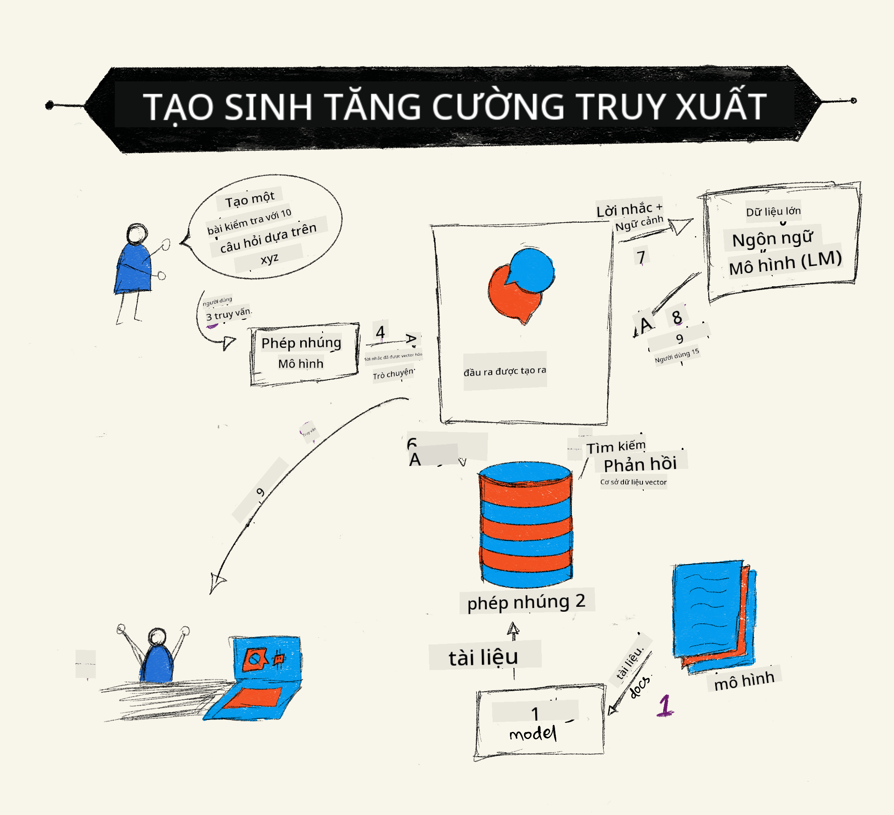

<!--
CO_OP_TRANSLATOR_METADATA:
{
  "original_hash": "b4b0266fbadbba7ded891b6485adc66d",
  "translation_date": "2025-10-17T20:34:13+00:00",
  "source_file": "15-rag-and-vector-databases/README.md",
  "language_code": "vi"
}
-->
# Tạo nội dung tăng cường truy xuất (RAG) và cơ sở dữ liệu vector

[](https://youtu.be/4l8zhHUBeyI?si=BmvDmL1fnHtgQYkL)

Trong bài học về ứng dụng tìm kiếm, chúng ta đã tìm hiểu sơ qua cách tích hợp dữ liệu của riêng bạn vào các mô hình ngôn ngữ lớn (LLMs). Trong bài học này, chúng ta sẽ đi sâu hơn vào các khái niệm về việc gắn kết dữ liệu của bạn vào ứng dụng LLM, cơ chế của quy trình và các phương pháp lưu trữ dữ liệu, bao gồm cả embeddings và văn bản.

> **Video sẽ sớm ra mắt**

## Giới thiệu

Trong bài học này, chúng ta sẽ đề cập đến các nội dung sau:

- Giới thiệu về RAG, nó là gì và tại sao nó được sử dụng trong AI (trí tuệ nhân tạo).

- Hiểu về cơ sở dữ liệu vector và tạo một cơ sở dữ liệu cho ứng dụng của chúng ta.

- Một ví dụ thực tế về cách tích hợp RAG vào một ứng dụng.

## Mục tiêu học tập

Sau khi hoàn thành bài học này, bạn sẽ có thể:

- Giải thích tầm quan trọng của RAG trong việc truy xuất và xử lý dữ liệu.

- Thiết lập ứng dụng RAG và gắn kết dữ liệu của bạn vào LLM.

- Tích hợp hiệu quả RAG và cơ sở dữ liệu vector vào các ứng dụng LLM.

## Kịch bản của chúng ta: nâng cao LLMs với dữ liệu của riêng chúng ta

Trong bài học này, chúng ta muốn thêm các ghi chú của mình vào startup giáo dục, cho phép chatbot có thêm thông tin về các chủ đề khác nhau. Sử dụng các ghi chú mà chúng ta có, người học sẽ có thể học tốt hơn và hiểu các chủ đề khác nhau, giúp việc ôn tập cho các kỳ thi trở nên dễ dàng hơn. Để tạo kịch bản của chúng ta, chúng ta sẽ sử dụng:

- `Azure OpenAI:` LLM mà chúng ta sẽ sử dụng để tạo chatbot.

- `Bài học dành cho người mới bắt đầu về Mạng Neural:` đây sẽ là dữ liệu mà chúng ta gắn kết LLM của mình.

- `Azure AI Search` và `Azure Cosmos DB:` cơ sở dữ liệu vector để lưu trữ dữ liệu của chúng ta và tạo một chỉ mục tìm kiếm.

Người dùng sẽ có thể tạo các bài kiểm tra thực hành từ ghi chú của họ, thẻ ôn tập và tóm tắt thành các bản tổng quan ngắn gọn. Để bắt đầu, hãy cùng tìm hiểu RAG là gì và cách nó hoạt động:

## Tạo nội dung tăng cường truy xuất (RAG)

Một chatbot được hỗ trợ bởi LLM xử lý các yêu cầu của người dùng để tạo ra các phản hồi. Nó được thiết kế để tương tác và giao tiếp với người dùng về nhiều chủ đề khác nhau. Tuy nhiên, các phản hồi của nó bị giới hạn bởi ngữ cảnh được cung cấp và dữ liệu đào tạo cơ bản của nó. Ví dụ, GPT-4 có giới hạn kiến thức đến tháng 9 năm 2021, nghĩa là nó không có kiến thức về các sự kiện xảy ra sau thời điểm này. Ngoài ra, dữ liệu được sử dụng để đào tạo LLMs không bao gồm thông tin bảo mật như ghi chú cá nhân hoặc hướng dẫn sản phẩm của một công ty.

### Cách RAGs (Tạo nội dung tăng cường truy xuất) hoạt động



Giả sử bạn muốn triển khai một chatbot tạo các bài kiểm tra từ ghi chú của bạn, bạn sẽ cần một kết nối đến cơ sở kiến thức. Đây là lúc RAG phát huy tác dụng. RAGs hoạt động như sau:

- **Cơ sở kiến thức:** Trước khi truy xuất, các tài liệu này cần được nhập và xử lý trước, thường là chia nhỏ các tài liệu lớn thành các phần nhỏ hơn, chuyển đổi chúng thành embeddings văn bản và lưu trữ chúng trong cơ sở dữ liệu.

- **Yêu cầu của người dùng:** người dùng đặt câu hỏi.

- **Truy xuất:** Khi người dùng đặt câu hỏi, mô hình embedding sẽ truy xuất thông tin liên quan từ cơ sở kiến thức của chúng ta để cung cấp thêm ngữ cảnh được tích hợp vào yêu cầu.

- **Tạo nội dung tăng cường:** LLM cải thiện phản hồi của nó dựa trên dữ liệu được truy xuất. Điều này cho phép phản hồi được tạo ra không chỉ dựa trên dữ liệu đã được đào tạo mà còn dựa trên thông tin liên quan từ ngữ cảnh được thêm vào. Dữ liệu được truy xuất được sử dụng để tăng cường các phản hồi của LLM. Sau đó, LLM trả lời câu hỏi của người dùng.


Kiến trúc của RAGs được triển khai bằng cách sử dụng transformers bao gồm hai phần: một encoder và một decoder. Ví dụ, khi người dùng đặt câu hỏi, văn bản đầu vào được 'mã hóa' thành các vector nắm bắt ý nghĩa của các từ và các vector này được 'giải mã' vào chỉ mục tài liệu của chúng ta và tạo ra văn bản mới dựa trên yêu cầu của người dùng. LLM sử dụng cả mô hình encoder-decoder để tạo ra đầu ra.

Hai cách tiếp cận khi triển khai RAG theo bài báo đề xuất: [Tạo nội dung tăng cường truy xuất cho các nhiệm vụ NLP (phần mềm xử lý ngôn ngữ tự nhiên) chuyên sâu về kiến thức](https://arxiv.org/pdf/2005.11401.pdf?WT.mc_id=academic-105485-koreyst) là:

- **_RAG-Sequence_** sử dụng các tài liệu được truy xuất để dự đoán câu trả lời tốt nhất có thể cho yêu cầu của người dùng.

- **RAG-Token** sử dụng các tài liệu để tạo token tiếp theo, sau đó truy xuất chúng để trả lời yêu cầu của người dùng.

### Tại sao bạn nên sử dụng RAGs?

- **Sự phong phú thông tin:** đảm bảo các phản hồi văn bản luôn cập nhật và hiện tại. Do đó, nó cải thiện hiệu suất trong các nhiệm vụ cụ thể của lĩnh vực bằng cách truy cập vào cơ sở kiến thức nội bộ.

- Giảm sự bịa đặt bằng cách sử dụng **dữ liệu có thể xác minh** trong cơ sở kiến thức để cung cấp ngữ cảnh cho các yêu cầu của người dùng.

- Nó **tiết kiệm chi phí** vì kinh tế hơn so với việc tinh chỉnh một LLM.

## Tạo cơ sở kiến thức

Ứng dụng của chúng ta dựa trên dữ liệu cá nhân của chúng ta, tức là bài học Mạng Neural trong chương trình giảng dạy AI For Beginners.

### Cơ sở dữ liệu vector

Cơ sở dữ liệu vector, không giống như cơ sở dữ liệu truyền thống, là một cơ sở dữ liệu chuyên biệt được thiết kế để lưu trữ, quản lý và tìm kiếm các vector nhúng. Nó lưu trữ các biểu diễn số của các tài liệu. Việc chia nhỏ dữ liệu thành các embeddings số giúp hệ thống AI của chúng ta dễ dàng hiểu và xử lý dữ liệu hơn.

Chúng ta lưu trữ các embeddings của mình trong cơ sở dữ liệu vector vì LLMs có giới hạn về số lượng token mà chúng chấp nhận làm đầu vào. Vì bạn không thể truyền toàn bộ embeddings vào một LLM, chúng ta sẽ cần chia nhỏ chúng thành các phần và khi người dùng đặt câu hỏi, các embeddings giống nhất với câu hỏi sẽ được trả về cùng với yêu cầu. Việc chia nhỏ cũng giảm chi phí về số lượng token được truyền qua một LLM.

Một số cơ sở dữ liệu vector phổ biến bao gồm Azure Cosmos DB, Clarifyai, Pinecone, Chromadb, ScaNN, Qdrant và DeepLake. Bạn có thể tạo một mô hình Azure Cosmos DB bằng Azure CLI với lệnh sau:

```bash
az login
az group create -n <resource-group-name> -l <location>
az cosmosdb create -n <cosmos-db-name> -r <resource-group-name>
az cosmosdb list-keys -n <cosmos-db-name> -g <resource-group-name>
```

### Từ văn bản đến embeddings

Trước khi lưu trữ dữ liệu của chúng ta, chúng ta sẽ cần chuyển đổi nó thành các embeddings vector trước khi lưu trữ trong cơ sở dữ liệu. Nếu bạn đang làm việc với các tài liệu lớn hoặc văn bản dài, bạn có thể chia nhỏ chúng dựa trên các yêu cầu mà bạn mong đợi. Việc chia nhỏ có thể được thực hiện ở mức câu hoặc đoạn văn. Vì việc chia nhỏ lấy ý nghĩa từ các từ xung quanh, bạn có thể thêm một số ngữ cảnh khác vào một phần, ví dụ, bằng cách thêm tiêu đề tài liệu hoặc bao gồm một số văn bản trước hoặc sau phần đó. Bạn có thể chia nhỏ dữ liệu như sau:

```python
def split_text(text, max_length, min_length):
    words = text.split()
    chunks = []
    current_chunk = []

    for word in words:
        current_chunk.append(word)
        if len(' '.join(current_chunk)) < max_length and len(' '.join(current_chunk)) > min_length:
            chunks.append(' '.join(current_chunk))
            current_chunk = []

    # If the last chunk didn't reach the minimum length, add it anyway
    if current_chunk:
        chunks.append(' '.join(current_chunk))

    return chunks
```

Sau khi chia nhỏ, chúng ta có thể nhúng văn bản của mình bằng các mô hình nhúng khác nhau. Một số mô hình bạn có thể sử dụng bao gồm: word2vec, ada-002 của OpenAI, Azure Computer Vision và nhiều hơn nữa. Việc chọn mô hình để sử dụng sẽ phụ thuộc vào ngôn ngữ bạn đang sử dụng, loại nội dung được mã hóa (văn bản/hình ảnh/âm thanh), kích thước đầu vào mà nó có thể mã hóa và độ dài của đầu ra embedding.

Một ví dụ về văn bản nhúng sử dụng mô hình `text-embedding-ada-002` của OpenAI là:


## Truy xuất và tìm kiếm vector

Khi người dùng đặt câu hỏi, trình truy xuất sẽ chuyển đổi câu hỏi thành một vector bằng cách sử dụng bộ mã hóa truy vấn, sau đó tìm kiếm qua chỉ mục tìm kiếm tài liệu của chúng ta để tìm các vector liên quan trong tài liệu có liên quan đến đầu vào. Sau khi hoàn tất, nó chuyển đổi cả vector đầu vào và vector tài liệu thành văn bản và truyền qua LLM.

### Truy xuất

Truy xuất xảy ra khi hệ thống cố gắng nhanh chóng tìm các tài liệu từ chỉ mục đáp ứng tiêu chí tìm kiếm. Mục tiêu của trình truy xuất là lấy các tài liệu sẽ được sử dụng để cung cấp ngữ cảnh và gắn kết LLM vào dữ liệu của bạn.

Có nhiều cách để thực hiện tìm kiếm trong cơ sở dữ liệu của chúng ta như:

- **Tìm kiếm từ khóa** - được sử dụng cho các tìm kiếm văn bản.

- **Tìm kiếm ngữ nghĩa** - sử dụng ý nghĩa ngữ nghĩa của các từ.

- **Tìm kiếm vector** - chuyển đổi các tài liệu từ văn bản thành các biểu diễn vector bằng cách sử dụng các mô hình nhúng. Truy xuất sẽ được thực hiện bằng cách truy vấn các tài liệu có biểu diễn vector gần nhất với câu hỏi của người dùng.

- **Kết hợp** - sự kết hợp giữa tìm kiếm từ khóa và tìm kiếm vector.

Một thách thức với việc truy xuất xảy ra khi không có phản hồi tương tự nào cho câu hỏi trong cơ sở dữ liệu, hệ thống sẽ trả về thông tin tốt nhất mà nó có thể tìm được, tuy nhiên, bạn có thể sử dụng các chiến thuật như thiết lập khoảng cách tối đa cho mức độ liên quan hoặc sử dụng tìm kiếm kết hợp kết hợp cả từ khóa và tìm kiếm vector. Trong bài học này, chúng ta sẽ sử dụng tìm kiếm kết hợp, sự kết hợp giữa tìm kiếm vector và từ khóa. Chúng ta sẽ lưu trữ dữ liệu của mình vào một dataframe với các cột chứa các phần cũng như các embeddings.

### Tương đồng vector

Trình truy xuất sẽ tìm kiếm qua cơ sở dữ liệu kiến thức để tìm các embeddings gần nhau nhất, các hàng xóm gần nhất, vì chúng là các văn bản tương tự. Trong trường hợp người dùng đặt câu hỏi, câu hỏi đầu tiên được nhúng sau đó được so khớp với các embeddings tương tự. Phép đo phổ biến được sử dụng để tìm mức độ tương đồng giữa các vector khác nhau là độ tương đồng cosine, dựa trên góc giữa hai vector.

Chúng ta có thể đo lường sự tương đồng bằng các phương pháp thay thế khác như khoảng cách Euclidean, là đường thẳng giữa các điểm cuối vector, và tích vô hướng, đo tổng của các sản phẩm của các phần tử tương ứng của hai vector.

### Chỉ mục tìm kiếm

Khi thực hiện truy xuất, chúng ta sẽ cần xây dựng một chỉ mục tìm kiếm cho cơ sở kiến thức của mình trước khi thực hiện tìm kiếm. Một chỉ mục sẽ lưu trữ các embeddings của chúng ta và có thể nhanh chóng truy xuất các phần tương tự nhất ngay cả trong một cơ sở dữ liệu lớn. Chúng ta có thể tạo chỉ mục của mình cục bộ bằng cách sử dụng:

```python
from sklearn.neighbors import NearestNeighbors

embeddings = flattened_df['embeddings'].to_list()

# Create the search index
nbrs = NearestNeighbors(n_neighbors=5, algorithm='ball_tree').fit(embeddings)

# To query the index, you can use the kneighbors method
distances, indices = nbrs.kneighbors(embeddings)
```

### Xếp hạng lại

Sau khi bạn đã truy vấn cơ sở dữ liệu, bạn có thể cần sắp xếp các kết quả từ mức độ liên quan nhất. Một LLM xếp hạng lại sử dụng Machine Learning để cải thiện mức độ liên quan của kết quả tìm kiếm bằng cách sắp xếp chúng từ mức độ liên quan nhất. Sử dụng Azure AI Search, việc xếp hạng lại được thực hiện tự động cho bạn bằng cách sử dụng một bộ xếp hạng ngữ nghĩa. Một ví dụ về cách xếp hạng lại hoạt động sử dụng hàng xóm gần nhất:

```python
# Find the most similar documents
distances, indices = nbrs.kneighbors([query_vector])

index = []
# Print the most similar documents
for i in range(3):
    index = indices[0][i]
    for index in indices[0]:
        print(flattened_df['chunks'].iloc[index])
        print(flattened_df['path'].iloc[index])
        print(flattened_df['distances'].iloc[index])
    else:
        print(f"Index {index} not found in DataFrame")
```

## Kết hợp tất cả lại với nhau

Bước cuối cùng là thêm LLM của chúng ta vào để có thể nhận được các phản hồi dựa trên dữ liệu của chúng ta. Chúng ta có thể triển khai nó như sau:

```python
user_input = "what is a perceptron?"

def chatbot(user_input):
    # Convert the question to a query vector
    query_vector = create_embeddings(user_input)

    # Find the most similar documents
    distances, indices = nbrs.kneighbors([query_vector])

    # add documents to query  to provide context
    history = []
    for index in indices[0]:
        history.append(flattened_df['chunks'].iloc[index])

    # combine the history and the user input
    history.append(user_input)

    # create a message object
    messages=[
        {"role": "system", "content": "You are an AI assistant that helps with AI questions."},
        {"role": "user", "content": history[-1]}
    ]

    # use chat completion to generate a response
    response = openai.chat.completions.create(
        model="gpt-4",
        temperature=0.7,
        max_tokens=800,
        messages=messages
    )

    return response.choices[0].message

chatbot(user_input)
```

## Đánh giá ứng dụng của chúng ta

### Các tiêu chí đánh giá

- Chất lượng của các phản hồi được cung cấp đảm bảo rằng nó nghe tự nhiên, trôi chảy và giống con người.

- Sự gắn kết của dữ liệu: đánh giá xem phản hồi có đến từ các tài liệu được cung cấp hay không.

- Mức độ liên quan: đánh giá xem phản hồi có phù hợp và liên quan đến câu hỏi được đặt hay không.

- Sự trôi chảy - liệu phản hồi có hợp lý về mặt ngữ pháp hay không.

## Các trường hợp sử dụng RAG (Tạo nội dung tăng cường truy xuất) và cơ sở dữ liệu vector

Có nhiều trường hợp sử dụng khác nhau mà các cuộc gọi hàm có thể cải thiện ứng dụng của bạn như:

- Hỏi và trả lời: gắn kết dữ liệu công ty của bạn vào một cuộc trò chuyện có thể được sử dụng bởi nhân viên để đặt câu hỏi.

- Hệ thống gợi ý: nơi bạn có thể tạo một hệ thống khớp các giá trị tương tự nhất, ví dụ: phim, nhà hàng và nhiều hơn nữa.

- Dịch vụ chatbot: bạn có thể lưu trữ lịch sử trò chuyện và cá nhân hóa cuộc trò chuyện dựa trên dữ liệu người dùng.

- Tìm kiếm hình ảnh dựa trên embeddings vector, hữu ích khi thực hiện nhận diện hình ảnh và phát hiện bất thường.

## Tóm tắt

Chúng ta đã đề cập đến các lĩnh vực cơ bản của RAG từ việc thêm dữ liệu của chúng ta vào ứng dụng, yêu cầu của người dùng và đầu ra. Để đơn giản hóa việc tạo RAG, bạn có thể sử dụng các framework như Semantic Kernel, Langchain hoặc Autogen.

## Bài tập

Để tiếp tục học về Tạo nội dung tăng cường truy xuất (RAG), bạn có thể:

- Xây dựng một giao diện người dùng cho ứng dụng bằng framework mà bạn chọn.

- Sử dụng một framework, LangChain hoặc Semantic Kernel, và tái tạo ứng dụng của bạn.

Chúc mừng bạn đã hoàn thành bài học 👏.

## Học tập không dừng lại ở đây, tiếp tục hành trình

Sau khi hoàn thành bài học này, hãy xem bộ sưu tập [Học tập AI tạo nội dung](https://aka.ms/genai-collection?WT.mc_id=academic-105485-koreyst) của chúng tôi để tiếp tục nâng cao kiến thức về AI tạo nội dung!

---

**Tuyên bố miễn trừ trách nhiệm**:  
Tài liệu này đã được dịch bằng dịch vụ dịch thuật AI [Co-op Translator](https://github.com/Azure/co-op-translator). Mặc dù chúng tôi cố gắng đảm bảo độ chính xác, xin lưu ý rằng các bản dịch tự động có thể chứa lỗi hoặc không chính xác. Tài liệu gốc bằng ngôn ngữ bản địa nên được coi là nguồn thông tin chính thức. Đối với thông tin quan trọng, nên sử dụng dịch vụ dịch thuật chuyên nghiệp bởi con người. Chúng tôi không chịu trách nhiệm cho bất kỳ sự hiểu lầm hoặc diễn giải sai nào phát sinh từ việc sử dụng bản dịch này.