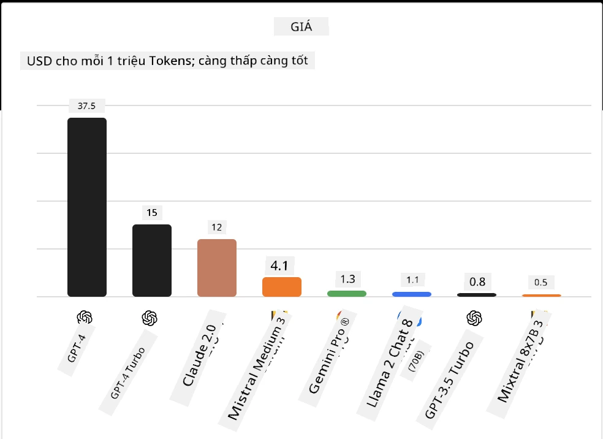
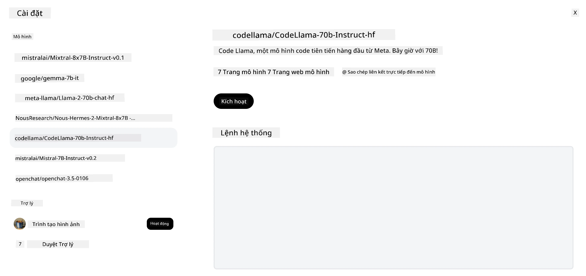

## Giới thiệu

Thế giới của các mô hình LLM mã nguồn mở rất thú vị và không ngừng phát triển. Bài học này nhằm cung cấp cái nhìn sâu sắc về các mô hình mã nguồn mở. Nếu bạn đang tìm kiếm thông tin về cách các mô hình độc quyền so sánh với các mô hình mã nguồn mở, hãy đến bài học ["Khám phá và So sánh Các LLM khác nhau"](../02-exploring-and-comparing-different-llms/README.md?WT.mc_id=academic-105485-koreyst). Bài học này cũng sẽ đề cập đến chủ đề tinh chỉnh (fine-tuning) nhưng giải thích chi tiết hơn có thể được tìm thấy trong bài học ["Tinh chỉnh LLM"](../18-fine-tuning/README.md?WT.mc_id=academic-105485-koreyst).

## Mục tiêu học tập

- Hiểu về các Mô hình mã nguồn mở
- Hiểu lợi ích của việc làm việc với các Mô hình mã nguồn mở
- Khám phá các mô hình mở có sẵn trên Hugging Face và Azure AI Studio

## Mô hình mã nguồn mở là gì?

Phần mềm mã nguồn mở đã đóng vai trò quan trọng trong sự phát triển của công nghệ trên nhiều lĩnh vực khác nhau. Tổ chức Open Source Initiative (OSI) đã định nghĩa [10 tiêu chí cho phần mềm](https://web.archive.org/web/20241126001143/https://opensource.org/osd?WT.mc_id=academic-105485-koreyst) để được phân loại là mã nguồn mở. Mã nguồn phải được chia sẻ công khai dưới một giấy phép được OSI phê duyệt.

Mặc dù việc phát triển LLM có các yếu tố tương tự như phát triển phần mềm, quá trình này không hoàn toàn giống nhau. Điều này đã tạo ra nhiều cuộc thảo luận trong cộng đồng về định nghĩa mã nguồn mở trong bối cảnh LLM. Để một mô hình phù hợp với định nghĩa truyền thống về mã nguồn mở, các thông tin sau nên được công khai:

- Bộ dữ liệu được sử dụng để huấn luyện mô hình.
- Trọng số mô hình đầy đủ như một phần của quá trình huấn luyện.
- Mã đánh giá.
- Mã tinh chỉnh.
- Trọng số mô hình đầy đủ và các chỉ số huấn luyện.

Hiện tại chỉ có một vài mô hình đáp ứng tiêu chí này. Mô hình [OLMo do Viện Allen về Trí tuệ Nhân tạo (AllenAI) tạo ra](https://huggingface.co/allenai/OLMo-7B?WT.mc_id=academic-105485-koreyst) là một trong những mô hình thuộc loại này.

Trong bài học này, chúng tôi sẽ gọi các mô hình là "mô hình mở" vì có thể chúng không hoàn toàn đáp ứng các tiêu chí trên tại thời điểm viết.

## Lợi ích của Mô hình Mở

**Dễ tùy chỉnh cao** - Vì các mô hình mở được phát hành kèm theo thông tin huấn luyện chi tiết, các nhà nghiên cứu và phát triển có thể chỉnh sửa bên trong mô hình. Điều này cho phép tạo ra các mô hình chuyên biệt cao được tinh chỉnh cho một nhiệm vụ hoặc lĩnh vực nghiên cứu cụ thể. Một số ví dụ bao gồm tạo mã, các phép toán toán học và sinh học.

**Chi phí** - Chi phí trên mỗi token khi sử dụng và triển khai các mô hình này thấp hơn so với các mô hình độc quyền. Khi xây dựng các ứng dụng AI tạo sinh, nên xem xét hiệu suất so với giá cả khi làm việc với các mô hình này cho trường hợp sử dụng của bạn.

Nguồn: Artificial Analysis

**Linh hoạt** - Làm việc với các mô hình mở cho phép bạn linh hoạt trong việc sử dụng các mô hình khác nhau hoặc kết hợp chúng. Một ví dụ là [HuggingChat Assistants](https://huggingface.co/chat?WT.mc_id=academic-105485-koreyst) nơi người dùng có thể chọn mô hình được sử dụng trực tiếp trong giao diện người dùng:

## Khám phá Các Mô hình Mở Khác nhau

### Llama 2

[LLama2](https://huggingface.co/meta-llama?WT.mc_id=academic-105485-koreyst), được phát triển bởi Meta, là một mô hình mở được tối ưu hóa cho các ứng dụng dựa trên chat. Điều này nhờ phương pháp tinh chỉnh của nó, bao gồm một lượng lớn đối thoại và phản hồi từ con người. Với phương pháp này, mô hình tạo ra kết quả phù hợp hơn với kỳ vọng của con người, mang lại trải nghiệm người dùng tốt hơn.

Một số ví dụ về các phiên bản tinh chỉnh của Llama bao gồm [Japanese Llama](https://huggingface.co/elyza/ELYZA-japanese-Llama-2-7b?WT.mc_id=academic-105485-koreyst), chuyên về tiếng Nhật và [Llama Pro](https://huggingface.co/TencentARC/LLaMA-Pro-8B?WT.mc_id=academic-105485-koreyst), phiên bản nâng cao của mô hình cơ bản.

### Mistral

[Mistral](https://huggingface.co/mistralai?WT.mc_id=academic-105485-koreyst) là một mô hình mở tập trung mạnh vào hiệu suất cao và hiệu quả. Nó sử dụng phương pháp Mixture-of-Experts kết hợp một nhóm các mô hình chuyên gia thành một hệ thống, trong đó tùy theo đầu vào, các mô hình nhất định được chọn để sử dụng. Điều này làm cho việc tính toán hiệu quả hơn vì các mô hình chỉ xử lý các đầu vào mà chúng chuyên môn.

Một số ví dụ về các phiên bản tinh chỉnh của Mistral bao gồm [BioMistral](https://huggingface.co/BioMistral/BioMistral-7B?text=Mon+nom+est+Thomas+et+mon+principal?WT.mc_id=academic-105485-koreyst), tập trung vào lĩnh vực y tế và [OpenMath Mistral](https://huggingface.co/nvidia/OpenMath-Mistral-7B-v0.1-hf?WT.mc_id=academic-105485-koreyst), thực hiện các phép toán toán học.

### Falcon

[Falcon](https://huggingface.co/tiiuae?WT.mc_id=academic-105485-koreyst) là một LLM được tạo ra bởi Viện Đổi mới Công nghệ (**TII**). Falcon-40B được huấn luyện trên 40 tỷ tham số và đã được chứng minh hoạt động tốt hơn GPT-3 với ngân sách tính toán thấp hơn. Điều này nhờ việc sử dụng thuật toán FlashAttention và multiquery attention giúp giảm yêu cầu bộ nhớ khi suy luận. Với thời gian suy luận giảm, Falcon-40B phù hợp cho các ứng dụng chat.

Một số ví dụ về các phiên bản tinh chỉnh của Falcon là [OpenAssistant](https://huggingface.co/OpenAssistant/falcon-40b-sft-top1-560?WT.mc_id=academic-105485-koreyst), một trợ lý được xây dựng trên các mô hình mở và [GPT4ALL](https://huggingface.co/nomic-ai/gpt4all-falcon?WT.mc_id=academic-105485-koreyst), cung cấp hiệu suất cao hơn mô hình cơ bản.

## Cách chọn lựa

Không có câu trả lời duy nhất cho việc chọn một mô hình mở. Một nơi tốt để bắt đầu là sử dụng tính năng lọc theo nhiệm vụ của Azure AI Studio. Điều này sẽ giúp bạn hiểu các loại nhiệm vụ mà mô hình đã được huấn luyện. Hugging Face cũng duy trì một Bảng xếp hạng LLM cho bạn thấy các mô hình có hiệu suất tốt nhất dựa trên các chỉ số nhất định.

Khi muốn so sánh các LLM theo các loại khác nhau, [Artificial Analysis](https://artificialanalysis.ai/?WT.mc_id=academic-105485-koreyst) là một nguồn tài nguyên tuyệt vời khác:

Nguồn: Artificial Analysis

Nếu làm việc trên một trường hợp sử dụng cụ thể, tìm kiếm các phiên bản tinh chỉnh tập trung vào cùng lĩnh vực có thể hiệu quả. Thử nghiệm với nhiều mô hình mở để xem chúng hoạt động như thế nào theo kỳ vọng của bạn và người dùng cũng là một thực hành tốt.

## Bước tiếp theo

Điều tuyệt vời nhất về các mô hình mở là bạn có thể bắt đầu làm việc với chúng khá nhanh chóng. Hãy xem [Azure AI Foundry Model Catalog](https://ai.azure.com?WT.mc_id=academic-105485-koreyst), nơi có bộ sưu tập Hugging Face cụ thể với các mô hình mà chúng ta đã thảo luận ở đây.

## Học tập không dừng lại ở đây, tiếp tục hành trình

Sau khi hoàn thành bài học này, hãy xem bộ sưu tập [Generative AI Learning](https://aka.ms/genai-collection?WT.mc_id=academic-105485-koreyst) của chúng tôi để tiếp tục nâng cao kiến thức về AI tạo sinh!

---

<!-- CO-OP TRANSLATOR DISCLAIMER START -->
**Tuyên bố từ chối trách nhiệm**:  
Tài liệu này đã được dịch bằng dịch vụ dịch thuật AI [Co-op Translator](https://github.com/Azure/co-op-translator). Mặc dù chúng tôi cố gắng đảm bảo độ chính xác, xin lưu ý rằng bản dịch tự động có thể chứa lỗi hoặc không chính xác. Tài liệu gốc bằng ngôn ngữ gốc của nó nên được coi là nguồn chính xác và đáng tin cậy. Đối với các thông tin quan trọng, nên sử dụng dịch vụ dịch thuật chuyên nghiệp do con người thực hiện. Chúng tôi không chịu trách nhiệm về bất kỳ sự hiểu lầm hoặc giải thích sai nào phát sinh từ việc sử dụng bản dịch này.
<!-- CO-OP TRANSLATOR DISCLAIMER END -->