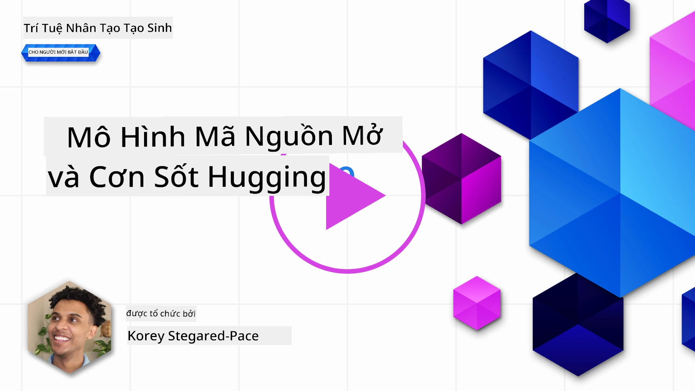
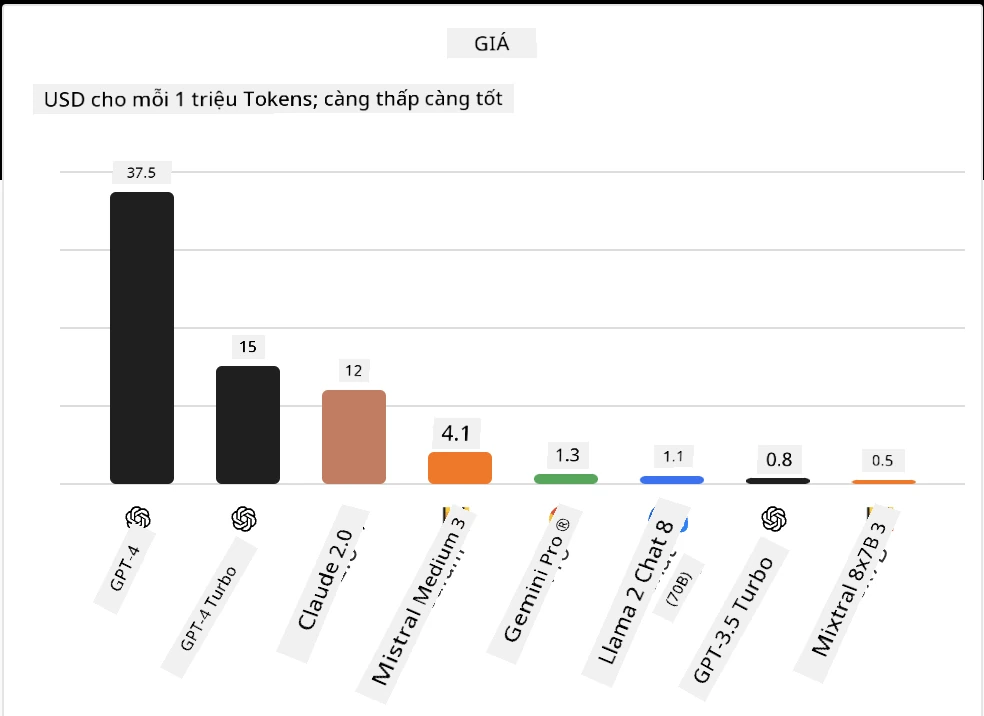
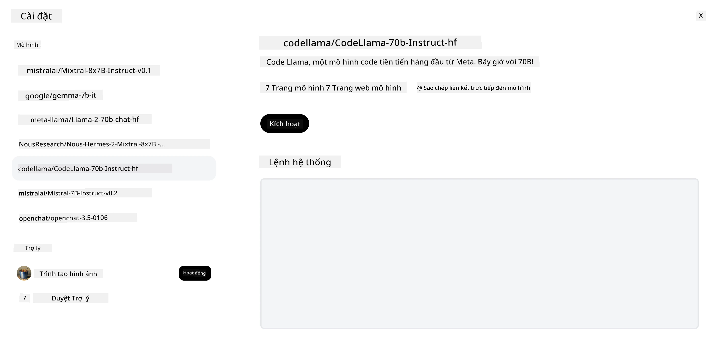

## Giới thiệu

Thế giới của các LLM mã nguồn mở rất thú vị và luôn phát triển liên tục. Bài học này nhằm cung cấp một cái nhìn sâu sắc về các mô hình mã nguồn mở. Nếu bạn đang tìm hiểu về cách các mô hình độc quyền so sánh với các mô hình mã nguồn mở, hãy truy cập bài học ["Khám phá và So sánh các LLM khác nhau"](../02-exploring-and-comparing-different-llms/README.md?WT.mc_id=academic-105485-koreyst). Bài học này cũng sẽ đề cập đến chủ đề tinh chỉnh (fine-tuning) nhưng bạn có thể tìm thấy lời giải thích chi tiết hơn trong bài học ["Tinh chỉnh LLM"](../18-fine-tuning/README.md?WT.mc_id=academic-105485-koreyst).

## Mục tiêu học tập

- Hiểu về các Mô hình mã nguồn mở
- Hiểu lợi ích khi làm việc với mô hình mã nguồn mở
- Khám phá các mô hình mở có trên Hugging Face và danh mục mô hình Microsoft Foundry

## Mô hình Mã nguồn Mở là gì?

Phần mềm mã nguồn mở đã đóng vai trò quan trọng trong sự phát triển của công nghệ ở nhiều lĩnh vực khác nhau. Sáng kiến Mã nguồn Mở (OSI) đã định nghĩa [10 tiêu chí cho phần mềm](https://web.archive.org/web/20241126001143/https://opensource.org/osd?WT.mc_id=academic-105485-koreyst) để được phân loại là mã nguồn mở. Mã nguồn phải được chia sẻ công khai theo giấy phép được OSI phê duyệt.

Mặc dù việc phát triển các LLM có các yếu tố tương tự như phát triển phần mềm, quá trình này không hoàn toàn giống nhau. Điều này đã gây ra nhiều tranh luận trong cộng đồng về định nghĩa mã nguồn mở trong bối cảnh LLM. Để một mô hình được coi là phù hợp với định nghĩa truyền thống về mã nguồn mở, các thông tin sau nên được công khai:

- Bộ dữ liệu được sử dụng để huấn luyện mô hình.
- Toàn bộ trọng số mô hình như một phần của quá trình huấn luyện.
- Mã đánh giá.
- Mã tinh chỉnh (fine-tuning).
- Toàn bộ trọng số mô hình và các chỉ số huấn luyện.

Hiện chỉ có một vài mô hình đáp ứng được tiêu chí này. Mô hình [OLMo do Viện Allen về Trí tuệ Nhân tạo (AllenAI) tạo ra](https://huggingface.co/allenai/OLMo-7B?WT.mc_id=academic-105485-koreyst) là một trong những mô hình thuộc loại này.

Trong bài học này, chúng tôi sẽ gọi các mô hình là "mô hình mở" vì chúng có thể chưa hoàn toàn đáp ứng đầy đủ các tiêu chí trên vào thời điểm viết.

## Lợi ích của Mô hình Mở

**Khả năng Tùy biến Cao** - Vì các mô hình mở được phát hành kèm theo thông tin huấn luyện chi tiết, các nhà nghiên cứu và phát triển có thể điều chỉnh bên trong mô hình. Điều này cho phép tạo ra các mô hình chuyên biệt cao được tinh chỉnh cho một nhiệm vụ hoặc lĩnh vực nghiên cứu cụ thể. Một số ví dụ bao gồm tạo mã, các phép toán toán học và sinh học.

**Chi phí** - Chi phí trên mỗi token khi sử dụng và triển khai các mô hình này thấp hơn so với các mô hình độc quyền. Khi xây dựng các ứng dụng AI Tạo sinh, bạn nên xem xét hiệu suất so với giá cả khi làm việc với các mô hình này cho trường hợp sử dụng của mình.

Nguồn: Artificial Analysis

**Tính linh hoạt** - Làm việc với các mô hình mở cho phép bạn linh hoạt trong việc sử dụng các mô hình khác nhau hoặc kết hợp chúng. Một ví dụ là [Trợ lý HuggingChat](https://huggingface.co/chat?WT.mc_id=academic-105485-koreyst) nơi người dùng có thể chọn mô hình được sử dụng trực tiếp trong giao diện người dùng:

## Khám phá Các Mô hình Mở Khác nhau

### Llama 2

[Llama2](https://huggingface.co/meta-llama?WT.mc_id=academic-105485-koreyst), do Meta phát triển, là một mô hình mở được tối ưu hóa cho các ứng dụng trò chuyện. Điều này là nhờ phương pháp tinh chỉnh của nó, bao gồm một lượng lớn hội thoại và phản hồi của con người. Với phương pháp này, mô hình cho ra kết quả phù hợp hơn với kỳ vọng của con người, mang lại trải nghiệm người dùng tốt hơn.

Một số ví dụ về các phiên bản tinh chỉnh của Llama bao gồm [Japanese Llama](https://huggingface.co/elyza/ELYZA-japanese-Llama-2-7b?WT.mc_id=academic-105485-koreyst), chuyên về tiếng Nhật và [Llama Pro](https://huggingface.co/TencentARC/LLaMA-Pro-8B?WT.mc_id=academic-105485-koreyst), là phiên bản nâng cao của mô hình gốc.

### Mistral

[Mistral](https://huggingface.co/mistralai?WT.mc_id=academic-105485-koreyst) là một mô hình mở tập trung mạnh vào hiệu suất cao và hiệu quả. Nó sử dụng phương pháp Mixture-of-Experts, kết hợp một nhóm các mô hình chuyên gia thành một hệ thống, tùy vào đầu vào mà các mô hình cụ thể sẽ được chọn để sử dụng. Điều này làm cho quá trình tính toán hiệu quả hơn vì các mô hình chỉ xử lý đầu vào mà chúng chuyên môn.

Một số ví dụ về các phiên bản tinh chỉnh của Mistral bao gồm [BioMistral](https://huggingface.co/BioMistral/BioMistral-7B?text=Mon+nom+est+Thomas+et+mon+principal?WT.mc_id=academic-105485-koreyst), tập trung vào lĩnh vực y học và [OpenMath Mistral](https://huggingface.co/nvidia/OpenMath-Mistral-7B-v0.1-hf?WT.mc_id=academic-105485-koreyst), thực hiện các phép tính toán học.

### Falcon

[Falcon](https://huggingface.co/tiiuae?WT.mc_id=academic-105485-koreyst) là một LLM được tạo bởi Viện Đổi mới Công nghệ (**TII**). Falcon-40B được huấn luyện trên 40 tỷ tham số và được chứng minh có hiệu suất cao hơn GPT-3 với ngân sách tính toán thấp hơn. Điều này là nhờ việc sử dụng thuật toán FlashAttention và cơ chế multiquery attention giúp giảm yêu cầu bộ nhớ khi suy luận. Với thời gian suy luận được rút ngắn, Falcon-40B phù hợp cho các ứng dụng trò chuyện.

Một số ví dụ về các phiên bản tinh chỉnh của Falcon gồm [OpenAssistant](https://huggingface.co/OpenAssistant/falcon-40b-sft-top1-560?WT.mc_id=academic-105485-koreyst), trợ lý được xây dựng dựa trên các mô hình mở và [GPT4ALL](https://huggingface.co/nomic-ai/gpt4all-falcon?WT.mc_id=academic-105485-koreyst), mang lại hiệu suất cao hơn so với mô hình gốc.

## Cách Chọn Lựa

Không có câu trả lời duy nhất cho việc chọn mô hình mở. Một nơi tốt để bắt đầu là sử dụng tính năng lọc theo nhiệm vụ trong danh mục mô hình Microsoft Foundry. Điều này sẽ giúp bạn hiểu được loại nhiệm vụ mà mô hình đã được huấn luyện. Hugging Face cũng duy trì bảng xếp hạng LLM, cho thấy các mô hình có hiệu suất tốt nhất dựa trên các chỉ số nhất định.

Khi muốn so sánh các LLM qua các loại khác nhau, [Artificial Analysis](https://artificialanalysis.ai/?WT.mc_id=academic-105485-koreyst) cũng là một tài nguyên tuyệt vời:

Nguồn: Artificial Analysis

Nếu làm việc trên một trường hợp sử dụng cụ thể, tìm kiếm các phiên bản tinh chỉnh tập trung vào lĩnh vực đó có thể hiệu quả. Thử nghiệm với nhiều mô hình mở để xem chúng hoạt động như thế nào theo kỳ vọng của bạn và người dùng cũng là một thực hành tốt.

## Bước Tiếp Theo

Phần tốt nhất của các mô hình mở là bạn có thể bắt đầu làm việc với chúng khá nhanh. Hãy xem danh mục mô hình Microsoft Foundry [Microsoft Foundry model catalog](https://ai.azure.com?WT.mc_id=academic-105485-koreyst), có một bộ sưu tập cụ thể trên Hugging Face với các mô hình chúng ta đã thảo luận ở đây.

## Việc học không dừng lại ở đây, tiếp tục Hành trình

Sau khi hoàn thành bài học này, hãy xem bộ sưu tập [Học tập AI Tạo sinh](https://aka.ms/genai-collection?WT.mc_id=academic-105485-koreyst) của chúng tôi để tiếp tục nâng cao kiến thức về AI Tạo sinh của bạn!

---

<!-- CO-OP TRANSLATOR DISCLAIMER START -->
**Tuyên bố miễn trừ trách nhiệm**:
Tài liệu này đã được dịch bằng dịch vụ dịch thuật AI [Co-op Translator](https://github.com/Azure/co-op-translator). Mặc dù chúng tôi cố gắng đảm bảo độ chính xác, xin lưu ý rằng bản dịch tự động có thể chứa lỗi hoặc sai sót. Tài liệu gốc bằng ngôn ngữ gốc nên được coi là nguồn tin chính thức. Đối với thông tin quan trọng, nên sử dụng dịch vụ dịch thuật chuyên nghiệp bởi con người. Chúng tôi không chịu trách nhiệm về bất kỳ hiểu lầm hoặc giải thích sai nào phát sinh từ việc sử dụng bản dịch này.
<!-- CO-OP TRANSLATOR DISCLAIMER END -->