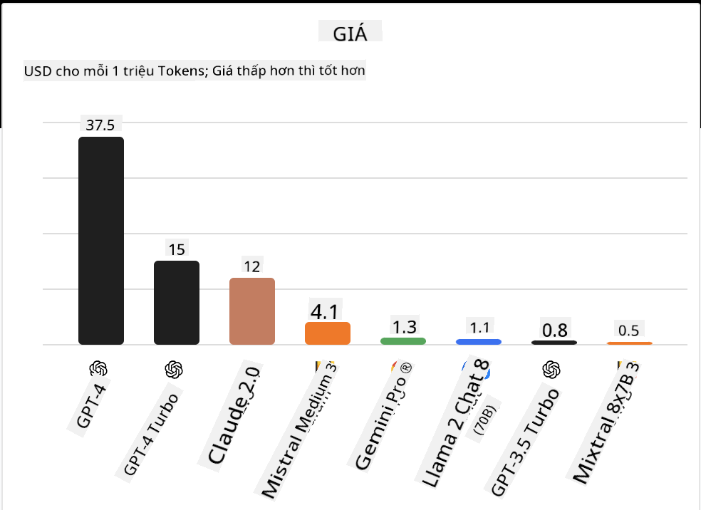
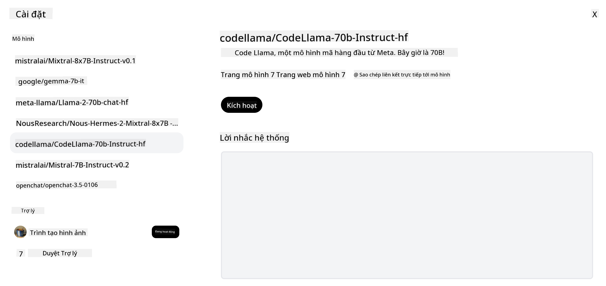
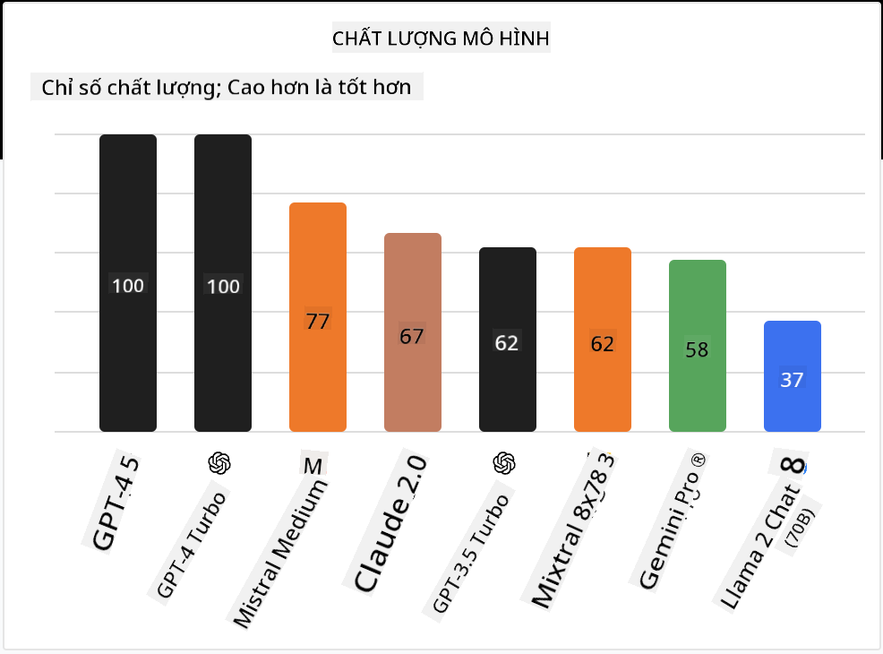

<!--
CO_OP_TRANSLATOR_METADATA:
{
  "original_hash": "0bba96e53ab841d99db731892a51fab8",
  "translation_date": "2025-06-26T00:00:11+00:00",
  "source_file": "16-open-source-models/README.md",
  "language_code": "vi"
}
-->

## Giới thiệu

Thế giới của các mô hình mã nguồn mở LLM rất thú vị và không ngừng phát triển. Bài học này nhằm cung cấp cái nhìn sâu sắc về các mô hình mã nguồn mở. Nếu bạn đang tìm kiếm thông tin về cách so sánh các mô hình độc quyền với các mô hình mã nguồn mở, hãy đến với bài học ["Khám phá và So sánh các LLM Khác nhau"](../02-exploring-and-comparing-different-llms/README.md?WT.mc_id=academic-105485-koreyst). Bài học này cũng sẽ đề cập đến chủ đề tinh chỉnh nhưng một giải thích chi tiết hơn có thể được tìm thấy trong bài học ["Tinh Chỉnh LLMs"](../18-fine-tuning/README.md?WT.mc_id=academic-105485-koreyst).

## Mục tiêu học tập

- Hiểu biết về các Mô hình Mã nguồn Mở
- Hiểu rõ lợi ích của việc làm việc với các Mô hình Mã nguồn Mở
- Khám phá các mô hình mở có sẵn trên Hugging Face và Azure AI Studio

## Mô hình Mã nguồn Mở là gì?

Phần mềm mã nguồn mở đã đóng vai trò quan trọng trong sự phát triển của công nghệ trên nhiều lĩnh vực khác nhau. Sáng kiến Mã nguồn Mở (OSI) đã định nghĩa [10 tiêu chí cho phần mềm](https://web.archive.org/web/20241126001143/https://opensource.org/osd?WT.mc_id=academic-105485-koreyst) để được phân loại là mã nguồn mở. Mã nguồn phải được chia sẻ công khai dưới giấy phép được OSI phê duyệt.

Trong khi phát triển LLMs có những yếu tố tương tự như phát triển phần mềm, quá trình này không hoàn toàn giống nhau. Điều này đã dẫn đến nhiều cuộc thảo luận trong cộng đồng về định nghĩa mã nguồn mở trong ngữ cảnh của LLMs. Để một mô hình phù hợp với định nghĩa truyền thống của mã nguồn mở, thông tin sau đây nên được công khai:

- Bộ dữ liệu được sử dụng để huấn luyện mô hình.
- Trọng số đầy đủ của mô hình như một phần của việc huấn luyện.
- Mã đánh giá.
- Mã tinh chỉnh.
- Trọng số đầy đủ của mô hình và các chỉ số huấn luyện.

Hiện tại chỉ có một vài mô hình đáp ứng tiêu chí này. [Mô hình OLMo do Viện Allen cho Trí tuệ Nhân tạo (AllenAI)](https://huggingface.co/allenai/OLMo-7B?WT.mc_id=academic-105485-koreyst) tạo ra là một trong số đó.

Trong bài học này, chúng ta sẽ gọi các mô hình là "mô hình mở" từ đây trở đi vì chúng có thể không đáp ứng tiêu chí trên tại thời điểm viết.

## Lợi ích của Mô hình Mở

**Tùy chỉnh cao** - Vì các mô hình mở được phát hành với thông tin huấn luyện chi tiết, các nhà nghiên cứu và nhà phát triển có thể sửa đổi các yếu tố bên trong của mô hình. Điều này cho phép tạo ra các mô hình chuyên biệt cao được tinh chỉnh cho một nhiệm vụ cụ thể hoặc lĩnh vực nghiên cứu. Một số ví dụ về điều này là tạo mã, các phép toán và sinh học.

**Chi phí** - Chi phí cho mỗi token khi sử dụng và triển khai các mô hình này thấp hơn so với các mô hình độc quyền. Khi xây dựng các ứng dụng AI tạo sinh, cần xem xét hiệu suất so với giá cả khi làm việc với các mô hình này cho trường hợp sử dụng của bạn.

 Nguồn: Phân tích Nhân tạo

**Linh hoạt** - Làm việc với các mô hình mở cho phép bạn linh hoạt trong việc sử dụng các mô hình khác nhau hoặc kết hợp chúng. Một ví dụ về điều này là [HuggingChat Assistants](https://huggingface.co/chat?WT.mc_id=academic-105485-koreyst) nơi người dùng có thể chọn mô hình đang được sử dụng trực tiếp trong giao diện người dùng:

## Khám phá Các Mô hình Mở Khác nhau

### Llama 2

[LLama2](https://huggingface.co/meta-llama?WT.mc_id=academic-105485-koreyst), được phát triển bởi Meta, là một mô hình mở được tối ưu hóa cho các ứng dụng dựa trên chat. Điều này là do phương pháp tinh chỉnh của nó, bao gồm một lượng lớn hội thoại và phản hồi từ con người. Với phương pháp này, mô hình tạo ra nhiều kết quả phù hợp với kỳ vọng của con người hơn, cung cấp trải nghiệm người dùng tốt hơn.

Một số ví dụ về các phiên bản tinh chỉnh của Llama bao gồm [Japanese Llama](https://huggingface.co/elyza/ELYZA-japanese-Llama-2-7b?WT.mc_id=academic-105485-koreyst), chuyên về tiếng Nhật và [Llama Pro](https://huggingface.co/TencentARC/LLaMA-Pro-8B?WT.mc_id=academic-105485-koreyst), là một phiên bản cải tiến của mô hình gốc.

### Mistral

[Mistral](https://huggingface.co/mistralai?WT.mc_id=academic-105485-koreyst) là một mô hình mở tập trung mạnh mẽ vào hiệu suất cao và hiệu quả. Nó sử dụng phương pháp Mixture-of-Experts, kết hợp một nhóm các mô hình chuyên gia chuyên biệt thành một hệ thống, nơi tùy thuộc vào đầu vào, các mô hình nhất định được chọn để sử dụng. Điều này làm cho việc tính toán hiệu quả hơn vì các mô hình chỉ xử lý các đầu vào mà chúng chuyên môn.

Một số ví dụ về các phiên bản tinh chỉnh của Mistral bao gồm [BioMistral](https://huggingface.co/BioMistral/BioMistral-7B?text=Mon+nom+est+Thomas+et+mon+principal?WT.mc_id=academic-105485-koreyst), tập trung vào lĩnh vực y tế và [OpenMath Mistral](https://huggingface.co/nvidia/OpenMath-Mistral-7B-v0.1-hf?WT.mc_id=academic-105485-koreyst), thực hiện các phép toán.

### Falcon

[Falcon](https://huggingface.co/tiiuae?WT.mc_id=academic-105485-koreyst) là một LLM được tạo ra bởi Viện Đổi mới Công nghệ (**TII**). Falcon-40B được huấn luyện trên 40 tỷ tham số, được chứng minh là hoạt động tốt hơn GPT-3 với ngân sách tính toán ít hơn. Điều này là do việc sử dụng thuật toán FlashAttention và sự chú ý đa truy vấn cho phép nó giảm yêu cầu bộ nhớ khi suy luận. Với thời gian suy luận giảm, Falcon-40B phù hợp cho các ứng dụng chat.

Một số ví dụ về các phiên bản tinh chỉnh của Falcon là [OpenAssistant](https://huggingface.co/OpenAssistant/falcon-40b-sft-top1-560?WT.mc_id=academic-105485-koreyst), một trợ lý được xây dựng trên các mô hình mở và [GPT4ALL](https://huggingface.co/nomic-ai/gpt4all-falcon?WT.mc_id=academic-105485-koreyst), cung cấp hiệu suất cao hơn so với mô hình gốc.

## Cách chọn

Không có một câu trả lời duy nhất cho việc chọn một mô hình mở. Một nơi tốt để bắt đầu là sử dụng tính năng lọc theo nhiệm vụ của Azure AI Studio. Điều này sẽ giúp bạn hiểu các loại nhiệm vụ mà mô hình đã được huấn luyện. Hugging Face cũng duy trì một Bảng xếp hạng LLM, cho bạn thấy các mô hình hoạt động tốt nhất dựa trên các chỉ số nhất định.

Khi muốn so sánh LLMs giữa các loại khác nhau, [Phân tích Nhân tạo](https://artificialanalysis.ai/?WT.mc_id=academic-105485-koreyst) là một tài nguyên tuyệt vời khác:

 Nguồn: Phân tích Nhân tạo

Nếu làm việc trên một trường hợp sử dụng cụ thể, tìm kiếm các phiên bản tinh chỉnh tập trung vào cùng lĩnh vực có thể hiệu quả. Thử nghiệm với nhiều mô hình mở để xem chúng hoạt động như thế nào theo kỳ vọng của bạn và người dùng của bạn là một thực hành tốt khác.

## Bước tiếp theo

Phần tốt nhất về các mô hình mở là bạn có thể bắt đầu làm việc với chúng khá nhanh chóng. Hãy xem [Danh mục Mô hình Azure AI Studio](https://ai.azure.com?WT.mc_id=academic-105485-koreyst), nơi có một bộ sưu tập Hugging Face cụ thể với các mô hình mà chúng ta đã thảo luận ở đây.

## Học không dừng lại ở đây, tiếp tục Hành trình

Sau khi hoàn thành bài học này, hãy xem bộ sưu tập [Học AI Tạo sinh](https://aka.ms/genai-collection?WT.mc_id=academic-105485-koreyst) của chúng tôi để tiếp tục nâng cao kiến thức về AI Tạo sinh của bạn!

**Tuyên bố miễn trừ trách nhiệm**:  
Tài liệu này đã được dịch bằng dịch vụ dịch thuật AI [Co-op Translator](https://github.com/Azure/co-op-translator). Mặc dù chúng tôi cố gắng đảm bảo độ chính xác, xin lưu ý rằng các bản dịch tự động có thể chứa lỗi hoặc không chính xác. Tài liệu gốc bằng ngôn ngữ bản địa nên được coi là nguồn chính thức. Đối với thông tin quan trọng, khuyến nghị sử dụng dịch vụ dịch thuật chuyên nghiệp của con người. Chúng tôi không chịu trách nhiệm cho bất kỳ sự hiểu lầm hoặc diễn giải sai nào phát sinh từ việc sử dụng bản dịch này.