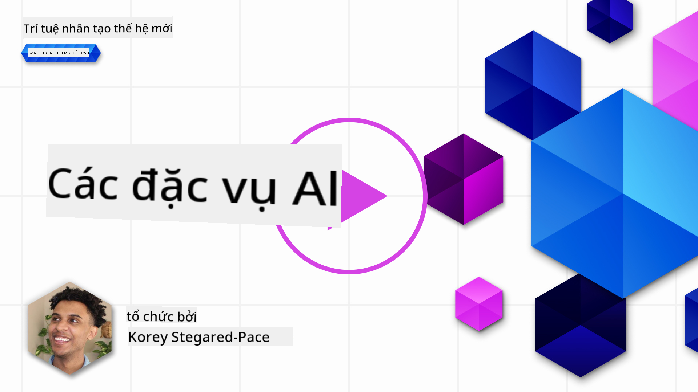
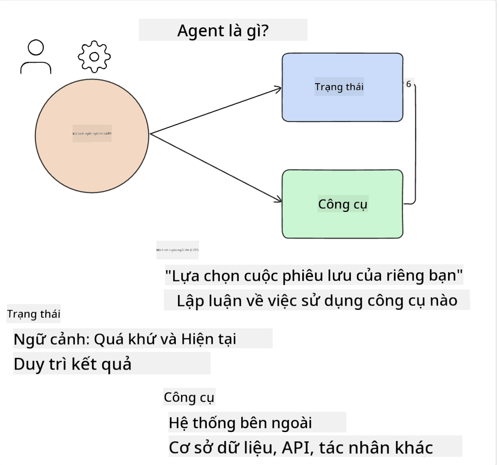
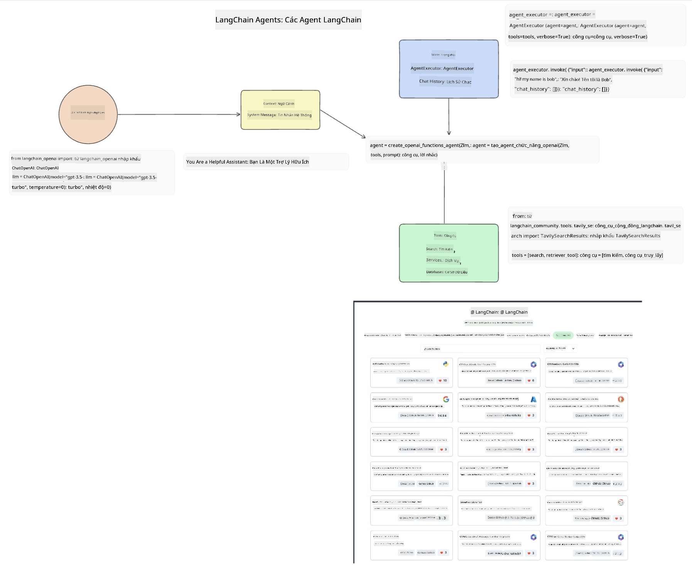
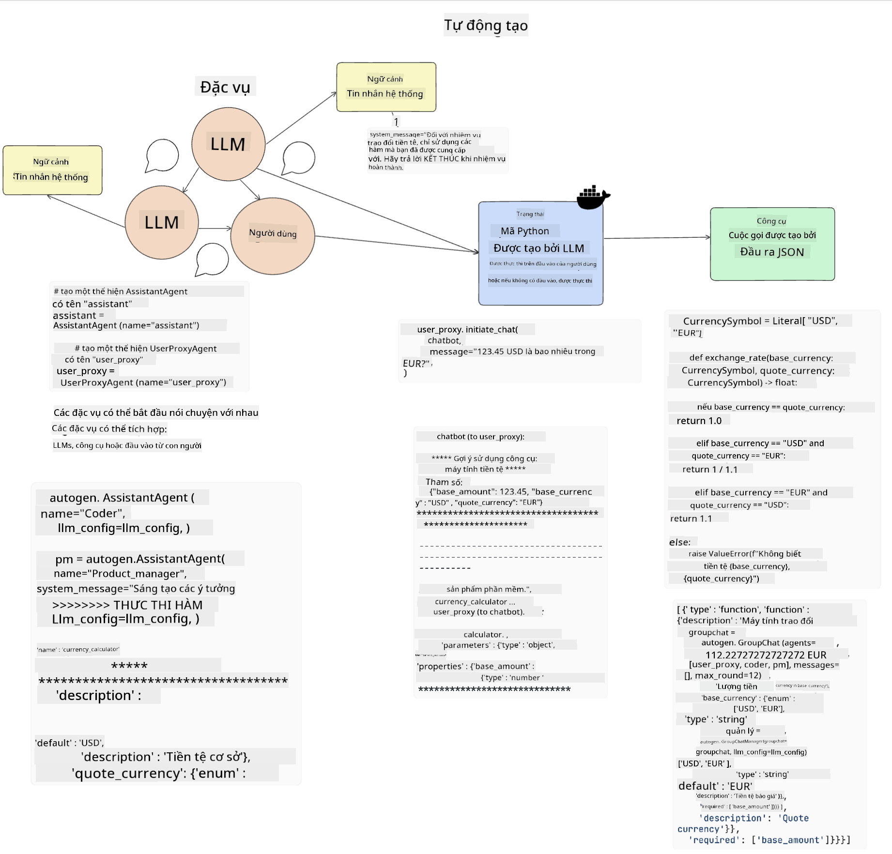
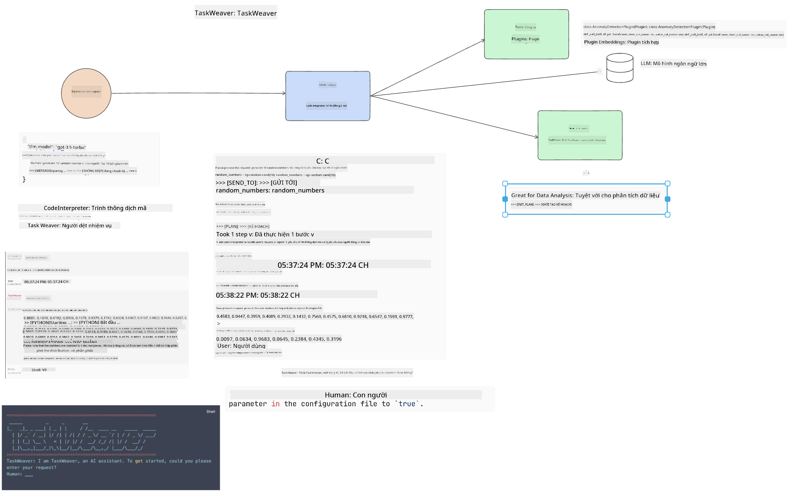

<!--
CO_OP_TRANSLATOR_METADATA:
{
  "original_hash": "11f03c81f190d9cbafd0f977dcbede6c",
  "translation_date": "2025-05-20T07:27:54+00:00",
  "source_file": "17-ai-agents/README.md",
  "language_code": "vi"
}
-->
[](https://aka.ms/gen-ai-lesson17-gh?WT.mc_id=academic-105485-koreyst)

## Giới thiệu

Các tác nhân AI đại diện cho một phát triển thú vị trong Generative AI, cho phép các Mô hình Ngôn ngữ Lớn (LLMs) tiến hóa từ trợ lý thành các tác nhân có khả năng thực hiện hành động. Các khung tác nhân AI cho phép nhà phát triển tạo ra ứng dụng cung cấp cho LLMs quyền truy cập vào công cụ và quản lý trạng thái. Những khung này cũng cải thiện khả năng hiển thị, cho phép người dùng và nhà phát triển theo dõi các hành động được LLMs lên kế hoạch, từ đó cải thiện quản lý trải nghiệm.

Bài học sẽ bao gồm các lĩnh vực sau:

- Hiểu rõ tác nhân AI là gì - Chính xác thì tác nhân AI là gì?
- Khám phá bốn khung tác nhân AI khác nhau - Điều gì làm cho chúng độc đáo?
- Áp dụng những tác nhân AI này vào các trường hợp sử dụng khác nhau - Khi nào nên sử dụng tác nhân AI?

## Mục tiêu học tập

Sau khi hoàn thành bài học này, bạn sẽ có thể:

- Giải thích tác nhân AI là gì và cách chúng có thể được sử dụng.
- Hiểu sự khác biệt giữa một số khung tác nhân AI phổ biến và cách chúng khác nhau.
- Hiểu cách tác nhân AI hoạt động để xây dựng ứng dụng với chúng.

## Tác nhân AI là gì?

Tác nhân AI là một lĩnh vực rất thú vị trong thế giới Generative AI. Với sự hứng thú này đôi khi có sự nhầm lẫn về thuật ngữ và ứng dụng của chúng. Để giữ mọi thứ đơn giản và bao gồm hầu hết các công cụ liên quan đến tác nhân AI, chúng ta sẽ sử dụng định nghĩa này:

Tác nhân AI cho phép các Mô hình Ngôn ngữ Lớn (LLMs) thực hiện nhiệm vụ bằng cách cung cấp cho chúng quyền truy cập vào một **trạng thái** và **công cụ**.



Hãy định nghĩa những thuật ngữ này:

**Mô hình Ngôn ngữ Lớn** - Đây là các mô hình được đề cập trong suốt khóa học này như GPT-3.5, GPT-4, Llama-2, v.v.

**Trạng thái** - Điều này đề cập đến ngữ cảnh mà LLM đang làm việc trong. LLM sử dụng ngữ cảnh của các hành động trước đó và ngữ cảnh hiện tại, hướng dẫn quyết định của nó cho các hành động tiếp theo. Các khung tác nhân AI cho phép nhà phát triển duy trì ngữ cảnh này dễ dàng hơn.

**Công cụ** - Để hoàn thành nhiệm vụ mà người dùng đã yêu cầu và LLM đã lên kế hoạch, LLM cần quyền truy cập vào công cụ. Một số ví dụ về công cụ có thể là cơ sở dữ liệu, API, ứng dụng bên ngoài hoặc thậm chí là một LLM khác!

Những định nghĩa này hy vọng sẽ giúp bạn có nền tảng tốt khi chúng ta xem xét cách chúng được triển khai. Hãy khám phá một vài khung tác nhân AI khác nhau:

## LangChain Agents

[LangChain Agents](https://python.langchain.com/docs/how_to/#agents?WT.mc_id=academic-105485-koreyst) là một triển khai của các định nghĩa chúng ta đã cung cấp ở trên.

Để quản lý **trạng thái**, nó sử dụng một hàm tích hợp gọi là `AgentExecutor`. Hàm này chấp nhận `agent` đã định nghĩa và `tools` có sẵn cho nó.

`Agent Executor` cũng lưu trữ lịch sử trò chuyện để cung cấp ngữ cảnh của cuộc trò chuyện.



LangChain cung cấp một [danh mục công cụ](https://integrations.langchain.com/tools?WT.mc_id=academic-105485-koreyst) có thể được nhập vào ứng dụng của bạn mà LLM có thể truy cập. Những công cụ này được tạo ra bởi cộng đồng và đội ngũ LangChain.

Bạn có thể định nghĩa những công cụ này và chuyển chúng cho `Agent Executor`.

Khả năng hiển thị là một khía cạnh quan trọng khác khi nói về tác nhân AI. Điều quan trọng đối với nhà phát triển ứng dụng là hiểu công cụ nào LLM đang sử dụng và lý do. Để làm điều đó, đội ngũ tại LangChain đã phát triển LangSmith.

## AutoGen

Khung tác nhân AI tiếp theo chúng ta sẽ thảo luận là [AutoGen](https://microsoft.github.io/autogen/?WT.mc_id=academic-105485-koreyst). Trọng tâm chính của AutoGen là các cuộc trò chuyện. Các tác nhân đều **có khả năng trò chuyện** và **có thể tùy chỉnh**.

**Có khả năng trò chuyện -** LLMs có thể bắt đầu và tiếp tục cuộc trò chuyện với một LLM khác để hoàn thành nhiệm vụ. Điều này được thực hiện bằng cách tạo `AssistantAgents` và cung cấp cho chúng một thông điệp hệ thống cụ thể.

```python

autogen.AssistantAgent( name="Coder", llm_config=llm_config, ) pm = autogen.AssistantAgent( name="Product_manager", system_message="Creative in software product ideas.", llm_config=llm_config, )

```

**Có thể tùy chỉnh** - Các tác nhân có thể được định nghĩa không chỉ là LLMs mà còn là người dùng hoặc công cụ. Là một nhà phát triển, bạn có thể định nghĩa `UserProxyAgent` chịu trách nhiệm tương tác với người dùng để lấy phản hồi trong việc hoàn thành nhiệm vụ. Phản hồi này có thể tiếp tục thực hiện nhiệm vụ hoặc dừng lại.

```python
user_proxy = UserProxyAgent(name="user_proxy")
```

### Trạng thái và Công cụ

Để thay đổi và quản lý trạng thái, một tác nhân trợ lý tạo mã Python để hoàn thành nhiệm vụ.

Dưới đây là một ví dụ về quy trình:



#### LLM Được Định Nghĩa với Thông Điệp Hệ Thống

```python
system_message="For weather related tasks, only use the functions you have been provided with. Reply TERMINATE when the task is done."
```

Thông điệp hệ thống này hướng dẫn LLM cụ thể này đến những chức năng nào có liên quan đến nhiệm vụ của nó. Hãy nhớ rằng, với AutoGen, bạn có thể có nhiều AssistantAgents được định nghĩa với các thông điệp hệ thống khác nhau.

#### Cuộc Trò Chuyện Được Khởi Tạo Bởi Người Dùng

```python
user_proxy.initiate_chat( chatbot, message="I am planning a trip to NYC next week, can you help me pick out what to wear? ", )

```

Thông điệp từ user_proxy (Con người) là điều sẽ bắt đầu quá trình của Tác nhân để khám phá các chức năng có thể mà nó nên thực hiện.

#### Chức Năng Được Thực Thi

```bash
chatbot (to user_proxy):

***** Suggested tool Call: get_weather ***** Arguments: {"location":"New York City, NY","time_periond:"7","temperature_unit":"Celsius"} ******************************************************** --------------------------------------------------------------------------------

>>>>>>>> EXECUTING FUNCTION get_weather... user_proxy (to chatbot): ***** Response from calling function "get_weather" ***** 112.22727272727272 EUR ****************************************************************

```

Khi cuộc trò chuyện ban đầu được xử lý, Tác nhân sẽ gửi công cụ gợi ý để gọi. Trong trường hợp này, đó là một chức năng gọi là `get_weather`. Depending on your configuration, this function can be automatically executed and read by the Agent or can be executed based on user input.

You can find a list of [AutoGen code samples](https://microsoft.github.io/autogen/docs/Examples/?WT.mc_id=academic-105485-koreyst) to further explore how to get started building.

## Taskweaver

The next agent framework we will explore is [Taskweaver](https://microsoft.github.io/TaskWeaver/?WT.mc_id=academic-105485-koreyst). It is known as a "code-first" agent because instead of working strictly with `strings` , it can work with DataFrames in Python. This becomes extremely useful for data analysis and generation tasks. This can be things like creating graphs and charts or generating random numbers.

### State and Tools

To manage the state of the conversation, TaskWeaver uses the concept of a `Planner`. The `Planner` is a LLM that takes the request from the users and maps out the tasks that need to be completed to fulfill this request.

To complete the tasks the `Planner` is exposed to the collection of tools called `Plugins`. Điều này có thể là các lớp Python hoặc một trình thông dịch mã chung. Những plugin này được lưu trữ dưới dạng nhúng để LLM có thể tìm kiếm plugin đúng cách hơn.



Dưới đây là một ví dụ về một plugin để xử lý phát hiện dị thường:

```python
class AnomalyDetectionPlugin(Plugin): def __call__(self, df: pd.DataFrame, time_col_name: str, value_col_name: str):
```

Mã được xác minh trước khi thực thi. Một tính năng khác để quản lý ngữ cảnh trong Taskweaver là `experience`. Experience allows for the context of a conversation to be stored over to the long term in a YAML file. This can be configured so that the LLM improves over time on certain tasks given that it is exposed to prior conversations.

## JARVIS

The last agent framework we will explore is [JARVIS](https://github.com/microsoft/JARVIS?tab=readme-ov-file?WT.mc_id=academic-105485-koreyst). What makes JARVIS unique is that it uses an LLM to manage the `state` của cuộc trò chuyện và `tools` là các mô hình AI khác. Mỗi mô hình AI là mô hình chuyên biệt thực hiện các nhiệm vụ nhất định như phát hiện đối tượng, chuyển biên hoặc chú thích hình ảnh.


LLM, là một mô hình đa dụng, nhận yêu cầu từ người dùng và xác định nhiệm vụ cụ thể và bất kỳ đối số/dữ liệu nào cần thiết để hoàn thành nhiệm vụ.

```python
[{"task": "object-detection", "id": 0, "dep": [-1], "args": {"image": "e1.jpg" }}]
```

Sau đó, LLM định dạng yêu cầu theo cách mà mô hình AI chuyên biệt có thể hiểu được, chẳng hạn như JSON. Khi mô hình AI đã trả lại dự đoán của nó dựa trên nhiệm vụ, LLM nhận phản hồi.

Nếu cần nhiều mô hình để hoàn thành nhiệm vụ, nó cũng sẽ diễn giải phản hồi từ các mô hình đó trước khi kết hợp chúng để tạo ra phản hồi cho người dùng.

Ví dụ dưới đây cho thấy cách điều này sẽ hoạt động khi người dùng yêu cầu mô tả và đếm các đối tượng trong một bức tranh:

## Bài tập

Để tiếp tục học tập về tác nhân AI, bạn có thể xây dựng với AutoGen:

- Một ứng dụng mô phỏng cuộc họp kinh doanh với các phòng ban khác nhau của một startup giáo dục.
- Tạo thông điệp hệ thống hướng dẫn LLMs hiểu các nhân vật và ưu tiên khác nhau, và cho phép người dùng trình bày ý tưởng sản phẩm mới.
- LLM sau đó sẽ tạo câu hỏi tiếp theo từ mỗi phòng ban để tinh chỉnh và cải thiện ý tưởng sản phẩm và sản phẩm.

## Học tập không dừng lại ở đây, tiếp tục hành trình

Sau khi hoàn thành bài học này, hãy xem bộ sưu tập [Generative AI Learning](https://aka.ms/genai-collection?WT.mc_id=academic-105485-koreyst) của chúng tôi để tiếp tục nâng cao kiến thức Generative AI của bạn!

**Tuyên bố miễn trừ trách nhiệm**:  
Tài liệu này đã được dịch bằng dịch vụ dịch thuật AI [Co-op Translator](https://github.com/Azure/co-op-translator). Mặc dù chúng tôi cố gắng đảm bảo độ chính xác, xin lưu ý rằng các bản dịch tự động có thể chứa lỗi hoặc không chính xác. Tài liệu gốc bằng ngôn ngữ bản địa nên được coi là nguồn đáng tin cậy. Đối với thông tin quan trọng, nên sử dụng dịch vụ dịch thuật chuyên nghiệp bởi con người. Chúng tôi không chịu trách nhiệm cho bất kỳ sự hiểu lầm hoặc giải thích sai nào phát sinh từ việc sử dụng bản dịch này.