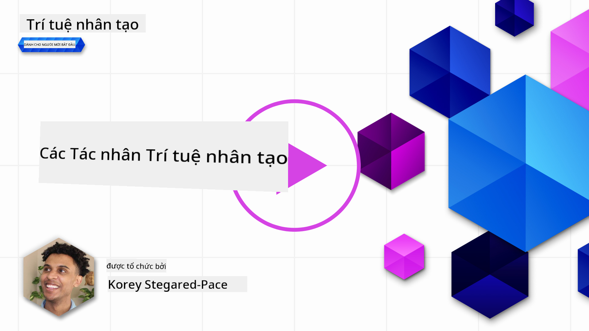
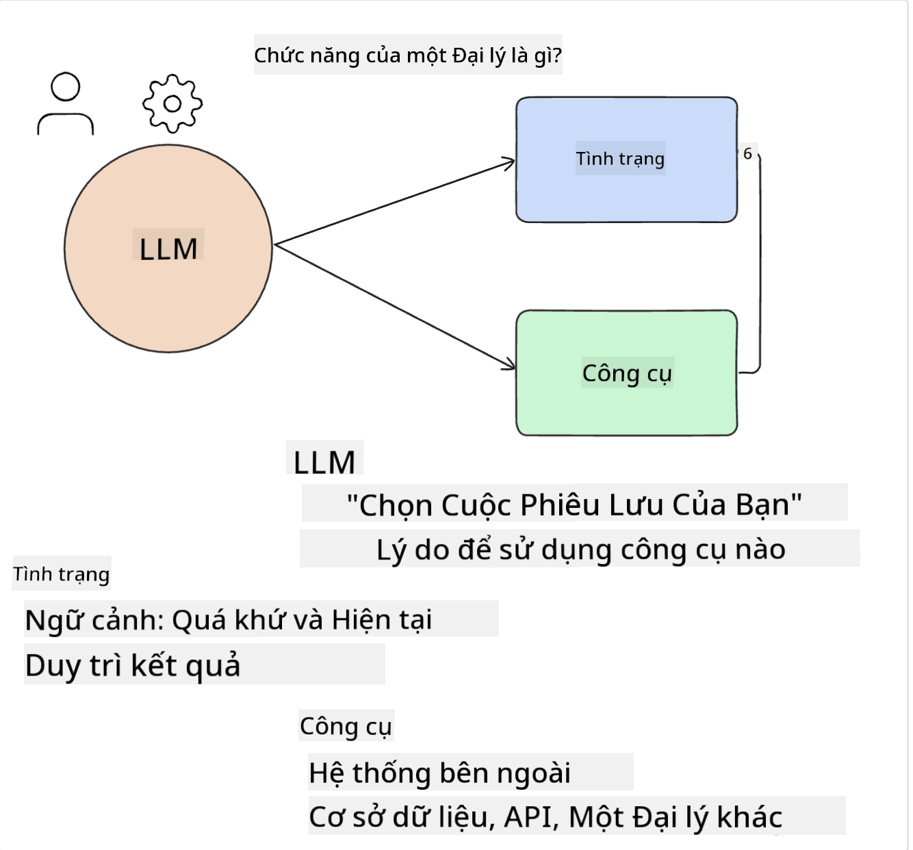
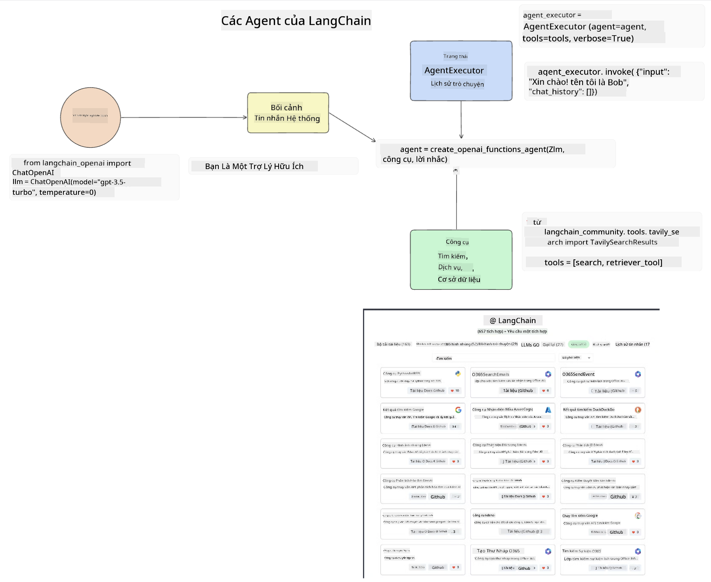
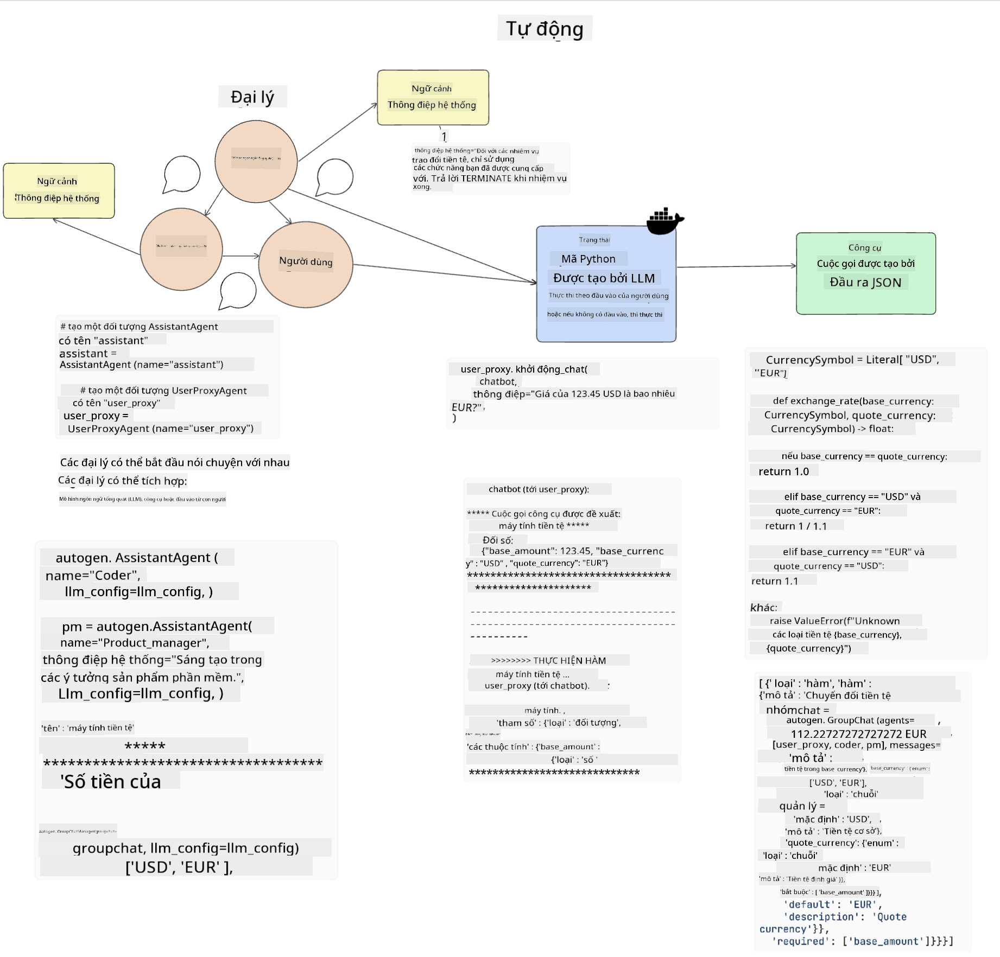
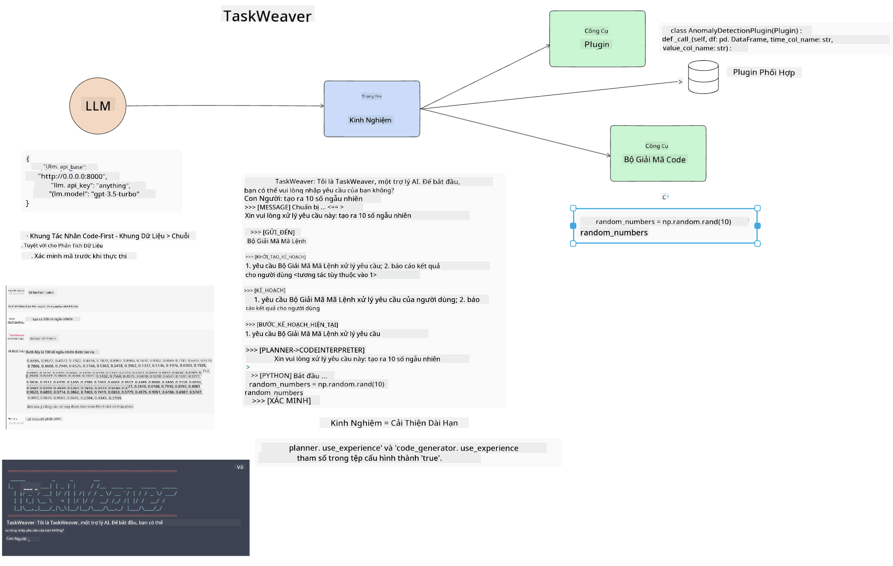
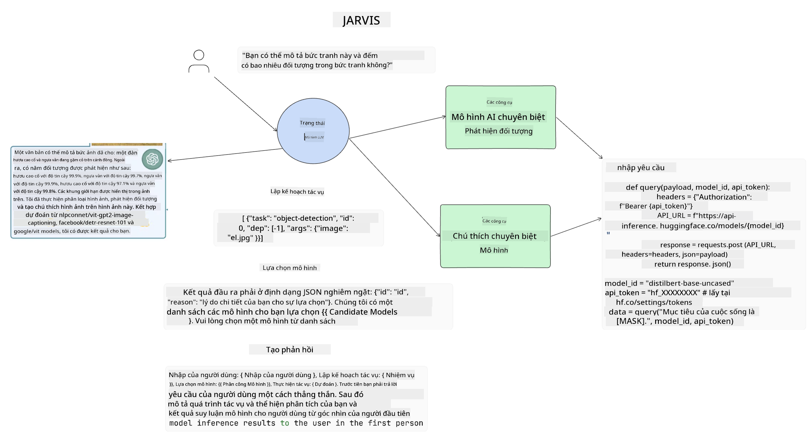

<!--
CO_OP_TRANSLATOR_METADATA:
{
  "original_hash": "11f03c81f190d9cbafd0f977dcbede6c",
  "translation_date": "2025-06-26T00:21:41+00:00",
  "source_file": "17-ai-agents/README.md",
  "language_code": "vi"
}
-->
[](https://aka.ms/gen-ai-lesson17-gh?WT.mc_id=academic-105485-koreyst)

## Giới thiệu

AI Agents đại diện cho một phát triển thú vị trong Generative AI, cho phép Large Language Models (LLMs) tiến hóa từ trợ lý thành các tác nhân có khả năng thực hiện hành động. Các khung AI Agent cho phép các nhà phát triển tạo ra các ứng dụng cho phép LLMs truy cập vào công cụ và quản lý trạng thái. Các khung này cũng tăng cường khả năng hiển thị, cho phép người dùng và nhà phát triển giám sát các hành động mà LLMs đã lên kế hoạch, từ đó cải thiện quản lý trải nghiệm.

Bài học sẽ đề cập đến các lĩnh vực sau:

- Hiểu AI Agent là gì - Chính xác AI Agent là gì?
- Khám phá bốn khung AI Agent khác nhau - Điều gì làm cho chúng độc đáo?
- Áp dụng các AI Agents này vào các trường hợp sử dụng khác nhau - Khi nào chúng ta nên sử dụng AI Agents?

## Mục tiêu học tập

Sau khi tham gia bài học này, bạn sẽ có thể:

- Giải thích AI Agents là gì và cách chúng có thể được sử dụng.
- Có sự hiểu biết về sự khác biệt giữa một số khung AI Agent phổ biến và cách chúng khác nhau.
- Hiểu cách AI Agents hoạt động để xây dựng ứng dụng với chúng.

## AI Agents Là Gì?

AI Agents là một lĩnh vực rất thú vị trong thế giới Generative AI. Với sự phấn khích này đôi khi dẫn đến sự nhầm lẫn về thuật ngữ và ứng dụng của chúng. Để giữ mọi thứ đơn giản và bao gồm hầu hết các công cụ đề cập đến AI Agents, chúng ta sẽ sử dụng định nghĩa này:

AI Agents cho phép Large Language Models (LLMs) thực hiện nhiệm vụ bằng cách cung cấp cho chúng quyền truy cập vào một **trạng thái** và **công cụ**.



Hãy định nghĩa những thuật ngữ này:

**Large Language Models** - Đây là các mô hình được đề cập trong suốt khóa học này như GPT-3.5, GPT-4, Llama-2, v.v.

**State** - Điều này đề cập đến ngữ cảnh mà LLM đang làm việc. LLM sử dụng ngữ cảnh của các hành động trước đó và ngữ cảnh hiện tại, hướng dẫn việc ra quyết định cho các hành động tiếp theo. Các khung AI Agent cho phép nhà phát triển duy trì ngữ cảnh này dễ dàng hơn.

**Tools** - Để hoàn thành nhiệm vụ mà người dùng đã yêu cầu và LLM đã lên kế hoạch, LLM cần truy cập vào các công cụ. Một số ví dụ về công cụ có thể là cơ sở dữ liệu, một API, một ứng dụng bên ngoài hoặc thậm chí là một LLM khác!

Những định nghĩa này hy vọng sẽ cung cấp cho bạn một nền tảng tốt khi chúng ta xem xét cách chúng được triển khai. Hãy khám phá một vài khung AI Agent khác nhau:

## LangChain Agents

[LangChain Agents](https://python.langchain.com/docs/how_to/#agents?WT.mc_id=academic-105485-koreyst) là một triển khai của các định nghĩa mà chúng tôi đã cung cấp ở trên.

Để quản lý **state**, nó sử dụng một hàm tích hợp gọi là `AgentExecutor`. Điều này chấp nhận `agent` đã được định nghĩa và `tools` có sẵn cho nó.

`Agent Executor` cũng lưu trữ lịch sử trò chuyện để cung cấp ngữ cảnh của cuộc trò chuyện.



LangChain cung cấp một [danh mục công cụ](https://integrations.langchain.com/tools?WT.mc_id=academic-105485-koreyst) có thể được nhập vào ứng dụng của bạn mà LLM có thể truy cập. Những công cụ này được tạo bởi cộng đồng và bởi đội ngũ LangChain.

Sau đó, bạn có thể định nghĩa những công cụ này và chuyển chúng đến `Agent Executor`.

Khả năng hiển thị là một khía cạnh quan trọng khác khi nói về AI Agents. Điều quan trọng là các nhà phát triển ứng dụng phải hiểu công cụ nào mà LLM đang sử dụng và tại sao. Để làm điều đó, đội ngũ tại LangChain đã phát triển LangSmith.

## AutoGen

Khung AI Agent tiếp theo mà chúng ta sẽ thảo luận là [AutoGen](https://microsoft.github.io/autogen/?WT.mc_id=academic-105485-koreyst). Tâm điểm chính của AutoGen là các cuộc trò chuyện. Các tác nhân vừa **có thể trò chuyện** vừa **có thể tùy chỉnh**.

**Có thể trò chuyện -** LLMs có thể bắt đầu và tiếp tục một cuộc trò chuyện với một LLM khác để hoàn thành nhiệm vụ. Điều này được thực hiện bằng cách tạo `AssistantAgents` và cung cấp cho chúng một thông điệp hệ thống cụ thể.

```python

autogen.AssistantAgent( name="Coder", llm_config=llm_config, ) pm = autogen.AssistantAgent( name="Product_manager", system_message="Creative in software product ideas.", llm_config=llm_config, )

```

**Có thể tùy chỉnh** - Các tác nhân có thể được định nghĩa không chỉ là LLMs mà còn là người dùng hoặc công cụ. Là một nhà phát triển, bạn có thể định nghĩa một `UserProxyAgent` chịu trách nhiệm tương tác với người dùng để lấy phản hồi trong việc hoàn thành nhiệm vụ. Phản hồi này có thể tiếp tục thực hiện nhiệm vụ hoặc dừng lại.

```python
user_proxy = UserProxyAgent(name="user_proxy")
```

### State và Tools

Để thay đổi và quản lý state, một tác nhân trợ lý tạo ra mã Python để hoàn thành nhiệm vụ.

Dưới đây là một ví dụ về quy trình:



#### LLM Được Định Nghĩa Với Thông Điệp Hệ Thống

```python
system_message="For weather related tasks, only use the functions you have been provided with. Reply TERMINATE when the task is done."
```

Thông điệp hệ thống này hướng dẫn LLM cụ thể này đến các hàm nào là liên quan cho nhiệm vụ của nó. Hãy nhớ rằng, với AutoGen bạn có thể có nhiều AssistantAgents được định nghĩa với các thông điệp hệ thống khác nhau.

#### Cuộc Trò Chuyện Được Khởi Động Bởi Người Dùng

```python
user_proxy.initiate_chat( chatbot, message="I am planning a trip to NYC next week, can you help me pick out what to wear? ", )

```

Thông điệp này từ user_proxy (Con người) là điều sẽ bắt đầu quá trình của Agent để khám phá các hàm có thể nó nên thực hiện.

#### Hàm Được Thực Thi

```bash
chatbot (to user_proxy):

***** Suggested tool Call: get_weather ***** Arguments: {"location":"New York City, NY","time_periond:"7","temperature_unit":"Celsius"} ******************************************************** --------------------------------------------------------------------------------

>>>>>>>> EXECUTING FUNCTION get_weather... user_proxy (to chatbot): ***** Response from calling function "get_weather" ***** 112.22727272727272 EUR ****************************************************************

```

Một khi cuộc trò chuyện ban đầu được xử lý, Agent sẽ gửi công cụ gợi ý để gọi. Trong trường hợp này, đó là một hàm gọi `get_weather`. Depending on your configuration, this function can be automatically executed and read by the Agent or can be executed based on user input.

You can find a list of [AutoGen code samples](https://microsoft.github.io/autogen/docs/Examples/?WT.mc_id=academic-105485-koreyst) to further explore how to get started building.

## Taskweaver

The next agent framework we will explore is [Taskweaver](https://microsoft.github.io/TaskWeaver/?WT.mc_id=academic-105485-koreyst). It is known as a "code-first" agent because instead of working strictly with `strings` , it can work with DataFrames in Python. This becomes extremely useful for data analysis and generation tasks. This can be things like creating graphs and charts or generating random numbers.

### State and Tools

To manage the state of the conversation, TaskWeaver uses the concept of a `Planner`. The `Planner` is a LLM that takes the request from the users and maps out the tasks that need to be completed to fulfill this request.

To complete the tasks the `Planner` is exposed to the collection of tools called `Plugins`. Đây có thể là các lớp Python hoặc một trình thông dịch mã chung. Các plugin này được lưu trữ dưới dạng embeddings để LLM có thể tìm kiếm plugin chính xác tốt hơn.



Dưới đây là một ví dụ về plugin để xử lý phát hiện bất thường:

```python
class AnomalyDetectionPlugin(Plugin): def __call__(self, df: pd.DataFrame, time_col_name: str, value_col_name: str):
```

Mã được xác minh trước khi thực thi. Một tính năng khác để quản lý ngữ cảnh trong Taskweaver là `experience`. Experience allows for the context of a conversation to be stored over to the long term in a YAML file. This can be configured so that the LLM improves over time on certain tasks given that it is exposed to prior conversations.

## JARVIS

The last agent framework we will explore is [JARVIS](https://github.com/microsoft/JARVIS?tab=readme-ov-file?WT.mc_id=academic-105485-koreyst). What makes JARVIS unique is that it uses an LLM to manage the `state` của cuộc trò chuyện và `tools` là các mô hình AI khác. Mỗi mô hình AI là các mô hình chuyên biệt thực hiện các nhiệm vụ nhất định như phát hiện đối tượng, chuyển đổi văn bản hoặc chú thích hình ảnh.



LLM, là một mô hình đa dụng, nhận yêu cầu từ người dùng và xác định nhiệm vụ cụ thể và bất kỳ tham số/dữ liệu nào cần thiết để hoàn thành nhiệm vụ.

```python
[{"task": "object-detection", "id": 0, "dep": [-1], "args": {"image": "e1.jpg" }}]
```

LLM sau đó định dạng yêu cầu theo cách mà mô hình AI chuyên biệt có thể diễn giải, chẳng hạn như JSON. Một khi mô hình AI đã trả về dự đoán của nó dựa trên nhiệm vụ, LLM nhận phản hồi.

Nếu nhiều mô hình cần thiết để hoàn thành nhiệm vụ, nó cũng sẽ diễn giải phản hồi từ các mô hình đó trước khi kết hợp chúng để tạo ra phản hồi cho người dùng.

Ví dụ dưới đây cho thấy cách điều này hoạt động khi một người dùng yêu cầu mô tả và đếm các đối tượng trong một bức tranh:

## Bài tập

Để tiếp tục học hỏi về AI Agents bạn có thể xây dựng với AutoGen:

- Một ứng dụng mô phỏng một cuộc họp kinh doanh với các phòng ban khác nhau của một startup giáo dục.
- Tạo các thông điệp hệ thống hướng dẫn LLMs trong việc hiểu các nhân vật và ưu tiên khác nhau, và cho phép người dùng trình bày ý tưởng sản phẩm mới.
- LLM sau đó nên tạo ra các câu hỏi tiếp theo từ mỗi phòng ban để tinh chỉnh và cải thiện ý tưởng sản phẩm và bài trình bày.

## Học tập không dừng lại ở đây, tiếp tục hành trình

Sau khi hoàn thành bài học này, hãy xem bộ sưu tập [Generative AI Learning](https://aka.ms/genai-collection?WT.mc_id=academic-105485-koreyst) của chúng tôi để tiếp tục nâng cao kiến thức về Generative AI của bạn!

**Tuyên bố từ chối trách nhiệm**:  
Tài liệu này đã được dịch bằng dịch vụ dịch thuật AI [Co-op Translator](https://github.com/Azure/co-op-translator). Mặc dù chúng tôi cố gắng đảm bảo độ chính xác, xin lưu ý rằng các bản dịch tự động có thể chứa lỗi hoặc không chính xác. Tài liệu gốc bằng ngôn ngữ bản địa của nó nên được coi là nguồn thông tin có thẩm quyền. Đối với thông tin quan trọng, nên sử dụng dịch vụ dịch thuật chuyên nghiệp từ con người. Chúng tôi không chịu trách nhiệm cho bất kỳ sự hiểu lầm hoặc giải thích sai nào phát sinh từ việc sử dụng bản dịch này.