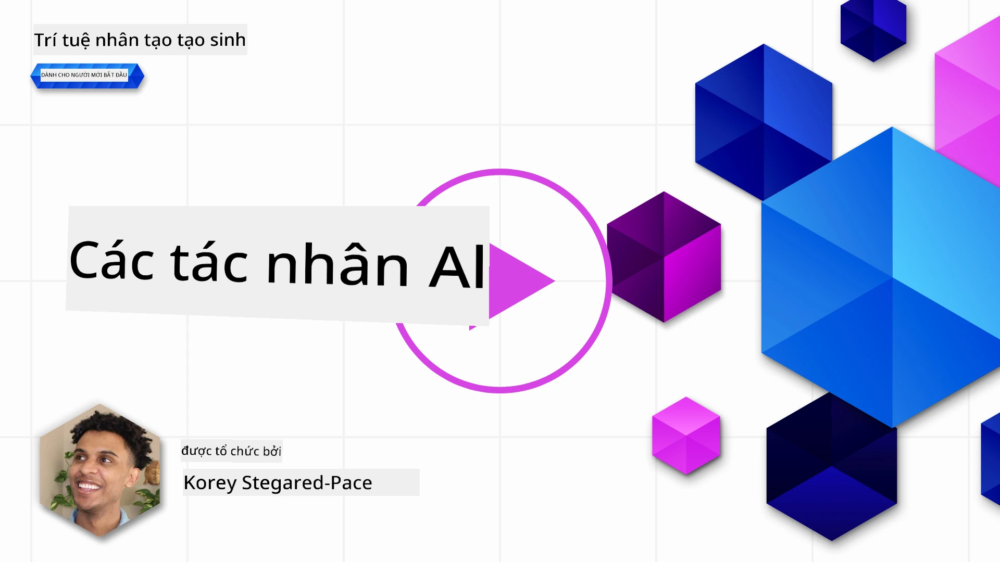
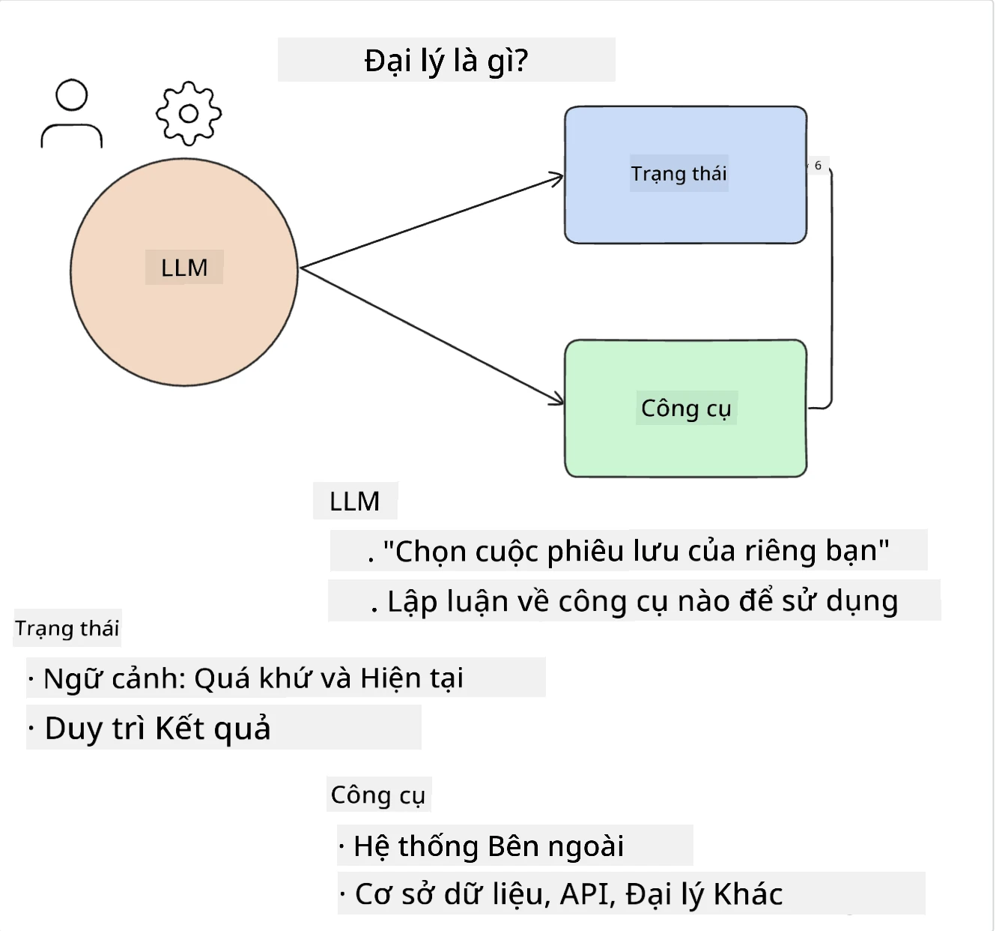
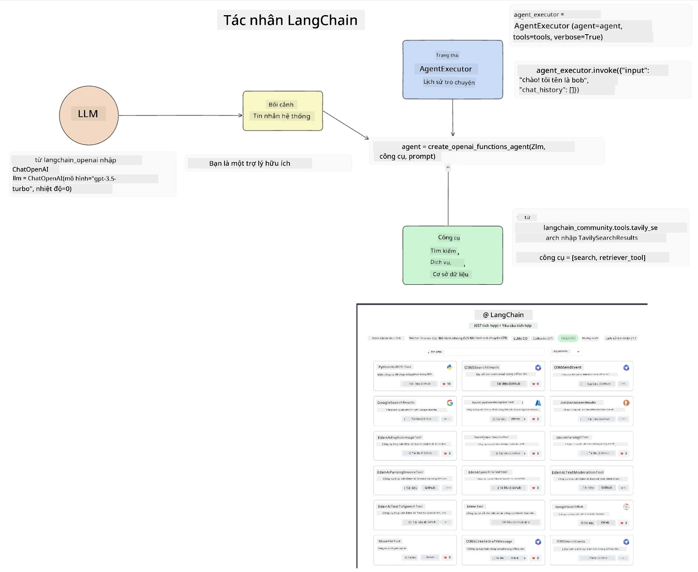
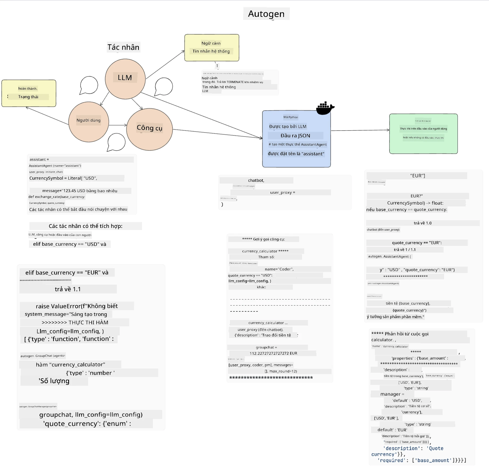
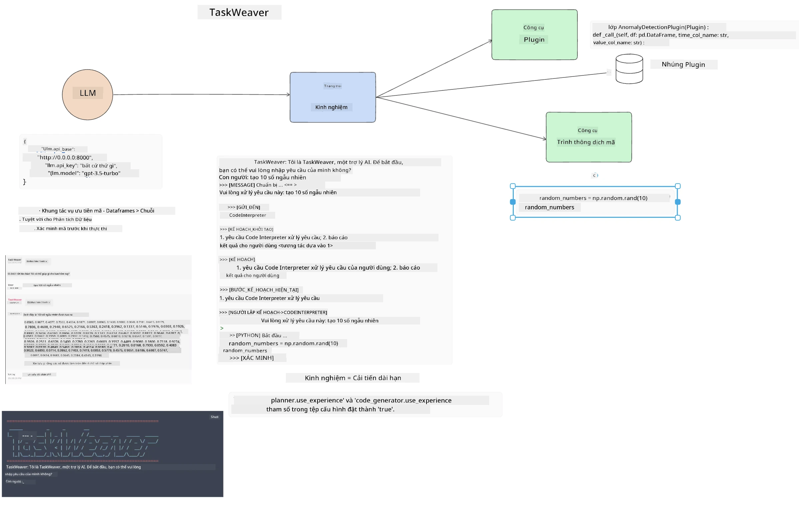
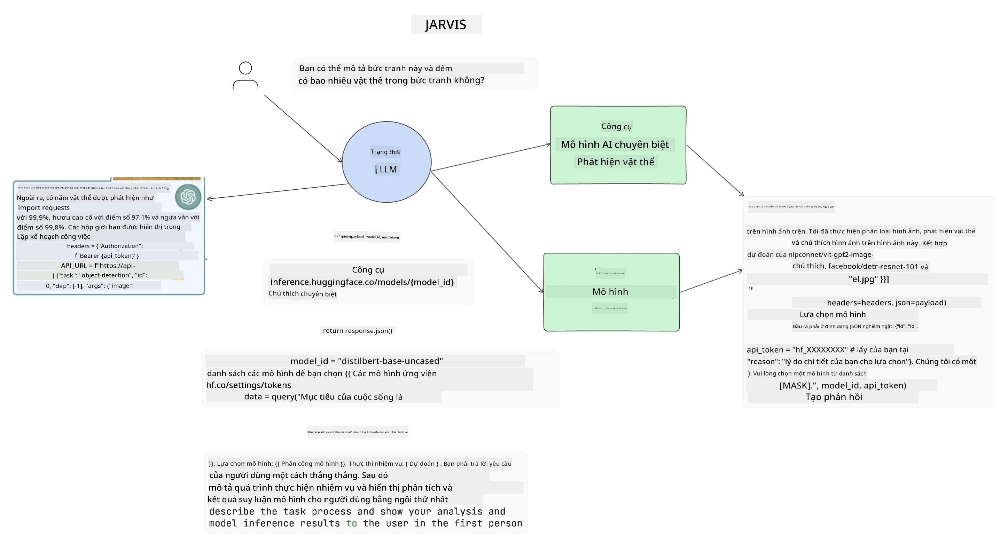

[](https://youtu.be/yAXVW-lUINc?si=bOtW9nL6jc3XJgOM)

## Giới thiệu

Các Đại lý AI đại diện cho một bước phát triển thú vị trong AI Tạo sinh, cho phép Các Mô hình Ngôn ngữ Lớn (LLMs) tiến hóa từ trợ lý thành các đại lý có khả năng thực hiện các hành động. Các khung Đại lý AI cho phép các nhà phát triển tạo ra các ứng dụng giúp LLM truy cập công cụ và quản lý trạng thái. Các khung này cũng tăng khả năng hiển thị, cho phép người dùng và nhà phát triển theo dõi các hành động do LLM lên kế hoạch, từ đó cải thiện việc quản lý trải nghiệm.

Bài học sẽ bao gồm các lĩnh vực sau:

- Hiểu Đại lý AI là gì - Đại lý AI thực sự là gì?
- Khám phá bốn Khung Đại lý AI khác nhau - Điều gì làm cho chúng độc đáo?
- Áp dụng các Đại lý AI này vào các trường hợp sử dụng khác nhau - Khi nào nên sử dụng Đại lý AI?

## Mục tiêu học tập

Sau khi hoàn thành bài học này, bạn sẽ có thể:

- Giải thích Đại lý AI là gì và cách chúng có thể được sử dụng.
- Hiểu được sự khác biệt giữa một số Khung Đại lý AI phổ biến, và cách chúng khác nhau.
- Hiểu cách Đại lý AI hoạt động để xây dựng ứng dụng với chúng.

## Đại lý AI là gì?

Đại lý AI là một lĩnh vực rất thú vị trong thế giới AI Tạo sinh. Với sự phấn khích này đôi khi lại gây ra sự nhầm lẫn về thuật ngữ và cách ứng dụng của chúng. Để giữ cho mọi thứ đơn giản và bao gồm hầu hết các công cụ được gọi là Đại lý AI, chúng ta sẽ sử dụng định nghĩa sau:

Đại lý AI cho phép Các Mô hình Ngôn ngữ Lớn (LLMs) thực hiện các nhiệm vụ bằng cách cho chúng truy cập vào **trạng thái** và **công cụ**.



Hãy định nghĩa các thuật ngữ này:

**Các Mô hình Ngôn ngữ Lớn** - Đây là các mô hình được nhắc đến trong suốt khóa học như GPT-3.5, GPT-4, Llama-2, v.v.

**Trạng thái** - Đây là ngữ cảnh mà LLM đang làm việc. LLM sử dụng ngữ cảnh của các hành động trong quá khứ và ngữ cảnh hiện tại để hướng dẫn quyết định cho các hành động tiếp theo. Các Khung Đại lý AI cho phép nhà phát triển duy trì ngữ cảnh này dễ dàng hơn.

**Công cụ** - Để hoàn thành nhiệm vụ mà người dùng yêu cầu và LLM đã lên kế hoạch, LLM cần truy cập vào công cụ. Một số ví dụ về công cụ có thể là cơ sở dữ liệu, API, ứng dụng bên ngoài hoặc thậm chí một LLM khác!

Những định nghĩa này hy vọng sẽ giúp bạn có nền tảng tốt để tiếp tục khi chúng ta xem xét cách chúng được triển khai. Hãy cùng khám phá một vài khung Đại lý AI khác nhau:

## Đại lý LangChain

[LangChain Agents](https://python.langchain.com/docs/how_to/#agents?WT.mc_id=academic-105485-koreyst) là một triển khai của các định nghĩa được cung cấp ở trên.

Để quản lý **trạng thái**, nó sử dụng một hàm tích hợp gọi là `AgentExecutor`. Hàm này nhận `agent` đã được định nghĩa và các `tools` có sẵn cho nó.

`Agent Executor` cũng lưu lịch sử trò chuyện để cung cấp ngữ cảnh của cuộc trò chuyện.



LangChain cung cấp một [danh mục công cụ](https://integrations.langchain.com/tools?WT.mc_id=academic-105485-koreyst) có thể được nhập vào ứng dụng của bạn mà LLM có thể truy cập. Các công cụ này được tạo bởi cộng đồng và đội ngũ LangChain.

Bạn có thể định nghĩa những công cụ này và truyền chúng cho `Agent Executor`.

Khả năng hiển thị là một khía cạnh quan trọng khác khi nói về Đại lý AI. Rất quan trọng để nhà phát triển ứng dụng hiểu công cụ nào LLM đang sử dụng và vì sao. Vì lý do đó, nhóm tại LangChain đã phát triển LangSmith.

## AutoGen

Khung Đại lý AI tiếp theo chúng ta sẽ thảo luận là [AutoGen](https://microsoft.github.io/autogen/?WT.mc_id=academic-105485-koreyst). Mục tiêu chính của AutoGen là các cuộc hội thoại. Đại lý vừa **có thể hội thoại** vừa **có thể tùy chỉnh**.

**Có thể hội thoại** - LLM có thể bắt đầu và tiếp tục một cuộc hội thoại với LLM khác để hoàn thành một nhiệm vụ. Điều này được thực hiện bằng cách tạo `AssistantAgents` và cung cấp cho chúng một thông điệp hệ thống cụ thể.

```python

autogen.AssistantAgent( name="Coder", llm_config=llm_config, ) pm = autogen.AssistantAgent( name="Product_manager", system_message="Creative in software product ideas.", llm_config=llm_config, )

```

**Có thể tùy chỉnh** - Đại lý có thể được định nghĩa không chỉ là LLM mà còn là người dùng hoặc công cụ. Là nhà phát triển, bạn có thể định nghĩa một `UserProxyAgent` chịu trách nhiệm tương tác với người dùng để lấy phản hồi trong việc hoàn thành nhiệm vụ. Phản hồi này có thể tiếp tục thực thi nhiệm vụ hoặc dừng lại.

```python
user_proxy = UserProxyAgent(name="user_proxy")
```

### Trạng thái và Công cụ

Để thay đổi và quản lý trạng thái, một Đại lý trợ lý tạo ra mã Python để hoàn thành nhiệm vụ.

Dưới đây là một ví dụ về quá trình:



#### LLM được Định nghĩa với Thông điệp Hệ thống

```python
system_message="For weather related tasks, only use the functions you have been provided with. Reply TERMINATE when the task is done."
```

Thông điệp hệ thống này hướng dẫn LLM cụ thể này các hàm nào là phù hợp cho nhiệm vụ của nó. Hãy nhớ rằng, với AutoGen bạn có thể có nhiều AssistantAgents được định nghĩa với các thông điệp hệ thống khác nhau.

#### Cuộc hội thoại được Khởi tạo bởi Người dùng

```python
user_proxy.initiate_chat( chatbot, message="I am planning a trip to NYC next week, can you help me pick out what to wear? ", )

```

Thông điệp này từ user_proxy (con người) sẽ bắt đầu quá trình Đại lý khám phá các hàm khả thi mà nó nên thực thi.

#### Hàm được Thực thi

```bash
chatbot (to user_proxy):

***** Suggested tool Call: get_weather ***** Arguments: {"location":"New York City, NY","time_periond:"7","temperature_unit":"Celsius"} ******************************************************** --------------------------------------------------------------------------------

>>>>>>>> EXECUTING FUNCTION get_weather... user_proxy (to chatbot): ***** Response from calling function "get_weather" ***** 112.22727272727272 EUR ****************************************************************

```

Khi cuộc trò chuyện ban đầu được xử lý, Đại lý sẽ gửi đề xuất công cụ để gọi. Trong trường hợp này, đó là hàm gọi là `get_weather`. Tùy vào cấu hình của bạn, hàm này có thể được tự động thực thi và đọc bởi Đại lý hoặc có thể thực thi dựa trên đầu vào của người dùng.

Bạn có thể tìm danh sách các [ví dụ mã AutoGen](https://microsoft.github.io/autogen/docs/Examples/?WT.mc_id=academic-105485-koreyst) để khám phá thêm cách bắt đầu xây dựng.

## Taskweaver

Khung đại lý tiếp theo chúng ta sẽ khám phá là [Taskweaver](https://microsoft.github.io/TaskWeaver/?WT.mc_id=academic-105485-koreyst). Nó được biết đến là một đại lý "code-first" vì thay vì làm việc chỉ với `chuỗi ký tự`, nó có thể làm việc với DataFrames trong Python. Điều này trở nên cực kỳ hữu ích cho các nhiệm vụ phân tích và tạo dữ liệu. Đây có thể là các công việc như tạo biểu đồ và đồ thị hoặc tạo các số ngẫu nhiên.

### Trạng thái và Công cụ

Để quản lý trạng thái của cuộc trò chuyện, TaskWeaver sử dụng khái niệm `Planner`. `Planner` là một LLM nhận yêu cầu từ người dùng và phác thảo các nhiệm vụ cần hoàn thành để thực hiện yêu cầu đó.

Để hoàn thành nhiệm vụ, `Planner` được tiếp xúc với bộ công cụ gọi là `Plugins`. Đây có thể là các lớp Python hoặc một trình thông dịch mã chung. Các plugin này được lưu trữ dưới dạng embeddings để LLM có thể tìm kiếm plugin phù hợp tốt hơn.



Dưới đây là một ví dụ về plugin xử lý phát hiện bất thường:

```python
class AnomalyDetectionPlugin(Plugin): def __call__(self, df: pd.DataFrame, time_col_name: str, value_col_name: str):
```

Mã được kiểm tra trước khi thực thi. Một tính năng khác để quản lý ngữ cảnh trong Taskweaver là `experience`. Experience cho phép ngữ cảnh của cuộc trò chuyện được lưu trữ lâu dài trong một file YAML. Điều này có thể được cấu hình sao cho LLM cải thiện theo thời gian trên các nhiệm vụ nhất định với điều kiện được tiếp xúc với các cuộc trò chuyện trước đó.

## JARVIS

Khung đại lý cuối cùng chúng ta sẽ khám phá là [JARVIS](https://github.com/microsoft/JARVIS?tab=readme-ov-file&WT.mc_id=academic-105485-koreyst). Điều làm cho JARVIS khác biệt là nó sử dụng một LLM để quản lý `trạng thái` của cuộc trò chuyện và các `công cụ` là các mô hình AI khác. Mỗi mô hình AI là mô hình chuyên biệt thực hiện các nhiệm vụ nhất định như phát hiện đối tượng, phiên âm hoặc chú thích hình ảnh.



LLM, là một mô hình mục đích chung, nhận yêu cầu từ người dùng và xác định nhiệm vụ cụ thể cùng bất kỳ đối số/dữ liệu nào cần thiết để hoàn thành nhiệm vụ.

```python
[{"task": "object-detection", "id": 0, "dep": [-1], "args": {"image": "e1.jpg" }}]
```

LLM sau đó định dạng yêu cầu theo cách mà mô hình AI chuyên biệt có thể hiểu được, như JSON. Khi mô hình AI trả về dự đoán dựa trên nhiệm vụ, LLM nhận phản hồi.

Nếu cần nhiều mô hình để hoàn thành nhiệm vụ, nó cũng sẽ giải thích phản hồi từ các mô hình đó trước khi tổng hợp để tạo ra phản hồi cho người dùng.

Ví dụ bên dưới cho thấy cách này hoạt động khi người dùng yêu cầu mô tả và đếm các đối tượng trong một bức ảnh:

## Bài tập

Để tiếp tục học về Đại lý AI bạn có thể xây dựng với AutoGen:

- Một ứng dụng mô phỏng một cuộc họp kinh doanh với các phòng ban khác nhau của một startup giáo dục.
- Tạo các thông điệp hệ thống hướng dẫn LLM hiểu các nhân vật và ưu tiên khác nhau, và cho phép người dùng trình bày một ý tưởng sản phẩm mới.
- Sau đó, LLM sẽ tạo các câu hỏi tiếp theo từ mỗi phòng ban để tinh chỉnh và cải thiện bài thuyết trình và ý tưởng sản phẩm.

## Học tập không dừng lại ở đây, tiếp tục Hành trình

Sau khi hoàn thành bài học này, hãy xem bộ sưu tập [Học tập AI Tạo sinh](https://aka.ms/genai-collection?WT.mc_id=academic-105485-koreyst) của chúng tôi để tiếp tục nâng cao kiến thức AI Tạo sinh của bạn!

---

<!-- CO-OP TRANSLATOR DISCLAIMER START -->
**Tuyên bố miễn trừ trách nhiệm**:  
Tài liệu này đã được dịch bằng dịch vụ dịch thuật AI [Co-op Translator](https://github.com/Azure/co-op-translator). Mặc dù chúng tôi cố gắng đảm bảo độ chính xác, xin lưu ý rằng các bản dịch tự động có thể chứa lỗi hoặc sai sót. Tài liệu gốc bằng ngôn ngữ bản địa nên được coi là nguồn chính xác và đáng tin cậy. Đối với thông tin quan trọng, khuyến nghị nên sử dụng dịch vụ dịch thuật chuyên nghiệp do con người thực hiện. Chúng tôi không chịu trách nhiệm đối với bất kỳ sự hiểu nhầm hay giải thích sai nào phát sinh từ việc sử dụng bản dịch này.
<!-- CO-OP TRANSLATOR DISCLAIMER END -->