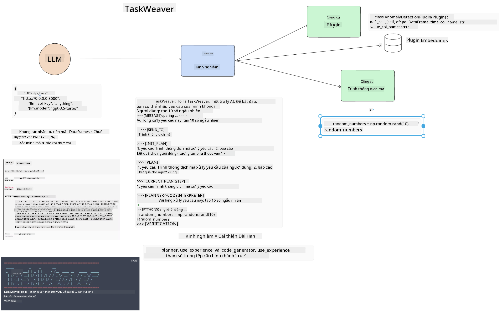
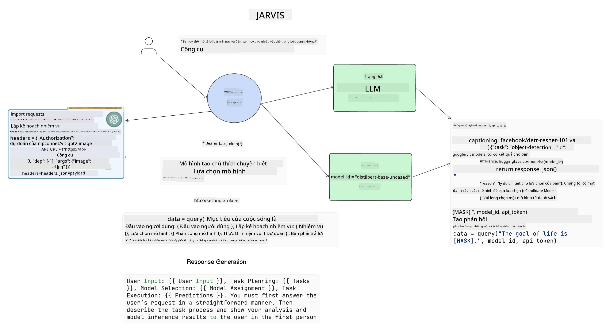

<!--
CO_OP_TRANSLATOR_METADATA:
{
  "original_hash": "8e8d1f6a63da606af7176a87ff8e92b6",
  "translation_date": "2025-10-17T20:39:57+00:00",
  "source_file": "17-ai-agents/README.md",
  "language_code": "vi"
}
-->
[](https://youtu.be/yAXVW-lUINc?si=bOtW9nL6jc3XJgOM)

## Giới thiệu

Các Tác nhân AI (AI Agents) đại diện cho một bước phát triển thú vị trong lĩnh vực AI Tạo sinh, cho phép các Mô hình Ngôn ngữ Lớn (LLMs) tiến hóa từ vai trò trợ lý thành các tác nhân có khả năng thực hiện hành động. Các khung làm việc của Tác nhân AI cho phép các nhà phát triển tạo ra các ứng dụng giúp LLMs truy cập vào các công cụ và quản lý trạng thái. Những khung làm việc này cũng tăng cường khả năng hiển thị, cho phép người dùng và nhà phát triển theo dõi các hành động mà LLMs dự định thực hiện, từ đó cải thiện việc quản lý trải nghiệm.

Bài học này sẽ bao gồm các nội dung sau:

- Hiểu Tác nhân AI là gì - Tác nhân AI thực sự là gì?
- Khám phá bốn khung làm việc Tác nhân AI khác nhau - Điều gì làm cho chúng trở nên độc đáo?
- Áp dụng các Tác nhân AI này vào các trường hợp sử dụng khác nhau - Khi nào nên sử dụng Tác nhân AI?

## Mục tiêu học tập

Sau khi hoàn thành bài học này, bạn sẽ có thể:

- Giải thích Tác nhân AI là gì và cách chúng có thể được sử dụng.
- Hiểu sự khác biệt giữa một số khung làm việc Tác nhân AI phổ biến và cách chúng khác nhau.
- Hiểu cách Tác nhân AI hoạt động để xây dựng các ứng dụng với chúng.

## Tác nhân AI là gì?

Tác nhân AI là một lĩnh vực rất thú vị trong thế giới AI Tạo sinh. Với sự thú vị này, đôi khi cũng có sự nhầm lẫn về thuật ngữ và cách áp dụng chúng. Để giữ mọi thứ đơn giản và bao gồm hầu hết các công cụ liên quan đến Tác nhân AI, chúng ta sẽ sử dụng định nghĩa sau:

Tác nhân AI cho phép Mô hình Ngôn ngữ Lớn (LLMs) thực hiện các nhiệm vụ bằng cách cung cấp cho chúng quyền truy cập vào **trạng thái** và **công cụ**.


Hãy định nghĩa các thuật ngữ này:

**Mô hình Ngôn ngữ Lớn** - Đây là các mô hình được đề cập trong suốt khóa học này như GPT-3.5, GPT-4, Llama-2, v.v.

**Trạng thái** - Đây là ngữ cảnh mà LLM đang làm việc. LLM sử dụng ngữ cảnh của các hành động trước đó và ngữ cảnh hiện tại để hướng dẫn việc ra quyết định cho các hành động tiếp theo. Các khung làm việc Tác nhân AI cho phép các nhà phát triển duy trì ngữ cảnh này dễ dàng hơn.

**Công cụ** - Để hoàn thành nhiệm vụ mà người dùng yêu cầu và LLM đã lên kế hoạch, LLM cần quyền truy cập vào các công cụ. Một số ví dụ về công cụ có thể là cơ sở dữ liệu, API, ứng dụng bên ngoài hoặc thậm chí là một LLM khác!

Những định nghĩa này hy vọng sẽ cung cấp cho bạn một nền tảng tốt để tiếp tục khám phá cách chúng được triển khai. Hãy cùng tìm hiểu một số khung làm việc Tác nhân AI khác nhau:

## LangChain Agents

[LangChain Agents](https://python.langchain.com/docs/how_to/#agents?WT.mc_id=academic-105485-koreyst) là một triển khai của các định nghĩa mà chúng ta đã cung cấp ở trên.

Để quản lý **trạng thái**, nó sử dụng một chức năng tích hợp gọi là `AgentExecutor`. Chức năng này chấp nhận `agent` đã được định nghĩa và các `tools` có sẵn cho nó.

`AgentExecutor` cũng lưu trữ lịch sử trò chuyện để cung cấp ngữ cảnh của cuộc trò chuyện.


LangChain cung cấp một [danh mục công cụ](https://integrations.langchain.com/tools?WT.mc_id=academic-105485-koreyst) có thể được nhập vào ứng dụng của bạn để LLM có thể truy cập. Những công cụ này được tạo bởi cộng đồng và đội ngũ LangChain.

Bạn có thể định nghĩa các công cụ này và truyền chúng vào `AgentExecutor`.

Khả năng hiển thị là một khía cạnh quan trọng khác khi nói về Tác nhân AI. Điều quan trọng đối với các nhà phát triển ứng dụng là hiểu công cụ nào LLM đang sử dụng và lý do. Để làm điều đó, đội ngũ tại LangChain đã phát triển LangSmith.

## AutoGen

Khung làm việc Tác nhân AI tiếp theo mà chúng ta sẽ thảo luận là [AutoGen](https://microsoft.github.io/autogen/?WT.mc_id=academic-105485-koreyst). Trọng tâm chính của AutoGen là các cuộc trò chuyện. Các tác nhân vừa **có thể trò chuyện** vừa **có thể tùy chỉnh**.

**Có thể trò chuyện -** LLMs có thể bắt đầu và tiếp tục một cuộc trò chuyện với một LLM khác để hoàn thành nhiệm vụ. Điều này được thực hiện bằng cách tạo `AssistantAgents` và cung cấp cho chúng một thông điệp hệ thống cụ thể.

```python

autogen.AssistantAgent( name="Coder", llm_config=llm_config, ) pm = autogen.AssistantAgent( name="Product_manager", system_message="Creative in software product ideas.", llm_config=llm_config, )

```

**Có thể tùy chỉnh** - Các tác nhân không chỉ được định nghĩa là LLMs mà còn có thể là người dùng hoặc công cụ. Là một nhà phát triển, bạn có thể định nghĩa một `UserProxyAgent` chịu trách nhiệm tương tác với người dùng để nhận phản hồi trong việc hoàn thành nhiệm vụ. Phản hồi này có thể tiếp tục thực hiện nhiệm vụ hoặc dừng lại.

```python
user_proxy = UserProxyAgent(name="user_proxy")
```

### Trạng thái và Công cụ

Để thay đổi và quản lý trạng thái, một Assistant Agent tạo mã Python để hoàn thành nhiệm vụ.

Dưới đây là một ví dụ về quy trình:


#### LLM được định nghĩa với một thông điệp hệ thống

```python
system_message="For weather related tasks, only use the functions you have been provided with. Reply TERMINATE when the task is done."
```

Thông điệp hệ thống này hướng dẫn LLM cụ thể này về các chức năng nào liên quan đến nhiệm vụ của nó. Hãy nhớ rằng, với AutoGen bạn có thể có nhiều AssistantAgents được định nghĩa với các thông điệp hệ thống khác nhau.

#### Cuộc trò chuyện được khởi tạo bởi người dùng

```python
user_proxy.initiate_chat( chatbot, message="I am planning a trip to NYC next week, can you help me pick out what to wear? ", )

```

Thông điệp này từ user_proxy (Người) là điều sẽ bắt đầu quá trình của Tác nhân để khám phá các chức năng có thể thực hiện.

#### Chức năng được thực thi

```bash
chatbot (to user_proxy):

***** Suggested tool Call: get_weather ***** Arguments: {"location":"New York City, NY","time_periond:"7","temperature_unit":"Celsius"} ******************************************************** --------------------------------------------------------------------------------

>>>>>>>> EXECUTING FUNCTION get_weather... user_proxy (to chatbot): ***** Response from calling function "get_weather" ***** 112.22727272727272 EUR ****************************************************************

```

Khi cuộc trò chuyện ban đầu được xử lý, Tác nhân sẽ gửi công cụ được đề xuất để gọi. Trong trường hợp này, đó là một chức năng gọi là `get_weather`. Tùy thuộc vào cấu hình của bạn, chức năng này có thể được thực thi tự động và đọc bởi Tác nhân hoặc có thể được thực thi dựa trên đầu vào của người dùng.

Bạn có thể tìm thấy danh sách [mẫu mã AutoGen](https://microsoft.github.io/autogen/docs/Examples/?WT.mc_id=academic-105485-koreyst) để khám phá thêm cách bắt đầu xây dựng.

## Taskweaver

Khung làm việc tác nhân tiếp theo mà chúng ta sẽ khám phá là [Taskweaver](https://microsoft.github.io/TaskWeaver/?WT.mc_id=academic-105485-koreyst). Nó được biết đến như một tác nhân "ưu tiên mã" vì thay vì làm việc nghiêm ngặt với `chuỗi`, nó có thể làm việc với DataFrames trong Python. Điều này trở nên cực kỳ hữu ích cho các nhiệm vụ phân tích và tạo dữ liệu. Điều này có thể bao gồm việc tạo biểu đồ và đồ thị hoặc tạo số ngẫu nhiên.

### Trạng thái và Công cụ

Để quản lý trạng thái của cuộc trò chuyện, TaskWeaver sử dụng khái niệm `Planner`. `Planner` là một LLM nhận yêu cầu từ người dùng và lập bản đồ các nhiệm vụ cần hoàn thành để đáp ứng yêu cầu này.

Để hoàn thành các nhiệm vụ, `Planner` được tiếp xúc với một tập hợp các công cụ gọi là `Plugins`. Đây có thể là các lớp Python hoặc một trình thông dịch mã chung. Các plugin này được lưu trữ dưới dạng embeddings để LLM có thể tìm kiếm plugin phù hợp tốt hơn.



Dưới đây là một ví dụ về plugin để xử lý phát hiện bất thường:

```python
class AnomalyDetectionPlugin(Plugin): def __call__(self, df: pd.DataFrame, time_col_name: str, value_col_name: str):
```

Mã được xác minh trước khi thực thi. Một tính năng khác để quản lý ngữ cảnh trong Taskweaver là `experience`. Experience cho phép ngữ cảnh của một cuộc trò chuyện được lưu trữ lâu dài trong một tệp YAML. Điều này có thể được cấu hình để LLM cải thiện theo thời gian trên các nhiệm vụ nhất định khi nó được tiếp xúc với các cuộc trò chuyện trước đó.

## JARVIS

Khung làm việc tác nhân cuối cùng mà chúng ta sẽ khám phá là [JARVIS](https://github.com/microsoft/JARVIS?tab=readme-ov-file?WT.mc_id=academic-105485-koreyst). Điều làm cho JARVIS trở nên độc đáo là nó sử dụng một LLM để quản lý `trạng thái` của cuộc trò chuyện và các `công cụ` là các mô hình AI khác. Mỗi mô hình AI là các mô hình chuyên biệt thực hiện các nhiệm vụ cụ thể như nhận diện đối tượng, chuyển đổi giọng nói thành văn bản hoặc chú thích hình ảnh.



LLM, là một mô hình đa năng, nhận yêu cầu từ người dùng và xác định nhiệm vụ cụ thể cũng như bất kỳ tham số/dữ liệu nào cần thiết để hoàn thành nhiệm vụ.

```python
[{"task": "object-detection", "id": 0, "dep": [-1], "args": {"image": "e1.jpg" }}]
```

LLM sau đó định dạng yêu cầu theo cách mà mô hình AI chuyên biệt có thể hiểu, chẳng hạn như JSON. Khi mô hình AI đã trả về dự đoán dựa trên nhiệm vụ, LLM nhận phản hồi.

Nếu cần nhiều mô hình để hoàn thành nhiệm vụ, nó cũng sẽ diễn giải phản hồi từ các mô hình đó trước khi kết hợp chúng lại để tạo ra phản hồi cho người dùng.

Ví dụ dưới đây cho thấy cách điều này hoạt động khi người dùng yêu cầu mô tả và số lượng các đối tượng trong một bức ảnh:

## Bài tập

Để tiếp tục học về Tác nhân AI, bạn có thể xây dựng với AutoGen:

- Một ứng dụng mô phỏng một cuộc họp kinh doanh với các phòng ban khác nhau của một startup giáo dục.
- Tạo các thông điệp hệ thống hướng dẫn LLMs hiểu các nhân vật và ưu tiên khác nhau, và cho phép người dùng trình bày ý tưởng sản phẩm mới.
- Sau đó, LLM sẽ tạo ra các câu hỏi tiếp theo từ mỗi phòng ban để tinh chỉnh và cải thiện ý tưởng sản phẩm.

## Học tập không dừng lại ở đây, tiếp tục hành trình

Sau khi hoàn thành bài học này, hãy xem bộ sưu tập [Học tập AI Tạo sinh](https://aka.ms/genai-collection?WT.mc_id=academic-105485-koreyst) của chúng tôi để tiếp tục nâng cao kiến thức về AI Tạo sinh!

---

**Tuyên bố miễn trừ trách nhiệm**:  
Tài liệu này đã được dịch bằng dịch vụ dịch thuật AI [Co-op Translator](https://github.com/Azure/co-op-translator). Mặc dù chúng tôi cố gắng đảm bảo độ chính xác, xin lưu ý rằng các bản dịch tự động có thể chứa lỗi hoặc không chính xác. Tài liệu gốc bằng ngôn ngữ bản địa nên được coi là nguồn thông tin chính thức. Đối với thông tin quan trọng, nên sử dụng dịch vụ dịch thuật chuyên nghiệp bởi con người. Chúng tôi không chịu trách nhiệm cho bất kỳ sự hiểu lầm hoặc diễn giải sai nào phát sinh từ việc sử dụng bản dịch này.