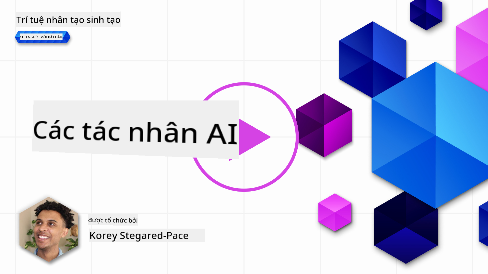
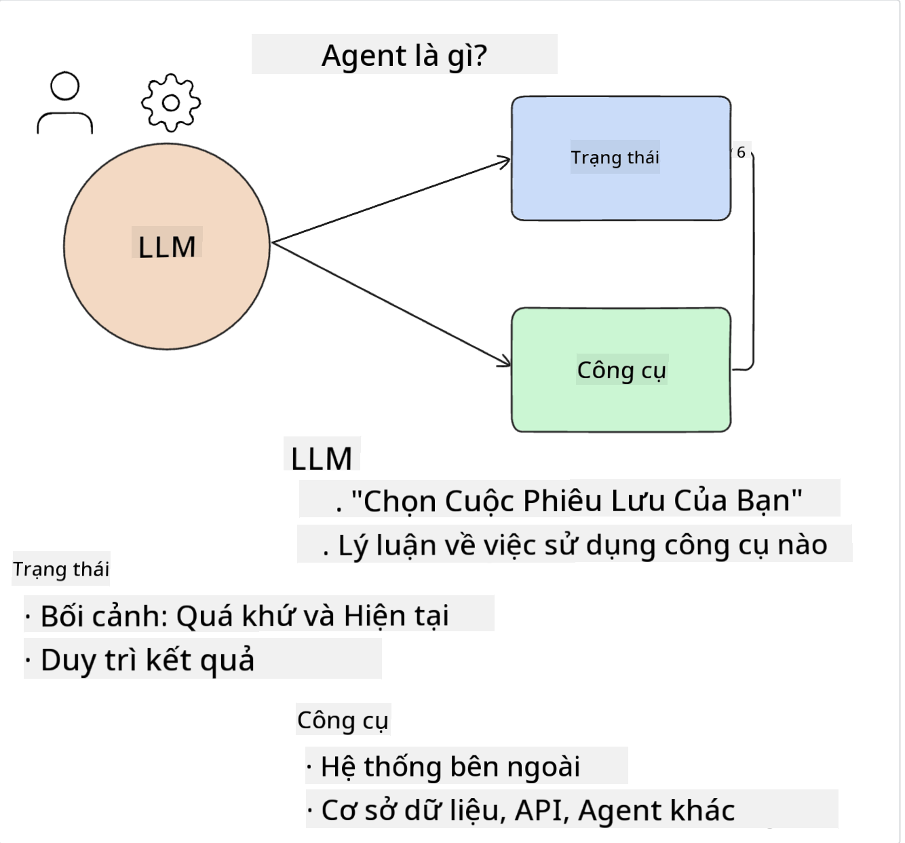
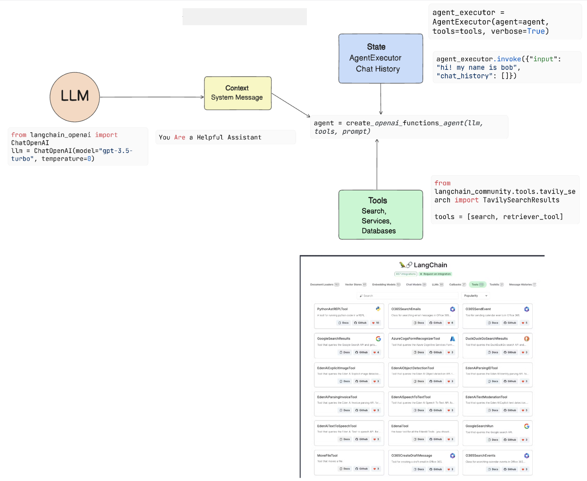
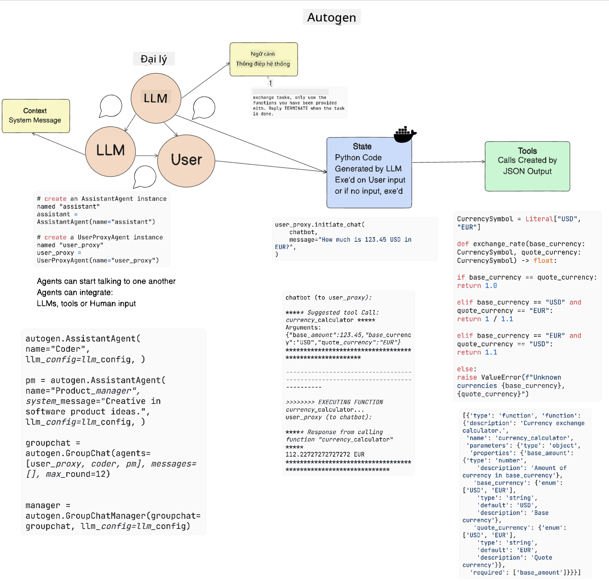

<!--
CO_OP_TRANSLATOR_METADATA:
{
  "original_hash": "11f03c81f190d9cbafd0f977dcbede6c",
  "translation_date": "2025-07-09T17:28:18+00:00",
  "source_file": "17-ai-agents/README.md",
  "language_code": "vi"
}
-->
[](https://aka.ms/gen-ai-lesson17-gh?WT.mc_id=academic-105485-koreyst)

## Giới thiệu

AI Agents là một bước phát triển thú vị trong lĩnh vực Generative AI, cho phép các Large Language Models (LLMs) tiến hóa từ trợ lý thành các agent có khả năng thực hiện hành động. Các framework AI Agent giúp các nhà phát triển tạo ra các ứng dụng cho phép LLM truy cập vào công cụ và quản lý trạng thái. Những framework này cũng tăng cường khả năng quan sát, giúp người dùng và nhà phát triển theo dõi các hành động mà LLM dự định thực hiện, từ đó cải thiện trải nghiệm người dùng.

Bài học sẽ bao gồm các nội dung sau:

- Hiểu AI Agent là gì - AI Agent thực sự là gì?
- Khám phá bốn framework AI Agent khác nhau - Điều gì làm chúng trở nên độc đáo?
- Áp dụng các AI Agent này vào các trường hợp sử dụng khác nhau - Khi nào nên sử dụng AI Agents?

## Mục tiêu học tập

Sau khi hoàn thành bài học này, bạn sẽ có thể:

- Giải thích AI Agents là gì và cách sử dụng chúng.
- Hiểu được sự khác biệt giữa một số framework AI Agent phổ biến và cách chúng khác nhau.
- Hiểu cách hoạt động của AI Agents để xây dựng ứng dụng với chúng.

## AI Agents là gì?

AI Agents là một lĩnh vực rất thú vị trong thế giới Generative AI. Sự hứng khởi này đôi khi cũng gây ra sự nhầm lẫn về thuật ngữ và cách áp dụng. Để đơn giản và bao quát hầu hết các công cụ gọi là AI Agents, chúng ta sẽ sử dụng định nghĩa sau:

AI Agents cho phép Large Language Models (LLMs) thực hiện các nhiệm vụ bằng cách cung cấp cho chúng quyền truy cập vào **trạng thái** và **công cụ**.



Hãy định nghĩa các thuật ngữ này:

**Large Language Models** - Đây là các mô hình được nhắc đến trong khóa học này như GPT-3.5, GPT-4, Llama-2, v.v.

**Trạng thái** - Đây là ngữ cảnh mà LLM đang làm việc. LLM sử dụng ngữ cảnh từ các hành động trước đó và ngữ cảnh hiện tại để hướng dẫn quyết định cho các hành động tiếp theo. Các framework AI Agent giúp các nhà phát triển duy trì ngữ cảnh này dễ dàng hơn.

**Công cụ** - Để hoàn thành nhiệm vụ mà người dùng yêu cầu và LLM đã lên kế hoạch, LLM cần truy cập vào các công cụ. Ví dụ về công cụ có thể là cơ sở dữ liệu, API, ứng dụng bên ngoài hoặc thậm chí là một LLM khác!

Những định nghĩa này hy vọng sẽ giúp bạn có nền tảng vững chắc khi chúng ta xem xét cách chúng được triển khai. Hãy cùng khám phá một số framework AI Agent khác nhau:

## LangChain Agents

[LangChain Agents](https://python.langchain.com/docs/how_to/#agents?WT.mc_id=academic-105485-koreyst) là một triển khai của các định nghĩa mà chúng ta đã đưa ra ở trên.

Để quản lý **trạng thái**, nó sử dụng một hàm tích hợp gọi là `AgentExecutor`. Hàm này nhận vào `agent` đã được định nghĩa và các `tools` mà agent có thể sử dụng.

`AgentExecutor` cũng lưu trữ lịch sử trò chuyện để cung cấp ngữ cảnh cho cuộc hội thoại.



LangChain cung cấp một [danh mục công cụ](https://integrations.langchain.com/tools?WT.mc_id=academic-105485-koreyst) có thể được nhập vào ứng dụng của bạn để LLM có thể truy cập. Những công cụ này được tạo ra bởi cộng đồng và đội ngũ LangChain.

Bạn có thể định nghĩa các công cụ này và truyền chúng vào `AgentExecutor`.

Khả năng quan sát cũng là một khía cạnh quan trọng khi nói về AI Agents. Các nhà phát triển ứng dụng cần hiểu LLM đang sử dụng công cụ nào và vì sao. Vì vậy, đội ngũ LangChain đã phát triển LangSmith.

## AutoGen

Framework AI Agent tiếp theo chúng ta sẽ thảo luận là [AutoGen](https://microsoft.github.io/autogen/?WT.mc_id=academic-105485-koreyst). Trọng tâm chính của AutoGen là các cuộc hội thoại. Các agent vừa **có thể trò chuyện** vừa **có thể tùy chỉnh**.

**Có thể trò chuyện -** LLM có thể bắt đầu và tiếp tục cuộc trò chuyện với một LLM khác để hoàn thành nhiệm vụ. Điều này được thực hiện bằng cách tạo `AssistantAgents` và cung cấp cho chúng một thông điệp hệ thống cụ thể.

```python

autogen.AssistantAgent( name="Coder", llm_config=llm_config, ) pm = autogen.AssistantAgent( name="Product_manager", system_message="Creative in software product ideas.", llm_config=llm_config, )

```

**Có thể tùy chỉnh** - Agent không chỉ được định nghĩa là LLM mà còn có thể là người dùng hoặc công cụ. Là nhà phát triển, bạn có thể định nghĩa một `UserProxyAgent` chịu trách nhiệm tương tác với người dùng để lấy phản hồi trong quá trình hoàn thành nhiệm vụ. Phản hồi này có thể tiếp tục thực hiện nhiệm vụ hoặc dừng lại.

```python
user_proxy = UserProxyAgent(name="user_proxy")
```

### Trạng thái và Công cụ

Để thay đổi và quản lý trạng thái, một assistant Agent sẽ tạo ra mã Python để hoàn thành nhiệm vụ.

Dưới đây là ví dụ về quy trình:



#### LLM được định nghĩa với Thông điệp Hệ thống

```python
system_message="For weather related tasks, only use the functions you have been provided with. Reply TERMINATE when the task is done."
```

Thông điệp hệ thống này hướng dẫn LLM cụ thể này biết các hàm nào liên quan đến nhiệm vụ của nó. Hãy nhớ rằng, với AutoGen bạn có thể có nhiều AssistantAgents được định nghĩa với các thông điệp hệ thống khác nhau.

#### Cuộc trò chuyện được bắt đầu bởi Người dùng

```python
user_proxy.initiate_chat( chatbot, message="I am planning a trip to NYC next week, can you help me pick out what to wear? ", )

```

Thông điệp này từ user_proxy (con người) sẽ khởi động quá trình Agent khám phá các hàm có thể thực thi.

#### Hàm được thực thi

```bash
chatbot (to user_proxy):

***** Suggested tool Call: get_weather ***** Arguments: {"location":"New York City, NY","time_periond:"7","temperature_unit":"Celsius"} ******************************************************** --------------------------------------------------------------------------------

>>>>>>>> EXECUTING FUNCTION get_weather... user_proxy (to chatbot): ***** Response from calling function "get_weather" ***** 112.22727272727272 EUR ****************************************************************

```

Khi cuộc trò chuyện ban đầu được xử lý, Agent sẽ gửi công cụ đề xuất để gọi. Trong trường hợp này là hàm `get_weather`. Tùy cấu hình, hàm này có thể được thực thi tự động và đọc bởi Agent hoặc được thực thi dựa trên đầu vào của người dùng.

Bạn có thể tìm danh sách [ví dụ mã AutoGen](https://microsoft.github.io/autogen/docs/Examples/?WT.mc_id=academic-105485-koreyst) để khám phá thêm cách bắt đầu xây dựng.

## Taskweaver

Framework agent tiếp theo chúng ta sẽ khám phá là [Taskweaver](https://microsoft.github.io/TaskWeaver/?WT.mc_id=academic-105485-koreyst). Nó được biết đến như một agent "code-first" vì thay vì làm việc chỉ với `strings`, nó có thể làm việc với DataFrames trong Python. Điều này rất hữu ích cho các tác vụ phân tích và tạo dữ liệu. Ví dụ như tạo biểu đồ, đồ thị hoặc sinh số ngẫu nhiên.

### Trạng thái và Công cụ

Để quản lý trạng thái cuộc trò chuyện, TaskWeaver sử dụng khái niệm `Planner`. `Planner` là một LLM nhận yêu cầu từ người dùng và lập kế hoạch các nhiệm vụ cần hoàn thành để đáp ứng yêu cầu đó.

Để hoàn thành các nhiệm vụ, `Planner` được tiếp cận với bộ công cụ gọi là `Plugins`. Đây có thể là các lớp Python hoặc một trình thông dịch mã chung. Các plugin này được lưu dưới dạng embeddings để LLM có thể tìm kiếm plugin phù hợp dễ dàng hơn.


Dưới đây là ví dụ về một plugin xử lý phát hiện bất thường:

```python
class AnomalyDetectionPlugin(Plugin): def __call__(self, df: pd.DataFrame, time_col_name: str, value_col_name: str):
```

Mã được kiểm tra trước khi thực thi. Một tính năng khác để quản lý ngữ cảnh trong Taskweaver là `experience`. Experience cho phép lưu trữ ngữ cảnh cuộc trò chuyện lâu dài trong một file YAML. Điều này có thể được cấu hình để LLM cải thiện theo thời gian với các nhiệm vụ nhất định khi được tiếp xúc với các cuộc trò chuyện trước đó.

## JARVIS

Framework agent cuối cùng chúng ta sẽ khám phá là [JARVIS](https://github.com/microsoft/JARVIS?tab=readme-ov-file?WT.mc_id=academic-105485-koreyst). Điều làm JARVIS khác biệt là nó sử dụng một LLM để quản lý `trạng thái` của cuộc trò chuyện và `công cụ` là các mô hình AI khác. Mỗi mô hình AI này là các mô hình chuyên biệt thực hiện các nhiệm vụ như phát hiện đối tượng, chuyển đổi giọng nói thành văn bản hoặc chú thích hình ảnh.


LLM, với vai trò là mô hình đa năng, nhận yêu cầu từ người dùng và xác định nhiệm vụ cụ thể cùng các tham số/dữ liệu cần thiết để hoàn thành nhiệm vụ.

```python
[{"task": "object-detection", "id": 0, "dep": [-1], "args": {"image": "e1.jpg" }}]
```

LLM sau đó định dạng yêu cầu theo cách mà mô hình AI chuyên biệt có thể hiểu được, ví dụ như JSON. Khi mô hình AI trả về dự đoán dựa trên nhiệm vụ, LLM sẽ nhận phản hồi đó.

Nếu cần nhiều mô hình để hoàn thành nhiệm vụ, LLM cũng sẽ giải thích phản hồi từ các mô hình đó trước khi tổng hợp lại để tạo ra câu trả lời cho người dùng.

Ví dụ dưới đây cho thấy cách hoạt động khi người dùng yêu cầu mô tả và đếm các đối tượng trong một bức ảnh:

## Bài tập

Để tiếp tục học về AI Agents, bạn có thể xây dựng với AutoGen:

- Một ứng dụng mô phỏng cuộc họp kinh doanh với các phòng ban khác nhau của một startup giáo dục.
- Tạo các thông điệp hệ thống hướng dẫn LLM hiểu các nhân vật và ưu tiên khác nhau, đồng thời cho phép người dùng trình bày ý tưởng sản phẩm mới.
- LLM sau đó sẽ tạo ra các câu hỏi tiếp theo từ mỗi phòng ban để hoàn thiện và cải tiến ý tưởng trình bày và sản phẩm.

## Học tập không dừng lại ở đây, hãy tiếp tục hành trình

Sau khi hoàn thành bài học này, hãy xem bộ sưu tập [Generative AI Learning](https://aka.ms/genai-collection?WT.mc_id=academic-105485-koreyst) của chúng tôi để tiếp tục nâng cao kiến thức về Generative AI!

**Tuyên bố từ chối trách nhiệm**:  
Tài liệu này đã được dịch bằng dịch vụ dịch thuật AI [Co-op Translator](https://github.com/Azure/co-op-translator). Mặc dù chúng tôi cố gắng đảm bảo độ chính xác, xin lưu ý rằng các bản dịch tự động có thể chứa lỗi hoặc không chính xác. Tài liệu gốc bằng ngôn ngữ gốc của nó nên được coi là nguồn chính xác và đáng tin cậy. Đối với các thông tin quan trọng, nên sử dụng dịch vụ dịch thuật chuyên nghiệp do con người thực hiện. Chúng tôi không chịu trách nhiệm về bất kỳ sự hiểu lầm hoặc giải thích sai nào phát sinh từ việc sử dụng bản dịch này.