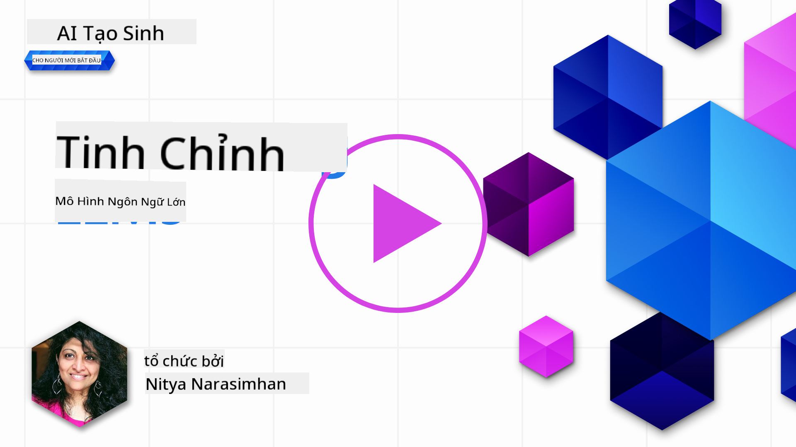
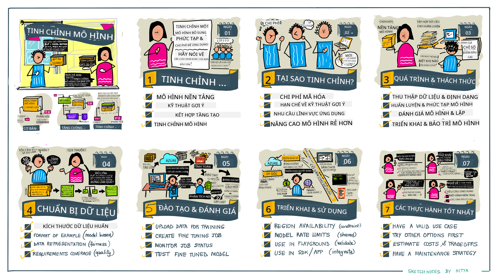

<!--
CO_OP_TRANSLATOR_METADATA:
{
  "original_hash": "68664f7e754a892ae1d8d5e2b7bd2081",
  "translation_date": "2025-07-09T17:46:18+00:00",
  "source_file": "18-fine-tuning/README.md",
  "language_code": "vi"
}
-->

# Tinh Chỉnh Mô Hình Ngôn Ngữ Lớn (LLM) Của Bạn

Việc sử dụng các mô hình ngôn ngữ lớn để xây dựng các ứng dụng AI tạo sinh đi kèm với những thách thức mới. Một vấn đề then chốt là đảm bảo chất lượng phản hồi (độ chính xác và sự phù hợp) trong nội dung do mô hình tạo ra cho một yêu cầu cụ thể của người dùng. Trong các bài học trước, chúng ta đã thảo luận về các kỹ thuật như kỹ thuật prompt và tạo sinh tăng cường truy xuất nhằm giải quyết vấn đề bằng cách _thay đổi đầu vào prompt_ cho mô hình hiện có.

Trong bài học hôm nay, chúng ta sẽ tìm hiểu kỹ thuật thứ ba, **tinh chỉnh (fine-tuning)**, nhằm giải quyết thách thức này bằng cách _huấn luyện lại chính mô hình_ với dữ liệu bổ sung. Hãy cùng khám phá chi tiết.

## Mục Tiêu Học Tập

Bài học này giới thiệu khái niệm tinh chỉnh cho các mô hình ngôn ngữ đã được huấn luyện trước, khám phá lợi ích và thách thức của phương pháp này, đồng thời cung cấp hướng dẫn về khi nào và cách sử dụng tinh chỉnh để cải thiện hiệu suất của các mô hình AI tạo sinh.

Kết thúc bài học, bạn sẽ có thể trả lời các câu hỏi sau:

- Tinh chỉnh mô hình ngôn ngữ là gì?
- Khi nào và tại sao nên sử dụng tinh chỉnh?
- Làm thế nào để tinh chỉnh một mô hình đã được huấn luyện trước?
- Những hạn chế của việc tinh chỉnh là gì?

Sẵn sàng chưa? Bắt đầu thôi.

## Hướng Dẫn Minh Họa

Muốn có cái nhìn tổng quan về những gì chúng ta sẽ học trước khi đi sâu? Hãy xem hướng dẫn minh họa này mô tả hành trình học tập cho bài học - từ việc tìm hiểu các khái niệm cốt lõi và động lực của tinh chỉnh, đến hiểu quy trình và các thực hành tốt nhất để thực hiện nhiệm vụ tinh chỉnh. Đây là một chủ đề thú vị để khám phá, đừng quên ghé thăm trang [Tài Nguyên](./RESOURCES.md?WT.mc_id=academic-105485-koreyst) để có thêm các liên kết hỗ trợ hành trình tự học của bạn!

## Tinh Chỉnh Mô Hình Ngôn Ngữ Là Gì?

Theo định nghĩa, các mô hình ngôn ngữ lớn được _huấn luyện trước_ trên một lượng lớn văn bản lấy từ nhiều nguồn đa dạng, bao gồm cả internet. Như chúng ta đã học trong các bài trước, cần có các kỹ thuật như _kỹ thuật prompt_ và _tạo sinh tăng cường truy xuất_ để cải thiện chất lượng phản hồi của mô hình đối với các câu hỏi ("prompt") của người dùng.

Một kỹ thuật phổ biến trong kỹ thuật prompt là cung cấp cho mô hình nhiều hướng dẫn hơn về những gì mong đợi trong phản hồi, bằng cách đưa ra _hướng dẫn rõ ràng_ (explicit guidance) hoặc _cho mô hình một vài ví dụ_ (implicit guidance). Đây gọi là _học ít ví dụ (few-shot learning)_, nhưng có hai hạn chế:

- Giới hạn số token của mô hình có thể hạn chế số lượng ví dụ bạn có thể cung cấp, làm giảm hiệu quả.
- Chi phí token của mô hình có thể khiến việc thêm ví dụ vào mỗi prompt trở nên tốn kém, hạn chế tính linh hoạt.

Tinh chỉnh là một phương pháp phổ biến trong hệ thống học máy, nơi ta lấy một mô hình đã được huấn luyện trước và huấn luyện lại với dữ liệu mới để cải thiện hiệu suất trên một nhiệm vụ cụ thể. Trong bối cảnh mô hình ngôn ngữ, ta có thể tinh chỉnh mô hình đã huấn luyện trước _với một tập ví dụ được tuyển chọn cho một nhiệm vụ hoặc lĩnh vực ứng dụng cụ thể_ để tạo ra một **mô hình tùy chỉnh** có thể chính xác và phù hợp hơn cho nhiệm vụ hoặc lĩnh vực đó. Một lợi ích phụ của tinh chỉnh là nó cũng có thể giảm số lượng ví dụ cần thiết cho học ít ví dụ - giảm sử dụng token và chi phí liên quan.

## Khi Nào Và Tại Sao Nên Tinh Chỉnh Mô Hình?

Trong _bối cảnh này_, khi nói về tinh chỉnh, chúng ta đang đề cập đến **tinh chỉnh có giám sát (supervised fine-tuning)**, trong đó việc huấn luyện lại được thực hiện bằng cách **thêm dữ liệu mới** không có trong bộ dữ liệu huấn luyện gốc. Điều này khác với phương pháp tinh chỉnh không giám sát, nơi mô hình được huấn luyện lại trên dữ liệu gốc nhưng với các siêu tham số khác nhau.

Điều quan trọng cần nhớ là tinh chỉnh là một kỹ thuật nâng cao, đòi hỏi trình độ chuyên môn nhất định để đạt được kết quả mong muốn. Nếu làm không đúng, nó có thể không mang lại cải thiện như kỳ vọng, thậm chí làm giảm hiệu suất của mô hình cho lĩnh vực mục tiêu.

Vì vậy, trước khi học "cách" tinh chỉnh mô hình ngôn ngữ, bạn cần biết "tại sao" nên chọn con đường này, và "khi nào" bắt đầu quá trình tinh chỉnh. Hãy bắt đầu bằng cách tự hỏi những câu hỏi sau:

- **Trường hợp sử dụng**: Trường hợp sử dụng _của bạn_ cho việc tinh chỉnh là gì? Bạn muốn cải thiện khía cạnh nào của mô hình đã huấn luyện trước hiện tại?
- **Phương án thay thế**: Bạn đã thử _các kỹ thuật khác_ để đạt được kết quả mong muốn chưa? Hãy dùng chúng làm chuẩn để so sánh.
  - Kỹ thuật prompt: Thử các kỹ thuật như few-shot prompting với ví dụ về các phản hồi prompt phù hợp. Đánh giá chất lượng phản hồi.
  - Tạo sinh tăng cường truy xuất: Thử bổ sung prompt với kết quả truy vấn được tìm kiếm từ dữ liệu của bạn. Đánh giá chất lượng phản hồi.
- **Chi phí**: Bạn đã xác định được chi phí cho việc tinh chỉnh chưa?
  - Khả năng tinh chỉnh - mô hình đã huấn luyện trước có sẵn để tinh chỉnh không?
  - Công sức - chuẩn bị dữ liệu huấn luyện, đánh giá & tinh chỉnh mô hình.
  - Tính toán - chạy các công việc tinh chỉnh và triển khai mô hình đã tinh chỉnh.
  - Dữ liệu - có đủ ví dụ chất lượng để tinh chỉnh có hiệu quả không?
- **Lợi ích**: Bạn đã xác nhận được lợi ích của việc tinh chỉnh chưa?
  - Chất lượng - mô hình đã tinh chỉnh có vượt trội hơn so với chuẩn không?
  - Chi phí - có giảm sử dụng token bằng cách đơn giản hóa prompt không?
  - Khả năng mở rộng - bạn có thể tái sử dụng mô hình gốc cho các lĩnh vực mới không?

Bằng cách trả lời những câu hỏi này, bạn sẽ quyết định được liệu tinh chỉnh có phải là phương án phù hợp cho trường hợp sử dụng của bạn hay không. Lý tưởng nhất, phương án này chỉ hợp lý khi lợi ích vượt trội hơn chi phí. Khi đã quyết định tiến hành, đã đến lúc nghĩ về _cách_ bạn có thể tinh chỉnh mô hình đã huấn luyện trước.

Muốn có thêm góc nhìn về quá trình ra quyết định? Xem video [To fine-tune or not to fine-tune](https://www.youtube.com/watch?v=0Jo-z-MFxJs)

## Làm Thế Nào Để Tinh Chỉnh Một Mô Hình Đã Huấn Luyện Trước?

Để tinh chỉnh một mô hình đã huấn luyện trước, bạn cần có:

- một mô hình đã huấn luyện trước để tinh chỉnh
- một bộ dữ liệu dùng cho việc tinh chỉnh
- một môi trường huấn luyện để chạy công việc tinh chỉnh
- một môi trường lưu trữ để triển khai mô hình đã tinh chỉnh

## Tinh Chỉnh Thực Tế

Các tài nguyên dưới đây cung cấp các hướng dẫn từng bước giúp bạn thực hành với một ví dụ thực tế sử dụng một mô hình được chọn cùng bộ dữ liệu tuyển chọn. Để làm theo các hướng dẫn này, bạn cần có tài khoản trên nhà cung cấp tương ứng, cùng quyền truy cập vào mô hình và bộ dữ liệu liên quan.

| Nhà Cung Cấp | Hướng Dẫn                                                                                                                                                                    | Mô Tả                                                                                                                                                                                                                                                                                                                                                              |
| ------------ | --------------------------------------------------------------------------------------------------------------------------------------------------------------------------- | ------------------------------------------------------------------------------------------------------------------------------------------------------------------------------------------------------------------------------------------------------------------------------------------------------------------------------------------------------------------ |
| OpenAI       | [How to fine-tune chat models](https://github.com/openai/openai-cookbook/blob/main/examples/How_to_finetune_chat_models.ipynb?WT.mc_id=academic-105485-koreyst)             | Học cách tinh chỉnh `gpt-35-turbo` cho một lĩnh vực cụ thể ("trợ lý công thức nấu ăn") bằng cách chuẩn bị dữ liệu huấn luyện, chạy công việc tinh chỉnh và sử dụng mô hình đã tinh chỉnh để suy luận.                                                                                                                                                            |
| Azure OpenAI | [GPT 3.5 Turbo fine-tuning tutorial](https://learn.microsoft.com/azure/ai-services/openai/tutorials/fine-tune?tabs=python-new%2Ccommand-line?WT.mc_id=academic-105485-koreyst) | Học cách tinh chỉnh mô hình `gpt-35-turbo-0613` **trên Azure** bằng cách tạo & tải lên dữ liệu huấn luyện, chạy công việc tinh chỉnh, triển khai và sử dụng mô hình mới.                                                                                                                                                                                        |
| Hugging Face | [Fine-tuning LLMs with Hugging Face](https://www.philschmid.de/fine-tune-llms-in-2024-with-trl?WT.mc_id=academic-105485-koreyst)                                          | Bài viết hướng dẫn bạn tinh chỉnh một _mô hình LLM mở_ (ví dụ: `CodeLlama 7B`) sử dụng thư viện [transformers](https://huggingface.co/docs/transformers/index?WT.mc_id=academic-105485-koreyst) & [Transformer Reinforcement Learning (TRL)](https://huggingface.co/docs/trl/index?WT.mc_id=academic-105485-koreyst) cùng các [bộ dữ liệu](https://huggingface.co/docs/datasets/index?WT.mc_id=academic-105485-koreyst) trên Hugging Face. |
|              |                                                                                                                                                                             |                                                                                                                                                                                                                                                                                                                                                                    |
| 🤗 AutoTrain | [Fine-tuning LLMs with AutoTrain](https://github.com/huggingface/autotrain-advanced/?WT.mc_id=academic-105485-koreyst)                                                    | AutoTrain (hay AutoTrain Advanced) là thư viện python do Hugging Face phát triển, cho phép tinh chỉnh nhiều nhiệm vụ khác nhau bao gồm tinh chỉnh LLM. AutoTrain là giải pháp không cần code, có thể tinh chỉnh trên đám mây của bạn, trên Hugging Face Spaces hoặc cục bộ. Hỗ trợ giao diện web, CLI và huấn luyện qua file cấu hình yaml.                                  |
|              |                                                                                                                                                                             |                                                                                                                                                                                                                                                                                                                                                                    |

## Bài Tập

Chọn một trong các hướng dẫn trên và thực hành theo. _Chúng tôi có thể tái hiện phiên bản các hướng dẫn này trong Jupyter Notebooks trong kho lưu trữ này chỉ để tham khảo. Vui lòng sử dụng nguồn gốc chính thức để có phiên bản mới nhất_.

## Làm Tốt Lắm! Tiếp Tục Học Hỏi

Sau khi hoàn thành bài học này, hãy khám phá bộ sưu tập [Generative AI Learning collection](https://aka.ms/genai-collection?WT.mc_id=academic-105485-koreyst) để tiếp tục nâng cao kiến thức về AI tạo sinh!

Chúc mừng!! Bạn đã hoàn thành bài học cuối cùng trong chuỗi v2 của khóa học này! Đừng ngừng học hỏi và xây dựng. \*\*Hãy xem trang [TÀI NGUYÊN](RESOURCES.md?WT.mc_id=academic-105485-koreyst) để có danh sách các đề xuất bổ sung chỉ dành cho chủ đề này.

Chuỗi bài học v1 của chúng tôi cũng đã được cập nhật với nhiều bài tập và khái niệm hơn. Hãy dành chút thời gian làm mới kiến thức - và vui lòng [chia sẻ câu hỏi và phản hồi của bạn](https://github.com/microsoft/generative-ai-for-beginners/issues?WT.mc_id=academic-105485-koreyst) để giúp chúng tôi cải thiện các bài học này cho cộng đồng.

**Tuyên bố từ chối trách nhiệm**:  
Tài liệu này đã được dịch bằng dịch vụ dịch thuật AI [Co-op Translator](https://github.com/Azure/co-op-translator). Mặc dù chúng tôi cố gắng đảm bảo độ chính xác, xin lưu ý rằng các bản dịch tự động có thể chứa lỗi hoặc không chính xác. Tài liệu gốc bằng ngôn ngữ gốc của nó nên được coi là nguồn chính xác và đáng tin cậy. Đối với các thông tin quan trọng, nên sử dụng dịch vụ dịch thuật chuyên nghiệp do con người thực hiện. Chúng tôi không chịu trách nhiệm về bất kỳ sự hiểu lầm hoặc giải thích sai nào phát sinh từ việc sử dụng bản dịch này.